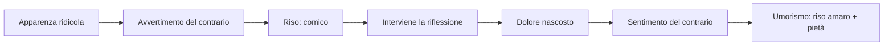
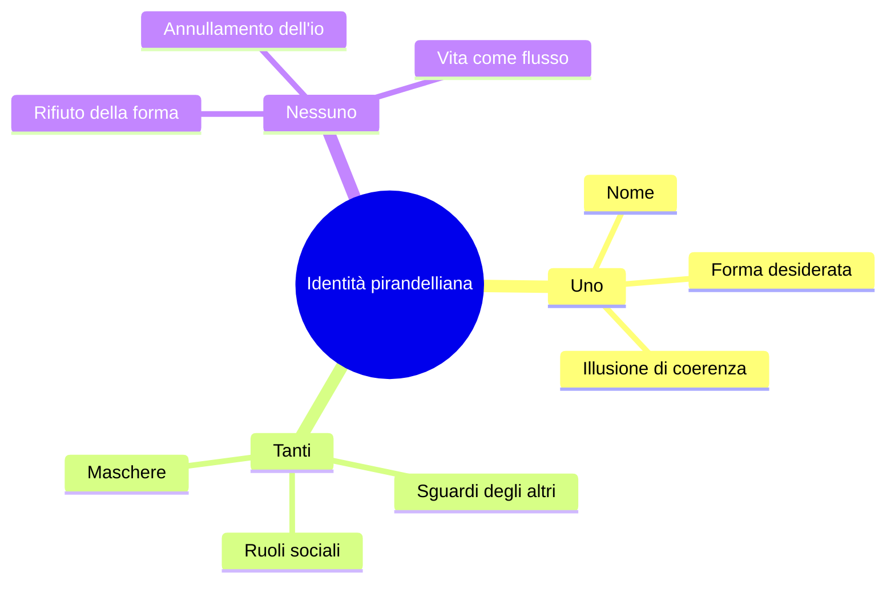
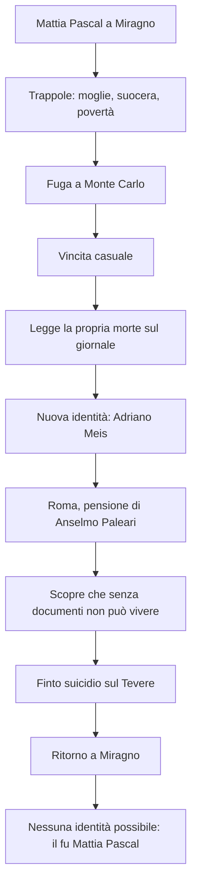
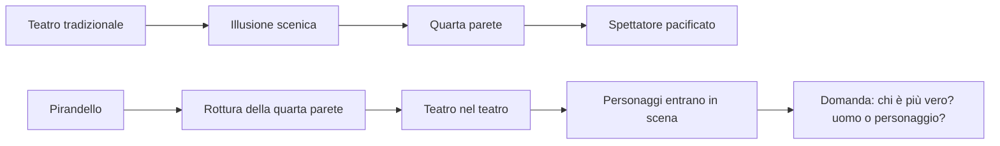
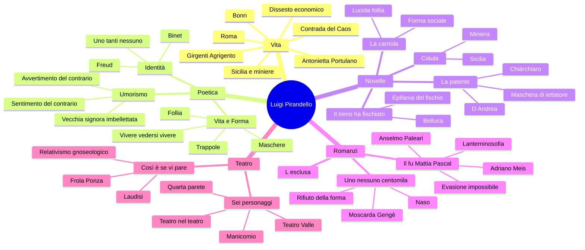

# Luigi Pirandello

---

## Coordinate essenziali

| Elemento | Dettaglio |
|----------|-----------|
| **Nome** | Luigi Pirandello |
| **Nascita** | 1867, **Girgenti** (oggi Agrigento), in Sicilia, nella **contrada del Caos** |
| **Morte** | 1936, Roma |
| **Luoghi decisivi** | Sicilia · Bonn · Roma |
| **Professione** | Scrittore e professore alla Facoltà di Magistero di Roma |
| **Famiglia** | Sposa **Antonietta Portulano**, colpita da gravi crisi nervose e poi ricoverata |
| **Crisi economica** | Dissesto legato all'allagamento delle **miniere di zolfo** del padre e alla perdita della dote della moglie |
| **Produzione** | Novelle, romanzi, saggistica, teatro |
| **Opere chiave** | *L'umorismo* · *Novelle per un anno* · *Il fu Mattia Pascal* · *Uno, nessuno e centomila* · *Così è (se vi pare)* · *Sei personaggi in cerca d'autore* |

---

## 1. Vita, luoghi e produzione

### 1.1 Girgenti, Sicilia, contrada del Caos

Pirandello nasce a **Girgenti**, nome antico di Agrigento, in Sicilia, nella **contrada del Caos**. Il dato biografico ha anche valore simbolico: il "Caos" richiama bene un autore che smonta le certezze dell'identità, della verità e della realtà.

La Sicilia resta un legame profondo: è il luogo dell'infanzia e della giovinezza, ma anche uno spazio narrativo che ritorna in molte novelle. Un richiamo utile è ***Ciàula scopre la luna***: Ciàula è un caruso, un giovane minatore, vicino per ambiente a *Rosso Malpelo*, abituato alla cava chiusa, faticosa e pericolosa.

> [!note] Dalla lezione
> La docente insiste su Girgenti/Agrigento e sulla contrada del Caos come luoghi non solo biografici, ma quasi simbolici. Ricorda anche *Ciàula scopre la luna* per il legame tra Sicilia, miniere e immaginario pirandelliano.

### 1.2 Bonn, Roma, Antonietta Portulano

Pirandello studia anche a **Bonn**, in Germania, dove discute una tesi filologica sul dialetto agrigentino. Poi vive a **Roma**, dove scrive e insegna alla Facoltà di Magistero.

Sposa **Antonietta Portulano**, donna affetta da gravi disturbi nervosi. La sua gelosia patologica, fino ad accuse gravissime e irrazionali, conduce infine al ricovero. Questo dato non è solo privato: la **follia** diventa uno dei grandi temi dell'opera pirandelliana.

### 1.3 Il dissesto economico e la scrittura

Il dissesto economico arriva quando le **miniere di zolfo** del padre, in Sicilia, si allagano: va perduta anche la dote della moglie. Pirandello deve aumentare le entrate e scrive anche per necessità materiale. *Il fu Mattia Pascal* nasce in questa fase, scritto a puntate mentre assiste la moglie malata.

La sua produzione è vastissima:

| Ambito | Opere / caratteristiche |
|--------|-------------------------|
| **Saggistica** | *L'umorismo* (1908), testo teorico fondamentale |
| **Novelle** | Raccolte nel corpus delle *Novelle per un anno* |
| **Romanzi** | *L'esclusa*, *Il fu Mattia Pascal*, *Uno, nessuno e centomila* |
| **Teatro** | Drammaturgia rivoluzionaria: da *Così è (se vi pare)* a *Sei personaggi in cerca d'autore* |

### 1.4 Cronologia essenziale

| Anno | Evento / opera |
|------|----------------|
| **1867** | Nasce a Girgenti, nella contrada del Caos |
| **Bonn** | Discute la tesi sul dialetto agrigentino |
| **Roma** | Scrive e insegna alla Facoltà di Magistero |
| **1903-1904** | *Il fu Mattia Pascal*: pubblicazione a puntate e poi in volume |
| **1908** | Pubblica il saggio *L'umorismo* |
| **1917** | *Così è (se vi pare)* |
| **1921** | *Sei personaggi in cerca d'autore*, prima al Teatro Valle di Roma |
| **1926** | *Uno, nessuno e centomila* |
| **1936** | Muore a Roma |

---

## 2. *L'umorismo*: scomporre il reale

### 2.1 Il saggio del 1908

Nel 1908 Pirandello pubblica ***L'umorismo***, testo teorico decisivo perché illumina gran parte della sua produzione. L'arte, per Pirandello, non deve fermarsi alla superficie: deve **scomporre il reale**, cioè smontare le apparenze, le convenzioni, le false certezze e le ipocrisie del vivere sociale.

Questo atteggiamento si inserisce nel clima del **Decadentismo**, perché rifiuta l'idea positivistica di una realtà semplice, oggettiva, conoscibile con sicurezza. Però Pirandello va oltre: non dice soltanto che la realtà è misteriosa, ma che la realtà stabile e unitaria **non esiste** davvero, perché ogni individuo la vede da una prospettiva diversa.

### 2.2 Vecchia signora imbellettata

L'esempio classico è quello della **vecchia signora imbellettata**, truccata e vestita in modo vistoso, quasi giovanile. A prima vista fa ridere, perché appare il contrario di ciò che ci si aspetterebbe da una rispettabile signora anziana.

Ma se interviene la riflessione, il riso cambia: forse quella donna non si veste così per piacere, ma perché soffre e tenta disperatamente di trattenere l'amore di un marito più giovane. Allora il riso si fa pietà, comprensione, amarezza.

| Fase | Definizione | Effetto |
|------|-------------|---------|
| **Avvertimento del contrario** | Si nota qualcosa che contraddice le attese | Comico, riso |
| **Sentimento del contrario** | La riflessione scopre il dolore nascosto | Umorismo, riso amaro |

> [!note] Dalla lezione
> Nelle novelle pirandelliane bisogna aspettarsi situazioni apparentemente comiche che rivelano un fondo tragico. L'umorismo "fa ridere e pensare insieme".

---

## 3. Vita e Forma

### 3.1 La Vita come flusso

Alla base della poetica pirandelliana c'è la contrapposizione tra **Vita** e **Forma**.

La **Vita** è:

- perpetuo movimento vitale
- eterno divenire
- flusso continuo, incandescente, indistinto
- qualcosa di simile a un magma vulcanico

La **Forma**, invece, è ogni identità stabile: nome, cognome, ruolo sociale, professione, immagine di sé. Appena la vita prende forma, si irrigidisce. E ciò che si irrigidisce, per Pirandello, comincia a morire.

> [!note] Dalla lezione
> Formula chiave: **"ogni forma è una morte"**. L'identità è una cristallizzazione della vita; quindi è il contrario del flusso vitale.

### 3.2 Maschere, trappole, ruoli

Per vivere in società siamo costretti a indossare **maschere**. Non possiamo mostrarci come puro flusso vitale: dobbiamo essere studenti, insegnanti, figli, genitori, professionisti, mariti, mogli. Ogni ruolo ci rende riconoscibili, ma ci ingabbia.

Pirandello chiama **trappole** queste forme sociali:

| Trappola | Perché imprigiona |
|----------|-------------------|
| **Famiglia** | Impone ruoli affettivi e doveri, ma nasconde rancori, segreti, sofferenze |
| **Lavoro** | Riduce l'individuo a una funzione |
| **Società** | Pretende normalità, coerenza, rispettabilità |
| **Nome** | Chiude l'identità in una definizione fissa |

Chi rifiuta la maschera appare **pazzo**. Ma per Pirandello il pazzo può essere più vicino alla vita, perché non accetta più la forma imposta dalla società.

### 3.3 Vivere e vedersi vivere

Un'altra opposizione centrale è tra **vivere** e **vedersi vivere**.

Chi vive davvero aderisce spontaneamente alla vita, senza guardarsi dall'esterno. Chi invece si vede vivere si analizza, si osserva da fuori, scopre la distanza tra la forma che porta e la vita autentica. Da quel momento non può più tornare alla spontaneità.

> [!note] Dalla lezione
> Nella lettura de *La carriola* emerge la frase decisiva: **"Chi vive, quando vive, non si vede vivere"**. Se uno vede la propria vita, significa che non la vive più: la subisce.

Da qui derivano due formule decisive:

- **ogni forma è una morte**
- **conoscersi è morire**

Conoscere se stessi significa vedere la forma in cui ci si è irrigiditi: dunque vedere ciò che di noi è già morto.

---

## 4. Identità: uno, tanti, nessuno

### 4.1 Binet, Freud e le personalità molteplici

Pirandello risente del clima culturale del primo Novecento: la nascita della psicoanalisi di **Freud** e soprattutto gli studi di **Alfred Binet** sulle alterazioni della personalità. Binet sosteneva che nell'individuo convivano più persone ignote a lui stesso, capaci di emergere all'improvviso.

Pirandello traduce questa intuizione in letteratura: noi crediamo di essere **uno**, coerenti e riconoscibili, ma in realtà siamo **tanti**, perché cambiamo a seconda dello sguardo degli altri.

| Illusione | Scoperta pirandelliana |
|-----------|------------------------|
| Sono uno per me stesso | Mi costruisco una forma in cui voglio riconoscermi |
| Gli altri mi vedono come sono | Gli altri mi danno forme diverse e parziali |
| Posso conoscermi davvero | Conoscersi significa scoprire la propria prigione |
| Esiste una verità oggettiva sull'io | Esistono tante immagini quanti sono gli sguardi |

### 4.2 Collegamento con il romanzo del Novecento

Pirandello è pienamente dentro il **romanzo del Novecento**, perché mette al centro:

- la crisi dell'identità
- l'inattendibilità del punto di vista
- l'interiorità problematica
- il crollo delle certezze positivistiche
- l'uomo non eroico, dissonante, inadatto

Il collegamento con **Svevo** è forte: Zeno e Mattia Pascal sono personaggi che riflettono su se stessi, si raccontano a distanza di tempo, mescolano verità e menzogne, vivono in rapporto problematico con la società borghese. Ma Pirandello porta la crisi dell'io fino alla frantumazione e alla dissoluzione della forma.

---

## 5. Le novelle

### 5.1 *Il treno ha fischiato*: Belluca

Belluca è un contabile, un impiegato modello, puntuale e obbediente. Un giorno arriva in ufficio in ritardo, farneticando: dice di aver sentito **il treno fischiare**. I colleghi lo giudicano pazzo, perché il suo comportamento contraddice la forma in cui lo avevano sempre rinchiuso.

Poi si scopre la sua vita: è schiacciato dal lavoro, dalla famiglia, dai doveri, da donne malate da mantenere. Il fischio del treno diventa un'**epifania**: gli rivela che oltre il suo mondo soffocante esistono viaggi, terre lontane, possibilità, immaginazione.

| Aspetto | Significato |
|---------|-------------|
| **Forma di Belluca** | Bravo impiegato, diligente, responsabile |
| **Epifania** | Il fischio del treno |
| **Vita** | Immaginazione, evasione mentale, possibilità |
| **Umorismo** | Prima sembra pazzo e ridicolo; poi si comprende la tragedia |

### 5.2 *La carriola*

Il protagonista è un uomo rispettabile: marito, padre, professore di diritto, avvocato. Ha una forma sociale solida e ammirata. Ma tornando da Perugia, in treno, ha un momento di sospensione: percepisce il "brulichio" di una vita diversa, autentica, mai nata.

Davanti alla porta di casa, leggendo sulla targa il proprio nome e i propri titoli, si vede da fuori e non si riconosce. Capisce che quell'uomo stimato non è la sua vera vita, ma una forma imposta dalla società, dalla famiglia, dal lavoro e dalle aspettative.

Il suo gesto segreto di liberazione è assurdo e comico: prende la vecchia cagnetta per le zampe posteriori e le fa fare **la carriola**. È una "lucida follia", un atto minimo che per un attimo lo fa uscire dalla prigione della forma.

> [!note] Dalla lezione
> La famiglia è definita una **trappola**, una "stanza della tortura": luogo in cui ognuno è costretto a un ruolo che non gli corrisponde.

### 5.3 *La patente*: Chiàrchiaro e D'Andrea

***La patente*** è una novella umoristica e grottesca. Il protagonista, **Rosario Chiàrchiaro**, è considerato da tutti uno **iettatore**, cioè un portatore di sfortuna. Questa superstizione lo ha rovinato economicamente e socialmente.

La novella parte **in medias res**: il giudice **D'Andrea** sta esaminando la querela che Chiàrchiaro ha intentato contro due uomini che facevano scongiuri al suo passaggio. D'Andrea vorrebbe convincerlo a ritirarla, perché la causa sembra assurda. Ma Chiàrchiaro vuole paradossalmente **perdere**: desidera ottenere un riconoscimento ufficiale, una vera **patente di iettatore**, per trasformare la maschera impostagli dagli altri in una professione.

| Livello | Contenuto |
|---------|-----------|
| **Comico** | Chiàrchiaro si veste e si atteggia da iettatore, chiedendo una patente assurda |
| **Tragico** | Non crede alla superstizione, ma è stato rovinato da essa |
| **Umoristico** | Il riso si trasforma in pietà: lo fa per mantenere moglie paralitica e figlie |
| **Tema pirandelliano** | La maschera sociale diventa gabbia; l'unica via è sfruttarla |

### 5.4 Ciàula come richiamo

*Ciàula scopre la luna* va ricordata come richiamo alla Sicilia e al mondo delle miniere: il protagonista è un caruso che vive nella cava, in un ambiente chiuso e faticoso. Serve anche a collegare Pirandello alla tradizione verista di Verga, ma il suo sguardo non è più positivistico: è simbolico, umoristico, psicologico.

---

## 6. I romanzi

### 6.1 *L'esclusa*

***L'esclusa*** è il primo romanzo di Pirandello e conserva ancora residui naturalistici. Va ricordato soprattutto come punto di partenza: l'interesse per la società, per il giudizio collettivo e per l'esclusione dell'individuo è già presente, ma la piena rivoluzione pirandelliana maturerà con *Il fu Mattia Pascal*.

### 6.2 *Il fu Mattia Pascal*

***Il fu Mattia Pascal*** viene pubblicato a puntate nel 1903 e in volume nel 1904. È un romanzo centrale sul tema dell'**identità** e dello **sdoppiamento**.

Mattia Pascal vive a **Miragno**, paese immaginario della Liguria. Ha una moglie a cui non è legato, una suocera invadente e problemi economici. Si allontana, va a Monte Carlo e al casinò vince una fortuna per caso. Poco dopo legge sul giornale che nel suo paese un cadavere suicida è stato identificato come Mattia Pascal.

Approfitta dell'equivoco e decide di fuggire dalla propria vita. Assume una nuova identità: **Adriano Meis**. Viaggia, poi si stabilisce a Roma nella pensione di **Anselmo Paleari**, appassionato di teosofia e spiritismo. Per cancellare un segno della vecchia identità si opera anche all'**occhio strabico**.

Ma la fuga fallisce: Adriano Meis non ha documenti, non può sposare la donna amata, non può denunciare un furto, non può vivere davvero nella società. Allora inscena un suicidio lasciando cappello e bastone sul Tevere e torna a Miragno. Ma la moglie si è risposata e la vita è andata avanti. Non può più essere Mattia Pascal, ma non può essere Adriano Meis: resta solo **il fu Mattia Pascal**, un morto-vivo che visita la propria tomba.

#### La Lanterninosofia

Durante la convalescenza di Adriano Meis, Anselmo Paleari espone la **Lanterninosofia**:

- ogni individuo porta con sé un **lanternino**, che illumina una piccola zona della realtà
- quel lanternino mostra soprattutto il buio che lo circonda
- le masse seguono grandi **lanternoni**: fede religiosa, fede nella scienza, ideologie politiche
- nei periodi di crisi i lanternoni si spengono e resta il caos

La Lanterninosofia esprime il relativismo pirandelliano: ogni uomo vede la realtà attraverso il proprio piccolo lume. Una realtà oggettiva, unica e stabile non è garantita.

#### Tecniche e significato

| Elemento | Significato |
|----------|-------------|
| **Narratore-personaggio** | Mattia racconta la propria storia a distanza di tempo |
| **Narratore inattendibile** | Il racconto mescola verità, menzogne, autoinganni |
| **Coscienza ipertrofica** | Il protagonista pensa troppo, si osserva, non riesce a vivere spontaneamente |
| **Occhio strabico** | Segno fisico della visione obliqua, laterale, non pacificata |
| **Caso** | La vicenda procede per eventi casuali e bizzarri |
| **Evasione impossibile** | Fuori dalle forme sociali non si vive; dentro le forme si soffoca |

> [!note] Dalla lezione
> Formula conclusiva: **evadere è impossibile**. Vivere fuori dai rapporti sociali non si può, ma vivere dentro quei rapporti significa restare in forme false.

### 6.3 *Uno, nessuno e centomila*

In ***Uno, nessuno e centomila*** il tema dell'identità viene radicalizzato. Se in *Il fu Mattia Pascal* c'era lo sdoppiamento Mattia/Adriano, qui si arriva alla **frammentazione totale** dell'io.

Il protagonista è **Vitangelo Moscarda**, detto **Gengè**. Tutto nasce da un episodio minimo: la moglie gli fa notare che il suo naso pende da una parte. Moscarda non se n'era mai accorto. Quel dettaglio diventa un'epifania: capisce di non coincidere con l'immagine che gli altri hanno di lui.

Da lì inizia il rifiuto di ogni forma: beni, ruolo sociale, nome, identità. Moscarda vuole liberarsi dalle definizioni e aderire alla vita come flusso.

| Formula | Significato |
|---------|-------------|
| **Uno** | L'io che crediamo di essere |
| **Centomila** | Le immagini che gli altri hanno di noi |
| **Nessuno** | L'io che si dissolve rifiutando ogni forma |

Il finale richiama il **panismo**, ma in modo rovesciato rispetto a **D'Annunzio**. Nel panismo dannunziano l'io si fonde con la natura in senso eroico e superomistico; in Pirandello, invece, il fondersi con albero, sasso, foglia significa **annullamento dell'io**, rifiuto del nome e della forma. Non è trionfo dell'io, ma dissoluzione.

---

## 7. Il teatro

### 7.1 Un teatro che mette in crisi

Pirandello arriva al teatro in età matura. Dopo i romanzi, soprattutto dopo *Uno, nessuno e centomila*, si dedica quasi esclusivamente alla novellistica e al teatro. Molte opere teatrali riprendono situazioni e personaggi delle novelle.

Il teatro pirandelliano non vuole pacificare lo spettatore: vuole **mettere in crisi**, costringere a pensare, distruggere l'illusione teatrale tradizionale.

### 7.2 *Così è (se vi pare)*

***Così è (se vi pare)***, del 1917, nasce dalla novella *La signora Frola e il signor Ponza suo genero*. In un paese arrivano il signor Ponza, sua moglie e la signora Frola. La comunità vuole sapere chi sia davvero la donna: figlia della signora Frola o seconda moglie del signor Ponza?

Le due versioni sono inconciliabili:

| Personaggio | Verità sostenuta |
|-------------|------------------|
| **Signora Frola** | La donna è sua figlia; Ponza è pazzo perché crede sia una seconda moglie |
| **Signor Ponza** | La figlia della signora Frola è morta; la donna è la sua seconda moglie; Frola è pazza |

Gli abitanti del paese vogliono una verità oggettiva e infieriscono sui personaggi, senza capire la loro tragedia e la pietà reciproca che li lega. Nel dramma compare **Laudisi**, assente nella novella, alter ego di Pirandello: con ironia smonta le certezze di chi pretende la verità.

La conclusione è la formula perfetta del **relativismo gnoseologico**:

> "Io sono colei che mi si crede."

La verità non è unica, assoluta, oggettiva: esistono tante verità quanti sono i punti di vista.

### 7.3 *Sei personaggi in cerca d'autore*

***Sei personaggi in cerca d'autore*** va in scena nel 1921 al **Teatro Valle** di Roma. La prima reazione del pubblico è violentissima: molti gridano **"manicomio!"**, Pirandello deve uscire dall'ingresso secondario, ma pochi mesi dopo l'opera diventa un successo europeo.

L'opera è rivoluzionaria perché rompe le convenzioni del teatro tradizionale:

- cade la **quarta parete**
- il teatro mostra se stesso
- la scena inizia in un teatro apparentemente vuoto, con attrezzisti e attori
- gli attori stanno provando *Il giuoco delle parti*
- irrompono sei personaggi, chiedendo di vivere sulla scena
- nasce il **teatro nel teatro**

I personaggi sostengono di essere più veri degli uomini: l'uomo muore, mentre il personaggio, se trova una forma artistica, può vivere per sempre. Da qui la frase-idea decisiva: i personaggi sono "meno reali forse, ma più veri".

> [!note] Dalla lezione
> La docente sottolinea l'ironia metateatrale: Pirandello arriva a far inveire gli attori contro le commedie di Pirandello stesso. Il pubblico è costretto a interrogarsi su che cosa sia vero, che cosa sia finzione, che cosa sia teatro.

---

## 8. Collegamenti

| Collegamento | Come usarlo |
|--------------|-------------|
| **Svevo** | Romanzo del Novecento, narratore inattendibile, crisi dell'io, personaggi che si osservano e si raccontano |
| **Romanzo del Novecento** | Fine dell'eroe ottocentesco, centralità dell'interiorità, tempo non lineare, soggettività |
| **Decadentismo** | Crisi del Positivismo, realtà non riducibile alla ragione; Pirandello però supera anche il Decadentismo perché nega una realtà unitaria |
| **Positivismo** | Pirandello lo supera: la realtà non è conoscibile oggettivamente e razionalmente |
| **D'Annunzio** | Panismo rovesciato in *Uno, nessuno e centomila*: non esaltazione superomistica dell'io, ma annullamento dell'io |
| **Freud** | Pulsioni represse, inconscio, crisi dell'io; influenza presente ma non principale |
| **Binet** | Influenza più diretta: personalità molteplici, coesistenza di più io nello stesso individuo |

---

## 9. Quadro finale

---

*Fonti: lezioni del 20/04/2026, 21/04/2026, 23/04/2026, 27/04/2026, 28/04/2026, 04/05/2026 — Lingua e letteratura italiana*
