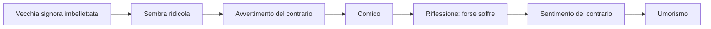
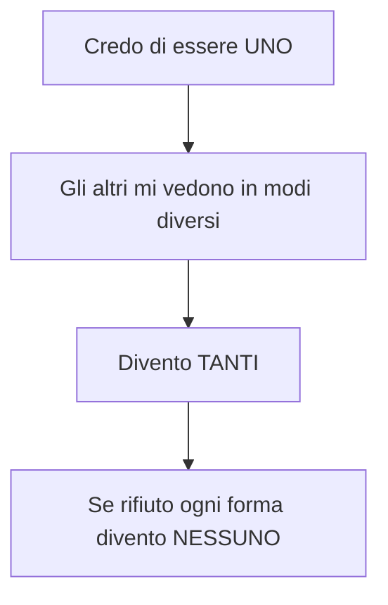
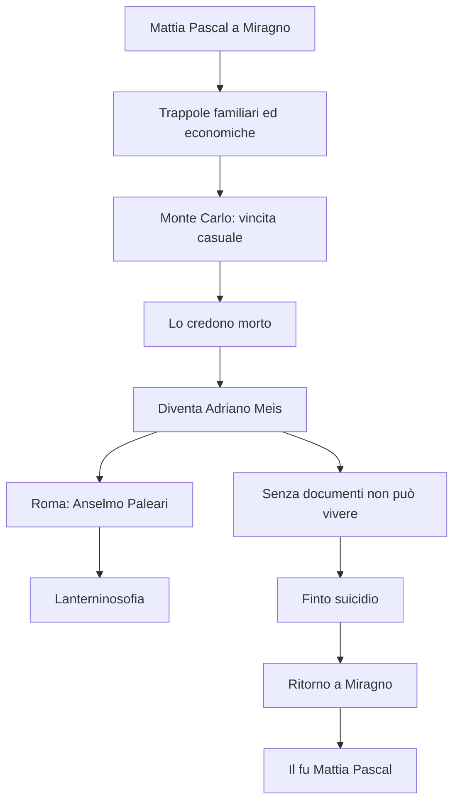

# Luigi Pirandello — Ripasso veloce

---

## Dati essenziali

**Luigi Pirandello** · 1867-1936  
Nasce a **Girgenti/Agrigento**, in Sicilia, nella **contrada del Caos**  
Studia a **Bonn**, vive e insegna a **Roma**  
Moglie: **Antonietta Portulano**, malata di nervi  
Crisi economica: allagamento delle **miniere di zolfo** del padre + perdita della dote  
Produzione: **novelle**, **romanzi**, **saggi**, **teatro**

---

## Parole chiave

| Parola | Significato |
|--------|-------------|
| **Umorismo** | Riso + riflessione + pietà |
| **Avvertimento del contrario** | Prima reazione comica: noto qualcosa di contrario alle attese |
| **Sentimento del contrario** | Riflessione: capisco il dolore nascosto |
| **Vita** | Flusso continuo, movimento, divenire |
| **Forma** | Identità fissa, ruolo, nome, maschera |
| **Maschera** | Immagine sociale che gli altri ci attribuiscono |
| **Trappola** | Famiglia, lavoro, società, nome |
| **Follia** | Possibile uscita dalla forma, rifiuto della maschera |
| **Vivere / vedersi vivere** | Chi vive non si osserva; chi si osserva perde la spontaneità |
| **Relativismo gnoseologico** | Non esiste una verità oggettiva unica |

---

## Formule da ricordare

- **Ogni forma è una morte**
- **Conoscersi è morire**
- **Chi vive, quando vive, non si vede vivere**
- **Io sono colei che mi si crede**
- Pirandello **scompone il reale**
- L'umorismo **fa ridere e pensare insieme**

---

## *L'umorismo*

| Esempio | Prima reazione | Riflessione | Esito |
|---------|----------------|-------------|-------|
| Vecchia signora imbellettata | Rido perché è fuori luogo | Forse vuole trattenere il marito giovane | Pietà, riso amaro |
| Belluca | Sembra pazzo | Ha una vita soffocante | Umorismo |
| Chiàrchiaro | Sembra ridicolo | È rovinato dalla maschera di iettatore | Umorismo |

---

## Vita e Forma

| Vita | Forma |
|------|-------|
| Flusso | Cristallizzazione |
| Movimento | Immobilità |
| Divenire | Ruolo fisso |
| Autenticità | Maschera |
| Libertà | Trappola |

**Trappole principali:** famiglia · lavoro · società · nome · rispettabilità.

---

## Identità

Pirandello è influenzato da:

| Autore / studioso | Collegamento |
|-------------------|--------------|
| **Freud** | Inconscio, pulsioni represse, crisi dell'io |
| **Binet** | Personalità molteplici: dentro l'individuo convivono più persone |

Schema:

---

## Novelle

| Novella | Personaggi | Cosa succede | Concetto |
|---------|------------|--------------|----------|
| ***Il treno ha fischiato*** | **Belluca** | Impiegato modello sente il fischio del treno e sembra impazzire | Epifania, evasione nell'immaginazione |
| ***La carriola*** | Professore/avvocato e cagnetta | Uomo rispettabile fa fare la carriola alla cagnetta in segreto | Lucida follia, uscita momentanea dalla forma |
| ***La patente*** | **Chiàrchiaro**, giudice **D'Andrea** | Vuole la patente ufficiale di iettatore | Maschera sociale sfruttata per sopravvivere |
| ***Ciàula scopre la luna*** | Ciàula | Caruso/minatore siciliano | Sicilia, miniere, richiamo a Verga |

### *La patente* in 4 passaggi

1. Chiàrchiaro è considerato iettatore.
2. La superstizione lo rovina economicamente.
3. Querela chi fa scongiuri, ma vuole perdere.
4. Vuole una **patente di iettatore** per trasformare la maschera in mestiere.

---

## Romanzi

| Romanzo | Da sapere |
|---------|-----------|
| ***L'esclusa*** | Primo romanzo, ancora con residui naturalistici |
| ***Il fu Mattia Pascal*** | Sdoppiamento dell'identità: Mattia Pascal / Adriano Meis |
| ***Uno, nessuno e centomila*** | Frantumazione totale dell'identità: Moscarda/Gengè |

### *Il fu Mattia Pascal*

**Elementi chiave:**

| Elemento | Significato |
|----------|-------------|
| **Anselmo Paleari** | Pensionante appassionato di teosofia e spiritismo |
| **Lanterninosofia** | Ogni individuo ha un lanternino: visione parziale della realtà |
| **Lanternoni** | Grandi certezze collettive: fede, scienza, ideologie |
| **Narratore inattendibile** | Mattia racconta mescolando verità e menzogne |
| **Occhio strabico** | Visione obliqua, laterale |
| **Evasione impossibile** | Fuori dalla società non si vive; dentro la forma si soffoca |

### *Uno, nessuno e centomila*

| Elemento | Dettaglio |
|----------|-----------|
| **Protagonista** | Vitangelo Moscarda, detto **Gengè** |
| **Epifania** | La moglie nota che il suo naso pende da una parte |
| **Crisi** | Capisce di non coincidere con l'immagine che ha di sé |
| **Percorso** | Rifiuta beni, nome, ruolo, forma |
| **Esito** | Annullamento dell'io nel flusso della vita |
| **Collegamento** | Panismo rovesciato rispetto a D'Annunzio |

**Uno** = quello che credo di essere  
**Centomila** = le immagini che gli altri hanno di me  
**Nessuno** = rifiuto di ogni identità fissa

---

## Teatro

| Opera | Data | Nucleo |
|-------|------|--------|
| ***Così è (se vi pare)*** | 1917 | Verità soggettiva, relativismo gnoseologico |
| ***Sei personaggi in cerca d'autore*** | 1921 | Teatro nel teatro, quarta parete, personaggi più veri degli uomini |

### *Così è (se vi pare)*

| Personaggio | Verità |
|-------------|--------|
| **Signora Frola** | La donna è sua figlia; Ponza è pazzo |
| **Signor Ponza** | La donna è la seconda moglie; Frola è pazza |
| **Laudisi** | Alter ego di Pirandello, smonta le certezze |
| **Donna finale** | "Io sono colei che mi si crede" |

Concetto: **relativismo gnoseologico** = una verità oggettiva non esiste.

### *Sei personaggi in cerca d'autore*

- Prima rappresentazione: **Teatro Valle**, Roma, 1921
- Reazione iniziale del pubblico: **"manicomio!"**
- Poi successo europeo
- Cade la **quarta parete**
- Si realizza il **teatro nel teatro**
- I personaggi entrano mentre gli attori provano *Il giuoco delle parti*
- I personaggi sono **più veri degli uomini**: l'uomo muore, il personaggio può vivere nell'arte

---

## Collegamenti da interrogazione

| Collegamento | Frase pronta |
|--------------|--------------|
| **Svevo** | Entrambi rappresentano la crisi dell'uomo del Novecento e dell'identità; Zeno e Mattia sono narratori problematici/inattendibili |
| **Romanzo del Novecento** | Personaggi non eroici, interiorità, crisi del narratore, realtà soggettiva |
| **Decadentismo** | Crisi delle certezze positivistiche; Pirandello però supera il Decadentismo perché nega una realtà unitaria |
| **Positivismo** | Viene superato: la realtà non è oggettivamente conoscibile |
| **D'Annunzio** | Panismo rovesciato: D'Annunzio esalta l'io, Pirandello lo annulla |
| **Freud/Binet** | Crisi della personalità e molteplicità dell'io |

---

## Domande probabili

1. Spiega la differenza tra comico e umoristico in Pirandello.
2. Che cosa significano Vita e Forma?
3. Perché "ogni forma è una morte"?
4. Che cosa vuol dire "conoscersi è morire"?
5. Come funziona *Il treno ha fischiato* come novella umoristica?
6. Perché *La patente* fa ridere e pensare insieme?
7. Racconta *Il fu Mattia Pascal* e spiega perché l'evasione fallisce.
8. Che cos'è la Lanterninosofia?
9. Spiega *Uno, nessuno e centomila* partendo dal naso di Moscarda.
10. Che cosa significa "io sono colei che mi si crede"?
11. Perché *Sei personaggi in cerca d'autore* è rivoluzionario?
12. Collega Pirandello a Svevo, D'Annunzio, Freud/Binet e al romanzo del Novecento.

---

*Fonti: lezioni del 20/04/2026, 21/04/2026, 23/04/2026, 27/04/2026, 28/04/2026, 04/05/2026 — Lingua e letteratura italiana*
