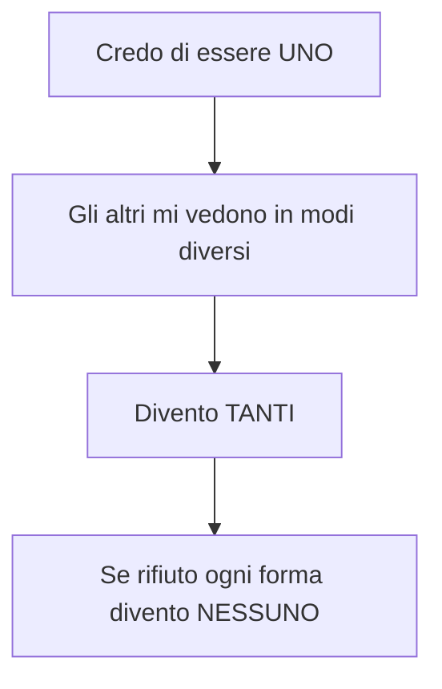
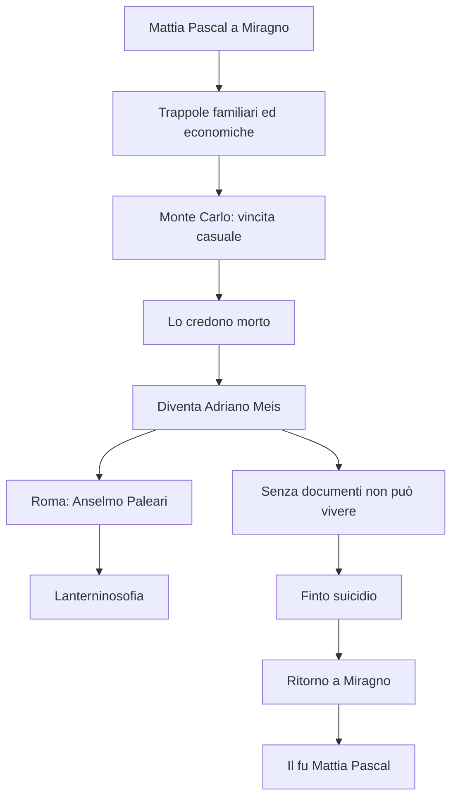

# Luigi Pirandello — Ripasso veloce

---

## Dati essenziali

**Luigi Pirandello** · 1867-1936  
Nasce a **Girgenti/Agrigento**, in Sicilia, nella **contrada del Caos**  
Studia a **Bonn**, vive e insegna a **Roma**  
Moglie: **Antonietta Portulano**, malata di nervi  
Crisi economica: allagamento delle **miniere di zolfo** del padre + perdita della dote  
Produzione: **novelle**, **romanzi**, **saggi**, **teatro**

---

## Parole chiave

| Parola | Significato |
|--------|-------------|
| **Umorismo** | Riso + riflessione + pietà |
| **Avvertimento del contrario** | Prima reazione comica: noto qualcosa di contrario alle attese |
| **Sentimento del contrario** | Riflessione: capisco il dolore nascosto |
| **Vita** | Flusso continuo, movimento, divenire |
| **Forma** | Identità fissa, ruolo, nome, maschera |
| **Maschera** | Immagine sociale che gli altri ci attribuiscono |
| **Trappola** | Famiglia, lavoro, società, nome |
| **Follia** | Possibile uscita dalla forma, rifiuto della maschera |
| **Vivere / vedersi vivere** | Chi vive non si osserva; chi si osserva perde la spontaneità |
| **Relativismo gnoseologico** | Non esiste una verità oggettiva unica |

---

## Formule da ricordare

- **Ogni forma è una morte**
- **Conoscersi è morire**
- **Chi vive, quando vive, non si vede vivere**
- **Io sono colei che mi si crede**
- Pirandello **scompone il reale**
- L'umorismo **fa ridere e pensare insieme**

---

## *L'umorismo*

| Esempio | Prima reazione | Riflessione | Esito |
|---------|----------------|-------------|-------|
| Vecchia signora imbellettata | Rido perché è fuori luogo | Forse vuole trattenere il marito giovane | Pietà, riso amaro |
| Belluca | Sembra pazzo | Ha una vita soffocante | Umorismo |
| Chiàrchiaro | Sembra ridicolo | È rovinato dalla maschera di iettatore | Umorismo |

---

## Vita e Forma

| Vita | Forma |
|------|-------|
| Flusso | Cristallizzazione |
| Movimento | Immobilità |
| Divenire | Ruolo fisso |
| Autenticità | Maschera |
| Libertà | Trappola |

**Trappole principali:** famiglia · lavoro · società · nome · rispettabilità.

---

## Identità

Pirandello è influenzato da:

| Autore / studioso | Collegamento |
|-------------------|--------------|
| **Freud** | Inconscio, pulsioni represse, crisi dell'io |
| **Binet** | Personalità molteplici: dentro l'individuo convivono più persone |

Schema:

---

## Novelle

| Novella | Personaggi | Cosa succede | Concetto |
|---------|------------|--------------|----------|
| ***Il treno ha fischiato*** | **Belluca** | Impiegato modello sente il fischio del treno e sembra impazzire | Epifania, evasione nell'immaginazione |
| ***La carriola*** | Professore/avvocato e cagnetta | Uomo rispettabile fa fare la carriola alla cagnetta in segreto | Lucida follia, uscita momentanea dalla forma |
| ***La patente*** | **Chiàrchiaro**, giudice **D'Andrea** | Vuole la patente ufficiale di iettatore | Maschera sociale sfruttata per sopravvivere |
| ***Ciàula scopre la luna*** | Ciàula | Caruso/minatore siciliano | Sicilia, miniere, richiamo a Verga |

### *La patente* in 4 passaggi

1. Chiàrchiaro è considerato iettatore.
2. La superstizione lo rovina economicamente.
3. Querela chi fa scongiuri, ma vuole perdere.
4. Vuole una **patente di iettatore** per trasformare la maschera in mestiere.

---

## Romanzi

| Romanzo | Da sapere |
|---------|-----------|
| ***L'esclusa*** | Primo romanzo, ancora con residui naturalistici |
| ***Il fu Mattia Pascal*** | Sdoppiamento dell'identità: Mattia Pascal / Adriano Meis |
| ***Uno, nessuno e centomila*** | Frantumazione totale dell'identità: Moscarda/Gengè |

### *Il fu Mattia Pascal*

**Elementi chiave:**

| Elemento | Significato |
|----------|-------------|
| **Anselmo Paleari** | Pensionante appassionato di teosofia e spiritismo |
| **Lanterninosofia** | Ogni individuo ha un lanternino: visione parziale della realtà |
| **Lanternoni** | Grandi certezze collettive: fede, scienza, ideologie |
| **Narratore inattendibile** | Mattia racconta mescolando verità e menzogne |
| **Occhio strabico** | Visione obliqua, laterale |
| **Evasione impossibile** | Fuori dalla società non si vive; dentro la forma si soffoca |

### *Uno, nessuno e centomila*

| Elemento | Dettaglio |
|----------|-----------|
| **Protagonista** | Vitangelo Moscarda, detto **Gengè** |
| **Epifania** | La moglie nota che il suo naso pende da una parte |
| **Crisi** | Capisce di non coincidere con l'immagine che ha di sé |
| **Percorso** | Rifiuta beni, nome, ruolo, forma |
| **Esito** | Annullamento dell'io nel flusso della vita |
| **Collegamento** | Panismo rovesciato rispetto a D'Annunzio |

**Uno** = quello che credo di essere  
**Centomila** = le immagini che gli altri hanno di me  
**Nessuno** = rifiuto di ogni identità fissa

---

## Teatro

| Opera | Data | Nucleo |
|-------|------|--------|
| ***Così è (se vi pare)*** | 1917 | Verità soggettiva, relativismo gnoseologico |
| ***Sei personaggi in cerca d'autore*** | 1921 | Teatro nel teatro, quarta parete, personaggi più veri degli uomini |

### *Così è (se vi pare)*

| Personaggio | Verità |
|-------------|--------|
| **Signora Frola** | La donna è sua figlia; Ponza è pazzo |
| **Signor Ponza** | La donna è la seconda moglie; Frola è pazza |
| **Laudisi** | Alter ego di Pirandello, smonta le certezze |
| **Donna finale** | "Io sono colei che mi si crede" |

Concetto: **relativismo gnoseologico** = una verità oggettiva non esiste.

### *Sei personaggi in cerca d'autore*

- Prima rappresentazione: **Teatro Valle**, Roma, 1921
- Reazione iniziale del pubblico: **"manicomio!"**
- Poi successo europeo
- Cade la **quarta parete**
- Si realizza il **teatro nel teatro**
- I personaggi entrano mentre gli attori provano *Il giuoco delle parti*
- I personaggi sono **più veri degli uomini**: l'uomo muore, il personaggio può vivere nell'arte

---

## Collegamenti da interrogazione

| Collegamento | Frase pronta |
|--------------|--------------|
| **Svevo** | Entrambi rappresentano la crisi dell'uomo del Novecento e dell'identità; Zeno e Mattia sono narratori problematici/inattendibili |
| **Romanzo del Novecento** | Personaggi non eroici, interiorità, crisi del narratore, realtà soggettiva |
| **Decadentismo** | Crisi delle certezze positivistiche; Pirandello però supera il Decadentismo perché nega una realtà unitaria |
| **Positivismo** | Viene superato: la realtà non è oggettivamente conoscibile |
| **D'Annunzio** | Panismo rovesciato: D'Annunzio esalta l'io, Pirandello lo annulla |
| **Freud/Binet** | Crisi della personalità e molteplicità dell'io |

---

## Domande probabili

1. Spiega la differenza tra comico e umoristico in Pirandello.
2. Che cosa significano Vita e Forma?
3. Perché "ogni forma è una morte"?
4. Che cosa vuol dire "conoscersi è morire"?
5. Come funziona *Il treno ha fischiato* come novella umoristica?
6. Perché *La patente* fa ridere e pensare insieme?
7. Racconta *Il fu Mattia Pascal* e spiega perché l'evasione fallisce.
8. Che cos'è la Lanterninosofia?
9. Spiega *Uno, nessuno e centomila* partendo dal naso di Moscarda.
10. Che cosa significa "io sono colei che mi si crede"?
11. Perché *Sei personaggi in cerca d'autore* è rivoluzionario?
12. Collega Pirandello a Svevo, D'Annunzio, Freud/Binet e al romanzo del Novecento.

---

## Risposte dense già pronte

### 1. Come si collega la biografia alla poetica?

Pirandello nasce nel 1867 a **Girgenti**, oggi Agrigento, nella **contrada del Caos**, luogo che ha anche valore simbolico perché la sua opera smonta ogni ordine stabile dell'identità e della verità. La Sicilia resta importante, anche attraverso il mondo delle **miniere di zolfo** e dei carusi, richiamato da *Ciàula scopre la luna*. Studia a **Bonn**, dove lavora sul dialetto agrigentino, poi vive a **Roma** e insegna alla Facoltà di Magistero. La vita familiare è segnata dalla malattia nervosa della moglie **Antonietta Portulano**, dalla sua gelosia patologica, da accuse gravissime e infine dal ricovero. Anche il dissesto economico è decisivo: l'allagamento delle miniere del padre fa perdere la dote della moglie e obbliga Pirandello a scrivere anche per guadagnare. *Il fu Mattia Pascal* nasce in questa fase, scritto a puntate mentre assiste la moglie malata. Quindi follia, famiglia come trappola, crisi economica e identità spezzata hanno radici concrete.

### 2. Che cosa significa umorismo?

L'umorismo non è semplice comicità. Il comico è **avvertimento del contrario**: noto qualcosa che contraddice le attese e rido. Esempi semplici sono uno che cade in corridoio o Chaplin che scivola sulla buccia di banana. Pirandello usa l'esempio della vecchia signora con capelli tinti, unti di **orribile manteca**, truccata e vestita da giovane: a prima vista fa ridere perché è il contrario di una vecchia rispettabile. Ma se rifletto e penso che forse cerca solo di nascondere rughe e **canizie** per trattenere l'amore di un marito più giovane, il riso diventa pietà. Questo passaggio è il **sentimento del contrario**, cioè l'umorismo. Nelle novelle pirandelliane una situazione ridicola rivela quasi sempre una tragedia.

### 3. Come spieghi Vita e Forma?

La **Vita** è il flusso continuo dell'esistenza: perpetuo movimento vitale, eterno divenire, flusso incandescente e indistinto come magma vulcanico. La **Forma** è tutto ciò che fissa questo flusso: nome, cognome, professione, ruolo, maschera sociale, immagine di sé. La forma è necessaria per vivere in società, ma è anche morte perché blocca la vita. Io mi credo uno, ma gli altri mi attribuiscono forme diverse: studente, figlio, amico, insegnante, padre, madre. Nessuna forma coincide con tutta la mia vita. Per questo Pirandello dice che ogni forma è una morte e che conoscersi è morire: se mi vedo da fuori, vedo una forma già irrigidita.

### 4. Perché Binet è importante?

Pirandello risente di Freud, ma nelle lezioni è soprattutto **Alfred Binet** a essere centrale. Binet studia le alterazioni della personalità e sostiene che dentro ogni individuo convivano più persone ignote a lui stesso, capaci di emergere all'improvviso. Pirandello trasforma questa idea in letteratura: l'identità è fallace e ingannevole, perché non rispecchia un'essenza fissa. L'essenza è mutevole. La società ci impone norme e maschere; se usciamo dalla norma veniamo considerati pazzi, come negli esempi della professoressa in costume da bagno a scuola o di chi dicesse "sono un lupino". Il pazzo pirandelliano è scandaloso perché non accetta la maschera.

### 5. Come si racconta bene *La carriola*?

*La carriola* parte **in medias res**: un narratore in prima persona parla di un atto segreto e di una vittima che lo guarda. Solo dopo capiamo che è un professore di diritto, avvocato, marito e padre, schiacciato dai ruoli. Nel flashback torna da **Perugia** in treno con una cartella di cuoio piena di carte. Guardando fuori senza vedere davvero, percepisce il **brulichio di una vita diversa**, una vita che avrebbe potuto essere sua. Poi sente l'**atroce afa della vita**, cioè il soffocamento dei doveri. Davanti alla targa con nome e titoli sulla porta di casa si vede da fuori e non si riconosce: capisce che famiglia, lavoro e società sono trappole, e che la famiglia può essere una stanza della tortura. La sua liberazione è minima e assurda: chiude lo studio, prende la vecchia cagnetta lupetta per le zampe posteriori e le fa fare la carriola. È una **lucida follia**: comica perché ridicola, tragica perché rivela un uomo prigioniero della forma.

### 6. Come si spiega *La patente*?

*La patente* è una novella umoristica e grottesca. **Rosario Chiàrchiaro** è creduto iettatore, cioè portatore di sfortuna. Il giudice **D'Andrea** sta esaminando la querela contro due uomini che facevano scongiuri al suo passaggio e vorrebbe farla ritirare. Chiàrchiaro invece vuole perdere la causa per ottenere una patente ufficiale di iettatore. Non crede davvero alla superstizione, ma la superstizione lo ha rovinato: ha una moglie paralitica e figlie da mantenere. Se la società gli impone quella maschera, lui vuole usarla come mestiere. L'avvertimento del contrario sta nel fatto che si veste e si comporta da iettatore e chiede una patente assurda; il sentimento del contrario nasce quando capiamo la miseria e la disperazione. Nella lezione è citato anche il film *Questa è la vita* del 1954 con **Totò**, che accentua la comicità del personaggio.

### 7. Come si racconta *Il fu Mattia Pascal*?

*Il fu Mattia Pascal* è pubblicato a puntate nel **1903** e in volume nel **1904**. Mattia vive a **Miragno**, oppresso da moglie, suocera e problemi economici. Va a **Monte Carlo**, vince al casinò per caso e scopre che un cadavere suicida è stato identificato come lui. Decide allora di cambiare identità e diventare **Adriano Meis**. A Roma vive nella pensione di **Anselmo Paleari**, appassionato di teosofia e spiritismo, e si opera all'occhio strabico per cancellare un segno della vecchia identità. Però senza documenti non può sposarsi, denunciare un furto o esistere legalmente. Inscena un suicidio lasciando cappello e bastone sul Tevere e torna a Miragno, ma la moglie si è risposata e la vita è andata avanti. Non può più essere Mattia né Adriano: è **il fu Mattia Pascal**, un uomo escluso dal flusso della vita, rifugiato in una biblioteca polverosa e costretto a visitare la propria tomba.

### 8. Che cos'è la Lanterninosofia?

La **Lanterninosofia** è la teoria che Anselmo Paleari espone ad Adriano Meis durante la convalescenza dall'intervento all'occhio. Ogni individuo ha un piccolo **lanternino** che illumina una parte minima della realtà e lascia intuire il buio attorno. Le collettività seguono grandi **lanternoni**, cioè fede religiosa, fede nella scienza, ideologie politiche. Nei periodi di crisi i lanternoni si spengono: crollano le certezze del Positivismo e l'uomo non sa più orientarsi. Il significato è che la realtà non è oggettiva e unica, ma soggettiva, parziale, dipendente dal punto di vista. Pirandello supera il Positivismo e anche il Decadentismo, perché non pensa che esista una realtà profonda stabile da decifrare.

### 9. Come si spiega *Uno, nessuno e centomila*?

Il protagonista è **Vitangelo Moscarda**, detto **Gengè**. Tutto comincia quando la moglie gli fa notare che il suo naso pende da una parte. È un dettaglio minimo, ma produce un'epifania: Moscarda capisce di non coincidere con l'immagine che ha di sé. Lui si crede uno, ma per ogni persona è un Moscarda diverso, quindi è centomila; se rifiuta tutte queste immagini, diventa nessuno. Il percorso lo porta a rifiutare nome, proprietà, ruolo sociale e convenzioni. Il finale richiama il panismo, ma è un **panismo rovesciato** rispetto a D'Annunzio: non c'è esaltazione superomistica dell'io, ma annullamento dell'io nella vita senza forma, nell'albero, nel sasso, nella foglia.

### 10. Come si racconta il teatro?

Il teatro di Pirandello vuole mettere in crisi lo spettatore. ***Così è (se vi pare)***, del 1917, deriva dalla novella *La signora Frola e il signor Ponza suo genero*. La signora Frola dice che la donna di Ponza è sua figlia; Ponza dice che la figlia di Frola è morta e che quella donna è la sua seconda moglie. Il paese vuole conoscere la verità e mostra una curiosità crudele, senza capire la pietà reciproca dei due personaggi. **Laudisi** smonta le certezze e la frase finale "io sono colei che mi si crede" esprime il relativismo gnoseologico. ***Sei personaggi in cerca d'autore***, del 1921, rompe la quarta parete: gli attori provano *Il giuoco delle parti*, arriva il capocomico e irrompono sei personaggi in cerca d'autore. All'inizio il pubblico grida "manicomio", poi l'opera diventa un successo europeo. Il punto è che i personaggi sono più veri degli uomini: l'uomo muore, il personaggio può vivere per sempre nell'arte.

---

## Micro-risposte da memorizzare

| Domanda lampo | Risposta densa |
|---------------|----------------|
| Perché "contrada del Caos" è importante? | È il luogo natale e insieme un simbolo: Pirandello smonta ordine, identità e verità. |
| Che cosa sono le maschere? | Le forme sociali con cui siamo riconosciuti: studente, figlio, professore, avvocato, marito. |
| Perché il pazzo è importante? | Perché rifiuta la maschera e quindi appare folle alla società, ma è più vicino alla Vita. |
| Che cosa significa epifania? | Momento improvviso di rivelazione: il fischio del treno, la targa sulla porta, il naso di Gengè. |
| Qual è la forma di Belluca? | Bravo impiegato diligente, schiacciato da lavoro e famiglia. |
| Qual è la via d'uscita di Belluca? | Non fuga reale, ma immaginazione aperta dal fischio del treno. |
| Qual è la via d'uscita nella *Carriola*? | Un gesto segreto e assurdo: far fare la carriola alla cagnetta. |
| Perché Chiàrchiaro vuole la patente? | Per trasformare la maschera subita di iettatore in una professione utile alla famiglia. |
| Perché Adriano Meis fallisce? | Senza documenti non può vivere dentro la società. |
| Che cosa sono i lanternoni? | Le grandi certezze collettive: fede, scienza, ideologie. |
| Che cosa significa "il fu"? | Mattia è definito dalla propria morte: non è più il Mattia di prima, ma neppure Adriano. |
| Perché Moscarda rifiuta il nome? | Il nome conclude e fissa; la Vita invece non conclude. |
| Perché *Così è* è relativista? | Perché non dà una verità unica: la donna è "colei che mi si crede". |
| Che cos'è il teatro nel teatro? | La scena mostra il teatro stesso: attori, prove, capocomico, personaggi che entrano. |
| Perché i personaggi sono più veri? | Perché l'uomo muore, mentre il personaggio fissato nell'arte può durare. |

---

*Fonti: lezioni del 20/04/2026, 21/04/2026, 23/04/2026, 27/04/2026, 28/04/2026, 04/05/2026 — Lingua e letteratura italiana*
