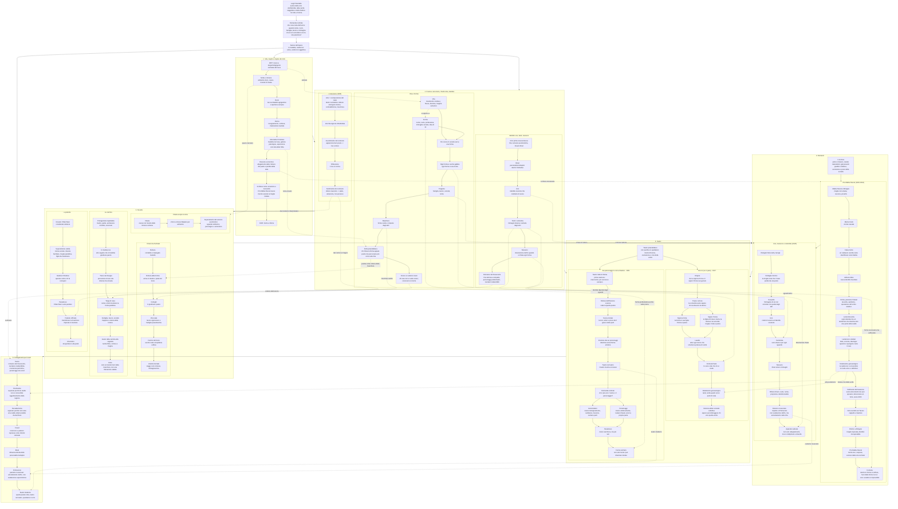

# Luigi Pirandello - schema Mermaid

```mermaid
flowchart TD
    P["Luigi Pirandello<br/>autore della crisi dell'identità, della verità soggettiva e della frattura tra Vita e Forma"]

    P --> C["Domanda centrale<br/>che cosa resta dell'uomo quando nome, ruolo, famiglia, lavoro e immagine di sé non coincidono con la vita autentica?"]
    C --> NUC["Nucleo dell'opera<br/>io instabile, realtà non unica, verità non oggettiva"]

    subgraph BIO["1. Vita, luoghi e origine dei temi"]
        B1["1867: nasce a Girgenti/Agrigento<br/>contrada del Caos"]
        B2["Sicilia e miniere<br/>ambiente duro, carusi, mondo di Ciàula"]
        B3["Bonn<br/>tesi sul dialetto agrigentino e apertura europea"]
        B4["Roma<br/>insegnamento, scrittura, maturazione teatrale"]
        B5["Antonietta Portulano<br/>malattia nervosa, gelosia patologica, esperienza concreta della follia"]
        B6["Dissesto economico<br/>allagamento delle miniere del padre e perdita della dote"]
        B7["Scrittura come vocazione e necessità<br/>Il fu Mattia Pascal nasce mentre assiste la moglie malata"]
        B8["1936: morte a Roma"]
        B1 --> B2 --> B3 --> B4 --> B5 --> B6 --> B7 --> B8
    end

    NUC --> BIO
    B1 -. "simbolo" .-> T1
    B2 -. "spazio narrativo" .-> NOV4
    B5 -. "tema vissuto" .-> T7
    B6 -. "scrittura necessaria" .-> ROM2

    subgraph POE["2. Poetica: umorismo, Vita/Forma, identità"]
        subgraph UMO["L'umorismo (1908)"]
            U1["Arte = scomposizione del reale<br/>dietro normalità e ridicolo emergono dolore, contraddizione, maschera"]
            U2["Vecchia signora imbellettata"]
            U3["Avvertimento del contrario<br/>apparenza fuori posto -> riso comico"]
            U4["Riflessione<br/>il riso si incrina"]
            U5["Sentimento del contrario<br/>dolore nascosto -> pietà, amarezza, riso pensoso"]
            U1 --> U2 --> U3 --> U4 --> U5
        end

        subgraph VF["Vita e Forma"]
            T1["Vita<br/>movimento continuo, flusso, divenire, magma vulcanico"]
            T2["Forma<br/>nome, ruolo, professione, immagine sociale, idea di sé"]
            T3["Per vivere in società serve una forma"]
            T4["Ogni forma è anche gabbia<br/>ogni forma è una morte"]
            T5["Trappole<br/>famiglia, lavoro, società, nome"]
            T6["Maschere<br/>forme scelte o imposte dagli altri"]
            T7["Follia pirandelliana<br/>chi rifiuta la forma appare pazzo ma può essere più vicino alla Vita"]
            T8["Vivere vs vedersi vivere<br/>chi vive non si vede vivere; conoscersi è morire"]
            T1 --> T3
            T2 --> T3 --> T4 --> T5 --> T6 --> T7 --> T8
            T1 -. "si oppone a" .-> T2
        end

        subgraph ID["Identità: uno, tanti, nessuno"]
            I1["Crisi primo-novecentesca<br/>fine certezze positivistiche, Freud, Binet"]
            I2["Binet<br/>personalità molteplici dentro l'individuo"]
            I3["Uno<br/>identità coerente che crediamo di avere"]
            I4["Tanti / centomila<br/>immagini diverse costruite dagli altri"]
            I5["Nessuno<br/>dissoluzione dell'io quando si rifiuta ogni forma"]
            I6["Romanzo del Novecento<br/>fine dell'eroe compatto, personaggi problematici, narratori inattendibili"]
            I1 --> I2 --> I3 --> I4 --> I5 --> I6
        end
    end

    NUC --> POE
    U5 -. "meccanismo interpretativo" .-> NOV
    T5 -. "chiave di lettura" .-> ROM
    I3 -. "formula radicale" .-> ROM3

    subgraph NOV["3. Novelle"]
        subgraph NOV1["Il treno ha fischiato"]
            A1["Belluca<br/>contabile e impiegato modello"]
            A2["Rottura della forma<br/>arriva in ritardo e parla del treno"]
            A3["Colleghi<br/>lo giudicano pazzo"]
            A4["Vita reale<br/>lavoro oppressivo e famiglia pesantissima"]
            A5["Fischio del treno<br/>evento reale ed epifania uditiva"]
            A6["Libertà mentale<br/>viaggi, terre lontane, immaginazione"]
            A1 --> A2 --> A3 --> A4 --> A5 --> A6
        end

        subgraph NOV2["La carriola"]
            D1["Protagonista rispettabile<br/>marito, padre, professore di diritto, avvocato"]
            D2["In medias res<br/>atto segreto che lo farebbe giudicare pazzo"]
            D3["Treno da Perugia<br/>percezione di una vita diversa mai vissuta"]
            D4["Targa di casa<br/>nome e titoli mostrano la forma pubblica"]
            D5["Famiglia, lavoro, società<br/>trappole e stanza della tortura"]
            D6["Gesto della carriola alla cagnetta<br/>lucida follia, comica e tragica"]
            D7["Esito<br/>solo un istante fuori dalla maschera, non una liberazione stabile"]
            D1 --> D2 --> D3 --> D4 --> D5 --> D6 --> D7
        end

        subgraph NOV3["La patente"]
            E1["Rosario Chiàrchiaro<br/>considerato iettatore"]
            E2["Superstizione subita<br/>rovina sociale, miseria familiare, moglie paralitica, figlie da mantenere"]
            E3["Giudice D'Andrea<br/>querela contro chi fa scongiuri"]
            E4["Paradosso<br/>Chiàrchiaro vuole perdere"]
            E5["Patente ufficiale<br/>trasformare la maschera imposta in mestiere"]
            E6["Umorismo<br/>dal grottesco alla pietà"]
            E1 --> E2 --> E3 --> E4 --> E5 --> E6
        end

        subgraph NOV4["Ciàula scopre la luna"]
            F1["Ciàula<br/>caruso nel mondo delle miniere siciliane"]
            F2["Vicino a Rosso Malpelo per ambiente"]
            F3["Superamento del verismo positivistico<br/>sguardo simbolico, psicologico e umoristico"]
            F1 --> F2 --> F3
        end
    end

    POE --> NOV
    U5 -. "dal comico al tragico" .-> A3
    T7 -. "pazzia come rottura della maschera" .-> A2
    T8 -. "vedersi dall'esterno" .-> D4
    T6 -. "maschera subita" .-> E5

    subgraph ROM["4. Romanzi"]
        ROM1["L'esclusa<br/>primo romanzo, residui naturalistici; già presenti giudizio collettivo, esclusione e peso della società"]

        subgraph ROM2["Il fu Mattia Pascal (1903-1904)"]
            M1["Mattia Pascal a Miragno<br/>moglie non amata, suocera, povertà"]
            M2["Monte Carlo<br/>vincita casuale"]
            M3["Falsa morte<br/>un cadavere suicida viene identificato come Mattia"]
            M4["Adriano Meis<br/>nuova identità inventata"]
            M5["Roma, pensione Paleari<br/>teosofia, spiritismo, operazione all'occhio strabico"]
            M6["Lanterninosofia<br/>ogni individuo ha un lanternino che illumina solo una parte della realtà"]
            M7["Lanternoni collettivi<br/>fede, scienza, ideologie: quando si spengono resta il caos"]
            M8["Relativismo gnoseologico<br/>la realtà non è conoscibile in modo unico e definitivo"]
            M9["Fallimento dell'evasione<br/>senza documenti non può sposarsi, denunciare un furto, avere diritti"]
            M10["Finto suicidio sul Tevere<br/>cappello e bastone"]
            M11["Ritorno a Miragno<br/>moglie risposata, identità irrecuperabile"]
            M12["Il fu Mattia Pascal<br/>morto-vivo, sospeso, escluso dalla vita normale"]
            M13["Formula<br/>dentro le forme si soffoca, fuori dalle forme non si vive: evadere è impossibile"]
            M1 --> M2 --> M3 --> M4 --> M5 --> M6 --> M7 --> M8 --> M9 --> M10 --> M11 --> M12 --> M13
        end

        subgraph ROM3["Uno, nessuno e centomila (1926)"]
            V1["Vitangelo Moscarda, Gengè"]
            V2["Dettaglio minimo<br/>la moglie nota che il naso pende da una parte"]
            V3["Scoperta<br/>l'immagine di sé non coincide con quella degli altri"]
            V4["Uno<br/>credo di essere un'identità coerente"]
            V5["Centomila<br/>sono diverso per ogni sguardo"]
            V6["Nessuno<br/>rifiuto tutte le immagini"]
            V7["Rifiuto di beni, ruolo, nome, proprietà e identità stabile"]
            V8["Panismo rovesciato rispetto a D'Annunzio<br/>non esaltazione dell'io, ma annullamento nella Vita"]
            V9["Approdo radicale<br/>non solo sdoppiamento, ma io moltiplicato e dissolto"]
            V1 --> V2 --> V3 --> V4 --> V5 --> V6 --> V7 --> V8 --> V9
        end

        ROM1 --> ROM2 --> ROM3
    end

    POE --> ROM
    T4 -. "forma necessaria ma soffocante" .-> M13
    I4 -. "sguardi altrui" .-> V5
    I5 -. "dissoluzione finale" .-> V9

    subgraph TEA["5. Teatro"]
        TE0["Teatro pirandelliano<br/>non pacifica lo spettatore: mostra finzione, costruzione e crisi della verità"]

        subgraph TE1["Così è (se vi pare) - 1917"]
            C1["Origine<br/>da La signora Frola e il signor Ponza suo genero"]
            C2["Paese curioso<br/>la comunità vuole sapere chi sia davvero la donna"]
            C3["Signora Frola<br/>la donna è sua figlia; Ponza è pazzo"]
            C4["Signor Ponza<br/>la figlia di Frola è morta; la donna è la seconda moglie; Frola è pazza"]
            C5["Laudisi<br/>alter ego ironico che smonta la pretesa di verità"]
            C6["Formula finale<br/>Io sono colei che mi si crede"]
            C7["Relativismo gnoseologico<br/>tante verità quanti sono i punti di vista"]
            C8["Violenza della curiosità collettiva<br/>sapere può distruggere chi vive quella verità"]
            C1 --> C2 --> C3
            C2 --> C4
            C3 --> C5
            C4 --> C5 --> C6 --> C7 --> C8
        end

        subgraph TE2["Sei personaggi in cerca d'autore - 1921"]
            S1["Teatro Valle di Roma<br/>prima reazione: manicomio; poi successo europeo"]
            S2["Rottura dell'illusione scenica<br/>cade la quarta parete"]
            S3["Scena iniziale<br/>tecnici, attori e prove de Il giuoco delle parti"]
            S4["Irruzione dei sei personaggi<br/>dramma senza forma artistica"]
            S5["Teatro nel teatro<br/>il teatro mostra sé stesso"]
            S6["Domanda centrale<br/>chi è più vero: l'uomo o il personaggio?"]
            S7["Uomini/attori<br/>vivono biologicamente, cambiano, muoiono, recitano parti"]
            S8["Personaggi<br/>vivono artisticamente, restano fissati, sono la propria parte"]
            S9["Paradosso<br/>meno reali forse, ma più veri"]
            S10["Forma nell'arte<br/>non solo morte: può diventare durata"]
            S1 --> S2 --> S3 --> S4 --> S5 --> S6
            S6 --> S7
            S6 --> S8
            S7 --> S9
            S8 --> S9 --> S10
        end

        TE0 --> TE1
        TE0 --> TE2
    end

    POE --> TEA
    M8 -. "stessa crisi della verità" .-> C7
    T2 -. "forma problematica anche sulla scena" .-> S10
    I4 -. "identità dipende dagli sguardi" .-> C6

    subgraph ORA["6. Collegamenti per l'orale"]
        O1["Svevo<br/>romanzo del Novecento, narratore inattendibile, coscienza ipertrofica, personaggi non eroici"]
        O2["Positivismo<br/>superato perché la realtà non è conoscibile oggettivamente dalla ragione"]
        O3["Decadentismo<br/>superato perché non resta una realtà unitaria stabile da decifrare"]
        O4["Freud<br/>inconscio e pulsioni represse come sfondo culturale"]
        O5["Binet<br/>influenza diretta delle personalità molteplici"]
        O6["D'Annunzio<br/>panismo rovesciato: annullamento dell'io, non esaltazione superomistica"]
        O7["Teatro moderno<br/>quarta parete rotta, teatro nel teatro, spettatore in crisi"]
        O1 --> O2 --> O3 --> O4 --> O5 --> O6 --> O7
    end

    NUC --> ORA
    I6 -. "confronto" .-> O1
    M8 -. "anti-positivismo" .-> O2
    V8 -. "panismo rovesciato" .-> O6
    S5 -. "teatro moderno" .-> O7

    BIO --> POE --> NOV --> ROM --> TEA --> ORA
```
