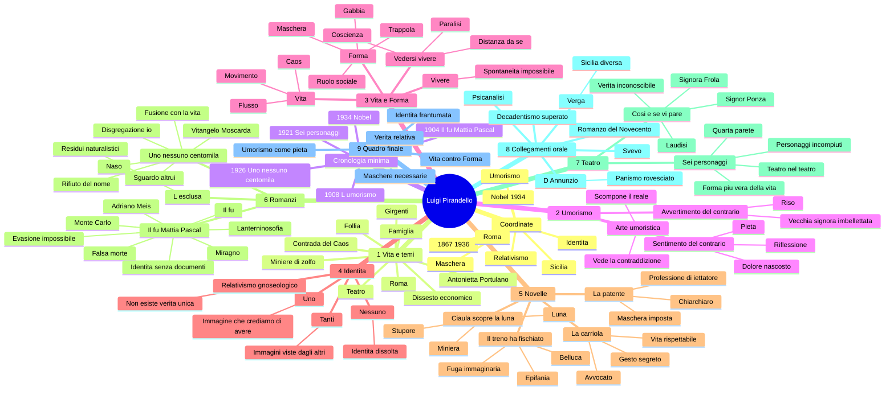

# Schema mentale stampabile — Luigi Pirandello

Schema unico e compatto, disposto nello stesso ordine del `riassunto.md`.

```mermaid
mindmap
  root((Luigi Pirandello))
    Coordinate
      1867 1936
      Sicilia
      Roma
      Nobel 1934
      Relativismo
      Umorismo
      Maschera
      Identita
    1 Vita e temi
      Girgenti
      Contrada del Caos
      Miniere di zolfo
      Famiglia
      Roma
      Antonietta Portulano
      Dissesto economico
      Follia
      Teatro
    Cronologia minima
      1904 Il fu Mattia Pascal
      1908 L umorismo
      1921 Sei personaggi
      1926 Uno nessuno centomila
      1934 Nobel
    2 Umorismo
      Avvertimento del contrario
        Riso
        Vecchia signora imbellettata
      Sentimento del contrario
        Riflessione
        Pieta
        Dolore nascosto
      Arte umoristica
        Scompone il reale
        Vede la contraddizione
    3 Vita e Forma
      Vita
        Flusso
        Movimento
        Caos
      Forma
        Maschera
        Ruolo sociale
        Gabbia
        Trappola
      Vivere
        Spontaneita impossibile
      Vedersi vivere
        Coscienza
        Distanza da se
        Paralisi
    4 Identita
      Uno
        Immagine che crediamo di avere
      Tanti
        Immagini viste dagli altri
      Nessuno
        Identita dissolta
      Relativismo gnoseologico
        Non esiste verita unica
    5 Novelle
      Il treno ha fischiato
        Belluca
        Epifania
        Fuga immaginaria
      La carriola
        Avvocato
        Vita rispettabile
        Gesto segreto
      La patente
        Chiarchiaro
        Maschera imposta
        Professione di iettatore
      Ciaula scopre la luna
        Miniera
        Luna
        Stupore
    6 Romanzi
      L esclusa
        Residui naturalistici
      Il fu Mattia Pascal
        Miragno
        Monte Carlo
        Falsa morte
        Adriano Meis
        Identita senza documenti
        Lanterninosofia
        Evasione impossibile
        Il fu
      Uno nessuno centomila
        Vitangelo Moscarda
        Naso
        Sguardo altrui
        Rifiuto del nome
        Disgregazione io
        Fusione con la vita
    7 Teatro
      Cosi e se vi pare
        Signora Frola
        Signor Ponza
        Laudisi
        Verita inconoscibile
      Sei personaggi
        Teatro nel teatro
        Quarta parete
        Personaggi incompiuti
        Forma piu vera della vita
    8 Collegamenti orale
      Romanzo del Novecento
      Svevo
      Psicanalisi
      Decadentismo superato
      D Annunzio
        Panismo rovesciato
      Verga
        Sicilia diversa
    9 Quadro finale
      Vita contro Forma
      Maschere necessarie
      Verita relativa
      Identita frantumata
      Umorismo come pieta
```
