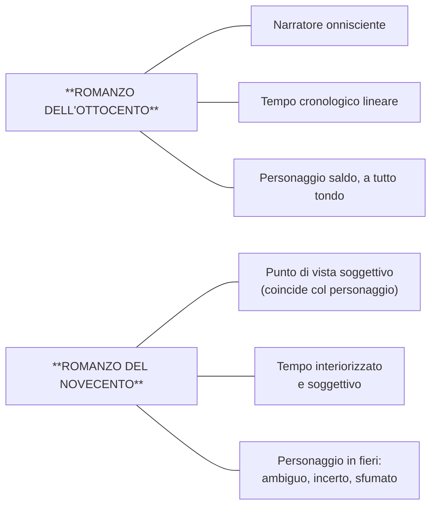
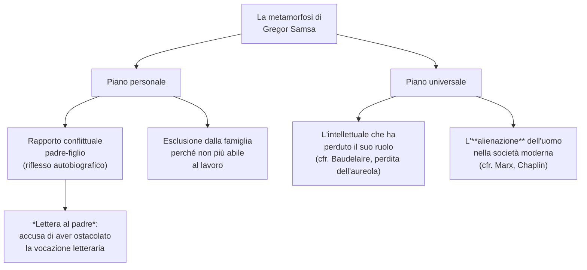
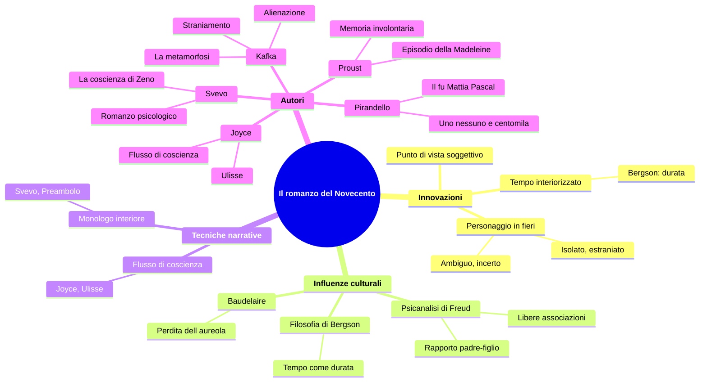

# Il romanzo del Novecento

---

## Coordinate essenziali

| Elemento | Dettaglio |
|----------|-----------|
| **Contesto** | Primo Novecento europeo, crisi delle certezze positiviste |
| **Influenze filosofiche** | Henri Bergson (tempo come durata), Sigmund Freud (psicanalisi) |
| **Autori europei chiave** | Marcel Proust (Francia), Franz Kafka (lingua tedesca), James Joyce (Inghilterra) |
| **Autori italiani chiave** | Luigi Pirandello, Italo Svevo |
| **Genere dominante in Italia** | Romanzo psicologico |
| **Opere di riferimento** | *Alla ricerca del tempo perduto* (Proust), *La metamorfosi* (Kafka), *Ulisse* (Joyce), *La coscienza di Zeno* (Svevo), *Il fu Mattia Pascal* e *Uno, nessuno e centomila* (Pirandello) |

---

## 1. Il passaggio dall'Ottocento al Novecento: che cosa cambia nel romanzo

### 1.1 Il romanzo ottocentesco come punto di partenza

Per capire la rivoluzione del romanzo novecentesco bisogna partire da ciò che lo precede. Il romanzo dell'Ottocento — il cui esempio italiano per eccellenza sono *I Promessi Sposi* di Manzoni — si fonda su alcuni pilastri molto solidi. In primo luogo, l'autore **domina la narrazione**: il narratore è **onnisciente**, conosce le vicende, gli accadimenti e persino i pensieri dei personaggi; interviene a commentare gli eventi e non si identifica con nessuno di loro. È una voce che sta sopra la storia e la governa dall'alto.

In secondo luogo, la narrazione si sviluppa secondo un **tempo cronologico lineare**, percepito come una realtà stabile e immutabile: le cose accadono una dopo l'altra, e il lettore può seguirle come si segue il cammino delle lancette dell'orologio.

Infine, il personaggio ottocentesco è **saldo e granitico** — un personaggio "a tutto tondo" che possiede una coerenza interna chiara e definita.

### 1.2 Le tre grandi innovazioni del Novecento

Il romanzo del Novecento sovverte tutti e tre questi pilastri. I cambiamenti possono essere sintetizzati in tre punti fondamentali.

**Primo: muta il punto di vista della narrazione.** Il campo visivo del narratore si restringe fino a coincidere con quello di un singolo personaggio. Non c'è più un narratore-Dio che vede tutto: la storia viene filtrata dalla coscienza soggettiva di chi la vive. Ne *La coscienza di Zeno*, ad esempio, l'io narrante è Zeno — o meglio la sua **coscienza**. I giudizi che Zeno esprime non sono mai assoluti ma sempre **relativi**, perché dipendono dal suo punto di vista e dal modo in cui gli eventi vengono filtrati dalla sua interiorità. Questa soggettivizzazione del racconto si esprime spesso nella forma della **confessione autobiografica**, delle **memorie** o della **novella**, che ripercorrono il vissuto del personaggio.

**Secondo: muta la concezione del tempo.** I protagonisti non sono più inseriti in un quadro cronologico certo. Il tempo non è più una serie di momenti successivi ma viene **interiorizzato** e diventa **soggettivo**.

> [!note] Dalla lezione
> La professoressa ha proposto una serie di esempi illuminanti per far capire il concetto di tempo soggettivo: un'ora di lezione a scuola non dura quanto un'ora del sabato sera quando ci stiamo divertendo. I cinque minuti in cui aspettiamo qualcuno che non vediamo l'ora di vedere non sono lunghi cinque minuti quanto quelli che mancano all'intervallo. Il tempo, a seconda dei nostri desideri, delle nostre aspettative, della nostra percezione, **rallenta oppure accelera**. Questa dimensione temporale — il tempo soggettivo — è quella che domina il romanzo del Novecento.

Ne *La coscienza di Zeno* questa nuova concezione del tempo si riflette nella struttura stessa del romanzo, che non segue un ordine cronologico ma è suddiviso in **nuclei tematici**: *Il fumo*, *La morte di mio padre*, *Storia del mio matrimonio*, *Un'impresa commerciale*... Il tempo si compenetra; c'è una dialettica tra presente, passato e futuro che si intrecciano continuamente.

Questi autori risentono profondamente del pensiero di **Henri Bergson**, il filosofo francese che teorizza il tempo come **durata**: non una successione ordinata di momenti separati, ma un fluire in cui i momenti si compenetrano l'uno nell'altro. È il **tempo dell'interiorità**, che ha un modo diverso di essere rispetto a quello dell'esteriorità e dell'orologio.

**Terzo: muta il personaggio.** Il protagonista del romanzo novecentesco non è più saldo e granitico come quello dell'Ottocento, ma è **ambiguo, incerto, complesso e sfumato**. È un personaggio **in fieri** — espressione latina che significa "in divenire" — che si muove in una molteplicità di piani psicologici. E proprio perché è in divenire, perché è incerto e ambiguo, il personaggio novecentesco si trova spesso in una posizione di **estraniamento**, **isolamento** e **solitudine** rispetto al mondo in cui vive.

---

## 2. Marcel Proust e la memoria involontaria

### 2.1 L'episodio della Madeleine: un capolavoro della letteratura mondiale

L'episodio più celebre della letteratura mondiale a proposito del **tempo interiorizzato** appartiene a Marcel Proust, considerato da molti il più grande scrittore della modernità. Si tratta dell'episodio della **Madeleine**, contenuto nel romanzo *Dalla parte di Swann* (1913), primo volume del ciclo *Alla ricerca del tempo perduto* — un titolo che, come si nota subito, ha a che fare direttamente con il tema del tempo.

Il protagonista Swann, ormai adulto, si trova in una giornata d'inverno a intingere una Madeleine — un dolcetto francese a forma di conchiglia — in una tazza di tè. Nel momento in cui il sorso misto alle briciole tocca il suo palato, viene sorpreso da una sensazione straordinaria: un piacere delizioso lo invade, lo isola, lo rende indifferente alle vicissitudini della vita. Ripete l'azione, e quel sapore riporta alla luce, fa riemergere **intero il suo passato** — le estati a Combray, la zia Léonie che gli offriva proprio la Madeleine accompagnata dal tè.

Questo processo si chiama **memoria involontaria**: non è un ricordo cercato o voluto, ma qualcosa che **accade e basta**, scatenato da uno stimolo sensoriale — in questo caso il gusto, ma spesso è l'olfatto quello che stimola di più questo meccanismo. La memoria involontaria non fa riemergere soltanto il ricordo di un momento del passato, ma le **sensazioni** stesse: si rivivono le emozioni come se fossero presenti.

> [!note] Dalla lezione
> La professoressa ha tenuto a precisare che la memoria involontaria **non va confusa con il déjà vu**. «È la stessa cosa del déjà vu?» è la domanda che le fanno sempre. La risposta è no: sono due fenomeni completamente diversi, anche se la confusione viene naturale.

### 2.2 Il testo: *Dalla parte di Swann* (1913)

> Già da molti anni, di Combray tutto ciò che non era il teatro e il dramma del coricarmi non esisteva più per me, quando in una giornata d'inverno, rientrando a casa, mia madre vedendomi infreddolito mi propose di prendere, contrariamente alla mia abitudine, un po' di tè. Rifiutai dapprima e poi, non so perché, mutai d'avviso. Ella mandò a prendere una di quelle focacce pienotte e corte chiamate maddalenine, che paiono aver avuto come stampo la valva scanalata di una conchiglia.
>
> Ed ecco, macchinalmente, oppresso dalla giornata grigia, dalla previsione di un triste domani, portai alle labbra un cucchiaino di tè in cui avevo inzuppato un pezzo di maddalena. Ma nel momento stesso che quel sorso misto alle briciole di focaccia toccò il mio palato, trasalii, attento a quanto avveniva in me di straordinario. Un piacere delizioso m'aveva invaso, isolato, senza nozione della sua causa. M'aveva reso indifferenti le vicissitudini della vita, le sue calamità, la sua brevità illusoria, nel modo stesso che agisce l'amore, colmandomi d'un'essenza preziosa; o meglio questa essenza non era in me, era me stesso. Avevo cessato di sentirmi mediocre, contingente, mortale. Donde m'era potuta venire quella gioia violenta? Sentivo che era legata al sapore del tè e della focaccia...
>
> Ma la sorpassava incommensurabilmente, non doveva essere della stessa natura. Donde veniva? Che significava? Dove afferrarla? [...] Bevo un secondo sorso in cui non trovo nulla di più che nel primo, un terzo dal quale ricevo meno che dal secondo. È tempo che io mi fermi, la virtù della bevanda sembra diminuire. È chiaro che la verità che cerco non è in essa, ma in me. Essa l'ha risvegliata, è la sensazione che ha risvegliata questa verità, ma non la conosce.

Il protagonista capisce che la verità non è nella bevanda, ma **dentro di lui** — la sensazione del gusto ha risvegliato qualcosa che giaceva sepolto nella memoria, ma non ne è l'origine.

> Fino a quando [...] ad un tratto il ricordo mi è apparso. Quel sapore era quello del pezzetto di Madeleine che la domenica mattina a Combray, giacché quel giorno non uscivo prima della messa, quando andavo a salutarla nella sua camera, la zia Léonie mi offriva dopo averlo bagnato nel suo infuso di tè o di tiglio.
>
> La vista della focaccia, prima d'assaggiarla, non m'aveva ricordato niente; forse perché, avendone viste spesso, senza mangiarle, sui vassoi dei pasticceri, la loro immagine aveva lasciato quei giorni di Combray per unirsi ad altri giorni più recenti.

Ecco un punto fondamentale: la **vista** della Madeleine non aveva risvegliato nulla; è stato il **gusto** a farlo. L'immagine visiva si era mescolata ad altri ricordi più recenti, perdendo il suo legame con Combray. Ma il sapore, più tenue e più fedele, era rimasto intatto nel tempo.

> Ma quando niente sussiste d'un passato antico, dopo la morte degli esseri, dopo la distruzione delle cose, più tenue ma più vividi, più immateriali, più persistenti, più fedeli, **l'odore e il sapore lungo il tempo ancora perdurano**, come anime a ricordare, ad attendere, a sperare, sopra la rovina di tutto il resto, portando sulla loro stilla quasi impalpabile, senza vacillare, **l'immenso edificio del ricordo**.

Questa è una delle frasi più celebri della letteratura mondiale. Proust ci dice che quando tutto è crollato — gli esseri sono morti, le cose distrutte — sono l'odore e il sapore a sopravvivere, portando sulle spalle, senza vacillare, l'intero edificio del ricordo.

> E appena ebbi riconosciuto il sapore del pezzetto di Madeleine inzuppato nel tiglio che mi dava la zia [...] subito la vecchia casa grigia sulla strada nella quale era la sua stanza si adattò come uno scenario di teatro al piccolo padiglione sul giardino [...] E con la casa la città, la piazza dove mi mandavano prima di colazione, le vie dove andavo in escursione dalla mattina alla sera e con tutti i tempi, le passeggiate che si facevano se il tempo era bello.
>
> E come in quel gioco in cui i giapponesi si divertono a immergere in una scodella di porcellana piena d'acqua dei pezzetti di carta fino allora indistinti che appena immersi si distendono, prendono contorno, si colorano, si differenziano, diventano fiori, case, figure umane consistenti e riconoscibili; così ora tutti i fiori del nostro giardino e quelli del parco di Swann e le ninfee della Vivonne e la buona gente del villaggio e le loro casette e la chiesa e **tutta Combray e i suoi dintorni, tutto quello che vien prendendo forma e solidità è sorto, città e giardini, dalla mia tazza di tè**.

L'immagine conclusiva è folgorante: come quei pezzetti di carta giapponesi che a contatto con l'acqua si aprono e diventano fiori, case, figure riconoscibili, così dalla tazza di tè emerge un intero mondo — la casa, la città, le strade, i giardini, le persone, l'intera Combray. Un universo intero ricostruito a partire da un sorso di tè e un dolcetto.

> [!note] Dalla lezione
> La professoressa ha sottolineato la maestria descrittiva di Proust, capace di trasformare in poesia anche i dettagli più apparentemente insignificanti: «Guardate come descrive un biscotto: "conchiglietta di pasta grassamente sensuale sotto la sua veste a pieghe severa e devota". Scusate, eh, però...»

### 2.3 I piani del tempo che si sovrappongono

L'episodio della Madeleine illustra perfettamente come nel romanzo del Novecento i **piani del tempo si intersecano e si sovrappongono**. La vista della focaccia rimanda ad "altri giorni più recenti", il sapore riporta a Combray, il presente si fonde con il passato. Non c'è una sequenza temporale ordinata: il tempo si compenetra, esattamente come teorizzava Bergson con il concetto di **durata**.

---

## 3. Franz Kafka e *La metamorfosi*

### 3.1 L'estraniamento come cifra narrativa

Un caso esemplare dell'**isolamento** e dell'**estraniamento** del personaggio novecentesco rispetto al mondo è quello di *La metamorfosi* di Kafka (1916). Il protagonista è **Gregor Samsa**, un commesso viaggiatore che una mattina si sveglia trasformato in un enorme insetto.

Ciò che è particolarmente suggestivo nel racconto è il modo in cui questa metamorfosi viene narrata: come se fosse un evento **consueto**, ordinario. Questa tecnica si chiama **straniamento** (che gli studenti avevano già incontrato nel programma): consiste nel presentare come consueto un evento fuori dal comune, e viceversa. Il racconto di Kafka si basa interamente su questo effetto.

### 3.2 Il testo: l'incipit de *La metamorfosi* (1916)

> Un mattino, al risveglio da sogni inquieti, Gregor Samsa si trovò trasformato in un enorme insetto. Sdraiato nel letto sulla schiena dura come una corazza, bastava che alzasse un po' la testa per vedersi il ventre convesso, bruniccio, spartito da solchi arcuati. In cima al ventre la coperta, sul punto di scivolare per terra, si reggeva a malapena. Davanti agli occhi gli si agitavano le gambe, molto più numerose di prima ma di una sottigliezza desolante.
>
> *Che cosa mi è capitato?* pensò. Non stava sognando. La sua camera, una normale camera d'abitazione, anche se un po' piccola, gli appariva in luce quieta fra le quattro ben note pareti. Sopra al tavolo, sul quale era sparpagliato un campionario di telerie sballato da un pacco (Samsa faceva il commesso viaggiatore), stava appesa un'illustrazione che aveva ritagliata qualche giorno prima da un giornale montandola poi in una graziosa cornice dorata. Rappresentava una signora con un cappello e un boa di pelliccia che, seduta ben dritta, sollevava verso gli astanti un grosso manicotto nascondendovi dentro l'intero avambraccio.

Il brano è costruito su un contrasto fortissimo. L'incipit è segnato da una metamorfosi che ha a che fare con il genere quasi **fiabesco** — un uomo che si trasforma in insetto. Ma immediatamente dopo troviamo una descrizione degli ambienti che è **fortemente realistica**: la camera, il campionario di telerie, l'illustrazione ritagliata dal giornale con la cornice dorata. L'accostamento tra il fatto surreale e il contesto realistico produce esattamente l'effetto dello **straniamento**, che genera spaesamento nel lettore.

E come vive Gregor la trasformazione? Non con terrore o sconvolgimento, ma con una normalità sconcertante:

> Gregor girò gli occhi verso la finestra e al vedere il brutto tempo [...] si sentì invadere dalla malinconia. *«E se cercassi di dimenticare queste stravaganze facendo un altro dormitino?»* pensò.

Pensa di fare **un altro dormitino**. Si è trasformato in un insetto e la sua prima reazione è tentare di dormire sul fianco destro — cosa che non riesce a fare perché nello stato attuale gli è impossibile assumere quella posizione. È lo straniamento portato alle estreme conseguenze.

### 3.3 Il significato: isolamento, diversità, alienazione

La metamorfosi di Gregor Samsa ha molteplici livelli di significato.

**Piano personale e biografico.** Nella vicenda ci sono riflessi autobiografici importanti. Gregor è colui che si addossa la responsabilità economica della famiglia, e nel momento in cui non può più lavorare, la famiglia — anziché comprenderlo — reagisce con **disgusto, diffidenza e disperazione**, escludendolo progressivamente. Questo rispecchia il rapporto conflittuale che Kafka stesso ebbe con il padre: in *Lettera al padre* (un testo che la professoressa consiglia di leggere, definendolo "bellissimo e anche molto crudo, per non dire crudele"), lo scrittore si rivolge al genitore con una serie di accuse dure, tra cui quella di aver ostacolato la sua unica vera aspirazione — quella di fare lo **scrittore**. In questo Kafka vede un mancato riconoscimento della sua identità individuale, sacrificata in nome delle convenzioni sociali e della logica del profitto.

> [!note] Dalla lezione
> La professoressa ha sottolineato che il rapporto padre-figlio è uno dei **temi fondamentali** del romanzo del Novecento, e che questo risente direttamente della nascita della **psicanalisi freudiana**. Freud sostiene che sono i rapporti con i genitori e le figure di riferimento a influenzare lo sviluppo psichico dell'individuo, anche in età adulta: gli anni dell'infanzia sono quelli che determinano il futuro della persona.

**Piano universale.** La metamorfosi rappresenta il disagio dell'**intellettuale che ha perduto il suo ruolo** — l'intellettuale che non viene più riconosciuto come tale, che non è più una guida all'interno della società. Questo si rifà a quanto già diceva Baudelaire sulla **perdita dell'aureola**: il poeta che perde il suo nimbo sacro nel fango di Parigi.

In senso ancora più ampio, la metamorfosi rappresenta l'**alienazione** dell'uomo nella società moderna. Alienazione deriva dal latino *alienum*, che significa **estraneo**: è l'estraneità a se stessi, il non essere più in contatto con la propria umanità, con i propri desideri, con la propria ragione.

> [!note] Dalla lezione
> La professoressa ha collegato il concetto di alienazione a Marx (per cui l'operaio perde le sue caratteristiche umane, inserito in un lavoro ripetitivo e monotono) e ha mostrato alla classe la celebre scena di *Tempi moderni* di Charlie Chaplin, dove il protagonista continua ad avvitare bulloni anche dopo essere uscito dalla fabbrica — simbolo perfetto dell'alienazione prodotta dal lavoro industriale.

---

## 4. Le tecniche narrative: monologo interiore e flusso di coscienza

### 4.1 Il monologo interiore

Le due principali tecniche narrative del romanzo del Novecento sono il **monologo interiore** e il **flusso di coscienza**.

Con la tecnica del **monologo interiore** si intende la presentazione in prima persona dei pensieri del personaggio **come se fossero rivolti a un interlocutore**. Il personaggio parla, come se si rivolgesse a qualcuno, ma in realtà sta parlando a se stesso. Il monologo interiore mantiene ancora una struttura sintattica e logica riconoscibile.

Un esempio di monologo interiore è il **Preambolo de *La coscienza di Zeno*** (1923).

### 4.2 Il flusso di coscienza (stream of consciousness)

Il **flusso di coscienza** è qualcosa di più radicale. Consiste nella registrazione dei pensieri del personaggio secondo un **flusso spontaneo, alogico**, secondo un principio di disordine che è quello con cui i pensieri si presentano alla mente.

Nel flusso di coscienza vengono meno le regole convenzionali della grammatica e il senso della **punteggiatura**. Perché? Perché la nostra psiche, nel concepire i pensieri, non procede con ordine ma **per libere associazioni**: un pensiero ne richiama un altro, in una sorta di catena in cui ogni elemento si aggancia al successivo non per logica, ma per associazione spontanea.

Questo legame con le libere associazioni non è casuale: le libere associazioni sono proprio il meccanismo su cui si fonda la **psicanalisi** freudiana. La tecnica narrativa del flusso di coscienza ha dunque un debito diretto con la psicanalisi.

L'esempio per eccellenza è l'**Ulisse** di James Joyce (1922). Ecco un frammento:

> ...se pensa di perché prima non ha mai fatto una cosa del genere chiedere la colazione a letto con due uova da quando eravamo all'albergo City Arms quando faceva finta di star male con la voce da sofferente e faceva il pascià per rendersi interessante...

In questo brano si vede la registrazione di pensieri colti nel loro sorgere, nel loro dinamico scorrere attraverso libere associazioni di idee. La punteggiatura scompare, la sintassi si disgrega, perché il flusso di coscienza è una **rappresentazione mimetica del pensiero** — mimetica nel senso che imita il pensiero così come effettivamente si manifesta nella mente — **senza che il narratore funga da filtro** sul piano della logica e della sintassi.

| Tecnica | Definizione | Caratteristiche | Esempio |
|---------|------------|-----------------|---------|
| **Monologo interiore** | Pensieri del personaggio in prima persona, come se rivolti a un interlocutore | Mantiene la struttura sintattica; il personaggio "parla a se stesso" | Preambolo de *La coscienza di Zeno* (Svevo, 1923) |
| **Flusso di coscienza** | Registrazione dei pensieri secondo il flusso spontaneo e alogico della mente | Scompare la punteggiatura; si procede per libere associazioni; rappresentazione mimetica del pensiero | *Ulisse* (Joyce, 1922) |

---

## 5. James Joyce e l'*Ulisse*

Joyce è il maestro del flusso di coscienza nella letteratura inglese. Il suo romanzo *Ulisse* (1922) rappresenta la messa in pratica più radicale di questa tecnica: il pensiero dei personaggi viene trascritto così come emerge nella mente, senza filtri narrativi, senza ordine logico, senza punteggiatura. Il risultato è una prosa che simula il funzionamento stesso della coscienza umana, con i suoi salti, le sue associazioni improvvise, i suoi ritorni e le sue deviazioni.

---

## 6. Italo Svevo e *La coscienza di Zeno*

### 6.1 Un romanzo-paradigma del Novecento

*La coscienza di Zeno* (1923) è il romanzo più importante di Italo Svevo e rappresenta una delle espressioni più compiute del romanzo novecentesco in Italia. Nel corso della lezione è stato usato ripetutamente come **esempio paradigmatico** delle innovazioni del Novecento.

**Il punto di vista ristretto.** L'io narrante è Zeno, o meglio la sua **coscienza**. I giudizi che esprime sono sempre relativi, filtrati dalla sua soggettività. Il lettore non dispone mai di una verità "oggettiva": tutto passa attraverso il prisma deformante della coscienza del protagonista.

**Il tempo soggettivo.** Il romanzo non segue un ordine cronologico ma è organizzato per **nuclei tematici** — *Il fumo*, *La morte di mio padre*, *Storia del mio matrimonio*, *Un'impresa commerciale* — in cui presente, passato e futuro si compenetrano e si intrecciano.

**La forma autobiografica.** Il racconto assume la forma di memorie che ripercorrono il vissuto del personaggio, una delle forme tipiche del romanzo novecentesco.

### 6.2 La collocazione nel panorama italiano

Insieme a **Luigi Pirandello** (*Il fu Mattia Pascal*, *Uno, nessuno e centomila*), Svevo è il massimo esponente del **romanzo psicologico** in Italia. Entrambi gli autori sono interessati all'esplorazione dell'interiorità del personaggio, alla frammentazione dell'identità, alla crisi delle certezze.

> [!note] Approfondimento
> La trattazione completa di Svevo — vita, i tre romanzi (*Una vita*, *Senilità*, *La coscienza di Zeno*), i tre personaggi (Nitti, Brentani, Zeno Cosini), il concetto di inetto, la malattia come vita, lo stile — si trova nella cartella dedicata: **`svevo/`** (lezione del 13/04/2026).

---

## 7. Quadro riassuntivo: il romanzo del Novecento

---

## 8. Date e opere di riferimento

| Anno | Opera / Evento |
|------|---------------|
| **1913** | Marcel Proust, *Dalla parte di Swann* (primo volume di *Alla ricerca del tempo perduto*) |
| **1916** | Franz Kafka, *La metamorfosi* |
| **1922** | James Joyce, *Ulisse* |
| **1923** | Italo Svevo, *La coscienza di Zeno* |

---

*Fonti: lezione del 09/04/2026 — Lingua e letteratura italiana*
