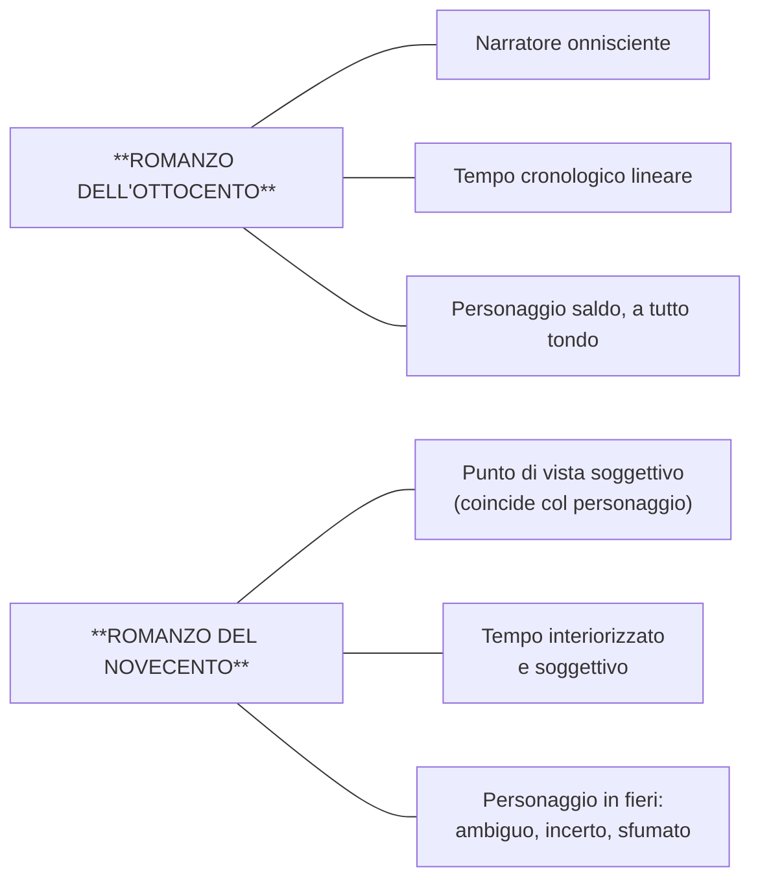
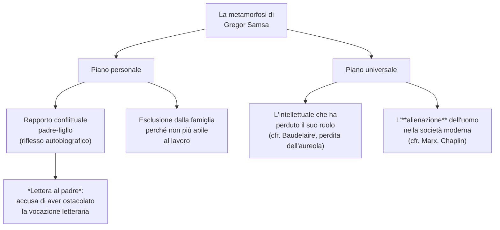

# Il romanzo del Novecento — Riassunto

---

## 1. Il romanzo ottocentesco come punto di partenza

Il romanzo dell'Ottocento — il cui modello italiano sono *I Promessi Sposi* di Manzoni — si fonda su tre pilastri: un **narratore onnisciente** che governa la storia dall'alto, un **tempo cronologico lineare** stabile e misurabile, e un **personaggio saldo e coerente**, a tutto tondo. Il romanzo del Novecento sovverte radicalmente tutti e tre questi pilastri.

---

## 2. Le tre grandi innovazioni del Novecento

**Prima innovazione: il punto di vista si restringe.** Il campo visivo del narratore si contrae fino a coincidere con la coscienza soggettiva di un singolo personaggio. Non esiste più un narratore-Dio: la storia viene filtrata dall'interiorità di chi la vive, e i giudizi che emergono sono sempre **relativi**, condizionati dal punto di vista di quello sguardo. Ne *La coscienza di Zeno*, l'io narrante è la coscienza di Zeno Cosini: il lettore non dispone mai di una verità oggettiva, solo del prisma deformante del protagonista.

**Seconda innovazione: il tempo si interiorizza.** Il tempo cessa di essere la successione ordinata dell'orologio e diventa soggettivo, plasmato dalla percezione di chi lo vive.

> [!note] Dalla lezione
> La professoressa ha proposto esempi per far capire il tempo soggettivo: un'ora di lezione non dura quanto un'ora del sabato sera quando ci si sta divertendo; i cinque minuti in cui aspettiamo qualcuno non pesano quanto quelli che mancano all'intervallo. Il tempo, a seconda dei nostri desideri, **rallenta oppure accelera**. Questa è la dimensione che domina il romanzo del Novecento.

Questi autori risentono di **Henri Bergson**, che teorizza il tempo come **durata**: non una successione di momenti separati, ma un fluire in cui i momenti si compenetrano. *La coscienza di Zeno* ne è l'incarnazione strutturale: il romanzo è organizzato per **nuclei tematici** — *Il fumo*, *La morte di mio padre*, *Storia del mio matrimonio*, *Un'impresa commerciale* — in cui passato, presente e futuro si intrecciano.

**Terza innovazione: il personaggio è in fieri.** Il protagonista novecentesco è **ambiguo, incerto, sfumato** — un personaggio *in fieri* ("in divenire") che si muove su molteplici piani psicologici e che spesso vive una condizione di **estraniamento** e **solitudine**.

---

## 3. Proust e la memoria involontaria

### L'episodio della Madeleine

L'esempio più celebre del tempo interiorizzato appartiene a Marcel Proust, nel romanzo *Dalla parte di Swann* (1913), primo volume di *Alla ricerca del tempo perduto* — titolo che già rivela il tema centrale. Il protagonista, intingendo una Madeleine — dolcetto a forma di conchiglia — in una tazza di tè, è sorpreso da un piacere delizioso che lo isola dal mondo e fa riemergere **intero il suo passato**: le estati a Combray, la zia Léonie che gli offriva quel dolcetto col tè.

### Il testo: *Dalla parte di Swann* (1913)

> Ed ecco, macchinalmente, oppresso dalla giornata grigia, dalla previsione di un triste domani, portai alle labbra un cucchiaino di tè in cui avevo inzuppato un pezzo di maddalena. Ma nel momento stesso che quel sorso misto alle briciole di focaccia toccò il mio palato, trasalii, attento a quanto avveniva in me di straordinario. Un piacere delizioso m'aveva invaso, isolato, senza nozione della sua causa. [...] Avevo cessato di sentirmi mediocre, contingente, mortale. Donde m'era potuta venire quella gioia violenta? Sentivo che era legata al sapore del tè e della focaccia...
>
> [...] È chiaro che la verità che cerco non è in essa, ma in me. Essa l'ha risvegliata, è la sensazione che ha risvegliata questa verità, ma non la conosce.

Il protagonista capisce che la verità non è nella bevanda, ma **dentro di lui**: la sensazione del gusto ha risvegliato qualcosa che giaceva sepolto nella memoria, ma non ne è l'origine. Poi il ricordo affiora: quel sapore era quello della Madeleine che la zia Léonie gli offriva a Combray, dopo averla bagnata nel tè.

La **vista** della focaccia non aveva evocato nulla; è stato il **gusto** a farlo: l'immagine visiva si era mescolata ad altri ricordi recenti, perdendo il legame con Combray, mentre il sapore, più tenue e più fedele, era rimasto intatto nel tempo. Proust lo afferma in una delle frasi più celebri della letteratura mondiale:

> Ma quando niente sussiste d'un passato antico, dopo la morte degli esseri, dopo la distruzione delle cose, più tenue ma più vividi, più immateriali, più persistenti, più fedeli, **l'odore e il sapore lungo il tempo ancora perdurano**, come anime a ricordare, ad attendere, a sperare, sopra la rovina di tutto il resto, portando sulla loro stilla quasi impalpabile, senza vacillare, **l'immenso edificio del ricordo**.

Odore e sapore sono i custodi del ricordo: quando tutto è crollato, sono loro a sopravvivere. E — come quei pezzetti di carta giapponesi che a contatto con l'acqua si aprono e diventano fiori, case, figure riconoscibili — **tutta Combray e i suoi dintorni, tutto quello che vien prendendo forma e solidità è sorto, città e giardini, dalla mia tazza di tè**.

> [!note] Dalla lezione
> Memoria involontaria **non va confusa con il déjà vu**: sono due fenomeni completamente diversi. La professoressa ha sottolineato che è la domanda che le fanno sempre, e ha tenuto a precisare che non c'è alcuna equivalenza tra i due.

Questo processo — la **memoria involontaria** — non è un ricordo cercato ma qualcosa che accade spontaneamente, scatenato da uno stimolo sensoriale. Fa riemergere le sensazioni stesse del passato: si rivivono le emozioni come se fossero presenti. I piani del tempo si sovrappongono e si fondono, esattamente come nella durata bergsoniana.

---

## 4. Kafka e *La metamorfosi*

### Lo straniamento come cifra narrativa

Un caso esemplare dell'isolamento e dell'estraniamento del personaggio novecentesco è *La metamorfosi* di Kafka (1916). Il protagonista è **Gregor Samsa**, un commesso viaggiatore che una mattina si sveglia trasformato in un enorme insetto. Ciò che rende la narrazione straordinaria non è il fatto in sé, ma il modo in cui viene raccontato: la metamorfosi è presentata come un evento **consueto**, ordinario. Questa tecnica si chiama **straniamento**: consiste nel presentare come ordinario un evento fuori dal comune, e viceversa.

### Il testo: l'incipit de *La metamorfosi* (1916)

> Un mattino, al risveglio da sogni inquieti, Gregor Samsa si trovò trasformato in un enorme insetto. Sdraiato nel letto sulla schiena dura come una corazza, bastava che alzasse un po' la testa per vedersi il ventre convesso, bruniccio, spartito da solchi arcuati. [...] Davanti agli occhi gli si agitavano le gambe, molto più numerose di prima ma di una sottigliezza desolante.
>
> *Che cosa mi è capitato?* pensò. Non stava sognando. La sua camera, una normale camera d'abitazione, anche se un po' piccola, gli appariva in luce quieta fra le quattro ben note pareti. Sopra al tavolo, sul quale era sparpagliato un campionario di telerie sballato da un pacco (Samsa faceva il commesso viaggiatore), stava appesa un'illustrazione [...] in una graziosa cornice dorata.

Il brano è costruito su un contrasto fortissimo: l'incipit ha la natura di una fiaba — un uomo si trasforma in insetto — ma la descrizione che segue è minutamente realistica: la camera, il campionario di telerie, la cornice dorata. Questo accostamento tra il surreale e il realistico produce lo **straniamento**, che genera spaesamento nel lettore. E come reagisce Gregor? Con normalità sconcertante:

> *«E se cercassi di dimenticare queste stravaganze facendo un altro dormitino?»* pensò.

Si è trasformato in un insetto e la sua prima reazione è pensare di fare **un altro dormitino**.

### Il significato: piano personale e piano universale

Sul **piano personale**, la vicenda riflette il rapporto conflittuale di Kafka con il padre. Gregor mantiene economicamente la famiglia, che nel momento in cui non può più lavorare lo esclude con disgusto. In *Lettera al padre* — «bellissimo e molto crudo», secondo la professoressa — Kafka accusa il genitore di aver ostacolato la sua vocazione di scrittore in nome delle convenzioni sociali e della logica del profitto.

> [!note] Dalla lezione
> Il rapporto padre-figlio è uno dei **temi fondamentali** del romanzo del Novecento, direttamente legato alla **psicanalisi freudiana**: Freud sostiene che i rapporti con i genitori influenzano lo sviluppo psichico dell'individuo, e che gli anni dell'infanzia determinano il futuro della persona.

Sul **piano universale**, la metamorfosi rappresenta il disagio dell'intellettuale che ha perduto il suo ruolo — eco della **perdita dell'aureola** di Baudelaire — e più in generale l'**alienazione** dell'uomo nella società industriale: dal latino *alienum* ("estraneo"), è l'estraneità a se stessi, il non essere più in contatto con la propria umanità.

> [!note] Dalla lezione
> La professoressa ha collegato l'alienazione a **Marx** (l'operaio che perde le sue caratteristiche umane nel lavoro ripetitivo) e ha mostrato la celebre scena di *Tempi moderni* di **Charlie Chaplin**, dove il protagonista continua ad avvitare bulloni anche fuori dalla fabbrica.

---

## 5. Le tecniche narrative: monologo interiore e flusso di coscienza

Il **monologo interiore** presenta i pensieri del personaggio in prima persona, come se fossero rivolti a un interlocutore: il personaggio "parla a se stesso" mantenendo però una struttura sintattica e logica riconoscibile. Esempio: il Preambolo de *La coscienza di Zeno* (Svevo, 1923).

Il **flusso di coscienza** è più radicale: registra i pensieri secondo un flusso **spontaneo e alogico**, eliminando punteggiatura e sintassi convenzionale. La psiche non procede con ordine ma **per libere associazioni** — lo stesso meccanismo su cui si fonda la **psicanalisi** freudiana. Il risultato è una **rappresentazione mimetica del pensiero** senza filtri narrativi. Esempio chiave: l'*Ulisse* di **James Joyce** (1922):

> ...se pensa di perché prima non ha mai fatto una cosa del genere chiedere la colazione a letto con due uova da quando eravamo all'albergo City Arms quando faceva finta di star male con la voce da sofferente e faceva il pascià per rendersi interessante...

La punteggiatura scompare, la sintassi si disgrega: i pensieri scorrono in una catena di libere associazioni senza che il narratore funga da filtro.

| Tecnica | Definizione | Caratteristiche | Esempio |
|---------|------------|-----------------|---------|
| **Monologo interiore** | Pensieri del personaggio in prima persona, come se rivolti a un interlocutore | Mantiene la struttura sintattica; il personaggio "parla a se stesso" | Preambolo de *La coscienza di Zeno* (Svevo, 1923) |
| **Flusso di coscienza** | Registrazione dei pensieri secondo il flusso spontaneo e alogico della mente | Scompare la punteggiatura; si procede per libere associazioni; rappresentazione mimetica del pensiero | *Ulisse* (Joyce, 1922) |

---

## 6. Joyce e l'*Ulisse*

Joyce è il maestro del flusso di coscienza. Il suo *Ulisse* (1922) trascrive il pensiero dei personaggi senza filtri, senza ordine logico, senza punteggiatura, simulando il funzionamento stesso della coscienza umana con i suoi salti, le sue associazioni improvvise e le sue deviazioni.

---

## 7. Svevo e *La coscienza di Zeno*

*La coscienza di Zeno* (1923) è stato usato durante la lezione come esempio ricorrente di tutte e tre le innovazioni novecentesche: punto di vista soggettivo, tempo non cronologico articolato in nuclei tematici, personaggio ambiguo e in divenire. Insieme a **Luigi Pirandello** (*Il fu Mattia Pascal*, *Uno, nessuno e centomila*), Svevo è il massimo esponente del **romanzo psicologico** italiano.

> [!note] Approfondimento
> La trattazione completa di Svevo — vita, i tre romanzi (*Una vita*, *Senilità*, *La coscienza di Zeno*), i tre personaggi (Nitti, Brentani, Zeno Cosini), il concetto di inetto, la malattia come vita, lo stile — si trova nella cartella dedicata: **`svevo/`** (lezione del 13/04/2026).

---

## Date di riferimento

| Anno | Opera |
|------|-------|
| **1913** | Proust, *Dalla parte di Swann* |
| **1916** | Kafka, *La metamorfosi* |
| **1922** | Joyce, *Ulisse* |
| **1923** | Svevo, *La coscienza di Zeno* |

---

*Fonti: lezione del 09/04/2026 — Lingua e letteratura italiana*
