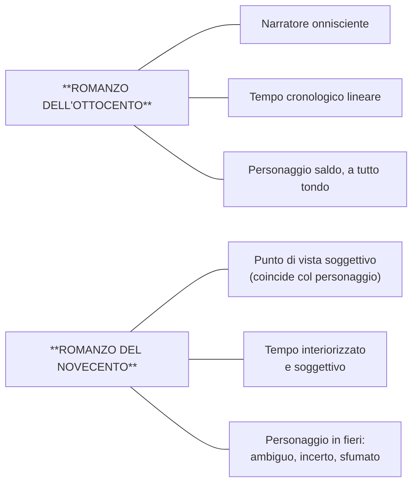
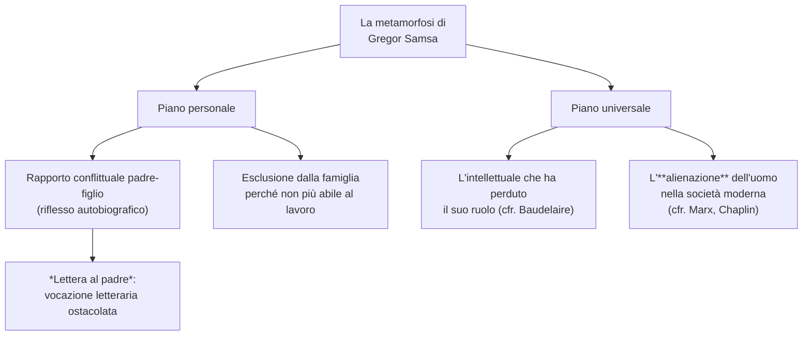
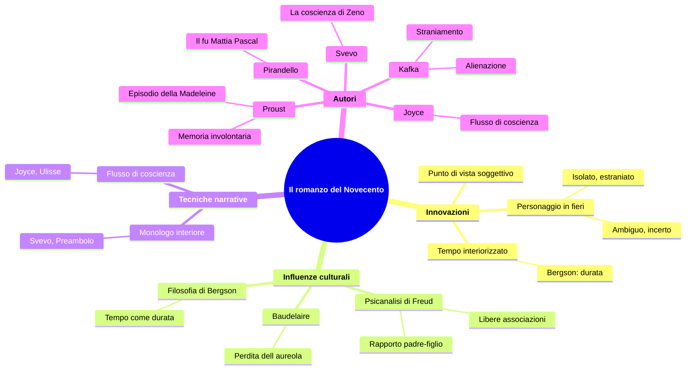

# Il romanzo del Novecento — Riassunto

---

## Coordinate essenziali

| Elemento | Dettaglio |
|----------|-----------|
| **Contesto** | Primo Novecento europeo, crisi delle certezze positiviste |
| **Influenze** | Henri Bergson (tempo come durata), Sigmund Freud (psicanalisi) |
| **Autori europei** | Marcel Proust (Francia), Franz Kafka (lingua tedesca), James Joyce (Inghilterra) |
| **Autori italiani** | Luigi Pirandello, Italo Svevo |
| **Opere principali** | *Alla ricerca del tempo perduto*, *La metamorfosi*, *Ulisse*, *La coscienza di Zeno*, *Il fu Mattia Pascal* |

---

## 1. Dal romanzo ottocentesco a quello novecentesco

### 1.1 I pilastri del romanzo ottocentesco

Il romanzo dell'Ottocento — il cui esempio italiano è *I Promessi Sposi* di Manzoni — si fonda su tre pilastri: un **narratore onnisciente** che domina la narrazione e conosce pensieri e vicende di tutti i personaggi; un **tempo cronologico lineare**, stabile e misurabile come le lancette di un orologio; un **personaggio saldo e a tutto tondo**, dotato di una coerenza interna chiara.

### 1.2 Le tre grandi innovazioni del Novecento

Il romanzo novecentesco sovverte tutti e tre questi pilastri.

**Primo: muta il punto di vista.** Il campo visivo del narratore si restringe fino a coincidere con quello di un singolo personaggio. Non c'è più un narratore-Dio: la storia viene filtrata dalla coscienza soggettiva di chi la vive. Ne *La coscienza di Zeno*, l'io narrante è Zeno e i suoi giudizi sono sempre relativi, dipendenti dal suo punto di vista. Questa soggettivizzazione si esprime spesso nella forma della **confessione autobiografica** o delle **memorie**.

**Secondo: muta la concezione del tempo.** Il tempo non è più una serie di momenti successivi oggettivi, ma viene **interiorizzato** e diventa **soggettivo**: un'ora di lezione sembra più lunga di un'ora di svago, i cinque minuti di attesa di qualcuno desiderato non durano quanto quelli che mancano all'intervallo. Questo tempo soggettivo è quello che domina il Novecento. *La coscienza di Zeno* non segue un ordine cronologico, ma è organizzata in **nuclei tematici** (*Il fumo*, *La morte di mio padre*, *Storia del mio matrimonio*...) in cui presente, passato e futuro si intrecciano. Alla base vi è il pensiero di **Henri Bergson**, che teorizza il tempo come **durata**: non una successione di momenti separati, ma un fluire in cui i momenti si compenetrano.

**Terzo: muta il personaggio.** Il protagonista novecentesco non è più granitico, ma è **ambiguo, incerto, sfumato** — un personaggio **in fieri** (in divenire) che si muove su più piani psicologici e si trova spesso in una condizione di **estraniamento** e **solitudine** rispetto al mondo.

---

## 2. Marcel Proust e la memoria involontaria

### 2.1 L'episodio della Madeleine

L'esempio più celebre di **tempo interiorizzato** appartiene a Marcel Proust. Nell'episodio della **Madeleine**, contenuto in *Dalla parte di Swann* (1913), il protagonista intinge un dolcetto in una tazza di tè e, nel momento in cui il sapore tocca il palato, viene invaso da un piacere delizioso che fa riemergere **intero il suo passato** — le estati a Combray, la zia Léonie che gli offriva proprio quella focaccia col tè. Questo processo si chiama **memoria involontaria**: non è un ricordo cercato, ma qualcosa che accade spontaneamente per mezzo di uno stimolo sensoriale (il gusto o, più spesso, l'olfatto), facendo rivivere non solo il ricordo, ma le **sensazioni** stesse di quel momento passato.

> Un piacere delizioso m'aveva invaso, isolato, senza nozione della sua causa. M'aveva reso indifferenti le vicissitudini della vita [...] Avevo cessato di sentirmi mediocre, contingente, mortale.

Il protagonista capisce che la verità non è nella bevanda, ma **dentro di lui**: la sensazione del gusto ha risvegliato qualcosa di sepolto nella memoria. La vista della Madeleine non aveva risvegliato nulla, perché l'immagine visiva si era mescolata ad altri ricordi più recenti; il sapore, più fedele, era rimasto intatto nel tempo:

> Ma quando niente sussiste d'un passato antico, dopo la morte degli esseri, dopo la distruzione delle cose, più tenue ma più vividi, **l'odore e il sapore lungo il tempo ancora perdurano**, come anime a ricordare, portando sulla loro stilla quasi impalpabile, senza vacillare, **l'immenso edificio del ricordo**.

La conclusione del brano è folgorante: come i pezzetti di carta giapponesi che a contatto con l'acqua si aprono e diventano fiori, case, figure riconoscibili, così dalla tazza di tè sorge un intero mondo — la casa, le strade, i giardini, **tutta Combray**.

### 2.2 I piani del tempo che si sovrappongono

L'episodio illustra come nel Novecento i **piani del tempo si intersecano**: il presente si fonde col passato, la vista rimanda ad "altri giorni più recenti" mentre il sapore riporta a Combray. Non c'è sequenza ordinata; il tempo si compenetra, esattamente come Bergson descriveva con il concetto di **durata**.

---

## 3. Franz Kafka e *La metamorfosi*

### 3.1 Lo straniamento come tecnica narrativa

Un esempio emblematico di estraniamento del personaggio novecentesco è *La metamorfosi* di Kafka (1916). Il protagonista **Gregor Samsa**, commesso viaggiatore, una mattina si sveglia trasformato in un enorme insetto. Ciò che colpisce è il modo in cui la metamorfosi viene narrata: come un evento **consueto**, ordinario. Questa tecnica si chiama **straniamento**: consiste nel presentare come normale un evento fuori dal comune. L'incipit è esemplare — una metamorfosi quasi fiabesca accostata a una descrizione iperealistica della camera, del campionario di telerie, dell'illustrazione ritagliata dal giornale.

E come reagisce Gregor alla trasformazione?

> *«E se cercassi di dimenticare queste stravaganze facendo un altro dormitino?»* pensò.

Pensa di fare **un altro dormitino**. Si è trasformato in insetto e la sua prima reazione è tentare di dormire sul fianco destro — cosa che, nel suo stato, non riesce a fare. È lo straniamento portato alle estreme conseguenze.

### 3.2 I significati della metamorfosi

**Piano personale.** Nella vicenda ci sono riflessi autobiografici: Gregor si addossa la responsabilità economica della famiglia, e quando non può più lavorare, la famiglia reagisce con disgusto ed esclusione. Questo rispecchia il rapporto conflittuale di Kafka col padre, descritto nella *Lettera al padre*, in cui lo scrittore accusa il genitore di aver ostacolato la sua vocazione di **scrittore**, negando il riconoscimento della sua vera identità.

**Piano universale.** La metamorfosi rappresenta il disagio dell'**intellettuale che ha perduto il suo ruolo** sociale (cfr. Baudelaire e la perdita dell'aureola), e più in generale l'**alienazione** dell'uomo moderno. *Alienazione* deriva dal latino *alienum* (estraneo): è l'estraneità a se stessi, il non essere più in contatto con la propria umanità. La professoressa ha collegato questo concetto a Marx (l'operaio inserito nel lavoro ripetitivo perde le sue caratteristiche umane) e alla celebre scena di *Tempi moderni* di Chaplin, in cui il protagonista continua ad avvitare bulloni anche fuori dalla fabbrica.

---

## 4. Le tecniche narrative: monologo interiore e flusso di coscienza

| Tecnica | Definizione | Caratteristiche | Esempio |
|---------|-------------|-----------------|---------|
| **Monologo interiore** | Pensieri del personaggio in prima persona, come rivolti a un interlocutore | Mantiene la struttura sintattica; il personaggio "parla a se stesso" | Preambolo de *La coscienza di Zeno* (Svevo, 1923) |
| **Flusso di coscienza** | Registrazione dei pensieri secondo il flusso spontaneo e alogico della mente | Scompare la punteggiatura; si procede per libere associazioni; rappresentazione mimetica del pensiero | *Ulisse* (Joyce, 1922) |

Il **monologo interiore** è la presentazione in prima persona dei pensieri del personaggio come se fossero rivolti a un interlocutore: il personaggio parla a se stesso, mantenendo però una struttura sintattica e logica riconoscibile.

Il **flusso di coscienza** è più radicale: registra i pensieri secondo un **flusso spontaneo e alogico**, secondo il principio di disordine con cui i pensieri si presentano alla mente. Vengono meno la grammatica convenzionale e la punteggiatura, perché la psiche procede per **libere associazioni** — lo stesso meccanismo su cui si fonda la **psicanalisi freudiana**. Ne *L'Ulisse* di Joyce (1922):

> ...se pensa di perché prima non ha mai fatto una cosa del genere chiedere la colazione a letto con due uova da quando eravamo all'albergo City Arms quando faceva finta di star male con la voce da sofferente...

I pensieri scorrono senza filtri, senza punteggiatura, per associazione spontanea: è una **rappresentazione mimetica del pensiero** così com'è nella mente, senza che il narratore funga da filtro logico.

---

## 5. Italo Svevo e *La coscienza di Zeno*

*La coscienza di Zeno* (1923) è il romanzo più importante di Svevo e uno dei paradigmi del romanzo novecentesco in Italia. Concentra in sé tutte le innovazioni del Novecento: il **punto di vista ristretto** della coscienza soggettiva di Zeno (i cui giudizi sono sempre relativi, mai assoluti); il **tempo soggettivo** organizzato per nuclei tematici anziché in ordine cronologico; la **forma autobiografica** delle memorie. Insieme a **Luigi Pirandello** (*Il fu Mattia Pascal*, *Uno, nessuno e centomila*), Svevo è il massimo esponente del **romanzo psicologico** italiano, incentrato sull'esplorazione dell'interiorità, sulla frammentazione dell'identità e sulla crisi delle certezze.

---

## 6. Quadro d'insieme

---

## Date di riferimento

| Anno | Opera |
|------|-------|
| **1913** | Marcel Proust, *Dalla parte di Swann* |
| **1916** | Franz Kafka, *La metamorfosi* |
| **1922** | James Joyce, *Ulisse* |
| **1923** | Italo Svevo, *La coscienza di Zeno* |

---

*Fonti: lezione del 09/04/2026 — Lingua e letteratura italiana*
