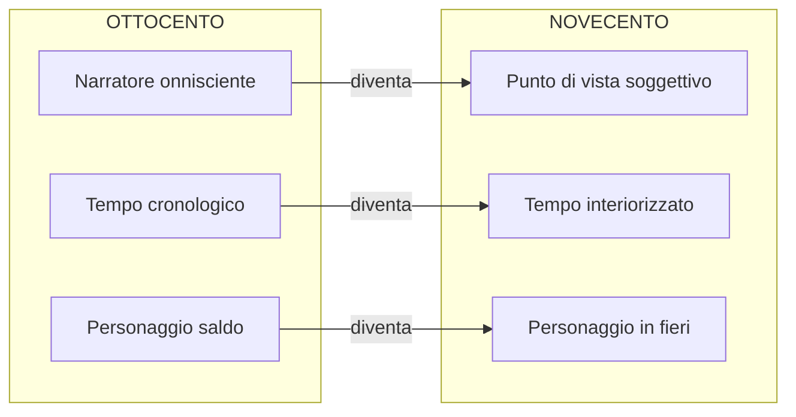

# Il romanzo del Novecento — Ripasso veloce

---

## Le tre innovazioni rispetto all'Ottocento

**1. Punto di vista soggettivo** — Il narratore onnisciente scompare; la narrazione coincide con la coscienza di un personaggio (es. Zeno). I giudizi sono sempre relativi.

**2. Tempo interiorizzato** — Non più cronologico ma soggettivo: rallenta e accelera secondo la percezione. Influenza decisiva di **Bergson** (tempo come durata). *La coscienza di Zeno* è divisa in nuclei tematici, non capitoli cronologici.

**3. Personaggio in fieri** — Ambiguo, incerto, sfumato, in divenire. Spesso isolato e estraniato dalla società.

---

## I quattro autori

**Proust** — *Dalla parte di Swann* (1913), ciclo *Alla ricerca del tempo perduto*. Episodio della **Madeleine**: intingendo un dolcetto nel tè, il sapore fa riemergere involontariamente l'intero passato a Combray. È la **memoria involontaria**: scatenata da stimoli sensoriali (gusto, olfatto), non cercata ma spontanea, riporta non solo ricordi ma sensazioni. «L'odore e il sapore perdurano... portando l'immenso edificio del ricordo.» Non è déjà vu.

**Kafka** — *La metamorfosi* (1916). Gregor Samsa si sveglia trasformato in insetto. La vicenda è narrata con **straniamento**: evento surreale in contesto realistico, vissuto come consueto. Significati: rapporto padre-figlio (autobiografico, cfr. *Lettera al padre*), crisi dell'intellettuale (perdita dell'aureola, Baudelaire), **alienazione** dell'uomo moderno (cfr. Marx, *Tempi moderni* di Chaplin). La psicanalisi freudiana è sullo sfondo.

**Joyce** — *Ulisse* (1922). Maestro del **flusso di coscienza**: registrazione dei pensieri nel loro sorgere spontaneo, per libere associazioni, senza punteggiatura né sintassi convenzionale. È una rappresentazione **mimetica** del pensiero, senza filtro del narratore.

**Svevo** — *La coscienza di Zeno* (1923). Romanzo psicologico italiano per eccellenza. Incarna tutte le innovazioni: io narrante = coscienza di Zeno (giudizi relativi), struttura a nuclei tematici (tempo soggettivo), personaggio ambiguo e in divenire. Insieme a Pirandello, massimo esponente del genere in Italia.

---

## Le due tecniche narrative

| | Monologo interiore | Flusso di coscienza |
|---|---|---|
| **Come funziona** | Pensieri in prima persona, come rivolti a un interlocutore | Pensieri nel flusso spontaneo e alogico della mente |
| **Sintassi** | Mantenuta | Scompare (no punteggiatura) |
| **Logica** | Presente | Per libere associazioni |
| **Legame con Freud** | — | Le libere associazioni sono il meccanismo della psicanalisi |
| **Esempio** | Preambolo, *Coscienza di Zeno* (1923) | *Ulisse* di Joyce (1922) |

---

## Timeline

---

*Fonti: lezione del 09/04/2026*
