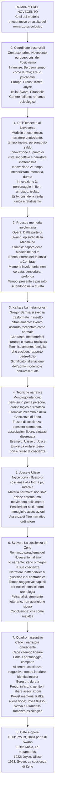

# Schema prova — Romanzo del Novecento

Formato pensato per stampa in bianco e nero: ordine verticale, poche diramazioni, lettura dall'alto verso il basso.

```mermaid
flowchart TB
    A["ROMANZO DEL NOVECENTO<br/>Crisi del modello ottocentesco e nascita del romanzo psicologico"]

    A --> B["0. Coordinate essenziali<br/>Contesto: primo Novecento europeo, crisi del Positivismo<br/>Influenze: Bergson tempo come durata; Freud psicanalisi<br/>Europa: Proust, Kafka, Joyce<br/>Italia: Svevo, Pirandello<br/>Genere italiano: romanzo psicologico"]

    B --> C["1. Dall'Ottocento al Novecento<br/>Modello ottocentesco: narratore onnisciente, tempo lineare, personaggio saldo<br/>Innovazione 1: punto di vista soggettivo e narratore inattendibile<br/>Innovazione 2: tempo interiorizzato, memoria, durata<br/>Innovazione 3: personaggio in fieri, ambiguo, isolato<br/>Esito: crisi della verita unica e relativismo"]

    C --> D["2. Proust e memoria involontaria<br/>Opera: Dalla parte di Swann, episodio della Madeleine<br/>Stimolo: sapore della Madeleine nel te<br/>Effetto: ritorno dell'infanzia a Combray<br/>Memoria involontaria: non cercata, sensoriale, profonda<br/>Tempo: presente e passato si fondono nella durata"]

    D --> E["3. Kafka e La metamorfosi<br/>Gregor Samsa si sveglia trasformato in insetto<br/>Straniamento: evento assurdo raccontato come normale<br/>Contrasto: metamorfosi surreale e stanza realistica<br/>Temi: isolamento, famiglia che esclude, rapporto padre-figlio<br/>Significato: alienazione dell'uomo moderno e dell'intellettuale"]

    E --> F["4. Tecniche narrative<br/>Monologo interiore: pensieri in prima persona, ordine logico e sintattico<br/>Esempio: Preambolo della Coscienza di Zeno<br/>Flusso di coscienza: pensiero spontaneo, associazioni libere, sintassi disgregata<br/>Esempio: Ulisse di Joyce<br/>Errore da evitare: Zeno non e flusso di coscienza"]

    F --> G["5. Joyce e Ulisse<br/>Joyce porta il flusso di coscienza alla forma piu radicale<br/>Materia narrativa: non solo azione esterna, ma movimento della mente<br/>Pensieri per salti, ritorni, immagini e associazioni<br/>Assenza di filtro narrativo ordinatore"]

    G --> H["6. Svevo e La coscienza di Zeno<br/>Romanzo paradigma del Novecento italiano<br/>Io narrante: Zeno o meglio la sua coscienza<br/>Narratore inattendibile: si giustifica e si contraddice<br/>Tempo soggettivo: capitoli per nuclei tematici, non cronologia<br/>Psicanalisi: strumento letterario, non guarigione sicura<br/>Conclusione: vita come malattia"]

    H --> I["7. Quadro riassuntivo<br/>Cade il narratore onnisciente<br/>Cade il tempo lineare<br/>Cade il personaggio compatto<br/>Al centro: coscienza soggettiva, tempo interiore, identita incerta<br/>Bergson: durata<br/>Freud: infanzia, genitori, libere associazioni<br/>Proust memoria; Kafka alienazione; Joyce flusso; Svevo e Pirandello romanzo psicologico"]

    I --> L["8. Date e opere<br/>1913: Proust, Dalla parte di Swann<br/>1916: Kafka, La metamorfosi<br/>1922: Joyce, Ulisse<br/>1923: Svevo, La coscienza di Zeno"]
```
