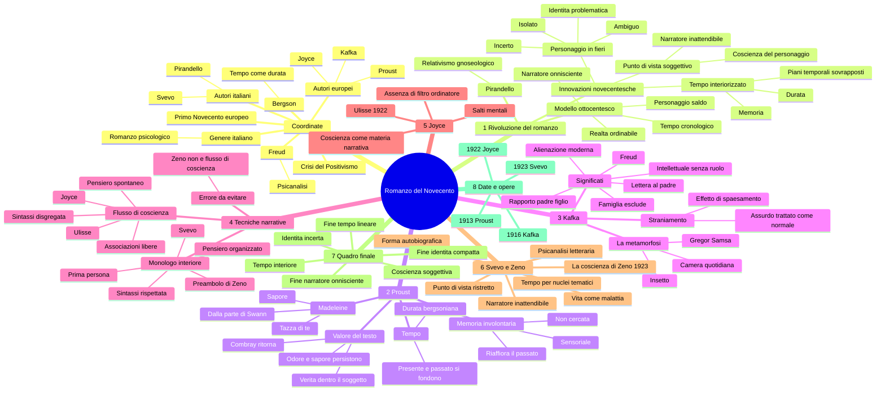

# Schema mentale stampabile — Romanzo del Novecento

Schema unico e compatto, disposto nello stesso ordine del `riassunto.md`.

```mermaid
mindmap
  root((Romanzo del Novecento))
    Coordinate
      Crisi del Positivismo
      Primo Novecento europeo
      Bergson
        Tempo come durata
      Freud
        Psicanalisi
      Autori europei
        Proust
        Kafka
        Joyce
      Autori italiani
        Svevo
        Pirandello
      Genere italiano
        Romanzo psicologico
    1 Rivoluzione del romanzo
      Modello ottocentesco
        Narratore onnisciente
        Tempo cronologico
        Personaggio saldo
        Realta ordinabile
      Innovazioni novecentesche
        Punto di vista soggettivo
          Coscienza del personaggio
          Narratore inattendibile
        Tempo interiorizzato
          Memoria
          Durata
          Piani temporali sovrapposti
        Personaggio in fieri
          Ambiguo
          Incerto
          Isolato
          Identita problematica
      Pirandello
        Relativismo gnoseologico
    2 Proust
      Madeleine
        Dalla parte di Swann
        Tazza di te
        Sapore
      Memoria involontaria
        Non cercata
        Sensoriale
        Riaffiora il passato
      Valore del testo
        Verita dentro il soggetto
        Odore e sapore persistono
        Combray ritorna
      Tempo
        Presente e passato si fondono
        Durata bergsoniana
    3 Kafka
      La metamorfosi
        Gregor Samsa
        Insetto
        Camera quotidiana
      Straniamento
        Assurdo trattato come normale
        Effetto di spaesamento
      Significati
        Famiglia esclude
        Rapporto padre figlio
        Lettera al padre
        Freud
        Alienazione moderna
        Intellettuale senza ruolo
    4 Tecniche narrative
      Monologo interiore
        Prima persona
        Pensiero organizzato
        Sintassi rispettata
        Svevo
        Preambolo di Zeno
      Flusso di coscienza
        Pensiero spontaneo
        Associazioni libere
        Sintassi disgregata
        Joyce
        Ulisse
      Errore da evitare
        Zeno non e flusso di coscienza
    5 Joyce
      Ulisse 1922
      Coscienza come materia narrativa
      Salti mentali
      Assenza di filtro ordinatore
    6 Svevo e Zeno
      La coscienza di Zeno 1923
      Punto di vista ristretto
      Narratore inattendibile
      Tempo per nuclei tematici
      Forma autobiografica
      Psicanalisi letteraria
      Vita come malattia
    7 Quadro finale
      Fine narratore onnisciente
      Fine tempo lineare
      Fine identita compatta
      Coscienza soggettiva
      Tempo interiore
      Identita incerta
    8 Date e opere
      1913 Proust
      1916 Kafka
      1922 Joyce
      1923 Svevo
```
