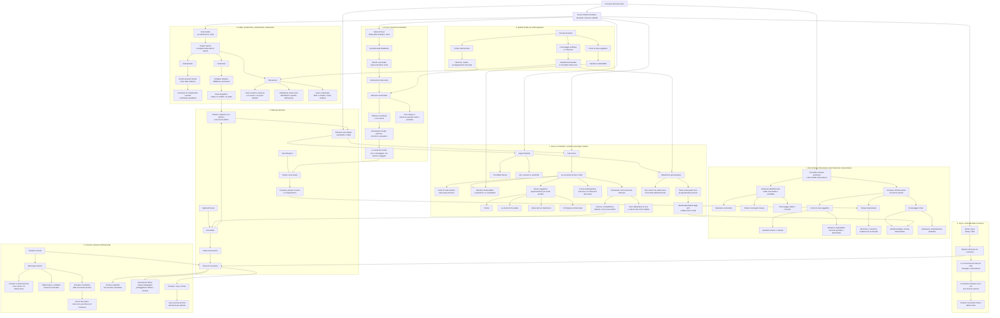

# Schema Mermaid - Il romanzo del Novecento

```mermaid
flowchart TD
    A["Romanzo del Novecento"] --> B["Crisi delle certezze positiviste<br/>e del modello ottocentesco"]
    A --> C["Nuova materia narrativa:<br/>interiorità, memoria, identità"]
    A --> D["Romanzo psicologico<br/>soprattutto in Italia"]

    subgraph S1["1. Dal romanzo ottocentesco alla rivoluzione novecentesca"]
        B --> B1["Romanzo dell'Ottocento<br/>realtà conoscibile e ordinabile"]
        B1 --> B1a["Narratore onnisciente"]
        B1 --> B1b["Tempo cronologico lineare"]
        B1 --> B1c["Personaggio saldo e coerente"]

        B --> B2["Romanzo del Novecento<br/>crisi dei tre pilastri"]
        B2 --> B2a["Punto di vista soggettivo"]
        B2a --> B2a1["Narratore interno o ristretto"]
        B2a --> B2a2["Narratore inattendibile:<br/>versione parziale e deformante"]
        B2 --> B2b["Tempo interiorizzato"]
        B2b --> B2b1["Memoria e coscienza<br/>sostituiscono la linearità"]
        B2 --> B2c["Personaggio in fieri"]
        B2c --> B2c1["Identità ambigua, incerta,<br/>frammentata"]
        B2c --> B2c2["Isolamento, estraniamento,<br/>solitudine"]
    end

    subgraph S2["2. Influenze decisive"]
        E["Henri Bergson"] --> E1["Tempo come durata"]
        E1 --> E2["Presente, passato e futuro<br/>si compenetrano"]
        E2 --> B2b

        F["Sigmund Freud"] --> F1["Psicanalisi"]
        F1 --> F2["Infanzia, rapporto con i genitori,<br/>zone oscure dell'io"]
        F1 --> F3["Libere associazioni"]
        F2 --> D
        F3 --> T2
    end

    subgraph S3["3. Proust: memoria involontaria"]
        P["Marcel Proust<br/>Dalla parte di Swann, 1913"] --> P1["Episodio della Madeleine"]
        P1 --> P2["Stimolo sensoriale:<br/>sapore del dolce nel tè"]
        P2 --> P3["Sensazione improvvisa"]
        P3 --> P4["Memoria involontaria"]
        P4 --> P5["Infanzia a Combray<br/>e zia Léonie"]
        P5 --> P6["Riemergono luoghi, persone,<br/>emozioni, sensazioni"]
        P6 --> P7["La verità del ricordo<br/>non è nell'oggetto, ma dentro il soggetto"]
        P7 --> E1
        P4 --> P8["Non è déjà vu:<br/>riporta un passato reale e profondo"]
    end

    subgraph S4["4. Kafka: metamorfosi, straniamento, alienazione"]
        K["Franz Kafka<br/>La metamorfosi, 1916"] --> K1["Gregor Samsa<br/>si sveglia trasformato in insetto"]
        K1 --> K2["Straniamento"]
        K2 --> K2a["Evento assurdo narrato<br/>come fatto ordinario"]
        K2a --> K2b["Contrasto tra metamorfosi surreale<br/>e ambiente quotidiano"]
        K1 --> K3["Isolamento"]
        K3 --> K3a["Famiglia: disgusto,<br/>diffidenza, esclusione"]
        K3a --> K3b["Piano biografico:<br/>Kafka e il conflitto col padre"]
        K3b --> F2
        K1 --> K4["Alienazione"]
        K4 --> K4a["Uomo moderno estraneo<br/>a se stesso e ai propri desideri"]
        K4 --> K4b["Intellettuale senza ruolo:<br/>Baudelaire e perdita dell'aureola"]
        K4 --> K4c["Lavoro industriale:<br/>Marx e Chaplin, Tempi moderni"]
    end

    subgraph S5["5. Tecniche narrative dell'interiorità"]
        T["Pensiero narrato"] --> T1["Monologo interiore"]
        T1 --> T1a["Pensieri in prima persona<br/>come rivolti a un interlocutore"]
        T1 --> T1b["Ordine logico e sintattico<br/>ancora riconoscibile"]
        T1 --> T1c["Esempio: Preambolo<br/>della Coscienza di Zeno"]

        T --> T2["Flusso di coscienza"]
        T2 --> T2a["Pensieri registrati<br/>nel loro fluire spontaneo"]
        T2 --> T2b["Associazioni libere,<br/>sintassi disgregata,<br/>punteggiatura ridotta o assente"]
        T2 --> T2c["Esempio: Joyce, Ulisse"]

        T1c --> X1["Errore da evitare:<br/>Zeno non usa il flusso di coscienza"]
        T2c --> X2["Joyce porta la tecnica<br/>alla forma più radicale"]
    end

    subgraph S6["6. Joyce: centralità della coscienza"]
        J["James Joyce<br/>Ulisse, 1922"] --> J1["Maestro del flusso di coscienza"]
        J1 --> J2["La coscienza procede per salti,<br/>immagini e associazioni"]
        J2 --> J3["La materia narrativa non è più<br/>solo l'azione esterna"]
        J3 --> J4["Diventa movimento interno<br/>della mente"]
        J1 --> T2
    end

    subgraph S7["7. Svevo e Pirandello: romanzo psicologico italiano"]
        D --> I["Italo Svevo"]
        D --> R["Luigi Pirandello"]

        I --> I1["La coscienza di Zeno, 1923"]
        I1 --> I2["Punto di vista ristretto:<br/>tutto passa da Zeno"]
        I1 --> I3["Narratore inattendibile:<br/>si giustifica e si contraddice"]
        I1 --> I4["Tempo soggettivo:<br/>organizzazione per nuclei tematici"]
        I4 --> I4a["Il fumo"]
        I4 --> I4b["La morte di mio padre"]
        I4 --> I4c["Storia del mio matrimonio"]
        I4 --> I4d["Un'impresa commerciale"]
        I1 --> I5["Forma autobiografica:<br/>memorie e ricostruzione del vissuto"]
        I1 --> I6["Psicanalisi come strumento letterario"]
        I6 --> I6a["Nevrosi, contraddizioni,<br/>infanzia, zone oscure dell'io"]
        I6 --> I6b["Zeno abbandona la cura<br/>e vede la vita come malattia"]
        I6a --> F1

        R --> R1["Il fu Mattia Pascal"]
        R --> R2["Uno, nessuno e centomila"]
        R --> R3["Relativismo gnoseologico"]
        R3 --> R4["Non esiste una realtà unica<br/>conoscibile definitivamente"]
        R3 --> R5["Tante verità quanti sono<br/>gli sguardi delle persone"]
        R5 --> R6["Identità dipendente dagli altri<br/>e dalle forme sociali"]
        R6 --> B2c1
    end

    subgraph S8["8. Quadro finale per l'interrogazione"]
        Q["Formula di sintesi"] --> Q1["Punto di vista soggettivo"]
        Q --> Q2["Tempo interiorizzato"]
        Q --> Q3["Personaggio ambiguo<br/>e in divenire"]
        Q1 --> Q4["Narratore inattendibile"]
        Q2 --> Q5["Memoria, durata,<br/>sovrapposizione dei tempi"]
        Q3 --> Q6["Identità frammentata<br/>e crisi della verità unica"]
        Q4 --> I3
        Q5 --> P4
        Q6 --> R3
        Q6 --> K4
    end

    C --> P
    C --> K
    C --> J
    C --> I
    C --> R
```
