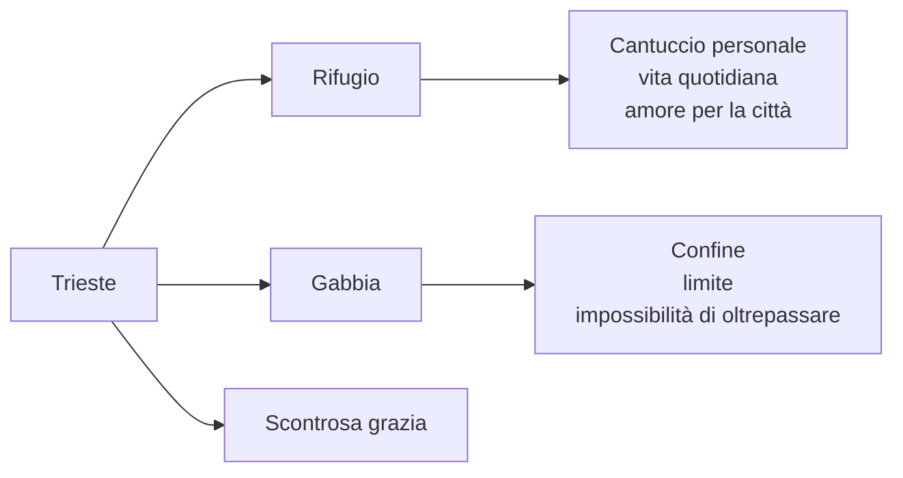
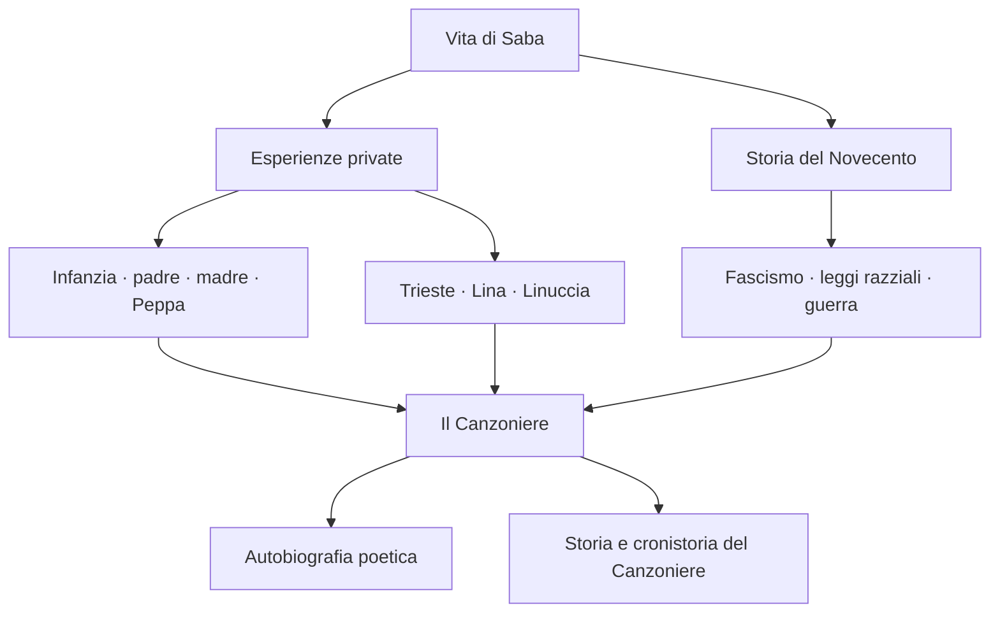
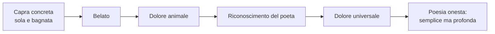
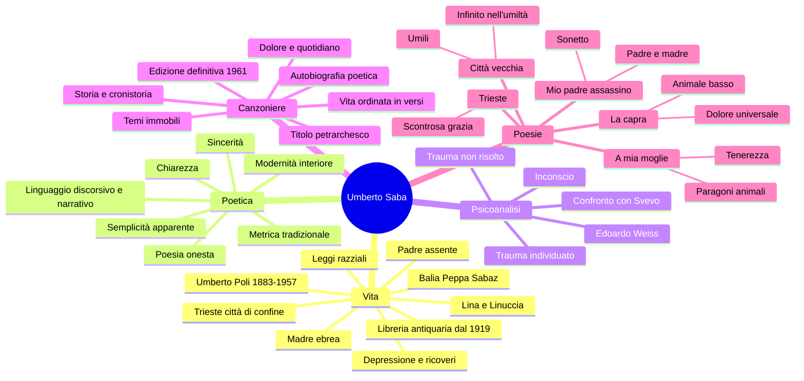

# Umberto Saba

---

## Coordinate essenziali

| Elemento | Dettaglio |
|----------|-----------|
| **Vero nome** | Umberto Poli |
| **Pseudonimo** | Umberto Saba |
| **Nato** | 1883, **Trieste** |
| **Morto** | 1957 |
| **Famiglia** | Madre ebrea, padre cristiano e assente; balia slovena Peppa Sabaz |
| **Figure centrali** | Madre austera · padre fuggitivo · balia Peppa · moglie Lina/Carolina · figlia Linuccia |
| **Lavoro** | Autodidatta; dal 1919 proprietario di una libreria antiquaria a Trieste |
| **Opera principale** | *Il Canzoniere*, autobiografia poetica di una vita |
| **Poetica** | Poesia onesta: chiarezza, sincerità, parole comuni, verità interiore |
| **Contesto** | Trieste di confine, ambiente multilingue e multietnico, contatto precoce con la psicoanalisi |

---

## 1. Trieste: la città di confine

### 1.1 Una città multilingue e multietnica

Saba nasce a **Trieste**, città che non va considerata come semplice luogo di nascita. Trieste è una città di **confine**, di porto, di scambi commerciali, di passaggio di merci e persone. Per questo è anche un ambiente **multilingue** e **multietnico**, aperto alle culture italiana, slava, tedesca, austriaca, ebraica.

Questa condizione di frontiera rende Trieste diversa da molte città italiane più chiuse dentro una tradizione nazionale. La si può confrontare, per capirne la funzione, con una città cosmopolita come **New York**, cioè uno spazio in cui identità diverse convivono e si mescolano. All'opposto, una città universitaria e italiana come **Bologna** può rappresentare un centro culturale importante, ma meno segnato da quella tensione di confine che caratterizza Trieste.

In questa Trieste di primo Novecento si muovono autori fondamentali:

| Autore | Legame con Trieste |
|--------|--------------------|
| **Italo Svevo** | Triestino, borghese, legato alla cultura mitteleuropea e alla psicoanalisi |
| **James Joyce** | Vive a Trieste e lavora come insegnante; entra in contatto con Svevo |
| **Scipio Slataper** | Scrittore triestino, autore de *Il mio Carso*, legato al problema dell'identità di confine |
| **Carlo Michelstaedter** | Goriziano, vicino all'area culturale giuliana, figura di inquietudine filosofica e letteraria |

> [!note] Dalla lezione
> Trieste è presentata come città culturale, di scambi di merci e di persone, al crocevia di culture diverse. La lezione la collega subito a Svevo: anche lui è segnato dalla città di confine, dalla psicoanalisi e da una formazione non chiusa dentro un solo ambiente nazionale.

### 1.2 Trieste amata e odiata

Il rapporto di Saba con Trieste è **ambivalente**. La città è amata perché è il suo rifugio, il luogo del suo "cantuccio", lo spazio concreto della vita quotidiana. Ma è anche odiata perché può diventare una gabbia: un confine che trattiene, una prigione che impedisce di andare oltre.

La lezione propone un confronto con **Recanati per Leopardi**. Come Recanati è per Leopardi il luogo dell'origine, della famiglia e insieme della costrizione, così Trieste è per Saba la città-rifugio e la città-limite.

Questa doppiezza ritorna nella poesia *Trieste*, dove compare la formula celebre della **scontrosa grazia**: Trieste ha una bellezza non dolce, non levigata, ma difficile, aspra, schiva. È una città che attrae e respinge.

---

## 2. Biografia e ferite originarie

### 2.1 Umberto Poli: nascita e famiglia

Umberto Saba nasce come **Umberto Poli** nel **1883**. La sua biografia è povera di eventi esteriori clamorosi, ma ricchissima di tensioni interiori. Ciò che conta non è tanto l'avventura esterna, quanto la **vicenda familiare**: il padre assente, la madre severa, la balia amata, la scissione delle origini.

La madre è **ebrea**, il padre è **cristiano**. Questa doppia origine produce in Saba una prima forma di inquietudine: da una parte l'appartenenza ebraica, dall'altra la presenza del cristianesimo attraverso il padre. La lezione parla di una vera e propria **scissione interiore**.

> [!note] Dalla lezione
> Il docente insiste sul fatto che la vita di Saba è segnata soprattutto dall'interiorità. La guerra e il fascismo entrano nella sua biografia, ma il nucleo più profondo è familiare: infanzia, padre, madre, balia, moglie.

### 2.2 Il padre assente

Il padre abbandona la famiglia praticamente prima della nascita del figlio. Saba cresce quindi senza di lui e lo conosce solo a circa vent'anni. Nella poesia *Mio padre è stato per me l'assassino* il poeta rilegge questa ferita.

La parola **"assassino"** è tra virgolette perché non è una definizione neutra del poeta: è la parola della madre, il giudizio rancoroso con cui Saba è cresciuto. Il padre non è assassino in senso letterale, ma è colui che ha abbandonato la famiglia, non si è preso le proprie responsabilità, è fuggito.

Quando però Saba lo incontra, scopre che quel padre non è un mostro: è un uomo infantile, leggero, irresponsabile, ma anche capace di un dono. Il poeta riconosce in lui qualcosa di sé: lo sguardo, il sorriso, forse il **dono della poesia**.

| Elemento della poesia | Significato |
|-----------------------|-------------|
| **"assassino"** | Parola della madre, carica di rancore |
| **Padre conosciuto a vent'anni** | Il padre è assenza durante l'infanzia |
| **"bambino"** | Uomo non cresciuto, istintivo, irresponsabile |
| **"dono"** | Possibile dono poetico ricevuto dal padre |
| **"pellegrino"** | Uomo inquieto, incapace di fermarsi |
| **"pasciuto"** | Termine alto/desueto: amato e nutrito da più donne |

### 2.3 La madre e la balia Peppa

La madre di Saba è una figura austera, severa, segnata dal dolore dell'abbandono. Affida il figlio a una balia slovena, **Peppa Sabaz**. Con Peppa il bambino vive un rapporto affettuoso, caloroso, allegro. Proprio questo amore rende più evidente la distanza dalla madre.

La balia diventa quindi una figura decisiva: non solo per l'infanzia di Saba, ma anche per il suo nome poetico. Lo pseudonimo **Saba** viene probabilmente collegato a **Sabaz**, il cognome della nutrice; ha dunque un valore affettivo e identitario. Allo stesso tempo, il nome richiama anche l'orizzonte ebraico, perché può essere accostato a una radice ebraica legata alla memoria familiare e all'appartenenza.

Il nome "Saba" tiene insieme due direzioni:

- la **balia Peppa Sabaz**, cioè l'affetto infantile e materno-sostitutivo;
- il **riferimento ebraico**, cioè la parte profonda dell'identità familiare.

### 2.4 Lina, Linuccia e la vita domestica

La figura femminile più importante della poesia di Saba è la moglie **Lina**, cioè Carolina Woelfler. Lina è la donna domestica, quotidiana, con cui Saba vive quasi tutta la vita. La loro relazione non è però semplice: Lina lo abbandona per un breve periodo, anche per l'insoddisfazione del matrimonio, poi ritorna.

Saba canta Lina con grande intensità, ma la lezione sottolinea anche un'ambivalenza: la moglie può assumere inconsciamente una funzione materna, di cura e accudimento. Da lei Saba ha una figlia, **Linuccia**, alla quale dedicherà poesie importanti.

Nella poesia accennata in lezione, *Ed amai nuovamente*, Lina è ricordata come la donna del "**rosso scialle**": lo scialle è semplice, familiare; il rosso rimanda alla passione, all'amore, ma anche al dolore. Saba dice di aver conosciuto altri amori, ma per Lina ricomincerebbe una vita nuova.

### 2.5 Lavoro, storia e ultimi anni

Saba è un **autodidatta**: non costruisce la propria cultura dentro un percorso accademico regolare, ma attraverso letture personali e una formazione autonoma. Dal **1919** gestisce a Trieste una **libreria antiquaria**, che diventa anche il suo lavoro stabile.

La storia del Novecento entra nella sua vita in modo duro. Essendo di origine ebraica, durante il fascismo e le **leggi razziali** deve nascondersi e allontanarsi da Trieste. Viene aiutato da amici e intellettuali, tra cui **Ungaretti**, **Montale** e altri. Negli ultimi anni soffre di depressione e attraversa ricoveri e cure, fino alla morte nel **1957**.

---

## 3. Psicoanalisi e interiorità

### 3.1 Trieste e la psicoanalisi

Trieste è uno dei primi luoghi italiani in cui la psicoanalisi arriva con forza, per la vicinanza al mondo austriaco e mitteleuropeo. Questo vale per Svevo, ma anche per Saba.

Saba entra in rapporto con la psicoanalisi attraverso **Edoardo Weiss**, medico triestino e allievo di Freud. La psicoanalisi individua il trauma centrale della sua vita, legato all'infanzia e alla separazione dalle figure genitoriali, ma non lo risolve definitivamente.

> [!note] Dalla lezione
> La poesia *Mio padre è stato per me l'assassino* viene letta come testo impregnato di psicoanalisi: al centro ci sono il rapporto con il padre, l'infanzia, l'evoluzione nella vita adulta, l'indagine su di sé e sull'inconscio.

### 3.2 Confronto con Svevo

Il confronto con **Svevo** è utile perché entrambi sono triestini, entrambi entrano in contatto con la psicoanalisi, entrambi indagano l'interiorità. Ma la funzione è diversa.

| Aspetto | Svevo | Saba |
|---------|-------|------|
| **Genere principale** | Romanzo | Poesia |
| **Psicoanalisi** | Strumento letterario per rappresentare la nevrosi borghese | Strumento per leggere il trauma personale |
| **Nucleo** | Inettitudine, malattia della vita, autoinganno | Infanzia, padre, madre, desiderio di verità |
| **Tono** | Ironico, narrativo, spesso distaccato | Sincero, diretto, doloroso |

Per Saba la psicoanalisi non è un tema esterno: serve a nominare ciò che la poesia cerca da sempre, cioè la **verità profonda dell'io**.

---

## 4. La poetica: poesia onesta

### 4.1 Chiarezza e sincerità

La formula più importante per capire Saba è **poesia onesta**. La poesia deve essere chiara, sincera, fedele alla verità. Non deve stupire con artifici, non deve costruire maschere retoriche, non deve inseguire la novità formale a tutti i costi.

L'onestà non significa banalità. Significa coraggio: guardare dentro di sé e portare alla luce anche le verità scomode, quelle che stanno nell'**inconscio**.

Nella lezione, parlando di *Ed amai nuovamente*, il docente definisce la sincerità di Saba come "**più ardita sincerità**": una sincerità coraggiosa, perché scava nella profondità dell'interiorità.

Questa idea viene formulata con chiarezza anche nello scritto critico ***Quello che resta da fare ai poeti***, del **1911**. Il titolo è già una domanda: che cosa resta da fare ai poeti nel primo Novecento, in un'epoca dominata dal dannunzianesimo, dalle avanguardie e dal gusto per la sperimentazione? La risposta di Saba è netta: resta da fare **poesia onesta**.

Per Saba una poesia è onesta quando nasce da sentimenti autentici, non quando abbaglia il lettore con la tecnica. Per spiegarsi contrappone due esempi:

| Esempio | Valore secondo Saba |
|---------|---------------------|
| **Manzoni degli *Inni sacri*** | Versi anche mediocri sul piano retorico, ma onesti perché ispirati da sentimenti genuini |
| **D'Annunzio delle *Laudi*** | Versi sublimi e magnifici, ma effimeri se costruiti per affascinare e non per dire una verità autentica |

Da qui emerge anche il legame con **Pascoli**: Saba si sente più vicino alla poesia delle **umili cose**, degli affetti quotidiani, dei desideri semplici, che non all'estetismo aristocratico di D'Annunzio.

### 4.2 Semplicità apparente

La poesia di Saba sembra semplice. Usa spesso un linguaggio **discorsivo**, **narrativo**, quasi **prosaico**. Le frasi possono sembrare vicine al parlato e alla vita ordinaria.

Ma questa semplicità è solo apparente. Dentro il tono limpido si inseriscono:

- parole comuni e "trite", cioè già usate e consumate;
- termini colti o desueti, come **pasciuto**, **partita**, **torrei**;
- forme metriche tradizionali, come il sonetto;
- contenuti profondamente moderni, legati all'inconscio e al trauma.

### 4.3 Modernità interiore, non formale

Saba non è moderno perché distrugge le forme. Anzi, recupera il titolo petrarchesco *Canzoniere*, usa metri tradizionali, ama rime semplici come **fiore/amore**. La sua modernità non è formale, ma **interiore**.

In pieno Novecento, mentre avanguardie ed ermetismo tendono a rompere con la tradizione o a rendere la parola poetica oscura, Saba sceglie la chiarezza. Ma usa quella chiarezza per dire ciò che è più difficile: il trauma, il desiderio, il dolore, l'ambivalenza, la verità dell'inconscio.

### 4.4 *Amai* come dichiarazione di poetica

La poesia *Amai* è presentata in lezione come una vera dichiarazione di poetica.

| Verso / idea | Significato |
|--------------|-------------|
| **"Amai trite parole"** | Saba ama parole già dette, comuni, consumate dall'uso |
| **"che non uno osava"** | Nel Novecento molti poeti evitano il repertorio tradizionale |
| **"rima fiore amore"** | Recupero consapevole della tradizione più semplice e antica |
| **"Amai la verità che giace al fondo"** | La poesia cerca la verità profonda, nascosta |
| **Dolore** | Il dolore riscopre la verità e la rende riconoscibile |

> [!note] Dalla lezione
> "Trite" significa dette e ridette, consumate. Saba dichiara di amare le parole tradizionali che gli altri poeti non osavano più usare, proprio mentre il primo Novecento preferiva avanguardie, rottura e sperimentazione.

L'analisi della lezione insiste su alcuni punti precisi.

Prima di tutto, la rima **fiore/amore** è detta "**la più antica**" perché appartiene al repertorio originario della poesia italiana, fin dallo **Stilnovo**. Ma è anche "**la più difficile**" perché è stata usata così tante volte che sembra quasi impossibile adoperarla in modo autentico e nuovo. Saba però non la rifiuta: la accetta proprio perché vuole recuperare parole e forme che la moda letteraria del suo tempo considera ormai logore.

Il passaggio da **"Amai"** ad **"Amo"** è importante: i primi "Amai" guardano alla storia della sua poesia e della sua fedeltà alla tradizione; l'"Amo" finale porta il discorso nel presente e lo apre a chi ascolta, forse Lina, forse i lettori. La poesia diventa un dialogo.

Il nucleo più moderno è la **verità che giace al fondo**. Questa verità non è una verità razionale e immediatamente chiara: è una verità profonda, sepolta, simile a un **sogno dimenticato**. Coincide con le zone dell'**inconscio**, con ciò che l'uomo non conosce pienamente di se stesso. Solo il **dolore** riesce a riportarla vicino alla coscienza. Per questo la poesia di Saba è limpida nella forma, ma scava in un mondo interiore torbido, ambivalente, conflittuale.

Alla fine compare la "**buona carta**": è la carta vincente lasciata alla fine del gioco. Nella spiegazione della lezione, questa buona carta è la **poesia stessa**, cioè ciò che dà a Saba una possibilità di conoscenza, consolazione e comunicazione con gli altri.

---

## 5. *Il Canzoniere*

### 5.1 Titolo petrarchesco

L'opera principale di Saba è *Il Canzoniere*. Il titolo richiama esplicitamente il *Canzoniere* di **Petrarca**. Nel Novecento, in un'epoca di avanguardie, scegliere questo titolo significa recuperare la tradizione invece di rifiutarla.

La scelta è coerente con tutta la poetica di Saba: classicismo senza artificiosità, forme tradizionali senza retorica vuota, chiarezza senza superficialità.

### 5.2 Autobiografia poetica

*Il Canzoniere* è una sorta di **autobiografia poetica**. Saba ordina la propria vita in versi: infanzia, padre, madre, balia, Trieste, Lina, Linuccia, desiderio, dolore, malattia, vecchiaia.

La poesia non è evasione dalla vita, ma modo per darle forma. La vita viene raccolta, riletta, organizzata. Per questo Saba scrive anche *Storia e cronistoria del Canzoniere*, un'opera in cui commenta e ricostruisce dall'interno il senso della propria raccolta.

I temi del *Canzoniere* restano sostanzialmente costanti: i **fanciulli di Trieste**, le **vie solitarie** della città, i **caffè fumosi del porto**, le **donne amate**, soprattutto Lina. Sono temi quotidiani e quasi immobili, perché Saba concepisce la vita come segnata da una ripetizione profonda: l'uomo spera sempre in un domani migliore, ma sa che il nuovo giorno porterà ancora le stesse sofferenze. Qui emerge il collegamento con **Leopardi**, nella consapevolezza malinconica del dolore dell'esistenza, e con **Pascoli**, nella contemplazione delle cose umili e familiari.

Il fondo costante dell'opera è quindi una vita dominata dal **dolore**, ma alleviata dalla contemplazione delle cose quotidiane e dal sentirsi vivere in un canto intimo. La poesia non elimina il dolore: lo rende conoscibile.

### 5.3 *Storia e cronistoria del Canzoniere*

***Storia e cronistoria del Canzoniere***, del **1948**, è uno scritto critico in cui Saba commenta se stesso. La lezione lo definisce una forma di **autoesegesi**: Saba parla della propria opera, spesso anche di sé in terza persona, e accompagna le liriche con aneddoti autobiografici, spiegazioni sulla nascita dei testi e osservazioni sulle scelte poetiche.

Questo testo è importante perché mostra che il *Canzoniere* non è una semplice raccolta di poesie sparse: è un libro costruito, interpretato e ripensato dall'autore stesso. Saba vuole guidare il lettore dentro la storia della propria poesia e dentro la cronistoria concreta, cioè le occasioni, i momenti e i gesti quotidiani da cui alcune liriche nascono.

### 5.4 Edizione definitiva

L'edizione definitiva del *Canzoniere* è **postuma**, del **1961**. Questo dato è importante perché mostra il carattere progressivo dell'opera: Saba lavora per tutta la vita alla costruzione del libro, come se il libro coincidesse con la vita stessa.

---

## 6. Le poesie

### 6.1 *La capra*: il dolore universale

*La capra* è una poesia centrale per capire Saba. Il poeta incontra una capra sola, legata, bagnata dalla pioggia. È un animale basso, comune, non nobile, lontanissimo dagli animali solenni della tradizione letteraria. Proprio per questo è rivelatore.

La capra belante diventa il segno di un dolore che non appartiene solo all'uomo. Nel suo lamento il poeta riconosce il **dolore universale**, una sofferenza che attraversa tutti gli esseri viventi.

La capra è importante perché:

- è un animale umile, quotidiano, apparentemente non poetico;
- permette di scoprire una verità profonda;
- mostra che il dolore non è solo individuale, ma universale;
- realizza la poesia onesta: parole semplici, situazione concreta, verità al fondo.

| Elemento | Valore |
|----------|--------|
| **Capra** | Animale basso, povero, antieroico |
| **Belato** | Voce del dolore |
| **Solitudine** | Condizione del vivente |
| **Riconoscimento del poeta** | Il dolore dell'animale parla anche dell'uomo |
| **Esito** | Dal particolare concreto si arriva all'universale |

### 6.2 *Mio padre è stato per me l'assassino*

Questa poesia, letta in lezione, appartiene al *Canzoniere* e ha forma di **sonetto**. La struttura è tradizionale, ma il contenuto è pienamente novecentesco: rapporto con il padre, infanzia, trauma, inconscio.

Il testo mette in scena il passaggio da un'immagine ricevuta a una verità personale. Da bambino, Saba conosce il padre attraverso il rancore della madre; da adulto lo vede direttamente e capisce che quel padre era un uomo fragile, infantile, irresponsabile, ma non riducibile alla parola "assassino".

Il verso finale, "**eran due razze in antica tenzone**", riassume la scissione profonda: padre e madre appartengono a mondi diversi, a modi opposti di stare nella vita. Dentro Saba questi due mondi restano in conflitto.

### 6.3 *A mia moglie*

*A mia moglie* va ricordata soprattutto per il meccanismo dei **paragoni animali**. Saba paragona Lina a diversi animali non per degradarla, ma per lodare il vivente nella sua immediatezza. L'animale, in Saba, non è insulto: è elogio della vita naturale, istintiva, corporea, semplice.

Questa scelta permette anche di capire la distanza da **D'Annunzio**. Se D'Annunzio tende alla bellezza preziosa, eccezionale, aristocratica, Saba cerca la verità nell'ordinario, nel domestico, nel basso, nel vivente comune.

La poesia nasce, secondo il racconto di *Storia e cronistoria del Canzoniere*, in modo quasi improvviso: Lina era uscita, Saba rimase solo, una cagna gli si avvicinò e gli posò il muso sulle ginocchia. Da quell'immagine nacque la poesia, composta quasi di getto e poi letta subito alla moglie. Lina però non reagì come Saba sperava: rimase male, perché non si riconosceva nei paragoni con animali umili. Saba dovette spiegarle che non c'era nessuna offesa.

Saba stesso definisce *A mia moglie* una poesia quasi **religiosa**, scritta come una preghiera, ma in senso laico. Non significa che Saba sia credente in senso tradizionale: il riferimento a Dio indica piuttosto la dimensione **creaturale** degli animali, cioè la loro semplicità, innocenza, vicinanza alla vita elementare. Per questo Lina è paragonata alle "femmine di tutti i sereni animali che avvicinano a Dio": è vista come creatura non corrotta dalla falsità, dal calcolo e dall'ipocrisia.

Il sentimento dominante non è l'eros dannunziano, né la passione sensuale, ma la **tenerezza**. Saba guarda Lina con gratitudine, affetto profondo, bisogno di protezione e riconoscimento.

| Animale | Aspetto di Lina messo in luce |
|---------|-------------------------------|
| **Bianca pollastra** | Umiltà terrena, semplicità, ma anche passo fiero e regale |
| **Gallinelle** | Voce dolce e malinconica quando Lina si lamenta dei suoi mali |
| **Gravida giovenca** | Maternità, dolcezza, bisogno di essere consolata con un dono |
| **Lunga cagna** | Fedeltà, devozione, dolcezza, ma anche ferocia e gelosia |
| **Pavida coniglia** | Timidezza, paura, vulnerabilità, istinto materno |
| **Rondine** | Leggerezza e annuncio di una nuova primavera |
| **Provvida formica** | Operosità, previdenza, cura concreta |
| **Pecchia / ape** | Laboriosità e appartenenza al mondo naturale |

La struttura è semplice e ripetitiva, fondata sull'anafora "**Tu sei come**". Il lessico è quotidiano, ma può includere parole più alte o letterarie, come **pecchia** per "ape". Anche qui si vede la poetica di Saba: una lingua apparentemente semplice, ma capace di rivelare una profondità affettiva e simbolica.

### 6.4 *Trieste*

*Trieste* è da ricordare per il rapporto ambivalente con la città e per l'espressione **scontrosa grazia**. La città è amata e respinta, rifugio e limite. Non è una città idealizzata: ha una grazia difficile, aspra, non addomesticata.

Nella lettura della lezione la città è descritta come un amore inquieto, quasi geloso e tempestoso. La **scontrosa grazia** unisce due elementi opposti: da una parte la grazia, cioè la bellezza; dall'altra lo scontroso, cioè l'asprezza, la chiusura, la difficoltà. Trieste non è consolatoria: ciò che dà piacere dà anche tormento.

La città ha un'**aria natia** inquieta e tormentosa, che riflette le scissioni interiori di Saba. Alla fine però offre al poeta un "**cantuccio**" fatto per lui, per la sua vita "**pensosa e schiva**". Qui la lezione richiama anche Petrarca, perché l'espressione ricorda il modello di una vita solitaria, meditativa, ritirata.

### 6.5 *Città vecchia*

*Città vecchia* appartiene alla raccolta *Trieste e una donna* e completa il rapporto di Saba con la città. Qui non siamo nella Trieste elegante, ma nella zona vecchia vicino al porto, fatta di vie oscure, pozzanghere, fanali, osterie, lupanari, botteghe, degrado e miseria.

Il poeta attraversa un'umanità marginale: la **prostituta**, il **marinaio**, il **vecchio che bestemmia**, la **femmina che bega**, il **dragone** seduto dal friggitore, la giovane folle d'amore. Sono "merci ed uomini" ridotti a detrito di un grande porto di mare: scarti delle merci e scarti dell'umanità.

Eppure proprio lì Saba trova "**l'infinito nell'umiltà**". La parola **umiltà** va collegata a *humus*, la terra: indica ciò che è basso, povero, vicino alla vita elementare, senza superbia. Dove la via è più **turpe**, cioè sporca, vergognosa, indecorosa, il pensiero del poeta si fa più **puro**. È un'antitesi fondamentale: il poeta trova purezza non nel sublime, ma nel luogo più degradato.

Il verso "**s'agita in esse, come in me, il Signore**" non va letto come confessione religiosa tradizionale: indica il riconoscimento di una dignità profonda, quasi sacra, negli umili e nei sofferenti. Saba sente di far parte della stessa umanità ferita. Per questo *Città vecchia* è coerente con tutta la sua poetica: dal basso, dal quotidiano, dall'umile, emerge una verità universale.

### 6.6 Accenni dalla lezione: Lina e la sincerità

La lezione accenna anche a *Ed amai nuovamente*, testo legato a Lina. Non serve farne un'analisi completa, ma vanno ricordati alcuni nuclei:

- l'avvio con la congiunzione dà l'impressione di un discorso già iniziato;
- Lina è associata al **rosso scialle**, immagine domestica di amore e dolore;
- la figlia Linuccia appare come presenza accanto alla coppia;
- Saba riconosce di aver conosciuto altri amori;
- per Lina vorrebbe ricominciare una vita nuova;
- Lina ha saputo amare tutto, ma non se stessa.

---

## 7. Cronologia essenziale

| Anno | Evento |
|------|--------|
| **1883** | Nasce a Trieste Umberto Poli |
| **Infanzia** | Padre assente; madre severa; affidamento alla balia Peppa Sabaz |
| **Circa 1903** | Conosce il padre da adulto, intorno ai vent'anni |
| **1909** | Sposa Lina/Carolina; nasce la figlia Linuccia |
| **1919** | Acquista e gestisce una libreria antiquaria a Trieste |
| **Anni 1920-1930** | Costruisce progressivamente *Il Canzoniere* |
| **Anni 1930** | Si avvicina alla psicoanalisi con Edoardo Weiss |
| **1938 e anni seguenti** | Leggi razziali: Saba, ebreo per origine materna, deve nascondersi e viene aiutato da amici |
| **1957** | Muore dopo anni segnati anche da depressione e ricoveri |
| **1961** | Esce l'edizione definitiva postuma del *Canzoniere* |

---

## 8. Mappa conclusiva

---

## 9. Collegamenti utili

| Collegamento | Perché è utile |
|--------------|----------------|
| **Svevo** | Trieste, psicoanalisi, indagine dell'interiorità |
| **Leopardi** | Rapporto ambivalente con la città d'origine: Recanati/Trieste |
| **Petrarca** | Titolo *Canzoniere* e idea del libro poetico unitario |
| **D'Annunzio** | Contrasto tra estetismo aristocratico e poesia onesta dell'ordinario |
| **Pascoli** | Umili cose, quotidiano, affetti semplici |
| **Freud / psicoanalisi** | Infanzia, padre, trauma, inconscio |
| **Trieste mitteleuropea** | Ambiente multilingue, commerciale, ebraico, slavo, italiano e austriaco |

---

*Fonti: lezioni del 14/05/2026, 18/05/2026, 21/05/2026 e parte su Saba del 26/05/2026; integrazione dei dati essenziali richiesti per lo studio.*
