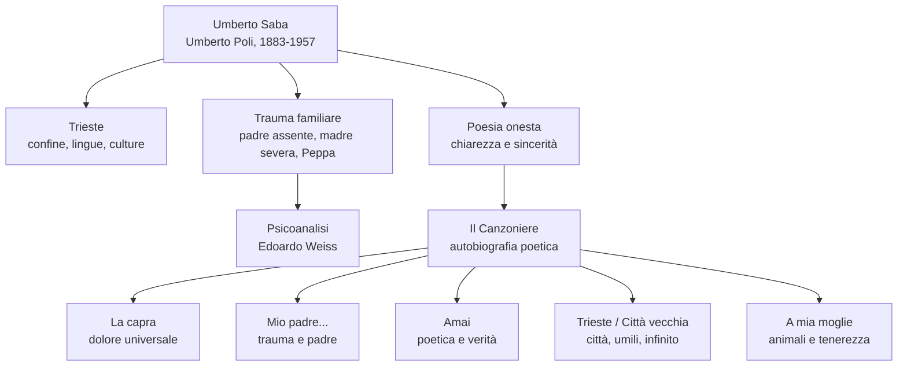

# Umberto Saba — Riassunto

---

## Coordinate essenziali

| Elemento | Dettaglio |
|----------|-----------|
| **Vero nome** | Umberto Poli |
| **Pseudonimo** | Umberto Saba |
| **Date** | 1883-1957 |
| **Città** | Trieste |
| **Opera principale** | *Il Canzoniere* |
| **Poetica** | Poesia onesta: chiarezza, sincerità, verità interiore |

---

## 1. Trieste e la formazione

Saba nasce a **Trieste**, città di confine, porto commerciale e luogo di incontro tra lingue, popoli e culture diverse. Trieste è una città **multilingue** e **multietnica**, legata al mondo italiano ma anche a quello slavo, tedesco, austriaco ed ebraico. Per questo è un ambiente aperto e inquieto, paragonabile a una città cosmopolita come New York più che a un centro italiano tradizionale come Bologna.

La stessa città segna anche altri autori del primo Novecento: **Svevo**, **Joyce**, **Slataper**, **Michelstaedter**. In particolare, il confronto con Svevo è fondamentale: entrambi sono triestini, entrambi incontrano la psicoanalisi, entrambi indagano l'interiorità, ma Svevo lo fa soprattutto nel romanzo, Saba nella poesia.

Per Saba Trieste è amata e odiata: è rifugio, "cantuccio" personale, ma anche gabbia e confine. In questo senso il rapporto con Trieste ricorda quello di Leopardi con Recanati. La formula della **scontrosa grazia** riassume bene questa città: una bellezza aspra, difficile, non addolcita.

---

## 2. Biografia: famiglia, trauma, identità

Il vero nome di Saba è **Umberto Poli**. Nasce nel 1883 da madre ebrea e padre cristiano. Il padre abbandona la famiglia quasi prima della nascita del figlio; la madre, severa e austera, affida il bambino alla balia slovena **Peppa Sabaz**. Con Peppa Saba vive un rapporto affettuoso e caldo, che rende ancora più dolorosa la distanza dalla madre.

Da qui nasce probabilmente lo pseudonimo **Saba**: può derivare da **Sabaz**, il cognome della nutrice, e ha quindi un valore affettivo e identitario. Allo stesso tempo richiama anche l'appartenenza ebraica, centrale nella sua origine familiare.

Il trauma dell'infanzia ritorna nella poesia *Mio padre è stato per me l'assassino*. La parola "assassino" è tra virgolette perché è la parola della madre: il padre non è un assassino letterale, ma l'uomo che ha abbandonato moglie e figlio. Quando Saba lo conosce, intorno ai vent'anni, scopre però che è un "bambino", cioè un uomo irresponsabile, leggero, incapace di fermarsi, ma anche una figura in cui riconosce qualcosa di sé e forse il dono della poesia.

Saba sposa **Lina** (Carolina), figura domestica e centrale nella sua poesia. Da lei ha la figlia **Linuccia**. La relazione con Lina è intensa ma non semplice: Saba la canta come grande amore, però la lezione sottolinea anche le ambivalenze del matrimonio e il fatto che la figura femminile, in lui, si leghi spesso alla cura materna.

Dal **1919** Saba gestisce una **libreria antiquaria** a Trieste. Durante il fascismo, a causa delle **leggi razziali**, deve nascondersi e viene aiutato da amici e intellettuali, tra cui **Ungaretti**, **Montale** e altri. Negli ultimi anni soffre di depressione e affronta ricoveri, fino alla morte nel 1957.

---

## 3. Psicoanalisi

La psicoanalisi è decisiva per Saba perché permette di leggere il trauma infantile e le fratture dell'io. A Trieste la psicoanalisi arriva presto, anche per la vicinanza al mondo mitteleuropeo. Saba entra in rapporto con **Edoardo Weiss**, allievo di Freud.

La psicoanalisi individua il trauma, ma non lo risolve definitivamente. La poesia diventa allora il luogo in cui Saba continua a scavare dentro di sé. In *Mio padre è stato per me l'assassino* questo è evidente: il testo parla del padre, dell'infanzia, dell'inconscio, della memoria e della scissione tra madre e padre.

---

## 4. Poetica: la poesia onesta

La poetica di Saba si riassume nell'idea di **poesia onesta**. La poesia deve dire la verità, anche quando è scomoda. Deve essere chiara, sincera, vicina alla vita. Saba rifiuta l'artificio e l'oscurità gratuita: preferisce parole comuni, discorsive, narrative, quasi prosaiche.

Questa idea è spiegata nello scritto ***Quello che resta da fare ai poeti***, del **1911**. Secondo Saba ai poeti resta da fare poesia **onesta**, cioè non artificiosa, non costruita solo per stupire. Per chiarire il concetto contrappone Manzoni e D'Annunzio: gli *Inni sacri* possono essere retoricamente mediocri ma sinceri, mentre le *Laudi* sono versi sublimi ma effimeri se mirano solo all'effetto. Per questo Saba è più vicino a **Pascoli**, alle umili cose e agli affetti quotidiani, che al preziosismo dannunziano.

Questa semplicità però è solo apparente. Saba usa spesso forme tradizionali, come il sonetto, e recupera parole alte o desuete dentro un discorso limpido. La sua modernità non consiste nella rottura formale, ma nello scavo interiore: parla di trauma, inconscio, desiderio, dolore.

La poesia *Amai* è una dichiarazione di poetica: Saba dice di amare le "trite parole", cioè parole già usate e consumate, che nel Novecento molti poeti non osavano più usare. Ama perfino la rima più tradizionale, **fiore/amore**: è la più antica perché appartiene alle origini della poesia italiana, fino allo Stilnovo, ma anche la più difficile perché è ormai quasi impossibile usarla in modo autentico. La ripetizione di "Amai" e il passaggio ad "Amo" creano una dichiarazione personale che arriva fino al presente e a chi ascolta. La sua poesia non cerca l'effetto nuovo, ma la **verità che giace al fondo**, cioè la verità dell'inconscio, nascosta come un sogno dimenticato. Questa verità si avvicina alla coscienza soprattutto attraverso il **dolore**. Alla fine di *Amai*, la "buona carta" è la poesia stessa: lo strumento con cui Saba conosce se stesso e comunica agli altri una verità interiore.

---

## 5. *Il Canzoniere*

L'opera fondamentale di Saba è *Il Canzoniere*. Il titolo richiama Petrarca e quindi la tradizione. In un secolo di avanguardie e rotture, Saba sceglie un titolo classico: non per imitare in modo artificioso il passato, ma per costruire un libro unitario della propria vita.

*Il Canzoniere* è infatti un'**autobiografia poetica**: Saba ordina la propria esistenza in versi. Dentro ci sono Trieste, il padre, la madre, la balia, Lina, Linuccia, il dolore, la malattia, la vecchiaia. L'edizione definitiva è postuma, del **1961**. Saba scrive anche *Storia e cronistoria del Canzoniere*, dove interpreta e racconta il proprio libro.

I temi del *Canzoniere* restano quasi immobili: i fanciulli di Trieste, le vie solitarie, i caffè del porto, le donne amate e soprattutto Lina. Questa immobilità nasce dalla visione malinconica della vita: l'uomo spera un domani migliore, ma sa che il dolore ritorna. Qui si sente il legame con **Leopardi**, mentre nella scelta delle realtà umili torna il legame con **Pascoli**.

*Storia e cronistoria del Canzoniere*, del **1948**, è importante perché Saba vi compie un'**autoesegesi**: commenta se stesso, racconta aneddoti biografici e spiega la nascita di alcune liriche. Per esempio, a proposito di *A mia moglie*, racconta che la poesia nacque quasi di getto mentre Lina era uscita e una cagna gli si era avvicinata. Quando Lina la ascoltò, rimase male per i paragoni animali; Saba invece li intendeva come elogio della creaturalità e della semplicità.

---

## 6. Le poesie principali

**La capra** è centrale perché mostra il modo in cui Saba arriva all'universale partendo da una realtà umile. La capra è un animale basso, povero, non nobile; proprio per questo diventa rivelatore. Nel suo belato il poeta riconosce il **dolore universale**, comune a tutti i viventi.

**Mio padre è stato per me l'assassino** unisce forma tradizionale e contenuto moderno. È un sonetto, ma parla di padre assente, trauma, inconscio, scissione familiare. Il verso finale, "eran due razze in antica tenzone", indica il conflitto tra le due origini del poeta: madre e padre, ebraismo e cristianesimo, severità e leggerezza.

**A mia moglie** va ricordata per i paragoni animali. Saba paragona Lina a una bianca pollastra, una gravida giovenca, una lunga cagna, una pavida coniglia, una rondine, una formica e un'ape. Non vuole offenderla, ma elogiare il vivente nella sua semplicità: gli animali sono creature umili, naturali, vicine a una dimensione quasi sacra. La poesia è quasi religiosa ma in senso laico, ed è anche infantile/proletaria per la sua semplicità. Il sentimento dominante è la **tenerezza**, non l'eros dannunziano. Lina appare insieme domestica, materna, fragile, gelosa, fedele, operosa e capace di dare al poeta una nuova primavera.

**Trieste** va collegata alla formula della **scontrosa grazia**: la città è amata e respinta, rifugio e limite. È un amore inquieto, non consolatorio, perché la città dà al poeta un cantuccio ma riflette anche le sue scissioni interiori. L'"aria natia" è tormentosa, e la chiusura sulla vita "pensosa e schiva" richiama un modello petrarchesco di solitudine meditativa.

**Città vecchia** mostra la Trieste più povera e degradata, vicino al porto: osterie, lupanari, vecchi, prostitute, marinai, soldati, giovani folli d'amore. Uomini e merci diventano il "detrito" del porto, cioè scarti materiali e umani. In questa umanità marginale Saba trova "**l'infinito nell'umiltà**": proprio dove la via è più turpe, il suo pensiero si fa più puro. Gli umili sono creature della vita e del dolore, e il "Signore" che si agita in loro indica una dignità creaturale, non una confessione religiosa tradizionale.

---

## 7. Schema finale

---

*Fonti: lezioni del 14/05/2026, 18/05/2026, 21/05/2026 e parte su Saba del 26/05/2026; integrazione dei dati essenziali richiesti per lo studio.*
