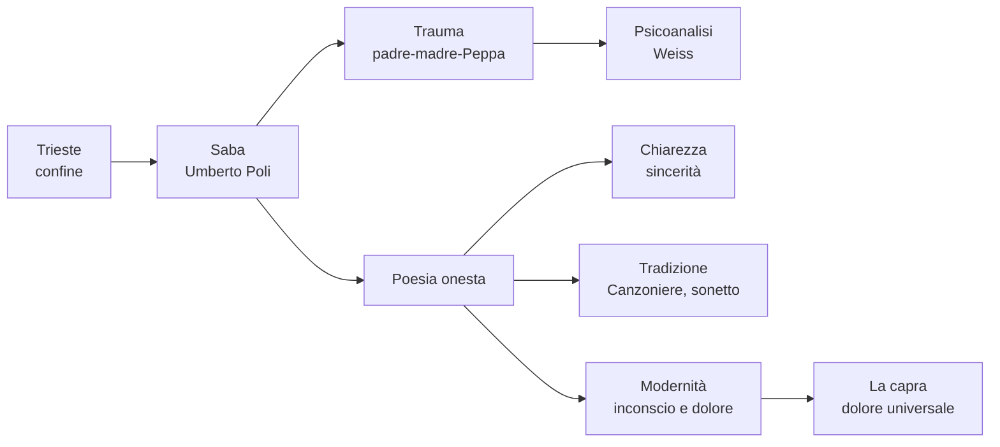

# Umberto Saba — Ripasso veloce

---

## Dati da sapere subito

**Umberto Poli**, pseudonimo **Umberto Saba** · **1883-1957** · nasce a **Trieste**  
Madre ebrea · padre cristiano e assente · balia slovena **Peppa Sabaz**  
Moglie: **Lina/Carolina** · figlia: **Linuccia**  
Autodidatta · dal **1919** gestisce una libreria antiquaria  
Opera principale: **Il Canzoniere**  
Poetica: **poesia onesta** = chiarezza + sincerità + verità interiore

---

## Trieste

| Concetto | Spiegazione |
|----------|-------------|
| **Città di confine** | Porto, scambi, passaggio di merci e persone |
| **Multilingue / multietnica** | Italiano, slavo, tedesco, austriaco, ebraico |
| **Borghesia commerciale aperta** | Ambiente pratico, mercantile, più internazionale che provinciale |
| **Confronti** | Più cosmopolita come New York; meno chiusa in una sola tradizione come Bologna |
| **Autori collegati** | Svevo, Joyce, Slataper, Michelstaedter |
| **Per Saba** | Rifugio e gabbia: città amata e odiata |
| **Formula chiave** | **Scontrosa grazia** |

---

## Biografia in tabella

| Tema | Dettaglio da dire all'interrogazione |
|------|--------------------------------------|
| **Vero nome** | Umberto Poli |
| **Pseudonimo** | Saba: probabilmente da Peppa **Sabaz**, ma anche richiamo all'identità ebraica |
| **Padre** | Assente, abbandona la famiglia; conosciuto da Saba solo intorno ai vent'anni |
| **Madre** | Ebrea, severa, austera; trasmette al figlio il rancore verso il padre |
| **Balia Peppa** | Figura affettuosa, calda, materna; accentua il contrasto con la madre |
| **Lina** | Moglie, figura domestica e centrale nelle poesie d'amore |
| **Linuccia** | Figlia di Saba e Lina |
| **Libreria** | Dal 1919 libreria antiquaria a Trieste |
| **Fascismo** | Leggi razziali: deve nascondersi; aiutato da Ungaretti, Montale e altri |
| **Ultimi anni** | Depressione, ricoveri, morte nel 1957 |

---

## Psicoanalisi

| Punto | Spiegazione |
|-------|-------------|
| **Ambiente** | Trieste è vicina al mondo mitteleuropeo: la psicoanalisi arriva presto |
| **Analista** | **Edoardo Weiss**, allievo di Freud |
| **Risultato** | Il trauma viene individuato, ma non risolto definitivamente |
| **Trauma centrale** | Infanzia, padre assente, madre severa, separazione dalla balia |
| **Confronto con Svevo** | Entrambi triestini e legati alla psicoanalisi; Svevo la usa nel romanzo, Saba nella poesia autobiografica |

---

## Poetica: parole chiave

| Parola chiave | Significato |
|---------------|-------------|
| **Poesia onesta** | Dire la verità senza artifici |
| **Chiarezza** | Linguaggio comprensibile, discorsivo |
| **Sincerità** | Scavare nell'interiorità e nell'inconscio |
| **Semplicità apparente** | Sembra facile, ma contiene dolore e profondità |
| **Tradizione** | Sonetto, titolo petrarchesco, rime semplici |
| **Modernità interiore** | Moderna nei temi psicologici, non nella rottura formale |
| **D'Annunzio secondo Saba** | Modello opposto: Saba rifiuta preziosismo e posa aristocratica |

Formula pronta:

> Saba è moderno non perché distrugge le forme, ma perché usa forme chiare e tradizionali per portare alla luce trauma, inconscio e verità scomode.

---

## *Il Canzoniere*

| Elemento | Da ricordare |
|----------|--------------|
| **Titolo** | Richiama Petrarca |
| **Significato** | Recupero della tradizione in pieno Novecento |
| **Funzione** | Autobiografia poetica: vita ordinata in versi |
| **Temi** | Trieste, padre, madre, Peppa, Lina, Linuccia, dolore, identità |
| **Edizione definitiva** | Postuma, **1961** |
| **Testo collegato** | *Storia e cronistoria del Canzoniere* |

---

## Poesie

### *La capra*

| Elemento | Significato |
|----------|-------------|
| **Animale basso** | Capra = creatura umile, quotidiana, non nobile |
| **Belato** | Voce del dolore |
| **Rivelazione** | Nel dolore della capra Saba riconosce il dolore universale |
| **Idea centrale** | Dal basso e dal semplice emerge una verità profonda |

Frase pronta:

> In *La capra* Saba parte da un animale umile e apparentemente non poetico per arrivare al dolore universale di tutti i viventi.

### *Mio padre è stato per me l'assassino*

| Elemento | Significato |
|----------|-------------|
| **Forma** | Sonetto: metrica tradizionale |
| **Contenuto** | Moderno: padre, infanzia, trauma, inconscio |
| **"Assassino"** | Parola della madre, non giudizio oggettivo |
| **Padre bambino** | Irresponsabile, leggero, incapace di fermarsi |
| **Dono** | Forse il dono della poesia |
| **"Due razze"** | Conflitto tra madre e padre, due origini e due modi di vivere |

### *A mia moglie*

Da ricordare solo come accenno: i **paragoni animali** sono un elogio del vivente. Paragonare Lina ad animali non è degradante: significa riconoscerla nella vita naturale, semplice, vera.

### *Trieste*

Da ricordare solo come accenno: città amata e odiata, rifugio e prigione; formula della **scontrosa grazia**.

---

## Mappa rapida

---

## Domande da interrogazione

| Domanda | Risposta breve |
|---------|----------------|
| **Perché Trieste è importante?** | Perché è città di confine, multilingue e multietnica; forma l'identità inquieta di Saba. |
| **Che rapporto ha Saba con Trieste?** | Ambivalente: rifugio e gabbia, amore e rifiuto. |
| **Da dove viene lo pseudonimo Saba?** | Probabilmente da Peppa Sabaz, la balia amata; anche richiamo all'identità ebraica. |
| **Che cos'è la poesia onesta?** | Poesia chiara, sincera, senza artifici, capace di dire la verità interiore. |
| **Perché Saba è moderno?** | Perché indaga inconscio, trauma e dolore, pur usando forme tradizionali. |
| **Che cos'è *Il Canzoniere*?** | L'autobiografia poetica di Saba, la vita ordinata in versi. |
| **Che cosa rappresenta la capra?** | Un animale umile che rivela il dolore universale. |
| **Perché "assassino" è tra virgolette?** | Perché è la parola della madre contro il padre assente. |
| **Che ruolo ha la psicoanalisi?** | Aiuta a individuare il trauma, ma non lo risolve. |

---

## Mini-risposta pronta

Saba, vero nome Umberto Poli, nasce a Trieste nel 1883. La sua poesia nasce dall'intreccio tra la città di confine, la ferita familiare e il bisogno di verità. Trieste è per lui rifugio e gabbia; la famiglia è segnata dal padre assente, dalla madre severa e dalla balia Peppa Sabaz, da cui probabilmente deriva lo pseudonimo Saba. La sua poetica è quella della **poesia onesta**: parole chiare e semplici, ma capaci di scendere nell'inconscio e nel dolore. *Il Canzoniere* è la sua autobiografia poetica; in testi come *La capra* anche un animale umile diventa rivelazione del dolore universale.

---

*Fonti: lezione del 14/05/2026, dalla sezione su Saba in poi; integrazione dei dati essenziali richiesti per lo studio.*
