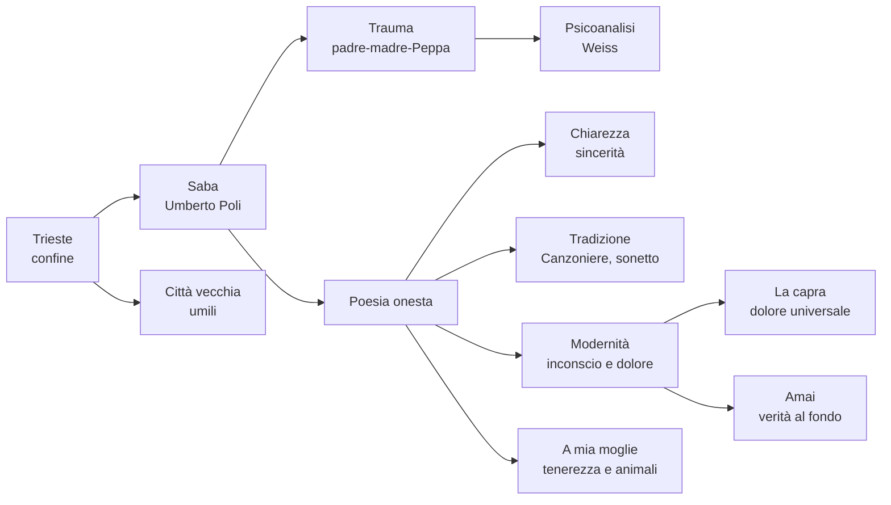

# Umberto Saba — Ripasso veloce

---

## Dati da sapere subito

**Umberto Poli**, pseudonimo **Umberto Saba** · **1883-1957** · nasce a **Trieste**  
Madre ebrea · padre cristiano e assente · balia slovena **Peppa Sabaz**  
Moglie: **Lina/Carolina** · figlia: **Linuccia**  
Autodidatta · dal **1919** gestisce una libreria antiquaria  
Opera principale: **Il Canzoniere**  
Poetica: **poesia onesta** = chiarezza + sincerità + verità interiore

---

## Trieste

| Concetto | Spiegazione |
|----------|-------------|
| **Città di confine** | Porto, scambi, passaggio di merci e persone |
| **Multilingue / multietnica** | Italiano, slavo, tedesco, austriaco, ebraico |
| **Borghesia commerciale aperta** | Ambiente pratico, mercantile, più internazionale che provinciale |
| **Confronti** | Più cosmopolita come New York; meno chiusa in una sola tradizione come Bologna |
| **Autori collegati** | Svevo, Joyce, Slataper, Michelstaedter |
| **Per Saba** | Rifugio e gabbia: città amata e odiata |
| **Formula chiave** | **Scontrosa grazia** |

---

## Biografia in tabella

| Tema | Dettaglio da dire all'interrogazione |
|------|--------------------------------------|
| **Vero nome** | Umberto Poli |
| **Pseudonimo** | Saba: probabilmente da Peppa **Sabaz**, ma anche richiamo all'identità ebraica |
| **Padre** | Assente, abbandona la famiglia; conosciuto da Saba solo intorno ai vent'anni |
| **Madre** | Ebrea, severa, austera; trasmette al figlio il rancore verso il padre |
| **Balia Peppa** | Figura affettuosa, calda, materna; accentua il contrasto con la madre |
| **Lina** | Moglie, figura domestica e centrale nelle poesie d'amore |
| **Linuccia** | Figlia di Saba e Lina |
| **Libreria** | Dal 1919 libreria antiquaria a Trieste |
| **Fascismo** | Leggi razziali: deve nascondersi; aiutato da Ungaretti, Montale e altri |
| **Ultimi anni** | Depressione, ricoveri, morte nel 1957 |

---

## Psicoanalisi

| Punto | Spiegazione |
|-------|-------------|
| **Ambiente** | Trieste è vicina al mondo mitteleuropeo: la psicoanalisi arriva presto |
| **Analista** | **Edoardo Weiss**, allievo di Freud |
| **Risultato** | Il trauma viene individuato, ma non risolto definitivamente |
| **Trauma centrale** | Infanzia, padre assente, madre severa, separazione dalla balia |
| **Confronto con Svevo** | Entrambi triestini e legati alla psicoanalisi; Svevo la usa nel romanzo, Saba nella poesia autobiografica |

---

## Poetica: parole chiave

| Parola chiave | Significato |
|---------------|-------------|
| **Poesia onesta** | Dire la verità senza artifici |
| **Chiarezza** | Linguaggio comprensibile, discorsivo |
| **Sincerità** | Scavare nell'interiorità e nell'inconscio |
| **Semplicità apparente** | Sembra facile, ma contiene dolore e profondità |
| **Tradizione** | Sonetto, titolo petrarchesco, rime semplici |
| **Modernità interiore** | Moderna nei temi psicologici, non nella rottura formale |
| **Verità al fondo** | Verità nascosta dell'inconscio, rivelata dal dolore |
| **Pascoli** | Vicinanza alle umili cose, agli affetti, al quotidiano |
| **D'Annunzio secondo Saba** | Modello opposto: Saba rifiuta preziosismo e posa aristocratica |

Formula pronta:

> Saba è moderno non perché distrugge le forme, ma perché usa forme chiare e tradizionali per portare alla luce trauma, inconscio e verità scomode.

### Scritti critici

| Testo | Data | Da ricordare |
|-------|------|--------------|
| ***Quello che resta da fare ai poeti*** | **1911** | Ai poeti resta da fare **poesia onesta**, autentica, non costruita per stupire |
| ***Storia e cronistoria del Canzoniere*** | **1948** | Saba commenta se stesso: **autoesegesi**, aneddoti, spiegazione della nascita delle poesie |

Confronto pronto:

| Autore / opera | Valore nel discorso di Saba |
|----------------|-----------------------------|
| **Manzoni, *Inni sacri*** | Versi anche mediocri, ma onesti perché sinceri |
| **D'Annunzio, *Laudi*** | Versi sublimi, ma effimeri se artificiali |

---

## *Il Canzoniere*

| Elemento | Da ricordare |
|----------|--------------|
| **Titolo** | Richiama Petrarca |
| **Significato** | Recupero della tradizione in pieno Novecento |
| **Funzione** | Autobiografia poetica: vita ordinata in versi |
| **Temi** | Trieste, fanciulli, vie solitarie, caffè del porto, donne amate, padre, madre, Peppa, Lina, dolore, identità |
| **Visione della vita** | Dolore immutabile: l'uomo spera un domani migliore, ma il dolore ritorna |
| **Edizione definitiva** | Postuma, **1961** |
| **Testo collegato** | *Storia e cronistoria del Canzoniere*: Saba spiega e interpreta il proprio libro |

---

## Poesie

### *La capra*

| Elemento | Significato |
|----------|-------------|
| **Animale basso** | Capra = creatura umile, quotidiana, non nobile |
| **Belato** | Voce del dolore |
| **Rivelazione** | Nel dolore della capra Saba riconosce il dolore universale |
| **Idea centrale** | Dal basso e dal semplice emerge una verità profonda |

Frase pronta:

> In *La capra* Saba parte da un animale umile e apparentemente non poetico per arrivare al dolore universale di tutti i viventi.

### *Mio padre è stato per me l'assassino*

| Elemento | Significato |
|----------|-------------|
| **Forma** | Sonetto: metrica tradizionale |
| **Contenuto** | Moderno: padre, infanzia, trauma, inconscio |
| **"Assassino"** | Parola della madre, non giudizio oggettivo |
| **Padre bambino** | Irresponsabile, leggero, incapace di fermarsi |
| **Dono** | Forse il dono della poesia |
| **"Due razze"** | Conflitto tra madre e padre, due origini e due modi di vivere |

### *Amai*

| Elemento | Significato |
|----------|-------------|
| **"Trite parole"** | Parole logore, consumate, già usate dalla tradizione |
| **"Che non uno osava"** | I poeti del primo Novecento preferiscono avanguardie, sperimentazione, dannunzianesimo |
| **Rima fiore/amore** | Antica perché nasce con la tradizione poetica; difficile perché quasi impossibile da rendere nuova e autentica |
| **"Verità che giace al fondo"** | Verità profonda dell'inconscio |
| **Sogno obliato** | La verità interiore è come un sogno dimenticato |
| **Dolore** | Solo il dolore riscopre questa verità e la avvicina alla coscienza |
| **"Buona carta"** | La poesia stessa: strumento di conoscenza e comunicazione |

Frase pronta:

> *Amai* è il manifesto poetico di Saba: recupera parole e rime tradizionali, ma le usa per cercare la verità profonda dell'inconscio, che il dolore rende riconoscibile.

### *A mia moglie*

I **paragoni animali** sono un elogio del vivente. Paragonare Lina ad animali non è degradante: significa riconoscerla nella vita naturale, semplice, vera.

| Animale | Significato |
|---------|-------------|
| **Bianca pollastra** | Umiltà terrena, ma anche fierezza e passo regale |
| **Gravida giovenca** | Maternità, dolcezza, bisogno di consolazione |
| **Lunga cagna** | Fedeltà, dolcezza, ferocia e gelosia |
| **Pavida coniglia** | Timidezza, paura, vulnerabilità, istinto materno |
| **Rondine** | Leggerezza, nuova primavera |
| **Formica / ape** | Operosità, cura concreta, vita laboriosa |

Da *Storia e cronistoria*: Saba racconta che la poesia nacque quasi di getto mentre Lina era uscita; quando gliela lesse, lei rimase male perché non capì subito il valore dei paragoni.

Frase pronta:

> In *A mia moglie* domina la **tenerezza**, non l'eros dannunziano: Lina è lodata come creatura semplice, domestica, naturale, quasi sacra.

### *Trieste*

Da ricordare: città amata e odiata, rifugio e prigione; formula della **scontrosa grazia**. Trieste dà a Saba un **cantuccio**, ma riflette anche le sue scissioni interiori.

### *Città vecchia*

| Elemento | Significato |
|----------|-------------|
| **Luogo** | Zona vecchia di Trieste, vicino al porto: vie buie, osterie, lupanari |
| **Personaggi** | Prostituta, marinaio, vecchio che bestemmia, donna che litiga, soldato, giovane folle d'amore |
| **Detrito** | Scarti delle merci e dell'umanità di un porto di mare |
| **Infinito nell'umiltà** | Nel basso e nel povero Saba trova una dimensione universale |
| **Puro / turpe** | Il pensiero si fa più puro dove la via è più degradata |
| **Umili** | Creature della vita e del dolore, simili al poeta |

Frase pronta:

> In *Città vecchia* Saba trova l'infinito nell'umiltà: proprio tra gli scarti e gli umili riconosce una verità umana profonda.

---

## Mappa rapida

---

## Domande da interrogazione

| Domanda | Risposta breve |
|---------|----------------|
| **Perché Trieste è importante?** | Perché è città di confine, multilingue e multietnica; forma l'identità inquieta di Saba. |
| **Che rapporto ha Saba con Trieste?** | Ambivalente: rifugio e gabbia, amore e rifiuto. |
| **Da dove viene lo pseudonimo Saba?** | Probabilmente da Peppa Sabaz, la balia amata; anche richiamo all'identità ebraica. |
| **Che cos'è la poesia onesta?** | Poesia chiara, sincera, senza artifici, capace di dire la verità interiore. |
| **Perché Saba è moderno?** | Perché indaga inconscio, trauma e dolore, pur usando forme tradizionali. |
| **Che cosa dice *Quello che resta da fare ai poeti*?** | Che ai poeti resta da fare poesia onesta, autentica, non artificiosa. |
| **Che cos'è *Storia e cronistoria del Canzoniere*?** | Un testo di autoesegesi in cui Saba commenta se stesso e racconta la nascita delle poesie. |
| **Che cos'è *Il Canzoniere*?** | L'autobiografia poetica di Saba, la vita ordinata in versi. |
| **Perché *Amai* è importante?** | È una dichiarazione di poetica: tradizione, parole trite, rima fiore/amore, verità dell'inconscio. |
| **Che cos'è la verità che giace al fondo?** | La verità nascosta dell'inconscio, che il dolore riporta alla coscienza. |
| **Che cosa rappresenta la capra?** | Un animale umile che rivela il dolore universale. |
| **Perché "assassino" è tra virgolette?** | Perché è la parola della madre contro il padre assente. |
| **Che senso hanno gli animali in *A mia moglie*?** | Non offendono Lina: mostrano tenerezza, semplicità, maternità, fedeltà e vita naturale. |
| **Che cosa significa "infinito nell'umiltà"?** | La verità universale viene trovata negli umili e nei luoghi degradati di *Città vecchia*. |
| **Che ruolo ha la psicoanalisi?** | Aiuta a individuare il trauma, ma non lo risolve. |

---

## Mini-risposta pronta

Saba, vero nome Umberto Poli, nasce a Trieste nel 1883. La sua poesia nasce dall'intreccio tra la città di confine, la ferita familiare e il bisogno di verità. Trieste è per lui rifugio e gabbia; la famiglia è segnata dal padre assente, dalla madre severa e dalla balia Peppa Sabaz, da cui probabilmente deriva lo pseudonimo Saba. La sua poetica è quella della **poesia onesta**: parole chiare e semplici, ma capaci di scendere nell'inconscio e nel dolore. In *Amai* questa poetica diventa manifesto: Saba ama le parole trite e la rima fiore/amore, ma cerca la verità che giace al fondo. *Il Canzoniere* è la sua autobiografia poetica; in testi come *La capra*, *A mia moglie* e *Città vecchia* anche l'umile diventa rivelazione di una verità universale.

---

*Fonti: lezioni del 14/05/2026, 18/05/2026, 21/05/2026 e parte su Saba del 26/05/2026; integrazione dei dati essenziali richiesti per lo studio.*
