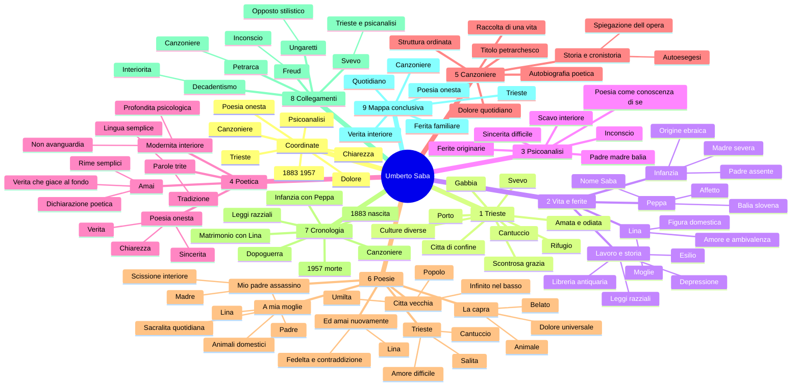

# Schema mentale stampabile — Umberto Saba

Schema unico e compatto, disposto nello stesso ordine del `riassunto.md`.

```mermaid
mindmap
  root((Umberto Saba))
    Coordinate
      1883 1957
      Trieste
      Canzoniere
      Poesia onesta
      Psicoanalisi
      Chiarezza
      Dolore
    1 Trieste
      Citta di confine
      Porto
      Culture diverse
      Svevo
      Amata e odiata
      Rifugio
      Gabbia
      Cantuccio
      Scontrosa grazia
    2 Vita e ferite
      Infanzia
        Padre assente
        Madre severa
        Origine ebraica
      Peppa
        Balia slovena
        Affetto
        Nome Saba
      Lina
        Moglie
        Figura domestica
        Amore e ambivalenza
      Lavoro e storia
        Libreria antiquaria
        Leggi razziali
        Esilio
        Depressione
    3 Psicoanalisi
      Scavo interiore
      Inconscio
      Ferite originarie
      Padre madre balia
      Sincerita difficile
      Poesia come conoscenza di se
    4 Poetica
      Poesia onesta
        Chiarezza
        Sincerita
        Verita
      Parole trite
        Lingua semplice
        Tradizione
      Modernita interiore
        Non avanguardia
        Profondita psicologica
      Amai
        Dichiarazione poetica
        Rime semplici
        Verita che giace al fondo
    5 Canzoniere
      Titolo petrarchesco
      Raccolta di una vita
      Autobiografia poetica
      Struttura ordinata
      Dolore quotidiano
      Storia e cronistoria
        Autoesegesi
        Spiegazione dell opera
    6 Poesie
      La capra
        Animale
        Belato
        Dolore universale
      Mio padre assassino
        Padre
        Madre
        Scissione interiore
      A mia moglie
        Animali domestici
        Sacralita quotidiana
        Lina
      Trieste
        Salita
        Cantuccio
        Amore difficile
      Citta vecchia
        Umilta
        Popolo
        Infinito nel basso
      Ed amai nuovamente
        Lina
        Fedelta e contraddizione
    7 Cronologia
      1883 nascita
      Infanzia con Peppa
      Matrimonio con Lina
      Canzoniere
      Leggi razziali
      Dopoguerra
      1957 morte
    8 Collegamenti
      Svevo
        Trieste e psicanalisi
      Ungaretti
        Opposto stilistico
      Petrarca
        Canzoniere
      Freud
        Inconscio
      Decadentismo
        Interiorita
    9 Mappa conclusiva
      Trieste
      Ferita familiare
      Poesia onesta
      Canzoniere
      Quotidiano
      Verita interiore
```
