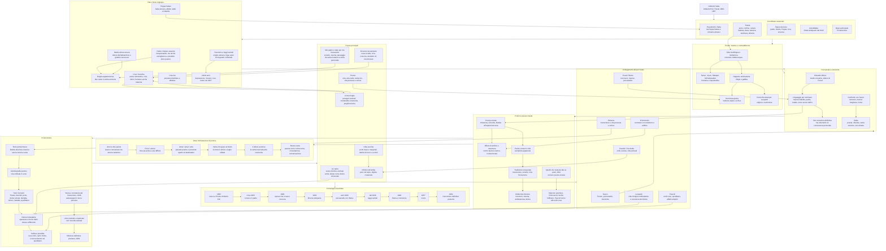

```mermaid
flowchart TD
    SABA["Umberto Saba<br/>Umberto Poli, Trieste 1883-1957"]

    subgraph COORD["Coordinate essenziali"]
        NOME["Pseudonimo Saba<br/>da Peppa Sabaz e richiamo ebraico"]
        TRIESTE["Trieste<br/>porto, confine, culture italiana, slava, tedesca, austriaca, ebraica"]
        FIGURE["Figure decisive<br/>padre, madre, Peppa, Lina, Linuccia"]
        LAVORO["Autodidatta<br/>libraio antiquario dal 1919"]
        OPERA["Opera principale<br/>Il Canzoniere"]
    end

    subgraph CITTA["Trieste: matrice e contraddizione"]
        CONFINE["Citta multilingue e multietnica<br/>orizzonte mitteleuropeo"]
        AMBIENTE["Svevo, Joyce, Slataper, Michelstaedter<br/>frontiera e inquietudine"]
        AMBIVALENZA["Rapporto ambivalente<br/>rifugio e gabbia"]
        GRAZIA["Scontrosa grazia<br/>bellezza aspra e schiva"]
        RECANATI["Come Recanati per Leopardi<br/>origine e costrizione"]
    end

    subgraph VITA["Vita e ferite originarie"]
        PADRE["Padre cristiano assente<br/>irresponsabile, ma anche somiglianza e possibile dono poetico"]
        MADRE["Madre ebrea severa<br/>dolore dell'abbandono e giudizio rancoroso"]
        SCISSIONE["Doppia appartenenza<br/>due razze in antica tenzone"]
        PEPPA["Peppa Sabaz<br/>balia slovena, affetto caldo e infantile"]
        LINA["Lina / Carolina<br/>amore domestico, crisi, ritorni, funzione anche materna"]
        LINUX["Linuccia<br/>presenza familiare e affettiva"]
        STORIA["Fascismo e leggi razziali<br/>origine ebraica, fuga, aiuto di Ungaretti e Montale"]
        ULTIMI["Ultimi anni<br/>depressione, ricoveri, cure, morte nel 1957"]
    end

    subgraph PSICO["Psicoanalisi e interiorita"]
        WEISS["Edoardo Weiss<br/>medico triestino, allievo di Freud"]
        TRAUMA["Linguaggio per nominare<br/>trauma infantile, padre, madre, zone oscure dell'io"]
        NONCURA["Non soluzione definitiva<br/>ma strumento di conoscenza personale"]
        SVEVO["Confronto con Svevo<br/>romanzo, nevrosi borghese, ironia"]
        SABA_PSI["Saba<br/>poesia, infanzia, verita interiore, tono diretto"]
    end

    subgraph POETICA["Poetica: poesia onesta"]
        ONESTA["Poesia onesta<br/>chiarezza, sincerita, fedelta all'esperienza vera"]
        NOARTIFICIO["Rifiuto di artificio e maschera<br/>contro fascino vuoto e novita forzata"]
        PAROLE["Parole comuni e trite<br/>semplicita apparente"]
        TRADIZIONE["Tradizione recuperata<br/>Canzoniere, sonetto, rime fiore/amore"]
        MODERNITA["Modernita interiore<br/>inconscio, trauma, ambivalenza, dolore"]
        TESTO1911["Quello che resta da fare ai poeti, 1911<br/>scrivere poesia onesta"]
        MODELLI["Manzoni autentico, D'Annunzio rischia l'effimero, Pascoli vicino alle umili cose"]
    end

    subgraph AMAI["Amai: dichiarazione di poetica"]
        TRITE["Amo le trite parole<br/>lessico consumato ma ancora autentico"]
        FIORE["Fiore / amore<br/>rima piu antica e piu difficile"]
        POLIPTOTO["Amai / amai / amo<br/>passato poetico e presente aperto al destinatario"]
        FONDO["Verita che giace al fondo<br/>inconscio simile a sogno obliato"]
        DOLORE["Il dolore avvicina<br/>la verita nascosta alla coscienza"]
        CARTA["Buona carta<br/>poesia come conoscenza, consolazione, comunicazione"]
    end

    subgraph CANZ["Il Canzoniere"]
        TITOLO["Titolo petrarchesco<br/>fedelta alla linea classica senza retorica vuota"]
        AUTOBIO["Autobiografia poetica<br/>vita ordinata in versi"]
        TEMI["Temi ricorrenti<br/>Trieste, fanciulli, porto, donne amate, famiglia, dolore, malattia, quotidiano"]
        DOLORE_IMM["Dolore immutabile<br/>speranza e ritorno delle stesse sofferenze"]
        SOLLIEVO["Sollievo possibile<br/>cose umili, canto intimo, riconoscimento nel quotidiano"]
        AUTOESEGESI["Storia e cronistoria del Canzoniere, 1948<br/>autoesegesi in terza persona"]
        COSTRUZIONE["Libro costruito e ripensato<br/>non raccolta casuale"]
        POSTUMA["Edizione definitiva postuma, 1961"]
    end

    subgraph POESIE["Poesie principali"]
        CAPRA["La capra<br/>scena minima, animale umile, belato come dolore universale"]
        PADRE_POESIA["Mio padre e stato per me l'assassino<br/>sonetto, trauma, passaggio da verita materna a verita personale"]
        MOGLIE["A mia moglie<br/>paragoni animali, creaturalita, tenerezza, preghiera laica"]
        TRIESTE_POESIA["Trieste<br/>erta, aria natia, cantuccio, vita pensosa e schiva"]
        CV["Citta vecchia<br/>porto basso, marginali, detrito di merci e uomini"]
        CV_NUCLEO["Infinito nell'umilta<br/>puro nel turpe, dignita creaturale"]
        EDAMAI["Ed amai nuovamente<br/>rosso scialle, Lina, Linuccia, desiderio di ricominciare"]
    end

    subgraph CRONO["Cronologia essenziale"]
        C1883["1883<br/>nasce a Trieste Umberto Poli"]
        C1903["circa 1903<br/>conosce il padre"]
        C1909["1909<br/>sposa Lina e nasce Linuccia"]
        C1919["1919<br/>libreria antiquaria"]
        C1930["anni 1930<br/>psicoanalisi con Weiss"]
        C1938["dal 1938<br/>leggi razziali"]
        C1948["1948<br/>Storia e cronistoria"]
        C1957["1957<br/>morte"]
        C1961["1961<br/>Canzoniere definitivo postumo"]
    end

    subgraph COLLEG["Collegamenti utili per l'orale"]
        COLL_SVEVO["Svevo<br/>Trieste, psicoanalisi, interiorita"]
        COLL_LEOPARDI["Leopardi<br/>citta d'origine ambivalente e coscienza del dolore"]
        COLL_PETRARCA["Petrarca<br/>Canzoniere e vita pensosa e schiva"]
        COLL_DANN["D'Annunzio<br/>contrasto con estetismo e artificio"]
        COLL_PASCOLI["Pascoli<br/>umili cose, quotidiano, affetti semplici"]
        COLL_FREUD["Freud / Weiss<br/>inconscio, trauma, psicoanalisi"]
        COLL_PASOLINI["Pasolini / De Andre<br/>umili, esclusi, citta portuali"]
    end

    SABA --> COORD
    COORD --> CITTA
    COORD --> VITA
    CITTA --> PSICO
    VITA --> PSICO
    PSICO --> POETICA
    POETICA --> AMAI
    POETICA --> CANZ
    CANZ --> POESIE
    POESIE --> CRONO
    POESIE --> COLLEG

    TRIESTE --> CONFINE
    CONFINE --> AMBIENTE
    CONFINE --> AMBIVALENZA
    AMBIVALENZA --> GRAZIA
    AMBIVALENZA --> RECANATI

    PADRE --> SCISSIONE
    MADRE --> SCISSIONE
    PEPPA --> NOME
    LINA --> MOGLIE
    STORIA --> ULTIMI

    WEISS --> TRAUMA
    TRAUMA --> NONCURA
    SVEVO --> SABA_PSI
    TRAUMA --> ONESTA

    ONESTA --> PAROLE
    ONESTA --> NOARTIFICIO
    PAROLE --> TRADIZIONE
    TRADIZIONE --> MODERNITA
    TESTO1911 --> MODELLI

    TRITE --> FIORE
    FIORE --> POLIPTOTO
    POLIPTOTO --> FONDO
    FONDO --> DOLORE
    DOLORE --> CARTA

    TITOLO --> AUTOBIO
    AUTOBIO --> TEMI
    TEMI --> DOLORE_IMM
    DOLORE_IMM --> SOLLIEVO
    AUTOESEGESI --> COSTRUZIONE
    COSTRUZIONE --> POSTUMA

    CAPRA --> DOLORE_IMM
    PADRE_POESIA --> SCISSIONE
    MOGLIE --> LINA
    TRIESTE_POESIA --> GRAZIA
    CV --> CV_NUCLEO
    EDAMAI --> LINA

    C1883 --> C1903 --> C1909 --> C1919 --> C1930 --> C1938 --> C1948 --> C1957 --> C1961

    COLL_SVEVO --> PSICO
    COLL_LEOPARDI --> DOLORE_IMM
    COLL_PETRARCA --> TITOLO
    COLL_DANN --> NOARTIFICIO
    COLL_PASCOLI --> SOLLIEVO
    COLL_FREUD --> TRAUMA
    COLL_PASOLINI --> CV_NUCLEO
```
