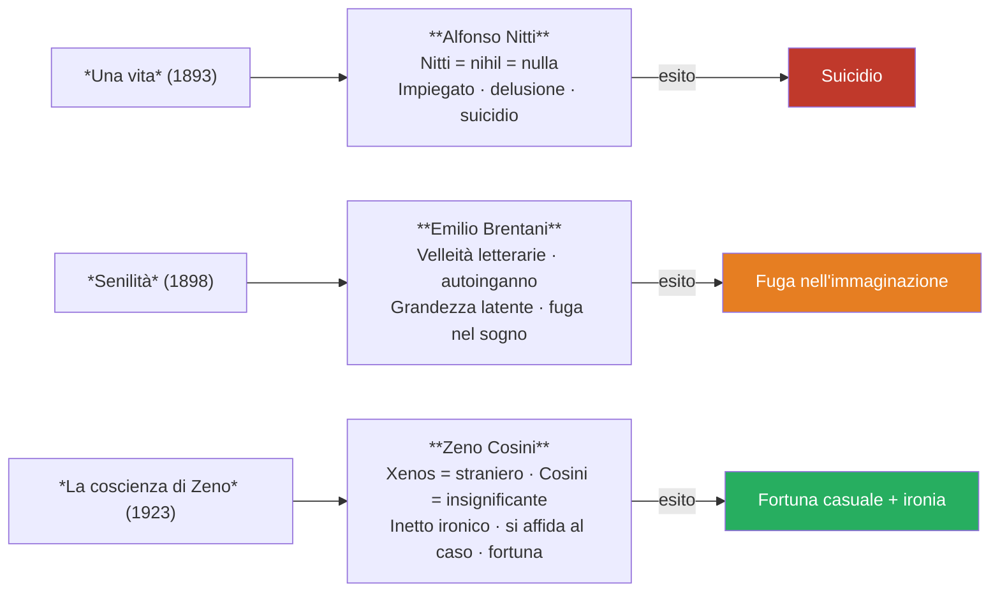
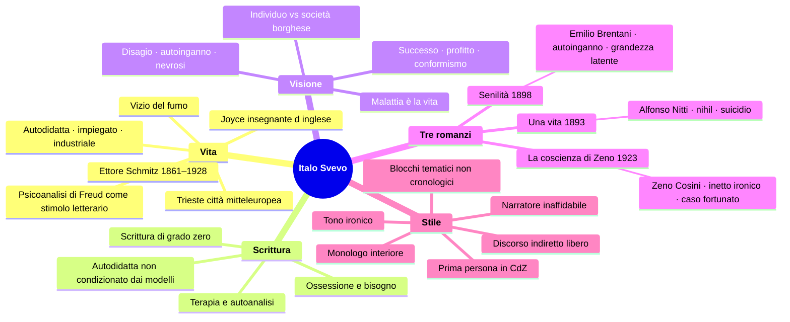

# Italo Svevo

---

## Coordinate essenziali

| Elemento | Dettaglio |
|----------|-----------|
| **Vero nome** | Ettore Schmitz |
| **Pseudonimo** | Italo Svevo (nome d'arte che insiste sulla doppia appartenenza: Italia + mondo mitteleuropeo) |
| **Nato** | 1861, **Trieste** |
| **Morto** | 1928, a seguito di un incidente d'auto con complicazioni dovute al vizio del fumo |
| **Professione** | Prima impiegato di banca, poi industriale (impresa di vernice navale del suocero Veneziani) |
| **Rapporto con la scrittura** | **Ossessione** — non la professione ma il bisogno irrinunciabile; letterato dilettante e autodidatta |
| **Lingue** | 1ª dialetto triestino · 2ª tedesco · 3ª italiano (lingua delle sue opere) |
| **Opere principali** | *Una vita* (1893) · *Senilità* (1898) · *La coscienza di Zeno* (1923) |

---

## 1. Vita e formazione

### 1.1 Trieste: una città di confine

Italo Svevo nasce nel 1861 a **Trieste**, una città che non è elemento biografico secondario ma condizione strutturante di tutta la sua opera. Trieste è una città di **porto**, di **confine**, posizionata al crocevia tra Italia, Austria e Germania: una città **mitteleuropea** per definizione, luogo di incroci di uomini e merci, di culture che si sovrappongono.

Nel 1873 Svevo si trasferisce in Germania, dove studia in un collegio e si avvicina alla letteratura. Quando torna a Trieste nel 1878 — attorno ai diciassette anni, la stessa età degli studenti della classe — la sua vocazione letteraria è già forte, ma il padre non vuole assecondarla.

> [!note] Dalla lezione
> «L'italiano tra le lingue dei romanzi di Svevo non era di fatto né la prima e neanche la seconda lingua. Era la terza. Perché la prima lingua è quella del dialetto triestino, la seconda lingua è il tedesco, la terza lingua è l'italiano che poi lui usò come lingua letteraria delle sue opere. Quindi già questo ci fa capire come la sua formazione sia composita.»

### 1.2 La doppia vita: impiegato e scrittore

Svevo lavora come impiegato di banca, poi sposa una lontana cugina, **Livia Veneziani**, il cui padre è a capo di un'impresa che brevetta una vernice speciale per le navi. Si rivela un commerciante e industriale di successo. **Per venticinque anni non pubblica più nulla** — ma non smette di scrivere, perché la scrittura è la sua ossessione.

La sua formazione è quella di un **autodidatta**: si forma su letture che compie in autonomia, fuori da un corso di studi specifico. Questo lo rende meno condizionato dai modelli letterari canonici, più libero di trovare una propria via.

### 1.3 I due incontri fondamentali del primo Novecento

Nel primo decennio del Novecento, prima della pubblicazione del capolavoro, avvengono due incontri destinati a segnare profondamente *La coscienza di Zeno*.

**James Joyce** — Svevo lo conosce direttamente perché Joyce era il suo insegnante d'inglese, una lingua che gli serviva per la professione commerciale. Joyce sarà tra i primi a riconoscere il valore del romanzo, aiutando Svevo a ottenere quella notorietà internazionale che in Italia gli era stata negata.

**La psicoanalisi di Freud** — Trieste, per la sua vicinanza con l'Austria, è uno dei luoghi in cui la nuova disciplina freudiana — nata simbolicamente con *L'interpretazione dei sogni* del 1900 — viene conosciuta prima che altrove in Italia. Svevo legge Freud anche perché un suo parente era in cura presso un allievo di Freud. Ma la sua posizione è di **interesse critico**, non di fede:

> [!note] Dalla lezione
> «Svevo ritiene la psicoanalisi uno strumento **inutile dal punto di vista medico**, quindi una disciplina inutile per la guarigione, ma **molto interessante da un punto di vista letterario**. [...] Qual è invece lo strumento che riconosce come terapeutico per lui rispetto alle difficoltà della vita, al disagio esistenziale? La scrittura. La scrittura per Svevo si rivela essere l'unica vera terapia.»

### 1.4 La morte e il vizio del fumo

Svevo muore nel 1928 a seguito di un incidente d'auto. L'incidente non fu particolarmente grave, ma le complicazioni derivate dal suo inesausto **vizio del fumo** ne causarono la morte. Non è un dettaglio aneddotico: il vizio del fumo è il tema centrale del primo blocco narrativo de *La coscienza di Zeno*, intitolato proprio *Il fumo*.

### 1.5 Lo pseudonimo

Il nome d'arte **Italo Svevo** non è casuale: insiste sulla **doppia appartenenza** dell'autore. Italo rimanda all'identità italiana; Svevo — che richiama gli Svevi, popolo germanico — rimanda al mondo nord-europeo, austriaco, tedesco. È la sintesi identitaria di un autore che sentiva di appartenere all'Italia pur cresciuto in un contesto multiculturale e mitteleuropeo.

---

## 2. La scrittura come terapia e come ossessione

### 2.1 Un letterato dilettante

Svevo è un **letterato dilettante**: non professionista, autodidatta, non formato su percorsi accademici. Questo comporta due conseguenze. Da un lato, è **meno condizionato dai modelli** letterari precedenti; la sua scrittura è più immediata, più libera dai formalismi. Dall'altro, la critica letteraria — anche nei decenni successivi — ha sottolineato che la sua lingua è quella che si definisce una **scrittura di grado zero**: piuttosto lineare, quasi elementare nel senso (lievemente) deteriore del termine, non particolarmente elegante dal punto di vista letterario.

> [!note] Dalla lezione
> «Sostanzialmente la critica ci ha detto che Svevo scrive male. [...] Il suo linguaggio, proprio la lingua, non è particolarmente apprezzato dalla critica. Questo però gli consente di evitare i formalismi, cioè gli artifici, e di scrivere in modo più immediato e volto all'espressione del contenuto.»

### 2.2 Scrivere come cura

Per Svevo scrivere è un **bisogno**, un'**ossessione**, un modo per conoscere se stessi. La scrittura è **autoanalisi**, cioè indagine di sé, e in quanto tale è **terapia**:

- la psicoanalisi può essere uno stimolo alla creazione artistica, ma non cura la **malattia dell'uomo**
- la scrittura, invece, **cura il proprio male di vivere**; è l'unica vera terapia
- ecco perché Svevo ha scritto moltissimo — romanzi, lettere, biglietti — nonostante i venticinque anni senza pubblicazione

---

## 3. La "malattia dell'uomo" e la società borghese

Svevo parte dal presupposto che **tutti gli uomini siano malati**. Ma di quale malattia si tratta?

La malattia che emerge all'inizio del Novecento — e che gli scrittori di questa stagione iniziano a indagare — è quella del rapporto tra **l'individuo e la società borghese**. La **borghesia** è la classe dominante del Novecento: impone un modello legato al **successo economico**, alla **logica del profitto**, all'**apparenza** e al **conformismo**. Chi non risponde a queste richieste rischia l'esclusione, l'emarginazione, l'isolamento.

L'individuo che si trova a dover vivere dentro questo sistema può vacillare: può sentirsi in una condizione di **disagio**, di **insofferenza**, di **estraneità**. Svevo indaga proprio il rapporto tra l'individuo e la società borghese per mettere a nudo le ipocrisie, le falsità, i vizi e le debolezze di quel mondo — di cui lui stesso fa parte, essendo un industriale triestino di successo.

> [!note] Dalla lezione
> «Qual è la malattia dell'uomo? [...] È la vita. **La malattia è la vita**. Tragico vederla così, eh? La malattia di vivere. [...] Coincide con la vita. Per cui la cura, o meglio la salute, con cosa coincide? Con la morte.»

Questa è la conclusione ultima della visione sveviana: se la malattia è la vita, l'unica salute è la morte. Svevo arriva a questa posizione, ma — soprattutto ne *La coscienza di Zeno* — la presenta con una componente ironica che la rende sopportabile.

---

## 4. I tre romanzi e i tre personaggi

### 4.1 *Una vita* (1893) — Alfonso Nitti

Il primo romanzo, pubblicato con lo pseudonimo di Italo Svevo, fu un **fiasco assoluto**. Il protagonista è **Alfonso Nitti** — il cognome non è casuale: rimanda al pronome latino neutro *nihil*, "nulla". Alfonso è un impiegato che, dopo una delusione di lavoro e sentimentale, si uccide.

### 4.2 *Senilità* (1898) — Emilio Brentani

Il secondo romanzo, anch'esso ignorato dal pubblico, ha per protagonista **Emilio Brentani**, un giovane con velleità di intellettuale — aspirazioni letterarie poco fondate, non trasformate mai in atto. Si innamora di una ragazza del popolo volgare e fedifraga (che lo tradisce a ripetizione) di nome Angiolina, che lui **idealizza**: mentre per tutti Angiolina è "Angiolona", per Emilio è un angelo.

Emilio è vittima dell'**autoinganno**: il fenomeno psicologico per cui non si riesce a vedere la realtà così com'è, ma la si guarda attraverso le proprie lenti colorate, secondo i propri desideri.

> [!note] Dalla lezione
> «Ognuno di noi ha le lenti colorate di un colore diverso e ognuno di noi la realtà la vede attraverso il colore delle sue lenti che non è proprio quello.»

Emilio si crede grande di una **grandezza latente**: convinto di valere moltissimo come scrittore, rimanda sistematicamente l'impegno al giorno dopo, al prossimo momento favorevole. È una grandezza sempre in potenza e mai in atto, che lo mette al riparo dalle delusioni e dall'impegno concreto.

Come finisce la sua vicenda esistenziale? Con una **fuga nell'immaginazione**, un rifiuto della realtà a favore di una dimensione di sogno e vagheggiamento. È una sconfitta.

### 4.3 *La coscienza di Zeno* (1923) — Zeno Cosini

Il capolavoro, pubblicato dopo i venticinque anni di silenzio. Il protagonista è **Zeno Cosini**. Anche il nome contiene significati precisi: *Zeno* deriva dal greco *xenos*, **straniero** — Zeno è estraneo a se stesso e agli altri; *Cosini* è un cognome che indica qualcosa di piccolo, di poco conto, di insignificante.

Zeno non riesce a smettere di fumare. Ha un rapporto conflittuale con il **padre** — una costante della letteratura del Novecento legata alla psicanalisi freudiana, già vista in Kafka. Si innamora di Ada, che lo rifiuta; lui chiede la mano a tutte le sorelle finché Augusta acconsente e diventa la moglie ideale. Per una serie di circostanze casuali (tra cui le speculazioni finanziarie del dopoguerra) finisce per fare una fortuna commerciale — nonostante non abbia nessun particolare talento.

La differenza fondamentale tra Zeno e i suoi predecessori è la componente **ironica** e il **distacco**: se Alfonso e Emilio sono dei sconfitti che si rifugiano nell'illusione o nel sogno, Zeno **si affida al caso**, che per lui si rivela fortunato. *La coscienza di Zeno* è un romanzo che, letto con il giusto spirito, fa ridere.

> [!note] Dalla lezione
> «La componente che troviamo nella *Coscienza di Zeno* che è estranea ai primi due romanzi è quella dell'ironia, del distacco ironico.»

---

## 5. L'inetto

### 5.1 Definizione

Il termine che accomuna tutti e tre i protagonisti sveviani è **inetto**. Deriva dal latino *in-aptus*, **inadatto**: l'inetto è colui che è inadatto a vivere perché è **abulico**, cioè senza volontà, che si lascia vivere anziché agire.

Alfonso, Emilio e Zeno sono tutti inetti. La differenza sta nel modo in cui ognuno affronta questa condizione: i primi due soccombono (suicidio, fuga nel sogno); Zeno si affida al caso con distacco ironico e, paradossalmente, riesce.

### 5.2 I personaggi sveviani siamo noi

> [!note] Dalla lezione
> «I personaggi sveviani siamo noi. Cioè Svevo sta parlando di noi, sta parlando dell'uomo del Novecento.»

L'autoinganno di Emilio, la difficoltà di smettere di fumare di Zeno, la grandezza latente mai tradotta in atto: sono meccanismi che appartengono alla psicologia di chiunque. Svevo non descrive casi patologici clinici, ma la nevrosi ordinaria dell'uomo borghese.

---

## 6. Stile e struttura narrativa

### 6.1 La scrittura di grado zero

Come già accennato, la critica giudica lo stile di Svevo una **scrittura di grado zero**: piuttosto lineare, con irregolarità e disarmonie sintattiche, priva di formalismi e artifici. Questo deriva direttamente dalla sua condizione di letterato autodidatta cresciuto tra parlate diverse, con l'italiano come terza lingua. Il risultato, però, è una scrittura che privilegia l'**espressione del contenuto** rispetto alla ricerca formale.

### 6.2 Tecniche narrative

Svevo utilizza due tecniche fondamentali per dare voce all'interiorità dei personaggi.

Il **monologo interiore** è la tecnica principale de *La coscienza di Zeno*: i pensieri del personaggio sono espressi in prima persona, come se fossero rivolti a un interlocutore, mantenendo una struttura sintattica e logica riconoscibile. Svevo leggerà (dopodomani rispetto alla lezione del 13/04) il Preambolo di *La coscienza di Zeno* come esempio.

Il **discorso indiretto libero** — già incontrato in Verga, dove aveva una funzione mimetica per rendere naturale il parlato — qui serve per dare voce liberamente ai pensieri della coscienza, che non si presentano sempre in modo ordinato.

> [!note] Dalla lezione
> «Là Verga lo utilizza con una funzione mimetica, no? Per conferire naturalezza al linguaggio. Qui Svevo lo utilizza proprio per dar voce liberamente ai pensieri della coscienza che abbiamo detto non si presentano sempre in modo ordinato.»

### 6.3 La struttura de *La coscienza di Zeno*

Caratteristiche strutturali chiave:

- **Prima persona** — a differenza dei due romanzi precedenti (in terza persona), *La coscienza di Zeno* è narrata in prima persona. È la coscienza stessa di Zeno a prendere la parola.
- **Inaffidabilità del narratore** — ciò che Zeno dice è sempre **relativo**, il suo punto di vista soggettivo, non la verità assoluta.
- **Struttura a blocchi tematici** (non cronologica) — *Il fumo*, *La morte di mio padre*, *Storia del mio matrimonio*, *La storia di un'associazione commerciale*. I piani temporali si intersecano.
- **Tono ironico** — la grande novità rispetto ai romanzi precedenti.

### 6.4 Svevo e l'uomo ordinario

> [!note] Dalla lezione
> «Svevo mette in scena l'**uomo ordinario**, non l'eroe o il superuomo. L'autore indaga la vita borghese del commercio della Trieste mercantile, per metterne a nudo gli aspetti più torbidi, le debolezze più nascoste, le ossessioni inconfessabili. L'indagine di Svevo appare quasi un dissidio. Lui stesso è parte di quel mondo, lo incarna perfettamente. In pratica toglie la maschera a una realtà a cui partecipa attivamente.»

---

## 7. Quadro riassuntivo

---

## 8. Cronologia essenziale

| Anno | Evento / Opera |
|------|---------------|
| **1861** | Nasce Ettore Schmitz a Trieste |
| **1873** | Si trasferisce in Germania, studia in collegio |
| **1878** | Ritorna a Trieste (~17 anni); vocazione letteraria già forte |
| **1893** | Pubblica *Una vita* (fiasco) con lo pseudonimo Italo Svevo |
| **1898** | Pubblica *Senilità* (anch'essa ignorata) |
| **~1900** | Silenzio editoriale di venticinque anni; continua a scrivere privatamente |
| **1900** | Nasce simbolicamente la psicoanalisi (*L'interpretazione dei sogni* di Freud) |
| **1900s** | Conosce James Joyce come insegnante d'inglese; scopre Freud |
| **1923** | Pubblica *La coscienza di Zeno*, riconosciuta da Joyce; notorietà internazionale |
| **1928** | Muore per complicazioni da fumo dopo un incidente d'auto |

---

*Fonti: lezione del 13/04/2026 — Lingua e letteratura italiana*
