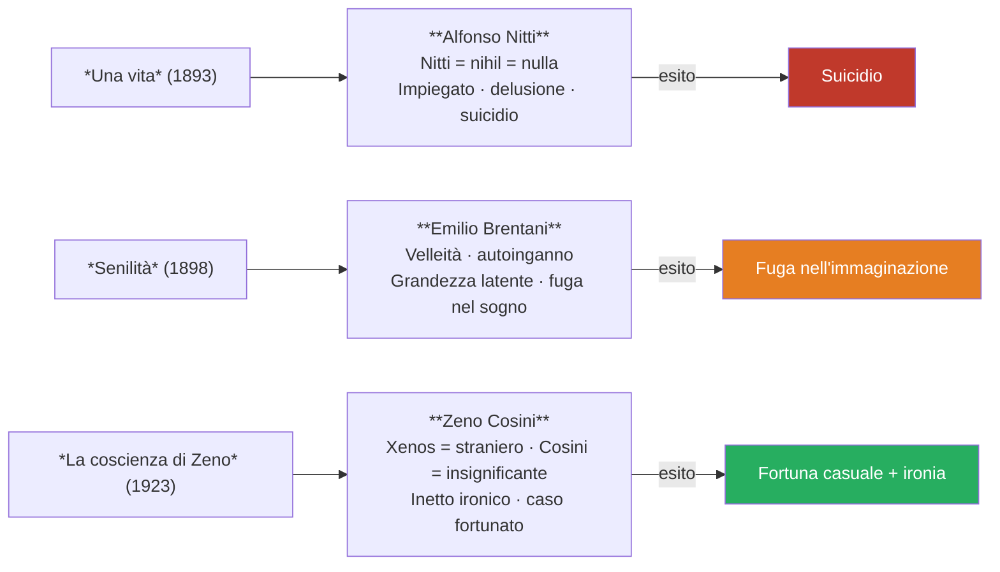

# Italo Svevo — Riassunto

---

## Coordinate essenziali

| Elemento | Dettaglio |
|----------|-----------|
| **Vero nome** | Ettore Schmitz |
| **Pseudonimo** | Italo Svevo (doppia appartenenza: Italia + mondo mitteleuropeo) |
| **Nato** | 1861, Trieste |
| **Morto** | 1928, complicazioni da fumo dopo incidente d'auto |
| **Professione** | Impiegato di banca, poi industriale (vernice navale Veneziani) |
| **Lingue** | 1ª dialetto triestino · 2ª tedesco · 3ª italiano (lingua letteraria) |
| **Opere** | *Una vita* (1893) · *Senilità* (1898) · *La coscienza di Zeno* (1923) |

---

## 1. Vita e formazione

Italo Svevo nasce nel 1861 a **Trieste**, città di porto e di confine al crocevia tra Italia, Austria e Germania: mitteleuropea per definizione, luogo di culture che si sovrappongono. La sua formazione è quella di un **autodidatta**: studia in Germania dal 1873, torna a Trieste nel 1878 con una vocazione letteraria già forte che il padre non vuole assecondare, e si costruisce su letture autonome fuori da percorsi accademici.

> [!note] Dalla lezione
> «L'italiano tra le lingue dei romanzi di Svevo non era di fatto né la prima e neanche la seconda lingua. Era la terza. Perché la prima lingua è quella del dialetto triestino, la seconda lingua è il tedesco, la terza lingua è l'italiano che poi lui usò come lingua letteraria delle sue opere.»

Lavora come impiegato di banca, poi sposa Livia Veneziani e diventa industriale nell'impresa di vernice navale del suocero. **Per venticinque anni non pubblica più nulla** ma non smette di scrivere. Il nome d'arte **Italo Svevo** è la sintesi identitaria di questo autore di confine: *Italo* rimanda all'identità italiana, *Svevo* al mondo germanico.

Nel primo decennio del Novecento avvengono due incontri fondamentali. **James Joyce** è il suo insegnante d'inglese e sarà tra i primi a riconoscere il valore de *La coscienza di Zeno*. La **psicoanalisi di Freud**, conosciuta attraverso un parente in cura da un allievo di Freud, lo affascina come stimolo letterario ma non come metodo terapeutico:

> [!note] Dalla lezione
> «Svevo ritiene la psicoanalisi uno strumento **inutile dal punto di vista medico**, ma **molto interessante da un punto di vista letterario**. Qual è invece lo strumento che riconosce come terapeutico? La scrittura. La scrittura per Svevo si rivela essere l'unica vera terapia.»

Muore nel 1928: le complicazioni derivate dal **vizio del fumo** dopo un incidente d'auto ne causarono la morte — dettaglio non aneddotico, perché il fumo è il tema del primo blocco narrativo del capolavoro.

---

## 2. La scrittura come ossessione e terapia

Per Svevo scrivere è un **bisogno irrinunciabile**: ossessione privata, mai un mestiere. La scrittura è **autoanalisi** — indagine di sé, esplorazione del disagio — e **terapia**, sostituto della psicoanalisi freudiana ritenuta inutile per la guarigione. Meno condizionato dai modelli canonici, Svevo sviluppa una **scrittura di grado zero**: lineare, con disarmonie sintattiche, priva di eleganza ma immediata nel contenuto.

> [!note] Dalla lezione
> «Sostanzialmente la critica ci ha detto che Svevo scrive male. Questo però gli consente di evitare i formalismi e di scrivere in modo più immediato e volto all'espressione del contenuto.»

---

## 3. La "malattia dell'uomo" e la società borghese

Svevo parte da un presupposto radicale: **tutti gli uomini sono malati**. La malattia è il disagio nel rapporto tra l'individuo e la **società borghese**, che impone successo economico, profitto, apparenza e conformismo. Chi non si adatta è emarginato; chi si adatta rischia di perdersi nell'ipocrisia. Svevo indaga questo rapporto dall'interno: lui stesso è un industriale di successo, fa parte di quel mondo borghese che mette a nudo sulla pagina.

> [!note] Dalla lezione
> «Qual è la malattia dell'uomo? È la vita. **La malattia è la vita**. [...] Coincide con la vita. Per cui la cura, o meglio la salute, con cosa coincide? Con la morte.»

Se la malattia è la vita, l'unica salute è la morte — posizione che ne *La coscienza di Zeno* viene presentata con ironia, rendendola sopportabile.

---

## 4. I tre romanzi e i tre personaggi

Tutti i protagonisti sveviani sono **inetti** — dal latino *in-aptus*, inadatti a vivere, abulici — ma con tre risposte diverse alla stessa condizione.

**Alfonso Nitti** (*Una vita*, 1893): il cognome rimanda a *nihil*, nulla. Impiegato deluso nel lavoro e in amore, si uccide. Il romanzo fu un fiasco assoluto.

**Emilio Brentani** (*Senilità*, 1898): giovane con velleità letterarie mai tradotte in atto. Si innamora di Angiolina, donna volgare e fedifraga che lui **idealizza** — per tutti è "Angiolona", per lui un angelo. È l'**autoinganno**: filtrare la realtà attraverso le lenti dei propri desideri.

> [!note] Dalla lezione
> «Ognuno di noi ha le lenti colorate di un colore diverso e ognuno di noi la realtà la vede attraverso il colore delle sue lenti che non è proprio quello.»

Si crede grande di una **grandezza latente** sempre in potenza e mai in atto. Finisce fuggendo nell'immaginazione: sconfitta, ma senza il tragismo del suicidio.

**Zeno Cosini** (*La coscienza di Zeno*, 1923): *Zeno* dal greco *xenos* = **straniero**; *Cosini* = **insignificante**. Non riesce a smettere di fumare. Ha un rapporto conflittuale col padre. Si innamora di Ada che lo rifiuta, chiede la mano a tutte le sorelle finché Augusta acconsente. Per circostanze casuali arricchisce speculando nel dopoguerra. La differenza fondamentale: Zeno **si affida al caso** con **ironia** e distacco, e paradossalmente riesce. *La coscienza di Zeno* fa ridere.

> [!note] Dalla lezione
> «La componente che troviamo nella *Coscienza di Zeno* che è estranea ai primi due romanzi è quella dell'ironia, del distacco ironico.»

---

## 5. L'inetto

**Inetto** — dal latino *in-aptus*, inadatto — accomuna i tre protagonisti. L'inetto è abulico, privo di volontà, si lascia vivere anziché agire. Alfonso soccombe col suicidio; Emilio evade nella fantasia; Zeno affronta l'inettitudine con ironia e prospera per puro caso. L'autoinganno di Emilio, il vizio del fumo di Zeno, la grandezza latente mai tradotta in atto: meccanismi della psicologia ordinaria, non patologie cliniche.

> [!note] Dalla lezione
> «I personaggi sveviani siamo noi. Cioè Svevo sta parlando di noi, sta parlando dell'uomo del Novecento.»

---

## 6. Stile e struttura narrativa

La critica definisce lo stile di Svevo **scrittura di grado zero**: lineare, con irregolarità sintattiche, priva di eleganza ma immediata nel contenuto. Per dare voce all'interiorità usa il **monologo interiore** — pensieri in prima persona con struttura riconoscibile — e il **discorso indiretto libero**, che dà voce ai pensieri senza filtri. *La coscienza di Zeno* è in **prima persona** (i romanzi precedenti in terza), con il **narratore inaffidabile**: Zeno esprime il suo punto di vista soggettivo, non la verità assoluta. La struttura è per **blocchi tematici** non cronologici — *Il fumo*, *La morte di mio padre*, *Storia del mio matrimonio* — con piani temporali intrecciati. Il **tono ironico** è l'elemento nuovo rispetto ai romanzi precedenti.

> [!note] Dalla lezione
> «Svevo mette in scena l'**uomo ordinario**, non l'eroe o il superuomo. L'autore indaga la vita borghese della Trieste mercantile, per metterne a nudo gli aspetti più torbidi, le debolezze più nascoste, le ossessioni inconfessabili. Lui stesso è parte di quel mondo, lo incarna perfettamente. In pratica toglie la maschera a una realtà a cui partecipa attivamente.»

---

## 7. Cronologia essenziale

| Anno | Evento / Opera |
|------|---------------|
| **1861** | Nasce Ettore Schmitz a Trieste |
| **1873** | Si trasferisce in Germania, studia in collegio |
| **1878** | Ritorna a Trieste; vocazione letteraria già forte |
| **1893** | Pubblica *Una vita* (fiasco) con lo pseudonimo Italo Svevo |
| **1898** | Pubblica *Senilità* (anch'essa ignorata) |
| **~1900** | Silenzio editoriale; conosce Joyce; scopre Freud |
| **1923** | Pubblica *La coscienza di Zeno*; notorietà internazionale |
| **1928** | Muore per complicazioni da fumo dopo un incidente d'auto |

---

*Fonti: lezione del 13/04/2026 — Lingua e letteratura italiana*
