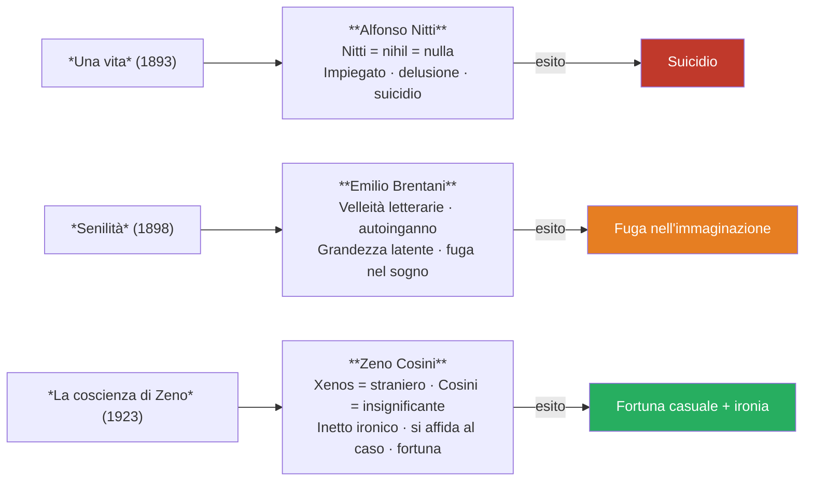

# Italo Svevo — Riassunto

---

## Coordinate essenziali

| Elemento | Dettaglio |
|----------|-----------|
| **Vero nome** | Ettore Schmitz |
| **Pseudonimo** | Italo Svevo (doppia appartenenza: Italia + mondo mitteleuropeo) |
| **Nato** | 1861, Trieste |
| **Morto** | 1928, complicazioni da fumo dopo incidente d'auto |
| **Professione** | Impiegato di banca, poi industriale (vernice navale Veneziani) |
| **Lingue** | 1ª dialetto triestino · 2ª tedesco · 3ª italiano (lingua letteraria) |
| **Opere principali** | *Una vita* (1893) · *Senilità* (1898) · *La coscienza di Zeno* (1923) |

---

## 1. Vita e formazione

### 1.1 Trieste: città di confine

Svevo nasce nel 1861 a **Trieste**, città **mitteleuropea** per definizione, porto al crocevia tra Italia, Austria e Germania. Questa condizione di confine è strutturante per tutta la sua opera. Nel 1873 si trasferisce in Germania per gli studi, e al ritorno a Trieste nel 1878 la sua vocazione letteraria è già forte, ma il padre non intende assecondarlo.

### 1.2 La doppia vita

Svevo lavora come impiegato di banca, poi sposa **Livia Veneziani** e diventa industriale nell'impresa di famiglia che produce una vernice speciale per le navi. **Per venticinque anni non pubblica più nulla**, eppure non smette di scrivere: la scrittura è per lui un'ossessione irrinunciabile, non una professione.

### 1.3 I due incontri fondamentali

Nel primo decennio del Novecento avvengono due incontri decisivi per la genesi de *La coscienza di Zeno*.

**James Joyce** era l'insegnante d'inglese di Svevo, lingua necessaria per i suoi affari. Joyce fu tra i primi a riconoscere il valore del romanzo e aiutò Svevo a ottenere quella notorietà internazionale che in Italia gli era stata negata.

**La psicoanalisi di Freud** giunse a Trieste prima che altrove in Italia. Svevo se ne interessò anche perché un parente era in cura presso un allievo di Freud. La sua posizione era di **interesse critico**: riteneva la psicoanalisi inutile come terapia medica ma interessante da un punto di vista letterario. Per lui l'unica vera cura del disagio esistenziale era la **scrittura**.

### 1.4 Lo pseudonimo

Il nome d'arte **Italo Svevo** insiste sulla doppia appartenenza: *Italo* rimanda all'identità italiana, *Svevo* — gli Svevi erano un popolo germanico — rimanda al mondo mitteleuropeo. È la sintesi di un autore cresciuto tra culture diverse.

---

## 2. La scrittura come terapia

Svevo è un **letterato dilettante**: autodidatta, non formato su percorsi accademici, meno condizionato dai modelli letterari canonici. La critica ha definito la sua lingua una **scrittura di grado zero** — lineare, con qualche disarmonia sintattica, non particolarmente elegante sul piano formale. Questo gli consente però di evitare i formalismi e di privilegiare l'espressione del contenuto.

Per Svevo scrivere è un **bisogno**, un'**autoanalisi**, un modo per conoscere se stesso. La psicoanalisi può stimolare la creazione artistica, ma non cura la malattia dell'uomo; la scrittura invece **cura il proprio male di vivere** — per questo Svevo ha scritto moltissimo, anche durante i venticinque anni senza pubblicazione.

---

## 3. La "malattia dell'uomo" e la società borghese

Svevo parte dal presupposto che **tutti gli uomini siano malati**. La malattia del Novecento è quella del rapporto tra l'individuo e la **società borghese**: una società che impone un modello basato sul successo economico, sul profitto e sul conformismo. Chi non risponde a queste richieste rischia l'emarginazione e l'isolamento.

> «Qual è la malattia dell'uomo? È la vita. **La malattia è la vita**. La malattia di vivere coincide con la vita stessa. Per cui la cura, o meglio la salute, con cosa coincide? Con la morte.»

Se la malattia è la vita, l'unica salute è la morte. Svevo giunge a questa conclusione radicale, ma — soprattutto ne *La coscienza di Zeno* — la presenta con una componente **ironica** che la rende sopportabile.

---

## 4. I tre romanzi e i tre personaggi

**Una vita (1893) — Alfonso Nitti**: primo romanzo, **fiasco assoluto**. Il cognome rimanda al latino *nihil*, "nulla". Alfonso è un impiegato che, dopo delusioni lavorative e sentimentali, si suicida.

**Senilità (1898) — Emilio Brentani**: anch'esso ignorato. Emilio ha velleità letterarie mai tradotte in atto e si innamora di Angiolina — ragazza del popolo volgare e fedifraga — idealizzandola completamente: è vittima dell'**autoinganno**, guarda la realtà secondo i propri desideri. Si crede dotato di una **grandezza latente**, sempre in potenza e mai in atto. La sua vicenda si conclude con una fuga nell'immaginazione: una sconfitta.

**La coscienza di Zeno (1923) — Zeno Cosini**: il capolavoro. *Zeno* deriva dal greco *xenos*, "straniero". Non riesce a smettere di fumare, ha un rapporto conflittuale col padre, si innamora di Ada che lo rifiuta e finisce per sposare Augusta. Grazie a circostanze fortuite ottiene anche il successo commerciale. La differenza fondamentale è la componente **ironica**: Zeno si affida al caso, che per lui si rivela fortunato. È un romanzo che, letto con il giusto spirito, fa ridere.

---

## 5. L'inetto

Il termine che accomuna tutti e tre i protagonisti è **inetto** — dal latino *in-aptus*, inadatto: chi è **abulico** (senza volontà), che si lascia vivere anziché agire. Alfonso e Emilio soccombono (suicidio, fuga nel sogno); Zeno si affida al caso con distacco ironico e, paradossalmente, riesce.

> «I personaggi sveviani siamo noi. Svevo sta parlando di noi, dell'uomo del Novecento.»

L'autoinganno di Emilio, la difficoltà di smettere di fumare di Zeno, la grandezza latente mai tradotta in atto sono meccanismi della psicologia di chiunque. Svevo non descrive casi clinici, ma la nevrosi ordinaria dell'uomo borghese.

---

## 6. Stile e struttura narrativa

Svevo utilizza due tecniche fondamentali per dare voce all'interiorità dei personaggi.

Il **monologo interiore** è la tecnica principale de *La coscienza di Zeno*: i pensieri del personaggio vengono espressi in prima persona, mantenendo una struttura sintattica riconoscibile. Il **discorso indiretto libero** — già incontrato in Verga con funzione mimetica — serve qui a dar voce liberamente ai pensieri della coscienza, che non si presentano sempre in modo ordinato.

**Caratteristiche strutturali de *La coscienza di Zeno*:**

- **Prima persona** — è la coscienza stessa di Zeno a prendere la parola (i precedenti romanzi erano in terza persona)
- **Inaffidabilità del narratore** — ciò che Zeno dice è sempre soggettivo, non la verità assoluta
- **Struttura a blocchi tematici** (non cronologica): *Il fumo*, *La morte di mio padre*, *Storia del mio matrimonio*, ecc.
- **Tono ironico** — la grande novità rispetto ai romanzi precedenti

> «Svevo mette in scena l'**uomo ordinario**, non l'eroe. Indaga la vita borghese per metterne a nudo le debolezze nascoste e le ossessioni inconfessabili — lui stesso è parte di quel mondo e in pratica toglie la maschera a una realtà a cui partecipa attivamente.»

---

## 7. Cronologia essenziale

| Anno | Evento / Opera |
|------|---------------|
| **1861** | Nasce Ettore Schmitz a Trieste |
| **1873** | Si trasferisce in Germania, studia in collegio |
| **1878** | Ritorna a Trieste; vocazione letteraria già forte |
| **1893** | Pubblica *Una vita* (fiasco) con lo pseudonimo Italo Svevo |
| **1898** | Pubblica *Senilità* (anch'essa ignorata) |
| **~1900** | Silenzio editoriale di venticinque anni; continua a scrivere privatamente |
| **1900s** | Conosce Joyce; scopre la psicoanalisi di Freud |
| **1923** | Pubblica *La coscienza di Zeno*; notorietà internazionale grazie a Joyce |
| **1928** | Muore per complicazioni da fumo dopo un incidente d'auto |

---

*Fonti: lezione del 13/04/2026 — Lingua e letteratura italiana*
