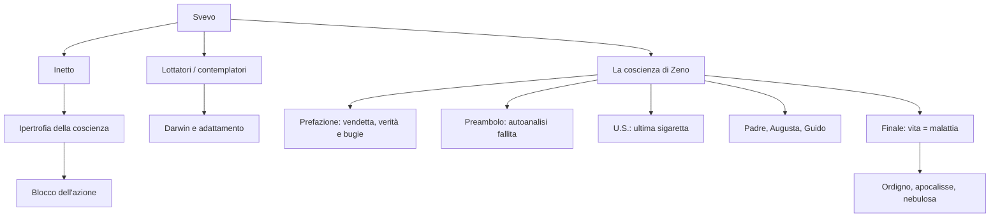

# Italo Svevo — Riassunto

---

## Coordinate essenziali

| Elemento | Dettaglio |
|----------|-----------|
| **Vero nome** | Ettore Schmitz |
| **Pseudonimo** | Italo Svevo: doppia appartenenza italiana e mitteleuropea |
| **Nato** | 1861, Trieste |
| **Morto** | 1928, dopo incidente d'auto con complicazioni legate al fumo |
| **Professione** | Impiegato di banca, poi industriale nell'impresa Veneziani |
| **Lingue** | 1ª dialetto triestino · 2ª tedesco · 3ª italiano |
| **Opere principali** | *Una vita* (1893) · *Senilità* (1898) · *La coscienza di Zeno* (1923) |

---

## 1. Vita, Trieste e formazione

Svevo nasce a **Trieste**, città di porto, confine e cultura mitteleuropea. Questa posizione spiega la sua identità mista: non è un autore soltanto italiano in senso tradizionale, ma vive tra mondo italiano, austriaco e tedesco. Studia in Germania e si forma da autodidatta, fuori da percorsi letterari accademici.

La sua vita è doppia: da un lato impiegato e poi industriale, dall'altro scrittore ossessivo. Dopo *Senilità* non pubblica per circa venticinque anni, ma continua a scrivere perché per lui la scrittura è un bisogno e una forma di terapia. La critica ha parlato di **scrittura di grado zero**: lingua lineare, non elegante, ma efficace per esprimere il contenuto psicologico.

Nel primo Novecento sono importanti due incontri: **Joyce**, suo insegnante d'inglese e poi estimatore, e **Freud**, conosciuto attraverso la psicoanalisi. Svevo non crede molto nella psicoanalisi come cura, ma la considera uno strumento letterario decisivo per raccontare nevrosi, autoanalisi e inconscio.

---

## 2. Malattia, borghesia e inetto

La narrativa sveviana parte dall'idea che l'uomo moderno sia malato. La malattia non è solo individuale: nasce dal rapporto con la **società borghese**, fondata su successo, profitto, competizione e conformismo. L'uomo del Novecento vive disagio, alienazione e senso di estraneità.

Il personaggio tipico è l'**inetto**, cioè l'inadatto alla vita. L'inetto non agisce: pensa troppo, rimugina, si blocca. La lezione definisce questo meccanismo **ipertrofia della coscienza**: la coscienza è eccessivamente alimentata e ostacola l'azione.

Da qui nasce l'opposizione tra **lottatori** e **contemplatori**. I lottatori agiscono e si adattano alla vita, secondo un retroterra darwiniano di lotta per la sopravvivenza. I contemplatori, invece, guardano, pensano, sognano, ma non afferrano il reale.

---

## 3. I romanzi

### 3.1 *Una vita*

Il protagonista è **Alfonso Nitti**, impiegato e inetto. Il cognome richiama *nihil*, "nulla". Nel brano **"Con le ali di gabbiano ci si nasce"**, Alfonso è in barca con **Macario**, il cui nome deriva dal greco *Makarios*, "felice". Macario osserva i gabbiani: hanno poco cervello, ma ali, occhi e appetito perfetti per cacciare.

Il gabbiano è il simbolo dell'adattamento alla vita; Alfonso invece ha troppa coscienza, e questa lo paralizza. Macario distingue chi ha mani per afferrare e chi ha mani incapaci di tenere. Quando Alfonso chiede se anche lui abbia ali, Macario risponde che le ha solo **"per fare voli poetici"**: può immaginare, ma non agire.

### 3.2 *Senilità*

Il protagonista è **Emilio Brentani**, giovane con aspirazioni letterarie mai realizzate. La **senilità** del titolo non è vecchiaia anagrafica, ma condizione interiore: fiacchezza, rinuncia, grigiore, vita nei pensieri più che nella realtà.

Il sistema dei personaggi riprende l'opposizione lottatori/contemplatori. **Emilio** e la sorella **Amalia** sono contemplatori: frustrati, chiusi, incapaci di vivere pienamente. **Stefano Balli**, scultore, e **Angiolina**, donna amata e idealizzata da Emilio, sono invece figure più vitali. Emilio trasforma Angiolina in un ideale puro, ma lei è concreta, sensuale e infedele: il suo errore è l'**autoinganno**.

### 3.3 *La coscienza di Zeno*

Il capolavoro del 1923 ha come protagonista **Zeno Cosini**. *Zeno* richiama *xenos*, "straniero": Zeno è estraneo a se stesso e agli altri. Il romanzo è in prima persona, organizzato non cronologicamente ma per **blocchi logici**, secondo il tempo misto della coscienza.

La **Prefazione** è scritta dal **Dottor S.**, psicanalista di Zeno. Egli pubblica le memorie del paziente per vendetta, perché Zeno ha abbandonato la cura. Questo rende inaffidabile anche il medico. Fin dall'inizio il lettore sa che leggerà un insieme di **verità e bugie**. Entrano anche i concetti di **transfer** e **controtransfert**: il paziente proietta sul medico vissuti inconsci, ma anche il medico prova sentimenti verso il paziente e dovrebbe saperli governare.

Nel **Preambolo**, Zeno tenta un'autoanalisi. Vuole cominciare **ab ovo**, dall'origine, cioè dall'infanzia, ma disobbedisce al medico e prova a curarsi da solo leggendo un trattato di psicoanalisi. È un monologo interiore. Vede una locomotiva che trascina vagoni in salita, immagine del peso del vivere, e un bambino in fasce, che chiama "povero bambino" perché chi nasce è già destinato alla malattia del vivere. Il finale **"ritenterò domani"** riassume il suo carattere: propositi continui, sempre rimandati.

Nel capitolo del **fumo**, Zeno annota continuamente **U.S.**, "ultima sigaretta", su libri, fogli e pareti. Sceglie date simboliche, come il 2 febbraio 1886, il 9/9/1899 o l'1/1/1901, sperando che inaugurino una nuova vita. Ma ogni ultima sigaretta è seguita da un'altra: la stanza diventa il **cimitero dei buoni propositi**. Il fumo è anche un alibi, perché Zeno può attribuire al vizio la colpa della propria incapacità.

Il rapporto col padre culmina nello **schiaffo**: il padre moribondo lascia cadere la mano sul volto di Zeno, che interpreta il gesto come punizione. Non sappiamo se sia vero o involontario; conta il filtro soggettivo di Zeno. Nel matrimonio, Zeno ama Ada, viene rifiutato, chiede la mano ad Alberta e poi sposa **Augusta**, che incarna la salute. Ma per lui quella di Augusta è una **salute malata**, perché è fatta di certezze inconsapevoli della malattia della vita.

**Guido Speier**, marito di Ada, è brillante e disinvolto: Zeno lo invidia e lo odia. Dopo la rovina economica Guido si suicida; Zeno sbaglia corteo funebre, e questo è un **atto mancato** freudiano, cioè emersione dell'inconscio. Come lapsus e sogni, l'atto mancato rivela un desiderio rimosso: Zeno non voleva davvero andare al funerale del rivale.

---

## 4. Il finale

L'ultimo capitolo, **Psicanalisi**, chiude circolarmente il romanzo. Zeno rifiuta la psicoanalisi perché capisce che la sua malattia non è individuale: è la vita stessa a essere malata. Anche la civiltà è malata, alienata, dominata dalla società borghese, dal capitalismo e dalla spirale produttivistica.

Nel finale la vita somiglia alla malattia ed è sempre mortale. La vita attuale è "inquinata alle radici": l'uomo occupa lo spazio, inquina, soffoca. Gli animali si adattano trasformando il corpo; l'uomo invece, "occhialuto", inventa **ordigni** fuori dal corpo. Gli ordigni lo rendono più furbo ma più debole, e la legge del più forte viene sostituita dalla legge di chi possiede più strumenti.

Zeno immagina una catastrofe finale: un uomo un po' più ammalato degli altri userà un esplosivo incomparabile, la terra esploderà e tornerà allo stato di **nebulosa**, libera da parassiti e malattie. Il finale può essere letto in modo **nichilistico** (la morte è l'unica salute) oppure come **palingenesi** (distruzione e possibile rinascita). L'ultima parola del romanzo è **"malattie"**.

---

## 5. Schema rapido

```mermaid
flowchart TD
    A["Svevo"] --> B["Inetto"]
    B --> C["Ipertrofia della coscienza"]
    C --> D["Blocco dell'azione"]
    A --> E["Lottatori / contemplatori"]
    E --> F["Darwin e adattamento"]
    A --> G["La coscienza di Zeno"]
    G --> H["Prefazione: vendetta, verità e bugie"]
    G --> I["Preambolo: autoanalisi fallita"]
    G --> L["U.S.: ultima sigaretta"]
    G --> M["Padre, Augusta, Guido"]
    G --> N["Finale: vita = malattia"]
    N --> O["Ordigno, apocalisse, nebulosa"]
```

---

*Fonti: lezioni del 13/04/2026, 16/04/2026 e parte Svevo del 20/04/2026 — Lingua e letteratura italiana*
