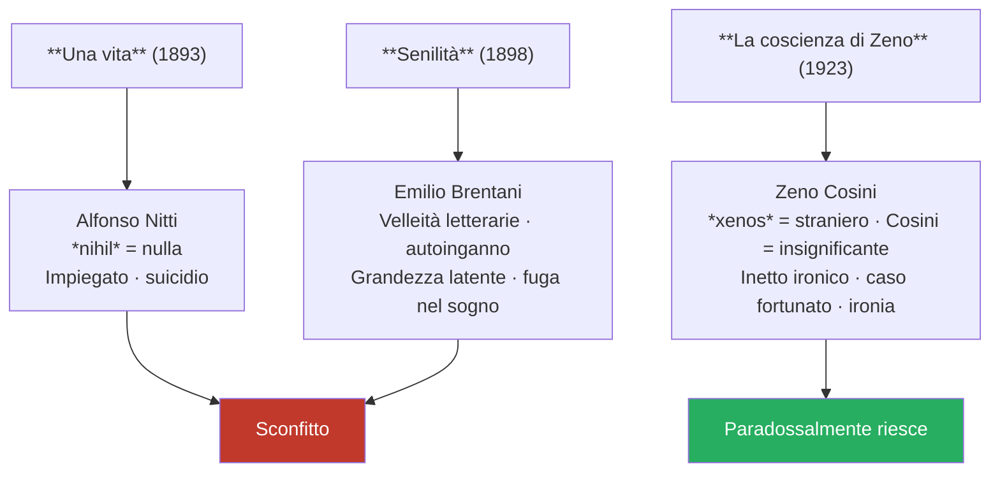
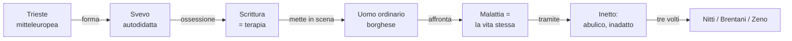

# Italo Svevo — Ripasso veloce

---

## Dati biografici essenziali

**Ettore Schmitz** (pseudonimo: Italo Svevo) · 1861–1928 · Trieste (città mitteleuropea, di porto e confine)  
Lingue: 1ª dialetto triestino · 2ª tedesco · 3ª italiano  
Professione: impiegato di banca → industriale (vernice navale del suocero)  
Joyce: suo insegnante d'inglese → primo estimatore del capolavoro  
Muore per complicazioni da fumo dopo incidente d'auto (1928)

---

## Temi e visione

| Concetto | Contenuto |
|----------|-----------|
| **Scrittura** | Ossessione · bisogno · terapia · autoanalisi |
| **Psicoanalisi** | Interessante per letteratura, inutile come cura medica |
| **Malattia dell'uomo** | Disagio dell'individuo nella società borghese |
| **La malattia È la vita** | L'unica salute coincide con la morte |
| **Scrittura di grado zero** | Lineare, priva di formalismi, con disarmonie sintattiche |

---

## I tre romanzi

**Inetto** (da *in-aptus* = inadatto): abulico, senza volontà, si lascia vivere. Li accomuna tutti e tre.

---

## Differenze tra i personaggi

| | Alfonso Nitti | Emilio Brentani | Zeno Cosini |
|--|--|--|--|
| **Esito** | Suicidio | Fuga nel sogno | Fortuna casuale |
| **Meccanismo** | Delusione totale | Autoinganno + grandezza latente | Ironia + affidamento al caso |
| **Tono** | Tragico | Elegiaco | Ironico |

---

## Struttura de *La coscienza di Zeno*

- **Prima persona** (unicum: i primi due romanzi sono in terza persona)
- **Narratore inaffidabile** — punto di vista soggettivo, non verità assoluta
- **Blocchi tematici** non cronologici: *Il fumo* · *La morte di mio padre* · *Storia del mio matrimonio* · ecc.
- **Tono ironico** — fa ridere
- **Monologo interiore** + **discorso indiretto libero**

---

## Schema concettuale

---

*Fonti: lezione del 13/04/2026 — Lingua e letteratura italiana*
