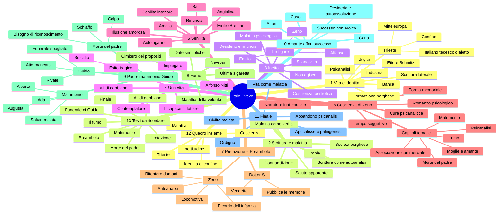

# Schema mentale stampabile — Italo Svevo

Schema unico e compatto, disposto nello stesso ordine del `riassunto.md`.

```mermaid
mindmap
  root((Italo Svevo))
    1 Vita e identita
      Ettore Schmitz
      Trieste
        Confine
        Mitteleuropa
        Italiano tedesco dialetto
      Formazione borghese
      Banca
      Industria
      Scrittura laterale
      Joyce
      Psicanalisi
    2 Scrittura e malattia
      Societa borghese
      Salute apparente
      Malattia come verita
      Scrittura come autoanalisi
      Ironia
      Contraddizione
    3 Inetto
      Non agisce
      Si analizza
      Coscienza ipertrofica
      Desiderio e rinuncia
      Malattia psicologica
      Tre figure
        Alfonso
        Emilio
        Zeno
    4 Una vita
      Alfonso Nitti
      Impiegato
      Ali di gabbiano
      Contemplatore
      Incapace di lottare
      Esito tragico
        Suicidio
    5 Senilita
      Emilio Brentani
      Senilita interiore
      Autoinganno
      Amalia
      Balli
      Angiolina
      Illusione amorosa
      Rinuncia
    6 Coscienza di Zeno
      Romanzo psicologico
      Forma memoriale
      Cura psicanalitica
      Capitoli tematici
        Fumo
        Morte del padre
        Matrimonio
        Moglie e amante
        Associazione commerciale
        Psicanalisi
      Tempo soggettivo
      Narratore inattendibile
    7 Prefazione e Preambolo
      Dottor S
        Vendetta
        Pubblica le memorie
      Zeno
        Autoanalisi
        Ricordo dell infanzia
        Locomotiva
        Ritentero domani
    8 Fumo
      Ultima sigaretta
      Date simboliche
      Cimitero dei propositi
      Nevrosi
      Malattia della volonta
    9 Padre matrimonio Guido
      Morte del padre
        Schiaffo
        Colpa
        Bisogno di riconoscimento
      Matrimonio
        Ada
        Alberta
        Augusta
        Salute malata
      Guido
        Rivale
        Atto mancato
        Funerale sbagliato
    10 Amante affari successo
      Carla
      Desiderio e autoassoluzione
      Affari
      Caso
      Successo non eroico
    11 Finale
      Abbandono psicanalisi
      Vita come malattia
      Civilta malata
      Ordigno
      Apocalisse o palingenesi
    12 Quadro insieme
      Trieste
      Identita di confine
      Inettitudine
      Coscienza
      Malattia
    13 Testi da ricordare
      Ali di gabbiano
      Prefazione
      Preambolo
      Il fumo
      Morte del padre
      Matrimonio
      Funerale di Guido
      Finale
```
