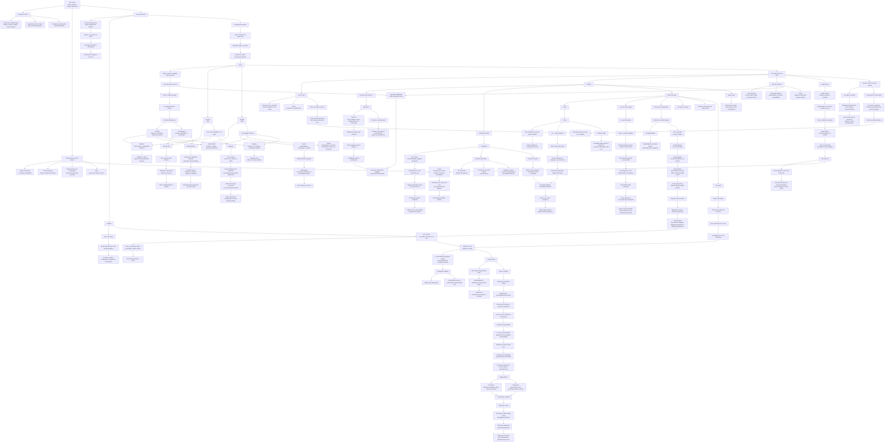

# Schema Mermaid - Italo Svevo

```mermaid
flowchart TD
    A["Italo Svevo<br/>Ettore Schmitz<br/>Trieste, 1861-1928"] --> B["Identità di confine"]
    B --> B1["Trieste porto mitteleuropeo<br/>italiano, tedesco, dialetto, cultura europea"]
    B --> B2["Pseudonimo: Italo + Svevo<br/>Italia e mondo germanico"]
    B --> B3["Posizione anomala nella letteratura italiana"]

    A --> C["Formazione e incontri decisivi"]
    C --> C1["Studi in Germania<br/>formazione autodidatta"]
    C --> C2["Lavoro borghese<br/>banca e industria Veneziani"]
    C --> C3["Lingua sobria e non ornamentale<br/>adatta all'analisi della coscienza"]
    C --> C4["Joyce<br/>riconosce il valore di Svevo"]
    C --> C5["Freud<br/>strumenti per nevrosi, memoria, inconscio, autoinganno"]
    C5 --> C6["Psicoanalisi non come vera cura<br/>ma come strumento letterario"]
    C6 --> C7["Vera terapia possibile: scrittura"]

    A --> D["Poetica sveviana"]
    D --> D1["Scrittura di grado zero<br/>sobria, disarmonica, analitica"]
    D1 --> D2["Scrivere = osservare se stessi"]
    D2 --> D3["Smascherare bugie e autoinganni"]
    D3 --> D4["Trasformare il disagio in racconto"]

    D --> E["Malattia"]
    E --> E1["Non solo clinica"]
    E1 --> E2["Disagio dell'individuo nella società borghese"]
    E2 --> E3["Successo, profitto, competizione, apparenza, conformismo"]
    E --> E4["Idea centrale<br/>la malattia coincide con la vita"]
    E4 --> E5["Vivere = desiderare, fallire, invecchiare, soffrire, morire"]
    E5 --> E6["Unica salute assoluta: morte"]

    D --> F["Protagonista sveviano"]
    F --> F1["Uomo ordinario del Novecento"]
    F1 --> F2["Borghese, fragile, nevrotico"]
    F2 --> F3["Incapace di aderire pienamente alla vita"]
    F3 --> G["Inetto"]

    G --> G1["Abulico, insicuro, inadatto alla vita pratica"]
    G1 --> G2["Ipertrofia della coscienza"]
    G2 --> G3["Pensa e analizza troppo"]
    G3 --> G4["La coscienza blocca l'azione"]
    G4 --> H["Dicotomia darwiniana"]
    H --> H1["Lottatori<br/>agiscono, si adattano, afferrano la preda"]
    H --> H2["Contemplatori<br/>pensano, guardano, si tormentano"]

    G --> I["Una vita<br/>1893"]
    I --> I1["Alfonso Nitti"]
    I1 --> I2["Primo grande inetto sveviano"]
    I2 --> I3["Impiegato inconsistente<br/>incapace di imporsi"]
    I3 --> I4["Esito: sconfitta tragica e suicidio"]
    I --> I5["Con le ali di gabbiano ci si nasce"]
    I5 --> I6["Macario<br/>amico-nemico, antagonista simbolico"]
    I6 --> I7["Makarios = felice<br/>aderisce spontaneamente alla vita"]
    I5 --> I8["Gabbiani"]
    I8 --> I9["Poco cervello<br/>ma ali, occhi, stomaco, istinto"]
    I9 --> I10["Vivere richiede meno riflessione<br/>e più capacità di piombare sulla preda"]
    I10 --> I11["Alfonso ha troppa coscienza<br/>e nessuna presa sul reale"]
    I11 --> I12["Ali per voli poetici<br/>immaginazione senza efficacia pratica"]

    G --> J["Senilità<br/>1898"]
    J --> J1["Emilio Brentani"]
    J1 --> J2["Giovane con ambizioni letterarie<br/>grandezza solo potenziale"]
    J2 --> J3["Senilità interiore<br/>fiacchezza, rinuncia, grigiore, monotonia"]
    J3 --> J4["Vita vissuta più nei pensieri che nella realtà"]
    J --> J5["Personaggi e funzioni"]
    J5 --> J6["Emilio<br/>contemplatore: autoinganno e velleità"]
    J5 --> J7["Amalia<br/>contemplatrice: chiusura, frustrazione, amore non corrisposto"]
    J5 --> J8["Stefano Balli<br/>lottatore: energia, sicurezza, godimento"]
    J5 --> J9["Angiolina<br/>lottatrice: concretezza, sensualità, infedeltà"]
    J6 --> J10["Emilio idealizza Angiolina"]
    J9 --> J11["Angiolina reale<br/>libera, concreta, infedele"]
    J10 --> J12["Autoinganno<br/>non vede la realtà ma ciò che desidera vedere"]
    J12 --> J13["Esito: illusione e rinuncia"]

    G --> K["La coscienza di Zeno<br/>1923"]
    K --> K1["Zeno Cosini"]
    K1 --> K2["Zeno da xenos = straniero<br/>estraneo agli altri e a se stesso"]
    K1 --> K3["Cosini<br/>piccolezza e insignificanza"]
    K1 --> K4["Inetto con distacco ironico"]
    K4 --> K5["Sa raccontarsi da lontano<br/>ed è spesso favorito dal caso"]

    K --> L["Struttura"]
    L --> L1["Prefazione del Dottor S."]
    L --> L2["Preambolo di Zeno"]
    L --> L3["Blocchi tematici"]
    L3 --> L4["Il fumo"]
    L3 --> L5["La morte di mio padre"]
    L3 --> L6["Storia del mio matrimonio"]
    L3 --> L7["La moglie e l'amante"]
    L3 --> L8["Storia di un'associazione commerciale"]
    L3 --> L9["Psicanalisi"]
    L --> L10["Tempo misto"]
    L10 --> L11["Memoria per nuclei, associazioni, ritorni, contraddizioni"]

    K --> M["Tecniche narrative"]
    M --> M1["Prima persona<br/>racconto filtrato dalla coscienza di Zeno"]
    M --> M2["Monologo interiore<br/>ragionamenti, correzioni, contraddizioni"]
    M --> M3["Narratore inaffidabile<br/>verità e bugie intrecciate"]
    M --> M4["Ironia<br/>distanza critica dalla propria malattia"]

    L1 --> N["Prefazione"]
    N --> N1["Dottor S.<br/>nome ambiguo: Svevo, Sigmund Freud, Z rovesciata"]
    N1 --> N2["Pubblica le memorie per vendetta"]
    N2 --> N3["Viola il rapporto medico-paziente"]
    N3 --> N4["Inaffidabile anche lo psicanalista"]
    N4 --> N5["Romanzo senza verità oggettiva<br/>solo punti di vista parziali"]
    N --> N6["Transfer e controtransfert"]
    N6 --> N7["Il medico non domina il controtransfert<br/>agisce per risentimento"]

    L2 --> O["Preambolo"]
    O --> O1["Zeno scrive un'autobiografia suggerita dal medico"]
    O1 --> O2["Disobbedisce e vuole iniziare ab ovo"]
    O2 --> O3["Legge psicoanalisi e tenta di curarsi da solo"]
    O3 --> O4["Psicoanalisi usata e svalutata"]
    O4 --> O5["Fallisce come cura ordinata<br/>ma genera il romanzo"]
    O --> O6["Memoria deformata"]
    O6 --> O7["Occhi presbiti<br/>distanza dal passato"]
    O6 --> O8["Locomotiva con molte vetture<br/>peso del vivere"]
    O6 --> O9["Bambino in fasce<br/>chi nasce è già destinato alla malattia della vita"]
    O --> O10["Ritenterò domani"]
    O10 --> O11["Rinvio, nuovo proposito, ricominciare senza concludere"]

    L4 --> P["Il fumo"]
    P --> P1["Zeno attribuisce al vizio la propria malattia"]
    P1 --> P2["Abulia, debolezza, incapacità di volontà"]
    P --> P3["U.S. = ultima sigaretta"]
    P3 --> P4["Date su libri, fogli, pareti"]
    P4 --> P5["Giorni simbolici per inaugurare una vita nuova"]
    P5 --> P6["Ogni ultima sigaretta è seguita da un'altra"]
    P6 --> P7["Il proposito diventa rinnovabile all'infinito"]
    P --> P8["2 febbraio 1886"]
    P8 --> P9["Passaggio legge-chimica e nuova U.S.<br/>poi ritorno alla legge e altra U.S."]
    P7 --> P10["Fumo come capro espiatorio"]
    P10 --> P11["Stanza dello studente<br/>cimitero dei buoni propositi"]

    L5 --> Q["La morte del padre"]
    Q --> Q1["Padre = autorità e giudizio"]
    Q1 --> Q2["Durante l'agonia la mano cade sul volto di Zeno"]
    Q2 --> Q3["Zeno interpreta il gesto come schiaffo"]
    Q3 --> Q4["Non sappiamo se sia intenzionale o involontario"]
    Q4 --> Q5["Conta il filtro della coscienza"]
    Q5 --> Q6["Colpa, bisogno di riconoscimento, immaturità"]
    Q6 --> Q7["Dopo la morte del padre<br/>manca qualcuno a cui dimostrare grandezza"]

    L6 --> R["Matrimonio e salute malata"]
    R --> R1["Famiglia Malfenti"]
    R1 --> R2["Capofamiglia come padre elettivo<br/>industriale forte e borghese"]
    R --> R3["Zeno ama Ada<br/>ma viene rifiutato"]
    R3 --> R4["Chiede Alberta<br/>che vuole studiare"]
    R4 --> R5["Sposa Augusta<br/>la meno desiderata, che accetta"]
    R5 --> R6["Zeno amorale<br/>senza direzione morale stabile, trascinato dagli eventi"]
    R6 --> R7["Il caso lo favorisce<br/>Augusta diventa moglie perfetta"]
    R7 --> R8["Augusta incarna la salute"]
    R8 --> R9["Matrimonio, messa, certezze, punti fermi"]
    R9 --> R10["Salute malata<br/>sana perché tranquilla, malata perché ignora la malattia dell'esistenza"]

    K --> S["Guido Speier"]
    S --> S1["Marito di Ada<br/>brillante, disinvolto, violinista"]
    S1 --> S2["Rappresenta ciò che Zeno vorrebbe essere"]
    S2 --> S3["Zeno lo invidia e lo detesta"]
    S3 --> S4["Guido fallisce economicamente e si suicida"]
    S4 --> S5["Zeno va al funerale<br/>ma segue il corteo sbagliato"]
    S5 --> S6["Atto mancato"]
    S6 --> S7["Errore apparente che rivela l'inconscio"]
    S7 --> S8["Una parte di Zeno non voleva partecipare<br/>perché Guido era il rivale odiato"]

    K --> T["Amante, affari, successo casuale"]
    T --> T1["La moglie e l'amante"]
    T1 --> T2["Relazione adulterina con donna aiutata economicamente"]
    T2 --> T3["Zeno non domina la situazione<br/>alla fine è lei ad abbandonarlo"]
    T --> T4["Associazione commerciale"]
    T4 --> T5["Successo economico favorito anche dalla Prima guerra mondiale"]
    T5 --> T6["Zeno non diventa lottatore"]
    T6 --> T7["Sopravvive grazie a ironia, caso, mobilità"]

    L9 --> U["Finale: Psicanalisi"]
    U --> U1["Chiusura circolare del romanzo"]
    U1 --> U2["Zeno polemizza con la cura"]
    U2 --> U3["La malattia non è solo individuale"]
    U3 --> U4["Malata è la vita<br/>malata è la civiltà"]
    U4 --> U5["La psicoanalisi interpreta i sintomi<br/>ma non guarisce la condizione umana"]
    U5 --> U6["Guarigione ambigua"]
    U6 --> U7["Rifiuto della psicoanalisi"]
    U6 --> U8["Accettazione che non esista salute separata dalla vita"]

    U4 --> V["Civiltà malata"]
    V --> V1["Vita moderna inquinata alle radici"]
    V1 --> V2["Sovraffollamento, urbanesimo, mancanza di respiro"]
    V2 --> V3["Alienazione<br/>estraneità alla società e a se stessi"]
    V --> V4["Uomo occhialuto"]
    V4 --> V5["Dipende da strumenti esterni"]
    V5 --> V6["Ordigni come prolungamenti del braccio"]
    V6 --> V7["Meccanismi sempre più autonomi e distruttivi"]
    V7 --> V8["L'uomo cresce in furbizia e in debolezza"]

    V8 --> W["Conclusione apocalittica"]
    W --> W1["Un uomo più ammalato degli altri usa un esplosivo incomparabile"]
    W1 --> W2["Esplosione al centro della terra"]
    W2 --> W3["Il pianeta torna nebulosa<br/>senza parassiti né malattie"]
    W3 --> W4["Paura novecentesca di tecnica, guerra, autodistruzione"]
    W4 --> W5["Doppia lettura"]
    W5 --> W6["Nichilismo<br/>distruzione definitiva: morte come unica salute"]
    W5 --> W7["Palingenesi<br/>azzeramento come possibile rinascita cosmica"]
    W6 --> W8["Parola finale: malattie"]
    W7 --> W8

    E4 --> U4
    G2 --> M3
    H1 --> I6
    H2 --> I1
    H2 --> J1
    H1 --> J8
    H1 --> J9
    K5 --> T7
    M3 --> N5
    O11 --> P7
    R10 --> E4
    S6 --> C5
    W8 --> X["Sintesi per l'orale"]
    X --> X1["Da Trieste e dalla scrittura sobria<br/>alla diagnosi dell'inetto"]
    X1 --> X2["Dall'inetto individuale<br/>alla malattia della vita"]
    X2 --> X3["Dalla nevrosi di Zeno<br/>alla civiltà malata e all'apocalisse tecnica"]
```
