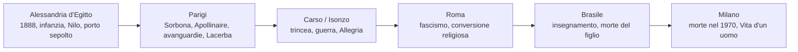
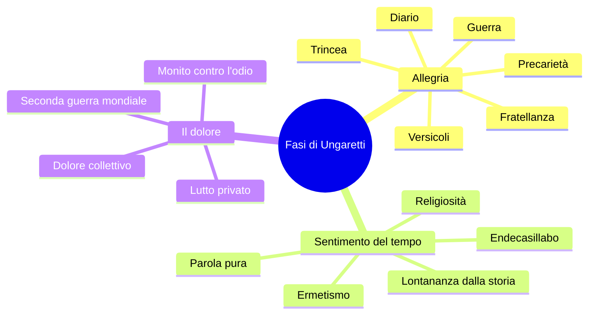

# Giuseppe Ungaretti — Studio completo per la maturità

---

## Coordinate iniziali

| | |
|---|---|
| **Nome** | Giuseppe Ungaretti |
| **Date** | **1888-1970** |
| **Nascita** | **Alessandria d'Egitto**, da genitori italiani emigrati, originari della zona lucchese |
| **Morte** | **Milano**, 1970 |
| **Luoghi chiave** | Alessandria d'Egitto, Parigi, Carso/Isonzo, Roma, Brasile, Milano |
| **Prima fase** | *Il porto sepolto* / *L'Allegria*: guerra, trincea, precarietà, fratellanza |
| **Seconda fase** | *Sentimento del tempo*: Ermetismo, parola pura, ritorno a metri più tradizionali |
| **Terza fase** | *Il dolore*: dolore privato e collettivo, Seconda guerra mondiale, lutti |
| **Parole chiave** | Porto sepolto, segreto, essenzialità, parola-verso, silenzio, analogia, fratellanza |

---

## Date fondamentali

| Anno | Evento |
|------|--------|
| **1888** | Nasce ad **Alessandria d'Egitto** |
| **Infanzia** | Il padre muore nei lavori legati a **Suez**; la madre, **fornaia**, mantiene la famiglia e gli garantisce studi di alto livello |
| **Anni giovanili** | Studia nelle scuole prestigiose di Alessandria |
| **1912 circa** | Si trasferisce a **Parigi**, studia alla **Sorbona**, frequenta l'ambiente delle avanguardie |
| **1915** | Prime poesie pubblicate su **Lacerba**, rivista legata al Futurismo |
| **1914-1915** | È interventista; con l'entrata in guerra dell'Italia si arruola volontario |
| **1915-1918** | Combatte sul **Carso**, presso l'**Isonzo**, in trincea |
| **1916** | Pubblica il primo nucleo poetico: ***Il porto sepolto*** |
| **1919** | *Il porto sepolto* confluisce in ***Allegria di naufragi*** |
| **1923** | Ripubblica *Il porto sepolto* con presentazione di **Benito Mussolini** |
| **1928** | Matura la conversione religiosa |
| **1931** | La raccolta assume il titolo definitivo ***L'Allegria*** |
| **Anni Trenta** | Fase di ***Sentimento del tempo***, vicina all'**Ermetismo** |
| **1936-1942** | Vive in **Brasile**, dove insegna letteratura italiana all'università |
| **1947** | Pubblica ***Il dolore*** |
| **1970** | Muore a **Milano**; tutta la produzione confluisce in ***Vita d'un uomo*** |

---

## 1. Biografia per luoghi

### 1.1 Alessandria d'Egitto: nascita, infanzia, deserto, porto

Ungaretti nasce nel **1888 ad Alessandria d'Egitto**, città cosmopolita, portuale, attraversata da lingue, popoli e culture diverse. La sua famiglia è italiana: i genitori sono emigrati dall'area lucchese. Il padre lavora nei cantieri legati a **Suez** e muore quando Ungaretti è ancora molto piccolo; la madre, rimasta sola, lavora come **fornaia** e riesce comunque a garantire al figlio un'istruzione di primo livello.

Alessandria è decisiva anche per la sua immaginazione poetica. Da lì viene la leggenda del **porto sepolto**, un antico porto sommerso e perduto, anteriore alla città di Alessandro Magno. Quel porto diventa il simbolo della poesia: una profondità nascosta, misteriosa, quasi inaccessibile, in cui il poeta prova a scendere per riportare alla luce una parola.

> [!note] Dalla lezione
> La professoressa insiste sul fatto che la vita di Ungaretti si capisce attraverso i **luoghi**. Alessandria è il luogo della nascita, dell'infanzia e del mito del porto sommerso. Da lì viene anche uno dei fiumi fondamentali di *I fiumi*: il **Nilo**.

### 1.2 Parigi: Sorbona, avanguardie, Apollinaire, Lacerba

Prima dello scoppio della guerra Ungaretti si trasferisce a **Parigi**, dove studia alla **Sorbona** e frequenta artisti, intellettuali, filosofi e poeti d'avanguardia. È un passaggio fondamentale: Parigi gli permette di entrare in contatto con la poesia europea più moderna, in particolare con **Guillaume Apollinaire**.

Apollinaire è importante per almeno due ragioni:

- rappresenta un modello di poesia moderna, libera, sperimentale;
- con i **calligrammi** mostra che la pagina può diventare spazio visivo, non solo contenitore neutro di versi.

Ungaretti incontra anche italiani legati all'avanguardia, come **Soffici**, **Palazzeschi** e **Papini**. Le sue prime poesie vengono pubblicate su **Lacerba**, rivista fiorentina legata al Futurismo.

> [!note] Dalla lezione
> Nel filmato visto l'11/05, Ungaretti ricorda il caffè parigino **La Closerie des Lilas**, dove si riunivano poeti di vari paesi. Dice di aver incontrato lì Soffici, Palazzeschi e Papini, arrivati a Parigi nell'ambiente di Apollinaire. Le prime poesie uscirono su **Lacerba**.

### 1.3 Carso e Isonzo: la guerra come rivelazione tragica

Nel **1914** Ungaretti è **interventista**. Quando l'Italia entra nella Prima guerra mondiale, nel **1915**, si arruola volontario. Viene mandato sul **Carso**, presso il fiume **Isonzo**, in Friuli, e vive direttamente l'esperienza della **trincea**.

Questa esperienza cambia il senso della sua poesia. La guerra, inizialmente immaginata dagli interventisti come evento storico necessario, si rivela nella sua realtà: **dolore**, **precarietà**, **orrore**, **fango**, **morte**, **brutalità**. Ma proprio lì, davanti alla morte, il poeta scopre anche un attaccamento disperato alla vita e una nuova fraternità con gli altri uomini.

La prima fase della poesia ungarettiana è quindi un **diario di guerra**: molte liriche hanno luogo e data, come se fossero pagine essenziali scritte nel momento stesso dell'esperienza.

### 1.4 Roma, fascismo e conversione religiosa

Dopo la guerra Ungaretti torna ancora a Parigi, poi si stabilisce a **Roma**. Nel **1923** ripubblica *Il porto sepolto* con una presentazione di **Benito Mussolini**: questo segnala la sua vicinanza formale al **fascismo**, dato da ricordare senza semplificarlo.

Nel **1928** matura la sua **conversione religiosa**, che avrà peso nella fase successiva della sua poesia. Negli anni Trenta la sua scrittura cambia: non è più centrata direttamente sulla trincea, ma tende alla **parola pura**, a un linguaggio più oscuro, ermetico, lontano dalla storia.

### 1.5 Brasile: insegnamento e lutto privato

Dal **1936** al **1942** Ungaretti vive in **Brasile**, dove insegna letteratura italiana all'università. Qui lo colpisce un lutto decisivo: la morte del figlio di nove anni, **Antonietto**. Questo dolore privato, insieme al dolore collettivo della Seconda guerra mondiale e dell'occupazione tedesca, confluisce nella raccolta ***Il dolore*** del **1947**.

### 1.6 Milano e *Vita d'un uomo*

Ungaretti muore a **Milano** nel **1970**. Nello stesso anno la sua produzione poetica viene raccolta nel volume ***Vita d'un uomo***. Il titolo è importante: la poesia non è un esercizio separato dalla biografia, ma la forma in cui una vita intera viene ripercorsa, limata, concentrata.

---

## 2. La vicenda editoriale

### 2.1 Dalla trincea a *L'Allegria*

La raccolta fondamentale della prima fase non nasce subito nella forma definitiva. Attraversa una vicenda editoriale progressiva:

| Anno | Titolo | Significato |
|------|--------|-------------|
| **1916** | ***Il porto sepolto*** | Primo nucleo, brevissimo, nato dall'esperienza della trincea |
| **1919** | ***Allegria di naufragi*** | Ampliamento della raccolta: l'allegria nasce paradossalmente dentro il naufragio dell'esistenza |
| **1931** | ***L'Allegria*** | Titolo definitivo della prima grande raccolta |

Il titolo *Allegria di naufragi* è già ossimorico: il naufragio è distruzione, perdita, crollo; l'allegria è invece slancio vitale. Questo contrasto esprime bene la scoperta ungarettiana: nel punto massimo della precarietà può nascere un attaccamento ancora più forte alla vita.

### 2.2 Le raccolte successive

| Raccolta | Fase | Temi principali |
|----------|------|-----------------|
| ***Sentimento del tempo*** | Anni Trenta | Ermetismo, parola pura, tempo, religiosità, allontanamento dalla storia |
| ***Il dolore***, **1947** | Dopoguerra | Lutto privato, morte del figlio, Seconda guerra mondiale, dolore collettivo |
| ***Vita d'un uomo***, **1970** | Opera complessiva | Tutta la poesia come autobiografia essenziale |

---

## 3. Le tre fasi poetiche

### 3.1 Prima fase: *Il porto sepolto* e *L'Allegria*

La prima fase pone al centro il **dramma storico della guerra**. Le poesie funzionano come un diario: hanno date, luoghi, coordinate precise. Ma non sono cronaca realistica in senso tradizionale; sono lampi di esperienza ridotti all'essenziale.

Temi principali:

- la guerra come **orrore concreto**;
- la vita come **precarietà assoluta**;
- la scoperta dell'**attaccamento alla vita**;
- la **fratellanza** tra uomini fragili;
- la poesia come parola strappata al silenzio.

Dal punto di vista stilistico dominano:

- **versicoli**;
- **parola-verso**;
- assenza o selezione estrema della punteggiatura;
- titolo come **verso zero**;
- spazio bianco come **silenzio**;
- analogie ardite;
- date e luoghi come tracce diaristiche.

### 3.2 Seconda fase: *Sentimento del tempo*

Negli anni Trenta Ungaretti si avvicina all'**Ermetismo**. Rispetto alla fase dell'Allegria cambia il rapporto con la forma: non scompaiono del tutto le innovazioni, ma si registra un ritorno a forme più tradizionali, soprattutto all'**endecasillabo**.

Contemporaneamente la poesia diventa più oscura. La parola tende a farsi **pura**, non legata a uno scopo pratico o di denuncia. Il poeta si allontana dalla storia: nella lezione questo viene interpretato come una forma di **resistenza passiva** rispetto al fascismo, pur dentro una sua adesione formale al regime.

### 3.3 Terza fase: *Il dolore*

In ***Il dolore*** il titolo indica due dimensioni:

- il **dolore privato**, legato alla morte del fratello e soprattutto del figlio;
- il **dolore collettivo**, legato alla Seconda guerra mondiale, all'occupazione tedesca, alla violenza della storia.

La lingua recupera una maggiore vicinanza alla lingua parlata, ma senza rinunciare all'intensità simbolica. Il testo più importante letto in classe per questa fase è **Non gridate più**.

---

## 4. La poetica: porto sepolto, segreto, parola

### 4.1 Il porto sepolto come immagine della poesia

*Il porto sepolto* è una **dichiarazione di poetica**. Il porto sommerso di Alessandria diventa la figura del mistero profondo dell'esistenza. Il poeta è colui che si cala in profondità, sfiora quel mistero e torna alla luce con i suoi canti, consegnandoli agli uomini.

Il punto decisivo è che il mistero non viene mai posseduto del tutto. La poesia non spiega razionalmente il segreto della vita: lo avvicina, lo lascia intravedere, ma lo conserva come segreto.

### 4.2 Il segreto e l'impotenza della parola

Nel documentario visto l'11/05, Ungaretti dice che la poesia è poesia quando porta in sé un **segreto**. Aggiunge poi che la parola è **impotente**: non riesce mai a dare pienamente il segreto che è in noi, può solo avvicinarlo.

Questa idea è fondamentale. La parola poetica di Ungaretti è essenziale non perché sia povera, ma perché nasce dal confronto con qualcosa che non può essere detto interamente. Più il mistero è grande, più la parola deve essere scelta, isolata, caricata di valore.

> [!note] Dalla lezione
> Nel video Ungaretti spiega che la guerra lo mise davanti alla necessità di **rinnovare** il linguaggio e di renderlo **essenziale**, fino al vocabolo. Le poesie della trincea nascono su pezzetti di carta, involucri di pallottole, cartoline, materiali trovati "fra un tiro e l'altro".

### 4.3 Titolo, pagina bianca, silenzio

In Ungaretti il **titolo** spesso non è un semplice nome esterno al testo: funziona come **verso zero**. Senza il titolo, alcuni riferimenti del testo restano oscuri. In *Il porto sepolto*, ad esempio, il "vi" del primo verso rimanda proprio al porto nominato nel titolo.

La pagina bianca è altrettanto importante. Le parole sono brevi, isolate, separate dal vuoto. La professoressa spiega il rapporto così:

- la parola scritta è **suono**;
- il bianco della pagina è **silenzio**;
- la poesia nasce dal contrappunto tra suono e silenzio.

---

## 5. Lingua e stile

### 5.1 Le innovazioni principali

| Aspetto | Spiegazione |
|---------|-------------|
| **Versicoli** | Versi brevissimi, spesso ridotti a poche parole |
| **Parola-verso** | Una sola parola occupa un verso intero e viene circondata dal silenzio |
| **Verso libero** | Assenza di metrica e rime tradizionali nella prima fase |
| **Punteggiatura assente o selettiva** | Eredità del Futurismo; la sintassi viene frantumata |
| **Titolo come verso zero** | Il titolo orienta la lettura e completa il significato |
| **Date e luoghi** | Funzione diaristica: la poesia nasce da una situazione concreta |
| **Analogia** | Accostamento di elementi lontani, spesso senza passaggi logici espliciti |
| **Fonosimbolismo** | Il suono delle parole rafforza il significato |
| **Ossimoro** | Accostamento di opposti: "nulla d'inesauribile segreto", "corolla di tenebre" |
| **Adynaton** | Figura dell'impossibile, centrale in *Non gridate più*: "Cessate d'uccidere i morti" |

### 5.2 Futurismo e superamento del Futurismo

Ungaretti risente del Futurismo:

- nell'assenza di punteggiatura;
- nella rottura della sintassi tradizionale;
- nell'attenzione allo spazio bianco;
- nella libertà del verso;
- nei contatti con **Lacerba**.

Però non coincide con il Futurismo. Il Futurismo esalta la guerra come "igiene del mondo"; Ungaretti, dopo averla vissuta, la mostra come dolore, disumanità, precarietà. Nel video dell'11/05 afferma che la guerra resta **"l'atto più bestiale dell'uomo"**.

### 5.3 Apollinaire e i calligrammi

Da **Apollinaire** Ungaretti ricava il senso moderno della pagina e della poesia come spazio libero. I **calligrammi** di Apollinaire, cioè testi in cui la disposizione grafica delle parole disegna un'immagine, mostrano che il testo poetico può agire anche visivamente.

Ungaretti non scrive calligrammi nel senso stretto visto in Apollinaire, ma impara dall'avanguardia che il verso non deve più essere obbligato alla forma tradizionale: può respirare nel bianco, concentrarsi, spezzarsi.

---

## 6. Analisi dei testi

### 6.1 *Il porto sepolto*

**Contesto:** Mariano, 29 giugno 1916. La poesia nasce durante la guerra, sull'Isonzo.

**Funzione:** dichiarazione di poetica.

Il porto sepolto è il luogo misterioso e inaccessibile dell'essere. Il poeta vi arriva, poi torna alla luce con i suoi canti e li disperde, cioè li consegna agli uomini. Ma alla fine resta solo "quel nulla d'inesauribile segreto": la formula è un **ossimoro**, perché unisce il nulla e l'inesauribile.

Il senso è chiaro: il poeta può sfiorare il mistero, non possederlo. La poesia non elimina il segreto; lo porta alla luce restando consapevole della propria parzialità.

**Elementi stilistici:**

- titolo come **verso zero**;
- versi liberi e brevi;
- assenza di punteggiatura;
- bianco della pagina come silenzio;
- ossimoro conclusivo.

### 6.2 *Veglia*

**Situazione:** il poeta passa un'intera notte accanto al corpo massacrato di un compagno.

La poesia mette insieme due poli opposti: la morte più brutale e la scoperta di un attaccamento fortissimo alla vita. La conclusione è una delle più celebri: il poeta non è mai stato tanto attaccato alla vita come in quel momento di massimo orrore.

Il lessico è durissimo: "buttato", "massacrato", "digrignata", "congestione". La professoressa nota l'insistenza delle consonanti dentali, soprattutto **t** e **d**, spesso raddoppiate: producono un suono secco, adatto a rendere fonosimbolicamente l'orrore della scena.

**Punti da ricordare:**

- "buttato" disumanizza il poeta, come se fosse uno scarto;
- "massacrato" è parola-verso;
- dopo molti versi arriva il verbo reggente "ho scritto";
- le "lettere piene d'amore" sono in antitesi con la morte;
- la vita si scopre nel momento in cui è negata.

### 6.3 *Fratelli*

**Contesto:** Mariano, 15 luglio 1916.

La poesia si apre con una domanda rivolta ad altri soldati: "Di che reggimento siete / fratelli?". Il punto non è l'informazione militare, ma il riconoscimento umano. I soldati, invece di essere nemici o numeri di reggimento, sono **fratelli**.

La parola "fratelli" è definita "tremante nella notte" e poi accostata a una "foglia appena nata". È un procedimento **analogico**: elementi lontani vengono associati senza spiegazione razionale. La foglia appena nata suggerisce fragilità, vita appena emersa, precarietà.

La fratellanza è una "involontaria rivolta" dell'uomo contro la propria condizione: riconoscersi fratelli significa ribellarsi a una guerra che vorrebbe trasformare gli uomini in nemici.

> [!note] Dalla lezione
> La professoressa collega la sintesi estrema di *Fratelli* al lungo lavoro di revisione. Ungaretti diceva che anche poesie brevissime potevano richiedere mesi di lavoro: i testi venivano continuamente corretti e limati.

### 6.4 *I fiumi*

*I fiumi* è il testo in cui Ungaretti ripercorre la propria vita attraverso i fiumi che l'hanno segnata. Il punto di partenza è l'**Isonzo**, luogo della guerra, ma nell'Isonzo confluiscono simbolicamente tutti gli altri fiumi.

| Fiume | Significato |
|-------|-------------|
| **Serchio** | Origini familiari lucchesi, padre e madre, radici della famiglia |
| **Nilo** | Nascita e infanzia ad Alessandria d'Egitto |
| **Senna** | Formazione parigina, conoscenza di sé, torbido della giovinezza |
| **Isonzo** | Guerra, trincea, riconoscimento più profondo della propria vita |

All'inizio il poeta si tiene a un **albero mutilato**: l'aggettivo, di solito riferito a esseri umani feriti dalla guerra, viene applicato alla natura, come se anche la natura partecipasse alla barbarie.

L'esperienza nell'acqua dell'Isonzo assume un valore quasi rituale. Il poeta si distende in un'**urna d'acqua**: "urna" rimanda al mondo dei morti, ma l'acqua lo leviga e lo rigenera. Il passaggio chiave è il riconoscersi **"docile fibra dell'universo"**: nella vicinanza alla morte il poeta si sente parte del tutto.

La chiusa, "corolla di tenebre", è un'immagine ossimorica: la corolla rimanda alla delicatezza del fiore, le tenebre al buio e al dolore. La vita appare buia, ma non priva di una forma di bellezza.

### 6.5 *Sono una creatura*

**Contesto:** Monte San Michele, guerra.

Nel documentario l'11/05 Ungaretti recita direttamente la poesia. La similitudine centrale associa il poeta a una pietra del San Michele: fredda, dura, prosciugata, refrattaria, totalmente disanimata.

Il dolore è così profondo da non riuscire nemmeno a diventare pianto visibile: "come questa pietra / è il mio pianto / che non si vede". La conclusione, "La morte / si sconta / vivendo", rovescia l'idea comune: non si paga morendo, ma continuando a vivere dopo l'esperienza della morte.

### 6.6 *San Martino del Carso*

Il testo era assegnato per lo studio sul libro. È uno dei componimenti più importanti della prima fase perché concentra in pochissimi versi il rapporto tra distruzione esterna e distruzione interiore.

Il paese è ridotto a brandelli: delle case resta poco, dei compagni morti resta ancora meno. Ma il cuore del poeta è il luogo in cui tutte le croci mancanti sono raccolte: "È il mio cuore / il paese più straziato".

**Da collegare a:**

- *Veglia*, per la presenza dei morti;
- *Fratelli*, per il legame con i compagni;
- *Non gridate più*, per il dovere di ascoltare la voce dei morti.

### 6.7 *Soldati*

È un richiamo essenziale alla precarietà della vita in guerra. I soldati stanno "come d'autunno / sugli alberi / le foglie": la similitudine associa la vita umana alla foglia autunnale, pronta a cadere.

La poesia è brevissima, costruita su versicoli e sospensione. Rende l'idea della fragilità senza spiegazione: basta l'immagine analogica della foglia.

### 6.8 *Mattina*

*Mattina* è il massimo esempio di concentrazione: "M'illumino / d'immenso". È un testo-lampo, in cui l'esperienza dell'infinito passa attraverso una formulazione minima.

Va ricordata come esempio estremo di:

- essenzialità;
- parola caricata di valore;
- poesia come illuminazione improvvisa;
- potenza del bianco e del silenzio.

### 6.9 *Non gridate più*

**Raccolta:** *Il dolore*, 1947.

**Contesto:** dopo la Seconda guerra mondiale. Il dolore non è solo individuale, ma storico e collettivo.

Il testo inizia con un monito: "Cessate d'uccidere i morti". È un **adynaton**, cioè una figura dell'impossibile. Non si possono uccidere i morti in senso materiale; ma si possono uccidere moralmente, tradendone la memoria, continuando le ostilità, perpetuando l'odio.

"Non gridate più" significa: smettete le grida della guerra, dei rancori, dei conflitti. Solo nel silenzio si può ancora udire la voce dei morti, che è debolissima: "l'impercettibile sussurro". Questa espressione ha valore **fonosimbolico**, perché il suono delle parole sembra imitare il sussurro.

L'immagine finale dell'erba che cresce è quasi pascoliana: vita e morte convivono. L'erba è lieta solo "dove non passa l'uomo": la conclusione è amarissima, perché sembra suggerire che la pace sia possibile solo dove non arriva la violenza umana.

---

## 7. Documentario dell'11/05: Ungaretti in video

Il documentario visto in classe è utile come **testimonianza diretta**. Non è un'aggiunta decorativa: conferma dall'interno molte idee della poetica ungarettiana.

| Tema del video | Valore per lo studio |
|----------------|----------------------|
| Ungaretti recita *Sono una creatura* | Fa sentire la voce concreta del poeta e il legame tra poesia e esperienza vissuta |
| Poesia come **segreto** | Ungaretti dice che la poesia è tale quando porta in sé un segreto |
| Scrittura in trincea | Le poesie nascono su pezzetti di carta, involucri di pallottole, cartoline |
| Moammed Sceab / Marcel | Figura dello sradicamento: cambia nome, ama la Francia, ma non trova patria |
| Apollinaire | Rapporto personale e poetico; ultimo incontro nel giorno dell'armistizio |
| Guerra | La guerra è definita "l'atto più bestiale dell'uomo" |
| Limatura dei testi | Anche poesie brevissime possono richiedere mesi di correzioni |
| Parola impotente | La parola non riesce mai a dire tutto il segreto, può solo avvicinarlo |

---

## 8. Collegamenti

### 8.1 Futurismo

Ungaretti condivide con il Futurismo alcune scelte formali: libertà metrica, abolizione o riduzione della punteggiatura, centralità della parola isolata, uso espressivo della pagina. Tuttavia si allontana radicalmente dall'ideologia futurista della guerra: la guerra non è igiene, ma dolore e disumanizzazione.

### 8.2 Apollinaire

Apollinaire è il grande riferimento parigino. Dai calligrammi e dall'ambiente delle avanguardie Ungaretti ricava un'idea moderna della pagina e della poesia, ma la sua essenzialità non è gioco grafico: nasce dalla trincea e dal confronto con la morte.

### 8.3 Pascoli

Il collegamento con **Pascoli** riguarda soprattutto:

- l'analogia;
- il fonosimbolismo;
- la parola caricata di valore simbolico;
- la compresenza di vita e morte, visibile in *Non gridate più* con l'immagine dell'erba che cresce.

La differenza è che Pascoli parte dal nido, dal lutto familiare, dalla natura domestica; Ungaretti parte dalla guerra e dalla precarietà assoluta.

### 8.4 D'Annunzio

In *I fiumi* si può cogliere una reminiscenza dannunziana nella fusione con la natura: le "occulte mani" dell'acqua che intridono il poeta ricordano una natura quasi personificata. Però l'atteggiamento di Ungaretti è opposto al superomismo: non c'è dominio, ma docilità. Il poeta si riconosce "docile fibra dell'universo".

### 8.5 Ermetismo

Ungaretti è uno dei riferimenti fondamentali per l'Ermetismo, soprattutto nella fase di *Sentimento del tempo*. L'Ermetismo propone una poesia oscura, concentrata, difficile, fondata sulla parola pura e su nessi non esplicitati.

### 8.6 Fascismo

Il rapporto con il fascismo va ricordato in modo preciso: Ungaretti fu formalmente vicino al fascismo, e *Il porto sepolto* del 1923 uscì con presentazione di Mussolini. Però nella lezione la fase ermetica viene anche letta come un allontanamento dalla storia e quindi come una forma di resistenza passiva al fascismo stesso.

---

## 9. Schema finale

```mermaid
flowchart TD
    A[Ungaretti 1888-1970] --> B[Biografia per luoghi]
    B --> B1[Alessandria: nascita, Nilo, porto sepolto]
    B --> B2[Parigi: Sorbona, Apollinaire, Lacerba]
    B --> B3[Carso/Isonzo: trincea, guerra]
    B --> B4[Roma, Brasile, Milano]

    A --> C[Poetica]
    C --> C1[Porto sepolto = mistero]
    C --> C2[Parola essenziale]
    C --> C3[Segreto e impotenza della parola]
    C --> C4[Titolo verso zero, bianco = silenzio]

    A --> D[Fasi]
    D --> D1[Allegria: guerra e fratellanza]
    D --> D2[Sentimento del tempo: Ermetismo]
    D --> D3[Il dolore: lutto privato e collettivo]

    A --> E[Testi]
    E --> E1[Il porto sepolto]
    E --> E2[Veglia]
    E --> E3[Fratelli]
    E --> E4[I fiumi]
    E --> E5[Sono una creatura]
    E --> E6[San Martino del Carso]
    E --> E7[Non gridate più]
```

---

## 10. Compiti e testi assegnati

> [!note] Dalla lezione
> Il 07/05 sono stati letti e analizzati **Il porto sepolto**, **Veglia**, **Fratelli** e **I fiumi**. Per la lezione successiva sono stati assegnati sul libro **Sono una creatura** e **San Martino del Carso**. L'11/05 la professoressa ha ricordato di studiare la biografia, la parte su **L'Allegria** e di ripassare bene i testi.
