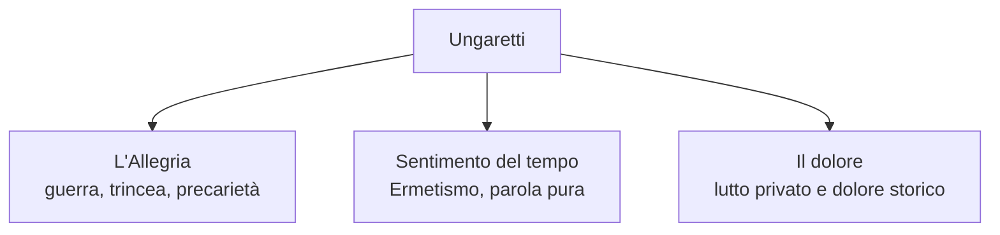

# Giuseppe Ungaretti — Ripasso veloce

---

## Coordinate da sapere subito

| | |
|---|---|
| **Date** | **1888-1970** |
| **Nasce** | Alessandria d'Egitto |
| **Muore** | Milano |
| **Padre** | Muore nei lavori legati a Suez quando Ungaretti è piccolo |
| **Madre** | Fornaia; gli garantisce un'ottima istruzione |
| **Luoghi** | Alessandria, Parigi, Carso/Isonzo, Roma, Brasile, Milano |
| **Formazione** | Parigi, Sorbona, Apollinaire, avanguardie, Futurismo, Lacerba |
| **Guerra** | Interventista, volontario, trincea sul Carso/Isonzo |
| **Opera complessiva** | *Vita d'un uomo* |

---

## Cronologia minima

| Anno | Cosa succede |
|------|--------------|
| **1888** | Nasce ad Alessandria d'Egitto |
| **1912 circa** | Parigi: Sorbona, Apollinaire, avanguardie |
| **1915** | Prime poesie su **Lacerba**; arruolamento volontario |
| **1916** | ***Il porto sepolto*** |
| **1919** | ***Allegria di naufragi*** |
| **1923** | *Il porto sepolto* con prefazione di Mussolini |
| **1928** | Conversione religiosa |
| **1931** | ***L'Allegria*** |
| **Anni Trenta** | ***Sentimento del tempo***, Ermetismo |
| **1936-1942** | Brasile |
| **1947** | ***Il dolore*** |
| **1970** | Muore; ***Vita d'un uomo*** |

---

## Tre fasi poetiche

| Fase | Raccolte | Temi | Stile |
|------|----------|------|-------|
| **1. Guerra / Allegria** | *Il porto sepolto*, *Allegria di naufragi*, *L'Allegria* | Trincea, precarietà, dolore, attaccamento alla vita, fratellanza | Versicoli, parola-verso, punteggiatura assente, titolo verso zero |
| **2. Ermetica** | *Sentimento del tempo* | Tempo, religiosità, parola pura, lontananza dalla storia | Più tradizionale, ritorno all'endecasillabo, maggiore oscurità |
| **3. Dolore** | *Il dolore* | Lutto privato e dolore collettivo, Seconda guerra mondiale | Lingua più vicina al parlato ma ancora intensa e simbolica |

---

## Poetica in 6 parole chiave

| Parola | Spiegazione da interrogazione |
|--------|-------------------------------|
| **Porto sepolto** | Luogo profondo e misterioso: il poeta vi scende e riporta alla luce la poesia |
| **Segreto** | La poesia è vera quando conserva un segreto |
| **Parola essenziale** | La guerra impone un linguaggio ridotto al vocabolo, carico di valore |
| **Parola impotente** | Non dice mai tutto il mistero: lo avvicina soltanto |
| **Titolo verso zero** | Il titolo completa il testo e dà la chiave di lettura |
| **Silenzio** | Il bianco della pagina è parte della poesia: parola = suono, bianco = silenzio |

---

## Stile: elenco secco

- **Versicoli**: versi molto brevi.
- **Parola-verso**: una parola occupa un verso intero.
- **Punteggiatura assente o selezionata**: influenza futurista.
- **Verso libero** nella prima fase.
- **Date e luoghi**: funzione diaristica.
- **Analogia**: collega elementi lontani.
- **Fonosimbolismo**: il suono rafforza il senso.
- **Ossimoro**: "nulla d'inesauribile segreto", "corolla di tenebre".
- **Adynaton**: figura dell'impossibile, es. "Cessate d'uccidere i morti".

---

## Testi: scheda rapida

| Testo | Da dire |
|-------|---------|
| ***Il porto sepolto*** | Dichiarazione di poetica: il poeta scende nel mistero e torna con i canti; resta un segreto inesauribile |
| ***Veglia*** | Notte accanto al compagno massacrato; dalla morte nasce l'attaccamento alla vita |
| ***Fratelli*** | Fratellanza dei soldati; parola tremante, foglia appena nata, fragilità comune |
| ***I fiumi*** | Autobiografia per fiumi: Serchio, Nilo, Senna, Isonzo; "docile fibra dell'universo" |
| ***Sono una creatura*** | Pietra del San Michele; pianto invisibile; "La morte si sconta vivendo" |
| ***San Martino del Carso*** | Paese distrutto e cuore straziato; il cuore conserva i morti |
| ***Soldati*** | Soldati come foglie d'autunno: precarietà assoluta |
| ***Mattina*** | "M'illumino / d'immenso": illuminazione e massima essenzialità |
| ***Non gridate più*** | Monito contro guerra e rancore; ascoltare il sussurro dei morti |

---

## *I fiumi*: fiumi e significato

| Fiume | Significato |
|-------|-------------|
| **Serchio** | Origini familiari lucchesi |
| **Nilo** | Infanzia ad Alessandria d'Egitto |
| **Senna** | Parigi, formazione, conoscenza di sé |
| **Isonzo** | Guerra, trincea, momento in cui tutto si ricompone |

Frase chiave: **"docile fibra dell'universo"**. Nel luogo della guerra il poeta si riconosce parte dell'universo.

---

## Documentario 11/05: cosa usare come testimonianza

| Elemento | Perché serve |
|----------|--------------|
| Ungaretti in video | Esistono testimonianze dirette: voce, volto, lettura dei testi |
| *Sono una creatura* recitata | Conferma il legame tra poesia e guerra vissuta |
| Poesia = segreto | Ungaretti dice che la poesia porta in sé un segreto |
| Pezzetti di carta | Le poesie dell'Allegria nascono in trincea, su materiali di fortuna |
| **Moammed Sceab / Marcel** | Tema dello sradicamento e dell'identità perduta |
| **Apollinaire** | Rapporto personale e modello poetico |
| Guerra | Definita "l'atto più bestiale dell'uomo" |
| Limatura | Poesie brevissime possono richiedere mesi di lavoro |
| Parola impotente | La parola non dice mai tutto il segreto |

---

## Collegamenti pronti

| Collegamento | Come farlo |
|--------------|------------|
| **Futurismo** | Punteggiatura abolita, verso libero, Lacerba; ma Ungaretti non esalta la guerra |
| **Apollinaire** | Parigi, calligrammi, pagina come spazio moderno |
| **Pascoli** | Analogia, fonosimbolismo, vita/morte; in *Non gridate più* erba e morti |
| **D'Annunzio** | In *I fiumi* natura personificata, ma niente superuomo: Ungaretti è docile |
| **Ermetismo** | *Sentimento del tempo*, parola pura, oscurità, nessi non espliciti |
| **Fascismo** | Vicinanza formale; *Il porto sepolto* 1923 con Mussolini; poi poesia lontana dalla storia |

---

## Domande da interrogazione

### 1. Spiega la biografia di Ungaretti attraverso i luoghi.

Risposta: Alessandria è nascita, infanzia, Nilo e porto sepolto; Parigi è Sorbona, Apollinaire e avanguardie; Carso/Isonzo è guerra e trincea; Roma è il dopoguerra, il rapporto con il fascismo e la conversione; Brasile è insegnamento e lutto del figlio; Milano è la morte e *Vita d'un uomo*.

### 2. Perché *Il porto sepolto* è una dichiarazione di poetica?

Risposta: perché definisce il poeta come colui che scende nel mistero dell'essere, torna alla luce con i suoi canti e li consegna agli uomini. Però il mistero resta inesauribile: la parola poetica lo avvicina, non lo esaurisce.

### 3. Cosa cambia tra *L'Allegria* e *Sentimento del tempo*?

Risposta: *L'Allegria* è legata alla guerra e usa versicoli, parola-verso, frammentazione e diario. *Sentimento del tempo* è più ermetico, più oscuro, recupera forme tradizionali come l'endecasillabo e si allontana dalla storia.

### 4. Qual è il senso di *Veglia*?

Risposta: davanti al compagno massacrato, nella massima presenza della morte, il poeta scopre un attaccamento disperato alla vita. La morte non annulla la vita: la rende più evidente.

### 5. Qual è il messaggio di *Non gridate più*?

Risposta: dopo le guerre, continuare odio e rancore significa uccidere di nuovo i morti, cioè tradirli. Bisogna tacere le grida della guerra per ascoltare il loro sussurro e arrivare alla pacificazione.

---

## Errori da evitare

- Dire che Ungaretti è solo ermetico: **solo una fase** è propriamente legata all'Ermetismo.
- Confondere Futurismo e Ungaretti: riprende alcune forme, ma rifiuta l'esaltazione della guerra.
- Dimenticare la vicenda editoriale: **1916 Porto sepolto, 1919 Allegria di naufragi, 1931 L'Allegria**.
- Dimenticare il documentario: segreto, pezzetti di carta, parola impotente, guerra come atto bestiale.
- Scrivere accenti sbagliati: **è**, **perché**, **così**, **sì**.
