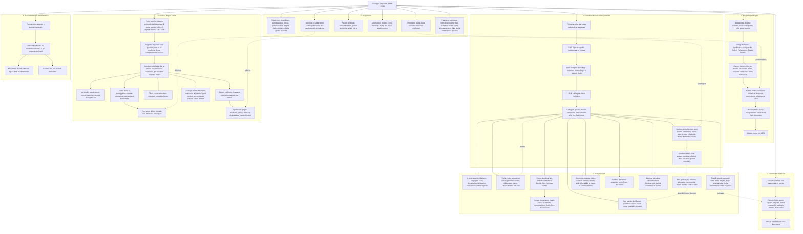

```mermaid
flowchart TD
    U["Giuseppe Ungaretti (1888-1970)"]

    subgraph S1["1. Coordinate essenziali"]
        C0["Chiave di lettura: vita trasformata in poesia"]
        C1["Parole chiave: porto sepolto, segreto, parola essenziale, analogia, silenzio, fratellanza"]
        C2["Opera complessiva: Vita d'un uomo"]
    end

    subgraph S2["2. Biografia per luoghi"]
        L1["Alessandria d'Egitto: nascita, porto cosmopolita, Nilo, porto sepolto"]
        L2["Parigi: Sorbona, Apollinaire, avanguardie, Soffici, Palazzeschi, Papini, Lacerba"]
        L3["Carso e Isonzo: trincea, dolore, precarietà, morte, scoperta della vita e della fratellanza"]
        L4["Roma: ritorno, vicinanza formale al fascismo, conversione religiosa nel 1928"]
        L5["Brasile (1936-1942): insegnamento e morte del figlio Antonietto"]
        L6["Milano: morte nel 1970"]
    end

    subgraph S3["3. Vicenda editoriale e fasi poetiche"]
        F0["Prima raccolta: percorso editoriale progressivo"]
        F1["1916: Il porto sepolto - nucleo nato in trincea"]
        F2["1919: Allegria di naufragi - ossimoro tra naufragio e slancio vitale"]
        F3["1931: L'Allegria - titolo definitivo"]
        P1["L'Allegria: guerra, trincea, precarietà, attaccamento alla vita, fratellanza"]
        P2["Sentimento del tempo: anni Trenta, Ermetismo, parola pura, tempo, religiosità, ritorno dell'endecasillabo"]
        P3["Il dolore (1947): lutto privato e dolore collettivo della Seconda guerra mondiale"]
    end

    subgraph S4["4. Poetica, lingua e stile"]
        PO1["Porto sepolto: mistero profondo dell'esistenza; il poeta scende, sfiora il segreto e torna con i canti"]
        PO2["Segreto: la poesia vale quando porta in sé qualcosa di non completamente dicibile"]
        PO3["Impotenza della parola: la parola non esaurisce l'interiorità, perciò viene isolata e limata"]
        ST1["Versicoli e parola-verso: concentrazione estrema del significato"]
        ST2["Verso libero e punteggiatura ridotta: rottura metrica e sintassi frantumata"]
        ST3["Titolo come verso zero: orienta e completa il testo"]
        ST4["Bianco e silenzio: lo spazio vuoto diventa parte del senso"]
        ST5["Analogia, fonosimbolismo, ossimoro, adynaton: figure centrali per accostare lontani, suono e limite"]
        FU["Futurismo: debito formale, non adesione ideologica"]
        AP["Apollinaire: pagina moderna, pause, bianco e disposizione visiva dei versi"]
    end

    subgraph S5["5. Testi principali"]
        T1["Il porto sepolto: Mariano, 29 giugno 1916; dichiarazione di poetica; nulla d'inesauribile segreto"]
        T2["Veglia: notte accanto al compagno massacrato; dalla morte nasce l'attaccamento alla vita"]
        T3["Fratelli: parola tremante nella notte; fragilità, foglia appena nata, rivolta involontaria contro la guerra"]
        T4["I fiumi: autobiografia simbolica attraverso Serchio, Nilo, Senna e Isonzo"]
        T4a["Isonzo: immersione rituale, acqua tra morte e rigenerazione, docile fibra dell'universo"]
        T5["Sono una creatura: pietra del San Michele, dolore arido e invisibile; la morte si sconta vivendo"]
        T6["San Martino del Carso: paese distrutto e cuore come luogo più straziato"]
        T7["Soldati: precarietà assoluta, come foglie d'autunno"]
        T8["Mattina: massima concentrazione, illuminazione, parola essenziale e bianco"]
        T9["Non gridate più: Il dolore; adynaton, memoria dei morti, silenzio contro l'odio"]
    end

    subgraph S6["6. Documentario e testimonianza"]
        D1["Poesia come segreto e parola impotente"]
        D2["Testi nati in trincea su materiali di fortuna e poi lungamente limati"]
        D3["Moammed Sceab / Marcel: figura dello sradicamento"]
        D4["Guerra: atto più bestiale dell'uomo"]
    end

    subgraph S7["7. Collegamenti"]
        K1["Futurismo: verso libero, punteggiatura ridotta, parola isolata, pagina visiva; distacco dalla guerra esaltata"]
        K2["Apollinaire: calligrammi come spinta verso una pagina poetica moderna"]
        K3["Pascoli: analogia, fonosimbolismo, parola simbolica, vita e morte"]
        K4["D'Annunzio: fusione con la natura in I fiumi, ma senza superomismo"]
        K5["Ermetismo: parola pura, oscurità, nessi non esplicitati"]
        K6["Fascismo: vicinanza formale al regime; fase ermetica anche come allontanamento dalla storia e resistenza passiva"]
    end

    U --> C0
    C0 --> C1
    C1 --> C2

    U --> L1
    L1 --> L2 --> L3 --> L4 --> L5 --> L6

    U --> F0
    F0 --> F1 --> F2 --> F3
    F3 --> P1 --> P2 --> P3

    U --> PO1
    PO1 --> PO2 --> PO3
    PO3 --> ST1
    PO3 --> ST2
    PO3 --> ST3
    PO3 --> ST4
    PO3 --> ST5
    ST2 --> FU
    ST4 --> AP

    P1 --> T1
    P1 --> T2
    P1 --> T3
    P1 --> T4
    T4 --> T4a
    P1 --> T5
    P1 --> T6
    P1 --> T7
    P1 --> T8
    P3 --> T9

    U --> D1
    D1 --> D2
    D2 --> D3
    D2 --> D4

    U --> K1
    U --> K2
    U --> K3
    U --> K4
    U --> K5
    U --> K6

    K1 -. "chiarisce" .-> FU
    K2 -. "rafforza" .-> AP
    K5 -. "si collega a" .-> P2
    K6 -. "problematizza" .-> L4
    T9 -. "riprende il tema dei morti" .-> T6
    T2 -. "mostra" .-> P1
    T3 -. "sviluppa" .-> C1
```
