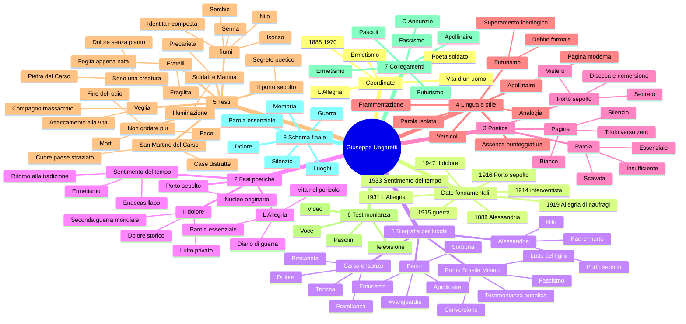

# Schema mentale stampabile — Giuseppe Ungaretti

Schema unico e compatto, disposto nello stesso ordine del `riassunto.md`.

```mermaid
mindmap
  root((Giuseppe Ungaretti))
    Coordinate
      1888 1970
      Poeta soldato
      L Allegria
      Ermetismo
      Vita d un uomo
    Date fondamentali
      1888 Alessandria
      1914 interventista
      1915 guerra
      1916 Porto sepolto
      1919 Allegria di naufragi
      1931 L Allegria
      1933 Sentimento del tempo
      1947 Il dolore
    1 Biografia per luoghi
      Alessandria
        Nilo
        Padre morto
        Porto sepolto
      Parigi
        Sorbona
        Apollinaire
        Avanguardie
        Futurismo
      Carso e Isonzo
        Trincea
        Dolore
        Precarieta
        Fratellanza
      Roma Brasile Milano
        Fascismo
        Conversione
        Lutto del figlio
        Testimonianza pubblica
    2 Fasi poetiche
      Porto sepolto
        Nucleo originario
      L Allegria
        Diario di guerra
        Vita nel pericolo
        Parola essenziale
      Sentimento del tempo
        Ritorno alla tradizione
        Ermetismo
        Endecasillabo
      Il dolore
        Seconda guerra mondiale
        Lutto privato
        Dolore storico
    3 Poetica
      Porto sepolto
        Segreto
        Mistero
        Discesa e riemersione
      Parola
        Essenziale
        Scavata
        Insufficiente
      Pagina
        Titolo verso zero
        Bianco
        Silenzio
    4 Lingua e stile
      Versicoli
      Frammentazione
      Assenza punteggiatura
      Analogia
      Parola isolata
      Futurismo
        Debito formale
        Superamento ideologico
      Apollinaire
        Pagina moderna
    5 Testi
      Il porto sepolto
        Segreto poetico
      Veglia
        Compagno massacrato
        Attaccamento alla vita
      Fratelli
        Fragilita
        Foglia appena nata
      I fiumi
        Nilo
        Serchio
        Senna
        Isonzo
        Identita ricomposta
      Sono una creatura
        Pietra del Carso
        Dolore senza pianto
      San Martino del Carso
        Case distrutte
        Cuore paese straziato
      Soldati e Mattina
        Precarieta
        Illuminazione
      Non gridate piu
        Morti
        Pace
        Fine dell odio
    6 Testimonianza
      Video
      Voce
      Televisione
      Pasolini
    7 Collegamenti
      Futurismo
      Apollinaire
      Pascoli
      D Annunzio
      Ermetismo
      Fascismo
    8 Schema finale
      Luoghi
      Guerra
      Parola essenziale
      Silenzio
      Dolore
      Memoria
```
