> Versione riscritta in Markdown dal PDF originale. Le timeline sono in blocchi `mermaid` veri, non tabelle.

# CAP 13: LA SECONDA GUERRA MONDIALE. TEMPO PRIMO (1939-41)

## 1. DA UNA GUERRA ALL’ALTRA

Democrazia contro totalitarismo: un nuovo conflitto mondiale
Più ancora del primo conflitto mondiale, la guerra che iniziò il 1° settembre 1939 con l’attacco
tedesco alla Polonia coinvolse un enorme numero di militari e civili ed ebbe gravi riflessi economici,
sociali, politici. Lo scontro scaturì dalla volontà revisionista degli equilibri fissati a Versailles da parte
di Germania, Italia e Giappone e fu alimentato dalla contrapposizione tra le ideologie apertamente
razziste di queste potenze e la liberal-democrazia. Si trattò, fin dal principio, di una guerra totale.

## 2. L'INIZIO DELLA GUERRA EUROPEA E IL FRONTE OCCIDENTALE (1939-1940)

L’inizio della guerra europea
Nel settembre 1939 Francia e Regno Unito si schierarono al fianco della Polonia, invasa dalla
Germania e dall’URSS alla luce di un piano segreto di spartizione. Nei mesi successivi l’URSS
annetté Estonia, Lituania e Lettonia, mentre la Germania attaccò i porti della Norvegia e la
Danimarca, per poi muovere, sul fronte occidentale, verso la Francia.
Il fronte occidentale e la caduta della Francia
Nella primavera del 1940 i tedeschi invasero Belgio, Olanda e Lussemburgo, violandone la neutralità,
per puntare su Parigi, secondo il piano di una «guerra-lampo» che prevedeva l’aggiramento della linea
Maginot. In giugno i tedeschi occuparono la capitale francese.
In seguito alla sua resa, la Francia fu divisa in due parti: la parte nord-occidentale veniva occupata
dalle truppe tedesche, mentre nel Sud-Est nasceva la Repubblica di Vichy, pure controllata dai nazisti.

## 3. L'ITALIA IN GUERRA: LE SCELTE POLITICHE E L'INGRESSO NEL CONFLITTO

Allo scoppio della guerra, l’Italia di Mussolini aveva dichiarato la non belligeranza; ma nove mesi più
tardi cambiò politica e, approfittando della situazione determinatasi oltralpe, occupò parte della
Francia sud-orientale.
La cronologia e le motivazioni della svolta:
- Settembre 1939 —>Dichiarazione di «non belligeranza»
  - Dettata dall'inadeguatezza delle Forze militari.
  - Rappresentava un tentativo di Mussolini di fare da pacificatore e ottenere comunque
vantaggi territoriali ed economici.
- 10 giugno 1940 —> Annuncio dell’ingresso in guerra
  - Dichiarata contro Francia e Gran Bretagna.
  - Mossi dall'obiettivo di una "guerra parallela", volta a ottenere il controllo dei Balcani
e del Mediterraneo, oltre al prestigio internazionale.

## 4. LA RESISTENZA DI LONDRA E LA STRATEGIA AMERICANA

Il ruolo dell’Inghilterra
L’Inghilterra, che dava rifugio a Charles de Gaulle, leader della «Francia Libera» in esilio, era da
tempo nei piani d’attacco di Hitler. Tuttavia, Londra e altre città inglesi furono bombardate nella
battaglia d’Inghilterra solo tra estate e autunno 1940. Il primo ministro Winston Churchill, che sapeva
di poter contare sull’aiuto dell’alleato americano Roosevelt, chiamò gli inglesi alla resistenza e riuscì
a impedire alla Germania lo sbarco.

La strategia americana
Oltre a fornire mezzi all’Inghilterra, gli Stati Uniti si mossero per proteggersi dal rischio di un attacco
tedesco attraverso l’Atlantico. Gli USA erano ormai pronti alla guerra quando nell’agosto del 1941,
presso la baia di Terranova in Canada, firmarono con il Regno Unito la Carta Atlantica, testo
fondativo del futuro ordine mondiale basato sul disarmo dei Paesi aggressori.

## 5. I FALLIMENTI MILITARI DI MUSSOLINI E LA FINE DELLA "GUERRA

PARALLELA" (1940-1941)
Tra l’autunno del 1940 e l’estate del 1941 la guerra continuò nel Mediterraneo e nei Balcani, scenari
considerati secondari da Hitler ma centrali nelle ambizioni di Mussolini. Il Duce avviò infatti la sua
cosiddetta “guerra parallela”, condotta su due fronti ma contro un unico nemico: l’Impero britannico.
La propaganda di regime si concentrò sulla “perfida Albione”, nel tentativo di mobilitare una
popolazione poco entusiasta di un nuovo conflitto e di Forze armate mal equipaggiate e ancora meno
motivate.
La guerra italiana in Nord Africa
I piani
La prima grande direttrice offensiva italiana fu il Nord Africa. Oltre 200.000 uomini, guidati dal
generale Rodolfo Graziani, avrebbero dovuto avanzare dalla Libia verso l’Egitto con l’obiettivo di
conquistare Suez, spezzando in due l’Impero britannico e aprendo l’accesso ai campi petroliferi del
Medio Oriente.
I limiti tecnici
Nonostante la superiorità numerica rispetto ai circa 30.000 britannici presenti sul fronte, l’offensiva
italiana risultò fragile. Le truppe soffrivano gravi problemi di mobilità per la carenza di camion e
carburante, mentre i carri armati leggeri italiani erano nettamente inferiori ai blindati britannici, più
efficienti e meglio armati.
Il collasso e il soccorso tedesco
Tra gennaio e febbraio 1941 le forze britanniche, rafforzate da consistenti rinforzi arrivati via mare,
bloccarono le avanzate italiane e penetrarono in Libia fino a Tobruk e Bengasi. Di fronte al rischio che
Londra ottenesse il controllo del Mediterraneo, Hitler intervenne inviando in Nord Africa un
contingente guidato dal feldmaresciallo Erwin Rommel, l’Afrika Korps. Da quel momento fino al
1943 il fronte nordafricano divenne teatro di lunghe offensive e controffensive, nelle quali il ruolo
italiano risultò sempre più marginale.
La rapida fine dell’impero italiano in Africa orientale
Parallelamente si combatteva nel Corno d’Africa. Nel dicembre 1940 i britannici passarono
all’offensiva e nel giro di pochi mesi occuparono le colonie italiane di Eritrea, Somalia ed Etiopia,
completando la conquista nel maggio 1941. A soli cinque anni dalla sua proclamazione, l’Impero
italiano d’Africa cessava così di esistere. La guerra per Suez, che avrebbe dovuto consacrare l’Italia
come potenza vincitrice accanto alla Germania, si trasformò invece in una pesante umiliazione e nella
definitiva subordinazione al Terzo Reich.

La guerra italiana nei balcani
Sul fronte balcanico, già dalla fine dell’estate del 1940, Mussolini aveva pianificato in segreto
l’invasione della Grecia partendo dall’Albania, annessa all’Italia nel 1939 dopo essere stata a lungo un
protettorato. Convinto di poter “spezzare le reni” alla Grecia in poche settimane, il Duce voleva
soprattutto dimostrare a Hitler l’indipendenza strategica dell’Italia. Il 28 ottobre 1940, anniversario
della marcia su Roma, le truppe italiane attraversarono il confine greco senza che l’alleato tedesco
fosse stato informato.
Il fallimento e l’intervento della Wehrmacht
L’offensiva si arenò quasi subito a causa del terreno montuoso e delle condizioni climatiche
sfavorevoli. In poche settimane l’avanzata si trasformò in una difficile difesa dell’Albania, mentre le
forze greche passarono al contrattacco. La campagna di Grecia segnò il fallimento definitivo delle
ambizioni balcaniche italiane. Anche in questo caso intervenne la Germania per evitare il collasso
dell’alleato: nell’aprile 1941 la Wehrmacht attaccò la Jugoslavia, per impedirne il passaggio al campo
nemico, e la Grecia, sostenuta dai britannici. In pochi giorni Belgrado e Atene furono occupate.
Le conseguenze dei fallimenti italiani
Il doppio insuccesso in Nord Africa e nei Balcani segnò l’inizio della crisi irreversibile del regime
fascista. Le Forze armate italiane si dimostrarono del tutto inadeguate alla guerra moderna e, ai vertici
militari, cominciò a diffondersi una crescente critica all’avventurismo di Mussolini, condivisa anche
da ambienti di corte e da settori del fascismo stesso. La popolazione, intanto, sperimentava
direttamente i sacrifici di una guerra sempre più disastrosa e percepita come priva di prospettive.
Appariva ormai evidente che l’Italia fosse ridotta a semplice satellite della Germania. Le iniziative del
Duce crearono inoltre seri problemi allo stesso alleato tedesco, costretto a deviare risorse verso i fronti
meridionali, distogliendole dall’obiettivo principale dell’attacco all’URSS. Mussolini si rivelava così
più un peso che una risorsa per Hitler. Più in generale, l’alleanza tra Italia, Germania e Giappone
mostrava tutta la sua debolezza strategica, incapace di coordinare obiettivi comuni e caratterizzata da
priorità divergenti tra i tre Paesi.

## 6. L’INVASIONE TEDESCA DELL’UNIONE SOVIETICA (1941-1942)

La fine della non belligeranza Germania-URSS
Al principio dell’estate del 1941 Hitler ordinò l’invasione dell’Unione Sovietica (operazione
Barbarossa), con il supporto di reparti italiani (CSIR) e degli alleati minori. L’URSS fu colta di
sorpresa e subì un attacco in profondità che non risparmiò Leningrado, posta sotto assedio, e sfiorò
Mosca. Ma i sovietici, seppur impegnati anche a est contro il Giappone, riuscirono a resistere nella
«grande guerra patriottica».
Dall’assedio al contrattacco
Solo nell’inverno 1941-42 vi fu la svolta: l’avanzata tedesca venne fermata anche grazie alla tecnica
della «terra bruciata» e Leningrado uscì dall’assedio. Forte delle truppe prima impegnate sul fronte
russo-giapponese, in fase di chiusura per l’imminente attacco giapponese agli Stati Uniti, l’Armata
Rossa passò al contrattacco, dando inizio a una nuova fase del conflitto.

## 7. LA GUERRA DI HITLER E LO STERMINIO DEGLI EBREI

Dai ghetti allo sterminio

La persecuzione degli ebrei, prima chiusi in appositi ghetti nelle città conquistate, si intensificò con
l’invasione del territorio russo, dove assunse le caratteristiche di uno sterminio di massa. Durante la
loro avanzata, le forze tedesche procedettero all’identificazione degli ebrei tra i civili e alla loro
esecuzione immediata, dapprima mediante fucilazione, poi con il ricorso al gas Zyklon B.
La «soluzione finale» e l’internamento nei lager
Lo sterminio fu sistematicamente realizzato a partire dal gennaio del 1942, dopo l’ordine, dato nella
Conferenza di Wannsee, di eseguire la «soluzione finale»: ai campi di concentramento già esistenti si
aggiunsero campi di sterminio. Nei lager aperti perlopiù in Polonia, tra cui quello di Auschwitz,
furono così inviati, insieme a rom e altri individui giudicati «inferiori», milioni di ebrei deportati
dall’Europa occupata.
Il flusso di deportati ebbe diversa intensità a seconda della provenienza e variò nel tempo in funzione
dell’andamento del conflitto. Prima dell’eliminazione finale, gli internati nei lager venivano assegnati
al lavoro forzato, con l’eccezione dei prigionieri inabili al lavoro, subito avviati alle camere a gas. Si
calcola che il numero complessivo degli ebrei sterminati sia compreso tra i 5 e i 6 milioni, una quota
altissima degli ebrei non fuggiti in tempo.

---

## Timeline Mermaid - Capitolo 13

```mermaid
timeline
    title CAP 13 - Seconda guerra mondiale, tempo primo (1939-1941)

    1 settembre 1939 : Germania attacca la Polonia
                      : Inizio della Seconda guerra mondiale
                      : Guerra totale, militare e civile

    Settembre 1939 : Francia e Regno Unito si schierano con la Polonia
                   : Italia dichiara la non belligeranza
                   : Germania e URSS dividono la Polonia

    1939-1940 : URSS annette Estonia, Lettonia e Lituania
              : Germania attacca Danimarca e Norvegia
              : Hitler prepara il fronte occidentale

    Primavera 1940 : Germania invade Belgio, Olanda e Lussemburgo
                    : Aggiramento della linea Maginot
                    : Strategia della guerra-lampo

    Giugno 1940 : I tedeschi occupano Parigi
                : La Francia si arrende
                : Nasce la Repubblica di Vichy

    10 giugno 1940 : Mussolini annuncia l'ingresso in guerra dell'Italia
                   : Guerra contro Francia e Gran Bretagna
                   : Obiettivo: Balcani, Mediterraneo e prestigio internazionale

    Estate-autunno 1940 : Battaglia d'Inghilterra
                         : Londra e altre città vengono bombardate
                         : Churchill guida la resistenza britannica
                         : Hitler non riesce a sbarcare in Inghilterra

    Autunno 1940 : Mussolini avvia la guerra parallela
                 : Propaganda contro la perfida Albione
                 : Italia combatte nel Mediterraneo e nei Balcani

    28 ottobre 1940 : Italia invade la Grecia dall'Albania
                    : Mussolini vuole dimostrare autonomia da Hitler
                    : L'offensiva italiana si blocca

    Dicembre 1940 : Britannici passano all'offensiva in Africa orientale
                  : Inizia la perdita delle colonie italiane

    Gennaio-febbraio 1941 : Fallimento italiano in Nord Africa
                           : Britannici avanzano fino a Tobruk e Bengasi
                           : Hitler invia Rommel e l'Afrika Korps

    Aprile 1941 : Germania interviene nei Balcani
                : Wehrmacht attacca Jugoslavia e Grecia
                : Belgrado e Atene vengono occupate

    Maggio 1941 : Fine dell'Impero italiano in Africa orientale
                : Britannici occupano Eritrea, Somalia ed Etiopia
                : L'Italia dipende sempre di più dalla Germania

    Agosto 1941 : Stati Uniti e Regno Unito firmano la Carta Atlantica
                : Roosevelt e Churchill progettano il futuro ordine mondiale
                : Gli USA si avvicinano alla guerra

    Estate 1941 : Hitler lancia l'Operazione Barbarossa
                : Germania invade l'Unione Sovietica
                : Partecipano anche reparti italiani come il CSIR

    1941 : Tedeschi assediano Leningrado
         : Avanzata tedesca arriva vicino a Mosca
         : URSS resiste nella grande guerra patriottica

    Inverno 1941-1942 : Avanzata tedesca fermata
                       : I sovietici usano la terra bruciata
                       : Armata Rossa passa al contrattacco

    1941-1942 : Persecuzione degli ebrei nei territori occupati
              : Dai ghetti si passa allo sterminio di massa
              : Fucilazioni, gas e campi di sterminio
```

---

# CAP 14: LA SECONDA GUERRA MONDIALE. TEMPO SECONDO (1941-45)

## 1. L'AMPLIAMENTO DEL CONFLITTO: L'ATTACCO A PEARL HARBOR E L'ENTRATA

DEGLI USA (1941)
Da una guerra all’altra: democrazia contro totalitarismo – Nuovi fronti e svolte decisive nel
conflitto
Pearl Harbor
Nel 1941, dopo la conquista dell’Indocina francese, il Giappone era soggetto a embargo da parte
statunitense; quest’arma di pressione doveva servire a impedire nuove iniziative belliche. Tuttavia alla
fine dell’anno il Giappone decise di attaccare e prese di mira proprio gli Stati Uniti a Pearl Harbor,
nelle Hawaii, provocando enormi danni alla flotta americana. Si apriva così un nuovo fronte di guerra
nel Pacifico.
Il conflitto si allarga
Con l’entrata nel conflitto degli Stati Uniti, a cui Germania e Italia, alleate del Giappone, dichiararono
a loro volta guerra, lo scenario bellico si ampliò. La Germania intendeva coinvolgere il Giappone in
una manovra a tenaglia che isolasse l’URSS e indebolisse l’Impero britannico, ma dovette desistere
per via della nuova guerra nel Pacifico. Ma qui, a lungo andare, gli Stati Uniti ebbero modo di
mostrare la propria superiorità militare e logistica.
Le prime sconfitte dell’Asse nel Pacifico e in Africa
Mentre la flotta giapponese veniva fermata nel Pacifico e poi sconfitta a Guadalcanal (febbraio 1943),
le forze italo-tedesche, dopo la battaglia di El-Alamein in Egitto, retrocedevano di centinaia di
chilometri, ritirandosi anche dalla Libia. Sempre in Africa, tra il 1942 e il 1943 gli americani
sbarcarono in Marocco e Algeria, già appartenenti al regime di Vichy, e ne presero il controllo.

La disfatta dell’Asse a Stalingrado
Concentrandosi sul Nord-Africa, gli Alleati avevano lasciato l’URSS sola ad affrontare i tedeschi in
Europa. Tuttavia, con le sole proprie forze, dopo la vittoria nella battaglia di Stalingrado (febbraio
1943), i sovietici poterono avviare una controffensiva che disperse anche i soldati italiani. Questa
nuova sconfitta dell’Asse accelerò il collasso militare dell’Italia, prima colpita da bombardamenti
aerei che alimentarono la crescente sfiducia verso il regime e poi invasa dagli anglo-americani in
Sicilia (10 luglio 1943).

## 2. IL CROLLO DEL FASCISMO E IL COLLASSO DELL’ITALIA

Il crollo del fronte interno
L’Italia fascista fu il primo Paese dell’Asse a crollare. Già dal 1942 il fronte interno iniziò a sfaldarsi,
a differenza di quanto accadde in Germania e in Giappone. La guerra aveva infatti mostrato tutte le
debolezze del regime fascista e del rapporto tra monarchia e fascismo. Le sconfitte militari nei
Balcani, in Africa e in Russia provocarono sfiducia e rassegnazione tra i soldati italiani, spesso male
equipaggiati e subordinati ai tedeschi. Inoltre la guerra arrivò direttamente nelle città italiane
attraverso i bombardamenti alleati: Genova, Torino e Milano furono colpite duramente già dal 1942,
mentre nel luglio 1943 anche Roma subì un pesante bombardamento che causò migliaia di vittime. Lo
scopo degli Alleati era spezzare il morale della popolazione e indebolire il legame con il regime
fascista.
La disastrosa ritirata di Russia
Nel 1943 iniziarono a diffondersi le notizie sulla tragica ritirata dell’ARMIR dopo la battaglia di
Stalingrado. Durante la ritirata nell’inverno russo morirono circa 25.000 soldati italiani e altri 70.000
furono fatti prigionieri. Questa sconfitta delegittimò completamente il regime. La popolazione,
provata dalla fame e dai bombardamenti, iniziò a criticare apertamente Mussolini e i gerarchi fascisti.
Anche il carisma del Duce crollò: i suoi discorsi non suscitavano più entusiasmo ma rabbia e sfiducia.
Mussolini comprese che il progetto fascista era fallito: dopo vent’anni di dittatura non era riuscito a
creare una popolazione realmente fascista e pronta alla guerra permanente.
I movimenti ai vertici dello Stato e nella società
Nel 1943 iniziarono anche i primi tentativi di contatto con gli Alleati da parte di ambienti militari e
della monarchia. L’obiettivo era evitare una rivoluzione comunista nel caso di una sconfitta totale.
Contemporaneamente cresceva il malcontento popolare. Il 5 marzo 1943 gli operai della Fiat di
Torino organizzarono il primo grande sciopero dopo diciotto anni di regime fascista. Questo episodio
segnò l’inizio di una nuova opposizione al fascismo e preparò il terreno alla futura Resistenza. La
maggior parte degli italiani però non era ancora antifascista in modo consapevole: molti
semplicemente avevano perso fiducia nel regime e non capivano più il senso della guerra.
Lo sbarco in Sicilia
Gli Alleati capirono che l’Italia era il punto debole dell’Asse. Per questo Churchill spinse per
l’invasione della Penisola, considerata il “ventre molle” del sistema nazifascista. Il 10 luglio 1943 gli
angloamericani sbarcarono in Sicilia. L’esercito italiano e quello tedesco non riuscirono a fermare

l’avanzata alleata e nel giro di poche settimane persero il controllo dell’isola. Molti italiani accolsero
gli Alleati non come invasori, ma come liberatori dalla guerra e dal fascismo. Nel frattempo Mussolini
cercò di convincere Hitler a permettere all’Italia di uscire dal conflitto, ma il Führer rispose inviando
nuove truppe tedesche nella Penisola, pronto a occupare l’Italia in caso di tradimento.
Il colpo di Stato del 25 luglio 1943
Di fronte alla crisi ormai evidente, una parte dei gerarchi fascisti decise di eliminare Mussolini per
salvare il regime e la monarchia. Nella notte tra il 24 e il 25 luglio 1943 il Gran Consiglio del
fascismo approvò l’ordine del giorno presentato da Dino Grandi, che restituiva al re il comando
supremo delle forze armate. Il giorno successivo Vittorio Emanuele III fece arrestare Mussolini e
nominò capo del governo il maresciallo Pietro Badoglio. La popolazione accolse con entusiasmo la
caduta del Duce, sperando che la guerra fosse finita. In realtà Badoglio annunciò subito che “la guerra
continua”, perché il nuovo governo voleva negoziare segretamente un armistizio con gli Alleati.
I “45 giorni” e l’armistizio
Dopo la caduta di Mussolini seguirono circa quarantacinque giorni di forte incertezza. Gli Alleati
continuarono a bombardare le città italiane mentre avanzavano nella Penisola. Il 3 settembre 1943 il
governo Badoglio firmò in segreto l’armistizio di Cassibile con gli angloamericani. Tuttavia la notizia
venne resa pubblica solo l’8 settembre, quando il generale Eisenhower annunciò ufficialmente la resa
italiana. La sera stessa Badoglio comunicò via radio la cessazione delle ostilità contro gli Alleati,
senza però indicare chiaramente la Germania come nuovo nemico.
L’8 settembre 1943 e il caos dell’Italia
Dopo l’annuncio dell’armistizio lo Stato italiano crollò rapidamente. Il re, il governo e la corte
abbandonarono Roma e si rifugiarono a Brindisi sotto la protezione alleata. L’esercito rimase senza
ordini: molti soldati si sbandarono, altri tentarono una resistenza improvvisata contro i tedeschi.
Alcuni episodi furono particolarmente drammatici, come il massacro della Divisione Acqui a
Cefalonia. I tedeschi occuparono rapidamente gran parte dell’Italia e catturarono centinaia di migliaia
di militari italiani, deportandoli nei campi di prigionia in Germania. Altri soldati decisero invece di
unirsi alla Resistenza armata contro l’occupazione nazista, dando inizio alla guerra di liberazione
italiana.

## 3. LA GUERRA IN ITALIA (1943.45)

L’occupazione tedesca e l’Italia divisa in due
L’occupazione tedesca e la nascita della RSI
Dopo l’8 settembre 1943 i tedeschi occuparono rapidamente gran parte dell’Italia, mentre gli Alleati
erano sbarcati solo nel Sud della Penisola. Il 12 settembre un commando tedesco liberò Mussolini
dalla prigionia sul Gran Sasso. Hitler gli impose di guidare un nuovo Stato fascista dipendente dalla
Germania: la Repubblica Sociale Italiana (RSI), chiamata anche Repubblica di Salò, dal nome della
località sul lago di Garda dove aveva sede il governo. La RSI controllava circa due terzi dell’Italia,
mentre alcune zone del Nord-Est furono direttamente annesse al Reich tedesco. Nel frattempo il Sud
era controllato dagli Alleati e dal governo del re, mentre il fronte tedesco si fermò lungo la Linea
Gustav, una poderosa linea difensiva che attraversava la Penisola da ovest a est e aveva il suo punto

centrale a Montecassino. L’Italia risultava quindi divisa in due: a sud il Regno del Sud sostenuto dagli
Alleati, a nord la Repubblica Sociale Italiana controllata dai tedeschi.
La Repubblica di Salò
Nella RSI i tedeschi trattavano i fascisti italiani con diffidenza e consideravano l’Italia un alleato
traditore. Mussolini stesso era ormai privo di reale potere politico e viveva quasi come un prigioniero.
Nonostante questo, la Repubblica di Salò cercò di organizzarsi come uno Stato vero e proprio: aveva
un esercito guidato da Rodolfo Graziani, una polizia, una burocrazia e un nuovo partito, il Partito
Fascista Repubblicano (PFR). Molti italiani continuarono a combattere al fianco dei tedeschi fino al

## 1945. Accanto ai militari agirono anche gruppi violenti e collaborazionisti, spesso responsabili di

repressioni e torture contro antifascisti e partigiani.
Lo sterminio degli ebrei in Italia
La RSI aderì pienamente alla politica razziale nazista, aggravando ulteriormente le leggi razziali del

## 1938. I tedeschi organizzarono le deportazioni degli ebrei verso i campi di sterminio, ma la polizia

italiana collaborò agli arresti e alla raccolta dei deportati. Uno dei principali campi di raccolta fu
quello di Fossoli, vicino a Carpi, in Emilia. A Trieste la Risiera di San Sabba venne trasformata in un
campo di detenzione e uccisione dotato anche di forno crematorio. Il 16 ottobre 1943 avvenne il
rastrellamento del ghetto di Roma: oltre mille ebrei furono deportati e solo pochissimi sopravvissero.
Complessivamente circa 10.000 ebrei italiani furono uccisi durante la Shoah. Tuttavia molti italiani,
insieme a istituzioni cattoliche e religiose, aiutarono gli ebrei a nascondersi e a salvarsi dalla
deportazione.
Il Regno del Sud e il governo Badoglio
Il governo Badoglio, sostenuto dal re Vittorio Emanuele III, dichiarò guerra alla Germania il 13
ottobre 1943 e diventò cobelligerante degli Alleati. L’obiettivo della monarchia era recuperare
credibilità politica e presentarsi come alleata degli angloamericani dopo vent’anni di collaborazione
con il fascismo. Churchill appoggiava questa soluzione perché temeva che un’Italia instabile potesse
favorire l’espansione del comunismo nel Mediterraneo.
La nascita del CLN
Dopo anni di clandestinità tornarono sulla scena i partiti antifascisti, che il 9 settembre 1943
formarono il Comitato di Liberazione Nazionale (CLN).
Il CLN riuniva:
- comunisti;
- socialisti;
- liberali;
- Democrazia Cristiana;
- Partito d’Azione;
- Partito Democratico del Lavoro.

Il suo obiettivo era coordinare la lotta politica e militare contro tedeschi e fascisti. Tra tutte le forze
politiche il Partito Comunista Italiano (PCI) ebbe un ruolo particolarmente importante grazie alla sua
organizzazione e alla capacità di mobilitare militanti e combattenti.
La “svolta di Salerno”
Nel 1944 Palmiro Togliatti, segretario del PCI rientrato dall’URSS, promosse la cosiddetta “svolta di
Salerno”. I comunisti decisero di collaborare temporaneamente con la monarchia e con Badoglio per
concentrare tutte le forze contro il nazismo, rinunciando almeno momentaneamente alla prospettiva
rivoluzionaria. Grazie a questo compromesso i partiti antifascisti entrarono nel nuovo governo
Badoglio nell’aprile 1944, mentre Vittorio Emanuele III promise di trasferire i propri poteri al figlio
Umberto dopo la liberazione di Roma.
La Resistenza partigiana
Dopo l’8 settembre nacque il movimento partigiano, formato da soldati sbandati, antifascisti, giovani
renitenti alla leva e cittadini contrari all’occupazione tedesca. I comunisti organizzarono le Brigate
Garibaldi, ma parteciparono alla Resistenza anche gruppi cattolici, socialisti, azionisti e liberali. Per
molti partigiani comunisti la lotta contro il fascismo doveva trasformarsi anche in una rivoluzione
sociale, ma Togliatti cercò di mantenere il movimento sotto controllo per evitare uno scontro diretto
con gli Alleati.
La guerra in Italia nel 1944
Nel 1944 gli Alleati riuscirono a sfondare la Linea Gustav e il 4 giugno liberarono Roma.
Successivamente avanzarono verso Firenze e il Nord. Durante la ritirata i tedeschi compirono
numerose stragi contro la popolazione civile italiana, spesso con l’aiuto dei fascisti repubblicani. Tra
le più terribili vi furono:
- la strage di Sant’Anna di Stazzema;
- la strage di Marzabotto;
- l’eccidio delle Fosse Ardeatine a Roma.
Queste violenze avevano lo scopo di colpire i partigiani e terrorizzare la popolazione.
Il proclama Alexander e l’inverno 1944-45
Nell’autunno del 1944 l’avanzata alleata si fermò davanti alla Linea Gotica, costruita dai tedeschi
sull’Appennino tosco-emiliano. Il comandante alleato Alexander invitò allora i partigiani a sospendere
le grandi operazioni militari e a passare alla difensiva. Gli Alleati infatti diffidavano dei partigiani,
soprattutto di quelli comunisti, e temevano che potessero provocare rivoluzioni politiche nel Nord
Italia. Seguì un inverno molto duro, segnato da fame, bombardamenti e repressioni nazifasciste.
La liberazione e la fine della guerra in Italia
Nella primavera del 1945 gli Alleati e i partigiani ripresero l’offensiva finale. Tra il 23 e il 25 aprile il
CLN proclamò l’insurrezione generale nelle città del Nord, mentre l’esercito tedesco era ormai vicino
al collasso. Mussolini tentò di fuggire verso la Svizzera, ma fu catturato dai partigiani vicino a Dongo

sul lago di Como il 27 aprile 1945. Il giorno seguente venne fucilato insieme a Claretta Petacci e ad
altri gerarchi fascisti. Il 2 maggio 1945 le truppe tedesche in Italia si arresero ufficialmente.
Il significato della Resistenza
La Resistenza italiana fu contemporaneamente una guerra di liberazione contro i tedeschi e una guerra
civile tra italiani fascisti e antifascisti. Le formazioni partigiane ebbero un ruolo molto importante:
arrivarono a contare oltre 200.000 combattenti e contribuirono in modo decisivo alla liberazione del
Nord Italia. Tuttavia la maggioranza della popolazione cercò soprattutto di sopravvivere alla fame, ai
bombardamenti e alla violenza della guerra. La caduta del fascismo lasciò l’Italia profondamente
divisa e pose un problema fondamentale: ricostruire uno Stato democratico dopo il crollo della
monarchia, del regime fascista e dell’unità nazionale costruita nei decenni precedenti.

## 4. L’AGONIA E LA FINE DEL TERZO REICH (1943-1945)

La Conferenza di Teheran (1943)
In difficoltà sul fronte est e sud, nel 1943 i tedeschi avevano ancora posizioni solide nel nord
Atlantico. Nell’autunno di quell’anno Stalin, che da tempo sollecitava uno sbarco alleato in quell’area,
incontrò Churchill e Roosevelt nella Conferenza di Teheran per costituire un’alleanza bellica contro le
forze dell’Asse e intavolare un dialogo sui futuri assetti geopolitici.
La Germania nella tenaglia: lo sbarco in Normandia e l'avanzata sovietica
Maturò così il progetto dello sbarco in Normandia che, a costo di ingenti perdite, consentì agli
angloamericani lo sfondamento e l’avanzata in territorio francese, fino alla liberazione di Parigi (24
agosto 1944). Intanto la controffensiva sovietica proseguì nella Polonia occidentale, raggiungendo i
lager nazisti (il campo di Auschwitz venne liberato il 27 gennaio 1945). Nella Polonia liberata, Stalin
promosse la creazione di uno Stato-fantoccio subordinato a Mosca.
La Conferenza di Jalta e la resa tedesca (1945)
In una nuova conferenza tenuta nel febbraio 1945 a Jalta, i leader di URSS, Stati Uniti e Gran
Bretagna definirono la spartizione dei territori del Reich. Ai sovietici si lasciò mano libera per l’ultima
avanzata fino alla capitolazione tedesca. Hitler si tolse la vita il 29 aprile in un bunker sotto il
Reichstag; pochi giorni dopo, i plenipotenziari dell’esercito firmarono la resa davanti a ufficiali delle
tre potenze.

## 5. LA FINE DEL GIAPPONE E DELLA GUERRA

L’avanzata americana nel Pacifico
Nel Pacifico le forze statunitensi avanzarono conquistando via via gli arcipelaghi occupati dal
Giappone; per colpire la flotta americana, l’aviazione giapponese impiegò piloti suicidi (kamikaze).
Fallita la presa dell’India e la distruzione delle basi aeree americane nella Cina nazionalista, il
Giappone subì attacchi aerei sempre più frequenti e vicini al cuore dell’impero.
Le battaglie decisive tra Stati Uniti e Giappone

Il Giappone andò incontro alla sconfitta per le gravissime perdite subite e le carenze logistiche e di
rifornimenti. Le ultime battaglie che determinarono la disfatta ebbero luogo a Iwo Jima e Okinawa tra
marzo e giugno 1945. Il nuovo presidente americano Harry Truman, subentrato a Roosevelt morto in
aprile, cercò un modo per portare il Giappone alla capitolazione e infine decise di impiegare l’arma
messa a punto nell’ambito del «progetto Manhattan».
La bomba atomica di Hiroshima e Nagasaki e la capitolazione finale
All’inizio di agosto due bombe atomiche furono lanciate su Hiroshima e Nagasaki; le due città
vennero rase al suolo, circa 130.000 furono le vittime, 100.000 i feriti. Solo dopo questa immane
catastrofe, il Giappone accettò la resa, firmata il 2 settembre 1945 sulla corazzata MacArthur nella
baia di Tokyo.

---

## Timeline Mermaid - Capitolo 14

```mermaid
timeline
    title CAP 14 - Seconda guerra mondiale, tempo secondo (1941-1945)

    Fine 1941 : Giappone attacca Pearl Harbor
              : Gli Stati Uniti entrano in guerra
              : Si apre il fronte del Pacifico

    Gennaio 1942 : Conferenza di Wannsee
                 : Decisione della soluzione finale
                 : Lo sterminio degli ebrei diventa sistematico

    1942 : Fronte interno italiano inizia a crollare
         : Bombardamenti alleati su Genova, Torino e Milano
         : Cresce sfiducia verso il fascismo

    1942-1943 : Americani sbarcano in Marocco e Algeria
              : Gli Alleati prendono il controllo del Nord Africa francese
              : L'Asse arretra in Africa

    Febbraio 1943 : Giappone sconfitto a Guadalcanal
                  : Svolta nel Pacifico
                  : Superiorita logistica americana sempre piu evidente

    Febbraio 1943 : Vittoria sovietica a Stalingrado
                  : Germania subisce una sconfitta decisiva
                  : I sovietici iniziano la controffensiva

    1943 : Disastrosa ritirata italiana dalla Russia
         : ARMIR distrutta dopo Stalingrado
         : Migliaia di soldati italiani morti o prigionieri
         : Crolla il prestigio di Mussolini

    5 marzo 1943 : Sciopero degli operai Fiat a Torino
                 : Primo grande sciopero dopo anni di regime
                 : Segnale di crisi sociale e politica

    10 luglio 1943 : Sbarco alleato in Sicilia
                   : Italia vista come ventre molle dell'Asse
                   : Molti italiani vedono gli Alleati come liberatori

    Luglio 1943 : Bombardamento di Roma
                : Gli Alleati puntano a spezzare il morale italiano
                : Il regime fascista e sempre piu delegittimato

    24-25 luglio 1943 : Gran Consiglio del Fascismo vota contro Mussolini
                      : Dino Grandi restituisce poteri militari al re
                      : Vittorio Emanuele III fa arrestare Mussolini

    25 luglio 1943 : Badoglio diventa capo del governo
                   : La popolazione spera nella fine della guerra
                   : Badoglio dichiara che la guerra continua

    3 settembre 1943 : Armistizio di Cassibile firmato in segreto
                     : Governo Badoglio tratta con gli Alleati
                     : L'Italia prepara l'uscita dalla guerra contro gli angloamericani

    8 settembre 1943 : Armistizio reso pubblico
                     : Stato italiano crolla
                     : Re e governo fuggono a Brindisi
                     : Esercito lasciato senza ordini

    9 settembre 1943 : Nasce il CLN
                     : Partiti antifascisti coordinano lotta politica e militare
                     : Inizia l'organizzazione della Resistenza

    12 settembre 1943 : Tedeschi liberano Mussolini dal Gran Sasso
                      : Hitler impone la nascita della RSI
                      : Nasce la Repubblica Sociale Italiana o Repubblica di Salo

    13 ottobre 1943 : Governo Badoglio dichiara guerra alla Germania
                    : Regno del Sud diventa cobelligerante degli Alleati
                    : Italia divisa tra Sud alleato e Nord occupato

    1943-1944 : Occupazione tedesca del Centro-Nord
              : RSI collabora con i nazisti
              : Deportazioni, repressione e guerra civile

    Autunno 1943 : Conferenza di Teheran
                 : Stalin, Churchill e Roosevelt coordinano la guerra
                 : Si prepara lo sbarco in Normandia

    1944 : Svolta di Salerno
         : Togliatti accetta collaborazione temporanea con monarchia e Badoglio
         : I partiti antifascisti entrano nel governo

    4 giugno 1944 : Liberazione di Roma
                  : Alleati superano la Linea Gustav
                  : Avanzata verso Firenze e Nord Italia

    6 giugno 1944 : Sbarco in Normandia
                  : Gli angloamericani aprono il fronte occidentale
                  : Germania presa tra ovest alleato ed est sovietico

    24 agosto 1944 : Liberazione di Parigi
                   : Avanzata alleata in Francia
                   : Il Reich comincia a essere schiacciato

    1944 : Stragi nazifasciste in Italia
         : Fosse Ardeatine, Sant'Anna di Stazzema, Marzabotto
         : Terrore contro civili e partigiani

    Autunno 1944 : Avanzata alleata si ferma sulla Linea Gotica
                 : Proclama Alexander
                 : Partigiani invitati a sospendere grandi operazioni

    27 gennaio 1945 : Liberazione di Auschwitz
                    : Avanzata sovietica raggiunge i lager nazisti
                    : Emergono le prove dello sterminio

    Febbraio 1945 : Conferenza di Jalta
                  : USA, URSS e Gran Bretagna discutono il dopoguerra
                  : Si definiscono gli assetti dopo la caduta del Reich

    Primavera 1945 : Offensiva finale in Italia
                   : Alleati e partigiani avanzano nel Nord
                   : Il CLN prepara l'insurrezione

    23-25 aprile 1945 : Insurrezione generale nel Nord Italia
                      : CLN chiama alla liberazione
                      : Crolla il controllo nazifascista

    27 aprile 1945 : Mussolini catturato a Dongo
                   : Tentativo di fuga verso la Svizzera fallito

    28 aprile 1945 : Mussolini viene fucilato
                   : Fine politica del fascismo repubblicano

    29 aprile 1945 : Hitler si suicida a Berlino
                   : Terzo Reich ormai distrutto

    2 maggio 1945 : Truppe tedesche in Italia si arrendono
                  : Fine della guerra in Italia

    Maggio 1945 : Resa della Germania
                : Fine della guerra in Europa

    Marzo-giugno 1945 : Battaglie di Iwo Jima e Okinawa
                       : Giappone subisce perdite enormi
                       : USA si avvicinano al cuore dell'impero giapponese

    Agosto 1945 : Bombe atomiche su Hiroshima e Nagasaki
                : Distruzione delle citta
                : Il Giappone accetta la resa

    2 settembre 1945 : Resa ufficiale del Giappone
                     : Fine della Seconda guerra mondiale
```

---

# CAP 15: LA GUERRA FREDDA: LO SCONTRO IN EUROPA (1945-1961)

L’ERA DELLA GUERRA FREDDA (1945-1989)
Gli incontri per disegnare il dopoguerra
Nel corso della Seconda guerra mondiale, gli Alleati si confrontarono sui principi che avrebbero
dovuto guidare il nuovo ordine internazionale e sui mezzi necessari per garantire relazioni pacifiche
dopo il conflitto. Dopo la firma della Carta Atlantica nel 1941 tra Stati Uniti e Gran Bretagna, le
conferenze di Teheran (1943) e Jalta (1945) definirono i nuovi equilibri mondiali in vista della fine
della guerra. In questo contesto si affermò soprattutto la volontà americana di promuovere il modello
liberal-democratico e il libero scambio. Parallelamente si avviò la ricostruzione delle relazioni
economiche e politiche internazionali attraverso la creazione di nuove istituzioni. Con gli Accordi di
Bretton Woods (1944) nacquero il Fondo Monetario Internazionale, incaricato di garantire la stabilità
dei cambi monetari, e la Banca Mondiale, destinata a sostenere la ricostruzione e lo sviluppo dei Paesi
in difficoltà. Nel 1947 venne inoltre creato il GATT (General Agreement on Tariffs and Trade), con
l’obiettivo di favorire la riduzione delle barriere doganali e la liberalizzazione del commercio
mondiale. Nel 1945, con la Conferenza di San Francisco, fu infine fondata l’Organizzazione delle
Nazioni Unite (ONU), composta dall’Assemblea generale degli Stati membri e dal Consiglio di
Sicurezza, formato da cinque membri permanenti e dieci a rotazione.
L’INIZIO DELLA GUERRA FREDDA E LA QUESTIONE TEDESCA
La contrapposizione USA-URSS
Dopo la guerra, l’alleanza tra Stati Uniti e Unione Sovietica si dissolse rapidamente a causa delle
profonde differenze ideologiche e geopolitiche tra le due potenze. Gli Stati Uniti consolidarono la
propria influenza sull’Europa occidentale, dando vita nel 1949 alla NATO (Organizzazione del
Trattato dell’Atlantico del Nord). L’URSS, invece, mirava a mantenere e rafforzare il proprio
controllo sull’Europa orientale. L’Europa venne così divisa in due blocchi contrapposti dalla
cosiddetta “cortina di ferro”, che separava il mondo occidentale da quello sovietico.
La Germania divisa
La Germania divenne il primo grande punto di frattura della guerra fredda. Dopo il conflitto, il
territorio tedesco era stato suddiviso in quattro zone d’occupazione controllate da URSS, Stati Uniti,

Gran Bretagna e Francia. Con l’aggravarsi della contrapposizione tra Est e Ovest, questa situazione si
trasformò nella divisione della Germania e di Berlino in due aree di influenza. Nel 1949 nacquero:
- la Repubblica Federale Tedesca (RFT) a ovest;
- la Repubblica Democratica Tedesca (RDT) a est.
Il blocco di Berlino
Prima della divisione definitiva, la Germania fu teatro di una grave crisi internazionale. Nel 1948 le
potenze occidentali introdussero una nuova moneta, il marco, nella loro zona, favorendo la ripresa
economica della Germania occidentale. In risposta, l’URSS tentò di isolare Berlino Ovest con il
blocco di Berlino, interrompendo tutti i collegamenti terrestri. Gli Stati Uniti reagirono organizzando
un imponente ponte aereo che garantì i rifornimenti alla città, costringendo infine i sovietici a ritirare
il blocco.
I due blocchi e la guerra fredda
Tra Stati Uniti e Unione Sovietica si consolidò una condizione di tensione permanente, definita guerra
fredda, che ebbe nell’Europa il suo principale teatro di confronto. Nel 1955 l’URSS rispose alla
NATO con la creazione del Patto di Varsavia, un’alleanza militare tra i Paesi socialisti dell’Europa
orientale. Si definirono così due blocchi contrapposti:
- il blocco occidentale guidato dagli Stati Uniti;
- il blocco orientale guidato dall’Unione Sovietica.
L’“IMPERO” SOVIETICO E L’EUROPA A GUIDA AMERICANA
I nuovi regimi dell’est
Fino alla morte di Stalin nel 1953, l’URSS consolidò la propria egemonia nell’Europa centro-orientale
anche attraverso interventi politici e militari diretti. In Polonia, nel 1947, venne imposto un regime
“sovietizzato”; in Cecoslovacchia, nel 1948, i comunisti presero il potere con un colpo di Stato; in
Albania si instaurò un regime comunista legato a Mosca. Diversa fu la situazione della Jugoslavia,
dove il regime comunista di Tito prese progressivamente le distanze dall’URSS, mantenendo una
linea autonoma.
Il Piano Marshall e la collaborazione in Europa
Dal 1947 gli Stati Uniti adottarono la strategia del “contenimento” del comunismo per impedire
l’espansione sovietica in Europa. Da questa politica nacque il Piano Marshall, un vasto programma di
aiuti economici che mise a disposizione circa 13 miliardi di dollari per la ricostruzione europea.
Questo intervento favorì la rapida ripresa economica dell’Europa occidentale e rafforzò i legami con
gli Stati Uniti. Parallelamente si sviluppò anche il progetto di integrazione europea: i Paesi occidentali
diedero vita prima alla CECA (1950) e poi alla Comunità Economica Europea (CEE, 1955), segnando
l’inizio del processo di unificazione europea.

---

## Timeline Mermaid - Capitolo 15

```mermaid
timeline
    title CAP 15 - Guerra fredda: scontro in Europa (1945-1961)

    1941 : Carta Atlantica
         : Stati Uniti e Regno Unito immaginano il nuovo ordine mondiale
         : Principi di cooperazione e disarmo dei Paesi aggressori

    1943 : Conferenza di Teheran
         : USA, URSS e Gran Bretagna coordinano la guerra
         : Inizia la discussione sul futuro assetto europeo

    1944 : Accordi di Bretton Woods
         : Nascono Fondo Monetario Internazionale e Banca Mondiale
         : Ricostruzione economica del dopoguerra

    Febbraio 1945 : Conferenza di Jalta
                  : I vincitori discutono la sistemazione dell'Europa
                  : Si prepara il nuovo equilibrio mondiale

    1945 : Conferenza di San Francisco
         : Fondazione dell'ONU
         : Nascono Assemblea generale e Consiglio di Sicurezza

    1945 : Fine della Seconda guerra mondiale
         : L'alleanza USA-URSS perde la sua ragione principale
         : Emergono differenze ideologiche e geopolitiche

    1945-1947 : Divisione dell'Europa in sfere d'influenza
              : USA guidano l'Europa occidentale
              : URSS controlla l'Europa orientale

    1947 : Strategia americana del contenimento
         : USA vogliono impedire l'espansione sovietica
         : Inizia la logica della Guerra fredda

    1947 : Piano Marshall
         : Aiuti economici americani all'Europa occidentale
         : Rafforzamento dei legami tra USA ed Europa occidentale

    1947 : Creazione del GATT
         : Riduzione delle barriere doganali
         : Liberalizzazione del commercio mondiale

    1947 : Polonia sovietizzata
         : URSS impone un regime legato a Mosca
         : Si consolida il blocco orientale

    1948 : Colpo di Stato comunista in Cecoslovacchia
         : Rafforzamento del controllo sovietico sull'Est Europa

    1948 : Blocco di Berlino
         : URSS isola Berlino Ovest
         : Interrotti collegamenti terrestri

    1948-1949 : Ponte aereo americano su Berlino
              : USA riforniscono Berlino Ovest dall'aria
              : URSS costretta a ritirare il blocco

    1949 : Nascita della NATO
         : Alleanza militare del blocco occidentale
         : Stati Uniti consolidano influenza sull'Europa occidentale

    1949 : Divisione della Germania
         : Nasce la Repubblica Federale Tedesca a ovest
         : Nasce la Repubblica Democratica Tedesca a est

    1950 : Nasce la CECA
         : Primo passo dell'integrazione europea
         : Cooperazione economica tra Paesi occidentali

    1953 : Morte di Stalin
         : Fine della fase staliniana piu dura
         : URSS ha ormai consolidato egemonia sull'Est Europa

    1955 : Patto di Varsavia
         : Risposta sovietica alla NATO
         : Alleanza militare dei Paesi socialisti orientali

    1955 : Nascita della CEE secondo il file
         : Prosegue l'integrazione dell'Europa occidentale
         : Occidente si organizza economicamente e politicamente

    1945-1961 : Europa divisa dalla cortina di ferro
              : Blocco occidentale guidato dagli Stati Uniti
              : Blocco orientale guidato dall'Unione Sovietica
              : Germania e Berlino sono il centro dello scontro
```

---

# Timeline Mermaid finale totale

```mermaid
timeline
    title Timeline totale - Dalla Seconda guerra mondiale alla Guerra fredda (1939-1961)

    1 settembre 1939 : Germania invade la Polonia
                      : Inizia la Seconda guerra mondiale

    Settembre 1939 : Francia e Regno Unito entrano in guerra contro la Germania
                   : Italia resta in non belligeranza
                   : Polonia divisa tra Germania e URSS

    1940 : Germania conquista Danimarca, Norvegia, Benelux e Francia
         : Nasce il regime di Vichy
         : Hitler domina gran parte dell'Europa occidentale

    10 giugno 1940 : Italia entra in guerra
                   : Mussolini punta su Mediterraneo e Balcani
                   : Inizia la guerra parallela italiana

    Estate-autunno 1940 : Battaglia d'Inghilterra
                         : Churchill resiste
                         : Hitler fallisce l'invasione dell'Inghilterra

    1940-1941 : Fallimenti italiani in Grecia, Nord Africa e Africa orientale
              : Germania deve aiutare l'Italia
              : Italia sempre piu subordinata a Hitler

    Estate 1941 : Operazione Barbarossa
                : Germania invade URSS
                : Leningrado assediata e Mosca minacciata

    Agosto 1941 : Carta Atlantica
                : Roosevelt e Churchill immaginano il nuovo ordine mondiale

    Inverno 1941-1942 : URSS ferma l'avanzata tedesca
                       : Terra bruciata e contrattacco sovietico
                       : Fallisce la vittoria rapida tedesca a est

    Fine 1941 : Pearl Harbor
              : Giappone attacca gli Stati Uniti
              : Gli USA entrano in guerra
              : Il conflitto diventa pienamente mondiale

    Gennaio 1942 : Conferenza di Wannsee
                 : Soluzione finale
                 : Sterminio sistematico degli ebrei

    1942 : Crisi del fronte interno italiano
         : Bombardamenti sulle citta
         : Soldati e popolazione perdono fiducia nel fascismo

    Febbraio 1943 : Stalingrado
                  : Grande vittoria sovietica
                  : Inizia il ripiegamento tedesco a est

    Febbraio 1943 : Guadalcanal
                  : Giappone fermato nel Pacifico
                  : USA iniziano a prevalere

    5 marzo 1943 : Sciopero Fiat a Torino
                 : Segnale della crisi sociale in Italia
                 : Si prepara il terreno della Resistenza

    10 luglio 1943 : Sbarco alleato in Sicilia
                   : Italia punto debole dell'Asse
                   : Crisi finale del fascismo

    25 luglio 1943 : Mussolini arrestato
                   : Badoglio al governo
                   : Il regime fascista crolla formalmente

    3 settembre 1943 : Armistizio di Cassibile
                     : Italia firma segretamente la resa con gli Alleati

    8 settembre 1943 : Annuncio dell'armistizio
                     : Crollo dello Stato italiano
                     : Fuga del re e del governo
                     : Inizio occupazione tedesca e Resistenza

    9 settembre 1943 : Nasce il CLN
                     : Antifascisti coordinano la lotta contro tedeschi e fascisti

    12 settembre 1943 : Mussolini liberato dai tedeschi
                      : Nasce la Repubblica Sociale Italiana
                      : Italia divisa in due

    Autunno 1943 : Conferenza di Teheran
                 : I grandi alleati preparano la fase finale della guerra
                 : Si progetta lo sbarco in Normandia

    1944 : Svolta di Salerno
         : Togliatti collabora con monarchia e Badoglio
         : Priorita alla guerra contro il nazifascismo

    4 giugno 1944 : Roma liberata
                  : Alleati sfondano la Linea Gustav
                  : Avanzata verso il Nord

    6 giugno 1944 : Sbarco in Normandia
                  : Germania attaccata anche da ovest
                  : Reich preso nella tenaglia alleata e sovietica

    24 agosto 1944 : Parigi liberata
                   : Germania perde il controllo della Francia

    Autunno 1944 : Linea Gotica
                 : Avanzata alleata rallenta in Italia
                 : Proclama Alexander ai partigiani

    27 gennaio 1945 : Auschwitz liberato
                    : Armata Rossa raggiunge i lager nazisti

    Febbraio 1945 : Conferenza di Jalta
                  : USA, URSS e Regno Unito discutono il dopoguerra
                  : Si profila la divisione dell'Europa

    23-25 aprile 1945 : Insurrezione del Nord Italia
                      : CLN e partigiani liberano le citta
                      : Crollo della RSI

    28 aprile 1945 : Mussolini fucilato
                   : Fine del fascismo repubblicano

    29 aprile 1945 : Hitler si suicida
                   : Fine politica del Terzo Reich

    2 maggio 1945 : Tedeschi in Italia si arrendono
                  : Fine della guerra in Italia

    Maggio 1945 : Germania si arrende
                : Fine della guerra in Europa

    Agosto 1945 : Hiroshima e Nagasaki
                : Bombe atomiche americane sul Giappone
                : Il Giappone accetta la resa

    2 settembre 1945 : Resa ufficiale del Giappone
                     : Fine della Seconda guerra mondiale

    1945 : Nasce l'ONU
         : Tentativo di costruire un ordine internazionale pacifico

    1945-1947 : Rottura tra USA e URSS
              : Fine dell'alleanza antifascista
              : Inizia la contrapposizione ideologica

    1947 : Contenimento e Piano Marshall
         : USA sostengono l'Europa occidentale
         : Obiettivo: fermare l'espansione comunista

    1947-1948 : Sovietizzazione dell'Est Europa
              : Polonia, Cecoslovacchia e altri Paesi entrano nell'orbita URSS
              : Si consolida la cortina di ferro

    1948-1949 : Blocco di Berlino e ponte aereo
              : Prima grande crisi della Guerra fredda
              : Berlino simbolo della divisione europea

    1949 : Nasce la NATO
         : Blocco occidentale guidato dagli Stati Uniti

    1949 : Germania divisa
         : RFT a ovest
         : RDT a est

    1950 : CECA
         : Primo passo verso integrazione europea occidentale

    1953 : Morte di Stalin
         : L'impero sovietico europeo resta saldo

    1955 : Patto di Varsavia
         : Blocco orientale guidato dall'URSS
         : Risposta alla NATO

    1955 : CEE secondo il file
         : Avanzamento dell'integrazione europea occidentale

    1945-1961 : Guerra fredda in Europa
              : Due blocchi contrapposti
              : Stati Uniti contro Unione Sovietica
              : Germania e Berlino al centro dello scontro
```

