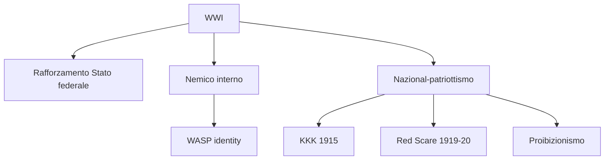
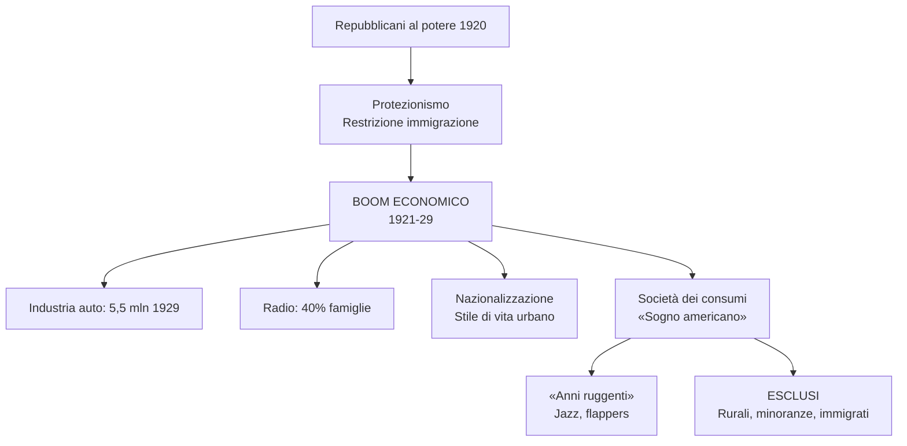
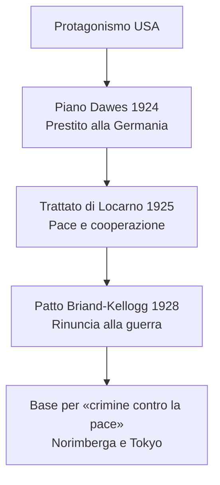
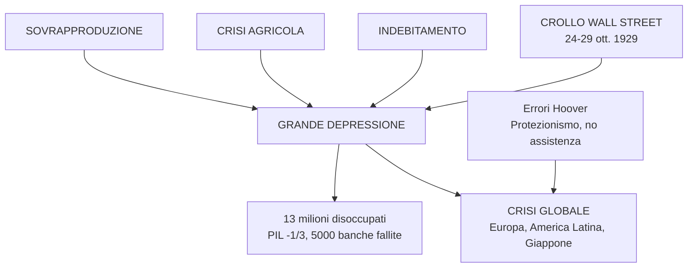
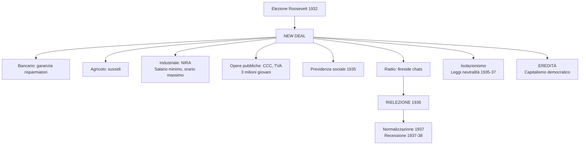
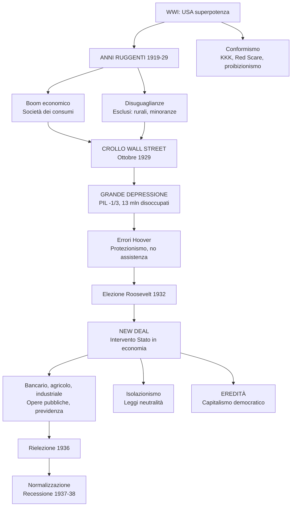
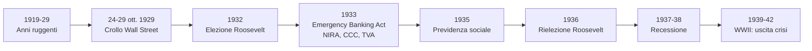

# Ripasso Veloce - Cap. 3.10: L'inizio del secolo americano: anni ruggenti, crisi e New Deal

---

## Date fondamentali

| Anno | Evento |
|------|--------|
| **1919-29** | **«Anni ruggenti»**: «sogno americano», società dei consumi |
| **1919** | XVIII emendamento: **proibizionismo** (vigore 1920, abrogato 1933) |
| **1915** | Rinascita **KKK** (ispirato dal film *The Birth of a Nation*) |
| **1919-20** | **Red Scare**: repressione movimento operaio |
| **1920** | Elezioni: vittoria **Harding** (repubblicano); donne al voto |
| **1924** | **Piano Dawes**: aiuti USA a Germania; immigrati ≤ **165.000/anno** |
| **1925** | **Trattato di Locarno**: Germania riconosce Versailles |
| **1928** | **Patto Briand-Kellogg**: rinuncia alla guerra |
| **24-29 ott. 1929** | **Crollo Wall Street** → **Grande Depressione** |
| **Nov. 1932** | Eletto **Roosevelt** (democratico) |
| **Mar. 1933** | *Emergency Banking Act*: garanzia risparmiatori |
| **Mag. 1933** | *Agricultural Adjustment Act*: sussidi agricoli |
| **Giu. 1933** | *NIRA*: diritti lavoratori; CCC e TVA: opere pubbliche |
| **1935** | **Previdenza sociale nazionale**: invalidità, disoccupazione, pensioni |
| **Nov. 1936** | **Rielezione Roosevelt** |
| **1935-37** | **Leggi neutralità**: isolazionismo USA |
| **1937-38** | Nuova recessione |

---

## 1. La guerra e le sue eredità

### Rafforzamento Stato federale e «nemico interno»

- **WWI**: USA = **superpotenza *ante litteram***; mobilitazione totale, coscrizione obbligatoria (4 milioni di uomini)
- **Stato federale** si rafforza: intervento in economia, industria bellica, ferrovie
- **Propaganda e censura**: «nemico interno» = pacifisti, tedesco-americani (10.000 internati)
- Identità nazionale: **WASP** (*White, Anglo-Saxon, Protestant*)

### KKK, Red Scare, proibizionismo

- **KKK (1915)**: violenze contro afroamericani, immigrati, ebrei, cattolici
- **Red Scare (1919-20)**: repressione movimento operaio, arresti di massa, deportazioni
  - Caso **Sacco e Vanzetti** (1921-27): due anarchici italiani condannati senza prove
- **Proibizionismo** (1919-1933): XVIII emendamento → traffici illegali, gangster (**Al Capone**)
- **Presidenza Wilson**: contraddittoria; donne al voto (1920), ma nessuna tutela afroamericani

---

## 2. Gli «anni ruggenti» e il «sogno americano»

### USA: potenza mondiale

- **Vincitori della guerra**: egemonia industriale e finanziaria; crediti all'estero > 10 miliardi $
- **Elezioni 1920**: vittoria **repubblicani** (Harding → Coolidge → Hoover)
- **Politiche**: protezionismo, restrizione immigrazione (350.000 → 165.000/anno), favore a grandi gruppi d'affari
- **Disuguaglianze**: 0,1% = 34% risparmio; 80% senza risparmio; 20% più ricco = 55% reddito nazionale

### Boom economico (1921-29)

| Indicatore | Valore |
|------------|--------|
| PIL | +**50%** |
| Produzione industriale | Quasi **raddoppiata** |
| Auto | Da 500.000 (1916) a **5,5 milioni** (1929); 1 auto ogni 6 abitanti |
| Radio | **40%** famiglie nel 1929 |
| Frigoriferi | Da 5.000 (1922) a quasi **1 milione** (1929) |

### Nazionalizzazione e società dei consumi

- **Radio**: lingua nazionale standardizzata
- **Automobile**: strade, infrastrutture, motel, pompe benzina
- Lavoratori agricoltura: da **41%** (1900) a **21%** (1929)
- Più di metà popolazione in città → **stile di vita urbano** ovunque

### «Sogno americano» e suoi esclusi

- **Sogno americano**: individualismo, pari opportunità, benessere, ascesa sociale
- **«Anni ruggenti»** (*Roaring Twenties*)
- **ESCLUSI**: aree rurali (agricoltura in crisi), minatori, settori tradizionali, minoranze, immigrati

### Vivacità culturale

- **Jazz**, **charleston**, ***flappers*** (donne anticonformiste: capelli corti, gonna corta, trucco)
- **«Lost generation»**: scrittori come **Hemingway**, **Fitzgerald** (soggiornano in Europa)

---

## 3. Il ruolo mondiale degli Stati Uniti

### Americanizzazione del mondo

- **Egemonia economica**: investimenti e prestiti all'estero
- **Riferimento globale**: modernità americana, film Hollywood
- **«Americanizzazione» del mondo** muove i primi passi

### Piano Dawes e patto Briand-Kellogg

- **Piano Dawes (1924)**: prestito alla Germania per risanare economia → «diplomazia del dollaro»
- **Trattato di Locarno (1925)**: Germania riconosce confini Versailles → pace e cooperazione
- **Patto Briand-Kellogg (1928)**:
  - Rinuncia alla guerra come strumento di politica nazionale
  - 63 firme entro 1939
  - Base per «**crimine contro la pace**» → processi di **Norimberga** e **Tokyo**

---

## 4. La crisi del 1929: da New York al mondo

### Il crollo di Wall Street

- **24 ottobre 1929** («Giovedì nero»): 12 milioni di azioni svendute
- **29 ottobre 1929** («Martedì nero»): 16 milioni di titoli svenduti
- **40 miliardi di perdite** entro fine anno (superiori alle riparazioni tedesche)
- Inizio della **Grande Depressione**

### Le cause profonde

| Causa | Descrizione |
|-------|-------------|
| **Sovrapproduzione industriale** | Esportazioni rallentate (ripreesa europea); mercato interno saturato (beni durevoli, disuguaglianze) |
| **Crisi agricola** | Calo prezzi; reddito coltivatori = 1/3 reddito medio; terre ipotecate |
| **Indebitamento collettivo** | Facile credito; mutui e rate; sistema bancario vulnerabile (piccoli istituti) |
| **Speculazione borsistica** | Crescita titoli senza aggancio all'economia reale |

### Il circolo vizioso

Crisi fiducia → ritiro risparmi → blocco crediti → contrazione consumi → riduzione produzione → calo prezzi agricoli → **fallimenti e disoccupazione**

### I numeri della crisi (1932)

| Indicatore | Valore |
|------------|--------|
| PIL | **-1/3** |
| Produzione industriale | **-50%** |
| Banche fallite | **> 5000** |
| Correntisti senza depositi | **9 milioni** |
| Imprese chiuse | **32.000** |
| Disoccupati | **~13 milioni** |
| Agricoltori persero la terra | **1/3** |

### Errori di Hoover

- **Liberismo**: risposta dalla sola iniziativa privata
- **No assistenza nazionale**: demandata a carità privata e governi locali
- **Protezionismo rigido** (1930): tariffe stratosferiche
- **Ritiro capitali dall'estero**: esportazioni **-60%** (1929-32)

### Crisi globale

- Germania interrompe pagamenti riparazioni
- Protezionismi a catena
- Isolamento economico
- **Prodotto della Grande guerra** e dei limiti di Versailles

---

## 5. Il *New Deal*

### Roosevelt e il nuovo patto

- **Elezioni 1932**: vittoria democratico **Franklin D. Roosevelt** (voto contro Hoover)
- ***New Deal*** («Nuovo corso/patto»):
  - Recuperare **fiducia e ottimismo**
  - **Ruolo dello Stato** deve crescere: protezione, riequilibrio reddito

### Le misure principali

| Settore | Provvedimento | Contenuto |
|---------|---------------|-----------|
| **Bancario** | *Emergency Banking Act* (9 mar. 1933) | Chiusura banche, controllo statale, garanzia piccoli risparmiatori |
| **Monetario** | Svalutazione dollaro | Politica inflazionistica per liquidità |
| **Agricolo** | *Agricultural Adjustment Act* (12 mag. 1933) | Sussidi per riduzione colture → prezzi risalgono |
| **Industriale** | *NIRA* (16 giu. 1933) | Codici concorrenza, **salario minimo**, **orario massimo**, diritti lavoratori |
| **Opere pubbliche** | *CCC* (mar. 1933), *TVA* (mag. 1933) | 3 milioni giovani impiegati; dighe, elettrificazione Tennessee |

### Previdenza sociale (1935)

- Sussidi di **invalidità** e **disoccupazione**
- **Pensioni di vecchiaia**
- Esclusi: braccianti agricoli e lavoratori domestici
- ***First lady* Eleanor Roosevelt**: sostenitrice politiche sociali e diritti civili afroamericani

### La comunicazione e la rielezione

- **Radio**: *fireside chats* («chiacchierate al caminetto») → Roosevelt entra nelle case
- **30 discorsi** tra 1933 e 1944
- Stile **informale, rassicurante, paternalista**
- **Leadership carismatica** anche in contesto democratico-liberale
- **Rielezione 1936**: vittoria larghissima (mandato a proseguire)

### Normalizzazione e opposizione

- Dal **1937**: New Deal si stabilizza, niente nuove spinte
- **Opposizione (~40%)**: Stato centrale estraneo alla tradizione liberale americana
- Accuse: flirt con **socialismo** o **corporativismo fascista**
- **Corte costituzionale**: alcuni provvedimenti (es. NIRA) giudicati illegittimi
- **Recessione 1937-38**: traballa fiducia

### Isolazionismo

- **Giugno 1933**: no partecipazione a Conferenza economica di Londra
- Scarso interesse per disarmo
- **Leggi neutralità (1935-37)**: divieto vendita armi a belligeranti
- **Spagna**: embargo durante guerra civile (1936-39)
- **Post-1938**: virata verso leadership mondiale

### L'eredità del New Deal

**Limiti**:
- Grande Depressione non superata
- Disoccupazione ancora alta
- Uscita dalla crisi solo con **mobilitazione industriale della Seconda guerra mondiale**

**Eredità**:
- Potere **autorità federale** accresciuto
- **«Presidenza personale»**: presidente = centro della politica nazionale
- **Svolta politica e culturale**: revisione rapporti Stato-cittadino
- **Modello di capitalismo democratico**: diritti individuali + tutela Stato, impresa privata + programmazione pubblica

---

## Schema riepilogativo

---

## Cronologia sintetica

