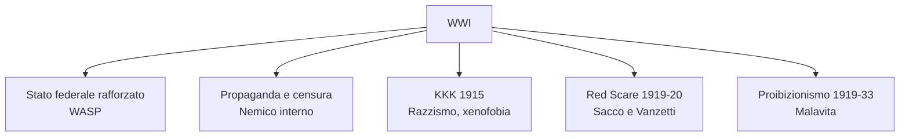
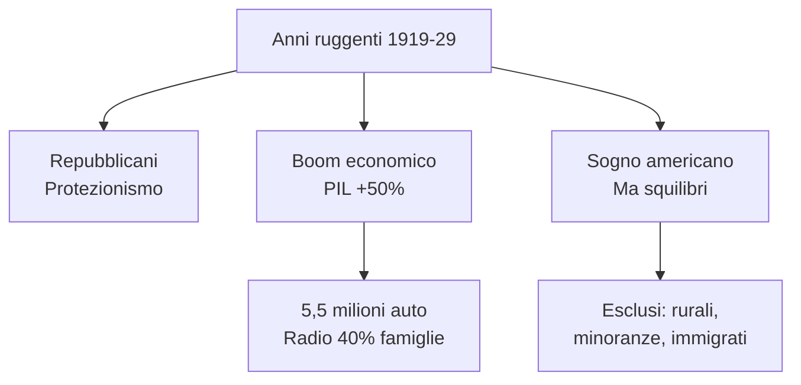
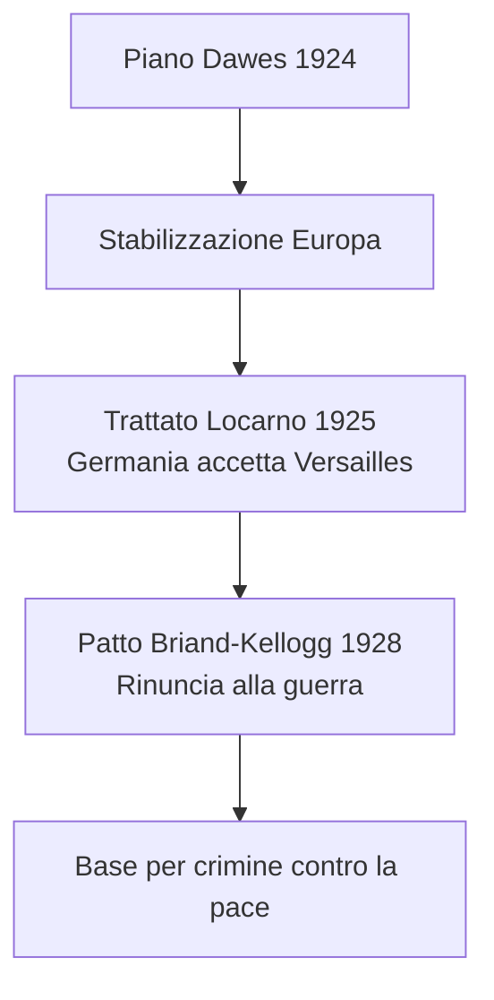
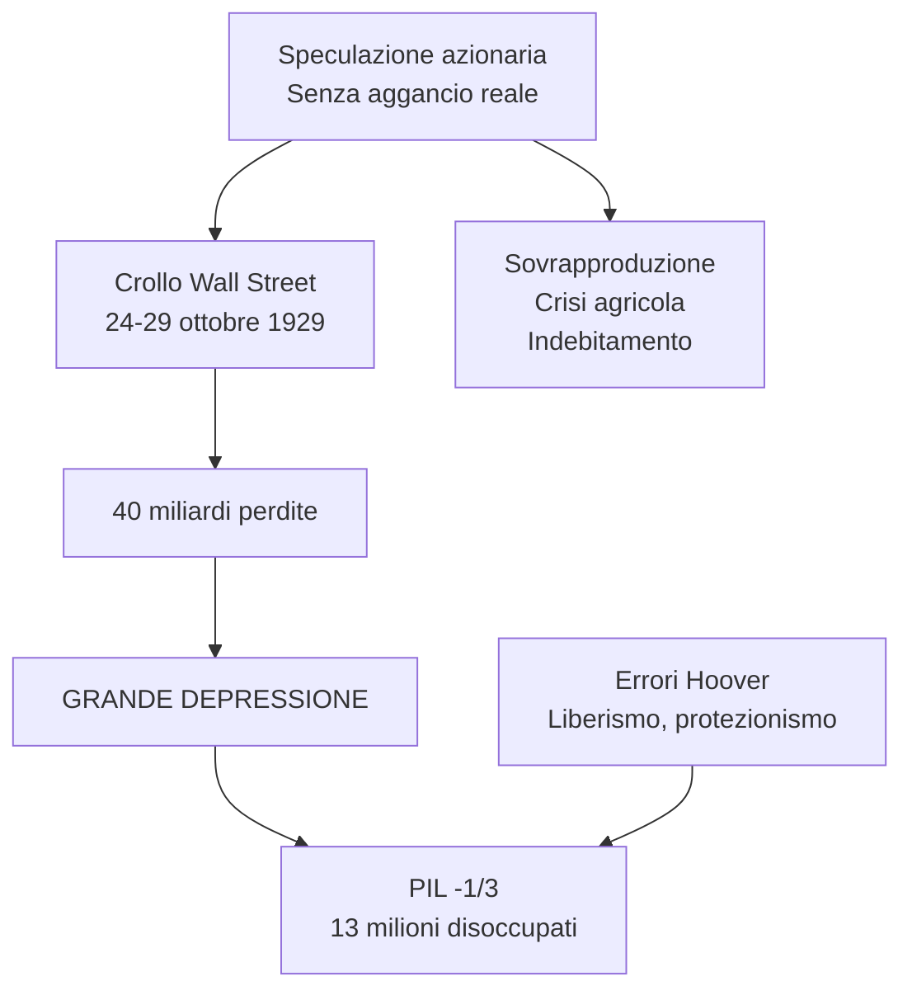
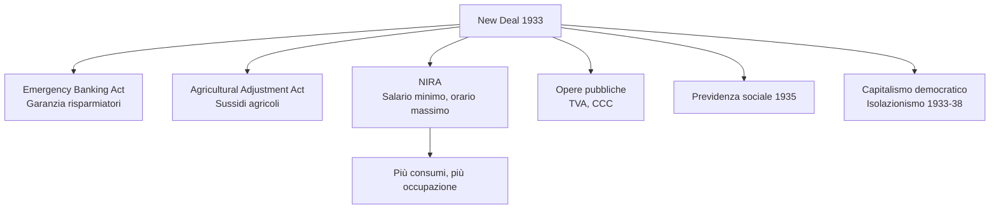
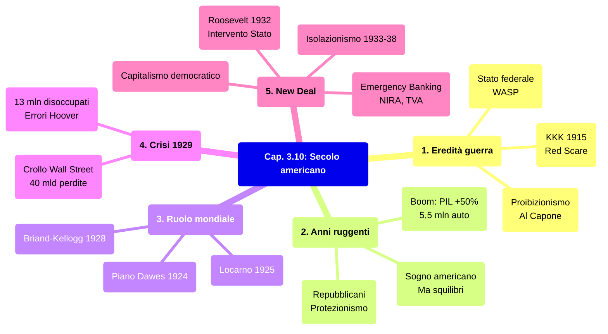

# Ripasso Veloce - Cap. 3.10: L'inizio del secolo americano: anni ruggenti, crisi e New Deal

---

## Date fondamentali

| Data | Evento |
|------|--------|
| **1915** | Rinascita del **Ku Klux Klan** |
| **1919** | XVIII emendamento: **proibizionismo**; **Red Scare** |
| **1920** | Donne al voto; elezione **Harding** (repubblicano) |
| **1924** | Piano **Dawes**; immigrazione limitata a **165.000/anno** |
| **1925** | Trattato di **Locarno** |
| **1928** | Patto **Briand-Kellogg** |
| **24-29 ottobre 1929** | Crollo di **Wall Street** |
| **1932** | Elezione di **Roosevelt** |
| **1933** | Inizio **New Deal**; fine proibizionismo |
| **1935-37** | Leggi sulla neutralità |
| **1936** | Rielezione di Roosevelt |

---

## 1. La guerra e le sue eredità

### Il rafforzamento dello Stato federale

- La WWI proiettò gli USA come **superpotenza** *ante litteram*
- **Coscrizione obbligatoria**: 4 milioni chiamati alle armi, 2 milioni in Europa
- Stato federale gestì: industria bellica, rete ferroviaria, approvvigionamenti
- L'identità nazionale si definì come **WASP** (*white, anglo-saxon, protestant*)

### Propaganda e «nemico interno»

- **Limitazione delle libertà** di opinione ed espressione
- Nemico interno = **pacifisti** + movimenti operai radicali
- **10.000 tedeschi-americani** internati come «stranieri nemici»

### Ku Klux Klan e razzismo

- **1915**: KKK rinato, ispirato al film *The Birth of a Nation*
- Bersagli: afroamericani, immigrati, ebrei, cattolici
- Simboli: cappuccio bianco, croce incendiata

### Red Scare (1919-20)

- **Paura rossa** dopo la rivoluzione bolscevica
- Anticomunismo + xenofobia → arresti di massa, deportazioni
- **Sacco e Vanzetti**: anarchici italiani condannati a morte senza prove (1921-27)

### Proibizionismo (1919-33)

- XVIII emendamento: divieto produzione, vendita, trasporto alcolici
- Conseguenza: **traffici illegali**, gangster come **Al Capone**

---

## 2. Gli «anni ruggenti» e il «sogno americano»

### USA: vincitori della guerra

- Crediti esteri: **oltre 10 miliardi di dollari**
- Egemonia economica, esportazioni di prodotti industriali

### Repubblicani al potere (1920-33)

- Harding → Coolidge → Hoover
- Abbandono internazionalismo wilsoniano
- **Protezionismo** + restrizione immigrazione

### Boom economico (1921-29)

- **PIL +50%**
- Produzione auto: 500.000 (1916) → **5,5 milioni** (1929)
- Elettrodomestici, radio: **40% famiglie** (1929)
- **Acquisti a rate** → società del consumo

| Indicatore | 1916 | 1929 |
|------------|------|------|
| Auto | 500.000 | 5,5 milioni |
| Radio nelle famiglie | — | 40% |

### Sogno americano: ma non per tutti

- Mito: individualismo, pari opportunità, ascesa sociale
- **Esclusi**: aree rurali, minatori, minoranze, afroamericani, immigrati
- Squilibri: 0,1% = 34% risparmio; 80% = nessun risparmio

---

## 3. Il ruolo mondiale degli Stati Uniti

### Americanizzazione del mondo

- Egemonia economica + investimenti all'estero + cinema Hollywood
- Obiettivo: pace stabile, ordine liberale, senza istituzioni sovranazionali

### Piano Dawes (1924)

- Prestito alla Germania per risanare l'economia
- Stabilizzazione Europa, détente Germania-Francia
- **«Diplomazia del dollaro»**

### Trattato di Locarno (1925)

- Germania riconosce confini di Versailles
- Pace e cooperazione internazionale

### Patto Briand-Kellogg (1928)

- **Rinuncia alla guerra** come strumento di politica nazionale
- 15 firmatari iniziali → 63 nel 1939
- Base per «crimine contro la pace» (Norimberga, Tokyo)

---

## 4. La crisi del 1929

### Crollo di Wall Street

- **24 ottobre**: 12 milioni azioni svendute
- **29 ottobre**: 16 milioni titoli svenduti
- **40 miliardi di dollari** di perdite

### Cause della Grande Depressione

| Settore | Problema |
|---------|----------|
| Industriale | Sovrapproduzione, mercato saturo |
| Agricolo | Calo prezzi, reddito = 1/3 media, debiti |
| Finanziario | Speculazione, indebitamento, banche vulnerabili |

### Dimensioni della crisi (1932)

- **PIL -1/3**
- **13 milioni** disoccupati
- **5000 banche** fallite
- **32.000 imprese** chiuse
- Crisi divenne **globale** (interdipendenze)

### Errori di Hoover

- Fedele al **liberismo**: interventi limitati, iniziativa privata
- **Protezionismo rigido** → esportazioni -60%
- 2 miliardi per banche/imprese → accusato di favore ai ricchi

---

## 5. Il New Deal

### Roosevelt eletto (1932)

- **Franklin Delano Roosevelt** (democratico)
- ***New Deal*** = «Nuovo patto Stato-cittadini»
- Recuperare fiducia; ruolo accresciuto dello Stato

### Misure principali

| Provvedimento | Data | Contenuto |
|---------------|------|-----------|
| Emergency Banking Act | 9 marzo 1933 | Controllo banche, garanzia risparmiatori |
| Agricultural Adjustment Act | 12 maggio 1933 | Sussidi per riduzione colture |
| NIRA | 16 giugno 1933 | Salario minimo, orario massimo, opere pubbliche |
| Civilian Conservation Corps | Marzo 1933 | 3 milioni giovani in progetti ambientali |
| Tennessee Valley Authority | Maggio 1933 | Sistema bacino fiume Tennessee |
| Previdenza sociale | 1935 | Sussidi, pensioni |

### Comunicazione e consenso

- **Radio**: *fireside chats* («chiacchierate al caminetto»)
- 30 discorsi tra 1933 e 1944
- Leadership carismatica **in democrazia**

### Normalizzazione e opposizioni

- Dal **1937**: New Deal stabilizzato, non più spinte
- **40% disapprovava**: Stato troppo invadente, limita libertà d'impresa
- Corte costituzionale: alcuni provvedimenti illegittimi
- **1937-38**: piccola recessione

### Isolazionismo (1933-38)

- Non partecipazione a Conferenza di Londra (giugno 1933)
- **Leggi sulla neutralità** (1935-37): no vendita armi a belligeranti
- Applicate anche alla Guerra civile spagnola
- Dopo 1938: virata verso leadership mondiale

### Eredità del New Deal

- **Limiti**: Depressione non risolta, disoccupazione alta
- Uscita dalla crisi con la **Seconda guerra mondiale**
- **Capitalismo democratico**: diritti individuali + tutela Stato; impresa privata + programmazione pubblica
- Potere federale accresciuto; «presidenza personale»

---

## Mappa concettuale d'insieme

