# Schema di Studio - Capitolo 3.10: L'inizio del secolo americano: anni ruggenti, crisi e New Deal

---

## Date fondamentali del capitolo

| Anno / Data | Evento |
|-------------|--------|
| **1919-29** | Gli Stati Uniti vivono i cosiddetti **«anni ruggenti»**: nasce il «sogno americano» |
| **1920** | Elezione del repubblicano **Warren Harding**; le donne ottengono il **diritto di voto** |
| **1921** | **Protezionismo** USA: tetto di 350.000 immigrati all'anno |
| **1924** | Viene lanciato il **piano Dawes**: aiuti finanziari USA alla Germania e ai Paesi europei |
| **1925** | **Trattato di Locarno**: la Germania riconosce gli accordi di Versailles; sembra aprirsi una fase di pace e cooperazione |
| **1928** | **Patto Briand-Kellogg**: sancisce la **rinuncia alla guerra** come strumento di politica nazionale |
| **1919-33** | **Proibizionismo** (XVIII emendamento): divieto di produzione, vendita e trasporto di bevande alcoliche |
| **24-29 ottobre 1929** | **Crollo della Borsa di Wall Street**: dà inizio alla **Grande Depressione** |
| **Ottobre 1932** | Elezione del democratico **Franklin Delano Roosevelt** |
| **1933** | Roosevelt inaugura il ***New Deal***, piano di riforme economiche e sociali per rispondere alla crisi |
| **1936** | **Rielezione** di Roosevelt alla Casa Bianca |
| **1935-37** | **Leggi sulla neutralità**: USA isolazionisti, non vendono armi a Paesi belligeranti |

---

## 1. La guerra e le sue eredità

### 1.1 Il rafforzamento del governo centrale negli anni di guerra

La Prima guerra mondiale fu un passaggio cruciale per gli Stati Uniti: incise profondamente sulla vita politica, economica e sociale del Paese, proiettandolo sulla scena internazionale nel ruolo inedito di **superpotenza** *ante litteram*. In guerra, gli USA sperimentarono processi di mobilitazione totale analoghi a quelli dei Paesi europei. Il governo di Washington, che disponeva di un esercito di dimensioni limitate, ricorse alla **coscrizione obbligatoria**: tra il 1917 e il 1919 furono chiamati alle armi **quattro milioni di uomini**, di cui **due milioni inviati in Europa** a combattere.

Lo **Stato federale**, cioè quello centrale, **si rafforzò** a scapito delle prerogative degli Stati federati. Intervenne in particolare nel settore economico, per gestire o coordinare l'**industria bellica**, il sistema di approvvigionamento di generi alimentari e carburanti, la **rete ferroviaria**. Questa centralizzazione segnò uno spartiacque nella storia americana, poiché il governo federale assunse un ruolo attivo e diretto nella gestione dell'economia nazionale senza precedenti.

### 1.2 Propaganda e censura: i «nemici interni»

La società americana si ricompattò intorno alla causa del conflitto secondo le modalità adottate nei Paesi belligeranti. Da un lato il governo allestì una **potente propaganda**, dall'altro introdusse **leggi che limitarono fortemente le libertà**, colpendo anche due tradizionali pilastri dei diritti civili americani: le **libertà di opinione e di espressione**.

Il **«nemico interno»** fu individuato nei **pacifisti** e nelle organizzazioni più radicali del **movimento operaio** schierate contro la guerra. La repressione colpì anche la **comunità tedesco-americana**, che dovette più o meno spontaneamente «denazionalizzarsi» e aderire alla causa americana, mentre circa **10.000 immigrati tedeschi** ancora sprovvisti di cittadinanza statunitense furono sottoposti a **internamento** come «stranieri nemici».

Questi anni segnarono uno spartiacque geopolitico fondamentale. Sul piano internazionale, fu definitivamente esclusa la possibilità che la presenza di una forte minoranza tedesca potesse spostare l'asse delle relazioni statunitensi verso la Germania. Sul piano interno, si riconfermava preminente la **matrice culturale britannica**: l'identità nazionale americana era definita come **bianca, anglosassone e protestante** (*white, anglo-saxon, protestant*, sintetizzati nell'acronimo **WASP**).

> Il concetto di «nemico interno» si lega alla propaganda di guerra: durante il primo conflitto mondiale, infatti, oppositori e pacifisti cominciarono a essere additati, dalla stampa dei vari Stati belligeranti, come veri e propri nemici da combattere.

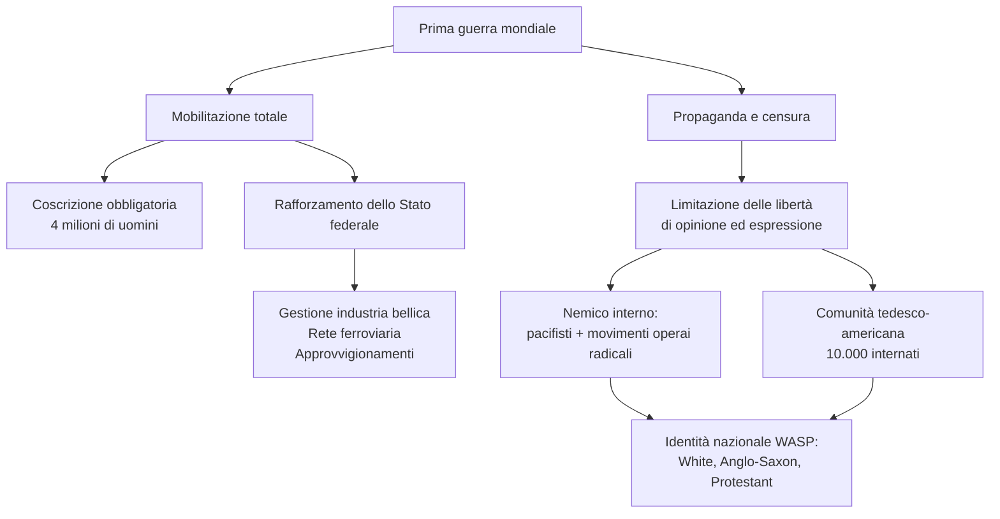

### 1.3 La questione razzista e la rinascita del Ku Klux Klan

La crescita di un forte sentimento **nazional-patriottico** americano si tradusse anche in una recrudescenza delle **violenze dei bianchi contro la popolazione nera**. Questo fenomeno era stato preannunciato nel **1915** dal grande successo nelle sale cinematografiche del film di David W. Griffith ***The Birth of a Nation***, contro cui nulla poterono le dimostrazioni degli attivisti afroamericani delle prime organizzazioni per la difesa dei diritti dei neri (la *National Association for the Advancement of Colored People*, **NAACP**, fondata nel **1909**). Ambientata durante gli anni della guerra civile e della «ricostruzione» del Sud, la storia era un **compendio di pregiudizi e stereotipi negativi sugli afroamericani** e si risolveva nell'esaltazione di un'organizzazione bianca di impronta razzista e violenta, il **Ku Klux Klan (KKK)**.

Il KKK era stato creato dopo la **Guerra di secessione** da reduci dell'esercito sudista per «difendere» i bianchi dagli schiavi liberati, ovvero per **conservare la tradizionale gerarchia** e mantenere gli afroamericani in posizione subordinata. Il governo federale lo represse, considerandolo un gruppo terroristico, e lo stroncò negli anni Settanta dell'Ottocento, mentre gli Stati federati del **Sud** promuovevano un sistema di leggi per legalizzare la **segregazione** degli afroamericani.

Nel **1915** il KKK **rinacque**, ispirandosi al film di Griffith, da cui riprese anche due famigerati simboli: il **cappuccio bianco** e la **croce incendiata**. Negli anni seguenti l'associazione ingrossò le proprie fila e si distinse per **violenze** non solo **contro gli afroamericani** ma contro chiunque fosse considerato «non americano»: **immigrati, ebrei, cattolici**.

La frattura razziale fu riconfermata con l'entrata in guerra: i **soldati afroamericani** furono inquadrati in unità a parte, dove gli unici bianchi erano gli ufficiali comandanti. Inoltre, la discriminazione – non sancita da leggi ma risultato delle pratiche di vita quotidiana – si radicò nelle **città industriali del Nord**, dove la necessità di manodopera per le industrie belliche aveva stimolato la **migrazione interna degli afroamericani dagli Stati del Sud**. Dopo la guerra, nuove violenze si scatenarono quando questi ultimi furono incolpati dell'aumento della disoccupazione.

In questo scenario, la **presidenza Wilson fu contraddittoria**. Se, infatti, da un lato le **donne furono ammesse al voto politico** (in occasione delle elezioni presidenziali del **1920**), dall'altro il governo non fece nulla per garantire agli afroamericani l'esercizio dei loro diritti politici, né per rimediare alla frattura razziale.

| Aspetto | KKK originale (post-Guerra civile) | KKK rinato (1915) |
|---------|-----------------------------------|-------------------|
| **Obiettivo principale** | «Difendere» i bianchi dagli schiavi liberati | Combattere chiunque fosse «non americano» |
| **Bersagli** | Afroamericani | Afroamericani, immigrati, ebrei, cattolici |
| **Simboli** | Creati ex novo | Cappuccio bianco, croce incendiata (dal film di Griffith) |
| **Status legale** | Represso come gruppo terroristico | Tollerato e in espansione |

### 1.4 La «paura dei rossi» e la repressione del movimento operaio

Il biennio **1919-20** segnò il culmine della repressione del movimento operaio da parte delle autorità, spalleggiate dal consenso di ampi settori dell'opinione pubblica. Furono gli anni del cosiddetto ***Red Scare***, la **«paura rossa»**, diffusasi anche negli USA sulla scia del successo della rivoluzione bolscevica e in seguito ad alcuni **attentati dinamitardi** di matrice politica.

La presenza di molti **immigrati** (per lo più europei) tra gli attivisti del movimento operaio fece sì che l'**anticomunismo si saldasse alla xenofobia e al razzismo** e, specularmente, che tra le caratteristiche del «vero americano» ci fosse l'**anticomunismo**. Migliaia di provvedimenti colpirono sindacati, giornali e organizzazioni di sinistra. La polizia fu autorizzata a compiere **arresti di massa**, seguiti da incarcerazioni e deportazioni; durante i processi, giudici e giurie condannavano gli imputati più per le loro idee che non per i crimini commessi.

Emblematico fu il processo celebrato nel **1921** in Massachusetts contro **due anarchici italiani, Nicola Sacco e Bartolomeo Vanzetti**, accusati senza prove di aver commesso una serie di rapine a mano armata, con vittime. La loro condanna a morte divenne un **caso internazionale**: dall'America all'Europa si assisté a una delle prime **mobilitazioni su scala globale** per contestare la parzialità del processo – deciso dai pregiudizi verso gli anarchici immigrati più che dalle prove presentate in aula – e chiederne la revisione o almeno la grazia per i condannati. La sentenza fu invece eseguita nell'**agosto 1927**; Sacco e Vanzetti avrebbero ricevuto solo una **riabilitazione postuma cinquant'anni dopo**.

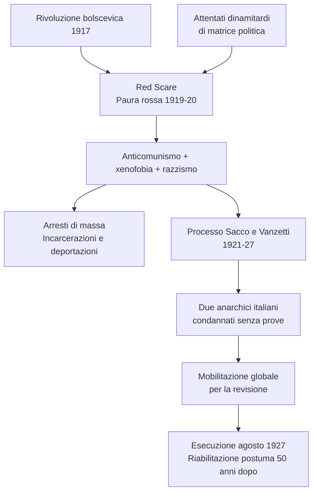

### 1.5 L'eredità della guerra: conformismo e proibizionismo

La guerra lasciò in eredità agli anni Venti un clima di forte **conformismo** e di crociata morale di stampo puritano. Uno dei suoi aspetti più noti fu il **divieto di produzione, vendita e trasporto di bevande alcoliche**, inscritto addirittura nella Costituzione americana nel **1919** con il **XVIII emendamento**, entrato in vigore nel gennaio **1920** e abrogato nel **1933**.

Il cosiddetto **proibizionismo** aveva lo scopo di evitare i nefasti conseguimenti dell'alcol sui costumi, in particolare quelle delle classi popolari. In effetti, esso risultò fonte di **lucrosi traffici illegali** per la malavita organizzata. Gli anni Venti furono un'età dell'oro per i grandi gangster, tra cui il celebre italo-americano **Al Capone**, considerato il «nemico pubblico numero uno» fino al suo arresto (avvenuto per frode fiscale) nel **1931**.

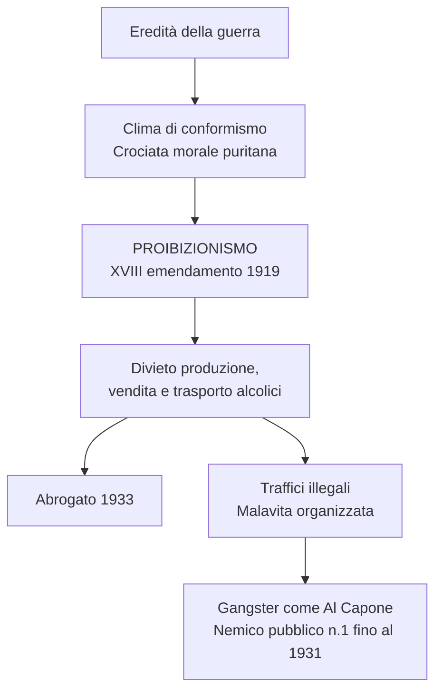

---

## 2. Gli «anni ruggenti» e il «sogno americano»

### 2.1 La nuova potenza mondiale

Gli Stati Uniti erano stati i **veri vincitori** della guerra. Il loro contributo militare era stato breve, ma decisivo; soprattutto, avevano stravinto **sul piano industriale e finanziario**. Nel **1919** le banche americane vantavano **crediti all'estero per oltre 10 miliardi di dollari**, principalmente nei confronti dei vincitori europei. Inoltre, se prima della guerra le **esportazioni** consistevano per lo più in materie prime e prodotti agricoli, con le commesse belliche prevalsero i **prodotti industriali**.

L'**egemonia economica** era indiscussa. Secondo Wilson, gli USA avrebbero dovuto assumere un ruolo egemonico anche nella costruzione di un nuovo ordine mondiale, ma nel Paese maturò una scelta diversa. La società americana, pur emergendo come potenza globale, mostrava una **profonda riluttanza** ad assumere responsabilità internazionali dirette, preferendo concentrarsi sullo sviluppo interno.

### 2.2 Il ritorno dei repubblicani

Le **elezioni presidenziali del 1920** divennero una sorta di referendum sulla pace di Parigi e sulla partecipazione degli USA alla Società delle Nazioni. Il repubblicano **Warren Harding**, ostile all'internazionalismo di Wilson (che non si ricandidò per problemi di salute), ottenne una **schiacciante vittoria** contro il candidato democratico, che si poneva nel solco del wilsonismo.

Il Partito repubblicano mantenne la presidenza per tutto il decennio, prima con **Calvin Coolidge** (1923-29, subentrato dopo la morte di Harding per malattia ed eletto nel 1924) e poi con **Herbert Hoover** (1929-33). Oltre ad **abbandonare l'internazionalismo wilsoniano**, le amministrazioni repubblicane cercarono di riportare il Paese a quella che ritenevano la «normalità».

Dal **1921** fu adottato un forte **protezionismo**, che ancora non si ritorse contro le esportazioni americane, vista la competitività dell'industria del Paese e le difficoltà europee. Oltre che alle merci, gli Stati Uniti restrinsero l'**accesso alle persone**: nel 1921 fu stabilito un tetto di **350.000 immigrati** all'anno, abbassato a **165.000** nel 1924. Erano cifre irrisorie rispetto ai flussi di prima della guerra, oltretutto ripartite in modo da **favorire l'immigrazione anglosassone**.

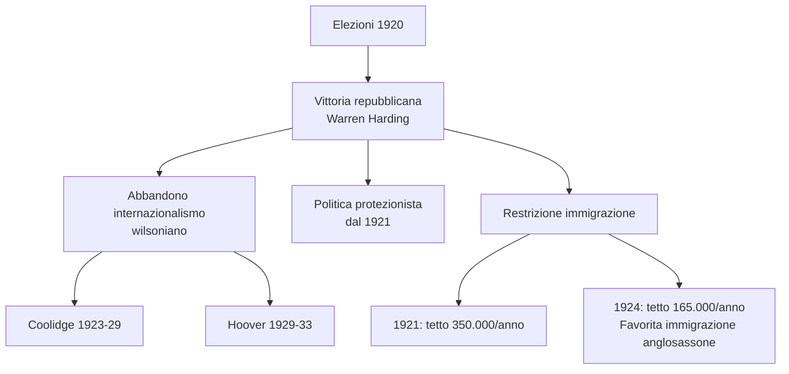

### 2.3 Una politica favorevole ai grandi gruppi d'affari

Le amministrazioni repubblicane sostennero il trend espansivo dell'economia, favorendo il mondo degli affari e della grande finanza. Le leggi varate a inizio secolo per contrastare la formazione di **monopoli e trust** furono abrogate o inapplicate. Prosperarono grandi e potenti concentrazioni, come la **Standard Oil** nel settore petrolifero, la **General Electric** per l'industria elettrica, la **General Motors**, la **Ford** e la **Chrysler** nel settore automobilistico e meccanico, in grado poi di ramificarsi nei più disparati settori.

Anche la **politica fiscale** fu generosa con i grandi profitti, abbassando le imposte dirette. Ciò contribuì ad **aumentare le disuguaglianze** sociali negli anni Venti: nel **1929** lo **0,1% controllava il 34% del risparmio**, mentre l'**80% non aveva alcun risparmio**, e il **20% più ricco deteneva il 55% del reddito nazionale**. Ma il fatto è che allora sembrava che comunque ce ne fosse abbastanza per tutti.

> **Trust:** Associazione di imprese, sottoposte a un'unica direzione, che ha lo scopo di ridurre i costi di produzione e battere la concorrenza, imponendosi sul mercato.

### 2.4 Il boom economico

Superata la breve recessione postbellica, dal 1921-22 gli Stati Uniti conobbero una **crescita economica impetuosa**: fino al 1929 il **PIL crebbe almeno del 50%** e la disoccupazione fu riassorbita. La produzione industriale quasi raddoppiò, mentre anche il settore terziario conobbe un enorme sviluppo, segno di un'economia in rapida evoluzione. La produttività incrementò grazie all'**organizzazione scientifica del lavoro**.

Varie categorie di lavoratori ebbero salari più alti, a fronte di una diminuzione dell'orario di lavoro. Un **certo grado di prosperità** si diffuse in **fasce sempre più ampie della popolazione**, in grado di acquisire più generi di consumo grazie al costo contenuto degli alimenti e a quello decrescente dei beni voluttuari (consentito dall'espansione industriale). Fu negli anni Venti che negli USA si formarono una **società e una cultura del consumo** che nel Novecento avrebbero avuto una diffusione globale. Collaborò anche un facile accesso al credito: la possibilità di **acquistare a rate** fu decisiva.

Al cuore di questa espansione era l'**industria automobilistica**. Nel 1916 le industrie sfornarono 500.000 auto, nel 1929 la produzione fu di circa **5,5 milioni di pezzi**. C'era ormai un'auto ogni sei abitanti e a questi numeri vanno aggiunti quelli di autobus, camion, trattori. L'America si motorizzava a un ritmo formidabile e impensabile, negli stessi anni, per il Vecchio Continente.

L'espansione era fondata su **beni durevoli**. Nelle case entrarono elettrodomestici come **frigoriferi** (la cui produzione passò da 5.000 pezzi nel 1922 a quasi un milione nel 1929), **ferri da stiro** (presenti nel 60% delle case nel 1929), **aspirapolvere** e soprattutto **radio**. Nel 1929 il **40% delle famiglie americane** avevano un apparecchio radiofonico in casa.

| Indicatore | 1916 | 1929 |
|------------|------|------|
| **Produzione automobilistica** | 500.000 auto | 5,5 milioni di auto |
| **Produzione frigoriferi** | — | ~1 milione (da 5.000 nel 1922) |
| **Famiglie con radio** | — | 40% |
| **Ferri da stiro nelle case** | — | 60% |
| **PIL** | Base | +50% |

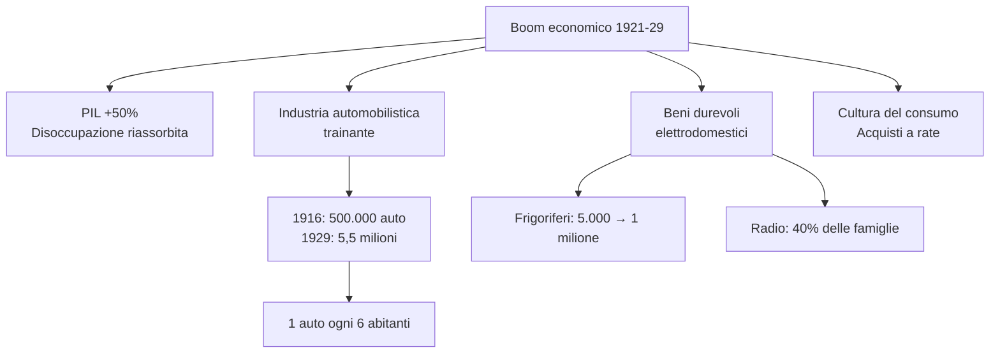

### 2.5 Il ruolo della radio e dell'auto nella «nazionalizzazione» degli USA

Radio e automobile ebbero un ruolo cruciale nel modellare uno **stile di vita omogeneo**. Attraverso notiziari e trasmissioni, la radio portò in tutte le case una **lingua parlata standardizzata**. La diffusione dell'auto diede impulso a un programma di **costruzione di strade** e infrastrutture: autosaloni, pompe di benzina, officine, motel divennero elementi tipici del paesaggio.

La capillarità delle comunicazioni e del sistema di trasporti contribuì a **rompere l'isolamento delle campagne**. Gli Stati Uniti cessavano di essere un Paese rurale non solo perché alla fine del decennio i lavoratori attivi in agricoltura erano scesi al **21%** (erano il 41% nel 1900) e più di metà della popolazione viveva in città, ma anche perché uno **stile di vita urbano** si imponeva ovunque.

### 2.6 Il «sogno americano»: per molti ma non per tutti

In questi anni prese forma il cosiddetto **«sogno americano»**. Fondato sull'**individualismo**, esso proponeva l'**immagine ideale** di una società basata su una combinazione di **pari opportunità per tutti**, **benessere** e **possibilità di ascesa sociale**. L'efficienza e le statistiche in ascesa confortavano l'amor proprio e la sicurezza di sé della maggioranza degli americani. Un energico ottimismo fu uno dei tratti psicologici di questi anni, sentiti come speciali al punto da essere battezzati **«anni ruggenti»** (*Roaring Twenties*).

Con i suoi divi e dive, il **cinema** alimentò i sogni di una promozione sociale e di un benessere a portata di mano; inoltre diffondeva stili di abbigliamento, arredi, ma anche gesti, modi di dire e canzoni (dall'introduzione del sonoro nel 1927). Il mito del «sogno americano» era utile anche a coprire gli **squilibri** e le profonde **differenze geografiche dello sviluppo economico** americano.

Ampie fasce della popolazione ne erano infatti escluse, in particolare nelle **aree rurali**. Qui l'agricoltura era entrata in crisi, poiché la ripresa europea aveva provocato una forte riduzione delle esportazioni rispetto al periodo bellico; a ciò si aggiungeva una generale diminuzione dei prezzi. Dal benessere erano esclusi largamente o del tutto anche **minatori**, lavoratori di settori industriali tradizionali come **tessile e abbigliamento**, **minoranze**, **afroamericani**, **immigrati**.

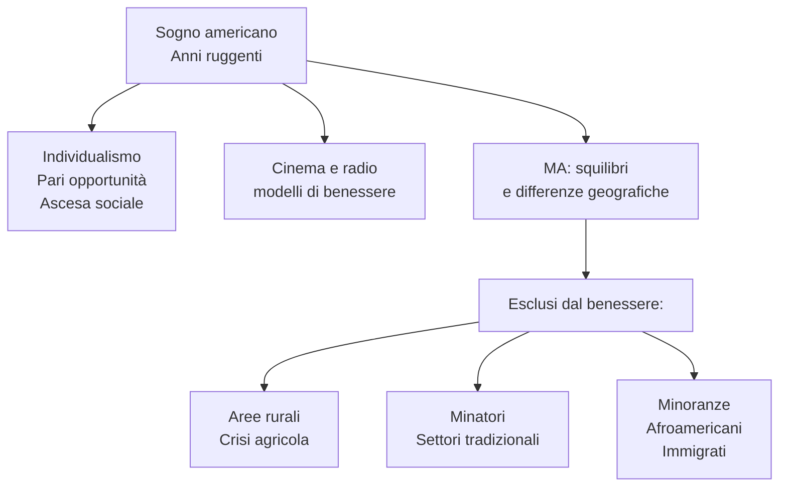

### 2.7 Oltre il conformismo, una nuova vivacità culturale

In questa fase la società americana presentò volti diversi anche dal punto di vista culturale. Nonostante il clima puritano e conservatore, i *Roaring Twenties* furono un'epoca di grande **vivacità culturale**, che scaturiva dai grandi cambiamenti in corso. Gli anni Venti furono quelli del **jazz** e del **charleston**, ovvero musiche e balli dirompenti rispetto alla tradizione. Furono quelli in cui si imposero modelli di **emancipazione femminile**, espressi anche dalle ***flappers***, ragazze con tagli di capelli alla «maschietta», gonne corte, viso truccato, che ostentavano comportamenti anticonformisti.

Era un ruolo che solo le donne dei ceti superiori potevano permettersi, ma cinema e stampa contribuirono alla diffusione di un modello di indipendenza. Furono anni di successo per le riviste di orientamento progressista, dove intellettuali impegnati sperimentavano nuovi linguaggi e tecniche narrative per raccontare criticamente le trasformazioni della società americana.

Molti scrittori della cosiddetta **«generazione perduta»** o ***lost generation***, come **Ernest Hemingway** o **Francis Scott Fitzgerald** soggiornarono a lungo in Europa, per sfuggire ai tratti più opprimenti della società americana, ma allo stesso tempo la cultura statunitense smetteva di essere tributaria di quella europea: anche da questo punto di vista i rapporti tra Nuovo e Vecchio Mondo cominciarono a rovesciarsi.

> **Lost generation:** Nel mondo britannico l'espressione indica la generazione di giovani uomini che fu falciata nel conflitto mondiale. Nel mondo statunitense fu attribuita a un gruppo di scrittori degli anni Venti, segnato dall'esperienza della guerra o dal clima del dopoguerra.

---

## 3. Il ruolo mondiale degli Stati Uniti

### 3.1 L'«americanizzazione» del mondo

Per gli Stati Uniti, la mancata ratifica del Trattato di Versailles significò l'avvio di un internazionalismo diverso da quello wilsoniano eppure inevitabile, visto il peso assunto dal Paese sulla scena mondiale. Le ragioni del protagonismo americano e dell'intensificazione delle connessioni internazionali di Washington erano molteplici:

- la **nuova posizione** che la Grande guerra aveva conferito agli USA rispetto alle potenze europee
- l'**egemonia economica**, determinata da uno straordinario sviluppo, nel quadro di un **sistema mondiale sempre più interdipendente**
- l'ampio **saldo attivo della bilancia commerciale**, che fu impiegato per incrementare investimenti e prestiti verso l'estero, creando complessi intrecci con altre regioni del pianeta
- il cambiamento dei rapporti culturali, per cui la modernità americana cominciò a diventare un **riferimento globale**, non solo per le élite ma anche per le **masse**, grazie in particolare alla potenza comunicativa dei film di Hollywood

Gli Stati Uniti esportavano un modello e l'**«americanizzazione» del mondo** muoveva i primi passi. Gli obiettivi dei governi degli anni Venti in fondo non furono troppo distanti da quelli di Wilson: riportare una **pace stabile** e consolidare un **ordine internazionale di stampo liberale**, condizioni per uno sviluppo economico che avrebbe allontanato ogni tentazione rivoluzionaria. Anche le amministrazioni repubblicane immaginavano un **ruolo guida** per gli Stati Uniti, ma senza che ciò implicasse la creazione di istituzioni sovranazionali mondiali e limitazioni di sovranità nazionale, né nuovi interventi diretti.

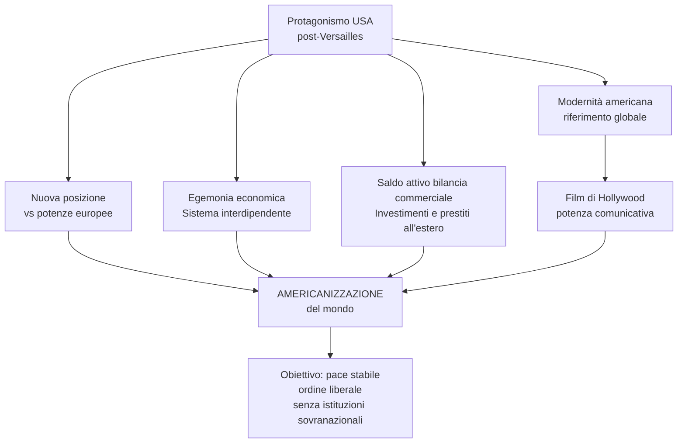

### 3.2 Debiti e riparazioni: una «diplomazia del dollaro» verso l'Europa

Una questione delicata negli anni del dopoguerra fu quella dei **crediti** che gli Stati Uniti vantavano in Europa. Quando la Germania si rivelò incapace di pagare le enormi riparazioni che le erano state imposte, Gran Bretagna e soprattutto Francia rivendicarono la sospensione dei pagamenti dei loro debiti verso gli USA.

Washington, pur intransigente sul rimborso, non condivideva però l'impostazione punitiva di Versailles in tema di riparazioni, ritenendo fondamentale **rilanciare le economie europee**. Gli USA dimostrarono la propria forza diplomatica ed economica con il **piano Dawes** (**1924**): oltre a rivedere entità, modi e tempi dei pagamenti, esso prevedeva un **ingente prestito alla Germania**, affinché avviasse il risanamento della sua economia.

Di fatto, le potenze europee riconoscevano la **supremazia degli USA** e la necessità dei loro capitali per stabilizzare la situazione; per gli Stati Uniti, invece, il piano Dawes poteva essere considerato una versione più morbida della **«diplomazia del dollaro»** condotta con i Paesi dell'America Latina.

### 3.3 Gli obiettivi della pace e del disarmo: il patto Briand-Kellogg

Per alcuni anni il piano Dawes stabilizzò la situazione europea e distese i rapporti tra Germania e Francia. Esso fu la premessa del **Trattato di Locarno del 1925**, con cui la Germania riconosceva i confini occidentali stabiliti a Versailles: sembrò così aprirsi un dopoguerra di **pace e cooperazione internazionale**. **Pace e disarmo** furono in effetti gli altri due obiettivi perseguiti dagli USA negli anni Venti.

Nel **1928** il pacifismo salutò come un grande successo il cosiddetto **patto Briand-Kellogg** (dal nome del ministro degli Esteri francese e del Segretario di Stato americano), che sanciva la **rinuncia alla guerra** come strumento di politica nazionale. Previsto inizialmente come un patto bilaterale Francia-Stati Uniti, fu poi aperto a qualsiasi aderente e sottoscritto subito da **quindici Paesi**, tra cui Germania, Italia, Gran Bretagna e Giappone, raggiungendo **sessantatré firme** nel 1939.

Il patto Briand-Kellogg, formalmente in vigore ancora oggi, fu più che altro una **dichiarazione di intenti**, sprovvisto di indicazioni su come garantirne l'applicazione. Tuttavia, ebbe un ruolo nell'elaborazione del **diritto internazionale**, poiché offrì una base per la nozione di **«crimine contro la pace»** per cui, all'indomani della Seconda guerra mondiale, sarebbero stati processati esponenti del regime tedesco nazista e di quello giapponese (rispettivamente nei **processi di Norimberga** e di **Tokyo**).

Il sistema dell'economia e delle relazioni internazionali instauratosi negli anni Venti fu modificato dalla crisi economica scoppiata nel 1929 negli USA, dove da quel momento si affermò il primato delle questioni interne e prevalsero posizioni isolazioniste.

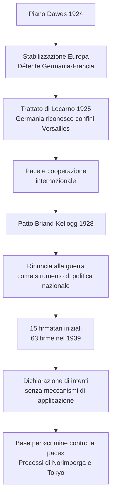

---

## 4. La crisi del 1929: da New York al mondo

### 4.1 Il crollo di Wall Street: l'inizio della Grande Depressione

L'incremento dei consumi degli anni Venti sembrava aver innescato una crescita illimitata. Il sogno americano, tuttavia, si interruppe sei mesi dopo l'insediamento del presidente repubblicano **Herbert Hoover**. La sveglia suonò bruscamente il **24 ottobre 1929** alla Borsa di Wall Street, a New York.

Quando il prezzo delle azioni, gonfiato da un trend speculativo negli anni precedenti, iniziò a scendere, gli operatori cominciarono prima a vendere, poi a **svendere con un effetto a valanga**: **12 milioni di azioni** subirono una forte riduzione del loro valore. Le giornate «nere» proseguirono e culminarono il **29 ottobre**, quando le vendite riguardarono **16 milioni di titoli**: a questo punto grossi investimenti, risparmi, speranze di ricchezza o di agiata sicurezza divennero solo **carta straccia**.

In una settimana le perdite ammontarono a circa **15 miliardi di dollari** e la caduta proseguì sino alla fine dell'anno, sommando **40 miliardi di perdite**: una cifra superiore alle riparazioni di guerra accollate alla Germania. La Borsa scontava in modo eclatante la **fine di un periodo di euforia e di grandi speculazioni**, quando l'ottimismo e l'**assenza di controlli** da parte delle autorità avevano dato il via a una enorme crescita del mercato finanziario e dei fenomeni speculativi.

Il valore di titoli e azioni era cresciuto di continuo, ma **senza aggancio concreto con l'economia reale**. Moltissimi si erano illusi di potersi arricchire facilmente, indebitandosi per comprare azioni, certi che con i rialzi avrebbero potuto ripagare il debito e guadagnarci. Con il **crollo di Wall Street**, emersero tutti i problemi strutturali che si erano accumulati nel decennio precedente, e allora la crisi divenne generale.

Gli Stati Uniti, e sulla loro scia gran parte del mondo, entrarono nell'era della **Grande Depressione**, una crisi economica di gravità e durata senza precedenti nella storia del capitalismo, accompagnata da **pesanti conseguenze sociali e politiche**.

> La fotografa americana Dorothea Lange (1895-1965) ha documentato l'impatto della crisi su coloro che più ne hanno subito le conseguenze: poveri, emigrati ed emigrate, braccianti, disoccupati.

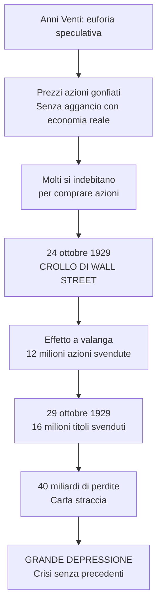

### 4.2 Le cause della Grande Depressione negli Stati Uniti

Alla base di un simile cataclisma ci fu una serie di concause. Nel **settore industriale**, gli Stati Uniti avevano maturato un problema di **sovrapproduzione**. Sempre maggiori quantità di prodotti restavano invendute perché:

- **le esportazioni avevano rallentato** dopo il 1925, quando le economie europee si erano riprese e avevano reagito al protezionismo americano alzando le tariffe
- **il mercato interno si era saturato**, sia perché l'espansione si era basata su beni durevoli (auto, elettrodomestici), sia perché la squilibrata distribuzione dei redditi aveva impedito di ampliare ulteriormente il numero di consumatori

Il **settore agricolo** era in sofferenza da anni: nel dopoguerra, il costante **calo dei prezzi** aveva messo in seria difficoltà i coltivatori americani (il cui reddito nel 1929 ammontava a un **terzo del reddito medio nazionale**), mentre si aggravava la loro **situazione debitoria** (endemica nelle campagne, a causa dei cicli dell'agricoltura) e molte terre erano ipotecate.

Inoltre, la facilità di accesso al credito aveva stimolato un **indebitamento collettivo**: mutui e vendite a rate avevano sostenuto i consumi e il mercato immobiliare. Il sistema bancario americano, fatto di tanti piccoli istituti, era **esposto e vulnerabile**.

| Settore | Problema | Conseguenza |
|---------|----------|-------------|
| **Industriale** | Sovrapproduzione | Prodotti invenduti, esportazioni rallentate, mercato interno saturo |
| **Agricolo** | Calo prezzi, debiti | Reddito = 1/3 media nazionale, terre ipotecate |
| **Finanziario** | Indebitamento collettivo, speculazione | Sistema bancario vulnerabile, azioni slegate dall'economia reale |

### 4.3 Le dimensioni della crisi

Alla fine del 1929 si innescò un **circolo vizioso** i cui attori erano:

- **crisi della fiducia e della liquidità** (molti correntisti ritirarono dalle banche i loro risparmi)
- **blocco dei crediti** (le banche rifiutavano prestiti e mutui immobiliari)
- **contrazione dei consumi** (il crollo dei redditi e il blocco dei crediti ridussero la capacità di acquisto)
- **riduzione della produzione**
- **calo dei prezzi agricoli**
- **fallimenti di banche e aziende, licenziamenti, disoccupazione**

Entro il **1932** gli «anni ruggenti» si erano volatilizzati: il **PIL si ridusse di un terzo** e la produzione industriale di **più della metà**, oltre **5000 banche fallirono** e **9 milioni di correntisti persero i loro depositi**, **32.000 imprese chiusero**, i disoccupati erano circa **13 milioni**, un terzo degli agricoltori perse la propria terra, moltissimi non avevano più una casa, il settore edile si era bloccato, il crollo del gettito delle imposte metteva a repentaglio i servizi essenziali. Tutta l'economia del Paese sembrava in dissoluzione e con essa il tessuto sociale.

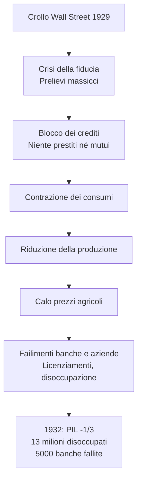

### 4.4 La diffusione mondiale della crisi

Nel frattempo, la **crisi era diventata globale**. La questione del debito era stata decisiva: negli anni Venti la soluzione al problema dell'indebitamento e delle riparazioni tedesche era stata trovata in ulteriori prestiti e debiti, che a loro volta avevano sostenuto gli scambi commerciali. Per qualche anno il sistema aveva funzionato, ma alla fine si era inceppato e le **interdipendenze** che si erano create servirono solo a **diffondere la crisi**, non a governarla.

Da questo punto di vista, anche la crisi del 1929 era un **prodotto della Grande guerra** e dei limiti del Trattato di Versailles nel costruire un nuovo ordine mondiale.

| Paese | PIL 1932 (1929=100) | Produzione industriale 1932 (1929=100) |
|-------|---------------------|----------------------------------------|
| **Stati Uniti** | 73 | 62 |
| **Germania** | 77 | 61 |
| **Austria** | 80 | 62 |
| **Francia** | 86 | 74 |
| **Italia** | 98 | 86 |
| **Regno Unito** | 95 | 89 |

### 4.5 Gli errori dell'amministrazione Hoover

Alcune decisioni di Hoover contribuirono alla catastrofe. Fedele ai principi del liberismo, egli pensava che la risposta alla crisi dovesse venire dall'**iniziativa privata**. Gli **interventi pubblici furono limitati**: il presidente rifiutò di varare programmi nazionali di assistenza per i più colpiti dalla crisi, demandando questo compito alla carità privata e ai governi locali, le cui risorse erano però molto ridotte. Approvò solo stanziamenti per la realizzazione di opere pubbliche, ma in misura troppo modesta per riassorbire la disoccupazione.

Per giunta, nel 1932 Hoover dotò un'agenzia federale di quasi **2 miliardi di dollari** per fare prestiti a banche, imprese, ferrovie e società di assicurazioni in difficoltà: un provvedimento che l'opinione pubblica ritenne un **favore verso i ricchi**.

Sul versante internazionale, gli USA ripiegarono su un **protezionismo ancora più rigido**: nel 1930 le tariffe doganali raggiunsero livelli stratosferici, mentre investimenti e prestiti all'estero furono progressivamente ritirati, provocando la diminuzione delle esportazioni (del **60% dal 1929 al 1932**). In Europa, con la **fine dell'afflusso di capitali americani** la Germania interruppe di nuovo il pagamento delle riparazioni.

Al protezionismo statunitense risposero altri protezionismi, i **volumi dei traffici internazionali si ridussero drasticamente**, il sistema multilaterale degli scambi lasciò il passo all'isolamento: ogni Paese cercò di costruire un proprio spazio economico e monetario autosufficiente, coincidente con il proprio mercato nazionale (che per Francia e Gran Bretagna includeva anche le colonie).

```mermaid
flowchart TD
    A[Hoover e il liberismo] --> B[Interventi pubblici limitati]
    B --> C[Assistenza demandata<br/>a carità privata e governi locali]
    B --> D[Opere pubbliche<br/>troppo modeste]
    B --> E[2 miliardi per prestiti<br/>a banche e imprese]
    E --> F[Opinione pubblica:<br/>favore verso i ricchi]
    A --> G[Protezionismo ancora più rigido<br/>Tariffe stratosferiche 1930]
    G --> H[Ritiro investimenti<br/>all'estero]
    H → I[Esportazioni -60% 1929-32]
    H --> J[Germania interrompe<br/>riparazioni]
    G --> K[Altri protezionismi<br/>Traffici ridotti<br/>Isolamento economico]
```

---

## 5. Il New Deal: contro la crisi, un progetto per il futuro

### 5.1 Un nuovo presidente e un nuovo patto

Alle elezioni presidenziali del 1932, con una certa miopia politica il Partito repubblicano ripropose il presidente uscente Hoover e la maggioranza degli elettori votò in primo luogo contro di lui, conferendo una netta vittoria al democratico **Franklin Delano Roosevelt**.

Roosevelt aveva già ricoperto incarichi di governo con Wilson ed era stato candidato alla vicepresidenza nel 1920, ma si era poi ritirato temporaneamente dalla scena pubblica a causa di una malattia che gli avrebbe lasciato una **disabilità permanente alle gambe**. Dal 1929 al 1932, come **governatore dello Stato di New York**, varò programmi d'assistenza ai disoccupati finanziati dallo Stato. Questa politica sociale gli guadagnò ampi consensi e fu la base per costruire la sua candidatura alla presidenza.

Con lo slogan ***New Deal*** («Nuovo corso» o «Nuovo patto»), Roosevelt indicava una doppia cesura rispetto agli ultimi anni:

- gli Stati Uniti dovevano recuperare **fiducia e ottimismo**
- occorreva un **nuovo patto con i cittadini**: il ruolo dello Stato doveva crescere, offrendo maggiore protezione e riequilibrando la distribuzione del reddito

Del resto, la crisi del 1929 aveva incrinato il modello capitalistico e messo in discussione il **nesso tra capitalismo e sistema liberal-democratico**, che negli anni Venti era stato efficacemente incarnato dagli Stati Uniti. Per questo, il mondo ricercava **modelli alternativi**. Uno veniva dall'**URSS**, sulla via di una rapida industrializzazione e crescita economica. Un altro era il **corporativismo** delle **dittature di destra**, in cui allo Stato spettava il ruolo di supremo regolatore delle dinamiche sociali. Gli esempi stavano fiorendo: oltre al caso del fascismo italiano c'era il **nazismo tedesco**, mentre in Asia si delineava il regime autoritario giapponese. La portata di questa sfida si sarebbe precisata nel corso degli anni Trenta.

### 5.2 Le misure in campo finanziario

Prima di tutto, Roosevelt dovette far fronte alla crisi interna. Nei primi mesi di governo la sua azione si dispiegò nei tre settori cruciali dell'economia.

Nel **settore bancario e finanziario** fu varato l'***Emergency Banking Act*** (9 marzo 1933). Tutte le banche dovettero chiudere per qualche giorno, in modo che lo Stato ne controllasse i conti e la solidità, mentre la **banca centrale**, la Federal Reserve Bank, ampliò i suoi **poteri di controllo**. Infine, il governo si fece **garante dei piccoli risparmiatori** in caso di fallimento di una banca. Lo scopo era restituire fiducia ai correntisti, scongiurando ulteriori corse al ritiro dei depositi bancari, e consolidare il sistema evitando rischi di nuove speculazioni.

Roosevelt intraprese anche una **politica monetaria** opposta a quella di Hoover, **svalutando il dollaro** e puntando su una certa inflazione: rimettere in circolazione liquidità avrebbe dovuto dare impulso positivo all'economia.

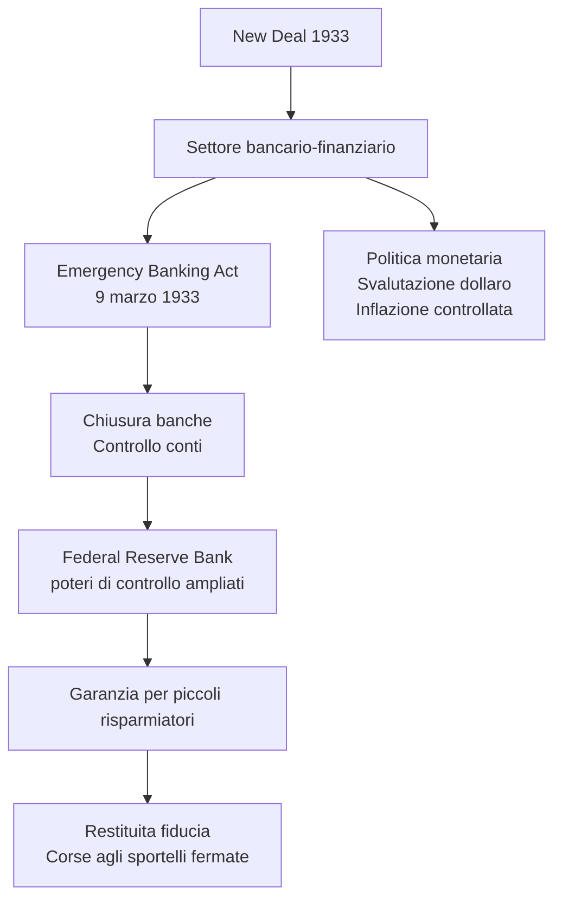

### 5.3 Le misure nei settori agricolo, industriale e delle opere pubbliche

Nel **settore agricolo** fu varato l'***Agricultural Adjustment Act*** (12 maggio 1933), che offriva **sussidi ai contadini** che avessero ridotto le superfici coltivate, al fine di diminuire la produzione: riducendo l'offerta, i prezzi agricoli sarebbero risaliti.

Nel **settore industriale** fu varato il ***National Industry Recovery Act*** (NIRA, 16 giugno 1933), che doveva rilanciare la ripresa economica – affari e occupazione – sotto l'egida del governo. Il governo patrocinava tra le parti aderenti l'introduzione di «codici per la concorrenza leale», che da un lato favorirono la nascita di monopoli, ma dall'altro introdussero una **stabilizzazione dei prezzi** e una serie di **diritti per i lavoratori**, come il **salario minimo** o l'**orario massimo**, che dovevano diventare altrettanti impulsi per l'economia.

Un **salario dignitoso**, infatti, avrebbe favorito i consumi, mentre contenere l'orario individuale serviva anche a **incrementare l'occupazione**. Nell'ambito del NIRA fu poi creata una serie di agenzie federali incaricate di promuovere un **ampio programma di opere pubbliche**. Ciò doveva aiutare a riassorbire la disoccupazione, migliorando allo stesso tempo le infrastrutture del Paese: strade, ponti, scuole, ospedali e altri edifici pubblici, e poi anche centinaia di aeroporti.

Nel **marzo del 1933** fu istituito anche il ***Civilian Conservation Corps*** per impiegare giovani disoccupati e celibi (nella fascia d'età tra i 18 e i 25 anni, poi ampliata tra i 17 e i 28) in progetti di **tutela dell'ambiente**; a beneficiarne furono in circa **3 milioni**, fino al 1942.

Con gli stessi obiettivi – impiego, rilancio dell'economia e delle infrastrutture – nel **maggio 1933** fu istituita la ***Tennessee Valley Authority*** (TVA) che doveva sovrintendere a un progetto destinato a diventare simbolo del *New Deal*: la **sistemazione del bacino del fiume Tennessee**.

| Settore | Provvedimento | Data | Contenuto |
|---------|---------------|------|-----------|
| **Agricolo** | Agricultural Adjustment Act | 12 maggio 1933 | Sussidi per riduzione superfici coltivate → risalita prezzi |
| **Industriale** | NIRA | 16 giugno 1933 | Codici concorrenza leale, salario minimo, orario massimo |
| **Lavoro** | Civilian Conservation Corps | Marzo 1933 | 3 milioni di giovani in progetti ambientali |
| **Infrastrutture** | Tennessee Valley Authority | Maggio 1933 | Sistemazione bacino fiume Tennessee |

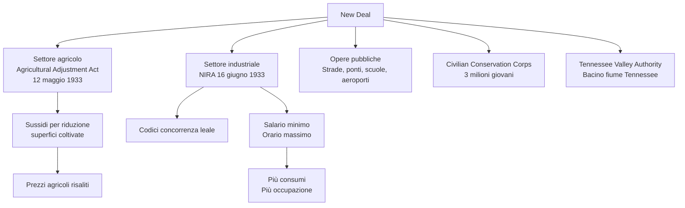

### 5.4 La rielezione del 1936: un presidente carismatico

La **spinta riformista** proseguì nell'arco del mandato. Nel **1935** – di fronte a una ripresa economica modesta e a una disoccupazione riassorbita solo in parte e lentamente – si ebbero un'intensificazione dell'intervento statale per le opere pubbliche, una nuova legge fiscale che aumentava le tasse per i redditi più alti e l'introduzione di un **sistema di previdenza sociale nazionale**, che comprendeva **sussidi di invalidità e disoccupazione** e **pensioni di vecchiaia**, da cui tuttavia erano esclusi i braccianti agricoli e i lavoratori domestici.

Le **politiche sociali** ebbero una sostenitrice appassionata nella *first lady* **Eleanor Roosevelt**, la quale condusse un'intensa attività pubblica, anche a sostegno dei diritti civili degli afroamericani.

Tutto questo garantì al presidente una **vittoria larghissima alle presidenziali 1936**: non era più un voto di protesta, ma un **mandato a proseguire** nella sua azione. Il successo fu determinato anche dalla grande **abilità comunicativa** di Roosevelt, che seppe creare consenso intorno al suo programma, usando le moderne tecniche di propaganda.

Decisiva fu la **radio**, sempre più diffusa (nel 1945 l'88% delle famiglie ne possedeva una), attraverso la quale Roosevelt **entrava nelle case** per illustrare i suoi programmi con uno stile informale, rassicurante e paternalista: le famose ***fireside chats***, le «chiacchierate al caminetto». Tra il 1933 e il 1944 i discorsi radiofonici di Roosevelt furono **trenta**. Si aggiungevano manifesti pubblicitari, comunicati stampa, discorsi pubblici e viaggi. Tutto ciò servì a costruire un'immagine mitica del *New Deal* e del suo artefice: un presidente che, restando al di sopra della politica dei partiti, avrebbe portato il Paese fuori dalla Depressione.

Da questo punto di vista, Roosevelt dimostrava che l'esercizio di una **leadership carismatica** e capace di usare i moderni mezzi di comunicazione poteva verificarsi **anche in un contesto democratico-liberale**, e non solo nei regimi autoritari o totalitari che si imponevano in quegli anni.

> «La proposta è semplice: se tutti i datori di lavoro agiranno di concerto per ridurre l'orario di lavoro e per aumentare gli stipendi, noi potremo aumentare l'occupazione. Nessun datore di lavoro ne rimarrà danneggiato, poiché i costi aumenteranno nella stessa misura per tutti.» — F.D. Roosevelt, *Ripartiamo!*

### 5.5 Una «normalizzazione» del programma riformista

Dal **1937** il *New Deal* si «stabilizzò». Non vi furono ulteriori spinte in avanti, mentre le misure già attuate rimasero in vigore. Tutto ciò fu il prodotto di dinamiche interne ed esterne.

Sul piano interno, benché Roosevelt godesse di ampio consenso, circa il **40% degli americani disapprovava** il *New Deal* e i suoi cambiamenti radicali, che in effetti non potevano riscuotere l'unanimità. L'opposizione si appuntava sul **ruolo che lo Stato centrale** aveva assunto nelle vite dei cittadini (come datore di lavoro, come erogatore di servizi assistenziali, come orientatore dello sviluppo attraverso gli investimenti nelle opere pubbliche), del tutto **estraneo alla tradizione liberale americana**.

Soprattutto, secondo i critici, nel settore economico lo Stato diventava un **concorrente sleale dell'iniziativa privata**; le associazioni imprenditoriali accusavano il governo di **limitare la libertà d'impresa**. Su queste basi, Roosevelt fu tacciato alternativamente di flirtare con il **socialismo** o con il **corporativismo fascista**, e alcuni dei provvedimenti costitutivi del *New Deal* (a cominciare dal NIRA) furono giudicati **illegittimi dalla Corte costituzionale**, costringendo il governo a riformularli per aggirare le sentenze.

Per giù, i risultati concreti stentavano ad arrivare e la ripresa degli ultimi tre anni si interruppe proprio nel **1937-38**: una **piccola recessione** fece traballare la fiducia nel piano di riforme e allo stesso tempo ridusse le risorse su cui si poteva contare.

### 5.6 New Deal e isolazionismo

In politica estera, nel **giugno 1933** maturò la prima scelta isolazionista: Roosevelt decise di **non partecipare alla Conferenza economica di Londra**, dove 66 Paesi si riunirono per cercare di stabilizzare il quadro monetario e rilanciare il commercio internazionale. Il presidente USA voleva essere **libero in materia di moneta**, ovvero poter scegliere – come fece – di svalutare il dollaro e di intraprendere una politica inflazionistica per risollevare il mercato interno.

Allo stesso tempo, egli mostrò scarso interesse per le **conferenze sul disarmo**. Nemmeno all'ascesa del militarismo giapponese, pur condannato a parole, furono opposte reazioni concrete. Questo orientamento isolazionista culminò in una serie di **leggi sulla neutralità**, approvate tra il **1935 e il 1937**, che impedivano di vendere armi a Paesi belligeranti; le clausole furono applicate anche alle parti in conflitto nella **guerra civile scoppiata in Spagna nel 1936**.

Solo dopo il **1938** Roosevelt iniziò una virata politica che avrebbe portato gli Stati Uniti ad assumere quel **ruolo di leadership mondiale** che era stato rifiutato nel 1919. Gli USA mantennero il tradizionale attivismo verso l'**America Latina**, negli anni tra le due guerre segnata da forte **instabilità politica** e dall'affermazione di **regimi autoritari e dittature**.

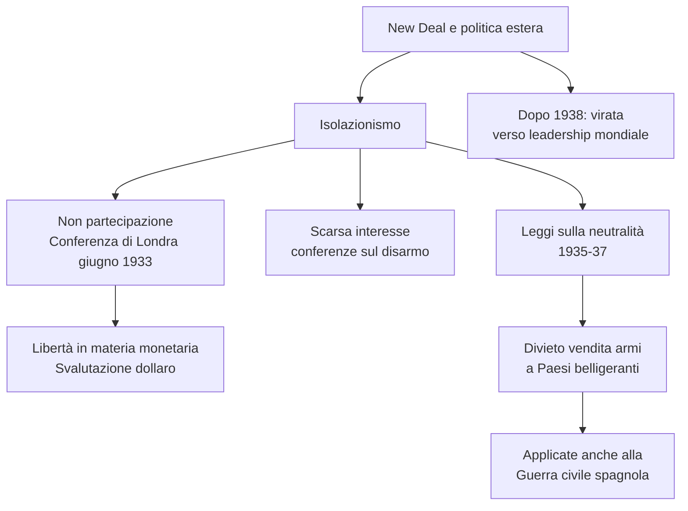

### 5.7 L'eredità del New Deal

Dal punto di vista economico, il *New Deal* aveva mostrato **molti limiti**: la Grande Depressione non poteva dirsi superata, i livelli di disoccupazione erano alti e il monte salari complessivo inferiore a quello registrato prima del 1929. L'uscita dalla crisi sarebbe avvenuta solo con l'avvio della gigantesca mobilitazione industriale all'inizio della **Seconda guerra mondiale**, quando anche le politiche avviate da Roosevelt avrebbero dato i loro frutti.

Il *New Deal* accrebbe il **potere dell'autorità federale** a scapito di quello degli Stati e fu una tappa decisiva per lo spostamento del baricentro del sistema politico americano sulla cosiddetta **«presidenza personale»**: il presidente divenne il centro della politica nazionale.

Il *New Deal* fu una **svolta politica e culturale** di grande portata, che segnò molti decenni a venire:

- esso impose una **revisione dei rapporti tra Stato e cittadino e del ruolo dello Stato**, che acquisiva compiti di controllo, riequilibrio e impulso nel settore economico
- il *New Deal* fu un **esperimento di riforma del capitalismo all'interno di un sistema liberaldemocratico**, in una fase storica in cui sembrava che il modello capitalista liberale avesse esaurito le sue risorse, e che le sorti del capitalismo fossero legate a forme politiche autoritarie o totalitarie

In questo panorama gli Stati Uniti dimostrarono la praticabilità di un **modello di capitalismo democratico**. Questa combinazione tra **diritti individuali e tutela dello Stato**, **impresa privata e programmazione economica pubblica**, **profitti privati e promozione del benessere collettivo** divenne la promessa con cui gli Stati Uniti entrarono nella Seconda guerra mondiale e ciò che avrebbero esportato in tutto il mondo al termine del conflitto.

> Secondo lo storico Kiran Klaus Patel, con il New Deal l'America mostrò al mondo un modello di Stato in grado di **conciliare democrazia e capitalismo** e, così facendo, pose le basi per l'egemonia politica che la vittoria della Seconda guerra mondiale le avrebbe conferito.

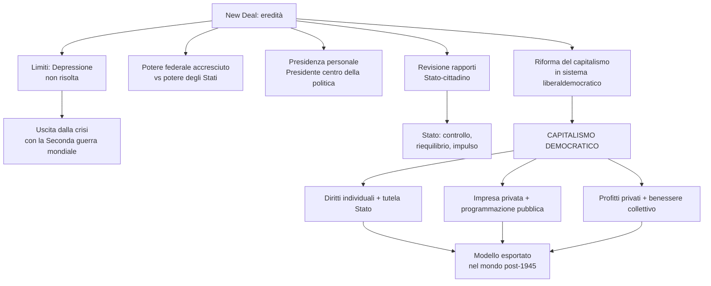

---

## Mappa concettuale — Visione d'insieme del capitolo

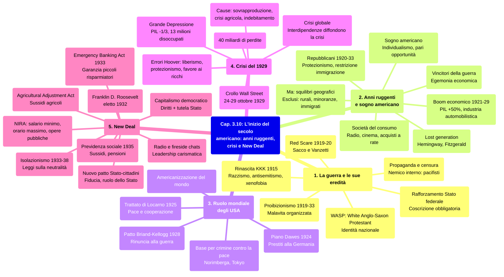