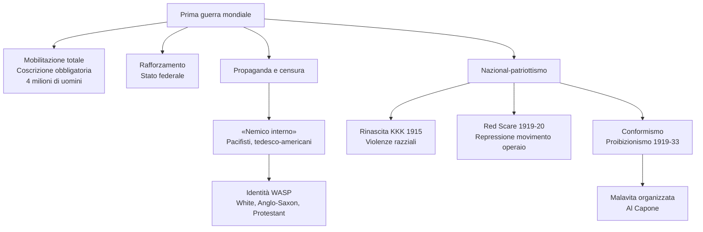
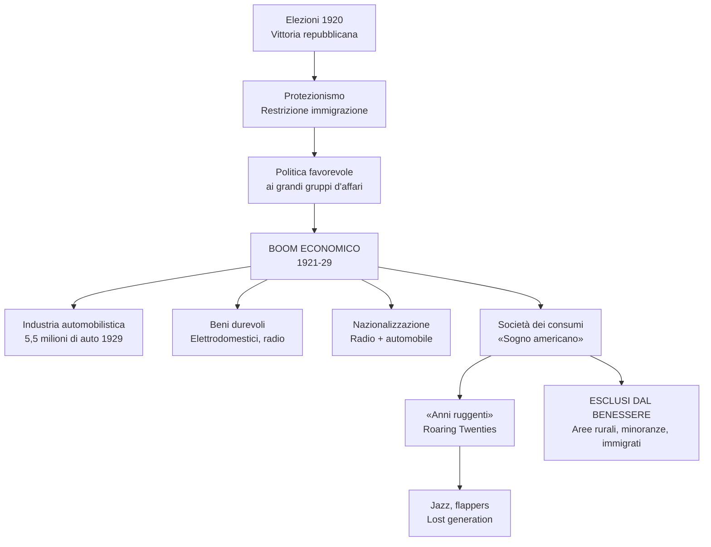
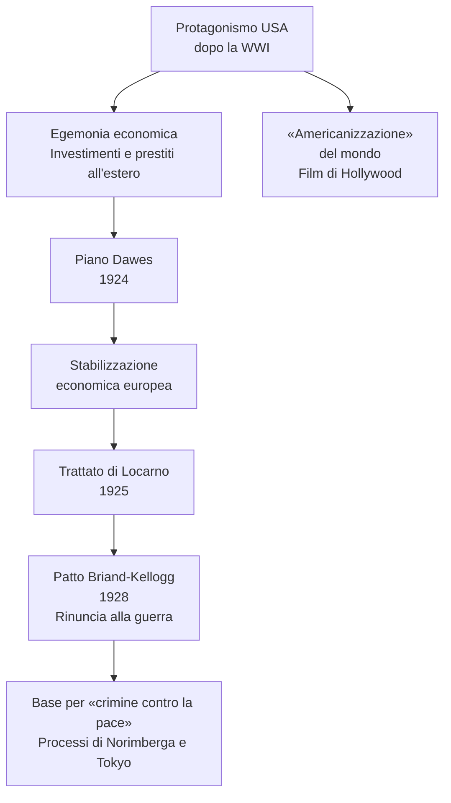
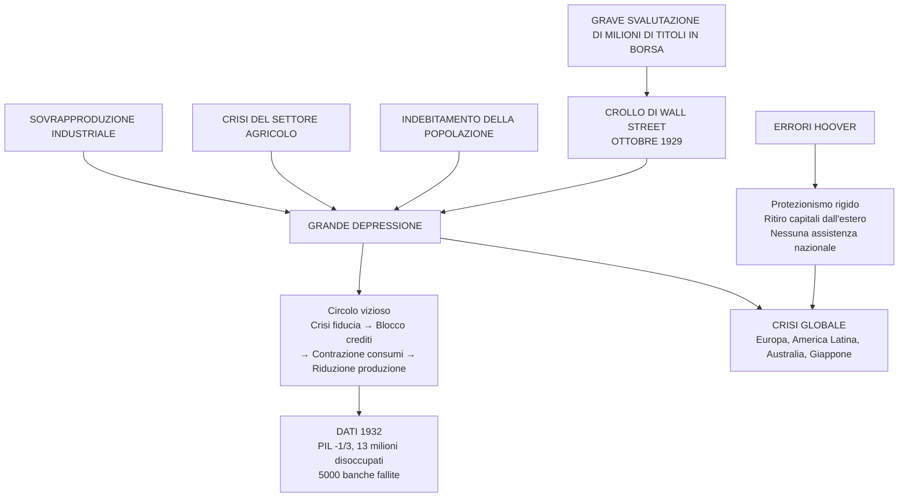
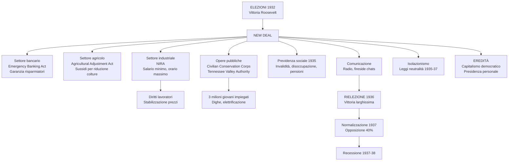
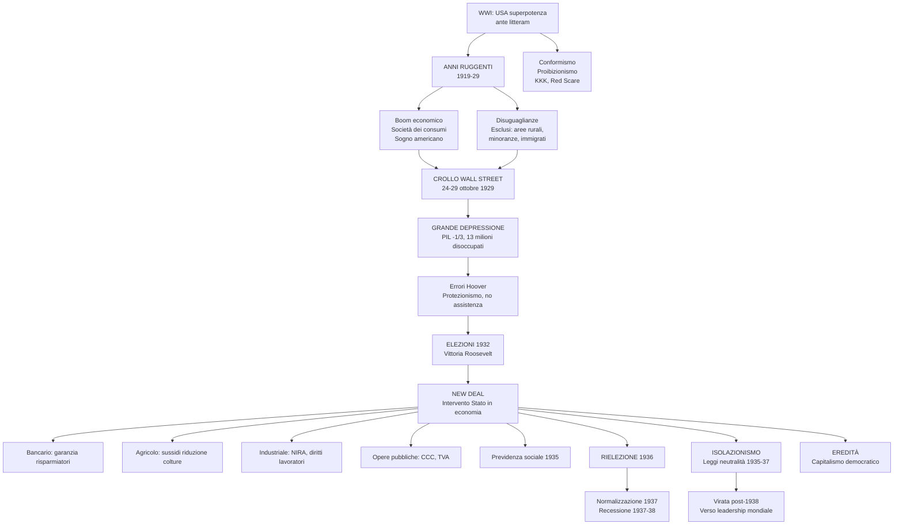

# Schema di Studio - Capitolo 3.10: L'inizio del secolo americano: anni ruggenti, crisi e New Deal

---

## Date fondamentali del capitolo

| Anno / Data | Evento |
|-------------|--------|
| **1919-29** | Gli Stati Uniti vivono i cosiddetti **«anni ruggenti»**: nasce il «sogno americano» |
| **1919** | XVIII emendamento: **proibizionismo** (entrato in vigore gennaio 1920, abrogato 1933) |
| **1920** | Elezioni presidenziali: vittoria del repubblicano **Warren Harding**; le donne ammesse al voto |
| **1921** | **Tetto di 350.000 immigrati** all'anno; protezionismo |
| **1924** | **Piano Dawes**: aiuti finanziari USA alla Germania e ai Paesi europei; tetto immigrati abbassato a **165.000** |
| **1925** | **Trattato di Locarno**: la Germania riconosce gli accordi di Versailles |
| **1928** | **Patto Briand-Kellogg**: rinuncia alla guerra come strumento di politica nazionale |
| **24 ottobre 1929** | **«Giovedì nero»**: crollo della Borsa di Wall Street |
| **29 ottobre 1929** | **«Martedì nero»**: 16 milioni di titoli svenduti; inizio della **Grande Depressione** |
| **Novembre 1932** | Elezioni presidenziali: eletto il democratico **Franklin Delano Roosevelt** |
| **9 marzo 1933** | ***Emergency Banking Act***: controllo statale sulle banche |
| **12 maggio 1933** | ***Agricultural Adjustment Act***: sussidi per riduzione superfici coltivate |
| **16 giugno 1933** | ***National Industry Recovery Act*** (NIRA): rilancio economia, diritti lavoratori, opere pubbliche |
| **Giugno 1933** | Istituito il ***Civilian Conservation Corps***: impiego giovani disoccupati |
| **Maggio 1933** | Istituita la ***Tennessee Valley Authority*** (TVA): sistemazione bacino del fiume Tennessee |
| **1935** | Sistema di **previdenza sociale nazionale**: sussidi invalidità, disoccupazione, pensioni |
| **Novembre 1936** | **Rielezione** di Roosevelt alla Casa Bianca |
| **1937-38** | Nuova recessione negli USA |
| **1935-37** | **Leggi sulla neutralità**: divieto vendita armi a Paesi belligeranti |

---

## 1. La guerra e le sue eredità

### 1.1 Il rafforzamento del governo centrale negli anni di guerra

La **Prima guerra mondiale** fu un passaggio cruciale per gli Stati Uniti: incise sulla vita politica, economica e sociale del Paese, proiettandolo sulla scena internazionale nel ruolo inedito di **superpotenza *ante litteram***.

In guerra, gli USA sperimentarono processi di **mobilitazione totale** analoghi a quelli dei Paesi europei:
- Il governo ricorse alla **coscrizione obbligatoria**: tra il 1917 e il 1919 furono chiamati alle armi **quattro milioni di uomini**, di cui due milioni inviati in Europa
- Lo **Stato federale** (centrale) **si rafforzò** a scapito delle prerogative degli Stati federati
- Intervento nel settore economico: gestione dell'industria bellica, approvvigionamento, rete ferroviaria

### 1.2 Propaganda e censura: i «nemici interni»

La società americana si ricompattò intorno alla causa del conflitto secondo modalità adottate nei Paesi belligeranti:
- **Potente propaganda** governativa
- **Leggi che limitarono fortemente le libertà**, colpendo libertà di opinione e di espressione

Il «**nemico interno**» fu individuato in:
- **Pacifisti** e organizzazioni radicali del movimento operaio schierate contro la guerra
- **Comunità tedesco-americana**: dovette «denazionalizzarsi»; circa **10.000 immigrati tedeschi** furono sottoposti a **internamento** come «stranieri nemici»

> Il concetto di «nemico interno» si lega alla propaganda di guerra: durante il primo conflitto mondiale, infatti, oppositori e pacifisti cominciarono a essere additati, dalla stampa dei vari Stati belligeranti, come veri e propri nemici da combattere.

**Conseguenze**:
- Sul piano internazionale: definitivamente esclusa la possibilità che la forte minoranza tedesca potesse spostare l'asse delle relazioni statunitensi verso la Germania
- Sul piano interno: si riconfermava preminente la matrice culturale britannica; l'identità nazionale americana era definita come **bianca, anglosassone e protestante** (**WASP**: *White, Anglo-Saxon, Protestant*)

### 1.3 La questione razzista e la rinascita del Ku Klux Klan

La crescita di un forte sentimento **nazional-patriottico** si tradusse in una recrudescenza delle violenze dei bianchi contro la popolazione nera.

**Antefatto**: nel **1915** il film di David W. Griffith ***The Birth of a Nation*** ebbe grande successo:
- Ambientato durante la guerra civile e la «ricostruzione» del Sud
- Compendio di **pregiudizi e stereotipi negativi sugli afroamericani**
- Esaltazione del **Ku Klux Klan (KKK)**

**Origini del KKK**:
- Creato dopo la **Guerra di secessione** da reduci dell'esercito sudista
- Scopo: «difendere» i bianchi dagli schiavi liberati, **conservare la tradizionale gerarchia**
- Governo federale lo represse considerandolo gruppo terroristico; stroncato negli anni Settanta dell'Ottocento
- Gli Stati federati del Sud promossero leggi per legalizzare la **segregazione** degli afroamericani

**Rinascita del KKK (1915)**:
- Ispirata al film di Griffith, da cui riprese i simboli: **cappuccio bianco** e **croce incendiata**
- Ingrossò le proprie fila con **violenze** contro:
  - **Afroamericani**
  - **Immigrati**
  - **Ebrei**
  - **Cattolici**
  - Chiunque fosse considerato «non americano**

**L'ingresso in guerra**:
- Soldati afroamericani inquadrati in unità a parte, con soli bianchi come ufficiali comandanti
- Discriminazione radicata anche nelle **città industriali del Nord**, dove la necessità di manodopera per le industrie belliche aveva stimolato la **migrazione interna** degli afroamericani dagli Stati del Sud
- Dopo la guerra: nuove violenze quando gli afroamericani furono incolpati dell'aumento della disoccupazione

**La presidenza Wilson fu contraddittoria**:
- **1919-20**: le donne furono ammesse al voto politico (elezioni presidenziali del 1920)
- Il governo non fece nulla per garantire agli afroamericani l'esercizio dei loro diritti politici, né per rimediare alla frattura razziale

### 1.4 La «paura dei rossi» e la repressione del movimento operaio

Il **biennio 1919-20** segnò il culmine della repressione del movimento operaio da parte delle autorità, spalleggiate dal consenso di ampi settori dell'opinione pubblica. Furono gli anni del cosiddetto ***Red Scare***, la **«paura rossa»**:
- Diffusasi sulla scia del successo della **rivoluzione bolscevica**
- In seguito ad alcuni **attentati dinamitardi** di matrice politica

La presenza di molti immigrati (per lo più europei) tra gli attivisti del movimento operaio fece sì che:
- L'**anticomunismo si saldasse alla xenofobia e al razzismo**
- Tra le caratteristiche del «vero americano» ci fosse l'**anticomunismo**

**Provvedimenti**:
- Migliaia di provvedimenti contro **sindacati, giornali e organizzazioni di sinistra**
- Arresti di massa, incarcerazioni, **deportazioni**
- Processi dove giudici e giurie condannavano gli imputati più per le loro idee che per i crimini commessi

**Il caso Sacco e Vanzetti**:
- **1921**: processo in Massachusetts contro **due anarchici italiani, Nicola Sacco e Bartolomeo Vanzetti**
- Accusati senza prove di rapine a mano armata con vittime
- Condanna a morte divenne un **caso internazionale**
- **Mobilitazione su scala globale** per contestare la parzialità del processo
- Sentenza eseguita nell'**agosto 1927**
- Riabilitazione postuma solo **cinquant'anni dopo**

### 1.5 L'eredità della guerra: conformismo e proibizionismo

La guerra lasciò in eredità agli anni Venti un clima di forte **conformismo** e di crociata morale di stampo puritano.

**Il proibizionismo**:
- **Divieto di produzione, vendita e trasporto di bevande alcoliche**
- Inscritto nella Costituzione americana nel **1919** con il **XVIII emendamento**
- Entrato in vigore nel **gennaio 1920**
- Abrogato nel **1933**
- Scopo: evitare i nefasti effetti dell'alcol sui costumi, in particolare quelli delle classi popolari
- Risultato: fonte di lucrosi **traffici illegali** per la **malavita organizzata**

> Gli anni Venti furono un'età dell'oro per i grandi gangster. Tra essi c'era il celebre italo-americano **Al Capone**, considerato il «nemico pubblico numero uno» fino al suo arresto (avvenuto per frode fiscale) nel 1931.

---

## 2. Gli «anni ruggenti» e il «sogno americano»

### 2.1 La nuova potenza mondiale

Gli Stati Uniti erano stati i **veri vincitori** della guerra:
- Contributo militare breve ma decisivo
- **Stravinto sul piano industriale e finanziario**

**Dati economici**:
- **1919**: le banche americane vantavano **credit all'estero per oltre 10 miliardi di dollari**, principalmente nei confronti dei vincitori europei
- Prima della guerra: esportazioni di materie prime e prodotti agricoli
- Dopo la guerra: prevalenza di **prodotti industriali**

**L'egemonia economica era indiscussa**. Secondo Wilson, gli USA avrebbero dovuto assumere un ruolo egemonico anche nella costruzione di un nuovo ordine mondiale, ma nel Paese maturò una scelta diversa.

### 2.2 Il ritorno dei repubblicani

Le **elezioni presidenziali del 1920** divennero una sorta di referendum sulla pace di Parigi e sulla partecipazione degli USA alla Società delle Nazioni.

**Il presidente repubblicano**:
- **Warren Harding** (1920-23): ostile all'internazionalismo di Wilson; ottenne una schiacciante vittoria
- **Calvin Coolidge** (1923-29): subentrato dopo la morte di Harding per malattia; eletto nel 1924
- **Herbert Hoover** (1929-33)

**Politiche repubblicane**:
- **Abbandono dell'internazionalismo wilsoniano**
- Ritorno alla «normalità»
- **Forte protezionismo** dal 1921: tariffe che non si ritorsero contro le esportazioni americane, vista la competitività dell'industria

**Restrizione all'immigrazione**:
- **1921**: tetto di **350.000 immigrati** all'anno
- **1924**: abbassato a **165.000** all'anno
- Cifre irrisorie rispetto ai flussi di prima della guerra
- Ripartizione per favorire l'immigrazione **anglosassone**

### 2.3 Una politica favorevole ai grandi gruppi d'affari

Le amministrazioni repubblicane sostennero il trend espansivo dell'economia:
- **Favorirono il mondo degli affari e della grande finanza**
- **Abrogarono o non applicarono** le leggi contro monopoli e **trust**
- **Politica fiscale generosa** con i grandi profitti: abbassamento delle imposte dirette

**Conseguenza**: **aumento delle disuguaglianze** sociali negli anni Venti:

| Categoria | Dato (1929) |
|-----------|-------------|
| Lo **0,1%** della popolazione | Controllava il **34%** del risparmio |
| L'**80%** della popolazione | Non aveva alcun risparmio |
| Il **20%** più ricco | Deteneva il **55%** del reddito nazionale |

> **Trust**: Associazione di imprese, sottoposte a un'unica direzione, che ha lo scopo di ridurre i costi di produzione e battere la concorrenza, imponendosi sul mercato.

### 2.4 Il boom economico

Superata la breve recessione postbellica, dal **1921-22** gli Stati Uniti conobbero una **crescita economica impetuosa**:

| Indicatore | Valore |
|------------|--------|
| **PIL** | Crebbe almeno del **50%** fino al 1929 |
| **Disoccupazione** | Riassorbita |
| **Produzione industriale** | Quasi **raddoppiò** |
| **Settore terziario** | Enorme sviluppo |
| **Produttività** | Incrementò grazie all'organizzazione scientifica del lavoro |

**Salari e orario di lavoro**:
- Varie categorie di lavoratori ebbero **salari più alti**
- **Diminuzione dell'orario di lavoro**

**Diffusione della prosperità**:
- **Certo grado di prosperità** in **fasce sempre più ampie della popolazione**
- Costo contenuto degli alimenti
- Costo decrescente dei beni voluttuari
- Formazione di una **società e una cultura del consumo** che nel Novecento avrebbero avuto una diffusione globale
- **Facile accesso al credito**: la possibilità di **acquistare a rate** fu decisiva

### 2.5 Il ruolo dell'industria automobilistica

Al cuore dell'espansione era l'**industria automobilistica**:

| Anno | Produzione auto |
|------|-----------------|
| **1916** | 500.000 auto |
| **1929** | ~**5,5 milioni** di pezzi |

- **Un'auto ogni sei abitanti**
- A questi numeri vanno aggiunti quelli di autobus, camion, trattori
- L'America si motorizzava a un ritmo formidabile e impensabile, negli stessi anni, per il Vecchio Continente

### 2.6 I beni durevoli

L'espansione era fondata su **beni durevoli**. Nelle case entrarono elettrodomestici:

| Elettrodomestico | Dato |
|------------------|------|
| **Frigoriferi** | Da 5.000 pezzi (1922) a quasi **un milione** (1929) |
| **Ferri da stiro** | Presenti nel **60%** delle case nel 1929 |
| **Aspirapolvere** | Diffusione massiccia |
| **Radio** | Nel 1929 il **40%** delle famiglie americane avevano un apparecchio radiofonico in casa |

### 2.7 Il ruolo della radio e dell'auto nella «nazionalizzazione» degli USA

Radio e automobile ebbero un ruolo cruciale nel modellare uno **stile di vita omogeneo**:

**La radio**:
- Portò in tutte le case una **lingua nazionale standardizzata**
- Notiziari e trasmissioni

**L'automobile**:
- Impulso a un programma di **costruzione di strade** e infrastrutture
- Elementi tipici del paesaggio: autosaloni, pompe di benzina, officine, motel

**Conseguenze**:
- Capillarità delle comunicazioni e del sistema di trasporti contribuì a **rompere l'isolamento delle campagne**
- Gli Stati Uniti cessavano di essere un Paese rurale:
  - Lavoratori attivi in agricoltura scesi al **21%** nel 1929 (erano il **41%** nel 1900)
  - Più di metà della popolazione viveva in città
  - Uno **stile di vita urbano** si imponeva ovunque

### 2.8 Il «sogno americano»: per molti ma non per tutti

In questi anni prese forma il cosiddetto **«sogno americano»**:
- Fondato sull'**individualismo**
- **Immagine ideale** di una società basata su:
  - Pari opportunità per tutti
  - Benessere
  - Possibilità di ascesa sociale

Gli anni Venti furono sentiti come speciali al punto da essere battezzati **«anni ruggenti»** (*Roaring Twenties*).

**Il cinema**:
- Con i suoi divi e dive, alimentò i sogni di promozione sociale e di benessere a portata di mano
- Diffondeva stili di abbigliamento, arredi, gesti, modi di dire e canzoni (dall'introduzione del sonoro nel 1927)

**Il mito del «sogno americano» era utile anche a coprire gli squilibri** e le profonde differenze geografiche dello sviluppo economico americano. Ampie fasce della popolazione ne erano escluse:

| Categoria esclusa | Motivo |
|-------------------|--------|
| **Aree rurali** | Agricoltura in crisi: ripresa europea → forte riduzione esportazioni; diminuzione dei prezzi |
| **Minatori** | Esclusi dal benessere |
| **Lavoratori di settori tradizionali** (tessile, abbigliamento) | Esclusi |
| **Minoranze, afroamericani, immigrati** | Esclusi o largamente esclusi |

### 2.9 Oltre il conformismo, una nuova vivacità culturale

Nonostante il clima puritano e conservatore, i *Roaring Twenties* furono un'epoca di grande **vivacità culturale**:

**Musica e danza**:
- **Jazz** e **charleston**: musiche e balli dirompenti rispetto alla tradizione

**Emancipazione femminile**:
- Le ***flappers***: ragazze con:
  - Tagli di capelli alla «maschietta»
  - Gonne corte
  - Viso truccato
  - Comportamenti anticonformisti
- Ruolo che solo le donne dei ceti superiori potevano permettersi
- Cinema e stampa diffusero un modello di indipendenza

**Intellettuali e letteratura**:
- Successo per riviste di orientamento progressista
- Nuovi linguaggi e tecniche narrative per raccontare criticamente le trasformazioni della società americana
- La **«generazione perduta»** o ***lost generation***: scrittori come **Ernest Hemingway** o **Francis Scott Fitzgerald**
  - Soggiornarono a lungo in Europa per sfuggire ai tratti più opprimenti della società americana
  - La cultura statunitense smetteva di essere tributaria di quella europea: i rapporti tra Nuovo e Vecchio Mondo cominciarono a rovesciarsi

> **Lost generation**: Nel mondo britannico l'espressione indica la generazione di giovani uomini falciata nel conflitto mondiale. Nel mondo statunitense fu attribuita a un gruppo di scrittori degli anni Venti, segnato dall'esperienza della guerra o dal clima del dopoguerra.

---

## 3. Il ruolo mondiale degli Stati Uniti

### 3.1 L'«americanizzazione» del mondo

Per gli Stati Uniti, la mancata ratifica del Trattato di Versailles significò l'avvio di un **internazionalismo diverso** da quello wilsoniano eppure inevitabile, visto il peso assunto dal Paese sulla scena mondiale.

**Ragioni del protagonismo americano**:

| Ragione | Descrizione |
|---------|-------------|
| **Nuova posizione** | La Grande guerra aveva conferito agli USA una posizione egemone rispetto alle potenze europee |
| **Egemonia economica** | Straordinario sviluppo nel quadro di un **sistema mondiale sempre più interdipendente** |
| **Saldo attivo della bilancia commerciale** | Impiegato per incrementare investimenti e prestiti verso l'estero |
| **Cambiamento dei rapporti culturali** | La modernità americana diventò un **riferimento globale**, non solo per le élite ma anche per le **masse**, grazie alla potenza comunicativa dei film di Hollywood |

Gli Stati Uniti esportavano un modello e l'**«americanizzazione» del mondo** muoveva i primi passi.

**Obiettivi dei governi degli anni Venti**:
- Non troppo distanti da quelli di Wilson
- Riportare una **pace stabile**
- Consolidare un **ordine internazionale di stampo liberale**
- Condizioni per uno sviluppo economico che avrebbe allontanato ogni tentazione rivoluzionaria

Le amministrazioni repubblicane immaginavano un **ruolo guida** per gli Stati Uniti, ma senza che ciò implicasse:
- Creazione di istituzioni sovranazionali mondiali
- Limitazioni di sovranità nazionale
- Nuovi interventi diretti

### 3.2 Debiti e riparazioni: una «diplomazia del dollaro» verso l'Europa

Una questione delicata negli anni del dopoguerra fu quella dei **crediti** che gli Stati Uniti vantavano in Europa.

**Il problema**:
- La Germania si rivelò incapace di pagare le enormi riparazioni imposte
- Gran Bretagna e Francia rivendicarono la sospensione dei pagamenti dei loro debiti verso gli USA

**La posizione americana**:
- Washington era pur **intransigente sul rimborso**
- Non condivideva l'impostazione punitiva di Versailles in tema di riparazioni
- Riteneva fondamentale **rilanciare le economie europee**

**Il piano Dawes (1924)**:
- Gli USA dimostrarono la propria forza diplomatica ed economica
- **Rivide entità, modi e tempi dei pagamenti**
- Previsto un **ingente prestito alla Germania** per avviare il risanamento della sua economia

**Conseguenze**:
- Le potenze europee riconoscevano la **supremazia degli USA** e la necessità dei loro capitali per stabilizzare la situazione
- Per gli Stati Uniti: versione più morbida della «**diplomazia del dollaro**» condotta con i Paesi dell'America Latina

### 3.3 Gli obiettivi della pace e del disarmo: il patto Briand-Kellogg

Per alcuni anni il piano Dawes **stabilizzò la situazione europea** e distese i rapporti tra Germania e Francia.

**Il Trattato di Locarno (1925)**:
- La Germania riconosceva i confini occidentali stabiliti a Versailles
- Sembrò aprirsi un dopoguerra di **pace e cooperazione internazionale**

**Pace e disarmo** furono gli altri due obiettivi perseguiti dagli USA negli anni Venti.

**Il patto Briand-Kellogg (1928)**:
- Dal nome del ministro degli Esteri francese (Briand) e del Segretario di Stato americano (Kellogg)
- Sanciva la **rinuncia alla guerra** come strumento di politica nazionale
- Previsto inizialmente come patto bilaterale Francia-Stati Uniti
- Poi aperto a qualsiasi aderente
- Sottoscritto subito da **quindici Paesi**, tra cui Germania, Italia, Gran Bretagna e Giappone
- Raggiunse **sessantatré firme** nel 1939
- **Formalmente in vigore ancora oggi**

> Il primo articolo del trattato affermava: «Le alte parti contraenti dichiarano solennemente in nome dei loro popoli rispettivi di condannare il ricorso alla guerra per la risoluzione delle divergenze internazionali e di rinunziare a usarne come strumento di politica nazionale nelle loro relazioni reciproche».

**Valore del patto**:
- Più che altro una **dichiarazione di intenti**
- Sprovvisto di indicazioni su come garantirne l'applicazione
- Tuttavia, ebbe un ruolo nell'elaborazione del **diritto internazionale**
- Offrì una base per la nozione di **«crimine contro la pace»**
- Per questa nozione, all'indomani della Seconda guerra mondiale, sarebbero stati processati esponenti del regime tedesco nazista e di quello giapponese (processi di **Norimberga** e **Tokyo**)

---

## 4. La crisi del 1929: da New York al mondo

### 4.1 Il crollo di Wall Street: l'inizio della Grande Depressione

L'incremento dei consumi degli anni Venti sembrava aver innescato una crescita illimitata. Il sogno americano si interruppe **sei mesi dopo** l'insediamento del presidente repubblicano Herbert Hoover.

**Il «Giovedì nero» (24 ottobre 1929)**:
- Alla Borsa di Wall Street, a New York
- Il prezzo delle azioni, gonfiato da un trend speculativo, iniziò a scendere
- Gli operatori cominciarono a vendere, poi a **svendere con un effetto a valanga**
- **12 milioni di azioni** subirono una forte riduzione del loro valore

**Il «Martedì nero» (29 ottobre 1929)**:
- Le vendite riguardarono **16 milioni di titoli**
- Grossi investimenti, risparmi, speranze di ricchezza divennero **carta straccia**
- In una settimana le perdite ammontarono a circa **15 miliardi di dollari**
- La caduta proseguì sino alla fine dell'anno, sommando **40 miliardi di perdite**
- Cifra **superiore alle riparazioni di guerra** accollate alla Germania

**Le cause immediate**:
- La Borsa scontava la **fine di un periodo di euforia e di grandi speculazioni**
- **Ottimismo** e **assenza di controlli** da parte delle autorità
- Enorme crescita del mercato finanziario e dei fenomeni speculativi
- Il valore di titoli e azioni era cresciuto di continuo, ma **senza aggancio concreto con l'economia reale**
- Moltissimi si erano illusi di potersi arricchire facilmente, indebitandosi per comprare azioni

**Conseguenze**:
- Emersero tutti i **problemi strutturali** accumulati nel decennio precedente
- La crisi divenne generale
- Gli Stati Uniti, e sulla loro scia gran parte del mondo, entrarono nell'era della **Grande Depressione**
- Crisi economica di **gravità e durata senza precedenti** nella storia del capitalismo
- **Pesanti conseguenze sociali e politiche**

### 4.2 Le cause della Grande Depressione negli Stati Uniti

Alla base del cataclisma ci fu una serie di **concause**.

**Il settore industriale - sovrapproduzione**:

Sempre maggiori quantità di prodotti restavano invendute perché:
- **Le esportazioni avevano rallentato** dopo il 1925:
  - Le economie europee si erano riprese
  - Avevano reagito al protezionismo americano alzando le tariffe
- **Il mercato interno si era saturato**:
  - L'espansione si era basata su beni durevoli (auto, elettrodomestici)
  - La squilibrata distribuzione dei redditi aveva impedito di ampliare ulteriormente il numero di consumatori

**Il settore agricolo**:

- In sofferenza da anni
- Nel dopoguerra: **costante calo dei prezzi**
- Reddito dei coltivatori americani nel 1929: **un terzo del reddito medio nazionale**
- Gravitante **situazione debitoria** (endemica nelle campagne, a causa dei cicli dell'agricoltura)
- Molte terre erano **ipotecate**

**L'indebitamento collettivo**:
- La facilità di accesso al credito aveva stimolato un **indebitamento collettivo**
- **Mutui** e **vendite a rate** avevano sostenuto i consumi e il mercato immobiliare
- Il sistema bancario americano, fatto di tanti **piccoli istituti**, era esposto e vulnerabile

### 4.3 Le dimensioni della crisi

Alla fine del 1929 si innescò un **circolo vizioso**:

| Fase | Descrizione |
|------|-------------|
| **Crisi della fiducia e della liquidità** | Molti correntisti ritirarono dalle banche i loro risparmi |
| **Blocco dei crediti** | Le banche rifiutavano prestiti e mutui immobiliari |
| **Contrazione dei consumi** | Crollo dei redditi + blocco dei crediti = ridotta capacità di acquisto; la paura induceva a non spendere |
| **Riduzione della produzione** | Aziende producevano meno |
| **Calo dei prezzi agricoli** | Crisi del settore primario |
| **Fallimenti di banche e aziende** | Licenziamenti e disoccupazione |

**Entro il 1932**:

| Indicatore | Valore |
|------------|--------|
| **PIL** | Ridotto di **un terzo** |
| **Produzione industriale** | Ridotta di **più della metà** |
| **Banche fallite** | Oltre **5000** |
| **Correntisti persero i depositi** | **9 milioni** |
| **Imprese chiuse** | **32.000** |
| **Disoccupati** | Circa **13 milioni** |
| **Agricoltori persero la terra** | **Un terzo** |
| **Senza casa** | Moltissimi |
| **Settore edile** | Bloccato |

Tutta l'economia del Paese sembrava in dissoluzione e con essa il tessuto sociale.

### 4.4 La crisi diventa globale

La **crisi era diventata globale**. La questione del debito era stata decisiva:
- Negli anni Venti la soluzione al problema dell'indebitamento e delle riparazioni tedesche era stata trovata in **ulteriori prestiti e debiti**
- Questi avevano sostenuto gli scambi commerciali
- Per qualche anno il sistema aveva funzionato
- Alla fine si era inceppato
- Le **interdipendenze** che si erano create servirono solo a diffondere la crisi, non a governarla

Da questo punto di vista, anche la crisi del 1929 era un **prodotto della Grande guerra** e dei limiti del Trattato di Versailles nel costruire un nuovo ordine mondiale.

**La diffusione mondiale della crisi**:
- Partenza da New York (24 ottobre 1929)
- Diffusione verso: **Europa, America Latina, Australia, Giappone**

**La caduta del reddito e della produzione industriale tra 1929 e 1932** (dati con 1929 = 100):

| Paese | PIL nel 1932 | Produzione industriale nel 1932 |
|-------|--------------|---------------------------------|
| Austria | 80 | 62 |
| Francia | 86 | 74 |
| Germania | 77 | 61 |
| Regno Unito | 95 | 89 |
| Italia | 98 | 86 |
| Olanda | 93 | 84 |
| Spagna | 97 | 84 |
| **Stati Uniti** | **73** | **62** |

### 4.5 Gli errori dell'amministrazione Hoover

Alcune decisioni di Hoover contribuirono alla catastrofe.

**Politica interna**:
- Fedele ai principi del **liberismo**
- Pensava che la risposta alla crisi dovesse venire dall'**iniziativa privata**
- **Interventi pubblici limitati**:
  - Rifiutò di varare **programmi nazionali di assistenza** per i più colpiti
  - Demandò questo compito alla carità privata e ai governi locali (risorse molto ridotte)
  - Approvò solo stanziamenti per opere pubbliche, ma in misura troppo modesta per riassorbire la disoccupazione
- **1932**: dotò un'agenzia federale di quasi **2 miliardi di dollari** per fare prestiti a banche, imprese, ferrovie e società di assicurazioni in difficoltà
  - L'opinione pubblica ritenne un favore verso i ricchi

**Politica internazionale**:
- **Protezionismo ancora più rigido**: nel 1930 le tariffe doganali raggiunsero livelli stratosferici
- Investimenti e prestiti all'estero furono progressivamente **ritirati**
- Provocarono la diminuzione delle esportazioni (**del 60% dal 1929 al 1932**)

**Conseguenze in Europa**:
- Con la **fine dell'afflusso di capitali americani**, la Germania interruppe di nuovo il pagamento delle riparazioni
- Al protezionismo statunitense risposero **altri protezionismi**
- I **volumi dei traffici internazionali si ridussero drasticamente**
- Il sistema multilaterale degli scambi lasciò il passo all'**isolamento**
- Ogni Paese cercò di costruire un proprio spazio economico e monetario autosufficiente

---

## 5. Il *New Deal*: contro la crisi, un progetto per il futuro

### 5.1 Un nuovo presidente e un nuovo patto

Alle **elezioni presidenziali del 1932**, il Partito repubblicano ripropose il presidente uscente Hoover. La maggioranza degli elettori votò in primo luogo **contro di lui**, conferendo una netta vittoria al democratico **Franklin Delano Roosevelt**.

**Il profilo di Roosevelt**:
- Aveva già ricoperto incarichi di governo con Wilson
- Era stato candidato alla vicepresidenza nel 1920
- Si era ritirato temporaneamente dalla scena pubblica a causa di una malattia che gli avrebbe lasciato una **disabilità permanente alle gambe**
- Dal **1929 al 1932**, come governatore dello Stato di New York, varò **programmi d'assistenza ai disoccupati** finanziati dallo Stato
- Questa politica sociale gli guadagnò ampi consensi

**Lo slogan *New Deal*** («Nuovo corso» o «Nuovo patto»):
Indicava una doppia cesura rispetto agli ultimi anni:
- Gli Stati Uniti dovevano recuperare **fiducia e ottimismo**
- Occorreva un **nuovo patto con i cittadini**: il ruolo dello Stato doveva crescere, offrendo maggiore protezione e riequilibrando la distribuzione del reddito

**Il contesto internazionale**:
- La crisi del 1929 aveva incrinato il modello capitalistico
- Messo in discussione il **nesso tra capitalismo e sistema liberal-democratico**
- Il mondo ricercava **modelli alternativi**:
  - L'**URSS**: sulla via di una rapida industrializzazione e crescita economica
  - Il **corporativismo** delle dittature di destra: fascismo italiano, nazismo tedesco, regime autoritario giapponese

### 5.2 Le misure in campo finanziario

Nei primi mesi di governo Roosevelt agì nei tre settori cruciali dell'economia.

**Settore bancario e finanziario - *Emergency Banking Act* (9 marzo 1933)**:
- Tutte le banche dovettero chiudere per qualche giorno
- Lo Stato ne controllò i conti e la solidità
- La **banca centrale** (Federal Reserve Bank) ampliò i suoi **poteri di controllo**
- Il governo si fece **garante dei piccoli risparmiatori** in caso di fallimento di una banca

**Scopo**:
- Restituire fiducia ai correntisti
- Scongiurare ulteriori corse al ritiro dei depositi bancari
- Consolidare il sistema evitando rischi di nuove speculazioni

**Politica monetaria**:
- **Opposta a quella di Hoover**
- **Svalutazione del dollaro**
- Puntando su una certa **inflazione**
- Rimettere in circolazione liquidità per dare impulso positivo all'economia

### 5.3 Le misure nel settore agricolo

***Agricultural Adjustment Act* (12 maggio 1933)**:
- Offriva **sussidi** ai contadini che avessero ridotto le superfici coltivate
- Scopo: diminuire la produzione
- **Riducendo l'offerta, i prezzi agricoli sarebbero risaliti**

### 5.4 Le misure nel settore industriale

***National Industry Recovery Act* (NIRA, 16 giugno 1933)**:
- Doveva **rilanciare la ripresa economica** – affari e occupazione – sotto l'egida del governo
- Il governo patrocinava l'introduzione di «codici per la concorrenza leale»:
  - Favorirono la nascita di monopoli
  - Ma introdussero una **stabilizzazione dei prezzi**
  - E una serie di **diritti per i lavoratori**:
    - **Salario minimo**
    - **Orario massimo**

**Logica**:
- Un salario dignitoso avrebbe favorito i consumi
- Contenere l'orario individuale serviva anche a incrementare l'occupazione

### 5.5 Il programma di opere pubbliche

Nell'ambito del NIRA fu creata una serie di agenzie federali incaricate di promuovere un **ampio programma di opere pubbliche**:

**Obiettivi**:
- Aiutare a riassorbire la disoccupazione
- Migliorare le infrastrutture del Paese: strade, ponti, scuole, ospedali, edifici pubblici, aeroporti

***Civilian Conservation Corps* (marzo 1933)**:
- Per impiegare **giovani disoccupati e celibi**
- Fascia d'età tra i 18 e i 25 anni, poi ampliata tra i 17 e i 28
- In progetti di **tutela dell'ambiente**
- A beneficiarne furono in circa **3 milioni**, fino al 1942

***Tennessee Valley Authority* (maggio 1933)**:
- Doveva sovrintendere alla sistemazione del bacino del fiume Tennessee
- Progetto destinato a diventare **simbolo del *New Deal***
- Costruzione di dighe per:
  - Controllo delle acque
  - Miglioramento della navigazione fluviale
  - Fornitura di **elettricità a migliaia di famiglie** per la prima volta

### 5.6 La rielezione del 1936: un presidente carismatico

La **spinta riformista** proseguì nell'arco del mandato.

**1935**: di fronte a una ripresa economica modesta e a una disoccupazione riassorbita solo in parte e lentamente:
- **Intensificazione dell'intervento statale** per le opere pubbliche
- **Nuova legge fiscale** che aumentava le tasse per i redditi più alti
- Introduzione di un **sistema di previdenza sociale nazionale**:
  - Sussidi di **invalidità**
  - Sussidi di **disoccupazione**
  - **Pensioni di vecchiaia**
  - Da cui tuttavia erano esclusi i braccianti agricoli e i lavoratori domestici

**Eleanor Roosevelt**:
- La *first lady* fu una sostenitrice appassionata delle **politiche sociali**
- Condusse un'intensa attività pubblica
- Anche a sostegno dei **diritti civili degli afroamericani**

**Le presidenziali 1936**:
- Roosevelt ottenne una **vittoria larghissima**
- Non era più un voto di protesta, ma un **mandato a proseguire** nella sua azione
- Il successo fu determinato anche dalla grande **abilità comunicativa** di Roosevelt

**Le *fireside chats* («chiacchierate al caminetto»)**:
- **Radio**: decisiva, sempre più diffusa (nel 1945 l'88% delle famiglie ne possedeva una)
- Roosevelt **entrava nelle case** per illustrare i suoi programmi
- Stile **informale, rassicurante e paternalista**
- Tra il 1933 e il 1944 i discorsi radiofonici di Roosevelt furono **trenta**

**La costruzione del consenso**:
- Manifesti pubblicitari
- Comunicati stampa
- Discorsi pubblici e viaggi
- Costruzione di un'immagine mitica del *New Deal* e del suo artefice
- Un presidente che, restando al di sopra della politica dei partiti, avrebbe portato il Paese fuori dalla Depressione

**La leadership carismatica**:
- Roosevelt dimostrò che l'esercizio di una leadership carismatica e capace di usare i moderni mezzi di comunicazione poteva verificarsi **anche in un contesto democratico-liberale**
- Non solo nei regimi autoritari o totalitari che si imponevano in quegli anni

### 5.7 Una «normalizzazione» del programma riformista

Dal **1937** il *New Deal* si «stabilizzò»:
- Non vi furono ulteriori spinte in avanti
- Le misure già attuate rimasero in vigore

**Dinamiche interne**:
- Benché Roosevelt godesse di ampio consenso, circa il **40%** degli americani disapprovava il *New Deal*
- I cambiamenti radicali non potevano riscuotere l'unanimità

**L'opposizione** si appuntava sul:
- **Ruolo che lo Stato centrale** aveva assunto nelle vite dei cittadini:
  - Come datore di lavoro
  - Come erogatore di servizi assistenziali
  - Come orientatore dello sviluppo attraverso gli investimenti nelle opere pubbliche
- Ruolo **estraneo alla tradizione liberale americana**
- Secondo i critici, nel settore economico lo Stato diventava un **concorrente sleale dell'iniziativa privata**
- Le associazioni imprenditoriali accusavano il governo di **limitare la libertà d'impresa**

**Le accuse a Roosevelt**:
- Di flirtare con il **socialismo**
- O con il **corporativismo fascista**

**La Corte costituzionale**:
- Alcuni dei provvedimenti costitutivi del *New Deal* (a cominciare dal NIRA) furono giudicati **illegittimi**
- Il governo fu costretto a riformularli per aggirare le sentenze

**La recessione del 1937-38**:
- Una piccola recessione fece traballare la fiducia nel piano di riforme
- Ridusse le risorse su cui si poteva contare

### 5.8 New Deal e isolazionismo

**Politica estera - giugno 1933**:
- Maturò la prima scelta **isolazionista**
- Roosevelt decise di **non partecipare alla Conferenza economica di Londra**:
  - 66 Paesi riuniti per stabilizzare il quadro monetario
  - Rilanciare il commercio internazionale
- Il presidente USA voleva essere **libero in materia di moneta**
- Scelse di svalutare il dollaro e intraprendere una politica inflazionistica per risollevare il mercato interno

**Scarso interesse per le conferenze sul disarmo**:
- Nemmeno all'ascesa del **militarismo giapponese**, pur condannato a parole, furono opposte reazioni concrete

**Le leggi sulla neutralità (1935-37)**:
- Impedivano di vendere armi a Paesi belligeranti
- Clausole applicate anche alle parti in conflitto nella **guerra civile spagnola** (1936)

> Gli Stati Uniti di Roosevelt abbracciarono la linea del non-intervento durante la Guerra civile spagnola (1936-39). Imposero un embargo sulla vendita di armi alla Spagna.

**America Latina**:
- Gli USA mantennero il tradizionale attivismo
- Regione segnata da forte **instabilità politica** e dall'affermazione di **regimi autoritari e dittature**

**La virata (post 1938)**:
- Solo dopo il 1938 Roosevelt iniziò una virata politica
- Avrebbe portato gli USA ad assumere quel **ruolo di leadership mondiale** che era stato rifiutato nel 1919

### 5.9 L'eredità del New Deal

**Limiti economici**:
- Il *New Deal* mostrò **molti limiti**
- La Grande Depressione non poteva dirsi superata
- I livelli di disoccupazione erano alti
- Il monte salari complessivo inferiore a quello registrato prima del 1929
- L'uscita dalla crisi sarebbe avvenuta solo con l'avvio della **gigantesca mobilitazione industriale all'inizio della Seconda guerra mondiale**

**Disoccupazione negli USA (1929-42)**:
- **1929**: Crollo della Borsa (valore basso)
- **1933**: Picco massimo (inizio del New Deal) a circa **13 milioni**
- **1937-38**: Piccola risalita
- **1939**: Inizio della Seconda guerra mondiale (calo drastico)
- **1942**: Ritorno a valori minimi

**Spostamento del baricentro politico**:
- Il *New Deal* accrebbe il potere dell'**autorità federale** a scapito di quello degli Stati
- Fu una tappa decisiva per lo spostamento del baricentro del sistema politico americano sulla cosiddetta **«presidenza personale»**
- Il presidente divenne il **centro della politica nazionale**

**Svolta politica e culturale di grande portata**:

| Aspetto | Significato |
|---------|-------------|
| **Rapporti Stato-cittadino** | Revisione: lo Stato acquisiva compiti di controllo, riequilibrio e impulso nel settore economico |
| **Ruolo dello Stato** | Accresciuto |
| **Esperimento di riforma del capitalismo** | All'interno di un sistema liberaldemocratico |

**Il contesto**:
- In una fase storica in cui sembrava che il modello capitalista liberale avesse esaurito le sue risorse
- Sembrava che le sorti del capitalismo fossero legate a forme politiche autoritarie o totalitarie
- Gli Stati Uniti dimostrarono la praticabilità di un **modello di capitalismo democratico**

**L'eredità**:
- Questa combinazione tra diritti individuali e tutela dello Stato
- Impresa privata e programmazione economica pubblica
- Profitti privati e promozione del benessere collettivo
- Divenne la promessa con cui gli Stati Uniti entrarono nella Seconda guerra mondiale
- Ciò che avrebbero esportato in tutto il mondo al termine del conflitto

---

## 6. Le domande degli storici: quale bilancio per il New Deal?

### 6.1 Dal punto di vista dei cittadini

Se ci poniamo dal punto di vista di coloro che persero il lavoro dopo la crisi economica del 1929, il «nuovo corso per il popolo americano» promesso da Roosevelt ai suoi elettori durante la campagna presidenziale del 1932 fu effettivamente tale.

**In aperto contrasto con il liberismo di Hoover**:
- Roosevelt intervenne nell'economia con una serie di azioni volte a:
  - Riordinare il sistema bancario
  - Sostenere i gruppi sociali in difficoltà
  - Attuare un programma di opere pubbliche
  - Riorganizzare i rapporti fra imprenditori e sindacati

**Benché sul piano astratto dei modelli economici il *New Deal* continui a essere oggetto di giudizi contrastanti**, è innegabile che esso rappresentò un **elemento di forte discontinuità** nella storia politica degli Stati Uniti.

### 6.2 I risultati concreti

Altrettanto innegabile è che Roosevelt ottenne **risultati notevoli**, ma ciò non bastò a risollevare il Paese dal flagello della disoccupazione.

**Osservazioni degli storici dell'economia Rondo Cameron (1925-2001) e Larry Neal (1941)**:
- Alla metà degli anni Trenta il **reddito pro capite** era risalito ai livelli del decennio precedente
- Nel **1937** l'economia americana entrò in una nuova fase di recessione
- La disoccupazione tornò **oltre la quota di 10 milioni**

### 6.3 La prospettiva della politica internazionale

Se guardiamo dalla prospettiva della politica internazionale, il bilancio del *New Deal* appare decisamente positivo.

**Pur trattandosi di una risposta nazionale a una crisi mondiale**, la politica di Roosevelt ebbe l'effetto di **rafforzare la leadership globale** del proprio Paese.

**Secondo lo storico anglo-tedesco Kiran Klaus Patel (1971)**:
- Con il *New Deal* l'America mostrò al mondo un modello di Stato in grado di **conciliare democrazia e capitalismo**
- Così facendo, pose le basi per l'**egemonia politica** che la vittoria della Seconda guerra mondiale le avrebbe conferito

---

## Schema riepilogativo: dagli anni ruggenti al New Deal

