# Schema di Studio Breve - Capitolo 3.10: L'inizio del secolo americano: anni ruggenti, crisi e New Deal

---

## Date fondamentali del capitolo

| Anno / Data | Evento |
|-------------|--------|
| **1919-29** | **Anni ruggenti**: sviluppo del «sogno americano» |
| **1920** | Elezione di **Warren Harding**; **voto politico alle donne** |
| **1921** | **Protezionismo** e tetto di **350.000 immigrati/anno** |
| **1924** | **Piano Dawes**: capitali USA alla Germania e all'Europa |
| **1925** | **Trattato di Locarno**: la Germania riconosce gli accordi di Versailles |
| **1928** | **Patto Briand-Kellogg**: rinuncia alla guerra come strumento politico |
| **1919-33** | **Proibizionismo**: divieto di produzione, vendita e trasporto di alcolici |
| **24-29 ottobre 1929** | **Crollo di Wall Street** e inizio della **Grande Depressione** |
| **Ottobre 1932** | Elezione di **Franklin Delano Roosevelt** |
| **1933** | Inizio del ***New Deal*** |
| **1936** | **Rielezione** di Roosevelt |
| **1935-37** | **Leggi sulla neutralità**: prevale l'isolazionismo |

---

## 1. La guerra e le sue eredità

### 1.1 Il rafforzamento del governo centrale negli anni di guerra

La Prima guerra mondiale proiettò gli USA come **superpotenza** e impose una mobilitazione totale: tra 1917 e 1919 la **coscrizione obbligatoria** arruolò **4 milioni di uomini**, **2 milioni** dei quali inviati in Europa. Il contributo militare fu breve rispetto a quello europeo, ma decisivo; soprattutto, mostrò la superiorità industriale, finanziaria e logistica americana.

Lo **Stato federale** si rafforzò sugli Stati federati intervenendo in **industria bellica**, approvvigionamenti, carburanti e **ferrovie**: uno spartiacque nel ruolo economico del governo centrale, che anticipa il tema del futuro intervento pubblico del New Deal.

### 1.2 Propaganda e censura: i «nemici interni»

**Propaganda** e leggi restrittive limitarono **opinione ed espressione**. Il «nemico interno» fu identificato in **pacifisti** e radicali del **movimento operaio**: il dissenso veniva presentato come tradimento della nazione in guerra.

Colpita anche la **comunità tedesco-americana**: circa **10.000** tedeschi non naturalizzati furono internati. Si consolidò l'identità **WASP**: bianca, anglosassone, protestante, quindi escludente verso minoranze etniche, religiose e politiche.

> Il «nemico interno» nasce nella propaganda di guerra: oppositori e pacifisti vengono presentati come nemici da combattere.

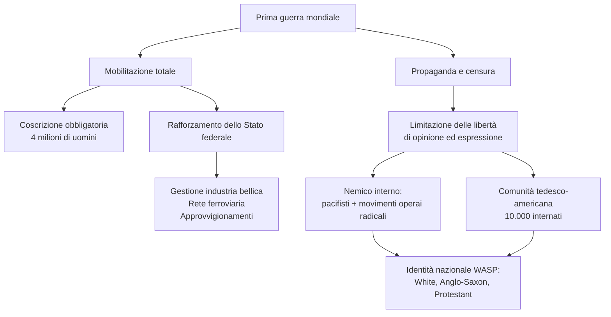

### 1.3 La questione razzista e la rinascita del Ku Klux Klan

Il nazionalismo di guerra aggravò le **violenze razziste**. Nel **1915** ***The Birth of a Nation*** diffuse stereotipi anti-afroamericani ed esaltò il **KKK**, contro le proteste della **NAACP** (**1909**).

Il KKK originario, nato dopo la **Guerra di secessione**, voleva mantenere subordinati gli afroamericani; represso negli anni Settanta dell'Ottocento, rinacque nel **1915** con **cappuccio bianco** e **croce incendiata**, colpendo **afroamericani, immigrati, ebrei e cattolici**. Il nuovo Klan non difendeva solo la segregazione del Sud: pretendeva di stabilire chi fosse davvero «americano».

In guerra i **soldati afroamericani** restarono separati. Nel Nord industriale la migrazione nera dal Sud fu poi associata alla disoccupazione e scatenò violenze. Wilson: **voto alle donne nel 1920**, ma nessuna vera tutela dei diritti afroamericani.

| Aspetto | KKK originale (post-Guerra civile) | KKK rinato (1915) |
|---------|-----------------------------------|-------------------|
| **Obiettivo principale** | «Difendere» i bianchi dagli schiavi liberati | Combattere chiunque fosse «non americano» |
| **Bersagli** | Afroamericani | Afroamericani, immigrati, ebrei, cattolici |
| **Simboli** | Creati ex novo | Cappuccio bianco, croce incendiata (dal film di Griffith) |
| **Status legale** | Represso come gruppo terroristico | Tollerato e in espansione |

### 1.4 La «paura dei rossi» e la repressione del movimento operaio

Nel **1919-20** esplose il ***Red Scare***, da rivoluzione bolscevica e attentati politici. Poiché molti attivisti operai erano immigrati, anticomunismo, **xenofobia e razzismo** si saldarono. Sindacati, giornali e sinistra subirono **arresti di massa**, carcere e deportazioni.

Caso simbolo: **Sacco e Vanzetti**, anarchici italiani processati nel **1921** senza prove convincenti, giustiziati nell'**agosto 1927** e riabilitati postumi cinquant'anni dopo.

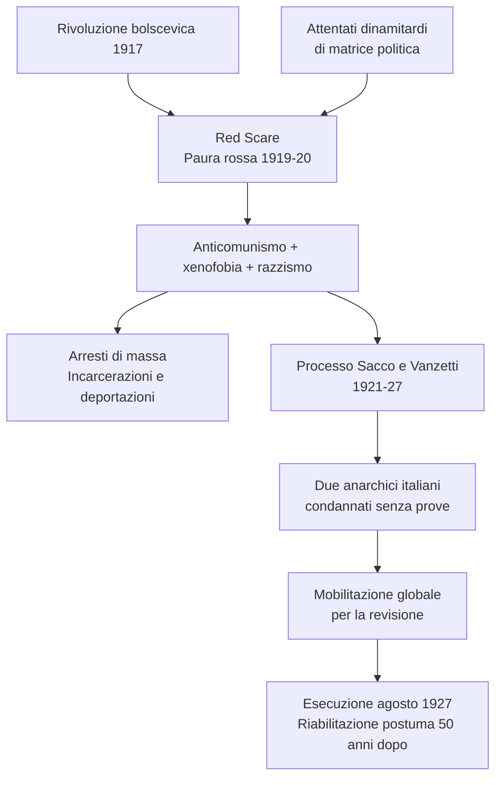

### 1.5 L'eredità della guerra: conformismo e proibizionismo

La guerra lasciò **conformismo** e moralismo puritano. Il **proibizionismo** (**XVIII emendamento**, **1919**, in vigore dal **1920**, abrogato nel **1933**) vietò produzione, vendita e trasporto di alcolici.

Voleva correggere i costumi, soprattutto delle classi popolari, ma alimentò traffici illegali e **malavita organizzata**: età dei gangster come **Al Capone**, arrestato nel **1931** per frode fiscale. Anche qui emerge una tensione tipica del dopoguerra americano: moralismo pubblico, repressione e crescita di economie illegali.

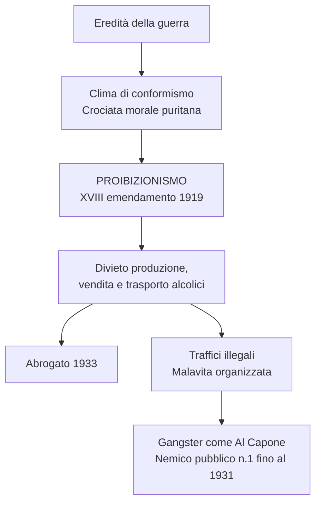

---

## 2. Gli «anni ruggenti» e il «sogno americano»

### 2.1 La nuova potenza mondiale

Gli USA vinsero soprattutto sul piano **industriale e finanziario**: nel **1919** avevano **oltre 10 miliardi di dollari** di crediti esteri e esportavano sempre più **prodotti industriali**. Prima della guerra vendevano soprattutto materie prime e prodotti agricoli; dopo le commesse belliche si affermarono come potenza manifatturiera. Wilson voleva una guida politica mondiale, ma prevalse la riluttanza a responsabilità internazionali dirette.

### 2.2 Il ritorno dei repubblicani

Nel **1920** vinse il repubblicano **Warren Harding**, contro internazionalismo wilsoniano e Società delle Nazioni. I repubblicani governarono con **Harding**, **Coolidge** (1923-29) e **Hoover** (1929-33), in nome della «normalità».

Dal **1921**: **protezionismo** e restrizioni migratorie, da **350.000 immigrati/anno** nel 1921 a **165.000** nel 1924, favorendo gli anglosassoni.

La «normalità» repubblicana significava meno internazionalismo politico, più difesa del mercato interno e selezione etnica dell'immigrazione. Gli USA restavano globali per finanza e industria, ma volevano proteggere società e politica interna dalle pressioni esterne e dai conflitti europei.

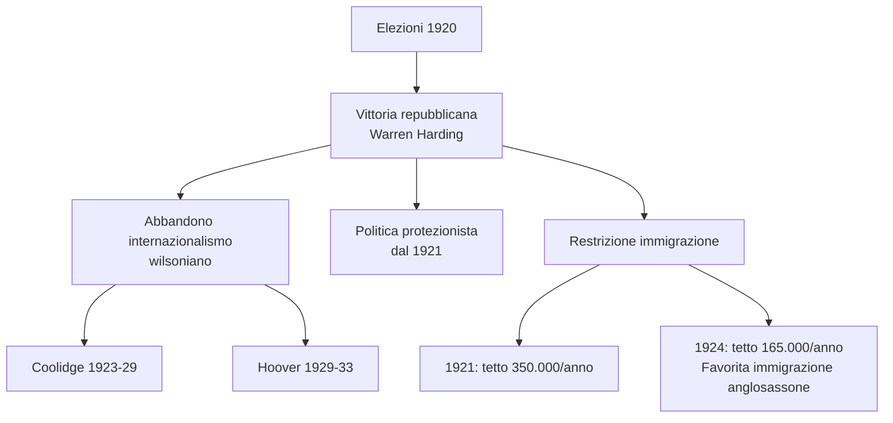

### 2.3 Una politica favorevole ai grandi gruppi d'affari

Le amministrazioni repubblicane favorirono **affari e finanza**: norme anti-**trust** trascurate, grandi concentrazioni rafforzate (**Standard Oil**, **General Electric**, **General Motors**, **Ford**, **Chrysler**).

La fiscalità premiò i profitti: nel **1929** lo **0,1% controllava il 34% del risparmio**, l'**80% non aveva risparmi**, il **20% più ricco aveva il 55% del reddito nazionale**.

> **Trust:** associazione di imprese sottoposte a direzione unica per ridurre costi, battere la concorrenza e imporsi sul mercato.

Questa concentrazione della ricchezza è centrale per capire la crisi: se salari e risparmi della maggioranza restano limitati, il mercato interno non può assorbire all'infinito la produzione crescente. Il benessere degli anni ruggenti era reale, ma poggiava su basi sociali molto diseguali.

### 2.4 Il boom economico

Dal **1921-22** al 1929: **PIL +50%**, disoccupazione riassorbita, industria quasi raddoppiata, terziario in crescita. Produttività, salari e consumi salirono grazie a **organizzazione scientifica del lavoro** e **rate**. Il credito rese accessibili beni costosi, ma aumentò la vulnerabilità quando redditi e occupazione crollarono.

Traino: **automobile**, da **500.000** nel 1916 a **5,5 milioni** nel 1929, un'auto ogni sei abitanti. L'auto generò strade, officine, pompe di benzina, motel e nuova mobilità. Beni durevoli: frigoriferi da **5.000** nel 1922 a quasi **1 milione** nel 1929, ferri nel **60%** delle case, radio nel **40%**.

| Indicatore | 1916 | 1929 |
|------------|------|------|
| **Produzione automobilistica** | 500.000 auto | 5,5 milioni di auto |
| **Produzione frigoriferi** | — | ~1 milione (da 5.000 nel 1922) |
| **Famiglie con radio** | — | 40% |
| **Ferri da stiro nelle case** | — | 60% |
| **PIL** | Base | +50% |

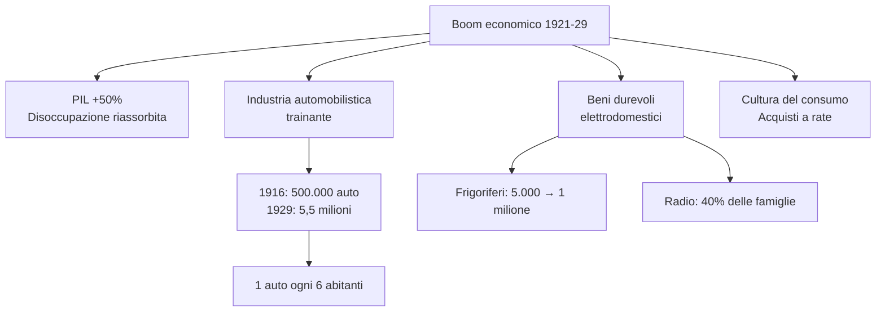

### 2.5 Il ruolo della radio e dell'auto nella «nazionalizzazione» degli USA

**Radio** e **automobile** omogeneizzarono lo stile di vita: lingua parlata standard, strade, distributori, officine, motel. Le campagne si isolarono meno; a fine decennio gli attivi agricoli erano il **21%** (contro **41%** nel 1900), più di metà della popolazione viveva in città e lo stile urbano dominava.

Questa «nazionalizzazione» fu culturale prima ancora che politica: stessi programmi radio, stessi modelli di consumo, stessi miti cinematografici, stessa idea di modernità. Anche chi viveva lontano dalle metropoli veniva raggiunto da linguaggi, mode e desideri urbani, riducendo la distanza simbolica tra città e campagne.

### 2.6 Il «sogno americano»: per molti ma non per tutti

Il **«sogno americano»** univa **individualismo**, pari opportunità, benessere e ascesa sociale; cinema e radio lo diffusero con divi, mode e consumi. Ma copriva **squilibri**: crisi agricola, aree rurali, **minatori**, tessile/abbigliamento, **minoranze**, **afroamericani**, **immigrati**. Il problema non era l'assenza di crescita, ma la distribuzione diseguale dei suoi benefici.

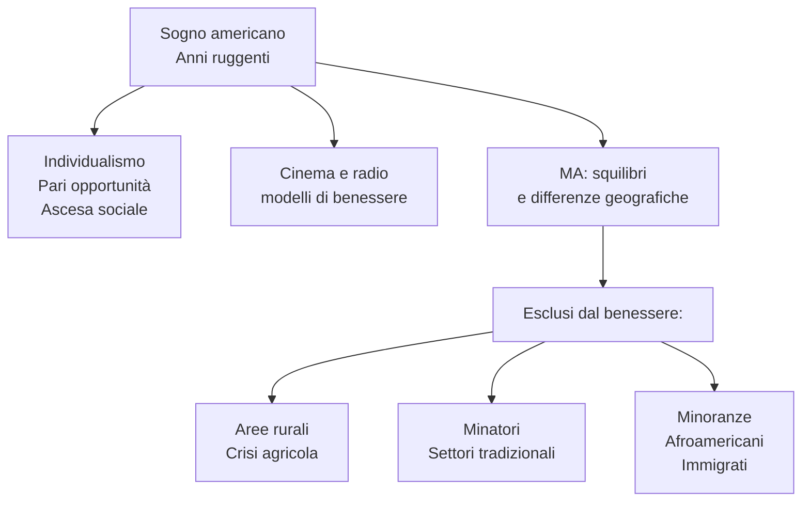

### 2.7 Oltre il conformismo, una nuova vivacità culturale

Accanto al conservatorismo: **jazz**, **charleston**, emancipazione femminile e ***flappers*** (capelli corti, gonne corte, trucco, anticonformismo), diffuse da cinema e stampa.

Riviste progressiste e scrittori sperimentarono nuovi linguaggi. La **«lost generation»** (**Hemingway**, **Fitzgerald**) soggiornò spesso in Europa, mentre la cultura USA iniziava a non dipendere più da quella europea.

La vivacità culturale non cancellava il moralismo dominante: convivevano proibizionismo e jazz, conformismo e *flappers*, razzismo e modernità dei consumi. Per questo gli anni Venti sono contraddittori, non solo «ruggenti».

> **Lost generation:** negli USA indica un gruppo di scrittori degli anni Venti segnato dalla guerra o dal clima del dopoguerra.

---

## 3. Il ruolo mondiale degli Stati Uniti

### 3.1 L'«americanizzazione» del mondo

Dopo il no alla Società delle Nazioni, gli USA avviarono un internazionalismo diverso dal wilsonismo ma inevitabile: nuova posizione globale, **egemonia economica**, interdipendenza, saldo commerciale attivo usato in prestiti/investimenti, forza culturale di Hollywood.

L'**americanizzazione** esportava modernità. Obiettivo: **pace stabile** e ordine liberale favorevole allo sviluppo, senza istituzioni sovranazionali vincolanti né interventi diretti.

È un internazionalismo selettivo: Hollywood, prestiti e prodotti industriali diffondono modelli americani, mentre Washington evita impegni politici permanenti. Gli USA vogliono stabilità mondiale perché serve ai commerci, ma non vogliono ancora guidarla direttamente.

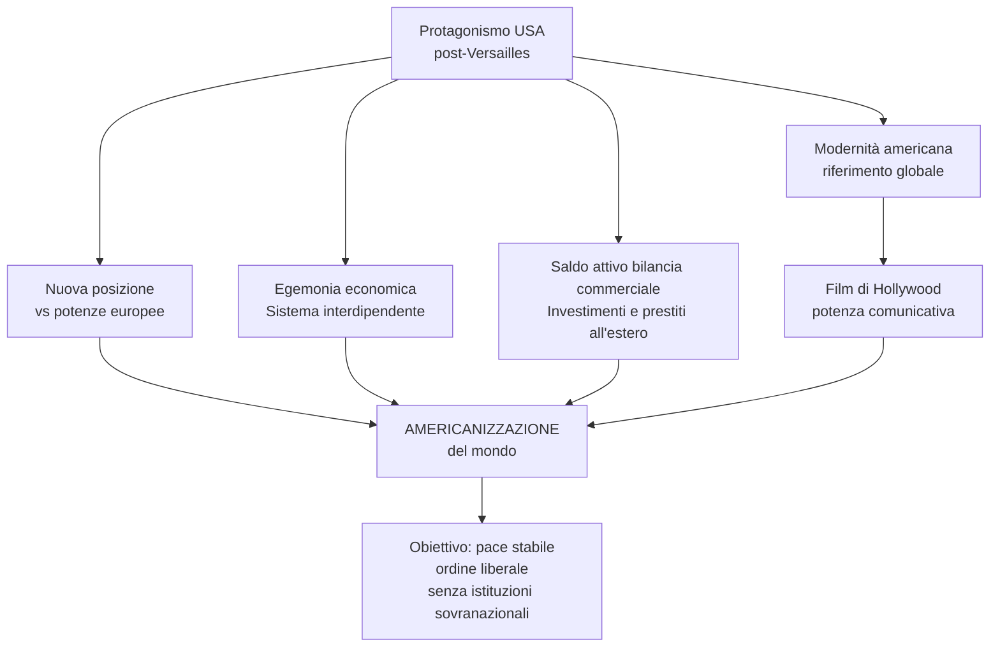

### 3.2 Debiti e riparazioni: una «diplomazia del dollaro» verso l'Europa

I **crediti USA** verso l'Europa si legarono alle riparazioni tedesche: Francia e Gran Bretagna volevano sospendere i debiti se la Germania non pagava; Washington pretendeva il rimborso ma voleva rilanciare l'Europa. Il circuito era fragile: capitali americani alla Germania, riparazioni tedesche ai vincitori europei, rimborso dei debiti europei agli Stati Uniti.

Il **piano Dawes** (**1924**) rivide pagamenti e tempi delle riparazioni e finanziò la Germania. L'Europa riconobbe la dipendenza dai capitali USA: **«diplomazia del dollaro»** in forma morbida. Quando Wall Street crollò, anche questa stabilizzazione costruita sul credito americano entrò in crisi.

### 3.3 Gli obiettivi della pace e del disarmo: il patto Briand-Kellogg

Il piano Dawes preparò il **Trattato di Locarno** (**1925**): la Germania riconobbe i confini occidentali di Versailles e sembrò aprirsi pace/cooperazione.

Nel **1928** il **patto Briand-Kellogg** sancì la **rinuncia alla guerra**. Firmato subito da **15 Paesi**, arrivò a **63 firme** nel 1939. Senza meccanismi applicativi, contribuì però alla nozione di **«crimine contro la pace»** dei processi di **Norimberga** e **Tokyo**. Il 1929 riportò centralità interna e isolazionismo.

Locarno e Briand-Kellogg mostrano l'illusione di una pace garantita da accordi diplomatici e interdipendenza economica. Il limite è che mancavano strumenti coercitivi: quando negli anni Trenta cresceranno revisionismi e aggressioni, quelle promesse non basteranno.

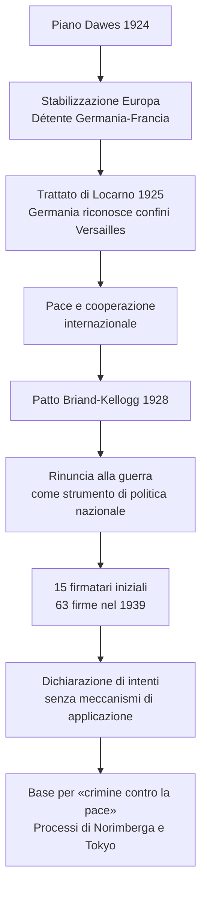

---

## 4. La crisi del 1929: da New York al mondo

### 4.1 Il crollo di Wall Street: l'inizio della Grande Depressione

L'euforia crollò dopo l'insediamento di **Hoover**. Il **24 ottobre 1929**, a Wall Street, azioni gonfiate dalla speculazione precipitarono: **12 milioni** svendute.

Il **29 ottobre** furono venduti **16 milioni di titoli**. Perdite: **15 miliardi di dollari** in una settimana, **40 miliardi** a fine anno. La finanza era slegata dall'economia reale e molti avevano comprato azioni a debito. Iniziò la **Grande Depressione**.

> Dorothea Lange documentò l'impatto della crisi su poveri, emigrati, braccianti e disoccupati.

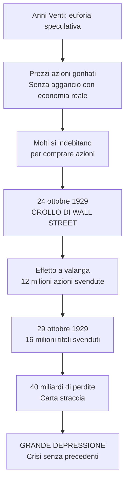

### 4.2 Le cause della Grande Depressione negli Stati Uniti

Cause: **sovrapproduzione** industriale; dal 1925 esportazioni in calo per ripresa europea e protezionismi; mercato interno saturo per beni durevoli e redditi squilibrati. La Borsa fu l'innesco visibile, ma sotto c'erano merci invendute, profitti concentrati e consumatori incapaci di assorbire tutta la produzione.

In agricoltura il **calo dei prezzi** aggravò debiti e ipoteche; nel 1929 il reddito dei coltivatori era **1/3** della media nazionale. Credito facile, mutui e rate resero fragile il sistema bancario di piccoli istituti. Quando famiglie e imprese non riuscirono più a restituire i prestiti, la crisi finanziaria divenne crisi produttiva e sociale.

| Settore | Problema | Conseguenza |
|---------|----------|-------------|
| **Industriale** | Sovrapproduzione | Prodotti invenduti, esportazioni rallentate, mercato interno saturo |
| **Agricolo** | Calo prezzi, debiti | Reddito = 1/3 media nazionale, terre ipotecate |
| **Finanziario** | Indebitamento collettivo, speculazione | Sistema bancario vulnerabile, azioni slegate dall'economia reale |

### 4.3 Le dimensioni della crisi

Dal 1929: sfiducia, prelievi bancari, blocco del credito, consumi giù, produzione giù, prezzi agricoli giù, fallimenti, licenziamenti.

Entro il **1932**: **PIL -1/3**, produzione industriale oltre **-1/2**, più di **5000 banche** fallite, **9 milioni** di depositi perduti, **32.000 imprese** chiuse, **13 milioni** di disoccupati, un terzo degli agricoltori senza terra.

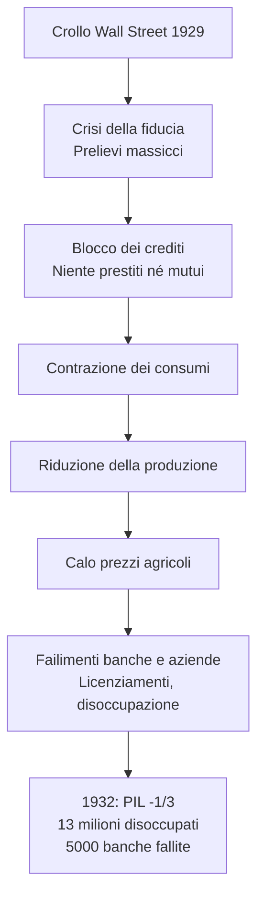

### 4.4 La diffusione mondiale della crisi

La crisi divenne **globale** perché il sistema si reggeva su debiti, prestiti USA, riparazioni tedesche e scambi. Le interdipendenze diffusero la crisi: anche il 1929 fu effetto della **Grande guerra** e dei limiti di Versailles. Il ritiro dei capitali americani colpì soprattutto la Germania, mentre il protezionismo ridusse ulteriormente commercio e produzione.

| Paese | PIL 1932 (1929=100) | Produzione industriale 1932 (1929=100) |
|-------|---------------------|----------------------------------------|
| **Stati Uniti** | 73 | 62 |
| **Germania** | 77 | 61 |
| **Austria** | 80 | 62 |
| **Francia** | 86 | 74 |
| **Italia** | 98 | 86 |
| **Regno Unito** | 95 | 89 |

### 4.5 Gli errori dell'amministrazione Hoover

Hoover, liberista, affidò la crisi all'iniziativa privata: niente assistenza nazionale, carità/governi locali insufficienti, opere pubbliche modeste. Temeva che un intervento federale diretto indebolisse responsabilità individuale e mercato; per milioni di disoccupati, però, questa prudenza apparve abbandono.

Nel **1932** diede quasi **2 miliardi di dollari** in prestiti a banche e imprese: apparve un favore ai ricchi. All'estero irrigidì il **protezionismo**; nel 1930 tariffe altissime, ritiro di capitali, esportazioni **-60% dal 1929 al 1932**. Gli altri protezionismi ridussero i traffici e aumentarono l'isolamento.

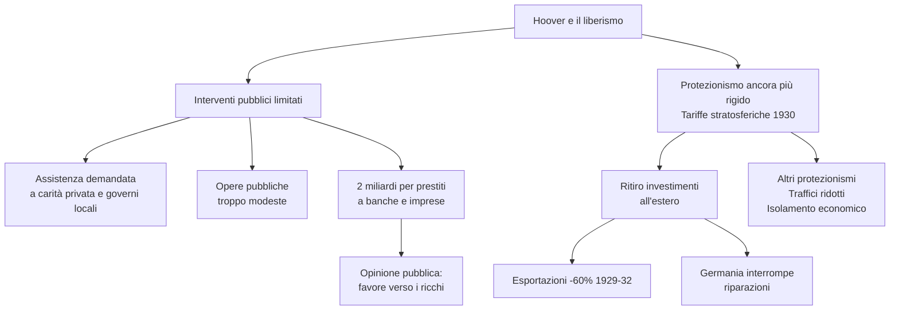

---

## 5. Il New Deal: contro la crisi, un progetto per il futuro

### 5.1 Un nuovo presidente e un nuovo patto

Nel **1932** vinse il democratico **Franklin Delano Roosevelt**, ex governatore di New York e promotore di assistenza ai disoccupati.

Il ***New Deal*** voleva recuperare **fiducia** e creare un **nuovo patto Stato-cittadini**: più intervento pubblico, protezione sociale, riequilibrio del reddito. La crisi aveva indebolito il nesso capitalismo/liberal-democrazia mentre avanzavano **URSS**, fascismo corporativo, **nazismo**, autoritarismo giapponese.

### 5.2 Le misure in campo finanziario

***Emergency Banking Act*** (**9 marzo 1933**): chiusura temporanea delle banche, controllo statale, poteri ampliati alla **Federal Reserve**, garanzia ai piccoli risparmiatori. Obiettivo: fermare corse agli sportelli e ricostruire fiducia.

Politica monetaria opposta a Hoover: **svalutazione del dollaro** e inflazione controllata per rimettere liquidità in circolo.

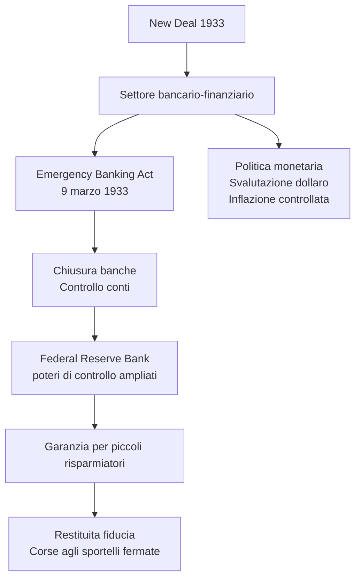

### 5.3 Le misure nei settori agricolo, industriale e delle opere pubbliche

***Agricultural Adjustment Act*** (**12 maggio 1933**): sussidi ai contadini che riducevano superfici coltivate, per far risalire i prezzi.

***NIRA*** (**16 giugno 1933**): codici di «concorrenza leale», stabilizzazione prezzi, **salario minimo**, **orario massimo**; consumi e occupazione dovevano ripartire.

Opere pubbliche: strade, ponti, scuole, ospedali, aeroporti. ***Civilian Conservation Corps*** (marzo **1933**): circa **3 milioni** di giovani in progetti ambientali fino al 1942. ***Tennessee Valley Authority*** (maggio **1933**): bacino del Tennessee, simbolo del New Deal.

La logica comune era riattivare domanda, lavoro e fiducia. In agricoltura si voleva fermare il crollo dei prezzi; nell'industria evitare concorrenza distruttiva e salari troppo bassi; nelle opere pubbliche lo Stato diventava datore di lavoro e motore della ripresa. Il New Deal fu pragmatico: non un piano unico già definito, ma una serie di interventi sperimentati sotto pressione. Proprio questa flessibilità spiega sia la sua forza politica sia le molte critiche di incoerenza.

| Settore | Provvedimento | Data | Contenuto |
|---------|---------------|------|-----------|
| **Agricolo** | Agricultural Adjustment Act | 12 maggio 1933 | Sussidi per riduzione superfici coltivate → risalita prezzi |
| **Industriale** | NIRA | 16 giugno 1933 | Codici concorrenza leale, salario minimo, orario massimo |
| **Lavoro** | Civilian Conservation Corps | Marzo 1933 | 3 milioni di giovani in progetti ambientali |
| **Infrastrutture** | Tennessee Valley Authority | Maggio 1933 | Sistemazione bacino fiume Tennessee |

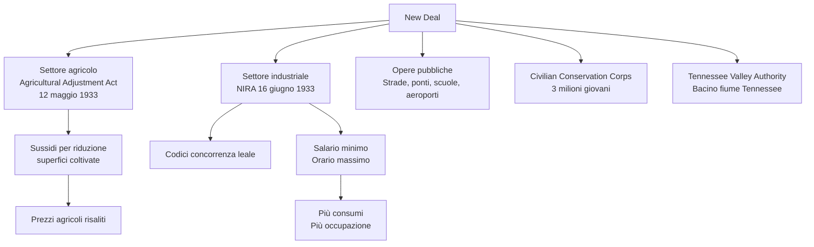

### 5.4 La rielezione del 1936: un presidente carismatico

Nel **1935**: più opere pubbliche, tasse sui redditi alti, **previdenza sociale nazionale** con sussidi e pensioni, ma esclusi braccianti e domestici. **Eleanor Roosevelt** sostenne politiche sociali e diritti civili afroamericani.

Nel **1936** Roosevelt vinse largamente. Centrale la **radio**: le ***fireside chats*** entrarono nelle case; **30** discorsi tra **1933 e 1944**, radio nell'**88%** delle famiglie nel 1945. Leadership carismatica anche in democrazia liberale.

Le *fireside chats* trasformarono la comunicazione politica: il presidente spiegava direttamente le misure, rassicurava i cittadini e ricostruiva fiducia nel sistema bancario e nelle istituzioni. La radio, simbolo dei consumi anni Venti, divenne strumento di governo democratico.

> Roosevelt sosteneva che ridurre l'orario e aumentare i salari avrebbe aumentato l'occupazione senza danneggiare i datori di lavoro, perché i costi sarebbero cresciuti per tutti.

### 5.5 Una «normalizzazione» del programma riformista

Dal **1937** il *New Deal* si stabilizzò: misure confermate, poche nuove spinte. Circa il **40%** lo disapprovava per l'espansione dello Stato centrale.

Imprenditori: accuse di limitare libertà d'impresa e concorrenza sleale; Roosevelt accusato di socialismo o corporativismo. Alcuni atti, incluso il **NIRA**, furono dichiarati illegittimi e riformulati. Nel **1937-38** una piccola recessione ridusse fiducia e risorse.

Le critiche venivano sia da destra sia da chi giudicava le riforme insufficienti. Per i conservatori Roosevelt stava creando uno Stato troppo invadente; per molti lavoratori e disoccupati, invece, il New Deal non garantiva ancora piena occupazione e sicurezza.

### 5.6 New Deal e isolazionismo

Roosevelt fu inizialmente isolazionista: nel **giugno 1933** evitò la **Conferenza economica di Londra** per poter svalutare il dollaro e sostenere il mercato interno.

Scarso interesse per disarmo e militarismo giapponese. **Leggi sulla neutralità** (**1935-37**): niente armi ai belligeranti, anche nella **guerra civile spagnola** (**1936**). Dopo il **1938** svolta verso leadership mondiale; in **America Latina** restò l'attivismo USA.

Questo isolazionismo non cancellava il peso mondiale degli USA, ma ne limitava l'uso politico. Mentre Europa e Asia scivolavano verso nuovi conflitti, Washington restava concentrata sulla ripresa interna e sull'evitare un nuovo coinvolgimento militare.

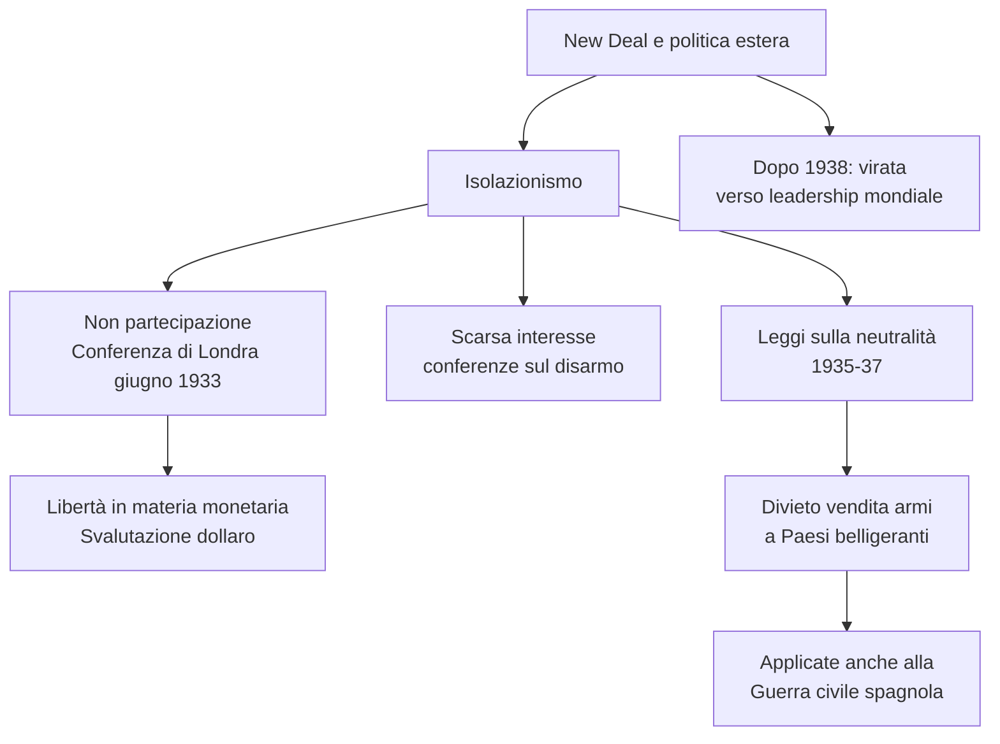

### 5.7 L'eredità del New Deal

Il *New Deal* non superò del tutto la Depressione: disoccupazione alta, salari sotto il 1929. Uscita definitiva solo con la mobilitazione della **Seconda guerra mondiale**, che assorbì disoccupazione e riattivò industria su scala enorme.

Eredità: più potere federale, **«presidenza personale»**, nuovo rapporto Stato-cittadino. Dimostrò un capitalismo riformabile in democrazia liberale: **diritti + tutela pubblica**, **impresa privata + programmazione**, **profitti + benessere collettivo**. Questo **capitalismo democratico** divenne modello USA dopo il 1945. Roosevelt non uscì dal capitalismo: ne modificò le regole per salvarlo dalla crisi e renderlo compatibile con la democrazia di massa.

> Per Kiran Klaus Patel, il New Deal mostrò un modello capace di conciliare democrazia e capitalismo, preparando l'egemonia americana del secondo dopoguerra.

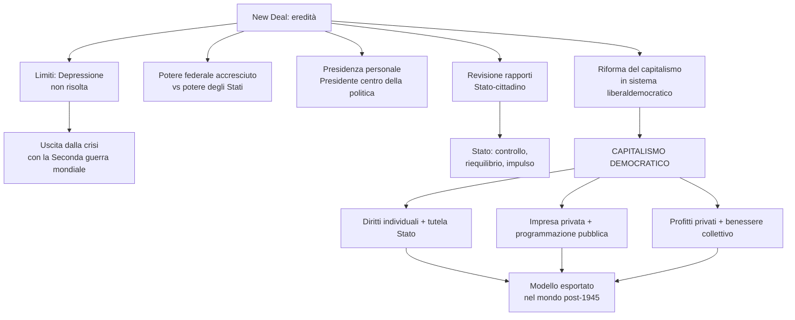

---

## Mappa concettuale — Visione d'insieme del capitolo

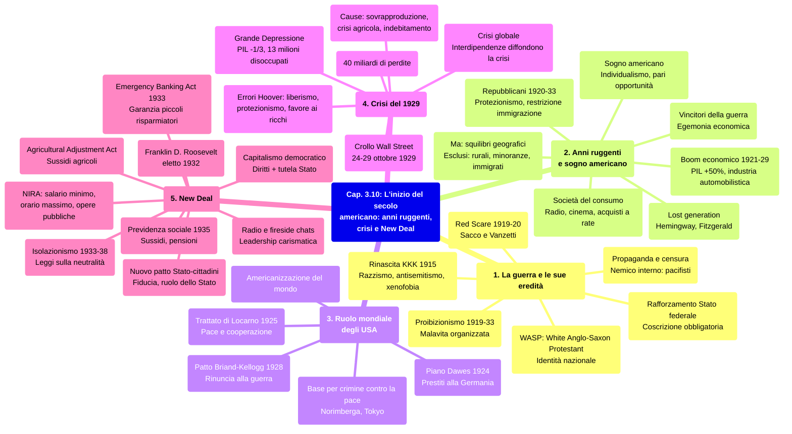
