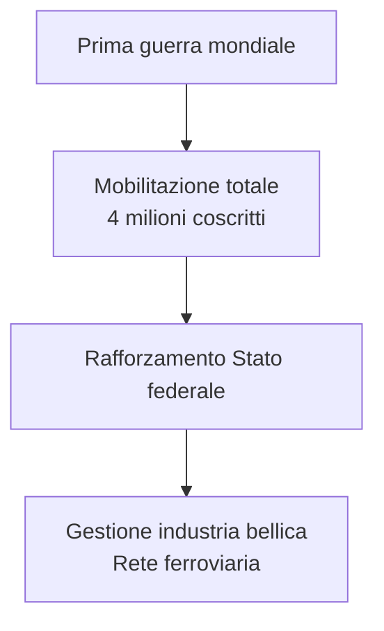
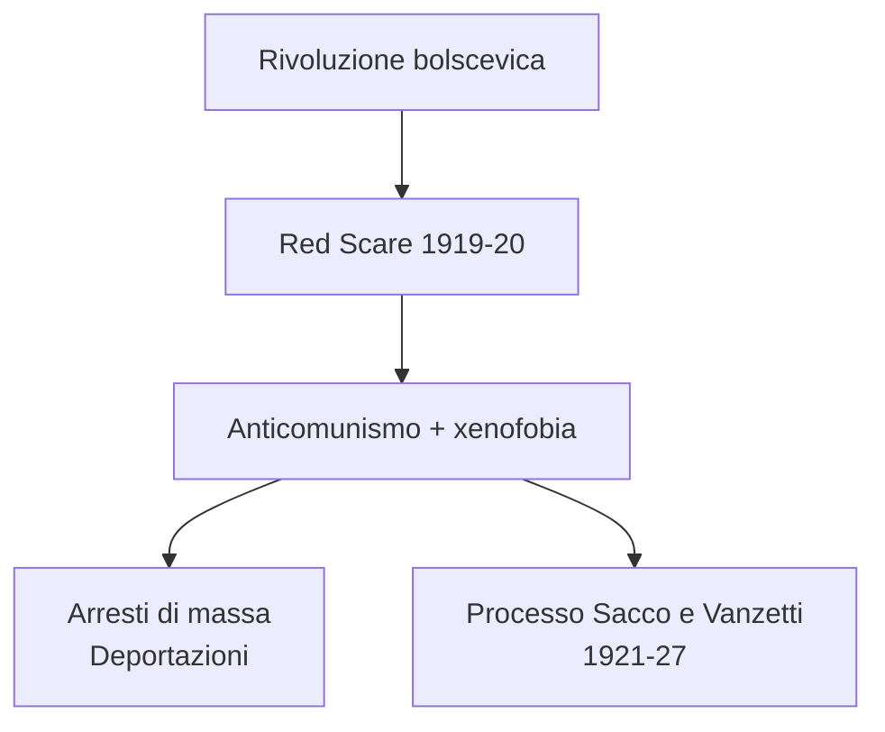
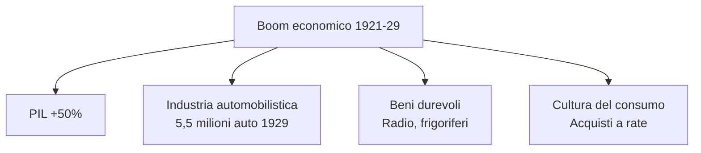
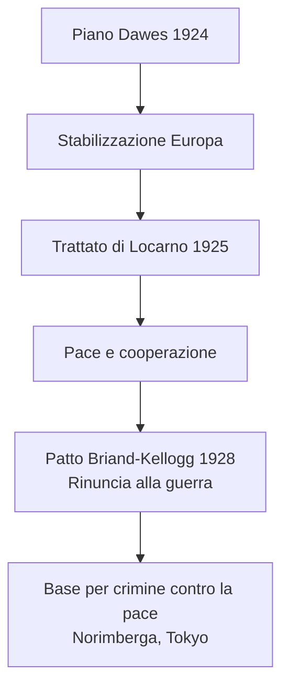
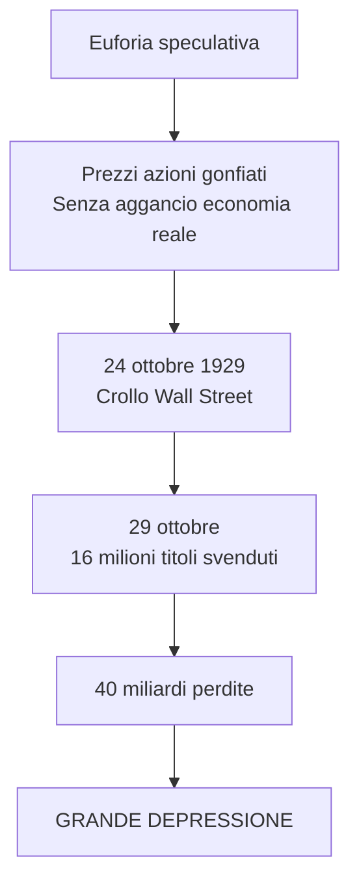
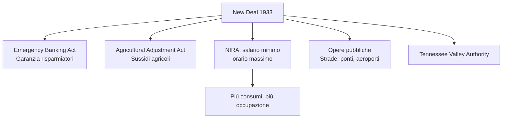
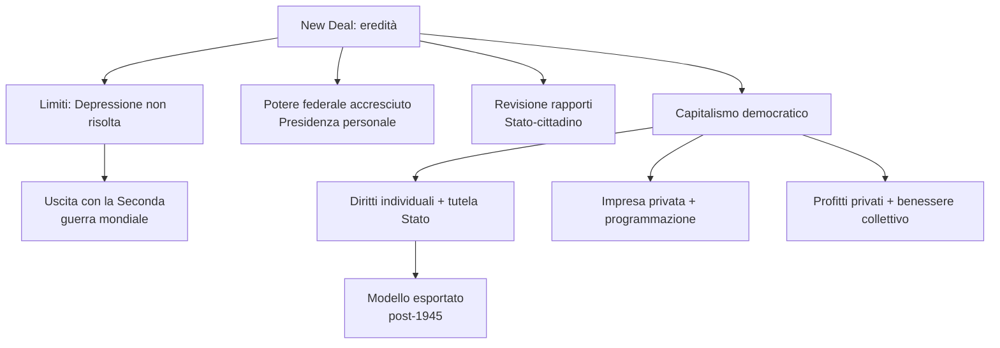
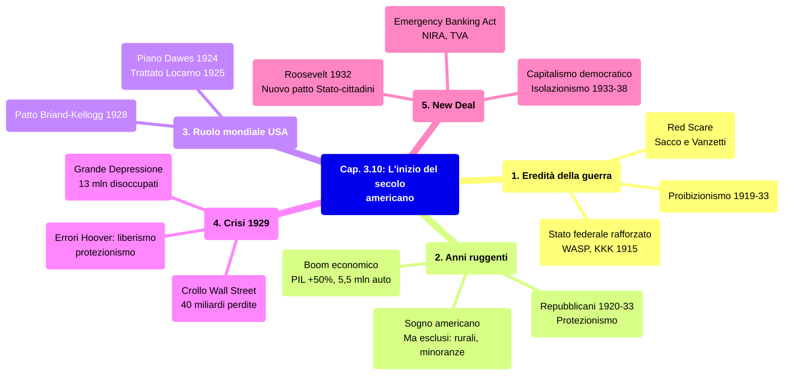

# Schema di Studio - Capitolo 3.10: L'inizio del secolo americano: anni ruggenti, crisi e New Deal (Riassunto)

---

## 1. La guerra e le sue eredità

### Il rafforzamento del governo centrale

La Prima guerra mondiale proiettò gli Stati Uniti sulla scena internazionale nel ruolo di **superpotenza** *ante litteram*. Il governo federale **si rafforzò** attraverso la **coscrizione obbligatoria** (4 milioni di uomini chiamati alle armi) e l'intervento diretto nell'economia (industria bellica, rete ferroviaria, approvvigionamenti).

### Propaganda, censura e «nemici interni»

Il governo allestì una **potente propaganda** e introdusse leggi che **limitarono le libertà** di opinione ed espressione. Il **«nemico interno»** fu individuato nei pacifisti e nei movimenti operai radicali. La repressione colpì la **comunità tedesco-americana** (10.000 internati). L'identità nazionale si definì come **WASP** (*white, anglo-saxon, protestant*).

### La rinascita del Ku Klux Klan

La crescita del sentimento **nazional-patriottico** si tradusse in violenze contro la popolazione nera. Nel **1915** il **KKK rinacque**, ispirandosi al film *The Birth of a Nation*. L'associazione ingrossò le proprie fila distinguendosi per violenze contro **afroamericani, immigrati, ebrei, cattolici**. I soldati afroamericani furono inquadrati in unità separate; la discriminazione si radicò anche nelle città industriali del Nord.

### La «paura dei rossi» e il caso Sacco e Vanzetti

Il biennio **1919-20** fu segnato dal ***Red Scare***, la **«paura rossa»** diffusa dopo la rivoluzione bolscevica. L'anticomunismo si saldò alla xenofobia: arresti di massa, incarcerazioni, deportazioni. Emblematico fu il processo del **1921** contro gli anarchici italiani **Nicola Sacco e Bartolomeo Vanzetti**, condannati a morte senza prove ed eseguiti nell'agosto **1927**.

### Proibizionismo

La guerra lasciò un clima di **conformismo** puritano. Il **XVIII emendamento** (1919) vietò produzione, vendita e trasporto di bevande alcoliche. Il proibizionismo generò **traffici illegali** per la malavita organizzata (Al Capone, «nemico pubblico numero uno» fino al 1931). L'emendamento fu abrogato nel **1933**.

---

## 2. Gli «anni ruggenti» e il «sogno americano»

### La nuova potenza mondiale

Gli USA furono i **veri vincitori** della guerra: vantavano **crediti esteri per oltre 10 miliardi di dollari** e l'**egemonia economica** era indiscussa. Le esportazioni passarono da materie prime a **prodotti industriali**.

### Il ritorno dei repubblicani

Le elezioni del **1920** videro la vittoria del repubblicano **Warren Harding**, ostile all'internazionalismo wilsoniano. Il Partito repubblicano mantenne la presidenza fino al 1933 (Harding, Coolidge, Hoover). Fu adottato un forte **protezionismo** e si restrinse l'immigrazione: **350.000/anno** nel 1921, **165.000** nel 1924, favorendo l'immigrazione anglosassone.

### Una politica per i grandi gruppi d'affari

Le leggi contro monopoli e **trust** furono abrogate. Prosperarono grandi concentrazioni: **Standard Oil**, **General Electric**, **Ford**, **General Motors**, **Chrysler**. La politica fiscale abbassò le imposte dirette: nel 1929 lo **0,1% controllava il 34% del risparmio**, l'**80% non aveva risparmio**.

### Il boom economico

Dal 1921-22 gli USA conobbero una **crescita economica impetuosa**: il **PIL crebbe almeno del 50%** fino al 1929. La produzione automobilistica passò da **500.000 auto (1916)** a **5,5 milioni (1929)**. Nelle case entrarono elettrodomestici e radio: nel 1929 il **40% delle famiglie** possedeva un apparecchio radiofonico. La possibilità di **acquistare a rate** favorì la diffusione dei consumi.

| Indicatore | 1916 | 1929 |
|------------|------|------|
| **Produzione automobilistica** | 500.000 | 5,5 milioni |
| **Famiglie con radio** | — | 40% |

### Radio e auto: la «nazionalizzazione» degli USA

La radio portò in tutte le case una **lingua standardizzata**. L'auto stimolò la costruzione di strade e infrastrutture. I lavoratori in agricoltura scesero dal **41% (1900)** al **21% (fine decennio)**. Uno **stile di vita urbano** si impose ovunque.

### Il «sogno americano»: per molti ma non per tutti

Gli **«anni ruggenti»** (*Roaring Twenties*) consacrarono il mito del **«sogno americano»**: **individualismo**, **pari opportunità**, **benessere**, **ascesa sociale**. Il **cinema** alimentò i sogni di promozione sociale. Ma ampie fasce ne erano escluse: **aree rurali** (crisi agricola), **minatori**, settori tradizionali, **minoranze**, **afroamericani**, **immigrati**.

### Vivacità culturale

Gli anni Venti furono un'epoca di grande **vivacità culturale**: **jazz** e **charleston**, modelli di **emancipazione femminile** (le ***flappers***). La **«generazione perduta»** (*lost generation*) – Hemingway, Fitzgerald – soggiornò in Europa. La cultura statunitense smise di essere tributaria di quella europea.

---

## 3. Il ruolo mondiale degli Stati Uniti

### L'«americanizzazione» del mondo

La mancata ratifica di Versailles non impedì un'internazionalismo inevitabile. Le ragioni del protagonismo USA: nuova posizione vs potenze europee, **egemonia economica**, investimenti all'estero, modernità americana come **riferimento globale** (film di Hollywood). L'**«americanizzazione» del mondo** muoveva i primi passi.

### Debiti e riparazioni: la «diplomazia del dollaro»

Quando la Germania non poté pagare le riparazioni, Gran Bretagna e Francia chiesero la sospensione dei loro debiti verso gli USA. Washington, pur intransigente sul rimborso, riteneva fondamentale **rilanciare le economie europee**. Il **piano Dawes** (1924) previde un **ingente prestito alla Germania**.

### Il patto Briand-Kellogg

Il piano Dawes fu la premessa del **Trattato di Locarno** (1925): la Germania riconobbe i confini di Versailles, sembrando aprirsi una fase di pace. Nel **1928** il **patto Briand-Kellogg** sancì la **rinuncia alla guerra** come strumento di politica nazionale. Sottoscritto da **15 Paesi** inizialmente, raggiunse **63 firme** nel 1939. Offrì la base per la nozione di **«crimine contro la pace»** (processi di Norimberga e Tokyo).

---

## 4. La crisi del 1929: da New York al mondo

### Il crollo di Wall Street

Il **24 ottobre 1929** il prezzo delle azioni iniziò a scendere: **effetto a valanga**, **12 milioni di azioni** svendute. Il **29 ottobre** le vendite riguardarono **16 milioni di titoli**. Le perdite sommarono **40 miliardi di dollari**. Il valore di titoli era cresciuto **senza aggancio con l'economia reale**. Gli USA entrarono nella **Grande Depressione**, crisi di gravità senza precedenti.

### Le cause della Grande Depressione

| Settore | Problema |
|---------|----------|
| **Industriale** | Sovrapproduzione, esportazioni rallentate, mercato interno saturo |
| **Agricolo** | Calo prezzi, reddito = 1/3 media nazionale, terre ipotecate |
| **Finanziario** | Indebitamento collettivo, sistema bancario vulnerabile |

### Le dimensioni della crisi

Si innescò un **circolo vizioso**: crisi fiducia → blocco crediti → contrazione consumi → riduzione produzione → fallimenti e disoccupazione. Entro il **1932**: PIL ridotto di **un terzo**, **13 milioni** di disoccupati, oltre **5000 banche** fallite, **32.000 imprese** chiuse. La crisi divenne **globale**: le interdipendenze create dagli aiuti americani diffusero il cataclisma.

### Gli errori di Hoover

Fedele al liberismo, Hoover pensava la risposta dovesse venire dall'**iniziativa privata**. Interventi pubblici limitati, assistenza demandata alla carità. Nel 1930 **protezionismo ancora più rigido**: esportazioni crollarono del **60%**. La Germania interruppe le riparazioni; ogni Paese cercò autosufficienza economica.

---

## 5. Il New Deal: contro la crisi, un progetto per il futuro

### Un nuovo presidente

Le elezioni del **1932** videro la vittoria del democratico **Franklin Delano Roosevelt**. Lo slogan ***New Deal*** indicava: recuperare **fiducia e ottimismo**, un **nuovo patto Stato-cittadini** con ruolo accresciuto dello Stato. La crisi aveva messo in discussione il nesso tra capitalismo e liberaldemocrazia; il mondo cercava alternative (URSS, dittature di destra).

### Le misure del New Deal

| Settore | Provvedimento | Data | Contenuto |
|---------|---------------|------|-----------|
| **Bancario** | Emergency Banking Act | 9 marzo 1933 | Controllo banche, garanzia risparmiatori |
| **Monetario** | Svalutazione dollaro | 1933 | Politica inflazionistica |
| **Agricolo** | Agricultural Adjustment Act | 12 maggio 1933 | Sussidi per riduzione colture |
| **Industriale** | NIRA | 16 giugno 1933 | Salario minimo, orario massimo, opere pubbliche |
| **Ambientale** | Civilian Conservation Corps | Marzo 1933 | 3 milioni giovani in progetti |
| **Infrastrutture** | Tennessee Valley Authority | Maggio 1933 | Bacino fiume Tennessee |

### La rielezione del 1936

Nel **1935** furono introdotti: intensificazione opere pubbliche, legge fiscale contro i redditi alti, **sistema di previdenza sociale nazionale** (sussidi, pensioni). **Eleanor Roosevelt** sostenne i diritti civili degli afroamericani. La **rielezione del 1936** fu una vittoria larghissima: mandato a proseguire.

Roosevelt usò la **radio** per le ***fireside chats*** («chiacchierate al caminetto»): **30 discorsi** tra 1933 e 1944, stile informale e rassicurante. Dimostrò che una **leadership carismatica** era possibile **anche in democrazia**.

### La normalizzazione del programma

Dal **1937** il New Deal si stabilizzò: non vi furono ulteriori spinte. Circa il **40% disapprovava**: lo Stato centrale era estraneo alla tradizione liberale americana, accusato di limitare la libertà d'impresa. La Corte costituzionale giudicò illegittimi alcuni provvedimenti (NIRA). Nel **1937-38** una **piccola recessione** traballò la fiducia.

### New Deal e isolazionismo

Nel **giugno 1933** Roosevelt non partecipò alla Conferenza economica di Londra. Mostrò scarso interesse per le conferenze sul disarmo. **Leggi sulla neutralità** (1935-37) impedivano di vendere armi a Paesi belligeranti, applicate anche alla **Guerra civile spagnola**. Solo dopo il **1938** iniziò la virata verso un ruolo di **leadership mondiale**.

### L'eredità del New Deal

Il New Deal mostrò **molti limiti**: la Depressione non fu risolta, la disoccupazione restò alta. L'uscita dalla crisi avvenne con la mobilitazione della **Seconda guerra mondiale**. Tuttavia:

- accrebbe il **potere dell'autorità federale**
- spostò il baricentro sulla **«presidenza personale»**
- fu una **svolta politica e culturale**: revisione dei rapporti Stato-cittadino
- fu un **esperimento di riforma del capitalismo in un sistema liberaldemocratico**

Gli USA dimostrarono la praticabilità di un **modello di capitalismo democratico**: combinazione tra **diritti individuali e tutela dello Stato**, **impresa privata e programmazione pubblica**, **profitti privati e benessere collettivo**.

---

## Date fondamentali — Riepilogo cronologico

| Data | Evento |
|---|---|
| **1915** | Rinascita del **Ku Klux Klan** |
| **1919** | XVIII emendamento: **proibizionismo**; **Red Scare** |
| **1920** | Donne ammesse al voto; elezione di **Harding** (repubblicano) |
| **1921** | Tetto immigrazione: **350.000/anno** |
| **1924** | Piano **Dawes**; tetto immigrazione: **165.000/anno** |
| **1925** | Trattato di **Locarno** |
| **1928** | Patto **Briand-Kellogg** |
| **24-29 ottobre 1929** | Crollo di **Wall Street** |
| **1932** | Elezione di **Franklin D. Roosevelt** |
| **9 marzo 1933** | Emergency Banking Act |
| **12 maggio 1933** | Agricultural Adjustment Act |
| **16 giugno 1933** | NIRA |
| **1933** | Abrogazione proibizionismo (XXI emendamento) |
| **1935** | Previdenza sociale nazionale |
| **1935-37** | Leggi sulla neutralità |
| **1936** | Rielezione di Roosevelt |
| **1937-38** | Piccola recessione |

---

## Mappa concettuale — Visione d'insieme del capitolo

