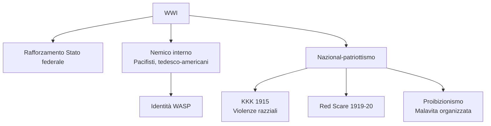
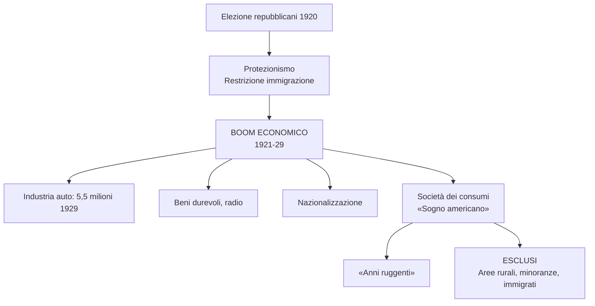
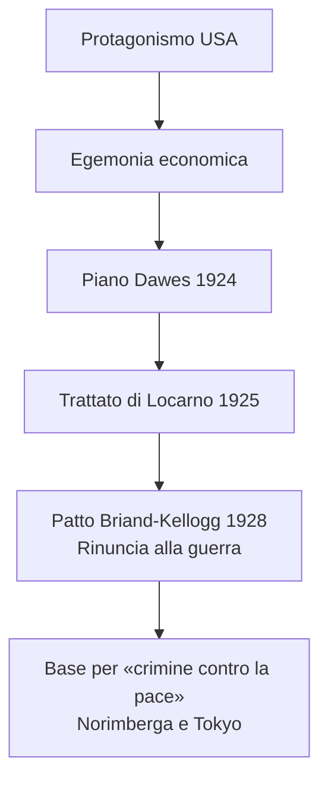
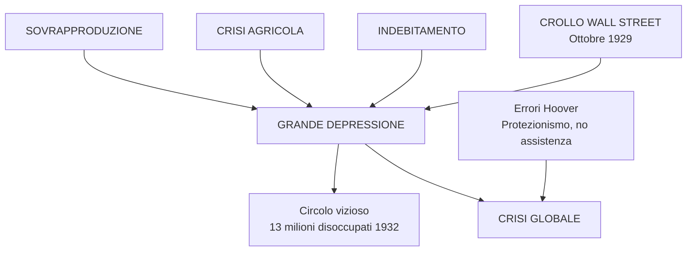
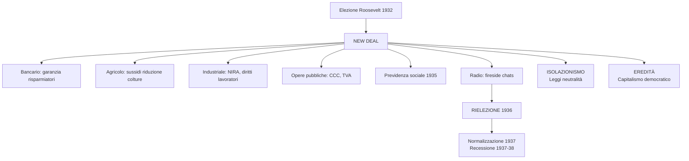

# Schema di Studio - Capitolo 3.10: L'inizio del secolo americano: anni ruggenti, crisi e New Deal (Riassunto)

---

## Date fondamentali del capitolo

| Anno / Data | Evento |
|-------------|--------|
| **1919-29** | **«Anni ruggenti»**: nasce il «sogno americano» |
| **1919** | XVIII emendamento: **proibizionismo** (vigore 1920, abrogato 1933) |
| **1920** | Elezioni: vittoria repubblicano **Harding**; donne al voto |
| **1924** | **Piano Dawes**: aiuti USA a Germania ed Europa; immigrati limitati a **165.000/anno** |
| **1925** | **Trattato di Locarno**: Germania riconosce Versailles |
| **1928** | **Patto Briand-Kellogg**: rinuncia alla guerra |
| **24-29 ott. 1929** | **Crollo di Wall Street**: inizio **Grande Depressione** |
| **Nov. 1932** | Eletto il democratico **Franklin D. Roosevelt** |
| **Mar.-Mag. 1933** | *Emergency Banking Act*, *Agricultural Adjustment Act* |
| **Giu. 1933** | *NIRA*: diritti lavoratori, opere pubbliche; CCC e TVA |
| **1935** | Sistema di **previdenza sociale nazionale** |
| **Nov. 1936** | **Rielezione** di Roosevelt |
| **1935-37** | **Leggi sulla neutralità**: isolazionismo |

---

## 1. La guerra e le sue eredità

### Il rafforzamento dello Stato federale e i «nemici interni»

La **Prima guerra mondiale** proiettò gli USA sulla scena internazionale come **superpotenza *ante litteram***. Lo **Stato federale si rafforzò** tramite mobilitazione totale, coscrizione obbligatoria (4 milioni di uomini) e intervento nell'economia.

La propaganda e le leggi limitarono le libertà: il «**nemico interno**» fu individuato in pacifisti, movimenti operai radicali e la **comunità tedesco-americana** (10.000 internati). Si riconfermò l'identità **WASP** (*White, Anglo-Saxon, Protestant*).

### KKK, Red Scare e proibizionismo

**Rinascita del KKK (1915)**: ispirato dal film *The Birth of a Nation*, il Klan estese le violenze da afroamericani a immigrati, ebrei, cattolici. La presidenza Wilson fu contraddittoria: donne al voto (1920), ma nessuna tutela per i diritti degli afroamericani.

**Red Scare (1919-20)**: la «paura rossa» portò a repressione del movimento operaio, arresti di massa, deportazioni. Caso emblematico: **Sacco e Vanzetti**, due anarchici italiani condannati a morte (1927) senza prove.

**Proibizionismo** (XVIII emendamento, 1919-1933): divieto di alcolici → traffici illegali della malavita organizzata (es. **Al Capone**).

---

## 2. Gli «anni ruggenti» e il «sogno americano»

### La nuova potenza mondiale e il ritorno repubblicano

Gli USA furono i **veri vincitori** della guerra: egemonia industriale e finanziaria, crediti all'estero per oltre 10 miliardi di dollari. Le **elezioni 1920** portarono al potere i repubblicani (**Harding**, poi Coolidge, poi Hoover): protezionismo, restrizione dell'immigrazione (da 350.000 a 165.000/anno), politica favorevole ai grandi gruppi d'affari.

**Disuguaglianze**: nel 1929 lo **0,1%** controllava il **34%** del risparmio, l'**80%** non aveva risparmio, il **20%** più ricco deteneva il **55%** del reddito nazionale.

### Il boom economico e la società dei consumi

Dal **1921-22** boom economico: PIL +50%, produzione industriale quasi raddoppiata, salari più alti, orario ridotto. L'**industria automobilistica** fu trainante: da 500.000 auto (1916) a **5,5 milioni** (1929). Entrarono nelle case elettrodomestici (frigoriferi, ferri da stiro) e radio (**40%** delle famiglie nel 1929).

Radio e automobile favorirono la **nazionalizzazione** degli USA: lingua standardizzata, infrastrutture, stile di vita urbano (lavoratori in agricoltura scesi al 21%).

### Il «sogno americano» e i suoi esclusi

Nacque il **«sogno americano»**: individualismo, pari opportunità, benessere, ascesa sociale. Gli anni Venti furono battezzati **«anni ruggenti»** (*Roaring Twenties*). Ma ampia fascia della popolazione ne era esclusa: aree rurali (agricoltura in crisi), minatori, settori tradizionali, minoranze, afroamericani, immigrati.

**Vivacità culturale**: jazz, charleston, ***flappers*** (donne anticonformiste), **«lost generation»** di scrittori (Hemingway, Fitzgerald).

---

## 3. Il ruolo mondiale degli Stati Uniti

### L'«americanizzazione» del mondo

Gli USA avviarono un internazionalismo diverso da quello wilsoniano: egemonia economica, investimenti e prestiti all'estero, modernità americana come riferimento globale (film di Hollywood). L'**«americanizzazione» del mondo** muoveva i primi passi.

### Piano Dawes e patto Briand-Kellogg

**Piano Dawes (1924)**: prestito alla Germania per risanare l'economia; «diplomazia del dollaro». Seguì il **Trattato di Locarno (1925)**: la Germania riconosce i confini di Versailles.

**Patto Briand-Kellogg (1928)**: rinuncia alla guerra come strumento di politica nazionale; sottoscritto da 63 Paesi; base per la nozione di **«crimine contro la pace»** (processi di Norimberga e Tokyo).

---

## 4. La crisi del 1929: da New York al mondo

### Il crollo di Wall Street

Il **24 ottobre 1929** («Giovedì nero») e il **29 ottobre** («Martedì nero»): crollo della Borsa di Wall Street. 16 milioni di titoli svenduti, **40 miliardi di perdite** in un anno (superiori alle riparazioni di guerra tedesche). Inizio della **Grande Depressione**.

**Cause immediate**: euforia speculativa, assenza di controlli, crescita dei titoli senza aggancio all'economia reale.

### Le cause profonde

**Sovrapproduzione industriale**: esportazioni rallentate (ripreesa europea), mercato interno saturato (beni durevoli, disuguaglianze redditi).

**Crisi agricola**: calo dei prezzi, reddito dei coltivatori = 1/3 del reddito medio nazionale, terre ipotecate.

**Indebitamento collettivo**: facile accesso al credito, mutui e vendite a rate, sistema bancario vulnerabile (piccoli istituti).

### Il circolo vizioso e la diffusione globale

Crisi della fiducia → blocco dei crediti → contrazione dei consumi → riduzione della produzione → fallimenti e disoccupazione.

**Entro il 1932**: PIL -1/3, produzione industriale -50%, oltre **5000 banche** fallite, **13 milioni** di disoccupati, 32.000 imprese chiuse.

**Crisi globale**: le interdipendenze diffuse la crisi in Europa, America Latina, Australia, Giappone. Fu un **prodotto della Grande guerra** e dei limiti di Versailles.

**Errori di Hoover**: liberismo, no assistenza nazionale, protezionismo rigido (tariffe stratosferiche 1930), ritiro capitali dall'estero (-60% esportazioni 1929-32).

---

## 5. Il *New Deal*: contro la crisi, un progetto per il futuro

### Roosevelt e il nuovo patto con i cittadini

**Elezioni 1932**: vittoria del democratico **Franklin D. Roosevelt** (voto contro Hoover). Lo slogan ***New Deal*** indicava: recuperare fiducia e ottimismo, nuovo patto con i cittadini (accrescimento del ruolo dello Stato).

### Le misure del New Deal

| Settore | Provvedimento | Contenuto |
|---------|---------------|-----------|
| **Bancario** | *Emergency Banking Act* (marzo 1933) | Controllo statale, garanzia risparmiatori, poteri Federal Reserve |
| **Monetario** | Svalutazione dollaro | Politica inflazionistica per rimettere in circolazione liquidità |
| **Agricolo** | *Agricultural Adjustment Act* (maggio 1933) | Sussidi per riduzione superfici coltivate → risalita prezzi |
| **Industriale** | *NIRA* (giugno 1933) | Codici concorrenza leale, salario minimo, orario massimo, diritti lavoratori |
| **Opere pubbliche** | CCC (marzo 1933), TVA (maggio 1933) | 3 milioni giovani impiegati; dighe, elettrificazione Tennessee |

**Previdenza sociale (1935)**: sussidi di invalidità, disoccupazione, pensioni di vecchiaia (esclusi braccianti e lavoratori domestici).

### La rielezione 1936 e la leadership carismatica

Roosevelt usò la **radio** per comunicare direttamente con i cittadini: le ***fireside chats* («chiacchierate al caminetto»)**. 30 discorsi tra 1933 e 1944. Dimostrò che la leadership carismatica è possibile anche in contesti democratico-liberali. **Rieletto largamente nel 1936**.

### Normalizzazione e isolazionismo

Dal **1937** il New Deal si stabilizzò. Opposizione (~40%): lo Stato centrale era estraneo alla tradizione liberale americana. **Recessione 1937-38**.

**Isolazionismo**: non partecipazione alla Conferenza economica di Londra (1933); scarso interesse per il disarmo; **leggi sulla neutralità (1935-37)**; embargo sulla Spagna durante la guerra civile.

### L'eredità del New Deal

**Limiti**: Grande Depressione non superata, disoccupazione ancora alta. L'uscita dalla crisi avvenne solo con la mobilitazione industriale della Seconda guerra mondiale.

**Eredità**:
- Accresciuto potere dell'**autorità federale**
- Spostamento del baricentro sulla **«presidenza personale»**
- **Svolta politica e culturale**: revisione rapporti Stato-cittadino
- **Modello di capitalismo democratico**: conciliazione tra diritti individuali e tutela dello Stato, impresa privata e programmazione pubblica

---

## 6. Le domande degli storici: quale bilancio?

### Dal punto di vista dei cittadini

Il New Deal rappresentò un **elemento di forte discontinuità** rispetto al liberismo di Hoover: intervento nell'economia per riordinare il sistema bancario, sostenere i gruppi in difficoltà, opere pubbliche, riorganizzare rapporti imprenditori-sindacati.

### I risultati concreti

Roosevelt ottenne **risultati notevoli**, ma non bastarono a risollevare il Paese dalla disoccupazione. Reddito pro capite risalito a metà anni Trenta, ma nel **1937** nuova recessione e disoccupazione tornò sopra i **10 milioni**.

### La prospettiva internazionale

Bilancio **decisamente positivo**: la politica di Roosevelt rafforzò la **leadership globale** degli USA. L'America mostrò un modello di Stato in grado di **conciliare democrazia e capitalismo**, ponendo le basi per l'egemonia politica post-Seconda guerra mondiale (Kiran Klaus Patel).