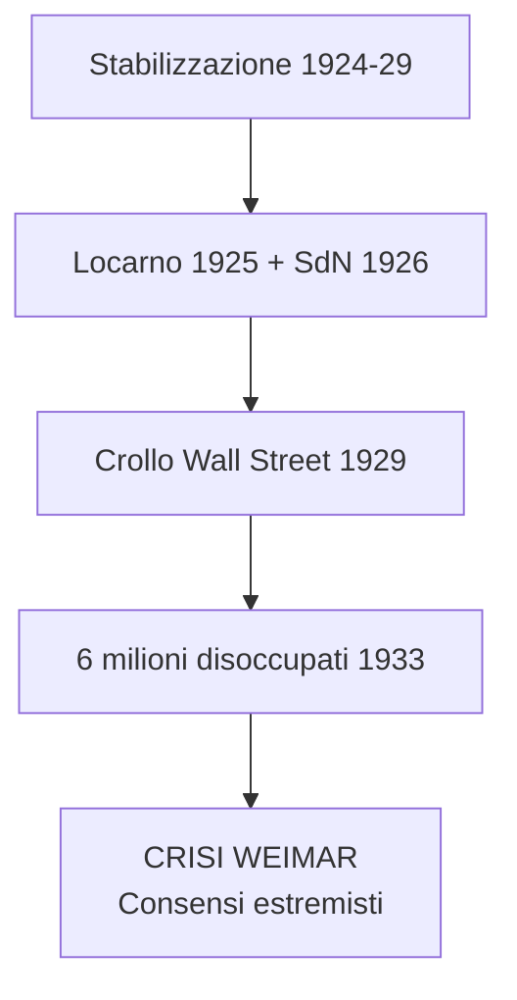
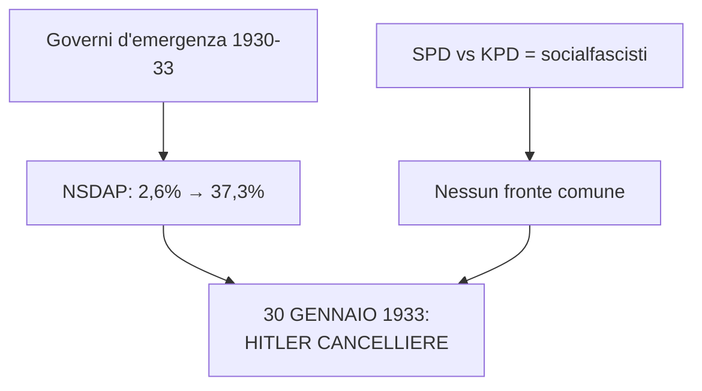
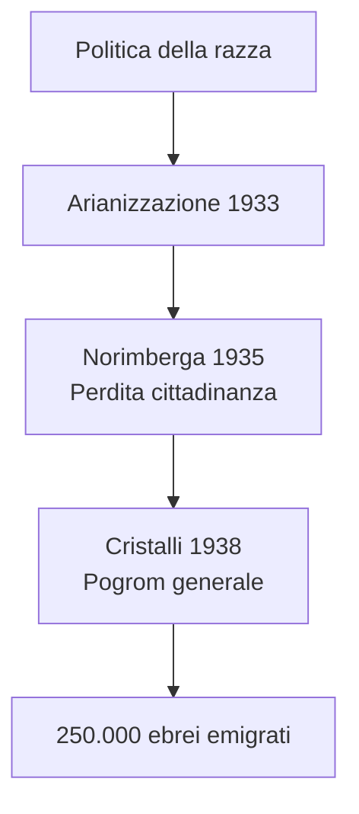
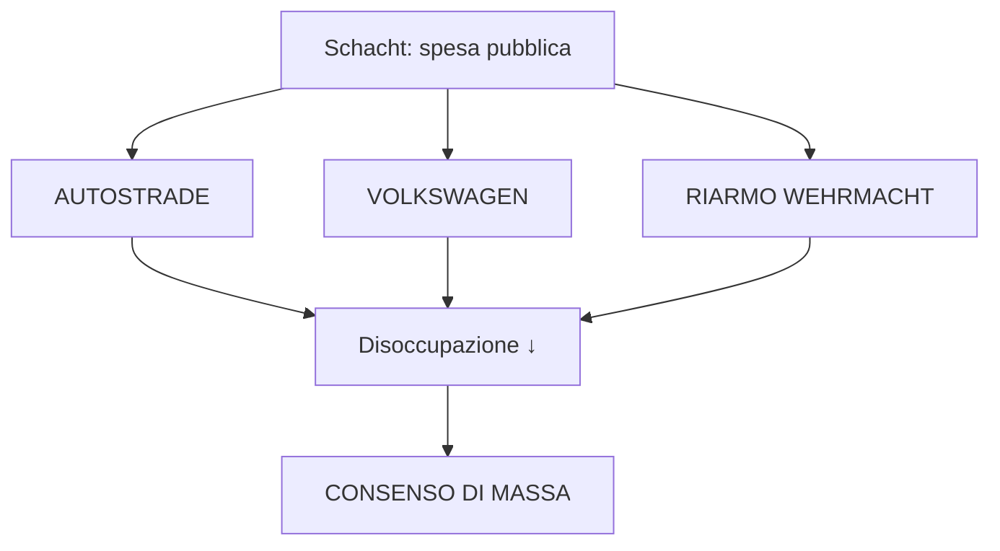
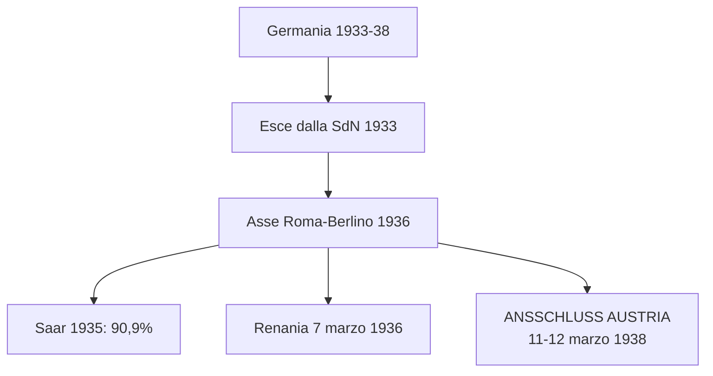
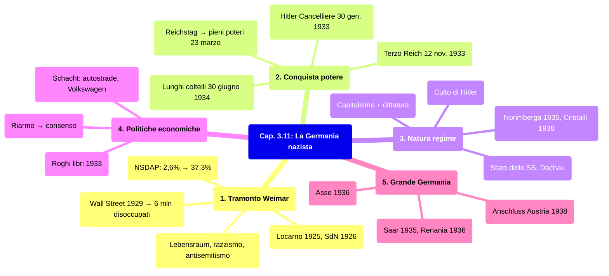

# Ripasso Veloce - Cap. 3.11: La Germania nazista

---

## Date fondamentali del capitolo

| Anno / Data | Evento |
|-------------|--------|
| **21 luglio 1921** | Hitler capo del NSDAP |
| **8 novembre 1923** | Putsch della birreria a Monaco |
| **30 gennaio 1933** | Hitler Cancelliere |
| **12 novembre 1933** | Terzo Reich |
| **30 giugno 1934** | Notte dei lunghi coltelli |
| **Settembre 1935** | Leggi di Norimberga |
| **Marzo 1938** | *Anschluss* Austria |
| **9-10 novembre 1938** | Notte dei cristalli |

---

## 1. Il tramonto della Repubblica di Weimar

### Stabilizzazione 1924-29
- **Ripresa economica** + coalizione centro-destra sotto **Hindenburg**
- **Accordi di Locarno 1925**: frontiere inviolabili, Renania smilitarizzata
- **Germania ammessa nella SdN** (1926)
- **Stresemann** ministro Esteri: compromesso con i vincitori

### Rottura 1929
- Morte di **Stresemann** + **crollo di Wall Street** = Grande Depressione
- Disoccupazione: da 1,3 mln → **6 milioni** (gennaio 1933)
- Consensi ai partiti **estremisti**, liberali irrilevanti

### Il Partito nazista (NSDAP)
- **Hitler** (austriaco, 1889): nel 1919 entra nella *Deutsche Arbeiterpartei*
- 1921: Führer del NSDAP
- Programma: **anticapitalismo + pangermanesimo + darwinismo sociale + antisemitismo**
- Ideali: **«comunità di popolo»**, **«razza ariana»**, **«spazio vitale» (*Lebensraum*)**
- **Ebreo = nemico assoluto**, complotto ebraico-comunista

### SA, SS e Mein Kampf
- **SA** (camicie brune) di **Ernst Röhm**: milizia armata
- **SS** di **Heinrich Himmler** (dal 1929)
- **Putsch della birreria** Monaco, 8 novembre 1923 → Hitler incarcerato
- In carcere scrive ***Mein Kampf***

---

## 2. La conquista del potere

### La repubblica d'emergenza
- Marzo 1930: ultimo governo democratico si dimette
- Poteri eccezionali del Presidente → **sospensione del Parlamento**
- Tre Cancellieri impotenti: **Brüning → von Papen → von Schleicher**

### Ascesa elettorale NSDAP

| Data | NSDAP |
|---|---|
| Maggio 1928 | 2,6% |
| Settembre 1930 | 18,3% |
| Luglio 1932 | 37,3% |
| Novembre 1932 | 33,1% |
| Marzo 1933 | 43,9% |

### Sinistra lacerata
- **SPD vs KPD**: i comunisti chiamano i socialdemocratici **socialfascisti**
- Nessun fronte comune contro il nazismo
- **Von Papen** convince Hindenburg: **30 gennaio 1933 = Hitler Cancelliere**

### Incendio del Reichstag e pieni poteri
- **28 febbraio 1933**: incendio del Parlamento
- Decreto emergenza: **libertà sospese**, censura, domicilio violabile
- **5 marzo**: elezioni, NSDAP 43,9%
- **23 marzo**: **Legge dei pieni poteri** (444 sì, 94 no) → dittatura legalizzata

### Liquidazione opposizioni
- Maggio 1933: **sindacati fuori legge**
- Luglio 1933: **partito unico** NSDAP
- Sterilizzazione forzata: **400.000 persone**

### Notte dei lunghi coltelli (30 giugno 1934)
- **Gestapo** (polizia segreta di Göring) elimina i **leader delle SA**
- **Röhm** ucciso con ~100 seguaci
- Von Papen estromesso
- **Hitler potere assoluto**: Cancelliere + Presidente + capo Forze armate

---

## 3. Natura del regime

### Comunità omogenea di sangue
- **Nemico del nazista = la persona**
- Tutti ridotti a **membri della comunità di sangue**
- Regime soprattutto **razzista**

### Stato delle SS e campi
- Polizie repressive accentrate sotto **Himmler** = **«Stato delle SS»**
- **Dachau** (22 marzo 1933): primo campo di concentramento
- Eugenetica: sterilizzazione di malati e portatori di handicap

### Politica della razza
- ~**500.000 ebrei** in Germania (0,75% popolazione)
- **Arianizzazione** (aprile 1933): ebrei estromessi dalla PA
- **Leggi di Norimberga** (settembre 1935):
  - Perdita **cittadinanza** per ebrei
  - Vietati **matrimoni misti**
- **Notte dei cristalli** (9-10 novembre 1938):
  - Pogrom in tutto il Reich
  - Sinagoghe, negozi, abitazioni saccheggiati e incendiati
- **250.000 ebrei** emigrati prima del 1939

### Culto di Hitler
- **Pedagogia di massa** dalla culla alla tomba
- **Gioventù hitleriana** (*Hitlerjugend*) dai 10 anni
- Propaganda di **Goebbels**: **cinema** e **radio**

### Capitalismo e dittatura
- **Capitalismo compatibile** con dittatura
- Proprietà privata e profitti mantenuti
- **Fronte tedesco del lavoro**: sindacato unico, **niente contrattazione**, **sciopero = reato**

---

## 4. Politiche economiche e sociali

### Politica economica di Schacht
- **Hjalmar Schacht** ministro Economia (1933-37)
- **Espansione spesa pubblica**
- **Autostrade** + **Volkswagen** (Porsche)
- **Riarmo**: Wehrmacht 16 marzo 1935 (violazione Versailles)
- Risultato: **riduzione disoccupazione** → **consenso di massa**

### Vita culturale
- **Rogo dei libri** (Berlino, 10 maggio 1933): autori ebrei e socialisti
- **Arte degenerata** e **musica degenerata** bandite

### Religione politica
- Adunate di massa a **Norimberga**
- Film di **Leni Riefenstahl**: *Il trionfo della volontà* (1934), *Olympia* (1936)
- Calendario ritmato sul **culto di Hitler**

### Rapporti con le Chiese
- **Concordato con Santa Sede** (20 luglio 1933)
- Vescovo **von Galen**: denunce di neopaganesimo (1934) ed eutanasia (1941)
- **Pio XI** (marzo 1937): enciclica contro ideologia nazista

---

## 5. Il progetto di una «grande Germania»

### Orizzonte: guerra e dominio
- **Spazio vitale** (*Lebensraum*) verso **Est**
- Costruire la **«grande Germania»** prima della guerra
- Contesto favorevole: **paura comunismo**, **divergenze Londra-Parigi**, **isolazionismo USA**

### Rapporto con l'Italia
- 1934: Mussolini truppe al Brennero contro annessione Austria
- **1935-36**: avvicinamento dopo guerra Etiopia e **Spagna** (entrambi con Franco)
- **Asse Roma-Berlino** (1936)

### Espansione tedesca 1933-38
- **Ottobre 1933**: Germania esce dalla **SdN**
- **1935**: accordo navale con GB
- **1936**: Asse Roma-Berlino + Patto anti-Komintern (con Giappone)
- **1935**: **Saar** → plebiscito 90,9% per Germania
- **7 marzo 1936**: **Renania** occupata
- **11-12 marzo 1938**: **Anschluss Austria** (senza resistenza)

---

## Mappa concettuale d'insieme

