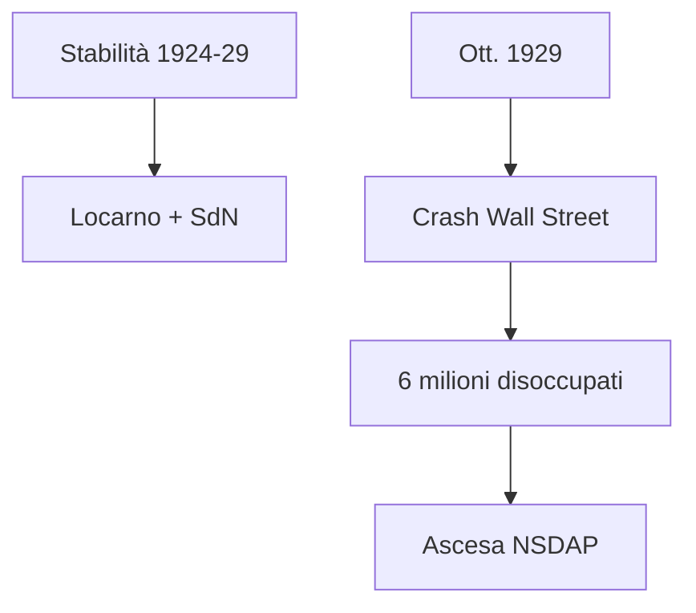
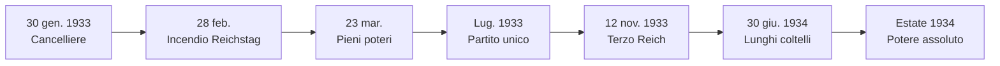
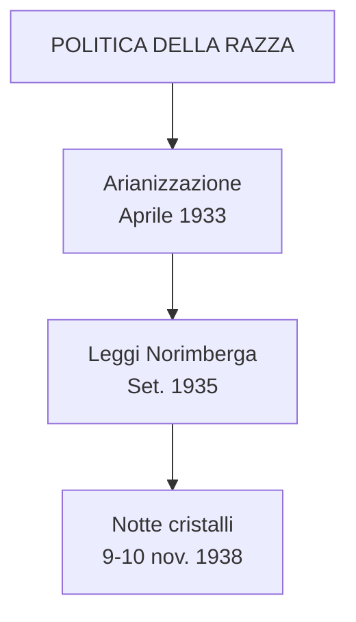
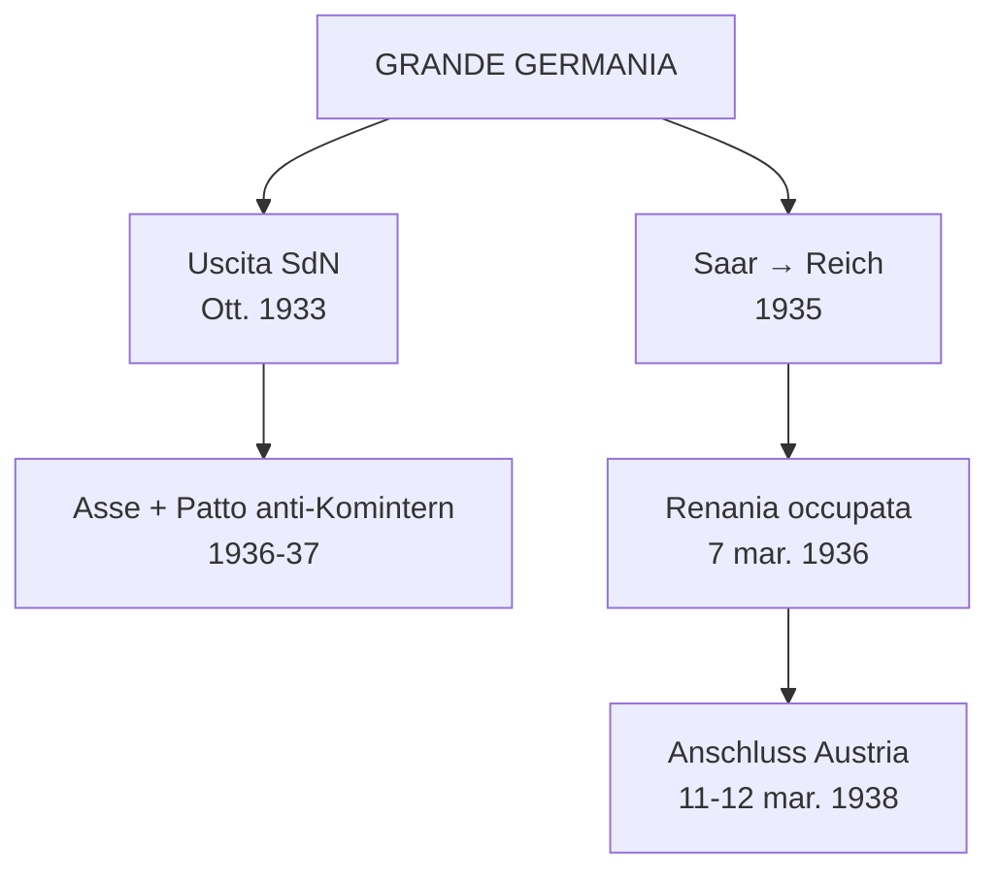
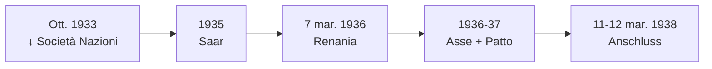
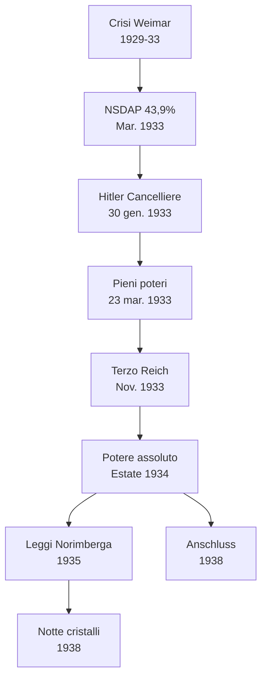

# Ripasso Veloce - Cap. 3.11: La Germania nazista

---

## Date fondamentali

| Anno | Evento |
|------|--------|
| **21 lug. 1921** | Hitler capo del **NSDAP** |
| **8 nov. 1923** | **Putsch di Monaco** («birreria»); Hitler arrestato → *Mein Kampf* |
| **1928-31** | NSDAP: 2,6% → 18,3% → 37,3% |
| **30 gen. 1933** | **Hitler Cancelliere** |
| **28 feb. 1933** | **Incendio Reichstag** → decreto emergenza (libertà sospese) |
| **23 mar. 1933** | **Lega dei pieni poteri** |
| **12 nov. 1933** | **Terzo Reich** (*«Ein Volk, ein Reich, ein Führer»*) |
| **30 giu. 1934** | **«Notte dei lunghi coltelli»**: SA eliminate |
| **Estate 1934** | Hitler **padrone assoluto** (Cancelliere + Presidente + capo Forze armate) |
| **Set. 1935** | **Leggi di Norimberga** (ebrei senza cittadinanza, matrimoni vietati) |
| **9-10 nov. 1938** | **«Notte dei cristalli»**: pogrom antiebraico |
| **Ott. 1933** | Germania esce dalla **Società delle Nazioni** |
| **1935** | **Saar** → Germania (plebiscito 90,9%) |
| **7 mar. 1936** | Occupazione **Renania** smilitarizzata |
| **11-12 mar. 1938** | **Anschluss**: Austria annessa |
| **1936-37** | **Asse Roma-Berlino** + **Patto anti-Komintern** (Giappone) |

---

## 1. Il tramonto di Weimar e l'ascesa di Hitler

### Stabilizzazione e crisi (1924-33)

- **1924-29**: Weimar sembrava stabile (ripresa economica, **accordi di Locarno** 1925, Germania in **Società delle Nazioni** 1926)
- **Stresemann** (ministro Esteri): compromesso con i vincitori
- **Ottobre 1929**: morte Stresemann + **crollo Wall Street** → **Grande Depressione**
- **Gennaio 1933**: **6 milioni di disoccupati** (vs 1,3 milioni sett. 1929)
- Crisi = rafforzamento **partiti estremisti**; Weimar in «spirale terminale»

### Il programma hitleriano

- **NSDAP**: programma che miscela **anticapitalismo + pangermanesimo + darwinismo sociale + antisemitismo**
- Più che «nazismo» = **hitlerismo** (senza Führer non c'è il nazismo)
- **«Razza ariana»** superiore → diritto allo **«spazio vitale»** (*Lebensraum*)
- **Ebrei** = nemico assoluto, alla radice del «complotto ebraico-comunista»
- Milizie: **SA** («camicie brune», Röhm) e **SS** (Himmler)
- **1923**: putsch di Monaco fallito → Hitler in carcere → ***Mein Kampf***

---

## 2. La conquista del potere

### Repubblica «d'emergenza»

- Dopo **marzo 1930**: governi con **poteri eccezionali** del Presidente (sospensione Parlamento)
- Ultimi Cancellieri: Brüning (cons.), von Papen, von Schleicher (reazionari) → tutti impotenti
- Sinistra lacerata: KPD vs SPD; Komintern indica socialdemocratici come **«socialfascisti»**

### Ascesa elettorale NSDAP

| Data | Consensi |
|------|----------|
| Mag. 1928 | 2,6% |
| Set. 1930 | 18,3% |
| Lug. 1932 | **37,3%** (maggioranza relativa) |
| Nov. 1932 | 33,1% |
| Mar. 1933 | **43,9%** |

- **30 gennaio 1933**: von Papen convince Hindenburg → **Hitler Cancelliere**
- **13 marzo 1933**: **Goebbels** ministro Propaganda

### Incendio Reichstag e pieni poteri

- **28 febbraio 1933**: **incendio Reichstag** → decreto «protezione popolo e Stato»
  - Sospese: opinione, stampa, riunione, associazione, inviolabilità domicilio
  - Stato di emergenza gestito direttamente dal Cancelliere
- **5 marzo**: elezioni, NSDAP **43,9%**; con partito tedesco-nazionale = maggioranza **51,9%**
- **23 marzo**: **Lega dei pieni poteri** → Hitler tutti i poteri, senza limiti temporali
  - 444 sì, 94 no (solo socialdemocratici); comunisti esclusi (carcere, esilio, clandestinità)
  - Centristi e liberali ricattati, si piegarono «per evitare il peggio»

### Terzo Reich e notte dei lunghi coltelli

- **Maggio 1933**: tutti i sindacati fuori legge (tranne quello nazista)
- **Luglio 1933**: **NSDAP unico partito legale**; sterilizzazione forzata per malattie ereditarie (400.000 persone in 12 anni)
- **12 novembre 1933**: **Terzo Reich** (*«Ein Volk, ein Reich, ein Führer»*)
- **30 giugno 1934**: **«Notte dei lunghi coltelli»**
  - **Gestapo** (Göring, marzo 1933) elimina leader SA (Röhm) ~100 uccisi
  - Destra guglielmina messa fuori gioco
- **Estate 1934**: Hitler **padrone assoluto** → Cancelliere + Presidente + capo Forze armate

---

## 3. La natura del regime nazista

### Regime di esclusione

- Obiettivo: **comunità nazionale omogenea**, devota al Führer
- Il nazismo fu soprattutto **razzista**
- **«Il nemico del nazista era la persona»**: tutti ridotti a membri della «comunità di sangue»

### Terrore e campi di concentramento

- Entro 1934: polizie e strutture repressive sotto **Himmler** → **«Stato delle SS»**
- Oppositori, «degenerati», «razze inferiori» → **campi di concentramento**
- **Dachau** (22 marzo 1933): primo campo, modello per gli altri
- Operazioni eugenetiche: «migliorare la stirpe» a danno di malati, disabili

### Politica della razza

- **~500.000 ebrei** in Germania (0,75% della popolazione)
- **7 aprile 1933**: legge «arianizzazione» → ebrei estromessi da pubblica amministrazione
- **Settembre 1935**: **Leggi di Norimberga**
  - Ebrei privati della cittadinanza
  - Matrimoni e rapporti sessuali con tedeschi vietati
- **9-10 novembre 1938**: **«Notte dei cristalli»**
  - Pogrom in tutto il Reich
  - Sinagoghe, negozi, abitazioni bruciati
  - ~250.000 ebrei emigrano 1933-39; pochi Paesi aprirono le frontiere

### Culto di Hitler e consenso

- **Culto di Hitler**: religione laica fondata su **pedagogia di massa**
- **Gioventù hitleriana** (*Hitlerjugend*): dai 10 anni, culto del corpo, indottrinamento, addestramento paramilitare
- Propaganda: **cinema** e **radio**
- Regime = **caos dei poteri**: conflitti Stato/partito, competenze sovrapposte, capi rivali per favore del Führer
- **Capitalismo e dittatura**: nessuna rivoluzione sociale; proprietà privata, profitti, classi
- **Fronte tedesco del lavoro**: tutti i lavoratori inquadrati, zero potere contrattuale, **sciopero = crimine**

---

## 4. Politiche economiche e sociali

### Politica economica

- **Hjalmar Schacht** (ministro Economia 1933-37): **espansione spesa pubblica**
- **Autostrade**: infrastrutture + motorizzazione
- **Volkswagen**: «automobile del popolo» (Porsche)
- **Riarmo**: esplicito dal **16 marzo 1935** (rinascita **Wehrmacht**, violazione Versailles)
- Tedeschi: dalla povertà a **modesta prosperità**
- **Forza dalla Gioia**: sport, turismo; **7 milioni** parteciparono a crociere 1933-39

### Vita culturale

- **10 maggio 1933**: **rogo dei libri** a Berlino (autori ebrei e socialisti)
- **«Arte degenerata»**: mostra 1937 (Chagall, Klee, Nolde, Grosz, Kokoschka)
- **«Musica degenerata»**: Mendelssohn, Mahler, Schönberg + musica moderna

### Religione politica

- **Adunate di Norimberga** → film *Il trionfo della volontà* (Leni Riefenstahl, 1934)
- **Olimpiadi Berlino 1936** → *Olympia* (Riefenstahl)
- Calendario: 30 gennaio (presa potere), 20 aprile (compleanno Hitler), 9 novembre (martiri putsch 1923)

### Chiese

- **20 luglio 1933**: **concordato** con Santa Sede
- Episcopato in gran parte accettò il regime (argine al bolscevismo)
- **Von Galen** (vescovo Münster): denunciò razzismo 1934, programma eutanasia «T4» 1941
- **Marzo 1937**: enciclica **Pio XI** → fede inconciliabile con ideologia nazista
- **Testimoni di Geova**: 25.000 affiliati → 10.000 incarcerati, 1200 uccisi

---

## 5. Il progetto della «grande Germania»

### Orizzonte: guerra e dominio

- Obiettivo ultimo: **guerra** per dominio germanico
- *Lebensraum* verso **Est**, poi confronto con Occidente
- Prima: erigere la **«grande Germania»**
- Sovvertimento Versailles = **consenso generale dei tedeschi**
- Hitler procedette per gradi, sfruttando: **paura comunismo**, **divergenze Londra-Parigi**, isolazionismo USA, ripiegamento URSS

### Rapporto con Italia

- **1934**: Mussolini schiera 4 divisioni al Brennero contro annessione Austria
- Avvicinamento solo **1935-36**: guerra Etiopia (nazisti neutrali) + **guerra civile spagnola** (entrambi con Franco)

### Espansione tedesca

- **Ottobre 1933**: Germania esce dalla **Società delle Nazioni**
- **1935**: accordo navale Londra (flotta tedesca = 35% Royal Navy)
- **1936-37**: **Asse Roma-Berlino** + **Patto anti-Komintern** (con Giappone, aderisce anche Italia)
- Hitler: talento tattico → minacce alternate a proclami di pace; sfruttò debolezza Stati centro-orientali

### Recupero terre perdute

- **1935**: **Saar** → Germania (plebiscito: **90,9%** pro-Reich)
- **7 marzo 1936**: occupazione **Renania** smilitarizzata; Hitler straccia accordi di Locarno

### Anschluss

- **11-12 marzo 1938**: Wehrmacht occupa **Austria senza resistenza**
- Mussolini non ostacola: intesa italo-tedesca, rapporti di forza rovesciati
- Hitler proclama ***Anschluss*** da Vienna
- Londra: linea conciliante; Parigi: sperava nelle promesse di pace

---

## Schema riepilogativo: tappe del Terzo Reich

---

## Tabella: le fasi del Terzo Reich

| Periodo | Fase | Eventi chiave |
|---------|------|---------------|
| **1924-29** | Stabilizzazione Weimar | Locarno; Germania in SdN |
| **1929-33** | Crisi e ascesa nazista | Crollo Wall Street; NSDAP 2,6% → 43,9% |
| **1933-34** | Conquista del potere | Cancelliere; incendio Reichstag; pieni poteri; Terzo Reich |
| **1934** | Consolidamento | Notte lunghi coltelli; potere assoluto |
| **1935-38** | Politica razziale | Leggi Norimberga; notte cristalli |
| **1935-38** | Espansione | Saar 1935; Renania 1936; Austria 1938 |