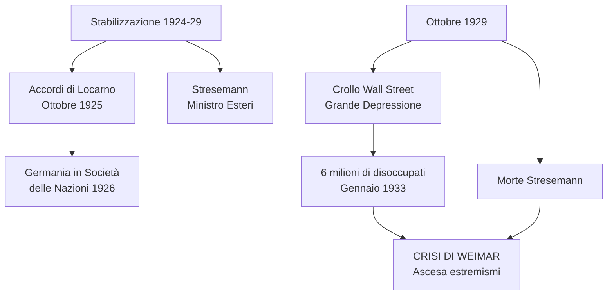
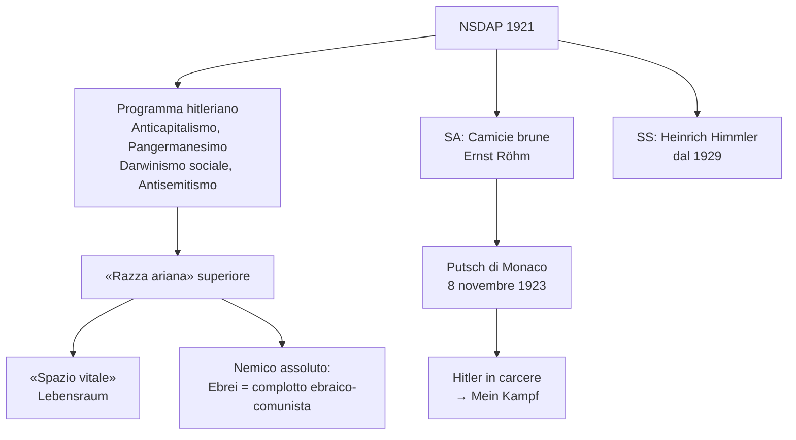
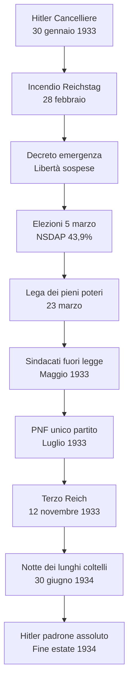
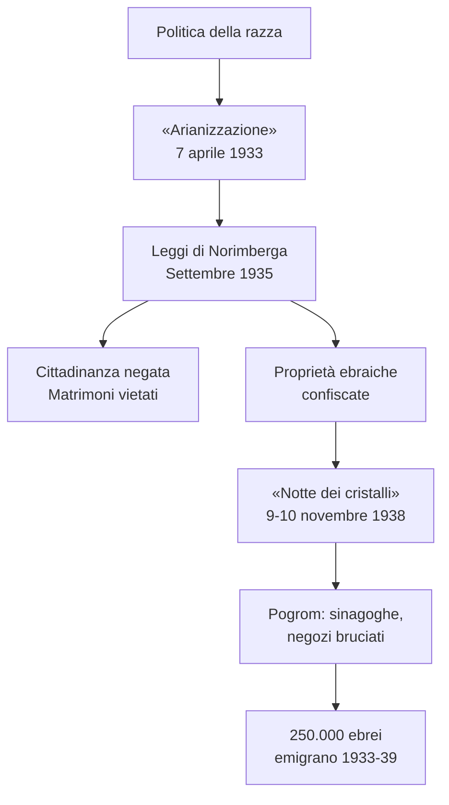
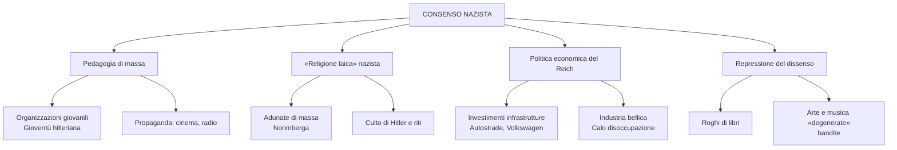
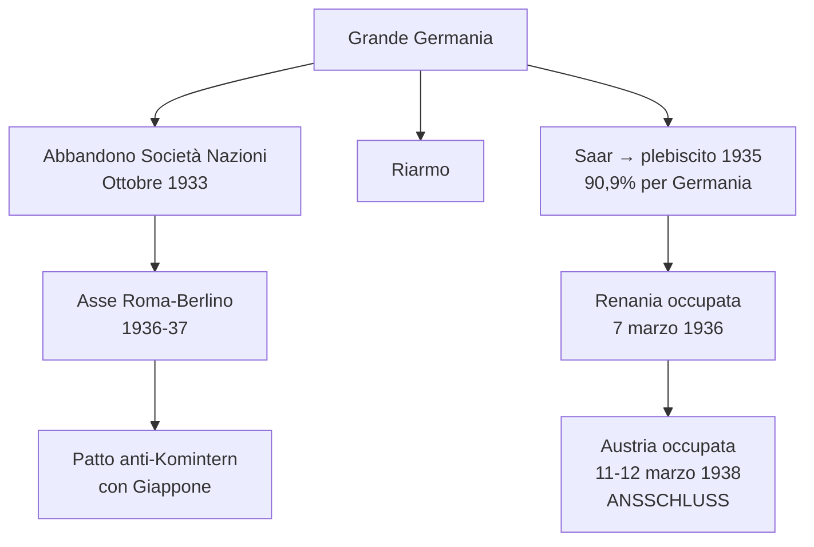
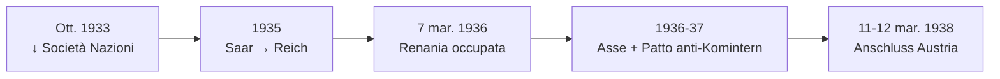
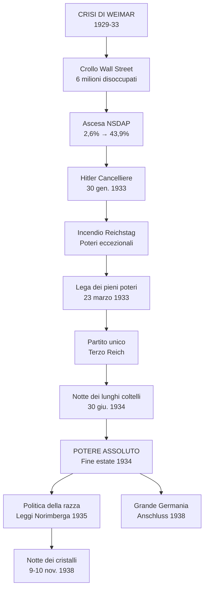

# Schema di Studio - Capitolo 3.11: La Germania nazista

---

## Date fondamentali del capitolo

| Anno / Data | Evento |
|-------------|--------|
| **21 luglio 1921** | Adolf **Hitler** è acclamato capo del **Partito nazionalsocialista tedesco dei lavoratori (NSDAP)** |
| **8 novembre 1923** | Fallito **colpo di Stato** a Monaco («putsch della birreria»); Hitler arrestato |
| **1928-31** | Il Partito nazionalsocialista aumenta i consensi alle tornate elettorali |
| **30 gennaio 1933** | **Hitler diventa Cancelliere**; Goebbels nominato ministro della Propaganda (13 marzo) |
| **12 novembre 1933** | Nasce il **Terzo Reich** |
| **30 giugno 1934** | **«Notte dei lunghi coltelli»**: la Gestapo elimina i leader della SA |
| **Fine estate 1934** | Hitler detiene **il potere assoluto**: Cancelliere, Presidente e capo delle Forze armate |
| **Settembre 1935** | **Leggi di Norimberga**: legislazione antirazziale |
| **Marzo 1938** | **Anschluss**: la Germania occupa e annette l'**Austria** |
| **9-10 novembre 1938** | **«Notte dei cristalli»**: violento **pogrom** in tutto il Reich |
| **Ottobre 1933** | La Germania abbandona la **Società delle Nazioni** |
| **1935** | Plebiscito: la **Saar** torna alla Germania |
| **7 marzo 1936** | Occupazione della **Renania** smilitarizzata |
| **1936-37** | **Asse Roma-Berlino** e **Patto anti-Komintern** con Giappone |

---

## 1. Il tramonto della Repubblica di Weimar e l'ascesa di Hitler

### 1.1 La prospettiva di una stabilizzazione (1924-29)

Dal 1924 al 1929 la Repubblica di Weimar sembrò stabilizzarsi grazie a due fattori:

| Fattore | Descrizione |
|---------|-------------|
| **Ripresa economica** | La Germania appariva lanciata a recuperare il suo rango prebellico |
| **Equilibrio politico** | Presenza costante di alcuni esponenti; coalizione di centro-destra stabile sotto la supervisione di **Paul von Hindenburg** |

Anche sul piano delle **relazioni internazionali** la Germania sembrava rientrare pacificamente nella famiglia delle maggiori potenze. Ciò fu permesso da:
- Prevalere dell'***appeasement*** britannico sulla *revanche* francese
- **Sostegno finanziario americano** per mitigare gli effetti delle riparazioni

> **Appeasement**: politica estera «morbida» verso la Germania, adottata dal governo britannico nel dopoguerra. Indica accordi ottenuti in cambio di concessioni molto onerose.

> **Revanche**: atteggiamento politico nazionalista e antitedesco, animato dalla volontà di riscattare la disfatta del 1870-71.

### 1.2 Il rapporto Germania-URSS e il ruolo di Stresemann

Dopo la guerra, **Germania e Unione Sovietica** si erano avvicinate: condividevano l'esclusione dal tavolo della pace. L'intesa fu sancita dal **Trattato di Rapallo** nel 1922:
- Regolazione delle pendenze belliche
- Riavvio degli scambi commerciali
- **Cooperazione militare segreta**: la Germania aggirava le clausole di Versailles testando le armi in territorio russo; in cambio, i russi ottenevano prodotti e tecnologie tedeschi

**Gustav Stresemann** fu **ministro degli Esteri** dal 1923 al 1929:
- Guidò i negoziati per sanare pacificamente le ferite territoriali aperte da Versailles
- Non aveva abbandonato gli ideali nazionalisti di gioventù, pensava alla «grande Germania»
- Riteneva inevitabile il **compromesso con i vincitori**

Nell'ottobre 1925 **Germania, Francia e Belgio** firmarono gli **accordi di Locarno** (con Italia e Regno Unito come garanti):
- Inviolabilità delle frontiere stabilite a Versailles
- Rinuncia tedesca a rivendicazioni sull'Alsazia-Lorena
- Smilitarizzazione della Renania

Sull'onda dello «spirito di Locarno», la Germania fu **ammessa nella Società delle Nazioni** nel 1926.

### 1.3 La rottura del 1929

Nell'ottobre 1929 si aprì una nuova fase:
- Morte di **Stresemann**
- **Crollo di Wall Street** → avvio della **Grande Depressione mondiale**

La Repubblica di Weimar fu investita in pieno nell'inverno 1929-30:
- I governi repubblicani non seppero far fronte alla crisi
- Politica di rigido controllo della moneta e del debito pubblico peggiorò la situazione
- Gennaio 1933: **6 milioni di disoccupati** (contro 1,3 milioni nel settembre 1929)

Questa crisi contribuì al **rafforzamento dei partiti estremisti**, mentre i liberali erano ormai irrilevanti. Weimar cominciò ad avvitarsi nella **spirale terminale**.

### 1.4 Il Partito nazista di Adolf Hitler

Quando la tempesta del crollo della Borsa di New York investì la Germania, esisteva un piccolo partito estremista: la ***Nationalsozialistische Deutsche Arbeiterpartei*** (**NSDAP**). Alle elezioni del 1928 aveva raccolto solo il **2,6%** dei suffragi.

**Adolf Hitler**:
- Nato in Austria nel **1889**, in una famiglia della piccola borghesia
- Ottenne la cittadinanza tedesca solo nel **1932**
- Combatté per quattro anni nell'esercito bavarese, segnalandosi per il coraggio
- Nell'estate del 1919 incontrò la politica → da allora fu la sua unica passione totalizzante

A Monaco, Hitler fu coinvolto nella *Deutsche Arbeiterpartei*, scheggia ultranazionalista fondata nel gennaio 1919. In due anni trasformò quel gruppuscolo in un partito strutturato. Il **29 luglio 1921** fu acclamato presidente della NSDAP. Cominciava l'ascesa del futuro **Führer** del Terzo Reich.

### 1.5 Il programma hitleriano

Il programma nazionalsocialista miscelava **anticapitalismo, pangermanesimo, darwinismo sociale e antisemitismo**:

| Elemento | Significato |
|---------|-------------|
| **Anticapitalismo** | Critica al capitalismo finanziario |
| **Pangermanesimo** | Tutti i tedeschi in un unico Stato |
| **Darwinismo sociale** | Selezione naturale applicata alle «razze» |
| **Antisemitismo** | Ebrei come nemico assoluto |

Più che di nazionalsocialismo (in breve, **nazismo**), quel movimento merita il marchio di **hitlerismo**: senza Führer non ci sarebbe stato il nazismo.

Hitler oltrepassava l'idea di Stato nazionale per approdare all'idea di **«comunità di popolo»**, fondata sulla presunta esistenza di una **«razza ariana»** superiore. Questo popolo aveva diritto allo **«spazio vitale»** (*Lebensraum*) che gli era stato negato a Versailles e da quel **complotto internazionale ebraico-comunista** alla radice della situazione tedesca.

> Tutti gli altri popoli erano «naturalmente» subordinati a quello germanico: a cominciare da **slavi, zingari** e soprattutto **ebrei**, che dovevano essere estirpati dalla comunità tedesca. L'ebreo era il **nemico assoluto**.

### 1.6 Tatticismi, violenza politica e il Mein Kampf

Negli anni Venti, per conquistare visibilità i nazisti ricorsero sia a **caute intese**, sia alla più **brutale violenza**. Hitler fu un abile manovratore, allievo a distanza di Mussolini.

| Organizzazione | Caratteristiche |
|----------------|-----------------|
| **SA** (*Sturmabteilung*) | Milizia armata, note come **«camicie brune»**; diretta da **Ernst Röhm**; assalti squadristi contro sindacalisti e gruppi di sinistra |
| **SS** (*Schutzstaffeln*) | Altra milizia; dal 1929 sotto il comando di **Heinrich Himmler** |

Il fallimento del **putsch di Monaco** dell'**8 novembre 1923** («putsch della birreria») costò a Hitler alcuni mesi di carcere. In questo periodo formalizzò il suo programma politico in ***Mein Kampf*** («La mia battaglia»).

---

## 2. La conquista del potere

### 2.1 La repubblica «d'emergenza»

Dopo la morte di Stresemann, l'esaurirsi dello «spirito di Locarno» e il crollo di Wall Street, scoccò l'ora di Hitler.

L'ultimo governo democratico di coalizione si dimise nel **marzo 1930**. Da allora, il potere fu esercitato in base ai **poteri eccezionali** che il Presidente della Repubblica poteva avocare a sé in casi di «emergenza»:
- **Sospensione del ruolo del Parlamento**
- Potenzialmente di ogni garanzia costituzionale

Gli ultimi tre Cancellieri della repubblica:
| Cancelliere | Periodo | Orientamento |
|-------------|---------|--------------|
| **Heinrich Brüning** | Fino a maggio 1932 | Conservatore |
| **Franz von Papen** | Fino a dicembre 1932 | Reazionario |
| **Kurt von Schleicher** | Fino a gennaio 1933 | Reazionario |

Questi governi, nati per raddrizzare l'economia e trasformare la repubblica **in senso autoritario**, si rivelarono impotenti.

### 2.2 La sinistra lacerata e gli errori di reazionari e conservatori

Il progetto reazionario era privo dei voti necessari. Il Parlamento veniva sciolto di continuo. A ogni elezione la vita politica degenerava in **guerra civile**.

**Risultati elettorali NSDAP (1928-33):**

| Elezioni | Consensi NSDAP |
|----------|----------------|
| Maggio 1928 | **2,6%** |
| Settembre 1930 | **18,3%** |
| Luglio 1932 | **37,3%** (maggioranza relativa) |
| Novembre 1932 | **33,1%** |
| Marzo 1933 | **43,9%** |

Le forze di sinistra non furono in grado di far fronte comune contro il nazismo:
- **KPD** e **SPD** avevano rotto quando i governi socialdemocratici avevano stroncato i tentativi rivoluzionari
- Il Komintern indicava ai comunisti di contrastare i Partiti socialdemocratici, detti **socialfascisti**

> **Socialfascismo**: termine coniato in seno al Komintern per indicare spregiativamente i partiti socialdemocratici, accusati di aver tradito la causa rivoluzionaria e di aver favorito l'ascesa dei fascismi.

Alle elezioni del **luglio 1932** il partito di Hitler toccò il **37,3%** e ottenne la maggioranza relativa in Parlamento. **Von Papen** si illuse di poter addomesticare Hitler e convinse Hindenburg ad affidargli il Cancelleriato. Era il **30 gennaio 1933**.

### 2.3 Hitler al governo

Quella che per i nostalgici del Reich guglielmino era l'inizio della restaurazione, per la mitografia di Hitler – orchestrata da **Joseph Goebbels**, elevato il 13 marzo a **ministro della Propaganda** – era l'avvio della **«rivoluzione nazionalsocialista»**.

Hitler poteva contare sui propri **corpi paramilitari**:
- **SA** e **SS**: oltre mezzo milione di pretoriani
- Determinati a sradicare le opposizioni di sinistra e a dar sfogo al loro odio verso gli ebrei

### 2.4 L'incendio del Reichstag e i pieni poteri a Hitler

Non appena diventato Cancelliere, Hitler sciolse il Parlamento (1° febbraio) e indisse **nuove elezioni** per il 5 marzo.

L'**incendio del Reichstag** nella notte del 28 febbraio fu il pretesto per un decreto «per la protezione del popolo e dello Stato»:

| Libertà colpita | Provvedimento |
|-----------------|---------------|
| **Opinione** | Colpita |
| **Stampa** | Censura di Stato |
| **Riunione** | Colpita |
| **Associazione** | Colpita |
| **Inviolabilità domicilio** | Abolita |

Lo «stato di emergenza» era assegnato alla gestione diretta del Cancelliere, senza passare attraverso il controllo del Presidente.

Il 5 marzo la NSDAP raccolse il **43,9%** dei voti. Insieme ai suffragi per il partito tedesco-nazionale, bastava per una maggioranza parlamentare del **51,9%**.

Il 23 marzo il Reichstag approvò la **Lega dei pieni poteri**, che assegnava a Hitler **tutti i poteri senza limiti temporali**:
- 444 sì (prevalentemente dalla coalizione di governo)
- 94 no (i socialdemocratici non arrestati o fuggiti)
- I deputati comunisti non poterono partecipare (clandestinità, carcere, esilio)

Per ottenere la maggioranza dei due terzi, Hitler minacciarono il centro cattolico e i liberali, che si piegarono con la giustificazione di voler evitare il peggio.

### 2.5 Le opposizioni messe fuori legge

**Maggio 1933**: messa **fuori legge di tutti i sindacati** tranne quello nazista.
**Luglio 1933**: il **Partito nazista era l'unico** che poteva esistere in Germania.

Lo stesso giorno fu licenziata la normativa sulla prevenzione delle nascite affette da malattie ereditarie: nel dodicennio nazista avrebbe provocato la **sterilizzazione forzata** di almeno **400.000 persone**.

### 2.6 Il Terzo Reich e la «normalizzazione» del Partito

Il **12 novembre 1933** il regime chiamò a votare per eleggere un nuovo Reichstag tutto nazista. Nasceva il **Terzo Reich**, un regime di massa sottoposto al suo duce: *«Ein Volk, ein Reich, ein Führer»* («Un popolo, un regime, un duce»).

> Il primo Reich era il Sacro romano impero fondato da Ottone I nel 962 (dissolto 1806). Il secondo Reich era l'impero fondato da Guglielmo I nel 1871 (crollato 1918).

Le ultime resistenze alla dittatura vennero dall'interno del movimento. Hitler proclamò che la fase della rivoluzione si era conclusa.

Il **30 giugno 1934** scattò la repressione contro i leader delle SA nella **«notte dei lunghi coltelli»**:
- La **Gestapo** (creata nel marzo 1933 da **Hermann Göring**) eliminò i presunti ribelli
- **Röhm** e il leader della corrente socialisteggiante furono uccisi con un centinaio di uomini loro vicini
- La destra guglielmina fu messa fuori gioco

Dalla tarda estate del 1934 Hitler fu **padrone assoluto**: Cancelliere, comandante in capo delle Forze armate e Presidente.

---

## 3. Le finalità e la natura del regime nazista

### 3.1 Un regime fondato sull'esclusione del «diverso»

Il tratto dominante del nazismo al potere fu la determinazione a costruire una **comunità nazionale omogenea**, devota al Führer.

> **Il nemico del nazista era la persona.** L'ideale hitleriano non ammetteva cittadini, né uomini e donne dotati di una sfera autonoma. Tutti dovevano essere ridotti a **membri della comunità di sangue**.

Il nazionalsocialismo non fu, a rigore, né nazionalista né socialista, ma soprattutto **razzista**.

Il nazismo estremizzò pregiudizi e politiche già diffusi in Occidente:
- **Antisemitismo**
- **Darwinismo sociale**
- **Eugenetica** (miglioramento della stirpe)

### 3.2 La persecuzione e i campi di concentramento

Il **terrore di regime** si scatenò con la presa del potere. Entro il 1934 le polizie e le strutture paramilitari repressive furono accentrate sotto **Heinrich Himmler**: nasceva lo **«Stato delle SS»**.

Oppositori, «asociali», «degenerati», appartenenti a «razze inferiori» furono rinchiusi in **campi di concentramento**:
- Il modello fu **Dachau**, nei pressi di Monaco, inaugurato il **22 marzo 1933**
- Ne seguirono molti altri

Con particolare acribia si eseguivano operazioni eugenetiche per «migliorare la stirpe», a danno di malati, portatori di handicap, individui malformati.

> Il concetto di razza era un'invenzione: la ricerca genetica ha provato che le «razze» non esistono in natura.

### 3.3 La politica della razza e l'ossessione antiebraica di Hitler

Un asse portante dell'azione di Hitler fu la politica della razza, centrata sull'**eliminazione del «virus ebraico»** dalla comunità germanica.

Nel Reich viveva circa **mezzo milione di ebrei** (0,75% della popolazione), più altre centinaia di migliaia di **persone di origine ebraica**. Tra essi vi erano scienziati, letterati, imprenditori, finanzieri, ma anche soldati e ufficiali fedeli al Reich che avevano combattuto nella Grande guerra.

**Legge sull'«arianizzazione» (7 aprile 1933)**:
> «Gli impiegati pubblici che non sono di discendenza ariana verranno pensionati e qualora siano pubblici ufficiali onorari, verranno privati del loro status»

### 3.4 Dalle Leggi di Norimberga alla «notte dei cristalli»

La legislazione razziale fu perfezionata nel **settembre 1935** con le due **Leggi di Norimberga**:
- Privavano i tedeschi di origine ebraica dei **diritti di cittadinanza**
- Vietavano il matrimonio e qualsiasi rapporto sessuale fra tedeschi ed ebrei

Il culmine della campagna antisemita prima della guerra fu la **«notte dei cristalli»** (**9-10 novembre 1938**):
- Prendendo a pretesto l'attentato di un ragazzo ebreo contro un diplomatico tedesco a Parigi
- Le squadre naziste scatenarono un **pogrom** senza precedenti
- In tutto il Reich sinagoghe, negozi e abitazioni di ebrei furono saccheggiati e dati alle fiamme

Negli anni Trenta il Reich favorì l'emigrazione verso la Palestina britannica: circa **250.000 ebrei tedeschi** (circa la metà della comunità) **lasciarono la Germania prima del 1939**. Ben pochi Paesi aprirono le frontiere per dar loro asilo.

### 3.5 Il consenso: il culto di Hitler

La maggioranza dei tedeschi apprezzava Hitler perché stava mantenendo le sue promesse in campo economico e sociale. Ma c'era anche qualcosa di profondamente irrazionale: la suggestione esercitata dal Führer. Vigeva ormai una nuova religione, il **culto di Hitler**.

Era un culto fondato su una **pedagogia di massa**, dalla culla alla tomba, attraverso numerose organizzazioni:
- **Gioventù hitleriana** (*Hitlerjugend*): plasmava lo stile di vita di nazisti e ragazze dal decimo anno di età
- Culto del corpo, esibizioni ginniche, indottrinamento ideologico, addestramento paramilitare

La propaganda di Goebbels trovò nel **cinema** e nella **radio** gli strumenti di uniformazione dei cuori e delle menti.

### 3.6 Un regime senza Stato?

La dittatura di Hitler incentivava il **caos dei poteri** a livello locale e centrale:
- Conflitti fra strutture dello Stato, del partito e altre organizzazioni parallele
- Competenze spesso sovrapposte
- I capi nazisti rivaleggiavano per il controllo delle risorse o per un contatto diretto con il Führer

Il Führer era pronto a mettere i suoi ambiziosi subordinati l'uno contro l'altro per meglio controllarli.

### 3.7 Democrazia e capitalismo

Il regime hitleriano non si propose mai una rivoluzione sociale. Al suo interno sopravvivevano:
- Le classi
- La proprietà privata
- I profitti

Un **sistema economico capitalista** poteva adattarsi a un **sistema dittatoriale**, facendo a meno del contesto liberaldemocratico.

I capitalisti tedeschi passarono quasi tutti al regime, per fede o per interesse. La borghesia apprezzò la persecuzione di comunisti e socialdemocratici.

Alla liquidazione dei sindacati seguì la creazione del **Fronte tedesco del lavoro**:
- Confluivano operai, impiegati, artigiani, commercianti e imprenditori
- Nessun potere di contrattazione su salari e ritmi di lavoro
- Lo sciopero diventava un crimine

---

## 4. Le politiche economiche e sociali

### 4.1 Un consenso creato, non solo estorto o fanatico

La vastità del consenso che crebbe rapidamente intorno a Hitler aveva anche una base positiva nella **politica economica** del Reich.

**Hjalmar Schacht** fu **ministro dell'Economia** dall'agosto 1933 al novembre 1937 (poi sostituito da **Hermann Göring** per il passaggio all'economia di guerra).

In un contesto di crisi globale e isolamento internazionale, Schacht promosse una politica di **espansione della spesa pubblica**:

| Iniziativa | Obiettivo |
|------------|-----------|
| **Grandiosi progetti infrastrutturali** | Ridurre drasticamente la disoccupazione |
| **Autostrade** | Rete di trasporti per collegare i principali centri urbani; favorire la motorizzazione |
| **Volkswagen** | «Automobile del popolo», progettata da Ferdinand Porsche |
| **Riarmo** | Avviato con cautela 1933-34, divenne esplicito dal **16 marzo 1935** con la rinascita della **Wehrmacht** |

### 4.2 Una modesta prosperità

In breve tempo i tedeschi passarono dalla povertà diffusa a un grado di **sicurezza economica** e di benessere modesto ma accessibile alle grandi masse.

Il regime offriva ai lavoratori alcune compensazioni:
- Organizzazioni come **Forza dalla Gioia** (*Kraft durch Freude*)
- **Socializzazione delle masse operaie e impiegatizie** attraverso sport e turismo
- Fino al 1939, circa **7 milioni di tedeschi** fruirono delle crociere di regime

### 4.3 La vita culturale

La vita letteraria e artistica fu compressa dall'ideologia del regime:
- **Rogo dei libri** organizzato a Berlino il **10 maggio 1933**, replicato in altre città
- A bruciare furono migliaia di libri giudicati pericolosi e antinazionali, in primo luogo quelli di autori ebrei e socialisti
- **«Arte degenerata»**: mostra itinerante denigratoria organizzata da Goebbels nel 1937 (opere di Chagall, Klee, Nolde, Grosz, Kokoschka)
- **«Musica degenerata»**: compositori di ceppo ebraico (Mendelssohn, Mahler, Schönberg) e musica moderna

### 4.4 Adunate e ricorrenze: la religione politica del nazismo

A plasmare lo spirito popolare erano dedicate le grandi **adunate di massa**:
- Quella di **Norimberga** nel 1934 fu immortalata nel film *Il trionfo della volontà* di **Leni Riefenstahl**
- Autrice anche di *Olympia*, la pellicola celebrativa delle **Olimpiadi di Berlino del 1936**

Il nazismo era a suo modo una **religione politica** e come tutte le religioni aveva i suoi riti e i suoi miti.

**Il calendario del Terzo Reich:**
- **30 gennaio**: fiaccolate in memoria della presa del potere
- **20 aprile**: festeggiamenti per il compleanno di Hitler
- **9 novembre**: lugubri messe in scena a ricordo dei caduti nel putsch del 1923

**Costruzione del consenso nazista:**

### 4.5 I rapporti con le Chiese

Il governo nazista stipulò un **concordato con la Santa Sede** (**20 luglio 1933**). L'episcopato cattolico, pur cauto verso il nazismo, in gran parte si adattò al regime perché lo riteneva un argine al bolscevismo.

Casi di opposizione:
- Il vescovo di Münster, **Clemens August von Galen**, nel 1934 denunciò il razzismo e il **neopaganesimo** nazista
- Nel 1941 pronunciò un'omelia contro il **programma segreto di eutanasia** «T4», varato nel 1939

Nel **marzo 1937** la Santa Sede dichiarò l'inconciliabilità della fede cristiana con l'ideologia nazista attraverso un'enciclica di **Pio XI** letta in tutte le chiese tedesche.

> **Neopaganesimo**: tendenze anticristiane del nazismo, che si coniugavano a elementi della tradizione germanica precristiana. Per i nazisti, il cristianesimo aveva un'origine semita: Gesù era un circonciso.

Le strutture ecclesiastiche protestanti si divisero fra una Chiesa filonazista e una critica. I **testimoni di Geova** furono apertamente perseguitati: dei 25.000 affiliati, 10.000 incarcerati e 1200 uccisi.

---

## 5. Il progetto di una «grande Germania»

### 5.1 L'orizzonte della guerra

Fin dall'inizio, l'orizzonte ultimo del progetto di Hitler fu la guerra per sradicare l'ebraismo e affermare il dominio germanico sul mondo. Lo spazio vitale tedesco si sarebbe dovuto estendere **verso Est**.

Prima occorreva erigere la **«grande Germania»**. Tra il 1933 e il 1939, la geopolitica hitleriana poteva ancora essere letta come svolgimento delle vecchie aspirazioni nazional-imperiali.

Il sovvertimento dei trattati di Versailles si compì nel **consenso pressoché generale dei tedeschi**.

Hitler doveva procedere per gradi, testando le resistenze franco-britanniche, operando negli spazi offertigli da:
- **Paura del comunismo**
- **Divergenze fra Londra e Parigi**
- Scelta isolazionista di Roosevelt
- Ripiegamento dell'URSS sul «socialismo in un solo Paese»

### 5.2 Il rapporto con l'Italia di Mussolini

Nel 1933 Hitler sapeva che il Reich non aveva amici né alleati. Le affinità ideologiche e l'ammirazione per Mussolini erano subordinate alle **divergenti strategie geopolitiche**.

Nel **1934**, a Vienna fallì un colpo di Stato filonazista. **Mussolini schierò quattro divisioni alla frontiera del Brennero**: la pulsione hitleriana all'annessione dell'Austria era inconciliabile con la volontà italiana di salvaguardare l'Austria come cuscinetto.

I percorsi geopolitici di Mussolini e Hitler si **avvicinarono solo nel 1935-36**:
- Dopo la guerra coloniale italiana in **Etiopia** (i nazisti si ostentarono neutrali)
- La **guerra civile spagnola**, che vide i due dittatori impegnarsi a fianco dei nazionalisti di **Francisco Franco**

### 5.3 L'espansione tedesca in un contesto internazionale favorevole

**Ottobre 1933**: la Germania **abbandonò la Società delle Nazioni**.

Hitler diede slancio al **riarmo**. Nel 1935 stabilì un accordo navale con Londra che limitava la flotta tedesca al 35% della Royal Navy.

Nel **1936-37** il fronte delle potenze revisioniste si saldò formalmente:
- **Asse Roma-Berlino** con l'Italia
- **Patto anti-Komintern** con il Giappone (cui aderì anche l'Italia)

Hitler dimostrò un certo talento tattico: alternava minacce e mobilitazioni a proclami di volontà di pace, e molti credevano. Seppe sfruttare l'assenza di un serio contrappeso nell'Europa centro-orientale.

### 5.4 Il recupero delle terre perdute

**1935**: la **Saar** tornò alla Germania con un trionfale **plebiscito** (90,9% dei votanti per rientrare nel Terzo Reich).

**7 marzo 1936**: occupazione della **Renania** smilitarizzata, mentre Hitler stracciava gli accordi di Locarno.

Dopo aver recuperato i territori che erano già parte dell'Impero germanico, si doveva allargare il **Reich verso Est** per realizzare l'ideale del *Lebensraum*.

### 5.5 L'annessione dell'Austria

Il primo obiettivo era l'Austria, dove Hitler aveva alimentato le correnti pangermaniche. Tra l'11 e il 12 **marzo 1938** la Wehrmacht occupò l'Austria **senza incontrare resistenza**.

Mussolini non aveva più la forza né l'intenzione di ostacolare il suo omologo tedesco:
- Esisteva un'intesa italo-tedesca
- I rapporti di forza si erano rovesciati

Il Führer proclamò da Vienna l'***Anschluss***, l'annessione dell'Austria al Reich.

Le previsioni di Hitler sull'atteggiamento di Parigi e Londra si rivelarono corrette:
- Londra intendeva mantenere una linea conciliante
- Parigi sperava ancora di poter credere alle promesse di pace del Führer

---

## Schema riepilogativo: l'ascesa del nazismo

---

## Tabella riassuntiva: le tappe del Terzo Reich

| Periodo | Fase | Eventi chiave |
|---------|------|---------------|
| **1924-29** | Stabilizzazione Weimar | Accordi di Locarno; Germania in Società delle Nazioni |
| **1929-33** | Crisi e ascesa nazista | Crollo Wall Street; NSDAP dal 2,6% al 43,9% |
| **1933-34** | Conquista del potere | Hitler Cancelliere; incendio Reichstag; pieni poteri; Terzo Reich |
| **1934** | Consolidamento | Notte dei lunghi coltelli; potere assoluto di Hitler |
| **1935-38** | Politica razziale | Leggi di Norimberga; «notte dei cristalli» |
| **1935-38** | Espansione territoriale | Saar 1935; Renania 1936; Austria 1938 |