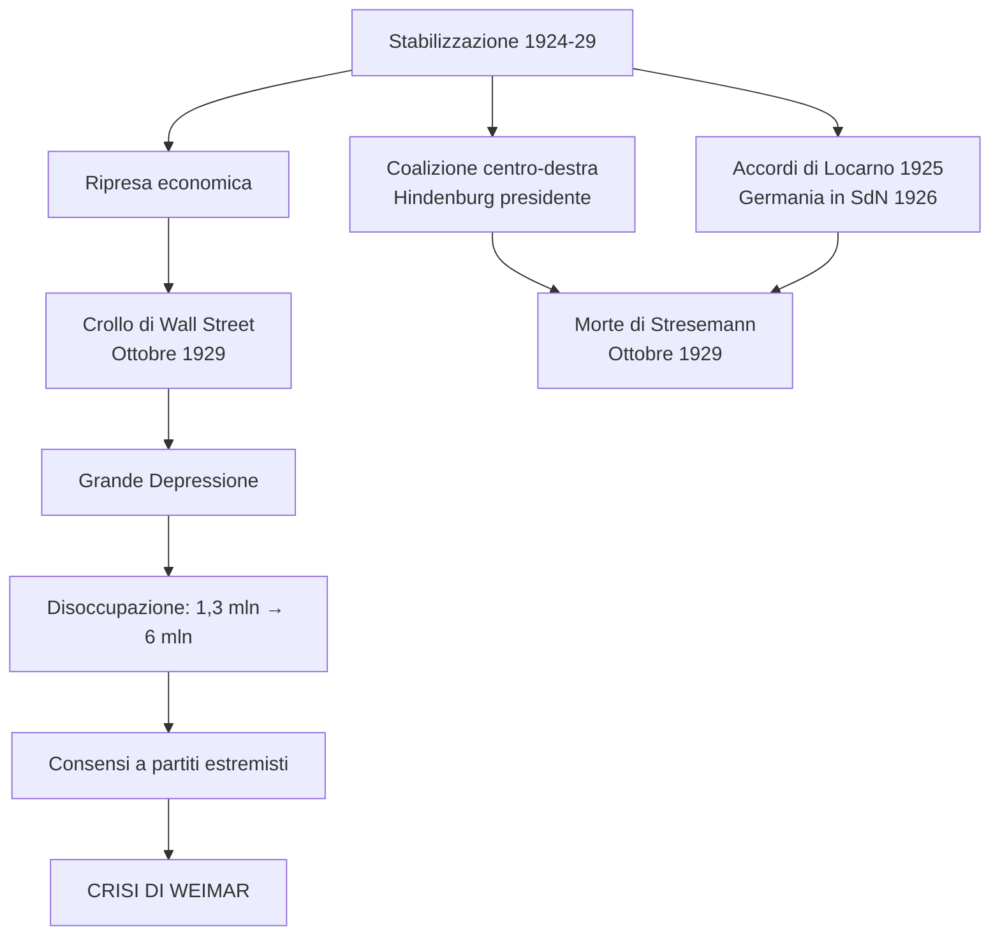
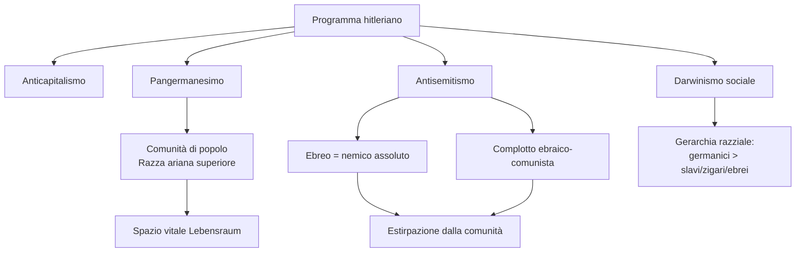
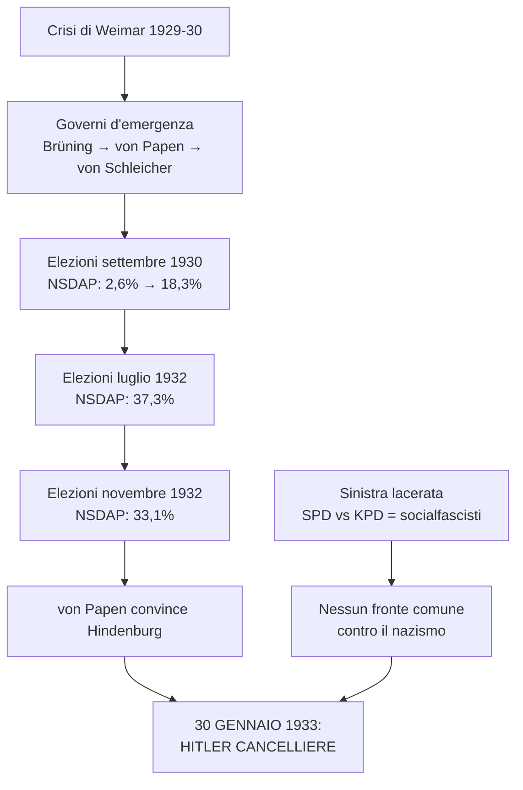
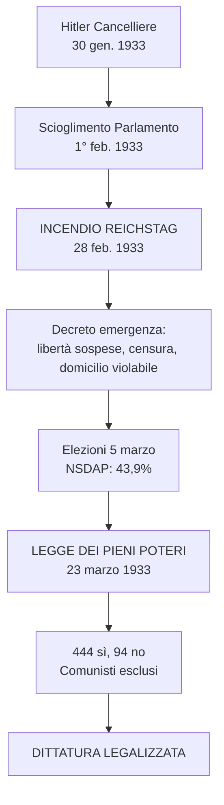
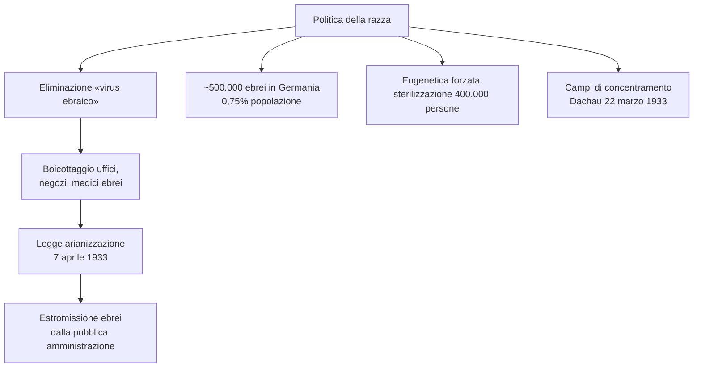
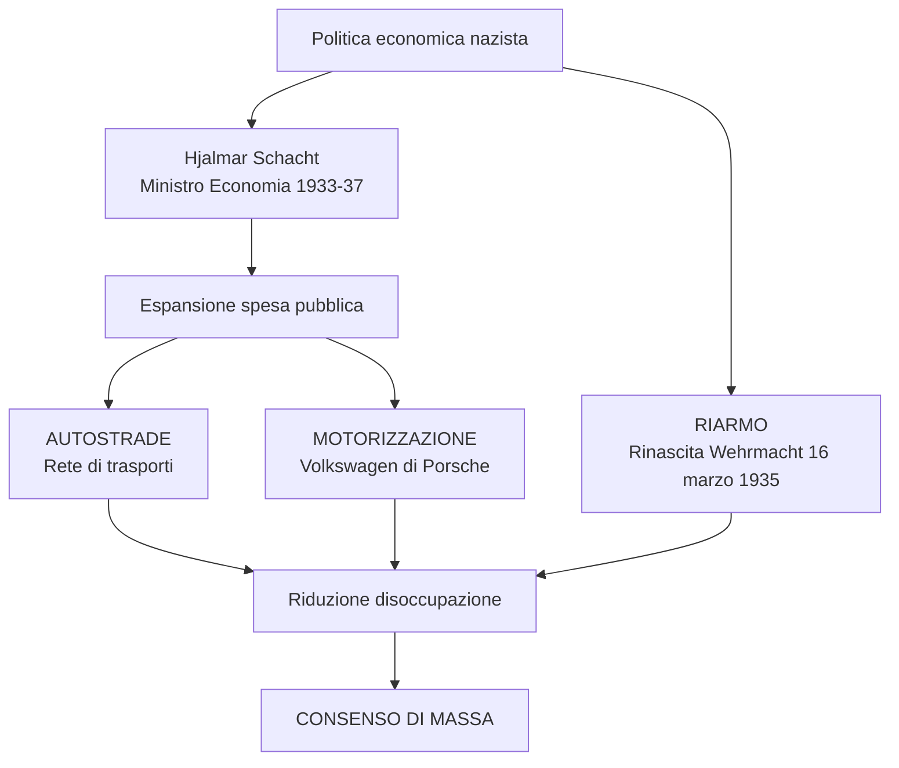
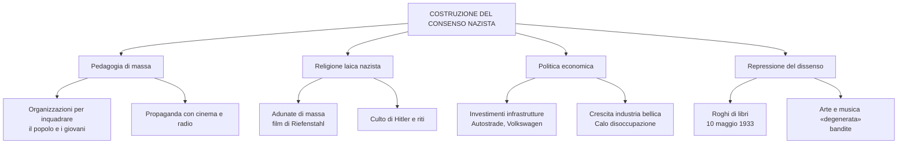
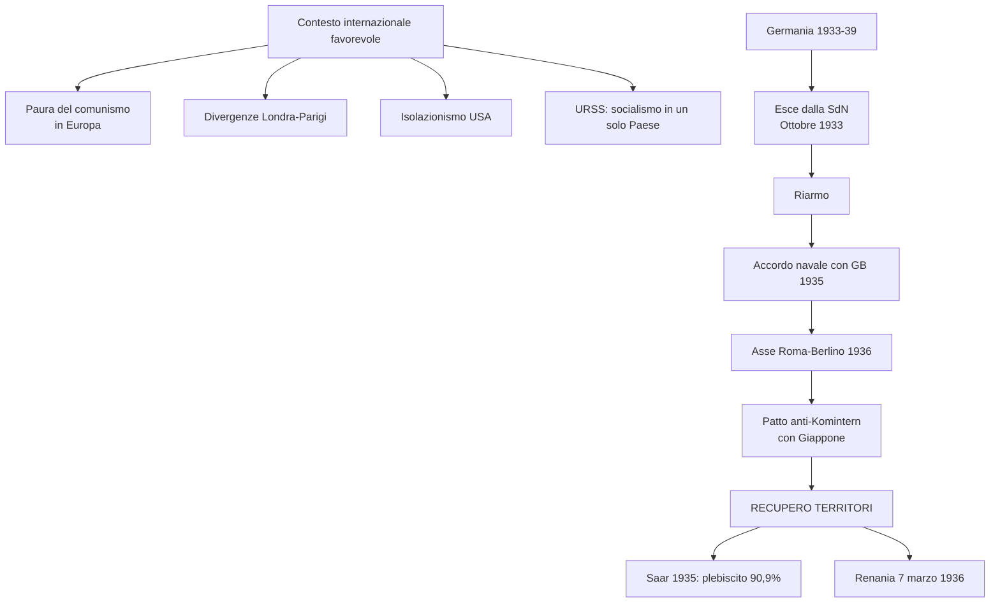
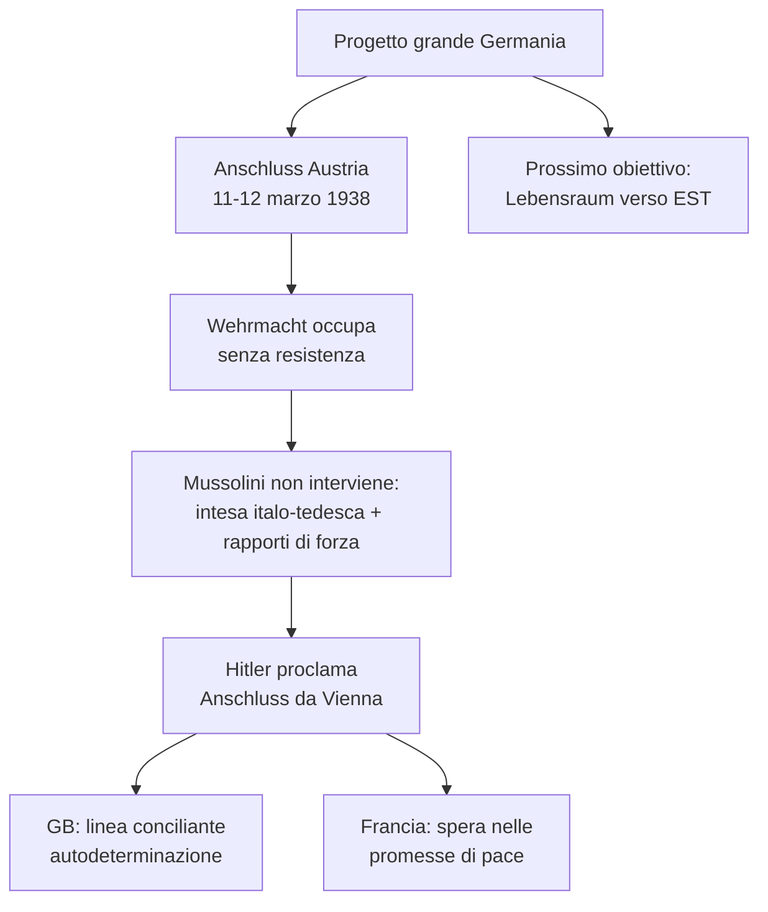
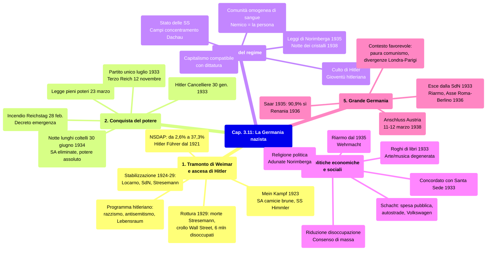

# Schema di Studio - Capitolo 3.11: La Germania nazista

---

## Date fondamentali del capitolo

| Anno / Data | Evento |
|-------------|--------|
| **21 luglio 1921** | Adolf **Hitler** è acclamato capo del **Partito nazionalsocialista tedesco dei lavoratori** (NSDAP) |
| **8 novembre 1923** | Fallito **colpo di Stato** a Monaco (*putsch* della birreria); Hitler arrestato |
| **1928-31** | Il Partito nazionalsocialista aumenta costantemente i propri consensi elettorali |
| **30 gennaio 1933** | **Hitler diventa Cancelliere**; Goebbels nominato ministro della Propaganda (13 marzo) |
| **12 novembre 1933** | Nasce il **Terzo Reich** |
| **30 giugno 1934** | **«Notte dei lunghi coltelli»**: la Gestapo elimina i leader delle SA |
| **Fine estate 1934** | Hitler detiene il **potere assoluto**: Cancelliere, Presidente e capo delle Forze armate |
| **Settembre 1935** | Promulgazione delle **leggi di Norimberga** (legislazione antirazziale) |
| **Marzo 1938** | La Germania occupa l'**Austria** e proclama l'**annessione** (*Anschluss*) |
| **9-10 novembre 1938** | **«Notte dei cristalli»**: violento **pogrom** antisemita in tutto il Reich |

---

## 1. Il tramonto della Repubblica di Weimar e l'ascesa di Hitler

### 1.1 La prospettiva di una stabilizzazione (1924-29)

Dal 1924 al 1929 la Repubblica di Weimar sembrò stabilizzarsi grazie alla congiuntura di due fattori fondamentali: una netta **ripresa dell'economia**, per cui la Germania appariva lanciata a recuperare il suo rango prebellico, e un equilibrio che, malgrado il vorticoso succedersi di governi, era assicurato dalla **presenza costante** di alcuni esponenti politici e dalla stabilità di una **coalizione di centro-destra**, sotto la supervisione di **Paul von Hindenburg**, anziano presidente ed eroe di guerra.

Anche sul piano delle **relazioni internazionali** parve che la Germania stesse rientrando pacificamente nella famiglia delle maggiori potenze. Ciò fu permesso dal prevalere dell'***appeasement*** britannico sulla *revanche* francese, oltre che dal **sostegno finanziario americano**, utile a mitigare gli effetti delle riparazioni. A sei anni dalla fine del conflitto, Londra e Parigi intendevano riportare Weimar in una posizione paritaria sullo scenario internazionale, isolando invece l'URSS e scongiurando così la creazione di un blocco russo-tedesco.

Dopo la guerra, infatti, **Germania e Unione Sovietica** si erano avvicinate: condividevano l'esclusione dal tavolo della pace. La loro intesa era stata sancita dal **Trattato di Rapallo nel 1922**, quando i due Paesi avevano regolato le pendenze in sospeso dal periodo bellico e riavviato gli scambi commerciali. L'accordo prevedeva anche una **cooperazione militare segreta**, grazie alla quale la Germania aggirava le clausole di Versailles sul disarmo (avrebbe testato le armi in territorio russo); in cambio, i russi ottenevano prodotti e tecnologie tedeschi.

### 1.2 Il ruolo di Gustav Stresemann

A Berlino, il tentativo di normalizzare le relazioni con gli altri Paesi portò il nome di **Gustav Stresemann**, che fu **ministro degli Esteri** dal 1923 al 1929 e guidò i negoziati per sanare pacificamente le ferite territoriali aperte da Versailles. Quali fossero le reali intenzioni di Stresemann è oggetto di discussione. Senza dubbio non aveva abbandonato gli ideali nazionalisti di gioventù e pensava alla creazione di una «grande Germania». Questo lo poneva in una posizione revisionista delle clausole di Versailles. Tuttavia, in quanto ministro degli Esteri riteneva inevitabile il **compromesso con i vincitori**.

Nell'ottobre 1925 **Germania, Francia e Belgio** firmarono gli **accordi di Locarno**, con Italia e Regno Unito a fare da garanti. L'intesa sanciva l'inviolabilità delle frontiere stabilite a Versailles fra quei tre Paesi — dunque la rinuncia tedesca a rivendicazioni sull'Alsazia-Lorena — e la smilitarizzazione della Renania. Sull'onda di quello che fu definito «**spirito di Locarno**», la Germania fu **ammessa nella Società delle Nazioni** nel 1926 e nel 1928 aderì al Patto Briand-Kellogg.

> **Parola della storia — «Appeasement»**: Di norma tradotto con «pacificazione», il termine designa la politica estera «morbida» verso la Germania, adottata dal governo britannico nel dopoguerra. Oggi, nell'ambito delle relazioni internazionali, indica accordi ottenuti in cambio di concessioni molto onerose.

### 1.3 La rottura del 1929

Nell'ottobre 1929 si aprì improvvisamente una nuova fase. I primi giorni di quel mese Stresemann morì; il crollo di Wall Street segnò l'avvio della **Grande Depressione mondiale**. La Repubblica di Weimar ne fu investita in pieno nell'inverno 1929-30. I governi repubblicani non seppero far fronte alla crisi. La loro ostinazione in una politica che prevedeva un rigido controllo della moneta e del debito pubblico peggiorò la situazione. Nel gennaio 1933 il numero dei **disoccupati** era salito a **6 milioni**, contro 1 milione e 300 mila nel settembre 1929. Questa nuova crisi contribuì al rafforzamento dei partiti estremisti, mentre i liberali erano ormai irrilevanti. Weimar cominciò ad avvitarsi nella spirale terminale.

### 1.4 Il Partito nazista di Adolf Hitler

Quando la tempesta scatenata dal crollo della Borsa di New York investì la Germania, distruggendo le speranze di ripresa economica e la residua credibilità della Repubblica di Weimar, esisteva un piccolo partito estremista, la *Nationalsozialistische Deutsche Arbeiterpartei* (**NSDAP, Partito nazionalsocialista tedesco dei lavoratori**), che riscuoteva un seguito marginale: alle elezioni del 1928 aveva raccolto il 2,6% dei suffragi.

Il suo capo era **Adolf Hitler**, nato in Austria nel 1889, in una famiglia della piccola borghesia. Hitler ottenne la cittadinanza tedesca solo nel 1932, ma non si sentì mai austriaco: era un **tedesco nato in Austria**. Dopo studi incompleti, lavori occasionali e fiate stagioni da artista mancato, Hitler combatté per quattro anni nell'esercito bavarese, segnalandosi per il coraggio ma non per la vocazione al comando. Era uno spiantato con velleità artistiche quando nell'estate del 1919 incontrò la politica. Da allora fu la sua unica totalizzante passione.

Nella Monaco traumatizzata dagli eventi successivi all'abdicazione del Kaiser, il trentenne aspirante redentore della Germania umiliata a Versailles fu coinvolto in un'assemblea della *Deutsche Arbeiterpartei*, scheggia ultranazionalista battezzata a Monaco nel gennaio 1919, in reazione ai moti comunisti. Qui scoprì la sua capacità di **fascinazione sulle folle**. In due anni, Hitler trasformò quel gruppuscolo pangermanista, antibolscevico e antisemita in un partito esiguo ma strutturato, modificandone la denominazione con l'aggiunta dei riferimenti al nazionalismo e al socialismo. Il 29 luglio 1921 fu acclamato presidente della NSDAP. Cominciava così l'ascesa del futuro **Führer** («duce») del Terzo Reich.

### 1.5 Il programma hitleriano

Il primo e mai più modificato programma nazionalsocialista miscelava **anticapitalismo, pangermanesimo, darwinismo sociale e antisemitismo**, con enfasi sugli ultimi tre fattori. Non era tanto una dottrina, quanto un miscuglio ideologico e di parole d'ordine lanciate da un capo carismatico. Per questo, più che di nazionalsocialismo — in breve, **nazismo** — quel movimento e la fase storica che ne fu contrassegnata merita il marchio di **hitlerismo**: senza Führer non ci sarebbe stato il nazismo.

Di rado una singola figura ha saputo incarnare il suo tempo come Hitler, ma per tutti gli anni Venti nulla lo faceva presagire. La leadership di un partitino **antidemocratico e razzista** ne aveva segnalato le virtù ipnotiche, galvanizzanti, esercitate su qualche migliaio di militanti. Era una retorica trascinante, **vuota di contenuti quanto martellante di slogan**, che trasfigurava un individuo dal dubbio equilibrio psichico nell'idolo di folle adoranti. Una forza di seduzione nella quale il Führer si specchiava e da cui traeva le energie per la sua missione: elevare la **«razza» germanica**, depurata degli elementi deboli e alieni, a **dominatrice dell'Europa e del mondo**.

Hitler oltrepassava l'idea di Stato nazionale per approdare all'idea di **«comunità di popolo»**, fondata sulla presunta esistenza di una **«razza ariana»** superiore alle altre «razze» umane e di cui il popolo tedesco sarebbe stato la massima espressione. Questo popolo aveva diritto allo **«spazio vitale»** (*Lebensraum*) che gli era stato negato a Versailles e da quel **complotto internazionale ebraico-comunista** che, secondo Hitler, era alla radice dell'attuale situazione tedesca.

Tutti gli altri popoli erano «naturalmente» subordinati a quello germanico: a cominciare da **slavi, zingari** e soprattutto **ebrei**, che dovevano essere estirpati dalla comunità tedesca se non dalla faccia della Terra. Esasperando l'antisemitismo diffuso, i nazisti indicavano negli ebrei la radice di ogni male, il parassita che succhiava al laborioso popolo germanico le sue mirabili energie. L'ebreo era il nemico assoluto. Anche il comunismo — che il nazismo riteneva sinonimo di «cosmopolitismo» ovvero internazionalismo corruttore del senso di identità che dovrebbe riunire ogni popolo — era un micidiale complotto ebraico.

### 1.6 Tatticismi, violenza politica e il Mein Kampf

Negli anni Venti, per conquistare visibilità i nazisti dovettero adattarsi alle circostanze, ricorrendo sia a **caute intese**, sia alla più **brutale violenza**. In questo senso Hitler fu un abile manovratore, nonché un allievo a distanza di Mussolini. La NSDAP si dotò di una **milizia armata**, la *Sturmabteilung*, abbreviato in **SA**, note anche come **«camicie brune»** (sul modello delle camicie nere italiane). Diretta da **Ernst Röhm**, la SA era esibita negli assalti squadristi contro sindacalisti e gruppi di sinistra, nonché in disastrosi **abbozzi di colpi di Stato** (*putsch*).

Il fallimento di quello di **Monaco** dell'**8 novembre 1923** (detto «putsch della birreria» perché l'azione fu lanciata in una grande birreria che dal 1920 era uno dei principali luoghi di raduno dei nazisti) costò a Hitler alcuni mesi di carcere. In questo periodo il capo nazista formalizzò il suo programma politico in una prolissa autobiografia intitolata ***Mein Kampf*** («La mia battaglia»). Negli stessi anni il Partito organizzò un'altra milizia, le *Schutzstaffeln*, abbreviato in **SS**, che dal 1929 passò sotto il comando di **Heinrich Himmler**.

> Lo storico israeliano **Saul Friedländer** ha sottolineato la centralità di Hitler: «In tutte quelle che furono le sue decisioni più importanti, il regime dipese da Hitler». Lo storico francese **Johann Chapoutot** ha sostenuto che il denominatore comune del nazismo fu una sorta di «legge del sangue», in base alla quale l'unico modo che la Germania aveva per dominare il mondo era rafforzare la propria identità ariana, proteggendo e liberando il «sangue tedesco» da ogni possibile contaminazione.

### 1.7 Il fallimento delle classi dirigenti democratiche

La presa del potere di Hitler fu certo frutto della sua capacità manovriera, della sua mancanza di scrupoli e del suo fascino sulle masse — specie su quei **segmenti della borghesia declassati dalla crisi socio-economica** —, nel contesto della brutalizzazione della vita indotta dalla Grande guerra e della legittimazione della violenza come strumento della politica. Ma fu soprattutto espressione del **fallimento della Repubblica** e del tentativo delle élite antidemocratiche — militari, industriali, politiche — di impadronirsi dello Stato per rimodellarlo secondo i loro princìpi autoritari e i loro progetti di rinascita imperiale.

---

## 2. La conquista del potere

### 2.1 La repubblica «d'emergenza»

Dopo la morte di Stresemann, l'esaurirsi dello «spirito di Locarno» e il crollo di Wall Street, con i disoccupati saliti a 6 milioni in tre anni, scoccò l'ora di Hitler. L'ultimo governo democratico di coalizione si dimise nel marzo 1930. Da allora, il potere fu esercitato in base ai **poteri eccezionali** che, secondo la Costituzione del 1919, il Presidente della Repubblica poteva avocare a sé in casi di «emergenza». Ciò comportava la **sospensione del ruolo del Parlamento**, a vantaggio del governo, e potenzialmente di ogni garanzia costituzionale.

In effetti, i poteri di emergenza non furono esercitati tanto dal presidente von Hindenburg quanto dagli ultimi tre Cancellieri della repubblica: il conservatore **Heinrich Brüning** (fino al maggio 1932) e i reazionari **Franz von Papen** (fino al dicembre 1922) e **Kurt von Schleicher** (fino al gennaio 1933). Questi governi, nati per raddrizzare l'economia e trasformare la repubblica **in senso autoritario**, si rivelarono impotenti, resi fragili dalle rivalità fra aspiranti restauratori dello spirito guglielmino.

### 2.2 La sinistra lacerata e gli errori di reazionari e conservatori

Il progetto reazionario era privo dei voti necessari per modificare l'assetto istituzionale per via legale. Il Parlamento veniva sciolto di continuo, alla ricerca di una maggioranza ideale, e a ogni elezione la vita politica degenerava sempre più in guerra civile. In questa situazione von Papen pensò di poter far leva sulla **NSDAP**, che inanellava una **serie di successi** negli scrutini locali, regionali e nazionali.

Nel voto parlamentare del settembre 1930 i nazisti passarono dal 2,6% di due anni prima al **18,3%**. Nella primavera 1932 il Führer si candidò alla presidenza della repubblica, ottenendo circa il 30% delle preferenze al primo turno e il 37% al ballottaggio, quando fu **sconfitto da Hindenburg**: questi, favorevole a una trasformazione autoritaria della repubblica, fu sostenuto anche dai socialdemocratici, nell'illusione di arginare la crescita nazista.

Le forze di sinistra non furono in grado di far fronte comune contro il nazismo: Partito comunista tedesco (KPD) e SPD avevano rotto quando i governi socialdemocratici avevano stroncato i tentativi rivoluzionari di matrice sovietica con le milizie paramilitari. Inoltre, a partire dagli anni Venti il Komintern aveva dato indicazione ai comunisti dei vari Paesi di contrastare i Partiti socialdemocratici, detti **socialfascisti**.

> **Parola della storia — «Socialfascismo»**: Termine coniato in seno al Komintern per indicare spregiativamente i partiti socialdemocratici, accusati di aver tradito la causa rivoluzionaria e di aver favorito l'ascesa dei fascismi. Era uno dei segni della spaccatura tra socialisti e comunisti durante il biennio rosso.

| Data | Elezioni | NSDAP | SPD | KPD |
|---|---|---|---|---|
| **Maggio 1928** | Politiche | 2,6% | ~30% | ~11% |
| **Settembre 1930** | Politiche | 18,3% | ~25% | ~13% |
| **Luglio 1932** | Politiche | 37,3% | ~21% | ~14% |
| **Novembre 1932** | Politiche | 33,1% | ~20% | ~17% |
| **Marzo 1933** | Politiche | 43,9% | ~18% | ~12% |

Alle nuove **elezioni politiche del luglio 1932** il partito di Hitler raddoppiò ancora i suffragi, toccando il **37,3%** e ottenendo la maggioranza relativa in Parlamento. Era evidente che Hitler non si sarebbe lasciato usare dai conservatori, eppure von Papen si illuse di poterlo addomesticare, anche perché al voto del novembre 1932 la NSDAP era scesa al 33,1%. Fu lui a convincere Hindenburg ad affidare il Cancellerato al poco più che quarantenne capo nazista. Era il **30 gennaio 1933**. Von Papen, vicecancelliere, capeggiava la squadra dei ministri nazionalisti e conservatori, sicuro di poter cavalcare il movimento di Hitler per sbarazzarsene.

### 2.3 Hitler al governo

Quella che per i nostalgici del Reich guglielmino era l'inizio della restaurazione, per la mitografia di Hitler — orchestrata da **Joseph Goebbels**, il suo talentuoso mago della comunicazione, elevato il 13 marzo a **ministro della Propaganda** — era l'avvio della **«rivoluzione nazionalsocialista»**. Hitler voleva tutto il potere e non intendeva spartirlo.

Si trattava di battere sia i comunisti sia i resti della democrazia weimariana — a cominciare dai socialdemocratici e dai cattolici, in provvisoria collaborazione con la destra reazionaria, che si faceva scudo di Hindenburg, dell'aristocrazia tradizionalista, della grande industria e dell'apparato militare per sfruttare ai propri fini le ambizioni rivoluzionarie del nazismo. Hitler poteva contare sui propri **corpi paramilitari**, organizzati nelle SA e nelle SS: oltre mezzo milione di pretoriani, determinati a sradicare le opposizioni di sinistra e a dar sfogo al loro profondo odio verso gli ebrei.

### 2.4 L'incendio del Reichstag e i pieni poteri a Hitler

Non appena diventato Cancelliere, Hitler sciolse il Parlamento (1° febbraio) e indisse **nuove elezioni** per il 5 marzo. L'incendio del Parlamento (*Reichstag*), nella notte del 28 febbraio, fu il pretesto per un decreto «per la protezione del popolo e dello Stato»: con esso venivano **colpite le libertà di opinione, stampa, riunione e associazione**, si istituiva la **censura di Stato** sulle comunicazioni, si **aboliva l'inviolabilità del domicilio**. Lo «stato di emergenza» era assegnato alla gestione diretta del Cancelliere, senza passare attraverso il controllo del Presidente della Repubblica.

In quest'atmosfera di violenza, con i comunisti apertamente perseguitati e le altre opposizioni sotto pressione, il 5 marzo la NSDAP raccolse il **43,9%** dei voti. Non un plebiscito, ma insieme ai suffragi per il partito tedesco-nazionale — baluardo della destra reazionaria — bastava per una risicata maggioranza parlamentare del 51,9%.

Peraltro Hitler non intendeva derivare la sua legittimazione dal *Reichstag*, che anzi costrinse ad approvare la cosiddetta Legge dei pieni poteri, che assegnava a lui **tutti i poteri senza limiti temporali**. Il 23 marzo il *Reichstag* la approvò con 444 sì (prevalentemente dalla coalizione di governo) e 94 no (i socialdemocratici che non erano stati arrestati o che non erano fuggiti all'estero). I deputati comunisti non poterono partecipare alla seduta, divisi fra clandestinità, carcere ed esilio.

Per ottenere la maggioranza dei due terzi, necessaria per una legge che modificava la Costituzione, Hitler minacciò gli esponenti del centro cattolico e dei liberali, che si piegarono con la giustificazione di voler evitare il peggio. Avevano così conferito un crisma di legalità alla dittatura che speravano di domare.

### 2.5 Le opposizioni messe fuori legge e l'avvio della legislazione razziale

Hindenburg era di fatto esautorato. Il gruppo di von Papen ridotto a provvisorio gregariato: esattamente ciò che avrebbe voluto fare con Hitler. L'alternativa reazionaria al nazismo stava evaporando. I democratici e le sinistre furono liquidati con la messa **fuori legge di tutti i sindacati** tranne quello nazista (maggio 1933) e stabilendo che il **Partito nazista era l'unico** che poteva esistere in Germania, vietando la formazione di qualsiasi altro partito (luglio 1933). Lo stesso giorno, tragica e rivelatrice coincidenza, fu licenziata anche la normativa sulla prevenzione delle nascite affette da malattie ereditarie, che nel dodicennio nazista avrebbe provocato la **sterilizzazione forzata** di almeno 400.000 persone. Fu il secondo atto dell'incipiente **legislazione razziale**.

### 2.6 Il Terzo Reich e la «normalizzazione» del Partito

La NSDAP, ormai partito unico, venne presa d'assalto da convertiti dell'ultim'ora decisi a saltare sul carro dei vincitori, al punto che il 1° maggio 1933 venne imposto il blocco del tesseramento. Il 12 novembre 1933 il regime chiamò a votare per eleggere un nuovo *Reichstag* tutto nazista ed esprimere l'approvazione al nuovo corso. Nasceva il **Terzo Reich**, un regime di massa sottoposto al suo duce, secondo lo slogan *«Ein Volk, ein Reich, ein Führer»* («Un popolo, un regime, un duce»).

Le ultime resistenze alla dittatura vennero dall'interno del movimento e dalla destra, che si era illusa di domarlo. Hitler aveva proclamato che la fase della rivoluzione si era conclusa, sostituita dall'era dell'«evoluzione». Era uno schiaffo soprattutto alle SA di Röhm, che costituivano un fattore di permanente disordine che inquietava l'opinione pubblica moderata, la grande industria e soprattutto l'esercito, che vedeva minacciato il suo primato militare.

Dopo mesi di tensioni, il 30 giugno 1934 scattò la **repressione contro i leader delle SA**, accusati di preparare un colpo di Stato, nella cosiddetta **«notte dei lunghi coltelli»**. La polizia segreta (**Gestapo**), creata nel marzo 1933 da **Hermann Göring** al servizio del Partito e dello Stato, eliminò i presunti ribelli. Röhm e il leader della corrente socialisteggiante del Partito nazista furono uccisi con un centinaio di uomini loro vicini. Quasi contemporaneamente fu messa fuori gioco la destra guglielmina, tra cui von Papen, che aveva criticato in pubblico il rivoluzionarismo permanente dei nazisti e venne estromesso dal governo.

Dalla tarda estate del 1934 Hitler — che assumeva su di sé le cariche di Cancelliere, comandante in capo delle Forze armate e Presidente — fu **padrone assoluto** del palcoscenico.

> **Ricorda**: Il primo Reich era da identificarsi con il Sacro romano impero fondato da Ottone I nel 962 e formalmente dissolto nel 1806. Il secondo Reich era invece l'impero fondato da Guglielmo I nel 1871 e crollato nel 1918.

---

## 3. Le finalità e la natura del regime nazista

### 3.1 Un regime fondato sull'esclusione del «diverso»

Il tratto dominante del nazismo al potere fu la determinazione a costruire una **comunità nazionale omogenea**, devota al *Führer* e votata al raggiungimento dei suoi obiettivi. Al centro di tutto vi era il programma per adeguare l'individuo alla sua «razza» e ai compiti che Hitler gli aveva prescritto. **Il nemico del nazista era la persona.** L'ideale hitleriano non ammetteva cittadini, né uomini e donne dotati di una sfera autonoma. Tutti dovevano essere ridotti a **membri della comunità di sangue**. Chi si rifiutava doveva essere messo ai margini o eliminato. Il nazionalsocialismo non fu, a rigore, né nazionalista né socialista, ma soprattutto **razzista**.

Sebbene il volto mostruoso del nazismo fosse ben presto identificabile, molti preferirono ignorarlo o sminuirlo: in Gran Bretagna, Francia e persino negli Stati Uniti c'era chi guardava con simpatia a Hitler e perfino alle sue teorie sulla razza. Il nazismo estremizzò pregiudizi e politiche già diffusi in Occidente, come l'antisemitismo e il darwinismo sociale. Nei Paesi sviluppati si propagandava o si praticava l'**eugenetica**. Del resto, all'epoca il razzismo aveva dignità scientifica anche fuori della Germania, avendo contribuito alla legittimazione degli imperi coloniali europei.

### 3.2 La persecuzione e i campi di concentramento

Il **terrore di regime** si scatenò con la presa del potere. Entro il 1934 le polizie e le strutture paramilitari repressive furono accentrate sotto **Heinrich Himmler**: nasceva lo **«Stato delle SS»**. Oppositori, «asociali», «degenerati», appartenenti a «razze inferiori», coloro che erano considerati elementi «non integrabili» nella comunità nazionale furono rinchiusi in **campi di concentramento**. Il modello fu quello di **Dachau**, nei pressi di Monaco, inaugurato il 22 marzo 1933. Ne seguirono molti altri.

Con particolare acribia si eseguivano operazioni eugenetiche per «migliorare la stirpe», a danno di malati, portatori di handicap, individui malformati o comunque indegni di appartenere alla razza germanica, chiamata a signoreggiare sul mondo.

### 3.3 La politica della razza e l'ossessione antiebraica di Hitler

Un asse portante dell'azione di Hitler fu la politica della razza, centrata sull'**eliminazione del «virus ebraico»** dalla comunità germanica. Era un obiettivo condiviso da gran parte dell'opinione pubblica, anche se quasi nessuno poteva o voleva immaginare a quali conseguenze il Führer avrebbe portato la sua ossessione antigiudaica.

Nel Reich viveva circa **mezzo milione di ebrei**, pari allo 0,75% della popolazione. A costoro si sommavano altre centinaia di migliaia di **persone di origine ebraica**. Tra essi vi erano scienziati e letterati, imprenditori, finanzieri e commercianti di successo, ma anche soldati e ufficiali fedeli al Reich, che avevano combattuto durante la Grande guerra. La Germania avrebbe potuto contare sull'élite ebraica per rinascere dalle ceneri di Versailles, ma contro di essa si accaniva la dittatura nazista.

> **Ricorda**: Il concetto di razza era stato elaborato nella seconda metà dell'Ottocento. Si trattava di un'invenzione: la ricerca genetica ha da tempo provato che le «razze» non esistono in natura.

Giunto al potere Hitler invitò a boicottare uffici, negozi, medici ebrei. La legge sull'«arianizzazione» del 7 aprile 1933 puntava a **estromettere gli ebrei dalla pubblica amministrazione**: «Gli impiegati pubblici che non sono di discendenza ariana verranno pensionati e qualora siano pubblici ufficiali onorari, verranno privati del loro status». Le poche eccezioni previste (per esempio per chi aveva combattuto nel 1914-18) ben presto furono abolite.

### 3.4 Dalle Leggi di Norimberga alla «notte dei cristalli»

La legislazione razziale fu perfezionata nel **settembre 1935**, quando furono varate le due **Leggi di Norimberga**, teatro di adunate di massa naziste. Esse privavano i tedeschi di origine ebraica dei **diritti di cittadinanza** e vietavano il matrimonio (e qualsiasi rapporto sessuale) fra tedeschi ed ebrei. Toccò poi alle proprietà e ai patrimoni dei «parassiti» giudaici.

Il culmine della campagna antisemita prima della guerra fu la **«notte dei cristalli»**. Tra il 9 e il 10 **novembre 1938**, prendendo a pretesto l'attentato compiuto da un ragazzo ebreo contro un diplomatico tedesco a Parigi, le squadre naziste scatenarono un pogrom senza precedenti. In tutto il Reich sinagoghe, negozi e abitazioni di ebrei furono saccheggiati e dati alle fiamme.

Fra gli ebrei tedeschi, chi aveva i mezzi si rifugiava all'estero. Negli anni Trenta il Reich strinse accordi con le organizzazioni sioniste e favorì l'emigrazione verso la Palestina britannica, destinazione di gran parte dei **250.000 ebrei tedeschi** (circa la metà della comunità presente all'inizio degli anni Trenta) che **lasciarono la Germania prima del 1939**. La vicenda degli emigrati è un capitolo nero che precede la tragedia dello sterminio. Ben pochi Paesi aprirono le frontiere per dare loro asilo, compresi gli Stati Uniti, che continuarono ad applicare le quote di ingresso previste dalle loro leggi sull'emigrazione.

> Viktor Klemperer, filologo tedesco di origine ebraica, sopravvisse al regime grazie alla conversione al protestantesimo. Nel suo diario osservò che il nazismo «si insinuava nella carne e nel sangue della folla attraverso le singole parole, le locuzioni, la forma delle frasi ripetute milioni di volte»: le «parole possono essere come minime dosi di arsenico: ingerite senza saperlo sembrano non avere alcun effetto, ma dopo qualche tempo ecco rivelarsi l'effetto tossico».

### 3.5 Il consenso: il culto di Hitler

Sarebbe fuorviante considerare i primi anni del regime solo sotto il segno del terrore e della persecuzione antiebraica. La maggioranza dei tedeschi apprezzava Hitler perché stava mantenendo le sue promesse in campo economico e sociale. C'era anche qualcosa di profondamente irrazionale nell'adesione al regime. La suggestione esercitata dal Führer coinvolgeva il popolo tedesco al di là delle tendenze politiche e delle appartenenze religiose. Vigeva ormai una nuova religione, il **culto di Hitler**.

Era un culto fondato su una **pedagogia di massa**, dalla culla alla tomba, attraverso un gran numero di organizzazioni. Tra queste spiccava la **Gioventù hitleriana** (*Hitlerjugend*) che plasmava lo stile di vita di ragazzi e ragazze dal decimo anno di età. Culto del corpo, esibizioni ginniche di massa, indottrinamento ideologico e addestramento paramilitare erano il cuore delle sue attività. A questa idea totalizzante della comunità germanica era votata la propaganda di Goebbels, che trovò nel **cinema** e soprattutto nella **radio** gli strumenti di uniformazione dei cuori e delle menti.

### 3.6 Un regime senza Stato?

Anche l'idea di un Partito nazista monolitico che plasma una società e crea uno Stato organizzato in modo rigoroso è semplificata. La dittatura di Hitler non escludeva, anzi per certi versi incentivava, il **caos dei poteri** a livello locale e centrale, i conflitti fra strutture dello Stato, del partito e di altre organizzazioni parallele al partito, dalle competenze spesso sovrapposte. I capi nazisti rivaleggiavano per il controllo delle risorse o della possibilità di un contatto diretto con il Führer per ottenerne il favore. E il Führer era pronto a mettere i suoi ambiziosi subordinati l'uno contro l'altro per meglio controllarli.

### 3.7 Democrazia e capitalismo

Il regime hitleriano non si propose mai una rivoluzione sociale che ribaltasse la gerarchia socio-economica. Al suo interno sopravvivevano le classi, la proprietà privata e i profitti. In altre parole, un **sistema economico capitalista** poteva adattarsi a un **sistema dittatoriale**, facendo a meno del contesto liberaldemocratico. I proclami socialisteggianti del primo nazismo restarono sulla carta. I capitalisti tedeschi, dapprima vicini ai conservatori, passarono quasi tutti al regime, per fede o per interesse. Dalla parte sua, la borghesia più retriva apprezzò la persecuzione di comunisti e socialdemocratici.

Alla liquidazione dei sindacati seguì la creazione di strutture organizzative di stampo corporativo analoghe a quelle dell'Italia fascista. Nel sindacato unico nazista, il **Fronte tedesco del lavoro**, confluivano operai, impiegati, artigiani, commercianti e imprenditori. Esso non aveva alcun potere di contrattazione su salari e ritmi di lavoro, mentre lo sciopero diventava un crimine.

---

## 4. Le politiche economiche e sociali

### 4.1 Un consenso creato, non solo estorto o fanatico

La vastità del consenso che crebbe rapidamente intorno a Hitler non era frutto solo della **propaganda** di Goebbels né della brutale **repressione del dissenso**. Aveva anche una base positiva nella **politica economica** del Reich. La figura centrale in questo campo fu quella di **Hjalmar Schacht**: rispettato economista, presidente della Banca centrale ai tempi di Weimar, fu **ministro dell'Economia** dall'agosto 1933 al novembre 1937, quando fu sostituito da **Hermann Göring**, cui Hitler affidò il passaggio all'economia di guerra, preludio allo scoppio del conflitto.

In un contesto di crisi globale e di isolamento internazionale del Paese, Schacht promosse una politica di **espansione della spesa pubblica**. Ciò servì ad allestire grandiosi progetti infrastrutturali, che contribuirono a **ridurre drasticamente la disoccupazione**. Punta di diamante di questo approccio furono le **autostrade**, sulle quali Hitler contava per costruire una rete di trasporti che avrebbe collegato i principali centri urbani e favorito la **motorizzazione**. Il simbolo di quest'ultima era la *Volkswagen*, l'«automobile del popolo», progettata negli anni Trenta dall'ingegnere **Ferdinand Porsche** ma allestita in serie solo nel dopoguerra.

L'altro volano della ripresa economica fu il **riarmo**. Avviato con cautela nei primi due anni di regime per non suscitare l'allarme francese e britannico, divenne esplicito e accelerato dal 16 marzo 1935, quando Hitler proclamò la **rinascita della Wehrmacht** — in violazione del Trattato di Versailles — senza provocare particolari contromisure alleate — in un clima di giubilo dovuto sia all'orgoglio della ritrovata potenza sia alla creazione di lavoro.

### 4.2 Una modesta prosperità

In breve tempo i tedeschi erano passati dalla povertà diffusa a un grado di **sicurezza economica** e di benessere modesto ma accessibile alle grandi masse. Sebbene i consumi fossero limitati dall'orientamento della produzione verso l'industria pesante, il regime offriva ai lavoratori alcune compensazioni, sotto forma di nuove possibilità di svago.

Organizzazioni come *Kraft durch Freude* (Forza dalla Gioia) si occupavano della **socializzazione delle masse operaie e impiegatizie** attraverso numerose attività, che comprendevano anche sport e turismo. Particolare successo ebbero escursioni e viaggi: fino al 1939, circa 7 milioni di tedeschi di modesta estrazione sociale fruirono delle crociere di regime, navigando dai fiordi norvegesi alle Baleari, come prima solo aristocratici e alto-borghesi avevano potuto fare.

### 4.3 La vita culturale

La vita letteraria e artistica fu compressa dall'ideologia del regime. Il rapporto dei nazisti con la libera letteratura e con il pensiero autonomo fu chiarito dal **rogo dei libri** organizzato a Berlino il 10 maggio 1933 e replicato in seguito in altre città. A bruciare furono migliaia di libri **giudicati pericolosi e antinazionali**, in primo luogo quelli di autori ebrei e socialisti.

I nazisti misero all'indice l'**«arte degenerata»** — oggetto di una mostra itinerante denigratoria organizzata da Goebbels nel 1937, che ospitava opere di Chagall, Klee, Nolde, Grosz, Kokoschka — e la **«musica degenerata»**, sia quella composta da autori di ceppo ebraico (da Mendelssohn a Mahler a Schönberg) sia quella moderna, ritenuta una degenerazione della classica.

### 4.4 Adunate e ricorrenze: la religione politica del nazismo

A plasmare lo spirito popolare erano dedicate le grandi **adunate di massa**. Quella svoltasi a **Norimberga** nel 1934, in occasione del raduno della NSDAP, fu immortalata nel film *Il trionfo della volontà*, della regista **Leni Riefenstahl**, autrice anche di *Olympia*, la pellicola celebrativa delle **Olimpiadi di Berlino del 1936**. *Il trionfo della volontà* esaltava il carisma del capo ricorrendo a tecniche efficaci, con grandangoli e teleobiettivi che inquadravano migliaia di militanti schierati e un sapiente uso del montaggio di immagini e suoni (le musiche di Wagner). Il nazismo era a suo modo una **religione politica** e come tutte le religioni aveva i suoi riti e i suoi miti.

Il calendario del Terzo Reich era ritmato dalla celebrazione del Führer-Messia: si cominciava il 30 gennaio con le fiaccolate in memoria della presa del potere, per proseguire il 20 aprile con i festeggiamenti per il compleanno di Hitler, fino alle lugubri messe in scena del 9 novembre, a ricordo dei caduti nel *putsch* del 1923. Nel forgiare questa «religione politica», il nazismo attinse largamente al repertorio cristiano (martirio, resurrezione, l'idea di guerra santa) ma al contempo si presentava come anticristiano: i richiami alla «pura tradizione germanica», non solo medievale ma anche precristiana, si univano al bando del cristianesimo per le sue radici ebraiche (Gesù era d'«ebreo»). Tra le altre cose, chi entrava nelle SS doveva uscire formalmente da qualsiasi Chiesa cui fosse appartenuto fino ad allora.

### 4.5 I rapporti con le Chiese

Il governo nazista ebbe comunque cura di stipulare un **concordato con la Santa Sede** (20 luglio 1933). L'episcopato cattolico, pur cauto verso il nazismo, in gran parte si adattò al regime anche perché lo riteneva un argine al bolscevismo. Tuttavia istituzioni, associazioni e personalità cattoliche erano oggetto di intimidazioni e violenze da parte dei nazisti.

Tra i pochi casi di opposizione nelle gerarchie cattoliche spicca la protesta del vescovo di Münster, **Clemens August von Galen**, che nel 1934 denunciò il razzismo e il **neopaganesimo** nazista, mentre nel 1941 pronunciò una coraggiosa omelia contro il **programma segreto di eutanasia** «T4», varato nel **1939** per «purificare» il popolo germanico eliminando gli elementi giudicati fisicamente e psichicamente disabili. Nel marzo 1937 la Santa Sede dichiarò l'inconciliabilità della fede cristiana con l'ideologia nazista della razza, della nazione e dello Stato, attraverso un'enciclica di Pio XI letta in tutte le chiese tedesche.

Le strutture ecclesiastiche protestanti si divisero fra una Chiesa filonazista e una critica, mentre a essere apertamente perseguitati dal nazismo furono i testimoni di Geova: dei 25.000 affiliati, 10.000 furono incarcerati e 1200 uccisi.

> **Parola della storia — «Neopaganesimo»**: In questo contesto indica le tendenze anticristiane del nazismo, che talvolta si coniugavano a elementi della tradizione germanica precristiana e delle religioni indiane (le antiche popolazioni dell'India erano ritenute ariane). Per i nazisti, il cristianesimo aveva un'origine semita: Gesù era pur sempre un circonciso.

---

## 5. Il progetto di una «grande Germania»

### 5.1 L'orizzonte della guerra e la costruzione di una «grande Germania»

Fin dall'inizio, l'orizzonte ultimo del progetto di Hitler fu la guerra per sradicare l'ebraismo e affermare il dominio germanico sul mondo. Lo spazio vitale tedesco si sarebbe dovuto estendere **verso Est**, dopodiché il Reich avrebbe fatto i conti con l'Occidente. Prima, però, occorreva erigere la **«grande Germania»**. Tra il 1933 e il 1939, la geopolitica hitleriana poteva ancora essere letta come svolgimento delle vecchie aspirazioni nazional-imperiali. Per questo i nazionalisti tedeschi, anche socialdemocratici, ne condivisero gli obiettivi: il sovvertimento dei trattati di Versailles si sarebbe compiuto nel **consenso**, se non dell'entusiasmo, pressoché **generale dei tedeschi**.

Il Führer doveva però procedere per gradi, testando le resistenze franco-britanniche, operando negli spazi offertigli dalla diffusa **paura del comunismo** e dalle **divergenze fra Londra e Parigi**, che nonostante le diverse visioni geopolitiche non intendevano infilarsi in un altro sanguinoso conflitto. Hitler, inoltre, poteva contare sia sulla scelta isolazionista di Roosevelt, che aveva indebolito l'intesa tra Londra e Washington, sia sul ripiegamento dell'URSS, che aveva abbandonato l'aspirazione alla rivoluzione mondiale concentrandosi sul «socialismo in un solo Paese».

### 5.2 Il rapporto con l'Italia di Mussolini

Nel 1933 Hitler sapeva che il Reich non aveva amici né alleati. Le affinità ideologiche e l'ammirazione non ricambiata per Mussolini erano ancora subordinate alle **divergenti strategie geopolitiche** di Germania e Italia. Ciò fu evidente nel **1934**, quando a Vienna fallì un colpo di Stato filonazista e Mussolini schierò quattro divisioni alla frontiera del Brennero. La pulsione hitleriana all'annessione dell'Austria era inconciliabile con la volontà italiana di salvaguardare il modesto Stato austriaco come cuscinetto fra Roma e Berlino.

I percorsi geopolitici di Mussolini e Hitler si **avvicinarono** solo nel 1935-36, dopo la guerra coloniale italiana in **Etiopia** — nella quale i nazisti si ostentarono neutrali — e la **guerra civile spagnola**, che vide i due dittatori impegnarsi a fianco dei nazionalisti di **Francisco Franco** contro i difensori della repubblica, sostenuti dall'URSS.

### 5.3 L'espansione tedesca in un contesto internazionale favorevole

Nell'ottobre del 1933 la Germania **abbandonò la Società delle Nazioni**. Intanto Hitler dava slancio al **riarmo** e nel 1935, per guadagnare tempo e rassicurare i britannici, stabilì un accordo navale con Londra che limitava la flotta tedesca al 35% della Royal Navy (ma con il 50% dei sommergibili). Nel **1936-37** il fronte delle potenze revisioniste di Versailles si saldò formalmente: la Germania stipulò trattati con l'Italia (l'**«Asse Roma-Berlino»**) e il Giappone (**Patto anti-Komintern**, contro Mosca, cui aderì anche l'Italia).

Hitler era un fanatico, ma in questa fase dimostrò un certo talento tattico: alternava le minacce e le mobilitazioni di truppe a proclami pubblici della sua volontà di mantenere la pace, e paradossalmente molti credevano. Soprattutto, egli seppe sfruttare l'assenza di un serio contrappeso nell'Europa centro-orientale, data la debolezza dei nuovi Stati che la occupavano.

In questo propizio contesto internazionale, i nazisti si dedicarono al recupero delle terre perdute senza eccessivi rischi. Hitler cominciò da **Occidente**. Nel **1935** la **Saar**, dal 1920 retta da Francia e Gran Bretagna, tornò alla Germania con un trionfale **plebiscito**: il 90,9% dei votanti si espresse per rientrare in seno al Terzo Reich. Il 7 marzo **1936** fu il turno della **Renania** smilitarizzata, occupata dalle truppe tedesche mentre Hitler stracciava gli accordi di Locarno.

Dopo aver recuperato i territori che erano già parte dell'Impero germanico, si doveva allargare il **Reich verso Est**. Ciò significava realizzare l'ideale del *Lebensraum*, lo «spazio vitale» necessario allo sviluppo e al benessere del «nucleo razziale germanico». Per farlo era necessaria la guerra, per cui l'industria bellica tedesca stava attrezzando il Paese. In questa fase, però, Hitler intendeva evitare lo scontro con Francia e soprattutto con la Gran Bretagna.

### 5.4 L'annessione dell'Austria

Il primo obiettivo era l'Austria, dove Hitler aveva alimentato le correnti pangermaniche. Dopo anni di pressione, che avevano reso instabile il Paese, tra l'11 e il 12 **marzo 1938** la Wehrmacht occupò l'Austria **senza incontrare resistenza**. Mussolini non aveva più la forza né l'intenzione di ostacolare il suo omologo tedesco: esisteva un'intesa italo-tedesca e soprattutto i rapporti di forza si erano rovesciati. Il Führer proclamò da Vienna l'***Anschluss***, la «riunione» o l'«ingresso» dell'Austria al Reich.

Le previsioni di Hitler sull'atteggiamento di Parigi e Londra si rivelarono corrette. Londra intendeva mantenere una linea conciliante per non impelagarsi in un conflitto con Berlino, di cui comprendeva il risentimento per la negazione del diritto all'autodeterminazione. L'annessione dell'Austria poteva essere interpretata come consequenziale alla logica wilsoniana, sia pure con altri mezzi. Parigi, assai meno disponibile ad accettare le ragioni tedesche ma incapace di concepire una strategia attiva, sperava ancora di poter credere alle promesse di pace del Führer.

---

## Mappa concettuale — Visione d'insieme del capitolo

