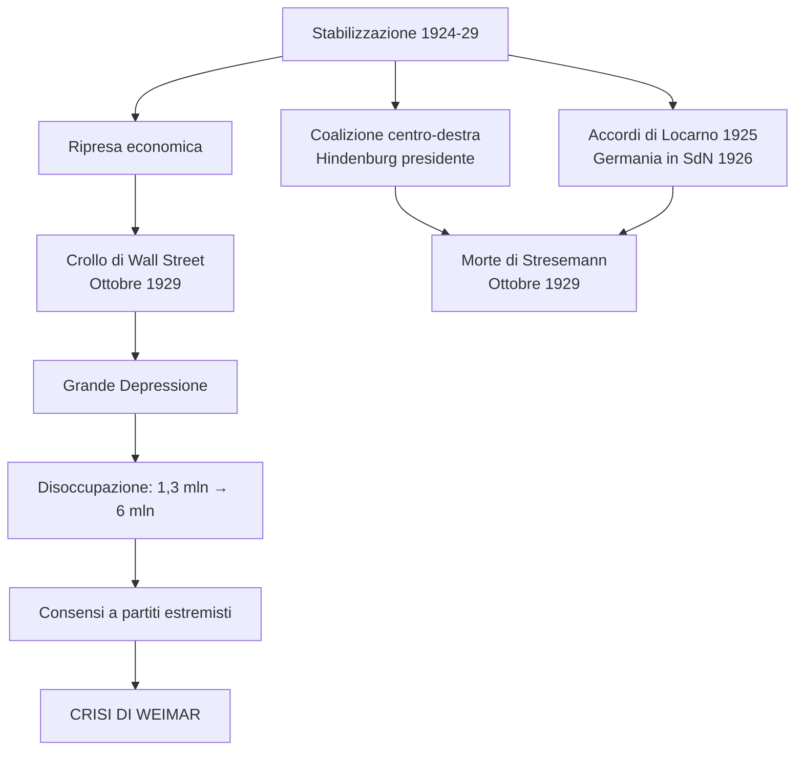
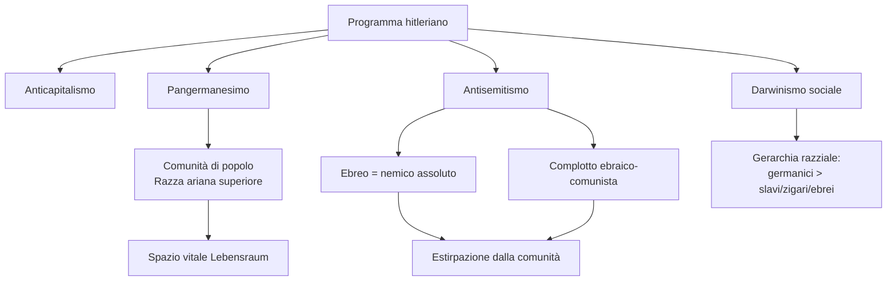
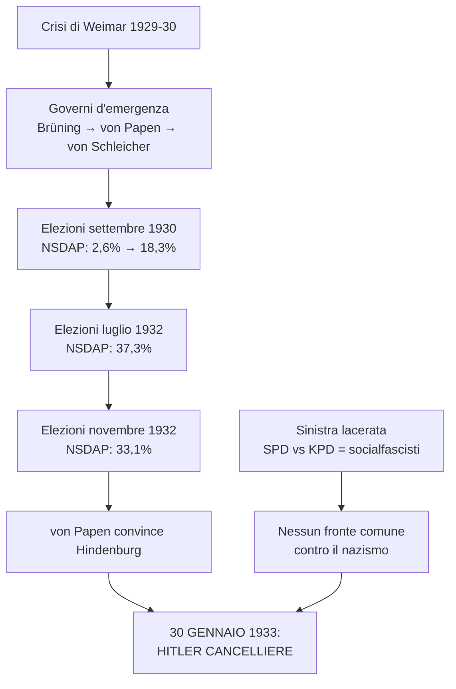
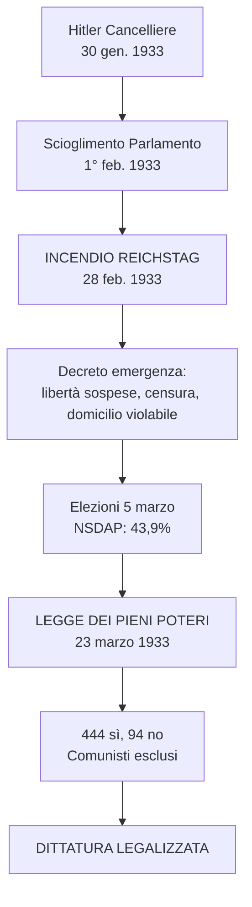
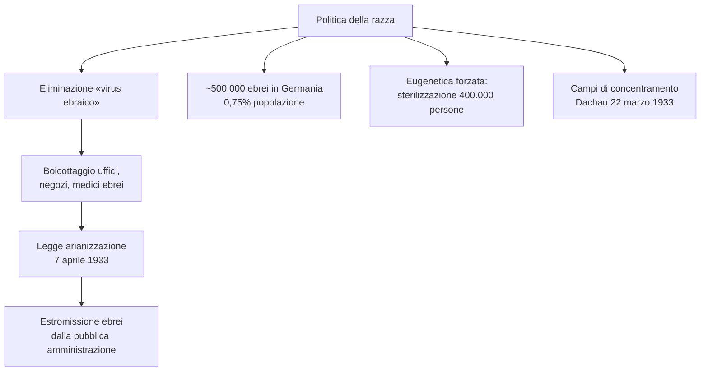
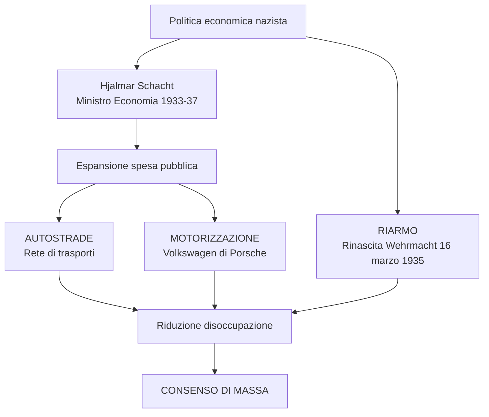
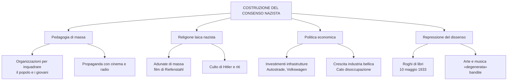
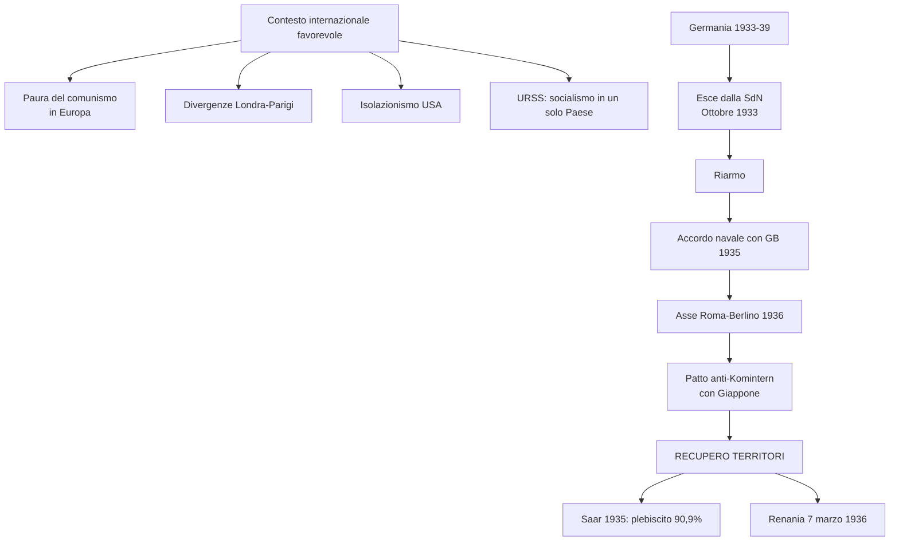
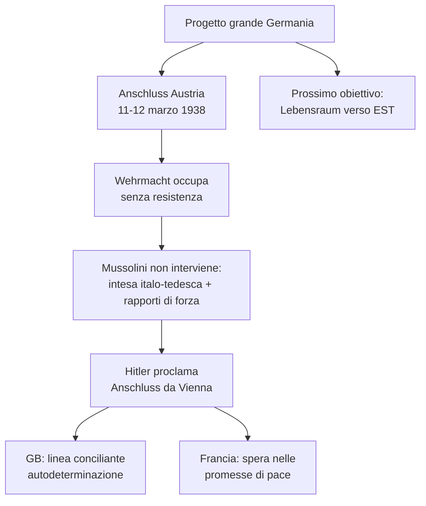
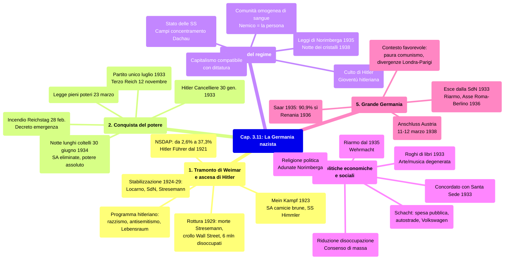

# Schema di Studio Breve - Capitolo 3.11: La Germania nazista

---

## Date fondamentali del capitolo

| Anno / Data | Evento |
|-------------|--------|
| **21 luglio 1921** | Hitler acclamato capo della **NSDAP** |
| **8 novembre 1923** | Fallisce il **putsch di Monaco**; Hitler arrestato |
| **1928-31** | Crescita costante dei consensi nazisti |
| **30 gennaio 1933** | **Hitler Cancelliere**; Goebbels ministro della Propaganda il 13 marzo |
| **12 novembre 1933** | Nasce il **Terzo Reich** |
| **30 giugno 1934** | **Notte dei lunghi coltelli**: eliminazione dei capi SA |
| **Fine estate 1934** | Hitler concentra Cancelleria, Presidenza e comando delle Forze armate |
| **Settembre 1935** | **Leggi di Norimberga** |
| **Marzo 1938** | **Anschluss**: annessione dell'Austria |
| **9-10 novembre 1938** | **Notte dei cristalli**, grande pogrom antisemita |

---

## 1. Il tramonto della Repubblica di Weimar e l'ascesa di Hitler

### 1.1 La prospettiva di una stabilizzazione (1924-29)

Tra 1924 e 1929 Weimar parve stabilizzarsi: ripresa economica, coalizione di centro-destra e supervisione del presidente **Paul von Hindenburg**. Sul piano internazionale la Germania rientrava fra le potenze grazie all'***appeasement*** britannico, al sostegno finanziario americano e alla scelta franco-britannica di reintegrarla per evitare un blocco russo-tedesco.

Dopo il 1918 Germania e URSS si erano avvicinate perché entrambe escluse dall'ordine di Versailles. Il **Trattato di Rapallo** (1922) riaprì rapporti commerciali e regolò pendenze belliche; in segreto permise anche cooperazione militare: Berlino aggirava il disarmo testando armi in territorio russo, Mosca riceveva tecnologia tedesca.

### 1.2 Il ruolo di Gustav Stresemann

La normalizzazione diplomatica fu guidata da **Gustav Stresemann**, ministro degli Esteri dal 1923 al 1929: nazionalista e revisionista, ma favorevole al compromesso con i vincitori. Gli **accordi di Locarno** (ottobre 1925), con Italia e Regno Unito garanti, sancirono frontiere occidentali inviolabili, rinuncia tedesca all'Alsazia-Lorena e Renania smilitarizzata. Seguirono ingresso nella **Società delle Nazioni** (1926) e Patto Briand-Kellogg (1928).

> **Parola della storia — «Appeasement»**: politica estera «morbida» verso la Germania, basata su concessioni per ottenere pacificazione; oggi indica accordi ottenuti pagando costi molto onerosi.

### 1.3 La rottura del 1929

Nell'ottobre 1929 finirono «spirito di Locarno» e fiducia economica: morte di Stresemann e crollo di Wall Street. Weimar fu travolta nell'inverno 1929-30; le politiche rigide su moneta e debito aggravarono la crisi. I disoccupati passarono da **1,3 milioni** (settembre 1929) a **6 milioni** (gennaio 1933); liberali irrilevanti, estremisti in crescita.

### 1.4 Il Partito nazista di Adolf Hitler

Nel 1928 la **NSDAP** era marginale: 2,6%. **Adolf Hitler** (Austria, 1889; cittadino tedesco dal 1932), dopo studi incompleti, aspirazioni artistiche fallite e servizio nell'esercito bavarese, entrò nel 1919 nella *Deutsche Arbeiterpartei* e scoprì la propria capacità di fascinare le folle.

In due anni trasformò quel gruppo pangermanista, antibolscevico e antisemita in un partito strutturato, aggiungendo i richiami a nazionalismo e socialismo. Il **29 luglio 1921** fu acclamato presidente della NSDAP: iniziava l'ascesa del futuro **Führer** del Terzo Reich.

### 1.5 Il programma hitleriano

Il programma nazionalsocialista mescolava **anticapitalismo, pangermanesimo, darwinismo sociale e antisemitismo**, soprattutto gli ultimi tre. Era meno dottrina coerente che insieme di slogan tenuti dal carisma di Hitler: senza Führer, sostiene il capitolo, non ci sarebbe stato il nazismo.

L'obiettivo era una **«comunità di popolo»** fondata sulla presunta **«razza ariana»**, superiore e destinata a dominare. A essa spettava lo **spazio vitale** (*Lebensraum*) negato da Versailles e dal presunto complotto ebraico-comunista. Slavi, zingari ed ebrei erano subordinati; l'ebreo era nemico assoluto, radice di capitalismo parassitario e comunismo internazionalista.

### 1.6 Tatticismi, violenza politica e il Mein Kampf

Negli anni Venti Hitler alternò accordi tattici e violenza. La NSDAP organizzò le **SA**, «camicie brune» guidate da **Ernst Röhm**, contro sinistra e sindacati. Il fallito **putsch della birreria** (8 novembre 1923) portò Hitler in carcere, dove scrisse il ***Mein Kampf***. Nacquero anche le **SS**, dal 1929 sotto **Heinrich Himmler**.

> Friedländer sottolinea che le decisioni cruciali del regime dipendevano da Hitler; Chapoutot individua nel nazismo una «legge del sangue», cioè l'idea di liberare il sangue tedesco da ogni contaminazione.

### 1.7 Il fallimento delle classi dirigenti democratiche

La presa del potere dipese dall'abilità di Hitler, dalla borghesia declassata e soprattutto dal **fallimento di Weimar**: élite militari, industriali e politiche volevano usare lo Stato per una svolta autoritaria e imperiale. La Grande guerra aveva legittimato la violenza politica.

---

## 2. La conquista del potere

### 2.1 La repubblica «d'emergenza»

Dopo il 1929 l'ultimo governo democratico cadde (marzo 1930). Si governò con i **poteri eccezionali** della Costituzione del 1919: Parlamento sospeso di fatto e garanzie comprimibili. I Cancellieri **Heinrich Brüning**, **Franz von Papen** e **Kurt von Schleicher** tentarono una svolta autoritaria, ma restarono divisi e impotenti.

### 2.2 La sinistra lacerata e gli errori di reazionari e conservatori

I reazionari non avevano i voti per cambiare legalmente il sistema; scioglievano il Parlamento cercando maggioranze, mentre le elezioni alimentavano quasi una guerra civile. Von Papen pensò di usare la NSDAP, salita dal **2,6%** del 1928 al **18,3%** del settembre 1930.

Nel 1932 Hitler perse le presidenziali contro Hindenburg ma arrivò al 37% al ballottaggio. La sinistra non fece fronte comune: SPD e KPD erano divisi dalla repressione socialdemocratica dei moti rivoluzionari e dalla linea del Komintern, che definiva i socialdemocratici **socialfascisti**.

> **Parola della storia — «Socialfascismo»**: termine del Komintern contro i partiti socialdemocratici, accusati di tradire la rivoluzione e favorire i fascismi.

| Data | Elezioni | NSDAP | SPD | KPD |
|---|---|---|---|---|
| **Maggio 1928** | Politiche | 2,6% | ~30% | ~11% |
| **Settembre 1930** | Politiche | 18,3% | ~25% | ~13% |
| **Luglio 1932** | Politiche | 37,3% | ~21% | ~14% |
| **Novembre 1932** | Politiche | 33,1% | ~20% | ~17% |
| **Marzo 1933** | Politiche | 43,9% | ~18% | ~12% |

Nel luglio 1932 la NSDAP raggiunse il **37,3%** e divenne primo partito; a novembre scese al 33,1%, illudendo von Papen di poterla controllare. Fu lui a convincere Hindenburg a nominare Hitler Cancelliere il **30 gennaio 1933**, con sé stesso vicecancelliere e ministri nazionalisti e conservatori.

### 2.3 Hitler al governo

Per i conservatori era l'inizio della restaurazione; per la propaganda di **Joseph Goebbels**, ministro dal 13 marzo, era la «rivoluzione nazionalsocialista». Hitler non voleva spartire il potere: mirava a eliminare comunisti, socialdemocratici, cattolici politici e resti di Weimar, mentre usava temporaneamente la destra reazionaria. Poteva contare su SA e SS, oltre mezzo milione di paramilitari.

### 2.4 L'incendio del Reichstag e i pieni poteri a Hitler

Appena Cancelliere, Hitler sciolse il Parlamento (1° febbraio) e fissò elezioni al 5 marzo. L'**incendio del Reichstag** del 28 febbraio giustificò il decreto «per la protezione del popolo e dello Stato»: libertà di opinione, stampa, riunione e associazione colpite; censura; domicilio violabile; emergenza al Cancelliere.

Il 5 marzo la NSDAP ottenne il **43,9%**; con la destra tedesco-nazionale arrivò al 51,9%. Il 23 marzo il *Reichstag* approvò la **Legge dei pieni poteri**: 444 sì, 94 no socialdemocratici; i comunisti erano esclusi fra carcere, clandestinità ed esilio. I centristi cattolici e i liberali cedettero alle minacce, dando forma legale alla dittatura.

### 2.5 Le opposizioni messe fuori legge e l'avvio della legislazione razziale

Hindenburg fu esautorato e von Papen ridotto a gregario. Nel maggio 1933 furono messi fuori legge tutti i sindacati tranne quello nazista; nel luglio 1933 la NSDAP divenne **partito unico**. Nello stesso giorno fu varata la normativa per prevenire nascite con malattie ereditarie: provocò almeno **400.000 sterilizzazioni forzate**, secondo atto della legislazione razziale nascente.

### 2.6 Il Terzo Reich e la «normalizzazione» del Partito

Il successo della NSDAP attirò iscritti opportunisti; il 1° maggio 1933 fu bloccato il tesseramento. Il **12 novembre 1933** il regime fece eleggere un *Reichstag* interamente nazista: nasceva il **Terzo Reich**, riassunto nello slogan *«Ein Volk, ein Reich, ein Führer»*.

Restavano tensioni interne. Hitler dichiarò chiusa la «rivoluzione», irritando le SA di Röhm, viste da moderati, grande industria ed esercito come minaccia. Il **30 giugno 1934**, nella **notte dei lunghi coltelli**, la **Gestapo** di **Hermann Göring** eliminò Röhm, capi SA e circa cento uomini vicini. Anche la destra guglielmina, von Papen compreso, fu messa fuori gioco. Dalla fine dell'estate 1934 Hitler cumulò Cancelleria, Presidenza e comando militare.

> **Ricorda**: Primo Reich = Sacro romano impero (962-1806); Secondo Reich = impero tedesco fondato nel 1871 e crollato nel 1918.

---

## 3. Le finalità e la natura del regime nazista

### 3.1 Un regime fondato sull'esclusione del «diverso»

Il nazismo al potere volle una **comunità nazionale omogenea**, devota al Führer e definita dal sangue. L'individuo doveva adeguarsi alla «razza»: il nemico era la persona autonoma. Chi rifiutava l'integrazione veniva marginalizzato o eliminato. Il nazionalsocialismo fu quindi soprattutto **razzista**.

Molti all'estero sottovalutarono il regime perché antisemitismo, darwinismo sociale ed **eugenetica** erano diffusi anche in Occidente e legittimavano gli imperi coloniali.

### 3.2 La persecuzione e i campi di concentramento

Il terrore iniziò subito. Entro il 1934 polizie e strutture paramilitari furono accentrate sotto **Heinrich Himmler**: **«Stato delle SS»**. Oppositori, «asociali», «degenerati», «razze inferiori» e non integrabili finirono nei **campi di concentramento**; modello **Dachau**, aperto il 22 marzo 1933. Parallelamente si applicò l'eugenetica contro malati, disabili e individui ritenuti indegni.

### 3.3 La politica della razza e l'ossessione antiebraica di Hitler

La politica della razza puntava a eliminare il presunto **«virus ebraico»**. Nel Reich vivevano circa **500.000 ebrei**, 0,75% della popolazione, più centinaia di migliaia di persone di origine ebraica: scienziati, letterati, imprenditori, commercianti, soldati e ufficiali. Il regime li trasformò in bersaglio.

> **Ricorda**: la «razza» è un'invenzione ottocentesca; la genetica ha provato che le «razze» umane non esistono in natura.

Dal 1933 Hitler promosse boicottaggi contro uffici, negozi e medici ebrei. La legge sull'**arianizzazione** del 7 aprile 1933 li estromise dalla pubblica amministrazione; le eccezioni per reduci 1914-18 furono poi abolite.

### 3.4 Dalle Leggi di Norimberga alla «notte dei cristalli»

Nel **settembre 1935** le **Leggi di Norimberga** tolsero ai tedeschi di origine ebraica la cittadinanza e vietarono matrimonio e rapporti sessuali fra tedeschi ed ebrei. Poi furono colpiti proprietà e patrimoni.

Il culmine prebellico fu la **notte dei cristalli**: 9-10 novembre 1938, dopo l'attentato di un ragazzo ebreo contro un diplomatico tedesco a Parigi, squadre naziste scatenarono un pogrom nel Reich, incendiando e saccheggiando sinagoghe, negozi e case ebraiche.

Chi poteva emigrava. Prima del 1939 circa **250.000 ebrei tedeschi**, metà della comunità iniziale, lasciarono il Paese, spesso verso la Palestina britannica. Pochi Stati, compresi gli USA con le quote d'ingresso, aprirono davvero le frontiere.

> Viktor Klemperer notò che il nazismo penetrava nella società attraverso parole e formule ripetute: il linguaggio agiva come veleno assunto in piccole dosi.

### 3.5 Il consenso: il culto di Hitler

Il regime non visse solo di terrore. Molti tedeschi apprezzarono Hitler per risultati economici e sociali, ma l'adesione aveva anche un lato irrazionale: il **culto di Hitler**. La **Gioventù hitleriana** inquadrava dai dieci anni con culto del corpo, ginnastica, ideologia e addestramento paramilitare. Goebbels usò cinema e radio per uniformare emozioni e idee.

### 3.6 Un regime senza Stato?

Il regime non fu ordinato e monolitico: incentivò il **caos dei poteri**, con competenze sovrapposte fra Stato, partito e organizzazioni parallele. I capi nazisti gareggiavano per risorse e accesso al Führer; Hitler li controllava mettendoli in rivalità.

### 3.7 Democrazia e capitalismo

Il nazismo non fece rivoluzione sociale: mantenne classi, proprietà privata e profitti. Un'economia **capitalista** poté adattarsi alla dittatura. I capitalisti tedeschi passarono al regime per fede o interesse; la borghesia reazionaria apprezzò la repressione di comunisti e socialdemocratici.

Dopo la liquidazione dei sindacati nacque il **Fronte tedesco del lavoro**, struttura corporativa che includeva lavoratori e imprenditori ma non contrattava salari o ritmi; lo sciopero diventò un crimine.

---

## 4. Le politiche economiche e sociali

### 4.1 Un consenso creato, non solo estorto o fanatico

Il consenso nazista derivò anche dall'economia. **Hjalmar Schacht**, ministro dell'Economia dall'agosto 1933 al novembre 1937, guidò l'espansione della **spesa pubblica**. Grandi infrastrutture, soprattutto **autostrade**, ridussero la disoccupazione e sostennero il mito della motorizzazione, simboleggiata dalla **Volkswagen** di **Ferdinand Porsche**.

L'altro motore fu il **riarmo**: prudente all'inizio, esplicito dal 16 marzo 1935 con la rinascita della **Wehrmacht**, violando Versailles senza forti reazioni alleate. Riarmo significava orgoglio nazionale e lavoro.

### 4.2 Una modesta prosperità

La Germania passò dalla povertà a una **sicurezza economica** modesta ma percepibile. I consumi restavano limitati dall'industria pesante, ma il regime offrì svaghi organizzati. *Kraft durch Freude* socializzava masse operaie e impiegatizie con sport, turismo e crociere: fino al 1939 circa **7 milioni** di tedeschi modesti parteciparono a viaggi prima elitari.

### 4.3 La vita culturale

La cultura fu compressa dall'ideologia. Il **10 maggio 1933** a Berlino si tenne il rogo dei libri, poi replicato altrove: bruciarono testi «antinazionali», soprattutto ebrei e socialisti. Goebbels bandì **«arte degenerata»** e **«musica degenerata»**: Chagall, Klee, Nolde, Grosz, Kokoschka; Mendelssohn, Mahler, Schönberg.

### 4.4 Adunate e ricorrenze: la religione politica del nazismo

Le grandi **adunate di massa** plasmarono lo spirito popolare. Il raduno di Norimberga del 1934 fu celebrato da **Leni Riefenstahl** in *Il trionfo della volontà*; realizzò anche *Olympia* sulle Olimpiadi di Berlino 1936. Cinema, montaggio, Wagner e folle schierate costruivano il carisma del capo.

Il calendario nazista funzionava come liturgia: 30 gennaio presa del potere, 20 aprile compleanno di Hitler, 9 novembre memoria del putsch del 1923. La religione politica nazista prese simboli cristiani ma si presentò anche come anticristiana e neopagana; nelle SS si doveva uscire dalle Chiese.

### 4.5 I rapporti con le Chiese

Il regime firmò un **concordato con la Santa Sede** il 20 luglio 1933. Molti cattolici si adattarono per anticomunismo, pur subendo intimidazioni. **Clemens August von Galen**, vescovo di Münster, denunciò nel 1934 razzismo e neopaganesimo e nel 1941 il programma segreto di eutanasia **T4** (1939). Nel marzo 1937 Pio XI fece leggere nelle chiese tedesche un'enciclica contro l'incompatibilità fra cristianesimo e ideologia nazista.

Il protestantesimo si divise fra Chiesa filonazista e critica. I testimoni di Geova furono perseguitati: su 25.000 affiliati, 10.000 incarcerati e 1200 uccisi.

> **Parola della storia — «Neopaganesimo»**: tendenza anticristiana del nazismo, legata a tradizioni germaniche precristiane e alla lettura «ariana» di elementi religiosi; per i nazisti il cristianesimo aveva radici semite.

---

## 5. Il progetto di una «grande Germania»

### 5.1 L'orizzonte della guerra e la costruzione di una «grande Germania»

Il fine ultimo di Hitler era la guerra: distruggere l'ebraismo e imporre il dominio germanico, prima verso Est per il **Lebensraum**, poi contro l'Occidente. Prima serviva la **«grande Germania»**. Tra 1933 e 1939 la politica hitleriana apparve come revisionismo contro Versailles e incontrò consenso anche fra nazionalisti non nazisti.

Hitler procedette per gradi, testando Francia e Regno Unito e sfruttando paura del comunismo, divergenze Londra-Parigi, isolazionismo USA e ripiegamento dell'URSS sul «socialismo in un solo Paese».

### 5.2 Il rapporto con l'Italia di Mussolini

Nel 1933 la Germania non aveva veri alleati. Hitler ammirava Mussolini, ma Italia e Germania divergevano sull'Austria. Nel **1934**, dopo un fallito colpo filonazista a Vienna, Mussolini schierò quattro divisioni al Brennero per difendere l'Austria-cuscinetto.

L'avvicinamento arrivò nel 1935-36: guerra d'Etiopia, neutralità nazista verso l'Italia e guerra civile spagnola, dove Hitler e Mussolini sostennero **Francisco Franco** contro la repubblica appoggiata dall'URSS.

### 5.3 L'espansione tedesca in un contesto internazionale favorevole

Nell'ottobre 1933 la Germania uscì dalla **Società delle Nazioni**. Hitler rilanciò il **riarmo** e nel 1935 firmò con Londra un accordo navale: flotta tedesca al 35% della Royal Navy, sommergibili al 50%. Nel 1936-37 nacquero **Asse Roma-Berlino** e **Patto anti-Komintern** con il Giappone, poi anche l'Italia.

Hitler alternava minacce e proclami pacifici, senza seri contrappesi in Europa centro-orientale. Recuperò prima l'Occidente: **Saar** alla Germania nel **1935** con plebiscito al **90,9%**; **Renania** occupata il **7 marzo 1936**, violando Locarno. Poi veniva l'Est: servivano guerra e industria bellica, ma senza scontro immediato con Francia e Gran Bretagna.

### 5.4 L'annessione dell'Austria

Il primo obiettivo orientale era l'Austria, dove Hitler alimentò correnti pangermaniche. Tra **11 e 12 marzo 1938** la Wehrmacht occupò il Paese **senza resistenza**. Mussolini, ormai legato a Berlino e più debole, non intervenne. Hitler proclamò da Vienna l'***Anschluss***.

Londra restò conciliante, leggendo l'annessione come autodeterminazione dei tedeschi d'Austria; Parigi, più diffidente ma senza strategia attiva, sperò ancora nelle promesse di pace del Führer.

---

## Mappa concettuale — Visione d'insieme del capitolo

