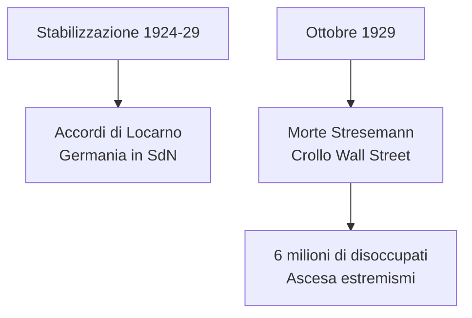
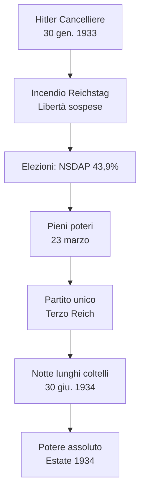
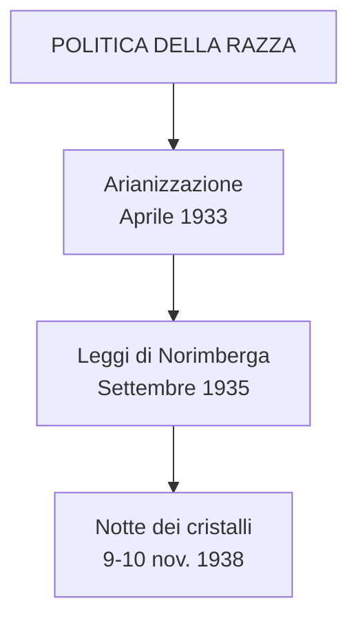
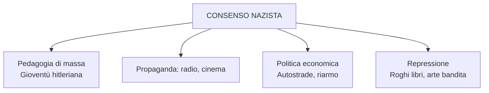
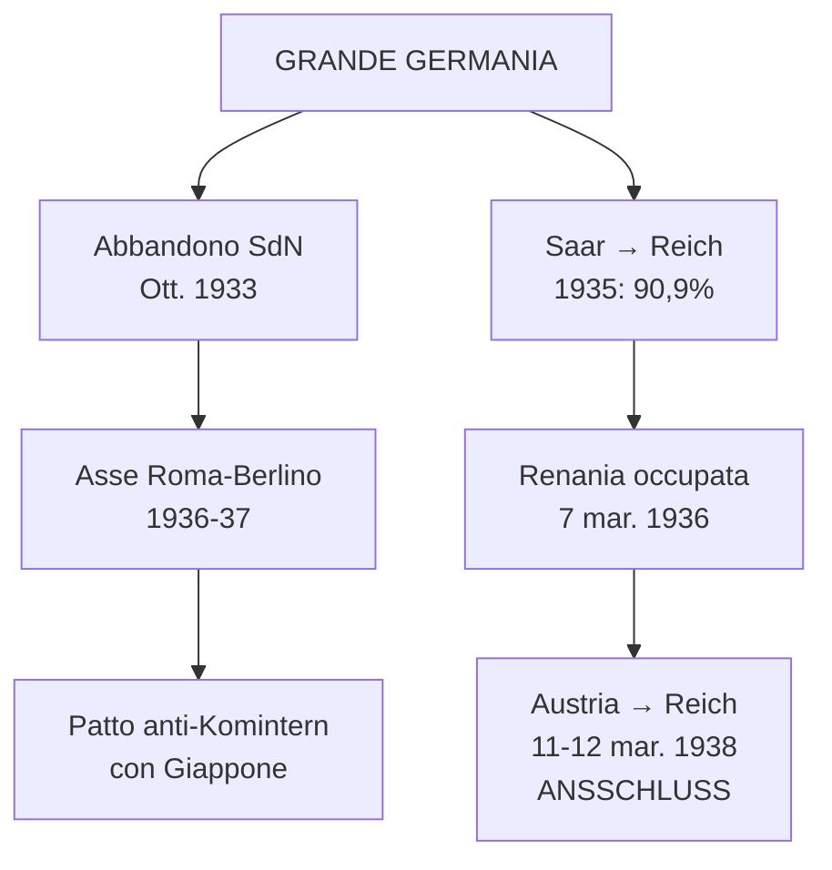
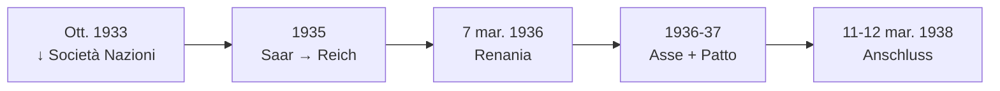
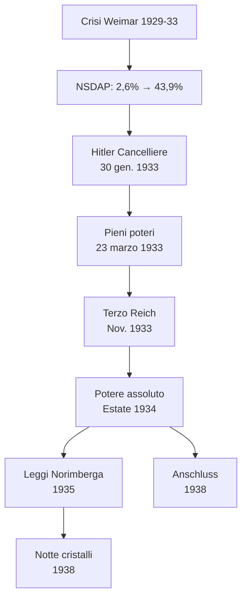

# Schema di Studio - Capitolo 3.11: La Germania nazista (Riassunto)

---

## Date fondamentali del capitolo

| Anno / Data | Evento |
|-------------|--------|
| **21 luglio 1921** | Hitler capo del **NSDAP** |
| **8 novembre 1923** | **Putsch di Monaco**; Hitler arrestato |
| **30 gennaio 1933** | **Hitler Cancelliere** |
| **12 novembre 1933** | Nasce il **Terzo Reich** |
| **30 giugno 1934** | **«Notte dei lunghi coltelli»** |
| **Settembre 1935** | **Leggi di Norimberga** |
| **Marzo 1938** | **Anschluss** (annessione Austria) |
| **9-10 novembre 1938** | **«Notte dei cristalli»** |
| **Ottobre 1933** | Germania abbandona **Società delle Nazioni** |
| **1935** | **Saar** torna alla Germania |
| **7 marzo 1936** | Occupazione della **Renania** |
| **1936-37** | **Asse Roma-Berlino** e **Patto anti-Komintern** |

---

## 1. Il tramonto della Repubblica di Weimar e l'ascesa di Hitler

### La stabilizzazione (1924-29) e la rottura del 1929

Dal 1924 al 1929 Weimar sembrò stabilizzarsi: ripresa economica, equilibrio politico sotto **Hindenburg**, **accordi di Locarno** (1925) e ammissione nella **Società delle Nazioni** (1926). **Stresemann** (ministro Esteri) guidò i negoziati con i vincitori.

L'ottobre 1929 aprì una nuova fase: morte di Stresemann e **crollo di Wall Street**. La Germania fu investita dalla **Grande Depressione**: **6 milioni di disoccupati** nel gennaio 1933. La crisi rafforzò i **partiti estremisti**.

### Il Partito nazista di Hitler

La NSDAP nel 1928 aveva solo il **2,6%**. Hitler (austriaco, 1889) la trasformò in un partito strutturato. Il programma miscelava **anticapitalismo, pangermanesimo, darwinismo sociale e antisemitismo**.

L'ideale hitleriano: la **«razza ariana»** superiore ha diritto allo **«spazio vitale»** (*Lebensraum*). L'ebreo è il **nemico assoluto**, alla radice del complotto ebraico-comunista.

Milizie: **SA** («camicie brune», Ernst Röhm) e **SS** (Heinrich Himmler). Dopo il **putsch di Monaco** (1923), Hitler in carcere scrisse ***Mein Kampf***.

---

## 2. La conquista del potere

### La repubblica «d'emergenza» e l'ascesa elettorale

Dopo marzo 1930, governi con **poteri eccezionali** del Presidente. Brüning, von Papen, von Schleicher: governi reazionari impotenti.

**Consensi NSDAP:**
| Elezioni | Percentuale |
|----------|-------------|
| Maggio 1928 | 2,6% |
| Settembre 1930 | 18,3% |
| Luglio 1932 | **37,3%** |
| Marzo 1933 | **43,9%** |

La sinistra divisa: KPD e SPD in rotta; il Komintern indicava i socialdemocratici come **«socialfascisti»**.

**30 gennaio 1933**: von Papen convince Hindenburg ad affidare il Cancelleriato a Hitler.

### L'incendio del Reichstag e i pieni poteri

**28 febbraio 1933**: incendio del Reichstag → decreto con **sospensione di tutte le libertà** (opinione, stampa, riunione, associazione, domicilio).

Elezioni 5 marzo: NSDAP **43,9%**. Con il partito tedesco-nazionale, maggioranza **51,9%**.

**23 marzo**: **Lega dei pieni poteri** assegna a Hitler tutti i poteri senza limiti temporali (444 sì, 94 no).

### Il Terzo Reich e la «notte dei lunghi coltelli»

Maggio 1933: tutti i sindacati fuori legge. Luglio 1933: **NSDAP unico partito legale**.

**12 novembre 1933**: nasce il **Terzo Reich** (*«Ein Volk, ein Reich, ein Führer»*).

**30 giugno 1934**: **«Notte dei lunghi coltelli»**. La **Gestapo** elimina i leader delle SA (Röhm). Dall'estate 1934 Hitler è **padrone assoluto**: Cancelliere, Presidente, capo Forze armate.

---

## 3. Le finalità e la natura del regime nazista

### Un regime fondato sull'esclusione

Il nazismo mirava a una **comunità nazionale omogenea**, devota al Führer. Il nazionalsocialismo fu soprattutto **razzista**.

> Il nemico del nazista era la persona. Tutti dovevano essere ridotti a **membri della comunità di sangue**.

### Persecuzione e campi di concentramento

Entro il 1934 polizie e strutture repressive accentrate sotto **Himmler**: lo **«Stato delle SS»**.

Oppositori, «degenerati», «razze inferiori» rinchiusi in **campi di concentramento** (modello: **Dachau**, 22 marzo 1933). Operazioni eugenetiche per «migliorare la stirpe».

### La politica della razza: dalle Leggi di Norimberga alla «notte dei cristalli**

Nel Reich: **~500.000 ebrei** (0,75% della popolazione). Asse portante: eliminazione del «virus ebraico».

- **7 aprile 1933**: legge sull'«arianizzazione» → ebrei estromessi dalla pubblica amministrazione
- **Settembre 1935**: **Leggi di Norimberga** → ebrei privati della cittadinanza; matrimoni vietati
- **9-10 novembre 1938**: **«Notte dei cristalli»** → pogrom in tutto il Reich: sinagoghe, negozi, abitazioni bruciati

~250.000 ebrei tedeschi emigrarono prima del 1939. Pochi Paesi aprirono le frontiere.

### Il culto di Hitler e il consenso

La maggioranza dei tedeschi apprezzava Hitler per le promesse mantenute (economia). Ma anche un elemento irrazionale: il **culto di Hitler**, religione laica fondata su **pedagogia di massa**.

**Gioventù hitleriana**: plasmava i giovani dal decimo anno. Propaganda via **cinema** e **radio**.

Il regime incentivava il **caos dei poteri**: conflitti tra Stato, partito, organizzazioni parallele. I capi rivaleggiavano per il favore del Führer.

**Capitalismo e dittatura**: il regime non propose una rivoluzione sociale. Proprietà privata, profitti, classi sopravvivevano. Il **Fronte tedesco del lavoro** inquadrava tutti i lavoratori, senza potere di contrattazione. Lo sciopero era un crimine.

---

## 4. Le politiche economiche e sociali

### Politica economica e consenso

**Hjalmar Schacht** (ministro Economia 1933-37): espansione della spesa pubblica per **ridurre la disoccupazione**.

- **Autostrade**: rete di trasporti, motorizzazione
- **Volkswagen**: «automobile del popolo»
- **Riarmo**: esplicito dal 16 marzo 1935 (rinascita Wehrmacht)

I tedeschi passarono dalla povertà a una **modesta prosperità**. Organizzazioni come **Forza dalla Gioia** offrivano sport e turismo: **7 milioni** di tedeschi fruirono delle crociere di regime fino al 1939.

### La vita culturale

- **10 maggio 1933**: **rogo dei libri** a Berlino (autori ebrei e socialisti)
- **«Arte degenerata»** (1937): mostra itinerante con opere di Chagall, Klee, Nolde, Grosz, Kokoschka
- **«Musica degenerata»**: compositori ebraici (Mendelssohn, Mahler) e musica moderna

### Adunate e religione politica

**Adunate di massa** a Norimberga immortalate nel film *Il trionfo della volontà* di **Leni Riefenstahl** (1934). Anche *Olympia* per le **Olimpiadi di Berlino 1936**.

Il nazismo era una **religione politica** con riti e miti. Calendario: 30 gennaio (presa del potere), 20 aprile (compleanno Hitler), 9 novembre (caduti del putsch 1923).

### I rapporti con le Chiese

**20 luglio 1933**: **concordato** con la Santa Sede. L'episcopato in gran parte si adattò al regime (argine al bolscevismo).

Casi di opposizione: **von Galen**, vescovo di Münster, denunciò il razzismo (1934) e il programma di eutanasia «T4» (1941).

**Marzo 1937**: enciclica di **Pio XI** dichiara inconciliabile la fede cristiana con l'ideologia nazista.

Protestanti divisi (Chiesa filonazista vs critica). **Testimoni di Geova** perseguitati: 10.000 incarcerati, 1200 uccisi su 25.000 affiliati.

---

## 5. Il progetto di una «grande Germania»

### L'orizzonte della guerra

L'orizzonte ultimo di Hitler era la **guerra** per dominio germanico. Lo spazio vitale (*Lebensraum*) si sarebbe esteso **verso Est**.

Prima: erigere la **«grande Germania»**. Hitler procedette per gradi, sfruttando:
- **Paura del comunismo**
- **Divergenze Londra-Parigi**
- Isolazionismo USA
- Ripiegamento URSS

### Rapporto con l'Italia

Nel **1934** Mussolini schierò quattro divisioni al Brennero contro l'annessione tedesca dell'Austria. I percorsi si avvicinarono solo nel **1935-36**: guerra d'Etiopia (nazisti neutrali) e **guerra civile spagnola** (entrambi con Franco).

### Espansione tedesca

- **Ottobre 1933**: Germania abbandona la **Società delle Nazioni**
- **1935**: accordo navale con Londra (flotta tedesca = 35% Royal Navy)
- **1936-37**: **Asse Roma-Berlino** + **Patto anti-Komintern** con Giappone

### Recupero terre perdute

- **1935**: **Saar** → Germania (plebiscito: **90,9%**)
- **7 marzo 1936**: occupazione **Renania** smilitarizzata

### L'Anschluss

**11-12 marzo 1938**: Wehrmacht occupa l'Austria **senza resistenza**. Mussolini non ostacola (intesa italo-tedesca, rapporti di forza rovesciati). Hitler proclama l'***Anschluss*** da Vienna.

Londra e Parigi non reagirono: Londra conciliante, Parigi sperava nelle promesse di pace.

---

## Schema riepilogativo

