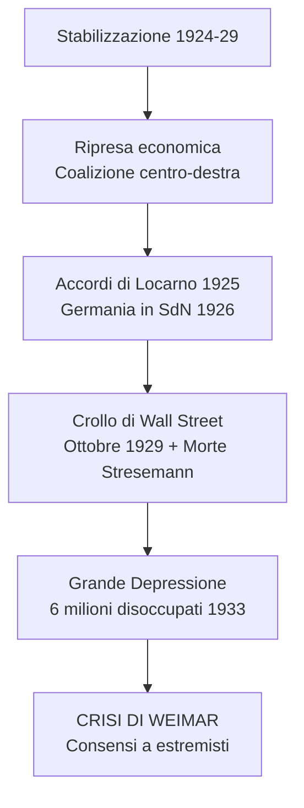
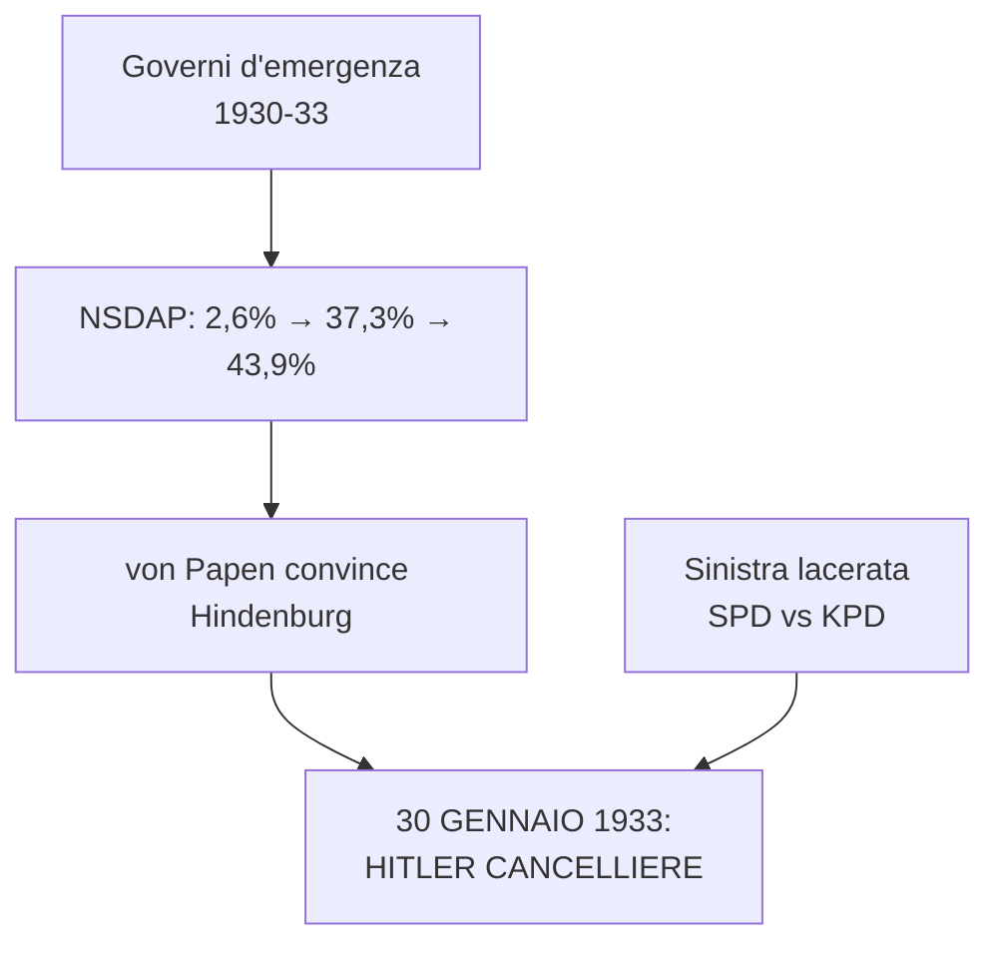
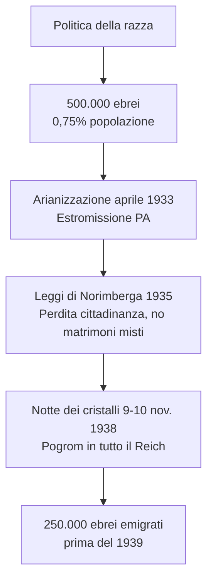
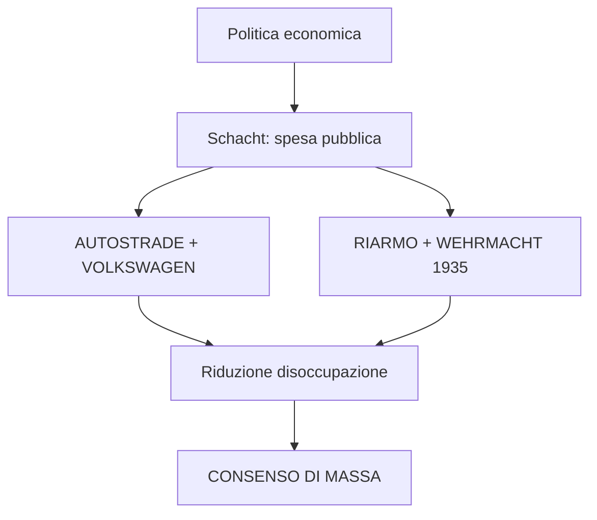
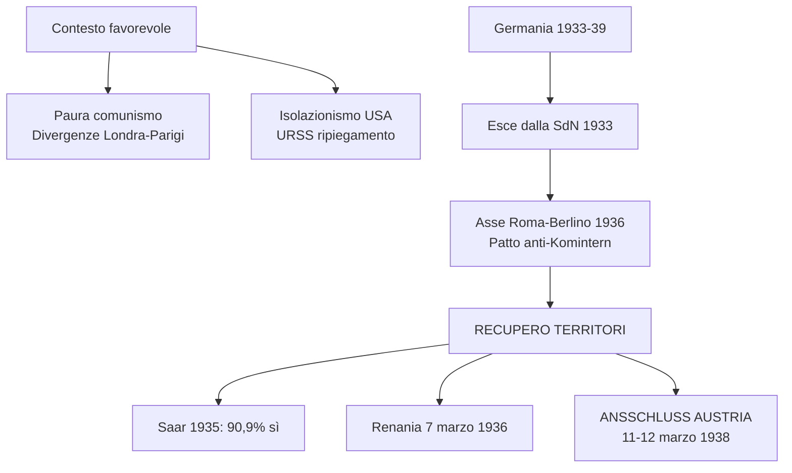
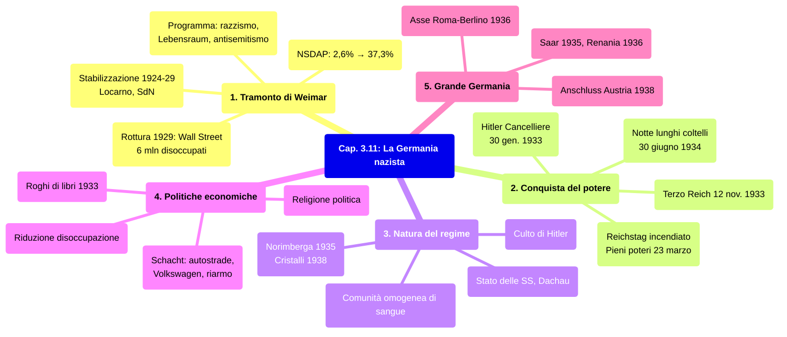

# Schema di Studio - Capitolo 3.11: La Germania nazista (Riassunto)

---

## Date fondamentali del capitolo

| Anno / Data | Evento |
|-------------|--------|
| **21 luglio 1921** | Adolf **Hitler** è acclamato capo del **Partito nazionalsocialista tedesco dei lavoratori** (NSDAP) |
| **8 novembre 1923** | Fallito **colpo di Stato** a Monaco (*putsch* della birreria); Hitler arrestato |
| **30 gennaio 1933** | **Hitler diventa Cancelliere**; Goebbels nominato ministro della Propaganda (13 marzo) |
| **12 novembre 1933** | Nasce il **Terzo Reich** |
| **30 giugno 1934** | **«Notte dei lunghi coltelli»**: la Gestapo elimina i leader delle SA |
| **Fine estate 1934** | Hitler detiene il **potere assoluto**: Cancelliere, Presidente e capo delle Forze armate |
| **Settembre 1935** | Promulgazione delle **leggi di Norimberga** (legislazione antirazziale) |
| **Marzo 1938** | La Germania occupa l'**Austria** e proclama l'**Anschluss** |
| **9-10 novembre 1938** | **«Notte dei cristalli»**: violento **pogrom** antisemita in tutto il Reich |

---

## 1. Il tramonto della Repubblica di Weimar e l'ascesa di Hitler

### La prospettiva di una stabilizzazione (1924-29)

Dal 1924 al 1929 la Repubblica di Weimar sembrò stabilizzarsi grazie alla **ripresa economica** e a una **coalizione di centro-destra** sotto la supervisione di **Paul von Hindenburg**. Sul piano internazionale, l'***appeasement*** britannico e il **sostegno finanziario americano** permisero alla Germania di rientrare nella famiglia delle maggiori potenze. Gli **accordi di Locarno** (ottobre 1925) sancirono l'inviolabilità delle frontiere stabilite a Versailles e la smilitarizzazione della Renania; nel 1926 la Germania fu **ammessa nella Società delle Nazioni**.

### La rottura del 1929

Nell'ottobre 1929 **Stresemann morì** e il **crollo di Wall Street** segnò l'avvio della **Grande Depressione mondiale**. La disoccupazione salì da 1,3 milioni a **6 milioni** nel gennaio 1933. Questa crisi contribuì al rafforzamento dei partiti estremisti, mentre i liberali erano ormai irrilevanti. Weimar cominciò ad avvitarsi nella spirale terminale.

### Il Partito nazista di Adolf Hitler

Il suo capo era **Adolf Hitler**, nato in Austria nel 1889. Nella Monaco del 1919 fu coinvolto nella *Deutsche Arbeiterpartei*, scheggia ultranazionalista antibolscevica e antisemita. Qui scoprì la sua capacità di **fascinazione sulle folle**. Il 29 luglio 1921 fu acclamato presidente della NSDAP. Il programma nazionalsocialista miscelava **anticapitalismo, pangermanesimo, darwinismo sociale e antisemitismo**. Hitler oltrepassava l'idea di Stato nazionale per l'idea di **«comunità di popolo»**, fondata sulla presunta **«razza ariana»** superiore. Questo popolo aveva diritto allo **«spazio vitale»** (*Lebensraum*) negato a Versailles.

### Tatticismi, violenza politica e il Mein Kampf

La NSDAP si dotò di una **milizia armata**, le **SA** (camicie brune) dirette da **Ernst Röhm**, e poi le **SS** sotto **Heinrich Himmler**. Il fallimento del *putsch* di Monaco dell'**8 novembre 1923** costò a Hitler alcuni mesi di carcere, durante i quali scrisse ***Mein Kampf***. La presa del potere fu soprattutto espressione del **fallimento della Repubblica** e del tentativo delle élite antidemocratiche di impadronirsi dello Stato.

---

## 2. La conquista del potere

### La repubblica «d'emergenza»

L'ultimo governo democratico di coalizione si dimise nel marzo 1930. Da allora, il potere fu esercitato in base ai **poteri eccezionali** del Presidente della Repubblica in casi di «emergenza», con **sospensione del Parlamento**. I tre Cancellieri che si succedettero (Brüning, von Papen, von Schleicher) si rivelarono impotenti.

### La sinistra lacerata

Le forze di sinistra non furono in grado di far fronte comune: SPD e KPD si accusavano reciprocamente, e il Komintern indicava i socialdemocratici come **socialfascisti**. Alle elezioni del luglio 1932 la NSDAP toccò il **37,3%**. Von Papen convinse Hindenburg ad affidare il Cancellerato a Hitler: era il **30 gennaio 1933**.

| Data | Elezioni | NSDAP |
|---|---|---|
| **Settembre 1930** | Politiche | 18,3% |
| **Luglio 1932** | Politiche | 37,3% |
| **Novembre 1932** | Politiche | 33,1% |
| **Marzo 1933** | Politiche | 43,9% |

### L'incendio del Reichstag e i pieni poteri

L'incendio del Parlamento (28 febbraio 1933) fu il pretesto per un decreto che **colpiva le libertà di opinione, stampa, riunione e associazione**, istituiva la **censura** e **aboliva l'inviolabilità del domicilio**. Il 5 marzo la NSDAP raccolse il **43,9%** dei voti. Il 23 marzo il *Reichstag* approvò la **Legge dei pieni poteri** (444 sì, 94 no): Hitler aveva **tutti i poteri senza limiti temporali**.

### Le opposizioni messe fuori legge

I sindacati furono messi **fuori legge** (maggio 1933), il **Partito nazista divenne l'unico** consentito (luglio 1933). Lo stesso giorno fu licenziata la normativa sulla sterilizzazione forzata di malati e portatori di handicap: **400.000 persone** sterilizzate nel dodicennio nazista.

### Il Terzo Reich e la «notte dei lunghi coltelli»

Il 12 novembre 1933 nacque il **Terzo Reich** (*«Ein Volk, ein Reich, ein Führer»*). Le SA di Röhm costituivano un fattore di disordine. Il **30 giugno 1934** scattò la repressione nella **«notte dei lunghi coltelli»**: la **Gestapo** eliminò i leader delle SA. Von Papen fu estromesso. Dalla tarda estate 1934 Hitler fu **padrone assoluto**: Cancelliere, Presidente e capo delle Forze armate.

---

## 3. Le finalità e la natura del regime nazista

### Un regime fondato sull'esclusione del «diverso»

Il tratto dominante fu la determinazione a costruire una **comunità nazionale omogenea**. **Il nemico del nazista era la persona**: tutti dovevano essere ridotti a **membri della comunità di sangue**. Il nazionalsocialismo fu soprattutto **razzista**.

### La persecuzione e i campi di concentramento

Entro il 1934 le polizie repressive furono accentrate sotto **Himmler**: lo **«Stato delle SS»**. Oppositori, «asociali», «degenerati», appartenenti a «razze inferiori» furono rinchiusi in **campi di concentramento**. Il modello fu **Dachau** (22 marzo 1933).

### La politica della razza e l'ossessione antiebraica

Nel Reich viveva circa **mezzo milione di ebrei** (0,75% della popolazione). La legge sull'«arianizzazione» (7 aprile 1933) estromise gli ebrei dalla pubblica amministrazione. Le **Leggi di Norimberga** (settembre 1935) privarono gli ebrei dei **diritti di cittadinanza** e vietarono matrimoni misti. La **«notte dei cristalli»** (9-10 novembre 1938) fu il culmine della campagna antisemita: sinagoghe, negozi e abitazioni saccheggiati e dati alle fiamme. **250.000 ebrei** lasciarono la Germania prima del 1939.

### Il consenso: il culto di Hitler

Vigeva il **culto di Hitler**, fondato su una **pedagogia di massa** attraverso organizzazioni come la **Gioventù hitleriana**. La propaganda di Goebbels trovò nel **cinema** e nella **radio** gli strumenti di uniformazione.

### Democrazia e capitalismo

Il regime non si propose mai una rivoluzione sociale: **sistema economico capitalista** e **sistema dittatoriale** erano compatibili. I capitalisti tedeschi passarono quasi tutti al regime. Alla liquidazione dei sindacati seguì il **Fronte tedesco del lavoro**, senza potere di contrattazione: lo sciopero era un crimine.

---

## 4. Le politiche economiche e sociali

### Un consenso creato dalla politica economica

**Hjalmar Schacht**, ministro dell'Economia (1933-37), promosse **espansione della spesa pubblica**: grandiosi progetti infrastrutturali (le **autostrade**, la *Volkswagen* di Porsche) e **riarmo** (rinascita della **Wehrmacht** 16 marzo 1935, in violazione di Versailles). Ciò contribuì a **ridurre drasticamente la disoccupazione**.

### Una modesta prosperità

Organizzazioni come *Kraft durch Freude* offrivano svago, sport, turismo: **7 milioni** di tedeschi fruirono delle crociere di regime fino al 1939.

### La vita culturale

Il **rogo dei libri** a Berlino (10 maggio 1933) bruciò testi di autori ebrei e socialisti. L'**«arte degenerata»** e la **«musica degenerata»** furono messe all'indice.

### Adunate e ricorrenze: la religione politica

Le grandi **adunate di massa** a Norimberga furono immortalate da **Leni Riefenstahl** (*Il trionfo della volontà*, 1934; *Olympia*, 1936). Il nazismo era una **religione politica** con i suoi riti e miti, attinta al repertorio cristiano ma anticristiana.

### I rapporti con le Chiese

Il governo stipulò un **concordato con la Santa Sede** (20 luglio 1933). L'episcopato in gran parte si adattò al regime, ritenendolo argine al bolscevismo. Il vescovo **von Galen** denunciò il neopaganesimo (1934) e il programma di eutanasia «T4» (1941). Nel marzo 1937 Pio XI dichiarò l'inconciliabilità della fede cristiana con l'ideologia nazista.

---

## 5. Il progetto di una «grande Germania»

### L'orizzonte della guerra

L'orizzonte ultimo era la guerra per sradicare l'ebraismo e affermare il dominio germanico. Lo spazio vitale si sarebbe esteso **verso Est**. Prima occorreva erigere la **«grande Germania»**. Hitler procedette per gradi, sfruttando la **paura del comunismo**, le **divergenze Londra-Parigi** e l'isolazionismo USA.

### Il rapporto con l'Italia di Mussolini

Nel **1934** Mussolini schierò truppe al Brennero per ostacolare l'annessione dell'Austria. I percorsi si avvicinarono solo nel **1935-36**, dopo la guerra in Etiopia e la **guerra civile spagnola**, dove entrambi sostennero Franco.

### L'espansione tedesca

Nell'ottobre 1933 la Germania **abbandonò la Società delle Nazioni**. Nel 1935 accordo navale con Londra. Nel **1936-37**: **Asse Roma-Berlino** e **Patto anti-Komintern** con Giappone. Recupero dei territori: **Saar** (1935, plebiscito 90,9%); **Renania** (7 marzo 1936).

### L'annessione dell'Austria

Tra l'11 e il 12 **marzo 1938** la Wehrmacht occupò l'Austria **senza resistenza**. Mussolini non intervenne. Hitler proclamò da Vienna l'***Anschluss***. Londra e Parigi non reagirono.

---

## Mappa concettuale d'insieme

