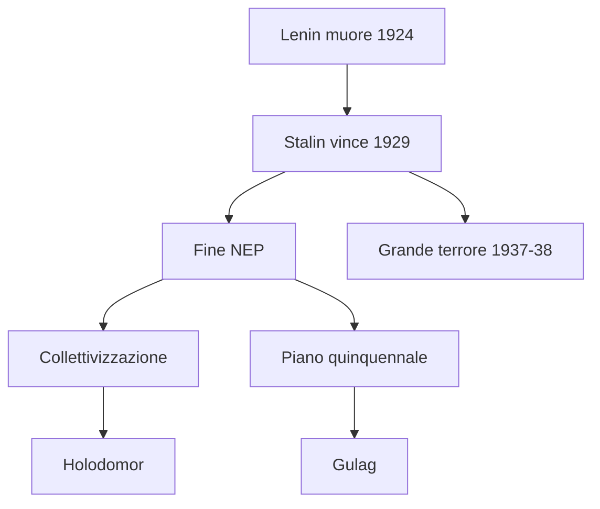
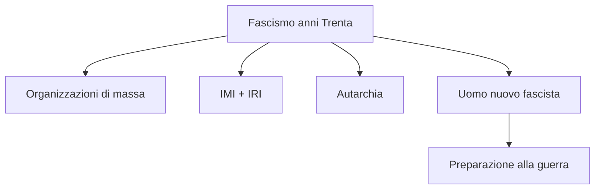
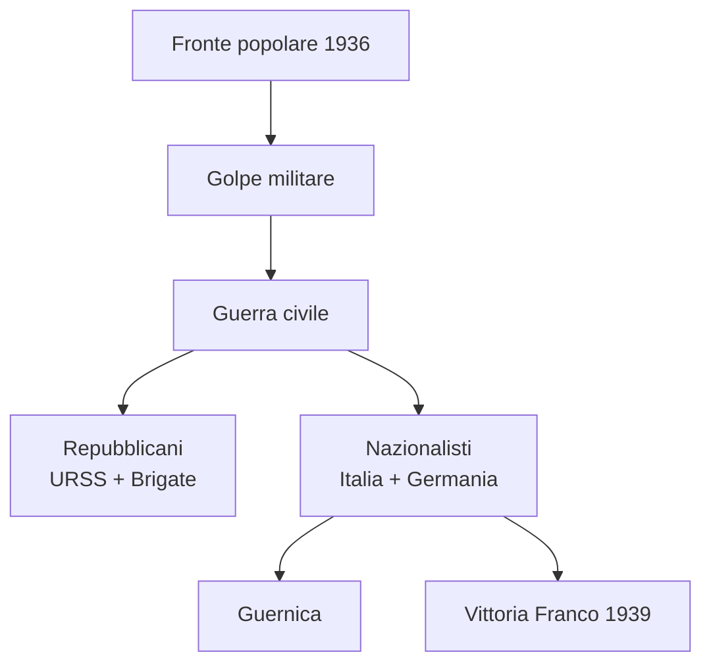
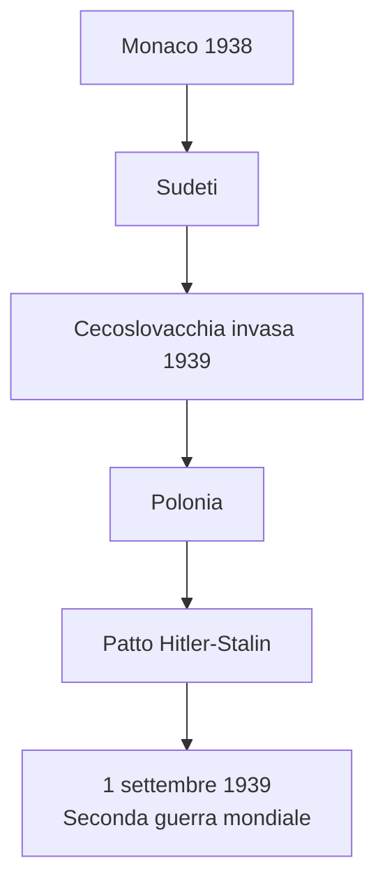
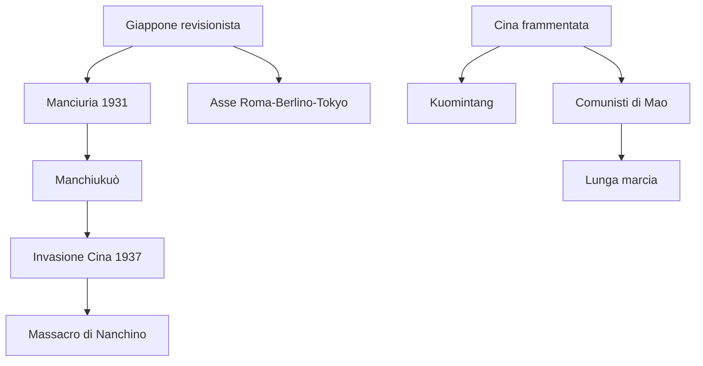

# Ripasso Veloce - Cap. 3.12: Anni Trenta: totalitarismi e progetti revisionisti

---

## Date fondamentali

| Data | Evento |
|------|--------|
| **1921** | Mao fonda il **Partito comunista cinese** |
| **1929** | Stalin impone collettivizzazione e piano quinquennale |
| **1931** | Giappone invade la **Manciuria** |
| **1934-35** | **Lunga marcia** di Mao |
| **3 ottobre 1935** | Italia attacca l'**Etiopia** |
| **9 maggio 1936** | Mussolini proclama l'**Impero** |
| **1936-39** | **Guerra civile spagnola** |
| **1937-38** | **Grande terrore** staliniano |
| **17 novembre 1938** | **Leggi razziste** in Italia |
| **Settembre 1938** | **Conferenza di Monaco** |
| **23 agosto 1939** | Patto **Molotov-von Ribbentrop** |
| **1° settembre 1939** | Germania invade la **Polonia** |
| **27 settembre 1940** | **Patto Tripartito** |

---

## 1. Stalin e l'URSS degli anni Trenta

### Successione a Lenin
- **Lenin muore nel 1924**
- Stalin controlla il partito come **segretario generale**
- Slogan: **«socialismo in un solo Paese»**
- Avversari:
  - **Trockij**: rivoluzione permanente, industrializzazione accelerata
  - **Bucharin**: difesa della NEP
- **1929**: Stalin si impone, Trockij espulso, fine NEP

### Collettivizzazione
- Obiettivo: controllare le campagne dall'alto
- **Kulaki** = «nemici di classe»
- **Dekulakizzazione**: sequestro proprietà, deportazioni, repressione
- Nascita dei **kolchoz**
- Carestia 1932-33:
  - Ucraina colpita duramente
  - ***Holodomor***: circa **3,5 milioni** di morti

### Industrializzazione e Gulag
- **Piano quinquennale** (1929-33): industria pesante, modernizzazione forzata
- Uso del **lavoro forzato**
- **Gulag**: campi di lavoro; quasi **4 milioni** di persone tra 1934 e 1941

### Grande terrore
- Regime fondato su burocrazia + polizia politica + culto di Stalin
- **NKVD** = braccio repressivo
- **1937-38**: grande terrore
- Dati: **1.575.000 arresti**, **681.692 esecuzioni**
- Motivi: nemici interni + paura di guerra futura
- Storiografia: Stalin responsabile diretto, non solo prodotto del sistema

---

## 2. Italia fascista negli anni Trenta

### Progetto totalitario
- Obiettivo: costruire una **«nuova Italia»** fascista
- Società controllata dall'alto e pronta alla guerra
- **1931**: giuramento obbligatorio dei professori universitari
- Solo **12** rifiutano

### Organizzazioni di massa
- **OND**: tempo libero dei lavoratori, 3 milioni iscritti nel 1936
- **ONB**: bambini e ragazzi
- **GIL**: organizzazioni giovanili unificate, obbligatoria dal 1939
- **GUF**: universitari
- Donne: ruolo pubblico ma subordinato, soprattutto **spose e madri**

### Economia e autarchia
- Crisi 1929 → più intervento dello Stato
- **IMI** (1931): finanziamento imprese
- **IRI** (1933): salvataggio e gestione aziende
- **Autarchia** = autosufficienza economica in vista della guerra

### Fascistizzazione
- 1939: oltre **21.600.000 italiani** inquadrati in organizzazioni PNF
- Camera dei deputati sostituita dalla **Camera dei fasci e delle corporazioni**
- Misure quotidiane: «voi», saluto romano, divieto parole straniere
- Ideale: **«uomo nuovo» fascista**, virile, atleta, soldato
- Consenso non stabile: propaganda + conformismo + paura + apatia
- Fine anni Trenta: cresce il distacco psicologico dalla guerra voluta dal regime

---

## 3. Etiopia e leggi razziste

### Guerra d'Etiopia
- Obiettivo: dominio nel **Corno d'Africa** e nel Mediterraneo
- **3 ottobre 1935**: aggressione italiana all'Etiopia
- Società delle Nazioni: sanzioni deboli
- **9 maggio 1936**: proclamazione dell'**Impero**
- Guerra criminale:
  - uso dei **gas**
  - violenze contro civili
  - repressione dopo attentato a **Graziani**
  - massacro di **Debra Libanòs**

### Verso Berlino
- Intervento in Spagna lega Mussolini a Hitler
- **24 ottobre 1936**: **Asse Roma-Berlino**
- Italia = **alleato minore** della Germania
- 1937: ritiro dalla Società delle Nazioni

### Razzismo fascista
- Colonie: regime di ***apartheid***
- Separazione tra italiani e indigeni
- Italianizzazione forzata delle popolazioni slave
- 1938: campagna antisemita e *Manifesto degli scienziati razzisti*

### Leggi razziste 1938
- **17 novembre 1938**: «Provvedimenti per la difesa della razza italiana»
- Ebrei esclusi da:
  - scuola e università
  - amministrazioni
  - PNF
  - professioni
- Vietati i **matrimoni misti**
- Censimento ebrei 1938 = schedatura di polizia
- Scelta autonoma di Mussolini: nuovo **nemico interno**, non semplice imitazione tedesca
- Fino al 1943: persecuzione dei diritti; dopo 1943: anche deportazioni

---

## 4. Guerra di Spagna

### Dalla repubblica al colpo di Stato
- **1931**: Spagna repubblicana
- **Febbraio 1936**: vince il **Fronte popolare**
- Destra monarchica, militare, clericale e conservatrice prepara il golpe
- Luglio 1936: rivolta militare dal Marocco
- Leader nazionalista: **Francisco Franco**

### Schieramenti
| Repubblicani | Nazionalisti |
|--------------|--------------|
| Operai, braccianti, intellettuali | Falange, monarchici, conservatori |
| URSS | Italia fascista |
| Brigate internazionali | Germania nazista |

### Internazionalizzazione
- URSS sostiene la repubblica
- Italia invia circa **50.000 uomini**
- Germania sperimenta bombardamenti e armi
- **Guernica** (26 aprile 1937): bombardamento terroristico

### Brigate internazionali
- Circa **40.000** volontari da 50 Paesi
- Italiani antifascisti: battaglione Garibaldi, Giustizia e Libertà
- Slogan: **«Oggi in Spagna, domani in Italia»**
- **Guadalajara** (marzo 1937): vittoria propagandistica repubblicana

### Fine
- **28 marzo 1939**: Franco conquista Madrid
- **1° aprile 1939**: vittoria nazionalista
- Primo grande scontro ideologico europeo: fascismo contro antifascismo
- Laboratorio militare: aviazione, bombardamenti sui civili, collaborazione Italia-Germania
- Problema repubblicano: divisioni interne tra stalinisti, anarchici, trozkisti, socialisti

---

## 5. Revisionismo hitleriano

### Cecoslovacchia
- Dopo Austria, Hitler punta ai **Sudeti**
- Gran Bretagna: ***appeasement***
- Francia incerta, non agisce senza Londra
- **Conferenza di Monaco** (settembre 1938):
  - Hitler ottiene i Sudeti
  - Chamberlain e Mussolini parlano di pace
  - compromesso solo provvisorio

### Marzo 1939
- Germania invade la **Cecoslovacchia**
- Boemia e Moravia = **protettorato**
- Slovacchia = Stato satellite
- Slavi trattati come possedimento coloniale
- Monaco fallisce: concessioni diplomatiche non fermano Hitler
- Mussolini appare «salvatore della pace», ma gli italiani mostrano poca voglia di guerra

### Polonia e patto con Stalin
- Hitler vuole **Danzica** e la Polonia
- Londra e Parigi garantiscono le frontiere polacche
- **23 agosto 1939**: Patto **Molotov-von Ribbentrop**
- Protocollo segreto: spartizione della Polonia e sfere d'influenza
- **1° settembre 1939**: invasione della Polonia → Seconda guerra mondiale

---

## 6. Giappone e Cina

### Giappone revisionista
- Prima potenza asiatica
- Deluso da Versailles:
  - niente **parità razziale**
  - limiti alla flotta con Washington 1922
- Verso regime **autoritario, nazionalista, aggressivo**
- Obiettivo: Cina, materie prime, spazio imperiale

### Cina frammentata
- Repubblica dal 1912, ma debole
- Molte regioni controllate dai **signori della guerra**
- **Movimento del 4 maggio** 1919: nazionalismo + antimperialismo + modernizzazione
- **1921**: Mao fonda il Partito comunista cinese

### Kuomintang vs comunisti
- **Kuomintang** = nazionalisti di Sun Yat-sen, poi **Chiang Kai-shek**
- 1927: Chiang rompe con i comunisti e li reprime
- 1928: Cina formalmente riunificata, ma governo fragile e autoritario
- Mao punta sui **contadini** e sulle campagne

### Manciuria e lunga marcia
- **1931**: Giappone invade la Manciuria
- Crea il **Manchiukuò**, Stato fantoccio
- **1934-35**: lunga marcia di Mao, 12.000 km
- Effetto: comunisti salvi e prestigio di Mao rafforzato

### Invasione della Cina
- **Luglio 1937**: invasione completa della Cina
- **Massacro di Nanchino**: almeno 300.000 morti secondo stime cinesi
- Resistenza cinese non domata

### Asse Roma-Berlino-Tokyo
- Progetto giapponese: **Grande sfera di coprosperità**
- Propaganda: **«Asia agli asiatici»**
- Realtà: egemonia giapponese sull'Asia orientale
- **1936**: Patto anti-Komintern con Germania
- **1940**: Patto Tripartito con Germania e Italia
- Punto debole: dipendenza da petrolio e acciaio importati da USA e Impero britannico

