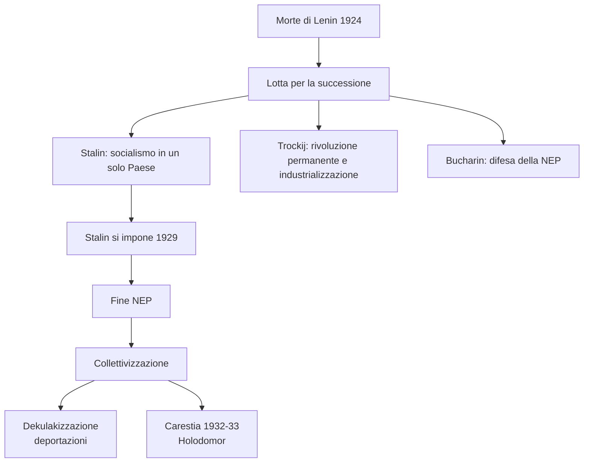
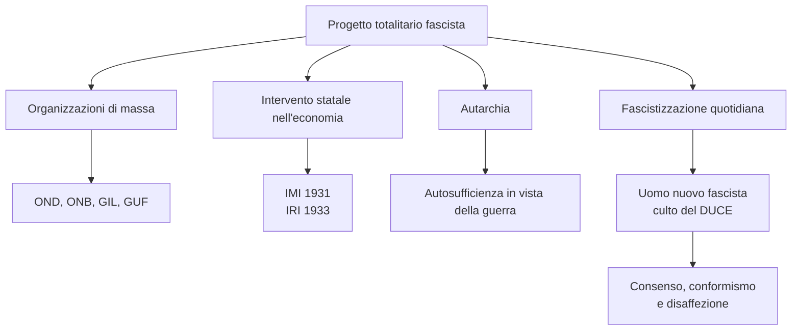
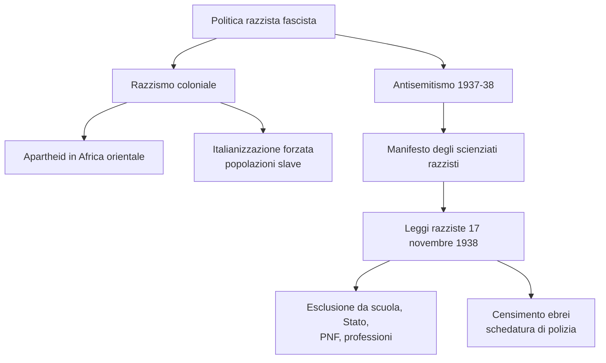
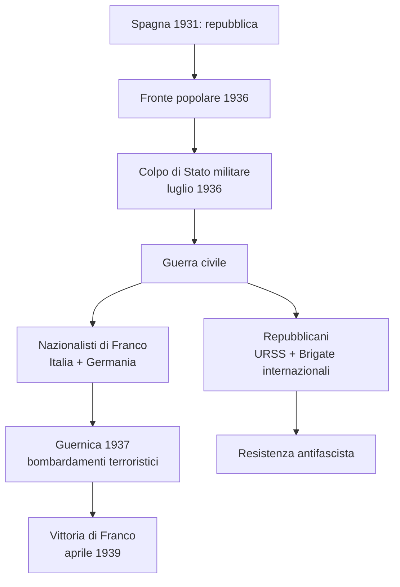
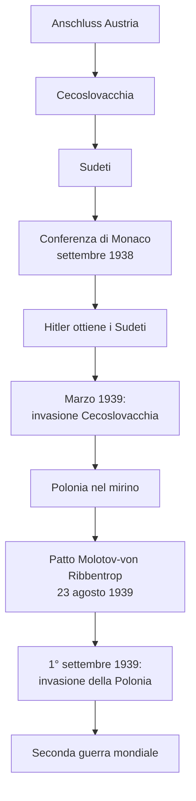
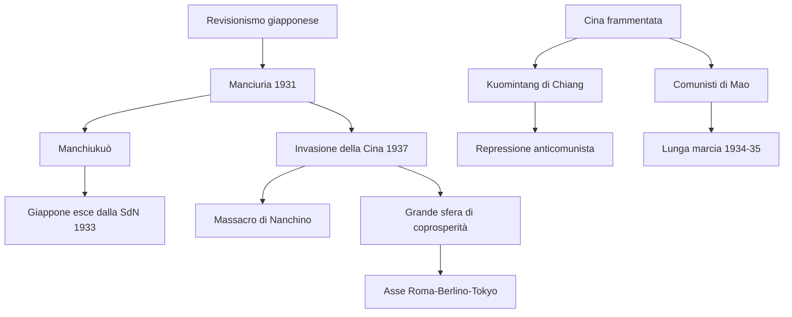
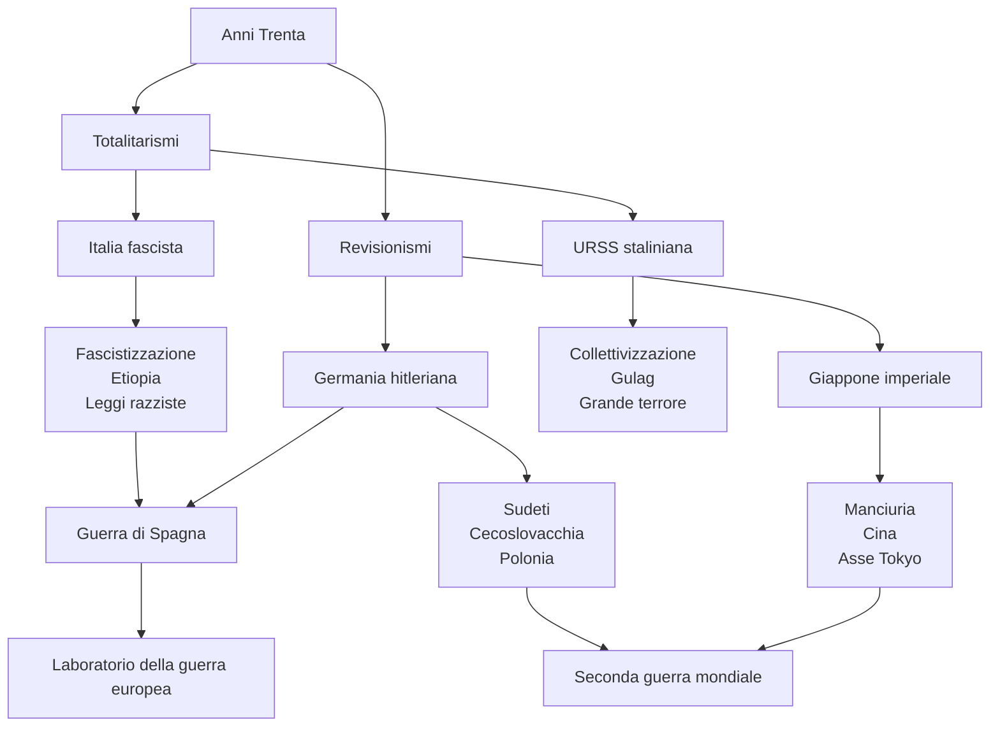

# Schema di Studio - Capitolo 3.12: Anni Trenta: totalitarismi e progetti revisionisti

---

## Date fondamentali del capitolo

| Anno / Data | Evento |
|-------------|--------|
| **1921** | Mao Tse-Tung fonda il **Partito comunista cinese** |
| **1924** | Morte di **Lenin**: si apre la lotta per la successione |
| **1929** | **Stalin** si impone nell'URSS: fine della NEP, collettivizzazione e primo piano quinquennale |
| **1931** | Giappone invade la **Manciuria**; in Italia obbligo di giuramento al regime per i professori universitari |
| **1933** | In Italia nasce l'**IRI**; il Giappone abbandona la Società delle Nazioni |
| **1934-35** | «Lunga marcia» dei comunisti cinesi guidati da **Mao** |
| **3 ottobre 1935** | L'Italia fascista attacca l'**Etiopia** |
| **9 maggio 1936** | Mussolini proclama la **nascita dell'Impero** |
| **1936-39** | **Guerra civile spagnola**, vinta dai nazionalisti di **Francisco Franco** |
| **24 ottobre 1936** | Nasce l'**Asse Roma-Berlino** |
| **1937-38** | **Grande terrore** staliniano |
| **17 novembre 1938** | In Italia vengono promulgate le **leggi razziste** contro gli ebrei |
| **Settembre 1938** | **Conferenza di Monaco**: Hitler ottiene i Sudeti |
| **Marzo 1939** | La Germania invade la **Cecoslovacchia** |
| **23 agosto 1939** | Patto di non aggressione **Molotov-von Ribbentrop** tra Germania e URSS |
| **1° settembre 1939** | La Germania invade la **Polonia**: inizia la Seconda guerra mondiale |
| **27 settembre 1940** | **Patto Tripartito** tra Italia, Germania e Giappone |

---

## 1. L'affermazione di Stalin e l'URSS degli anni Trenta

### 1.1 Dopo Lenin: la lotta per il potere

Con la **morte di Lenin** nel **1924**, la rivoluzione e il Partito bolscevico persero il loro leader. La successione aprì un duro scontro tra i principali dirigenti. **Stalin**, segretario generale del partito dal 1922, controllava i meccanismi organizzativi e la nomina dei quadri: proprio questa posizione gli permise di costruire una rete di fedeltà decisiva.

Il conflitto non riguardava solo il potere personale, ma anche la direzione politica dell'URSS. Stalin sosteneva la linea del **«socialismo in un solo Paese»**, cioè il consolidamento dello Stato sovietico anche senza l'immediata esportazione della rivoluzione. **Trockij**, invece, voleva accelerare l'industrializzazione e continuare a promuovere la rivoluzione internazionale. **Bucharin** difendeva la **NEP**, favorevole ai contadini e a una transizione graduale.

Nel **1929** Stalin si impose definitivamente: Trockij fu espulso dall'URSS, Bucharin venne sconfitto e la NEP fu chiusa. Iniziava la **«grande svolta»**, cioè una nuova fase di industrializzazione forzata e di guerra contro il mondo contadino.

### 1.2 Collettivizzazione e «grande guerra contadina»

Stalin mirava a una **rivoluzione dall'alto**, controllata dal partito e dallo Stato. Il primo bersaglio furono i **kulaki**, i contadini più benestanti, considerati «nemici di classe». La **dekulakizzazione** comportò sequestro delle proprietà, deportazione delle famiglie e repressione affidata alla polizia politica.

L'obiettivo era abolire la proprietà privata nelle campagne e creare grandi aziende collettive, i **kolchoz**. Tra il 1930 e il 1931 furono coinvolte milioni di famiglie contadine; circa **2 milioni di persone** vennero deportate in Siberia e Asia centrale. La resistenza delle campagne fu durissima, ma lo Stato rispose con violenza e requisizioni.

Dal **1932** una carestia devastante colpì l'URSS. In **Ucraina**, dove Stalin scelse di non contrastare la fame nelle regioni ritenute ostili, morirono circa **3,5 milioni** di persone: questa tragedia è ricordata come ***Holodomor***, «morte per fame», e assunse un carattere repressivo antiucraino.

### 1.3 Industrializzazione, Gulag e bilancio del progetto sovietico

La collettivizzazione coincise con il **primo piano quinquennale** (1929-33), un programma economico centralizzato per accelerare l'industrializzazione, soprattutto nell'**industria pesante**. Lo scopo era trasformare rapidamente l'URSS in una potenza moderna, urbana e industriale.

Il piano ottenne risultati importanti, ma attraverso coercizione, disorganizzazione e sfruttamento. Per realizzare grandi opere e progetti industriali si ricorse anche al **lavoro forzato**. Nacque così l'**«arcipelago Gulag»**, una rete di campi di lavoro in cui furono deportati oppositori, kulaki, religiosi e categorie sociali considerate ostili. Tra il 1934 e il 1941 passarono dai Gulag quasi **quattro milioni** di persone.

L'URSS poté presentarsi, nel mondo colpito dalla crisi del 1929, come alternativa al capitalismo. Tuttavia i costi umani furono enormi: carestie, deportazioni, lavoro forzato e repressione mostrarono il lato violento della modernizzazione staliniana.

### 1.4 Burocrazia, polizia politica e Grande terrore

Il regime staliniano si fondò su nuove **burocrazie** di partito e di Stato e sulla **polizia politica**. Nel 1934 l'NKVD assorbì l'OGPU e divenne il braccio esecutivo della repressione. Intorno a Stalin si sviluppò un forte **culto della personalità**, analogo per alcuni aspetti a quello dei dittatori nazifascisti.

Nella seconda metà degli anni Trenta Stalin scatenò una nuova ondata repressiva. L'omicidio di **Sergej Kirov**, capo del partito di Leningrado, fu usato come pretesto per colpire vecchi avversari e dirigenti sospettati di autonomia. Tra il 1936 e il 1938 si svolsero tre grandi processi pubblici a Mosca, conclusi con condanne a morte.

Il biennio **1937-38** passò alla storia come **«grande terrore»**. Furono colpiti non solo dirigenti del partito, ma anche ex kulaki, religiosi, funzionari zaristi e gruppi nazionali sospetti. Nel biennio furono arrestate **1.575.000 persone**; **681.692** furono giustiziate.

| Aspetto | Contenuto |
|---------|-----------|
| **Base sociale del regime** | Burocrazie di partito, Stato e polizia politica |
| **Strumento repressivo** | NKVD, campi di lavoro, processi pubblici |
| **Ideologia della repressione** | Nemici interni, conflitto permanente, guerra futura |
| **Grande terrore** | 1937-38: arresti di massa e centinaia di migliaia di esecuzioni |

### 1.5 Perché la «grande svolta» fu anche una guerra sociale

La svolta staliniana non fu soltanto una riforma economica. Fu una trasformazione violenta della società sovietica, condotta secondo una logica di **guerra interna**. La categoria dei *kulaki* era elastica: poteva indicare veri contadini ricchi, ma anche famiglie appena più solide delle altre, membri del clero rurale o figure influenti nelle comunità di villaggio. In questo modo il regime poteva colpire non solo un gruppo economico, ma tutti i possibili centri di autonomia delle campagne.

La collettivizzazione colpì direttamente il nucleo della rivoluzione contadina del 1917: il possesso della terra. Molti contadini preferirono distruggere il bestiame piuttosto che consegnarlo ai *kolchoz*. Il risultato fu un crollo del patrimonio zootecnico: nel **1934** si registrarono meno di **5 milioni di capi**, contro i **36 milioni** del 1929. La fame non fu quindi una semplice conseguenza naturale, ma il risultato di deportazioni, requisizioni, inefficienza dei *kolchoz* e scelta politica di estrarre grano per finanziare l'industria.

La definizione di **«grande guerra contadina»** indica proprio questo conflitto di lunga durata tra Stato bolscevico e mondo rurale. Cominciato durante la guerra civile, esso terminò con la vittoria di Stalin: il tradizionale mondo contadino cessò di essere un soggetto autonomo e fu assorbito, con la forza, nell'economia pianificata.

### 1.6 Modernizzazione e violenza: il paradosso dello stalinismo

Il primo piano quinquennale voleva costruire in pochi anni ciò che in altri Paesi era maturato in tempi molto più lunghi: industria pesante, urbanizzazione, alfabetizzazione, infrastrutture, potenza militare. Anche opere simboliche, come la **metropolitana di Mosca** avviata nel 1931 e aperta in un primo tratto nel 1935, dovevano mostrare la capacità modernizzatrice del regime.

Il metodo, però, era volontaristico e militarizzato. Gli obiettivi venivano fissati dall'alto dagli apparati statali e di partito; le risorse erano assegnate di conseguenza; le condizioni locali e la realtà produttiva contavano poco. La pianificazione sovietica poteva così apparire efficace rispetto al capitalismo in crisi, ma funzionava attraverso coercizione, disciplina forzata e sfruttamento.

Il **Gulag** fu parte integrante di questo meccanismo. Non era solo un sistema punitivo, ma anche una riserva di lavoro forzato per miniere, impianti industriali, grandi complessi produttivi e opere dell'«edificazione socialista». Alcuni nomi divennero simbolici: **Kolyma**, **Vorkuta**, **Karaganda**, **Solovki**. L'acronimo Gulag deriva da *Glavnoe upravlenie lagerej*, «Direzione centrale dei lager».

### 1.7 Stalin nella storiografia

Il capitolo insiste anche su una domanda storiografica: quale ruolo ebbe Stalin nello stalinismo? Dopo l'apertura degli archivi sovietici negli anni Novanta, gli storici hanno potuto superare molte ricostruzioni fondate solo su memorie e testimonianze indirette.

Lo storico **Oleg V. Chlevnjuk** ha contestato la riabilitazione di Stalin come modernizzatore «necessario»: anche se l'URSS divenne una potenza industriale e poi una superpotenza, il prezzo umano resta smisurato e non giustificabile. **Andrea Graziosi** ha interpretato il Grande terrore come un'operazione di **«terrore preventivo»**, una sorta di chirurgia etnico-sociale che non colpì soltanto la classe dirigente, ma milioni di persone considerate possibili minacce.

Il punto chiave è che Stalin non fu solo il prodotto impersonale di un sistema: ebbe responsabilità individuali e criminali precise, perché distrusse alternative politiche interne e scelse consapevolmente strumenti di violenza di massa.

---

## 2. L'Italia fascista: il progetto totalitario negli anni Trenta

### 2.1 La «nuova Italia» del fascismo

Negli anni Trenta il fascismo radicalizzò il suo progetto totalitario. Il regime voleva costruire una **«nuova Italia»**, cioè una società trasformata dall'alto, mobilitata in nome del regime e pronta alla guerra. L'opposizione antifascista fu repressa e il PNF ampliò il proprio controllo sulla società.

L'iscrizione al partito divenne obbligatoria per molti dipendenti pubblici. Nel **1931** fu imposto ai professori universitari il giuramento di fedeltà al regime: solo **dodici** rifiutarono e persero la cattedra. L'**Opera nazionale dopolavoro** (OND), incorporata nel partito nel 1932, organizzava il tempo libero dei lavoratori; nel 1936 contava circa **3 milioni** di iscritti.

### 2.2 Giovani, donne e organizzazioni di massa

Il fascismo cercò di conquistare anche l'educazione dei giovani. L'**Opera nazionale balilla** (ONB), istituita nel 1926, inquadrava bambini e ragazzi dai 6 ai 18 anni. Nel 1937 tutte le organizzazioni giovanili confluirono nella **Gioventù italiana del littorio** (GIL), la cui partecipazione divenne obbligatoria nel 1939.

I **Gruppi universitari fascisti** (GUF) riguardavano invece gli studenti universitari e furono anche spazi limitati di discussione interna al fascismo. Le organizzazioni femminili assegnavano alle donne un ruolo pubblico ma subordinato: il regime le voleva soprattutto **spose e madri**, pur coinvolgendole in attività assistenziali e ausiliarie.

### 2.3 Politiche socio-economiche, assistenza e autarchia

La crisi del 1929 colpì l'Italia destabilizzando il sistema bancario. Il regime rispose con un maggiore **intervento dello Stato nell'economia**. Nel 1931 nacque l'**IMI**, per finanziare le imprese industriali; nel 1933 nacque l'**IRI**, che salvava e gestiva direttamente aziende in difficoltà.

Il fascismo sviluppò anche un'assistenza sociale centralizzata e paternalista: previdenza, assicurazioni, assistenza medica e legale, sussidi, asili e colonie. L'**ONMI** aveva anche un obiettivo demografico: aumentare la popolazione in vista della guerra.

Dopo le sanzioni della Società delle Nazioni per l'aggressione all'Etiopia, il regime formalizzò una politica **autarchica**, cioè la ricerca dell'autosufficienza economica. L'autarchia doveva rendere l'Italia meno dipendente dall'estero in caso di guerra.

### 2.4 Fascistizzazione e consenso

Alla fine del 1939 oltre **21.600.000 italiani** erano inquadrati in organizzazioni dipendenti dal PNF. Nel gennaio 1939 la Camera dei deputati fu sostituita dalla **Camera dei fasci e delle corporazioni**. Il regime intervenne anche nei comportamenti quotidiani: divieto di parole straniere, obbligo del «voi», saluto romano al posto della stretta di mano.

Il modello proposto era quello dell'**«uomo nuovo» fascista**: virile, atleta, soldato, obbediente e pronto alla guerra. Tuttavia il consenso non fu uniforme né costante. Accanto ad adesione, propaganda e assistenza, vi furono conformismo, paura, apatia e crescente disaffezione, soprattutto alla fine degli anni Trenta.

### 2.5 Totalitarismo fascista e controllo della società

Il progetto totalitario fascista degli anni Trenta non si limitava a reprimere l'opposizione. Puntava a produrre italiani nuovi, cioè individui educati fin dall'infanzia a pensare, parlare, muoversi e obbedire secondo lo stile del regime. Per questo il fascismo intervenne sia nelle istituzioni sia nella vita quotidiana.

L'obbligo di iscrizione al PNF per i dipendenti pubblici e l'obbligo di giuramento per i professori universitari mostrano la volontà di subordinare le élite culturali e amministrative. Il caso dei dodici docenti che rifiutarono il giuramento è importante perché mostra quanto ristretto fosse ormai lo spazio pubblico dell'antifascismo legale.

L'**OND** agiva sul tempo libero, cioè su uno spazio apparentemente non politico. Sport, gite, spettacoli, dopolavoro e attività ricreative servivano a integrare lavoratori e famiglie nel regime. L'**ONB** e poi la **GIL** agivano invece sull'infanzia e sull'adolescenza, costruendo una pedagogia militare e nazionale. I **GUF**, pur essendo più elitari, servivano a formare quadri e intellettuali fascisti.

### 2.6 Il ruolo ambiguo delle donne

Il fascismo attribuiva alle donne una funzione tradizionale: essere **spose e madri**. La politica demografica del regime collegava maternità, forza della nazione e preparazione alla guerra: più popolazione significava, nella logica fascista, più soldati.

Allo stesso tempo, però, il progetto totalitario non poteva lasciare fuori metà della società. Le donne furono quindi mobilitate in organizzazioni femminili e attività assistenziali, ma con ruoli subordinati, ausiliari e non decisionali. La politica restava maschile; alle donne erano affidati compiti coerenti con l'immagine fascista della femminilità: cura, assistenza, maternità, supporto morale e sociale.

Questa ambivalenza è centrale: il regime voleva mobilitare le donne, ma non emanciparle. Le inseriva nella sfera pubblica solo per rafforzare un ordine gerarchico e tradizionale.

### 2.7 Stato imprenditore, assistenza e paternalismo

Dopo il 1929 il fascismo non adottò una politica puramente liberista. La crisi destabilizzò le banche e costrinse lo Stato a intervenire direttamente. L'**IMI** finanziava le imprese nel medio e lungo periodo; l'**IRI** interveniva nei salvataggi industriali e acquisiva la gestione di aziende. Nel 1940 l'IRI controllava circa il **45% della produzione italiana di acciaio**, l'**80% della cantieristica navale** e circa il **50% della produzione di armi e munizioni**.

Questa politica non era socialista: non mirava a dare potere ai lavoratori. Era un dirigismo autoritario, in cui lo Stato regolava e salvava settori strategici, mantenendo però l'ordine sociale e politico del regime.

Anche l'assistenza sociale aveva carattere **centralizzato, autoritario e paternalista**. INPS, INAIL e INAM rispondevano a funzioni previdenziali, assicurative e sanitarie; il PNF aggiungeva assistenza medica, legale, sussidi, colonie, asili. L'assistenza rafforzava il legame di dipendenza tra cittadino e regime: il fascismo si presentava come protettore, ma in cambio pretendeva obbedienza e mobilitazione.

### 2.8 Consenso, conformismo e distacco psicologico

La questione del consenso è delicata perché in una dittatura non esiste libera espressione del dissenso. Il capitolo mostra che l'adesione al fascismo fu reale in alcuni settori, ma fu prodotta da una combinazione di **propaganda**, **coercizione**, **religione politica** e **assistenza**.

Già alla fine degli anni Trenta emersero segni di disaffezione: difficoltà economiche, sacrifici per Etiopia e Spagna, inefficienza del partito, abusi degli apparati. Il fascismo continuava a parlare di rivoluzione, ma era al potere da quasi vent'anni e appariva invecchiato. La popolazione, pur inquadrata, maturava una crescente indisponibilità a sacrificarsi per una guerra. Questo era un problema decisivo, perché proprio la guerra era lo sbocco verso cui il regime voleva condurre l'Italia.

| Strumento | Funzione nel progetto fascista |
|-----------|--------------------------------|
| **PNF** | Controllo politico e carriera pubblica |
| **OND** | Inquadramento del tempo libero |
| **ONB / GIL** | Educazione politica e militare dei giovani |
| **GUF** | Formazione delle élite universitarie fasciste |
| **ONMI** | Politica demografica e maternità |
| **IMI / IRI** | Intervento statale nell'economia |
| **Autarchia** | Preparazione economica alla guerra |

---

## 3. Dall'invasione dell'Etiopia alle leggi antiebraiche

### 3.1 La politica estera aggressiva

Negli anni Trenta il fascismo unì il progetto totalitario interno a una **politica estera aggressiva** e a una **politica razzista**. Mussolini voleva aumentare il peso internazionale dell'Italia e guardava soprattutto all'area mediterranea e africana. L'obiettivo principale divenne l'**Etiopia**, regno indipendente e membro della Società delle Nazioni.

Controllare il **Corno d'Africa** avrebbe significato rafforzare la presenza italiana sul Mar Rosso e lungo la rotta verso l'Oceano Indiano. Mussolini riteneva che Londra e Parigi non avrebbero ostacolato l'impresa, perché l'Italia era ancora utile per contenere il revisionismo tedesco.

### 3.2 La guerra d'Etiopia

Il **3 ottobre 1935** le truppe italiane aggredirono l'Etiopia. La Società delle Nazioni reagì con sanzioni economiche deboli, che non fermarono la guerra ma alimentarono la propaganda fascista e la campagna autarchica.

La guerra fu preparata con un grande dispiegamento di uomini e mezzi. Mussolini non voleva ripetere la sconfitta di **Adua** del 1896. La vittoria contro un avversario militarmente più debole produsse però pericolose illusioni di potenza. Il **9 maggio 1936** Mussolini proclamò la nascita dell'**Impero**, raggiungendo forse l'apice del consenso al regime.

Fu però una **guerra criminale**: l'esercito italiano usò gas, violenze generalizzate e repressione contro i civili. Nel 1937, dopo un attentato contro il governatore **Rodolfo Graziani**, Addis Abeba fu saccheggiata e la repressione colpì anche il clero ortodosso etiope, con il massacro di Debra Libanòs.

### 3.3 Dall'Etiopia alla Spagna: l'Italia alleata minore della Germania

L'intervento nella **guerra civile spagnola**, scoppiata nel 1936, restringeva lo spazio di manovra internazionale di Mussolini. L'Italia sostenne i nazionalisti di **Franco** per ragioni ideologiche, anticomuniste e mediterranee. Tuttavia il risultato fu un legame sempre più stretto con la Germania nazista.

Il **24 ottobre 1936** nacque l'**Asse Roma-Berlino**. L'Italia, pur collaborando con Hitler, assumeva il ruolo di **alleato minore**. Guerra d'Etiopia, intervento in Spagna e ritiro dalla Società delle Nazioni nel 1937 mostrarono che il fascismo si stava muovendo verso la guerra.

### 3.4 Razzismo coloniale e leggi razziste del 1938

Nella seconda metà degli anni Trenta il regime elaborò una politica razzista organica. Il mito della **«nuova razza»** fascista si intrecciò con la violenza coloniale e con l'idea di purezza del sangue. Nelle colonie dell'Africa orientale fu costruito un regime di ***apartheid***, con separazione tra italiani e indigeni e divieto di rapporti coniugali.

Il razzismo fascista colpì anche le popolazioni slave nelle zone di confine, sottoposte a italianizzazione forzata. Tra il 1937 e il 1938 Mussolini promosse una campagna antisemita. Il *Manifesto degli scienziati razzisti* inserì l'antisemitismo nel razzismo biologico.

Il **17 novembre 1938** furono promulgati i **«Provvedimenti per la difesa della razza italiana»**. Gli ebrei italiani furono esclusi da amministrazioni, PNF, scuole, università, libere professioni e molti spazi della vita pubblica; furono vietati i matrimoni misti. Il censimento degli ebrei dell'agosto 1938 divenne una schedatura di polizia.

| Ambito | Conseguenze delle leggi razziste |
|--------|----------------------------------|
| **Scuola** | Espulsione di studenti e insegnanti ebrei |
| **Stato** | Esclusione da amministrazioni civili e militari |
| **Politica** | Divieto di appartenenza al PNF |
| **Società** | Limitazioni patrimoniali e professionali |
| **Famiglia** | Divieto di matrimoni misti tra ariani ed ebrei |

### 3.5 Etiopia: guerra coloniale e prova di mobilitazione

La guerra d'Etiopia fu per il fascismo la prima grande realizzazione della politica estera aggressiva. L'Etiopia era contigua all'Eritrea e alla Somalia italiana, quindi la sua conquista avrebbe permesso di unificare l'Africa orientale italiana e rafforzare il controllo sul Mar Rosso.

Il regime preparò la guerra con un dispiegamento di forze insolito per una guerra coloniale. Mussolini ricordava la sconfitta di **Adua** del 1896 e non voleva correre rischi. La vittoria fu usata per alimentare il mito della potenza italiana, ma proprio il fatto di combattere contro un avversario militarmente più debole produsse illusioni pericolose sulla reale capacità bellica dell'Italia.

La Società delle Nazioni applicò sanzioni troppo deboli per fermare l'aggressione. Il fascismo trasformò quelle sanzioni in propaganda: l'Italia veniva presentata come nazione proletaria assediata dalle potenze plutocratiche, e l'**autarchia** diventava una risposta patriottica.

### 3.6 Perché la guerra d'Etiopia è definita criminale

La guerra fu criminale per vari motivi:

- fu un'aggressione contro uno Stato indipendente e membro della Società delle Nazioni;
- fu condotta con strumenti vietati o condannati, come l'**uso dei gas**;
- colpì la popolazione civile con violenze generalizzate;
- proseguì anche dopo la proclamazione dell'Impero, perché la resistenza etiopica non fu domata;
- nel 1937 la repressione dopo l'attentato a **Graziani** produsse stragi ad Addis Abeba e nel monastero di **Debra Libanòs**.

L'immagine propagandistica della missione civilizzatrice nascondeva quindi una violenza coloniale estrema. Il commento di William Shirer, riportato nel capitolo, smonta proprio la retorica fascista della «civiltà romana» contrapposta alla «barbarie».

### 3.7 La scelta antisemita fu autonoma

Il capitolo sottolinea un punto importante: le leggi razziste italiane non furono una semplice imposizione tedesca. L'avvento di Hitler rese centrale la questione ebraica in Europa, ma l'avvio della politica antisemita fascista fu deciso da **Mussolini** con obiettivi propri.

La scelta serviva a radicalizzare il totalitarismo, mantenere mobilitati partito e masse, e individuare un nuovo **nemico interno**. In questa logica la persecuzione degli ebrei entrava nella preparazione ideologica alla guerra: la società doveva essere educata a identificare, isolare e combattere un nemico presentato come estraneo alla nazione.

Nell'agosto 1938 il censimento registrò circa **47.000 ebrei italiani** e circa **10.000 ebrei stranieri**. Formalmente era un censimento; di fatto fu una schedatura di polizia. Fino al 1943 la persecuzione riguardò soprattutto la sfera dei diritti, ma dopo l'8 settembre quegli elenchi divennero uno strumento per arresti e deportazioni.

### 3.8 Reazioni degli italiani alle leggi razziste

Le reazioni non furono uniformi. Ci furono rifiuto e indignazione, ma diminuirono nel tempo per effetto della repressione e della propaganda dell'odio. Accanto a queste reazioni vi furono atteggiamenti conformisti, cinici e interessati: l'esclusione degli ebrei apriva posti, carriere, patrimoni e occasioni per gli «ariani».

Questo è un passaggio importante perché mostra che il razzismo di Stato non funzionò solo dall'alto. Ebbe bisogno di apparati, propaganda, opportunismi sociali e adattamenti quotidiani.

---

## 4. La guerra di Spagna

### 4.1 Dittature e crisi della democrazia europea

Negli anni Venti e Trenta in Europa si diffusero dittature e regimi autoritari, soprattutto nell'area centro-orientale e balcanica. Le cause principali furono instabilità economica, nazionalismo radicale, autoritarismo e antibolscevismo. In Portogallo, nel 1932, **Salazar** instaurò l'***Estado Novo***, ispirato al corporativismo fascista.

In Spagna, la dittatura del generale **Primo de Rivera** terminò dopo la crisi del 1929. Nel **1931** nacque la repubblica, ma la sua vita fu breve e travagliata. Alle elezioni del febbraio **1936** vinse il **Fronte popolare**, coalizione di sinistra formata da socialisti, comunisti, repubblicani e anarchici. La destra monarchica, conservatrice, militare e clericale iniziò a preparare il colpo di Stato.

### 4.2 Il colpo di Stato e l'inizio della guerra civile

Dopo mesi di violenze, nel luglio **1936** alcuni reparti dell'esercito stanziati in Marocco si ribellarono al governo repubblicano. Tra i generali ribelli emerse **Francisco Franco**. Con lui si schierarono la **Falange**, monarchici, conservatori, settori della Chiesa, borghesia moderata e latifondisti.

A difesa della repubblica si mobilitarono operai, braccianti, borghesie urbane e intellettuali. Madrid, Barcellona, Valencia e le aree industriali del Nord resistettero. La guerra civile divenne presto un conflitto internazionale, perché attirò l'intervento diretto o indiretto di potenze straniere.

### 4.3 Un conflitto internazionale

L'**Unione Sovietica** sostenne la repubblica con armi, mezzi e commissari politici, cercando anche di egemonizzare il fronte repubblicano. La sinistra spagnola era però divisa: stalinisti, trozkisti, anarchici e socialisti entrarono in conflitto, fino agli scontri di Barcellona del 1937.

Hitler e Mussolini sostennero i nazionalisti. L'aviazione italiana e tedesca fu decisiva per trasportare le truppe coloniali dal Marocco alla Spagna. Mussolini inviò circa **50.000 uomini**; i tedeschi usarono il conflitto per sperimentare armi e bombardamenti terroristici. Il caso più noto fu **Guernica**, rasa al suolo il **26 aprile 1937** dalla Legione Condor.

### 4.4 Brigate internazionali ed epilogo

A fianco della repubblica combatterono le **Brigate internazionali**, circa **40.000** volontari provenienti da una cinquantina di Paesi. Tra loro vi erano molti italiani antifascisti. Celebre fu lo slogan di Carlo Rosselli: **«Oggi in Spagna, domani in Italia»**.

Nel marzo 1937 i repubblicani vinsero la **battaglia di Guadalajara** contro le forze inviate da Mussolini: non fu decisiva militarmente, ma ebbe grande valore propagandistico. Dopo quasi tre anni di guerra, Franco conquistò Madrid il **28 marzo 1939**; il **1° aprile 1939** la guerra si concluse con la vittoria dei nazionalisti. Fu una vittoria anche per Hitler e Mussolini e diede slancio ai piani aggressivi tedeschi.

### 4.5 La guerra di Spagna come laboratorio politico e militare

La guerra civile spagnola fu più di un conflitto interno. Fu un **laboratorio della guerra europea** che stava arrivando. Da un lato mise di fronte fascismo e antifascismo; dall'altro permise a Germania e Italia di sperimentare collaborazione militare, propaganda e nuove tecniche di guerra.

Per l'Italia fascista la Spagna aveva anche un valore mediterraneo: sostenere Franco significava indebolire l'influenza francese e ottenere un possibile alleato nella Penisola Iberica. Per Hitler, invece, il conflitto servì anche a testare armi e aviazione. La **Legione Condor** anticipò pratiche di bombardamento contro i civili che sarebbero diventate centrali nella Seconda guerra mondiale.

La distruzione di **Guernica** ebbe un valore simbolico enorme. Non era un obiettivo militare decisivo: il bombardamento puntava alla demoralizzazione della popolazione civile e alla distruzione di un luogo centrale dell'identità basca. Il quadro di **Pablo Picasso** trasformò Guernica in un simbolo internazionale dell'antifascismo e della violenza moderna.

### 4.6 Divisioni interne alla sinistra

Il fronte repubblicano non era compatto. L'URSS aiutava la repubblica, ma voleva anche egemonizzare politicamente il campo antifascista. Commissari politici e agenti sovietici rafforzavano l'influenza stalinista. Questo produsse scontri con anarchici, trozkisti e sinistre non allineate.

Il caso più grave avvenne a **Barcellona** nel maggio 1937, quando comunisti ed esercito repubblicano regolarono i conti con trozkisti e anarchici. Queste divisioni indebolirono la repubblica mentre i nazionalisti potevano contare su un sostegno esterno più coerente e militarmente decisivo.

### 4.7 Valore delle Brigate internazionali

Le **Brigate internazionali** ebbero un valore soprattutto politico e simbolico. Riunirono volontari antifascisti da circa cinquanta Paesi e mostrarono che la guerra di Spagna era percepita come una battaglia europea e mondiale. Per gli italiani antifascisti, combattere in Spagna significava affrontare direttamente il fascismo fuori dall'Italia.

La formula di Carlo Rosselli, **«Oggi in Spagna, domani in Italia»**, sintetizzava questa prospettiva: la lotta spagnola era vista come anticipazione della futura liberazione italiana. Anche figure che avrebbero avuto un ruolo nell'Italia repubblicana, come **Togliatti**, **Longo**, **Nenni** e **Di Vittorio**, passarono da quell'esperienza.

| Attore | Ruolo nella guerra |
|--------|--------------------|
| **Franco e nazionalisti** | Ribellione militare, Falange, monarchici, clericali |
| **Repubblicani** | Governo legittimo, operai, braccianti, intellettuali |
| **URSS** | Aiuti militari e controllo politico sul fronte repubblicano |
| **Italia fascista** | Circa 50.000 uomini, marina e aviazione |
| **Germania nazista** | Aviazione, armi, Legione Condor |
| **Brigate internazionali** | Volontari antifascisti, valore simbolico globale |

---

## 5. Il revisionismo hitleriano

### 5.1 I Sudeti e la Conferenza di Monaco

Dopo l'annessione dell'Austria, Hitler mise nel mirino la **Cecoslovacchia**. Rivendicava l'annessione dei **Sudeti**, regione abitata da una minoranza tedesca. In realtà voleva distruggere lo Stato cecoslovacco con la forza.

La Gran Bretagna di **Neville Chamberlain** seguiva la politica dell'***appeasement***, cioè cercava di evitare la guerra concedendo alla Germania parte delle sue richieste. La Francia, alleata di Praga, era più incerta e dipendeva dall'atteggiamento britannico.

Il **29 settembre 1938** si tenne la **Conferenza di Monaco** con Hitler, Mussolini, Chamberlain e Daladier. Hitler ottenne l'integrazione dei Sudeti nel Reich, mentre le potenze europee dichiararono di garantire le frontiere cecoslovacche. Chamberlain e Mussolini presentarono l'accordo come una vittoria della pace, ma era solo un compromesso provvisorio.

### 5.2 La fine della Cecoslovacchia e la Polonia

Nel **marzo 1939** la Germania violò gli accordi di Monaco e invase la Cecoslovacchia. La Boemia e la Moravia divennero un **protettorato** tedesco; la Slovacchia uno Stato satellite. Per la prima volta una potenza europea trattava come colonia una parte d'Europa abitata da slavi.

Subito dopo Hitler puntò alla **Polonia**, rivendicando Danzica e i territori assegnati a Varsavia dopo la Prima guerra mondiale. Londra e Parigi garantirono le frontiere polacche e avviarono trattative con Mosca, ma la diffidenza reciproca favorì l'intesa tra Hitler e Stalin.

### 5.3 Il patto Molotov-von Ribbentrop

Il **23 agosto 1939** Germania e URSS firmarono il **Patto di non aggressione Molotov-von Ribbentrop**. L'accordo rinviava lo scontro tra i due regimi e prevedeva, in un protocollo segreto, la spartizione della **Polonia** e la divisione dell'Europa orientale in sfere di influenza.

Il **1° settembre 1939** le truppe tedesche invasero la Polonia. Hitler pensava a una breve **guerra-lampo** (*Blitzkrieg*), ma con quell'attacco si aprì la **Seconda guerra mondiale**.

### 5.4 Appeasement: logica diplomatica contro logica hitleriana

La crisi cecoslovacca mostra lo scontro tra due modi opposti di intendere la politica internazionale. Gran Bretagna e Francia ragionavano ancora secondo la diplomazia classica: concessioni territoriali, compromessi, equilibrio europeo, contenimento del bolscevismo. Hitler, invece, usava la politica estera come mobilitazione di massa e come preparazione alla violenza.

L'***appeasement*** non fu solo debolezza psicologica. Derivava anche dal trauma della Prima guerra mondiale, dalla paura del comunismo, dalla sottovalutazione del progetto hitleriano e dall'idea che alcune rivendicazioni tedesche potessero essere integrate in un nuovo ordine europeo. Monaco sembrò confermare questa illusione, perché evitò temporaneamente la guerra.

Ma Hitler voleva la Cecoslovacchia con la forza e aveva già fissato l'aggressione per il **1° ottobre 1938**. Accettò Monaco controvoglia perché ottenne i Sudeti senza combattere, ma perse l'occasione della campagna militare che avrebbe voluto trasformare in trionfo. La violazione degli accordi nel marzo 1939 dimostrò che le concessioni non avevano stabilizzato l'Europa.

### 5.5 Il ruolo di Mussolini a Monaco

Mussolini a Monaco apparve come mediatore e «salvatore della pace». In realtà era già alleato della Germania, ma non condivideva pienamente l'urgenza bellica di Hitler né aveva interesse diretto alla Cecoslovacchia. La conferenza gli permise di presentarsi come grande protagonista europeo.

Il successo fu però ambiguo: in Italia Mussolini fu accolto come pacificatore, ma dovette constatare che la popolazione era molto più attratta dalla pace che dall'epica militarista. Questo contrastava con anni di educazione alla guerra e mostrava la distanza tra propaganda del regime e disponibilità reale degli italiani al sacrificio bellico.

### 5.6 Dalla Cecoslovacchia alla guerra mondiale

La distruzione della Cecoslovacchia segnò un salto di qualità. L'annessione dell'Austria poteva essere presentata, nella propaganda nazista, come riunificazione di tedeschi; l'occupazione di Boemia e Moravia era invece dominio su popolazioni slave. Il termine **protettorato** rivelava una logica coloniale applicata dentro l'Europa.

La tappa successiva fu la Polonia. Hitler rivendicava Danzica e denunciava presunti maltrattamenti contro la minoranza tedesca, ma l'obiettivo era ridurre la Polonia a Stato vassallo. Francia e Gran Bretagna, dopo il fallimento di Monaco, garantirono le frontiere polacche, romene e greche.

Il patto con Stalin fu clamoroso perché unì due nemici ideologici. Per Hitler significava evitare una guerra immediata su due fronti; per Stalin significava guadagnare tempo e ottenere sfere di influenza nell'Europa orientale. Il movimento comunista internazionale, che dopo la Spagna aveva condotto la lotta antinazista, fu disorientato dalla nuova linea.

| Tappa | Significato |
|-------|-------------|
| **Sudeti** | Concessione diplomatica a Hitler |
| **Monaco** | Apice dell'appeasement |
| **Boemia-Moravia** | Dominio coloniale tedesco su slavi europei |
| **Polonia** | Obiettivo della guerra-lampo |
| **Patto Molotov-von Ribbentrop** | Spartizione dell'Est e rinvio dello scontro tedesco-sovietico |
| **1° settembre 1939** | Apertura della Seconda guerra mondiale |

---

## 6. Il Giappone si espande, la Cina si frammenta

### 6.1 Revisionismi in Oriente e autoritarismo giapponese

Anche in Estremo Oriente si sviluppò un revisionismo dell'ordine nato a Versailles. Il **Giappone**, prima potenza asiatica, era uscito rafforzato dalla Prima guerra mondiale, ma si sentì umiliato: non ottenne il riconoscimento della **«parità razziale»** tra i vincitori e alla Conferenza navale di Washington del 1922 dovette accettare limiti alla propria flotta.

Nel dopoguerra le difficoltà economiche e la paura del bolscevismo spinsero il gruppo dirigente giapponese verso un regime sempre più **autoritario, nazionalista e aggressivo**. Il primo bersaglio fu la **Cina**, frammentata dopo la fine dell'impero.

### 6.2 La Cina tra Kuomintang e comunisti

La repubblica cinese, proclamata nel 1912, non riuscì a stabilizzarsi. Molte regioni erano controllate dai **signori della guerra**. La Cina, entrata nella Prima guerra mondiale a fianco dell'Intesa, si sentì umiliata a Versailles perché il Giappone ottenne diritti tedeschi in Cina.

Il **Movimento del 4 maggio** 1919 unì nazionalismo, antimperialismo e richiesta di modernizzazione. Nel **1921** Mao Tse-Tung partecipò alla fondazione del **Partito comunista cinese**. Nel 1923 i comunisti collaborarono con il **Kuomintang**, il partito nazionalista di Sun Yat-sen, per riunificare il Paese.

Dopo la morte di Sun Yat-sen, **Chiang Kai-shek** prese il controllo del Kuomintang e nel 1927 scatenò una repressione anticomunista. Nel 1928 riunificò formalmente la Cina, ma il suo governo restava autoritario, corrotto e costretto a negoziare con i signori della guerra.

### 6.3 Mao, la Manciuria e la lunga marcia

Nella Cina meridionale Mao guidò le forze comuniste sopravvissute alla repressione. La sua strategia fu nuova: la rivoluzione doveva partire dai **contadini** e dalle campagne, non dagli operai urbani. Nel 1931 nacque nello **Jiangxi** la Repubblica sovietica cinese.

Nello stesso anno il Giappone invase la **Manciuria**, regione ricca di risorse, e vi creò lo Stato fantoccio del **Manchiukuò**, formalmente governato dall'ultimo imperatore cinese **Pu Yi**. Nel 1933 il Giappone abbandonò la Società delle Nazioni.

Tra il 1934 e il 1935, sotto gli attacchi di Chiang Kai-shek, i comunisti abbandonarono lo Jiangxi e compirono la **«lunga marcia»**, dodicimila chilometri fino allo Shaanxi. Pur con enormi perdite, Mao rafforzò il proprio prestigio e accreditò i comunisti come forza patriottica.

### 6.4 L'invasione della Cina e l'Asse Roma-Berlino-Tokyo

Nel **luglio 1937** il Giappone lanciò un'invasione completa della Cina. La guerra fu brutale: il **massacro di Nanchino**, con almeno 300.000 morti secondo le stime cinesi, divenne il simbolo della violenza nipponica. La resistenza cinese, però, non fu mai del tutto domata.

Il progetto giapponese mirava alla costruzione di una **«Grande sfera di coprosperità»** dell'Asia orientale: uno spazio asiatico controllato dal Giappone, dall'Indocina alle Filippine, dalla Cina alla Manciuria. La propaganda parlava di **«Asia agli asiatici»**, ma l'obiettivo reale era l'egemonia giapponese.

Dopo l'invasione della Cina, il Giappone intensificò la mobilitazione interna e si avvicinò a Germania e Italia. Nel **1936** firmò il **Patto anti-Komintern** con Berlino; il **27 settembre 1940** firmò con Germania e Italia il **Patto Tripartito**, l'**«Asse Roma-Berlino-Tokyo»**.

| Area | Problema centrale |
|------|-------------------|
| **Giappone** | Revisionismo, autoritarismo, ricerca di materie prime e spazio imperiale |
| **Cina nazionalista** | Riunificazione fragile sotto Chiang Kai-shek |
| **Cina comunista** | Strategia contadina di Mao e lunga marcia |
| **Manciuria** | Invasione giapponese e Stato fantoccio del Manchiukuò |
| **Asia orientale** | Progetto della Grande sfera di coprosperità |

### 6.5 Perché il Giappone si sentì una potenza revisionista

Il Giappone uscì dalla Prima guerra mondiale rafforzato sul piano economico e militare, ma non soddisfatto sul piano simbolico e diplomatico. Aveva ottenuto mandati sulle isole ex tedesche del Pacifico e diritti in Cina, ma non il riconoscimento della **parità razziale**. Inoltre la Conferenza navale di Washington del 1922 impose proporzioni navali inferiori a quelle di Stati Uniti e Regno Unito.

Questo alimentò un sentimento simile a quello della «vittoria mutilata» italiana: il Giappone si considerava escluso dal pieno rango di grande potenza. Le difficoltà economiche del dopoguerra e la concorrenza europea sui mercati internazionali rafforzarono l'idea che servissero materie prime, mercati protetti e controllo territoriale.

La struttura interna del potere favorì questa svolta: imperatore, alti comandi militari, burocrazia imperiale e grandi gruppi economici (*zaibatsu*) componevano una ristretta élite capace di orientare il Paese verso autoritarismo, nazionalismo e militarismo.

### 6.6 La frammentazione cinese

La Cina repubblicana era formalmente nata nel 1912, ma il governo centrale non riuscì a controllare il territorio. I **signori della guerra** dominavano ampie regioni e rendevano fragile ogni progetto unitario. Versailles aggravò il problema: la Cina aveva partecipato alla guerra a fianco dell'Intesa, ma vide il Giappone subentrare nei diritti tedeschi invece di recuperare piena sovranità.

Il **Movimento del 4 maggio** 1919 nacque da questa umiliazione. Studenti e borghesia urbana unirono nazionalismo, antimperialismo e richiesta di modernizzazione democratica. Da questo clima nacque anche il comunismo cinese: nel 1921 Mao e altri intellettuali fondarono il **Partito comunista cinese** con il sostegno del Komintern.

La collaborazione tra comunisti e **Kuomintang** aveva un obiettivo comune: riunificare il Paese, liquidare i signori della guerra e respingere l'influenza straniera, soprattutto giapponese. La morte di **Sun Yat-sen** e l'ascesa di **Chiang Kai-shek** cambiarono però gli equilibri: Chiang temeva i comunisti e nel 1927 li colpì con una dura repressione.

### 6.7 La strategia di Mao

Dopo la repressione, Mao elaborò una strategia diversa da quella marxista classica. In un Paese prevalentemente rurale, la rivoluzione non poteva partire dagli operai urbani, ma dai **contadini**. Nelle aree controllate dai comunisti, la redistribuzione delle terre e la tutela della piccola proprietà contadina diedero consenso alle forze maoiste.

Nel **1931** lo Jiangxi fu proclamato **Repubblica sovietica cinese**. Chiang Kai-shek, però, diede priorità alla repressione anticomunista anche mentre il Giappone avanzava. Tra il 1931 e il 1934 lanciò attacchi contro le zone comuniste. La **lunga marcia** del 1934-35 fu una ritirata durissima, ma politicamente rafforzò Mao: il gruppo dirigente comunista sopravvisse, raggiunse lo Shaanxi e poté presentarsi come la forza più coerentemente patriottica contro il Giappone.

### 6.8 Il progetto giapponese sull'Asia

La Manciuria era ricca di risorse naturali e strategica per il controllo della Cina settentrionale. Lo Stato fantoccio del **Manchiukuò**, affidato formalmente a **Pu Yi**, mascherava il dominio giapponese dietro una struttura apparentemente cinese.

Lo slogan **«l'Asia agli asiatici»** poteva attirare movimenti anticoloniali perché prometteva la liberazione dal dominio occidentale. Ma il progetto reale era egemonico: costruire intorno al Giappone un grande spazio economico e politico, la **«Grande sfera di coprosperità»**, comprendente Indocina francese, Indie olandesi, Filippine, Cina e Manciuria.

La guerra contro la Cina, iniziata su larga scala nel **1937**, mostrò la brutalità di questo progetto. Il **massacro di Nanchino** rimase uno degli episodi più gravi e continuò a pesare sui rapporti sino-giapponesi. La Cina, però, non fu domata: nazionalisti e comunisti rimasero divisi, ma la resistenza cinese impedì al Giappone una vittoria definitiva.

### 6.9 Verso l'Asse Roma-Berlino-Tokyo

Dopo il 1937 l'area asiatico-pacifica divenne sempre più instabile. La Francia e la Gran Bretagna avevano imperi asiatici; gli Stati Uniti erano legati al Pacifico e rifornivano il Giappone di materie prime essenziali, soprattutto **petrolio** e **acciaio**. Roosevelt, ancora in una fase isolazionista, reagì inizialmente con proteste più retoriche che concrete.

La prospettiva di uno scontro con potenze occidentali spinse Tokyo verso Berlino e Roma. Il **Patto anti-Komintern** del 1936 collegò Giappone e Germania in funzione antisovietica; il **Patto Tripartito** del 1940 sancì l'alleanza con Italia e Germania. Nasceva così l'**Asse Roma-Berlino-Tokyo**, fondato su revisionismo, autoritarismo e ambizioni imperiali.

---

## 7. Nodi interpretativi del capitolo

### 7.1 Totalitarismi: somiglianze e differenze

Il capitolo mette a confronto tre forme diverse di dittatura e radicalizzazione politica: **stalinismo**, **fascismo italiano** e **nazismo tedesco** sullo sfondo, già studiato nel capitolo precedente. Non sono fenomeni identici, ma condividono alcuni tratti:

- centralità del partito o del capo;
- uso sistematico della propaganda;
- repressione dell'opposizione;
- mobilitazione delle masse;
- costruzione di un nemico interno;
- subordinazione dell'individuo a un progetto collettivo;
- preparazione ideologica e materiale alla guerra.

Lo stalinismo nasce da una rivoluzione comunista e costruisce un'economia pianificata. Il fascismo nasce come regime nazionalista e anticomunista, mantiene proprietà privata e gerarchie sociali, ma vuole rifare antropologicamente gli italiani. Il nazismo, richiamato nel capitolo attraverso l'espansionismo hitleriano, porta al centro il razzismo biologico e lo spazio vitale.

La nozione di **totalitarismo** serve dunque a cogliere la pretesa di controllo totale, ma non cancella le differenze ideologiche. Stalin vuole plasmare una società socialista; Mussolini vuole creare una nazione fascista militarizzata; Hitler vuole costruire un impero razziale germanico.

### 7.2 Il nemico interno

Uno dei fili comuni del capitolo è la costruzione del **nemico interno**. In URSS sono nemici interni i *kulaki*, gli «antisovietici», i gruppi nazionali sospetti, gli ex funzionari zaristi, i religiosi e perfino dirigenti comunisti sospettati di autonomia. In Italia fascista diventano nemici gli antifascisti, poi gli slavi e gli ebrei. In Germania nazista, già dal capitolo 3.11, il nemico assoluto è l'ebreo, insieme a comunisti, oppositori, «asociali» e «razze inferiori».

Il nemico interno ha una funzione politica precisa:

- giustifica la repressione;
- compatta la popolazione attorno al regime;
- spiega fallimenti e crisi attribuendoli a sabotatori;
- mantiene alta la mobilitazione;
- prepara la società all'idea che la violenza sia necessaria.

Nel caso staliniano questa logica si lega alla **psicologia del conflitto permanente** nata dalla guerra civile. Nel caso fascista si lega alla guerra e alla fascistizzazione. Nel caso nazista si lega alla visione biologica e razziale della storia.

### 7.3 Modernizzazione autoritaria

Un altro tema forte è la **modernizzazione autoritaria**. Stalin modernizza l'URSS con piani quinquennali, industria pesante, urbanizzazione, alfabetizzazione e infrastrutture, ma lo fa con deportazioni, carestie e Gulag. Mussolini presenta il fascismo come ideologia capace di portare l'Italia nella modernità, ma attraverso organizzazioni di massa, dirigismo, autarchia e militarizzazione. Il Giappone, infine, combina modernizzazione industriale, grandi gruppi economici e militarismo imperiale.

La modernizzazione non coincide quindi automaticamente con democrazia o progresso umano. Negli anni Trenta può assumere una forma coercitiva: lo Stato accelera trasformazioni economiche e sociali, ma riduce libertà, autonomia individuale e pluralismo.

| Caso | Tipo di modernizzazione | Costo politico e umano |
|------|-------------------------|------------------------|
| **URSS staliniana** | Industrializzazione pianificata, industria pesante, urbanizzazione | Collettivizzazione, carestia, Gulag, Grande terrore |
| **Italia fascista** | Dirigismo, IMI/IRI, organizzazioni di massa, autarchia | Repressione, conformismo, razzismo, preparazione alla guerra |
| **Giappone** | Potenza industriale e militare asiatica | Autoritarismo, militarismo, espansione coloniale |

### 7.4 Guerra e razzismo

Il titolo del capitolo lega «totalitarismi» e «progetti revisionisti». I regimi non puntano solo al controllo interno, ma anche alla revisione violenta dell'ordine internazionale nato dalla Prima guerra mondiale. La guerra diventa lo sbocco naturale dei progetti politici.

Nel fascismo italiano, la guerra d'Etiopia permette di passare dalla retorica imperiale alla conquista concreta. Ma la guerra coloniale rende evidente anche il razzismo del regime: separazione coloniale, violenza sui civili, mito della razza italiana, leggi contro gli ebrei.

Nel nazismo, il revisionismo hitleriano procede per tappe: Austria, Sudeti, Cecoslovacchia, Polonia. Ogni successo aumenta l'audacia tedesca e mostra l'insufficienza dell'appeasement. Nel Giappone, la guerra in Manciuria e poi in Cina risponde a una logica di spazio imperiale, materie prime e controllo dell'Asia orientale.

### 7.5 L'ordine di Versailles in crisi globale

Il capitolo mostra che la crisi dell'ordine di Versailles non è solo europea. In Europa l'ordine postbellico è contestato da Germania, Italia e altri regimi autoritari; in Asia è contestato dal Giappone, che si sente escluso dal rango pieno di grande potenza; in Cina produce umiliazione nazionale e frammentazione politica.

La Società delle Nazioni appare debole in più passaggi:

- non ferma l'aggressione italiana all'Etiopia;
- non impedisce al Giappone di occupare la Manciuria;
- non offre strumenti efficaci contro il revisionismo tedesco;
- viene abbandonata da potenze aggressive quando ostacola i loro obiettivi.

Questa debolezza favorisce l'idea che i rapporti internazionali siano regolati non dal diritto, ma dalla forza. È il terreno su cui maturano Etiopia, Spagna, Cecoslovacchia, Cina e Polonia.

### 7.6 Spagna come anteprima della guerra mondiale

La guerra civile spagnola anticipa diversi elementi della Seconda guerra mondiale:

- polarizzazione ideologica tra fascismo e antifascismo;
- intervento di potenze straniere;
- uso dell'aviazione contro i civili;
- propaganda internazionale;
- ruolo dei volontari transnazionali;
- debolezza delle democrazie europee;
- collaborazione militare tra Germania nazista e Italia fascista.

La vittoria di Franco rafforza Hitler e Mussolini. La sconfitta repubblicana segna invece una grave battuta d'arresto dell'antifascismo europeo, anche se lascia un'eredità politica importante nelle reti di volontari, esuli e futuri resistenti.

### 7.7 Cina e Giappone: una guerra già mondiale prima del 1939

Il capitolo chiude sull'Asia perché la Seconda guerra mondiale non nasce solo in Europa. Già dal 1931 la Manciuria è occupata; dal 1937 la Cina è investita da una guerra su vasta scala. La brutalità giapponese, la resistenza cinese e gli interessi di Stati Uniti, Gran Bretagna e Francia nel Pacifico rendono l'Asia orientale un altro fronte della crisi mondiale.

Il Giappone dipende da importazioni strategiche, soprattutto petrolio e acciaio. Questo rende il progetto imperiale fragile: per costruire la propria autosufficienza deve espandersi, ma espandendosi entra in collisione con le potenze che controllano risorse e rotte asiatiche.

### 7.8 Schema generale del capitolo

### 7.9 Domande guida per studiare il capitolo

| Domanda | Risposta sintetica |
|---------|--------------------|
| **Perché il 1929 è decisivo per l'URSS?** | Stalin chiude la NEP, avvia collettivizzazione e industrializzazione forzata |
| **Perché l'Holodomor ha carattere repressivo?** | La fame colpisce soprattutto l'Ucraina, regione ritenuta ostile, e viene sfruttata per piegare la resistenza |
| **Che cosa vuole il fascismo negli anni Trenta?** | Una società fascistizzata, mobilitata e pronta alla guerra |
| **Perché l'Etiopia è importante?** | È la prova della politica estera aggressiva e del razzismo coloniale fascista |
| **Le leggi razziste italiane sono imposte da Hitler?** | No: sono una scelta autonoma di Mussolini per radicalizzare il regime |
| **Perché la Spagna è un conflitto internazionale?** | Intervengono URSS, Italia, Germania e volontari antifascisti stranieri |
| **Perché Monaco fallisce?** | Le concessioni soddisfano solo temporaneamente Hitler, che mira alla guerra e al dominio |
| **Perché il patto Hitler-Stalin è decisivo?** | Permette alla Germania di attaccare la Polonia senza temere subito l'URSS |
| **Perché il Giappone attacca la Cina?** | Cerca materie prime, territori e dominio sull'Asia orientale |
| **Che cos'è l'Asse Roma-Berlino-Tokyo?** | L'alleanza tra tre potenze revisioniste e autoritarie |

## Date fondamentali - Riepilogo cronologico

| Data | Evento |
|---|---|
| **1921** | Fondazione del **Partito comunista cinese** |
| **1924** | Morte di **Lenin** |
| **1929** | Stalin si impone; fine NEP e inizio della «grande svolta» |
| **1931** | Invasione giapponese della **Manciuria**; nascita dell'IMI in Italia |
| **1933** | Nascita dell'**IRI**; il Giappone lascia la Società delle Nazioni |
| **1934-35** | **Lunga marcia** di Mao |
| **3 ottobre 1935** | Attacco italiano all'**Etiopia** |
| **9 maggio 1936** | Proclamazione dell'**Impero** italiano |
| **1936-39** | **Guerra civile spagnola** |
| **24 ottobre 1936** | **Asse Roma-Berlino** |
| **1937-38** | **Grande terrore** in URSS |
| **17 novembre 1938** | **Leggi razziste** in Italia |
| **Settembre 1938** | **Conferenza di Monaco** |
| **Marzo 1939** | Invasione tedesca della **Cecoslovacchia** |
| **23 agosto 1939** | Patto **Molotov-von Ribbentrop** |
| **1° settembre 1939** | Invasione della **Polonia** |
| **27 settembre 1940** | **Patto Tripartito** |
