# Schema di Studio - Capitolo 3.12: Anni Trenta: totalitarismi e progetti revisionisti

---

## Date fondamentali del capitolo

| Anno / Data | Evento |
|-------------|--------|
| **1921** | Mao Tse-Tung fonda il **Partito comunista cinese** |
| **1924** | Morte di **Lenin**: lotta per la successione |
| **1929** | **Stalin** si impone: fine NEP, collettivizzazione e primo piano quinquennale |
| **1931** | Giappone invade la **Manciuria**; giuramento fascista ai professori universitari |
| **1933** | In Italia nasce l'**IRI**; il Giappone lascia la Società delle Nazioni |
| **1934-35** | **Lunga marcia** dei comunisti cinesi guidati da **Mao** |
| **3 ottobre 1935** | L'Italia fascista attacca l'**Etiopia** |
| **9 maggio 1936** | Mussolini proclama la nascita dell'**Impero** |
| **1936-39** | **Guerra civile spagnola**, vinta da **Francisco Franco** |
| **24 ottobre 1936** | Nasce l'**Asse Roma-Berlino** |
| **1937-38** | **Grande terrore** staliniano |
| **17 novembre 1938** | **Leggi razziste** contro gli ebrei in Italia |
| **Settembre 1938** | **Conferenza di Monaco**: Hitler ottiene i Sudeti |
| **Marzo 1939** | La Germania invade la **Cecoslovacchia** |
| **23 agosto 1939** | Patto **Molotov-von Ribbentrop** tra Germania e URSS |
| **1° settembre 1939** | Invasione della **Polonia**: inizia la Seconda guerra mondiale |
| **27 settembre 1940** | **Patto Tripartito** tra Italia, Germania e Giappone |

---

## 1. L'affermazione di Stalin e l'URSS degli anni Trenta

### 1.1 Dopo Lenin: la lotta per il potere

Dopo la **morte di Lenin** nel **1924**, **Stalin**, segretario generale dal 1922, usò nomine e apparati per vincere la successione. Lo scontro era anche politico: **«socialismo in un solo Paese»** contro rivoluzione permanente di **Trockij** e difesa della **NEP** di **Bucharin**. Nel **1929** Stalin espulse Trockij, sconfisse Bucharin, chiuse la NEP e avviò la **«grande svolta»**.

### 1.2 Collettivizzazione e «grande guerra contadina»

La svolta fu una **rivoluzione dall'alto** contro i **kulaki**, «nemici di classe»: confische, deportazioni e repressione. I **kolchoz** sostituirono la proprietà privata; nel 1930-31 milioni di famiglie furono coinvolte e circa **2 milioni** di persone deportate in Siberia e Asia centrale. La resistenza rurale fu dura: nel **1934** il bestiame era sotto **5 milioni** di capi, contro **36 milioni** nel 1929. Dal **1932** la carestia colpì l'URSS; in **Ucraina** morirono circa **3,5 milioni** nell'***Holodomor***, usato anche per piegare una regione ostile.

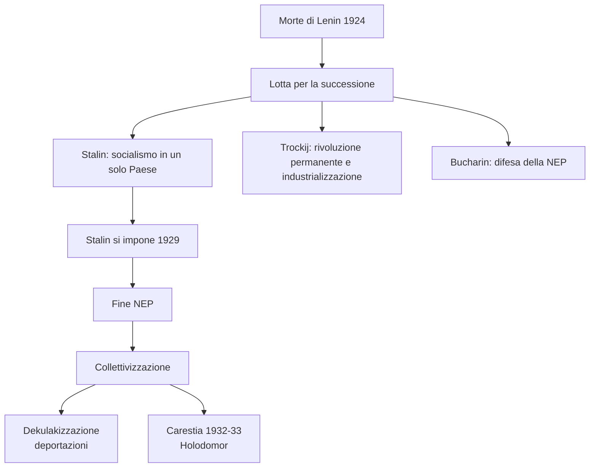

### 1.3 Industrializzazione, Gulag e bilancio del progetto sovietico

Il **primo piano quinquennale** (1929-33) puntò sull'**industria pesante** per fare dell'URSS una potenza moderna. I risultati furono ottenuti con coercizione e lavoro forzato. Il **Gulag** servì a punire e a fornire manodopera per miniere, impianti e grandi opere; tra 1934 e 1941 vi passarono quasi **quattro milioni** di persone. Simboli: **Kolyma**, **Vorkuta**, **Karaganda**, **Solovki**.

### 1.4 Burocrazia, polizia politica e Grande terrore

Il regime si fondò su **burocrazie**, **polizia politica** e **culto della personalità**. Nel 1934 l'NKVD assorbì l'OGPU; l'omicidio di **Sergej Kirov** giustificò purghe contro avversari e sospetti. Nel **1937-38**, **«grande terrore»**, furono colpiti dirigenti, ex kulaki, religiosi, funzionari zaristi e minoranze: **1.575.000 arresti** e **681.692 esecuzioni**.

| Aspetto | Contenuto |
|---------|-----------|
| **Base sociale** | Burocrazie di partito, Stato e polizia |
| **Strumenti** | NKVD, processi pubblici, Gulag |
| **Logica** | Nemici interni, conflitto permanente, guerra futura |
| **Grande terrore** | 1937-38: arresti di massa ed esecuzioni |

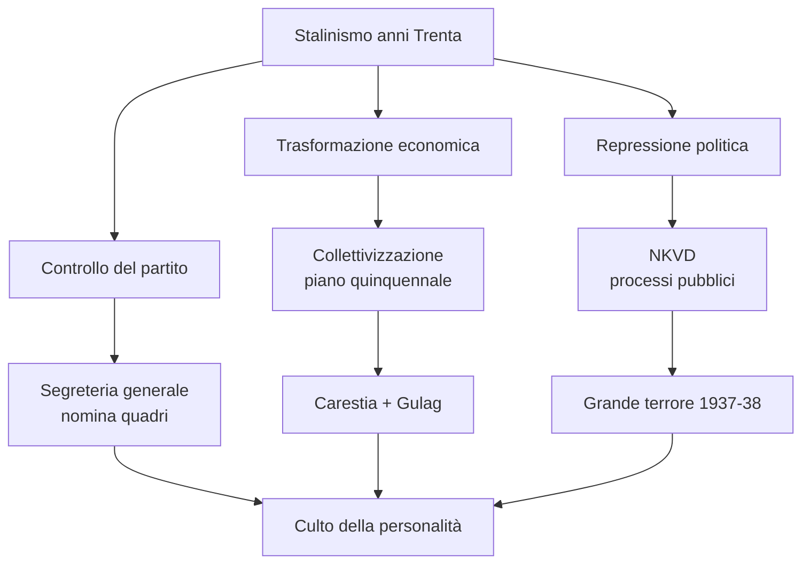

### 1.5 Perché la «grande svolta» fu anche una guerra sociale

La collettivizzazione fu **guerra interna** contro l'autonomia rurale. La categoria elastica di *kulako* colpì contadini solidi, clero e notabili di villaggio. La fame derivò da deportazioni, requisizioni, inefficienza dei *kolchoz* ed estrazione del grano per finanziare l'industria.

### 1.6 Modernizzazione e violenza: il paradosso dello stalinismo

Lo stalinismo accelerò industria, urbanizzazione, alfabetizzazione e infrastrutture; simbolo fu la **metropolitana di Mosca** (1931-35). Il metodo però era militarizzato: obiettivi dall'alto, disciplina forzata, repressione e lavoro coatto.

### 1.7 Stalin nella storiografia

Dopo l'apertura degli archivi, gli storici hanno ridiscusso Stalin. **Oleg V. Chlevnjuk** rifiuta il mito del modernizzatore «necessario»; **Andrea Graziosi** legge il Grande terrore come **«terrore preventivo»**, chirurgia etnico-sociale contro possibili minacce. Stalin ebbe responsabilità criminali personali.

---

## 2. L'Italia fascista: il progetto totalitario negli anni Trenta

### 2.1 La «nuova Italia» del fascismo

Negli anni Trenta il fascismo volle una **«nuova Italia»** mobilitata, obbediente e pronta alla guerra. L'antifascismo fu represso, il PNF controllò carriere e società; nel **1931** solo **dodici** professori rifiutarono il giuramento. L'**OND**, nel PNF dal 1932, organizzava il tempo libero e nel 1936 aveva circa **3 milioni** di iscritti.

### 2.2 Giovani, donne e organizzazioni di massa

L'**ONB** (1926) inquadrava i 6-18 anni; nel 1937 confluì nella **GIL**, obbligatoria dal 1939. I **GUF** formarono studenti e quadri. Le donne furono mobilitate ma non emancipate: **spose e madri**, utili a demografia, assistenza e guerra, ma senza potere decisionale.

### 2.3 Politiche socio-economiche, assistenza e autarchia

La crisi del 1929 spinse lo Stato nell'economia: **IMI** (1931) per finanziare imprese, **IRI** (1933) per salvataggi e gestione. Nel 1940 l'IRI controllava circa **45% dell'acciaio**, **80% della cantieristica navale**, **50% di armi e munizioni**. Era dirigismo autoritario, non socialismo. Assistenza tramite INPS, INAIL, INAM, PNF e **ONMI** legava protezione e obbedienza. L'**autarchia**, rafforzata dopo le sanzioni per l'Etiopia, preparava alla guerra.

### 2.4 Fascistizzazione e consenso

Alla fine del 1939 oltre **21.600.000 italiani** erano in organizzazioni PNF. Nel gennaio 1939 nacque la **Camera dei fasci e delle corporazioni**. La fascistizzazione toccò lingua, saluti e comportamenti. L'**«uomo nuovo»** doveva essere virile, atleta, soldato; il consenso mescolò adesione, propaganda, assistenza, paura e apatia, con crescente disaffezione alla guerra.

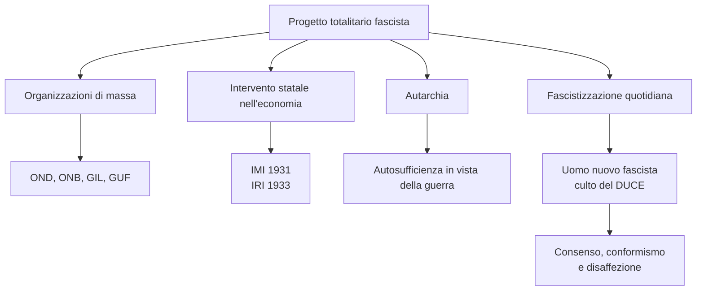

### 2.5 Totalitarismo fascista e controllo della società

Il fascismo voleva produrre italiani educati allo stile del regime. PNF, OND, ONB, GIL e GUF controllavano carriera pubblica, tempo libero, scuola, adolescenza e università.

### 2.6 Il ruolo ambiguo delle donne

Il regime mobilitava le donne per maternità, cura e assistenza: le inseriva nella sfera pubblica per rafforzare l'ordine gerarchico, non per emanciparle.

### 2.7 Stato imprenditore, assistenza e paternalismo

IMI e IRI mostrarono il dirigismo fascista: salvataggio dei settori strategici, proprietà privata e ordine sociale. L'assistenza presentava il regime come protettore in cambio di obbedienza.

### 2.8 Consenso, conformismo e distacco psicologico

Il consenso in dittatura unì propaganda, religione politica, benefici sociali, coercizione e conformismo. Etiopia, Spagna, difficoltà economiche, abusi e inefficienze indebolirono il rapporto tra italiani e regime.

| Strumento | Funzione nel progetto fascista |
|-----------|--------------------------------|
| **PNF** | Controllo politico e carriera pubblica |
| **OND** | Inquadramento del tempo libero |
| **ONB / GIL** | Educazione politica e militare dei giovani |
| **GUF** | Formazione delle élite universitarie |
| **ONMI** | Politica demografica e maternità |
| **IMI / IRI** | Intervento statale nell'economia |
| **Autarchia** | Preparazione economica alla guerra |

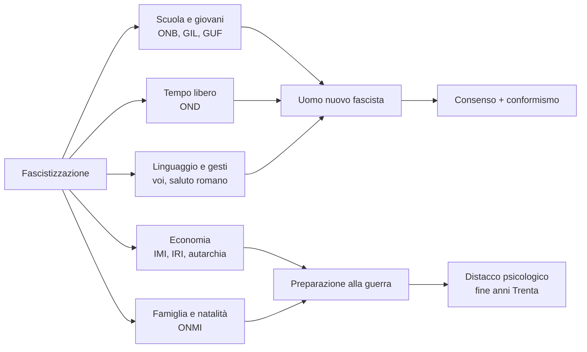

---

## 3. Dall'invasione dell'Etiopia alle leggi antiebraiche

### 3.1 La politica estera aggressiva

Negli anni Trenta il fascismo unì totalitarismo interno, **politica estera aggressiva** e **razzismo**. Mussolini puntava a Mediterraneo e Africa; l'**Etiopia**, indipendente e membro della Società delle Nazioni, rafforzava **Corno d'Africa**, Mar Rosso e rotta verso l'Oceano Indiano.

### 3.2 La guerra d'Etiopia

Il **3 ottobre 1935** l'Italia aggredì l'Etiopia. Le sanzioni della Società delle Nazioni furono deboli e utili alla propaganda autarchica. Mussolini usò grandi mezzi per evitare una nuova **Adua** (1896); il **9 maggio 1936** proclamò l'**Impero**, ma la vittoria creò illusioni sulla forza italiana. Fu una **guerra criminale**: gas, violenze sui civili, repressione, saccheggio di Addis Abeba e massacro di **Debra Libanòs** dopo l'attentato a **Rodolfo Graziani** nel 1937.

### 3.3 Dall'Etiopia alla Spagna: l'Italia alleata minore della Germania

Nel 1936 l'Italia sostenne **Franco** per anticomunismo, affinità ideologica e interessi mediterranei. Il **24 ottobre 1936** nacque l'**Asse Roma-Berlino**: Mussolini si avvicinò a Hitler come **alleato minore**. Nel 1937 l'Italia uscì dalla Società delle Nazioni.

### 3.4 Razzismo coloniale e leggi razziste del 1938

Il fascismo costruì una politica razzista: **«nuova razza»**, apartheid coloniale in Africa orientale, divieto di rapporti coniugali con indigeni, italianizzazione forzata degli slavi. Nel 1937-38 Mussolini promosse l'antisemitismo; il *Manifesto degli scienziati razzisti* lo legò al razzismo biologico. Il **17 novembre 1938** i **«Provvedimenti per la difesa della razza italiana»** esclusero gli ebrei da Stato, PNF, scuola, università, professioni e vietarono matrimoni misti. Il censimento dell'agosto 1938 registrò circa **47.000 ebrei italiani** e **10.000 stranieri**: schedatura di polizia.

| Ambito | Conseguenze delle leggi razziste |
|--------|----------------------------------|
| **Scuola** | Espulsione di studenti e insegnanti ebrei |
| **Stato** | Esclusione da amministrazioni civili e militari |
| **Politica** | Divieto di appartenenza al PNF |
| **Società** | Limitazioni patrimoniali e professionali |
| **Famiglia** | Divieto di matrimoni misti tra ariani ed ebrei |

### 3.5 Etiopia: guerra coloniale e prova di mobilitazione

L'Etiopia servì a unificare l'Africa orientale italiana, testare la mobilitazione e alimentare propaganda autarchica.

### 3.6 Perché la guerra d'Etiopia è definita criminale

È criminale perché aggredì uno Stato sovrano, usò gas e terrore contro civili, continuò dopo l'Impero e culminò nelle stragi di Addis Abeba e **Debra Libanòs**. La «missione civilizzatrice» copriva violenza coloniale.

### 3.7 La scelta antisemita fu autonoma

Le leggi razziste non furono imposizione tedesca: **Mussolini** scelse l'antisemitismo per radicalizzare il totalitarismo e creare un **nemico interno**. Fino al 1943 la persecuzione fu giuridica e sociale; dopo l'8 settembre gli elenchi servirono per arresti e deportazioni.

### 3.8 Reazioni degli italiani alle leggi razziste

Le reazioni andarono da rifiuto e indignazione a conformismo, cinismo e opportunismo: l'esclusione degli ebrei apriva posti, carriere e patrimoni agli «ariani».

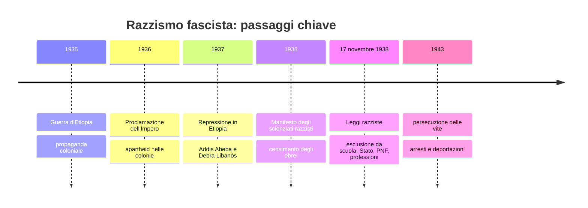

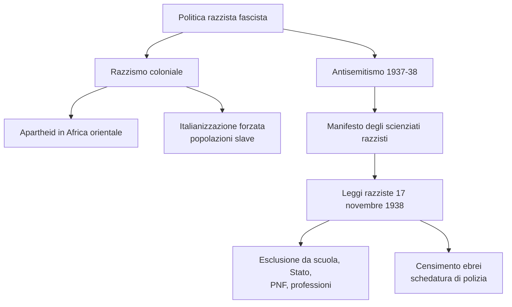

---

## 4. La guerra di Spagna

### 4.1 Dittature e crisi della democrazia europea

Negli anni Venti-Trenta dittature e autoritarismi si diffusero per crisi economica, nazionalismo e antibolscevismo; in Portogallo **Salazar** instaurò nel 1932 l'***Estado Novo***. In Spagna, caduto **Primo de Rivera**, nacque la repubblica (**1931**); nel febbraio **1936** vinse il **Fronte popolare**, mentre destra monarchica, clericale, militare e conservatrice preparò il colpo di Stato.

### 4.2 Il colpo di Stato e l'inizio della guerra civile

Nel luglio **1936** reparti in Marocco si ribellarono. Con **Francisco Franco** si schierarono **Falange**, monarchici, conservatori, Chiesa, borghesia moderata e latifondisti. La repubblica fu difesa da operai, braccianti, borghesie urbane e intellettuali; resistettero Madrid, Barcellona, Valencia e Nord industriale.

### 4.3 Un conflitto internazionale

L'**URSS** aiutò la repubblica ma cercò di egemonizzarla; divisioni tra stalinisti, trozkisti, anarchici e socialisti portarono agli scontri di Barcellona (1937). Hitler e Mussolini sostennero Franco: l'aviazione trasportò truppe coloniali, Mussolini inviò circa **50.000 uomini**, la **Legione Condor** sperimentò bombardamenti terroristici. **Guernica** fu rasa al suolo il **26 aprile 1937**.

### 4.4 Brigate internazionali ed epilogo

Le **Brigate internazionali** riunirono circa **40.000** volontari da cinquanta Paesi; per gli italiani antifascisti valeva lo slogan di Carlo Rosselli: **«Oggi in Spagna, domani in Italia»**. A **Guadalajara** (marzo 1937) i repubblicani batterono le forze di Mussolini. Franco prese Madrid il **28 marzo 1939**; il **1° aprile 1939** vinsero i nazionalisti, rafforzando Hitler e Mussolini.

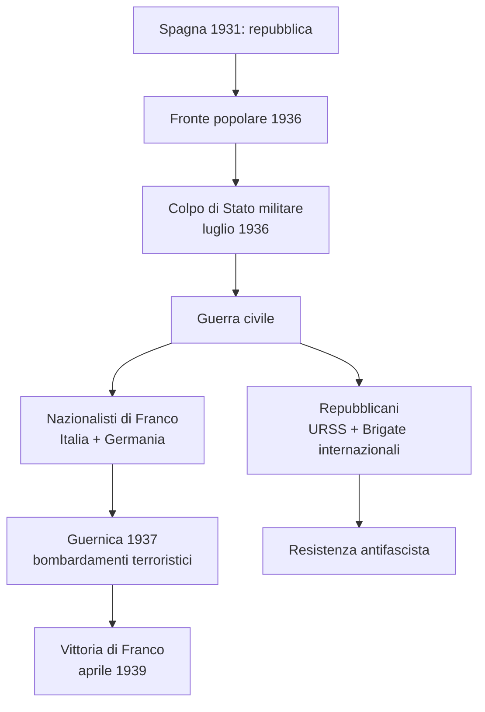

### 4.5 La guerra di Spagna come laboratorio politico e militare

La Spagna fu **laboratorio della guerra europea**: fascismo/antifascismo, intervento straniero, aviazione contro civili, propaganda, volontari. Per l'Italia aveva valore mediterraneo; per Hitler testò armi e aviazione. **Guernica**, resa simbolo da **Pablo Picasso**, mostrò la violenza moderna.

### 4.6 Divisioni interne alla sinistra

L'aiuto sovietico rafforzò gli stalinisti e lo scontro con anarchici, trozkisti e sinistre non allineate. A **Barcellona** nel maggio 1937 il fronte repubblicano si divise mentre i nazionalisti ricevevano aiuti più coerenti.

### 4.7 Valore delle Brigate internazionali

Le Brigate ebbero valore politico e simbolico: fecero della Spagna una battaglia europea e mondiale. Vi passarono **Togliatti**, **Longo**, **Nenni** e **Di Vittorio**.

| Attore | Ruolo nella guerra |
|--------|--------------------|
| **Franco e nazionalisti** | Ribellione militare, Falange, monarchici, clericali |
| **Repubblicani** | Governo legittimo, operai, braccianti, intellettuali |
| **URSS** | Aiuti militari e controllo politico |
| **Italia fascista** | Circa 50.000 uomini, marina e aviazione |
| **Germania nazista** | Armi, aviazione, Legione Condor |
| **Brigate internazionali** | Volontari antifascisti, valore globale |

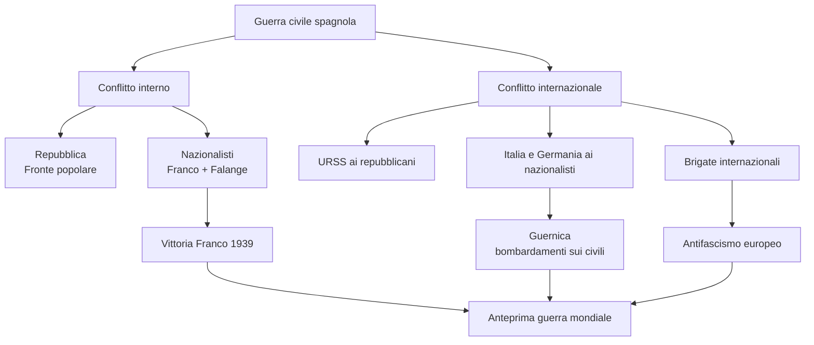

---

## 5. Il revisionismo hitleriano

### 5.1 I Sudeti e la Conferenza di Monaco

Dopo l'Anschluss, Hitler puntò alla **Cecoslovacchia**: rivendicava i **Sudeti** tedeschi, ma mirava a distruggere lo Stato. La Gran Bretagna di **Neville Chamberlain** seguì l'***appeasement***; la Francia dipese da Londra. Il **29 settembre 1938** a **Monaco** Hitler, Mussolini, Chamberlain e Daladier concessero i Sudeti e promisero garanzie a Praga: pace apparente, compromesso provvisorio.

### 5.2 La fine della Cecoslovacchia e la Polonia

Nel **marzo 1939** Hitler violò Monaco: Boemia e Moravia divennero **protettorato** tedesco, la Slovacchia Stato satellite. Poi puntò alla **Polonia**, rivendicando Danzica. Londra e Parigi garantirono Varsavia, ma la diffidenza con Mosca favorì l'intesa Hitler-Stalin.

### 5.3 Il patto Molotov-von Ribbentrop

Il **23 agosto 1939** Germania e URSS firmarono il **Patto Molotov-von Ribbentrop**: protocollo segreto per spartire la **Polonia** e l'Europa orientale. Hitler evitava la guerra su due fronti; Stalin guadagnava tempo e territori. Il **1° settembre 1939** la Germania invase la Polonia con la **guerra-lampo** (*Blitzkrieg*): iniziò la **Seconda guerra mondiale**.

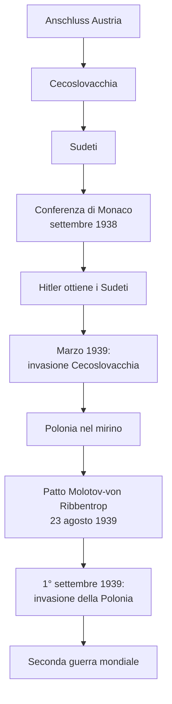

### 5.4 Appeasement: logica diplomatica contro logica hitleriana

L'***appeasement*** nasceva da trauma del 1914-18, paura del comunismo, sottovalutazione di Hitler e fiducia nel compromesso. Ma Hitler usava la politica estera per mobilitare e preparare la violenza: aveva fissato l'attacco a Praga per il **1° ottobre 1938**, poi accettò Monaco perché ottenne i Sudeti senza combattere. Marzo 1939 mostrò il fallimento delle concessioni.

### 5.5 Il ruolo di Mussolini a Monaco

Mussolini apparve mediatore e «salvatore della pace», pur essendo vicino alla Germania. L'accoglienza italiana mostrò che la popolazione preferiva la pace all'epica militarista.

### 5.6 Dalla Cecoslovacchia alla guerra mondiale

L'annessione dell'Austria poteva sembrare riunificazione tedesca; il **protettorato** su Boemia-Moravia mostrò dominio coloniale. La Polonia fu la tappa successiva. Il patto Hitler-Stalin disorientò il comunismo internazionale.

| Tappa | Significato |
|-------|-------------|
| **Sudeti** | Concessione diplomatica a Hitler |
| **Monaco** | Apice dell'appeasement |
| **Boemia-Moravia** | Dominio coloniale tedesco su slavi europei |
| **Polonia** | Obiettivo della guerra-lampo |
| **Patto Molotov-von Ribbentrop** | Spartizione dell'Est e rinvio dello scontro tedesco-sovietico |
| **1° settembre 1939** | Inizio della Seconda guerra mondiale |

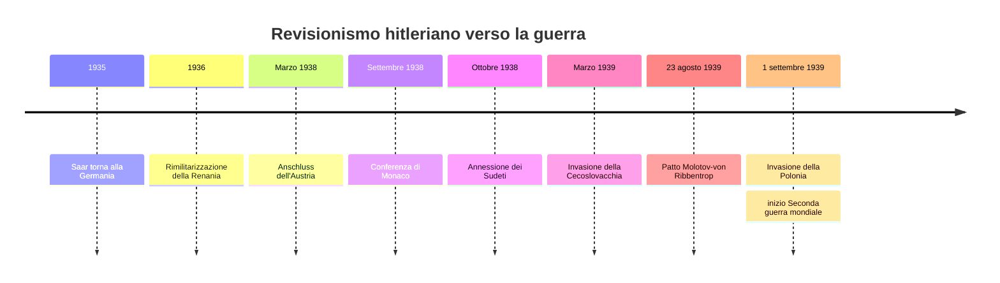

---

## 6. Il Giappone si espande, la Cina si frammenta

### 6.1 Revisionismi in Oriente e autoritarismo giapponese

Anche in Estremo Oriente Versailles fu contestato. Il **Giappone**, rafforzato ma umiliato da parità razziale negata e limiti navali di Washington (1922), scivolò verso autoritarismo, nazionalismo e aggressività per crisi economica, paura del bolscevismo, militari, burocrazia imperiale e *zaibatsu*.

### 6.2 La Cina tra Kuomintang e comunisti

La repubblica cinese del 1912 restò divisa dai **signori della guerra**. Versailles la umiliò perché il Giappone ottenne diritti tedeschi in Cina; il **Movimento del 4 maggio** 1919 unì nazionalismo, antimperialismo e modernizzazione. Nel **1921** Mao Tse-Tung fondò il **Partito comunista cinese**. Dal 1923 i comunisti collaborarono con il **Kuomintang** di Sun Yat-sen; dopo Sun, **Chiang Kai-shek** li represse nel 1927 e riunificò formalmente la Cina nel 1928, ma con governo autoritario e fragile.

### 6.3 Mao, la Manciuria e la lunga marcia

Mao spostò la rivoluzione dai centri operai ai **contadini**. Nel **1931** nacquero la Repubblica sovietica cinese nello **Jiangxi** e l'invasione giapponese della **Manciuria**, poi **Manchiukuò** fantoccio affidato a **Pu Yi**; nel 1933 Tokyo lasciò la Società delle Nazioni. Tra **1934 e 1935** i comunisti compirono la **lunga marcia**, dodicimila chilometri fino allo Shaanxi: disastro militare ma vittoria politica per Mao.

### 6.4 L'invasione della Cina e l'Asse Roma-Berlino-Tokyo

Nel **luglio 1937** il Giappone invase la Cina. Il **massacro di Nanchino**, almeno **300.000 morti** secondo le stime cinesi, simboleggiò la brutalità nipponica, ma la Cina non fu domata. Il progetto era la **«Grande sfera di coprosperità»**: **«Asia agli asiatici»** come propaganda, egemonia giapponese su Cina, Manciuria, Indocina, Filippine e risorse. Seguono **Patto anti-Komintern** (1936) e **Patto Tripartito** (27 settembre 1940), l'**Asse Roma-Berlino-Tokyo**.

| Area | Problema centrale |
|------|-------------------|
| **Giappone** | Revisionismo, autoritarismo, materie prime, spazio imperiale |
| **Cina nazionalista** | Riunificazione fragile sotto Chiang Kai-shek |
| **Cina comunista** | Strategia contadina di Mao e lunga marcia |
| **Manciuria** | Invasione giapponese e Manchiukuò |
| **Asia orientale** | Grande sfera di coprosperità |

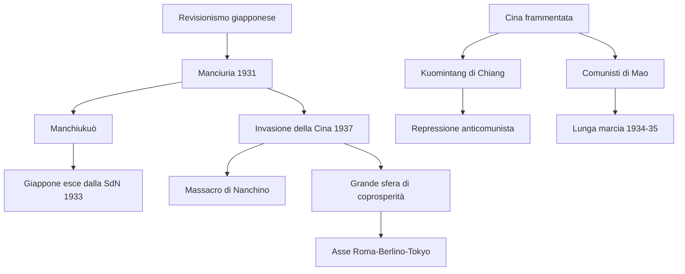

### 6.5 Perché il Giappone si sentì una potenza revisionista

Parità razziale negata e limiti navali alimentarono un sentimento simile alla «vittoria mutilata» italiana. La risposta fu cercare materie prime, mercati protetti e controllo territoriale.

### 6.6 La frammentazione cinese

Signori della guerra e influenza straniera rendevano fragile la repubblica; nazionalismo del 4 maggio e comunismo cinese nacquero anche da questa umiliazione.

### 6.7 La strategia di Mao

Mao adattò il marxismo alla Cina rurale: consenso contadino tramite terre e piccola proprietà. La lunga marcia salvò il gruppo dirigente e rafforzò Mao.

### 6.8 Il progetto giapponese sull'Asia

Manciuria e Manchiukuò davano risorse e controllo sulla Cina settentrionale. La Grande sfera prometteva liberazione dall'Occidente ma costruiva uno spazio controllato da Tokyo.

### 6.9 Verso l'Asse Roma-Berlino-Tokyo

L'espansione giapponese urtava Francia, Gran Bretagna e Stati Uniti, presenti nel Pacifico e fornitori di **petrolio** e **acciaio**. Con Germania e Italia pesavano revisionismo, anticomunismo, militarismo e impero.

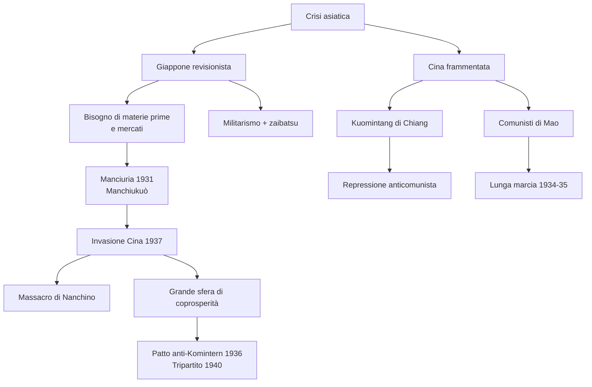

---

## 7. Nodi interpretativi del capitolo

### 7.1 Totalitarismi: somiglianze e differenze

Il capitolo confronta **stalinismo**, **fascismo italiano** e **nazismo tedesco**: capo/partito centrale, propaganda, repressione, mobilitazione, nemico interno, subordinazione dell'individuo, guerra. Differenze: Stalin nasce da rivoluzione comunista ed economia pianificata; Mussolini da nazionalismo anticomunista e proprietà privata; Hitler da razzismo biologico e spazio vitale. **Totalitarismo** indica controllo totale, non identità dei regimi.

### 7.2 Il nemico interno

In URSS i nemici sono *kulaki*, «antisovietici», minoranze, religiosi, ex zaristi e dirigenti sospetti; in Italia antifascisti, slavi ed ebrei; nel nazismo l'ebreo è il nemico assoluto. Funzione: giustificare repressione, compattare, spiegare fallimenti, mantenere mobilitazione e preparare alla violenza.

### 7.3 Modernizzazione autoritaria

Gli anni Trenta mostrano che modernizzazione non significa democrazia: Stalin usa piani, Gulag e terrore; Mussolini dirigismo, organizzazioni e autarchia; il Giappone industria, *zaibatsu* e militarismo.

| Caso | Tipo di modernizzazione | Costo politico e umano |
|------|-------------------------|------------------------|
| **URSS staliniana** | Industrializzazione pianificata, industria pesante, urbanizzazione | Collettivizzazione, carestia, Gulag, Grande terrore |
| **Italia fascista** | Dirigismo, IMI/IRI, organizzazioni di massa, autarchia | Repressione, conformismo, razzismo, guerra |
| **Giappone** | Potenza industriale e militare asiatica | Autoritarismo, militarismo, espansione coloniale |

### 7.4 Guerra e razzismo

I revisionismi vogliono cambiare con la forza l'ordine post-1918: Etiopia = imperialismo e razzismo fascista; nazismo = Austria, Sudeti, Cecoslovacchia, Polonia; Giappone = spazio imperiale e materie prime in Manciuria e Cina.

### 7.5 L'ordine di Versailles in crisi globale

La crisi è globale: Germania, Italia e Giappone contestano Versailles; la Cina subisce umiliazione e frammentazione. La Società delle Nazioni non ferma Etiopia, Manciuria o Hitler, e viene abbandonata dalle potenze aggressive.

### 7.6 Spagna come anteprima della guerra mondiale

La Spagna anticipa fascismo/antifascismo, intervento straniero, bombardamenti sui civili, propaganda, volontari, debolezza democratica e collaborazione Italia-Germania. Franco rafforza Hitler e Mussolini; la sconfitta repubblicana lascia reti antifasciste.

### 7.7 Cina e Giappone: una guerra già mondiale prima del 1939

La guerra mondiale non nasce solo in Europa: Manciuria occupata dal 1931, Cina in guerra dal 1937, interessi di USA, Gran Bretagna e Francia nel Pacifico, dipendenza giapponese da petrolio e acciaio.

### 7.8 Schema generale del capitolo

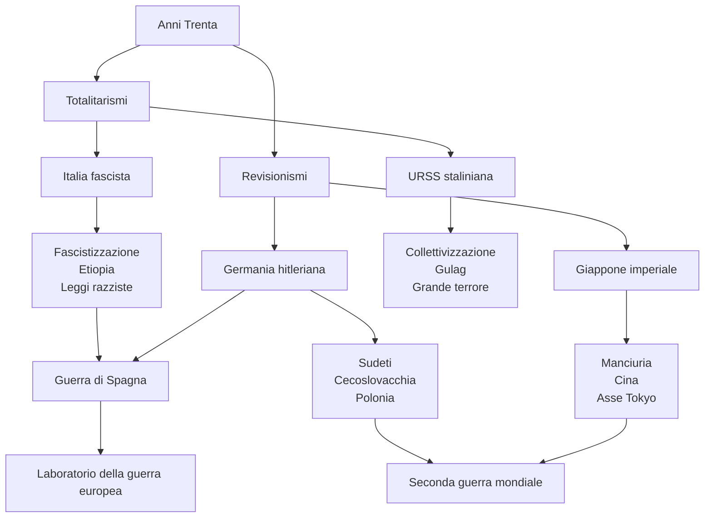

### 7.9 Domande guida per studiare il capitolo

| Domanda | Risposta sintetica |
|---------|--------------------|
| **Perché il 1929 è decisivo per l'URSS?** | Stalin chiude la NEP, avvia collettivizzazione e industrializzazione forzata |
| **Perché l'Holodomor ha carattere repressivo?** | La fame colpisce l'Ucraina, regione ritenuta ostile, e piega la resistenza |
| **Che cosa vuole il fascismo negli anni Trenta?** | Una società fascistizzata, mobilitata e pronta alla guerra |
| **Perché l'Etiopia è importante?** | Prova politica estera aggressiva e razzismo coloniale fascista |
| **Le leggi razziste italiane sono imposte da Hitler?** | No: scelta autonoma di Mussolini per radicalizzare il regime |
| **Perché la Spagna è un conflitto internazionale?** | Intervengono URSS, Italia, Germania e volontari antifascisti stranieri |
| **Perché Monaco fallisce?** | Le concessioni soddisfano solo temporaneamente Hitler |
| **Perché il patto Hitler-Stalin è decisivo?** | Permette alla Germania di attaccare la Polonia senza temere subito l'URSS |
| **Perché il Giappone attacca la Cina?** | Cerca materie prime, territori e dominio sull'Asia orientale |
| **Che cos'è l'Asse Roma-Berlino-Tokyo?** | Alleanza tra tre potenze revisioniste e autoritarie |

## Date fondamentali - Riepilogo cronologico

| Data | Evento |
|---|---|
| **1921** | Fondazione del **Partito comunista cinese** |
| **1924** | Morte di **Lenin** |
| **1929** | Stalin si impone; fine NEP e inizio della «grande svolta» |
| **1931** | Invasione giapponese della **Manciuria**; nascita dell'IMI in Italia |
| **1933** | Nascita dell'**IRI**; il Giappone lascia la Società delle Nazioni |
| **1934-35** | **Lunga marcia** di Mao |
| **3 ottobre 1935** | Attacco italiano all'**Etiopia** |
| **9 maggio 1936** | Proclamazione dell'**Impero** italiano |
| **1936-39** | **Guerra civile spagnola** |
| **24 ottobre 1936** | **Asse Roma-Berlino** |
| **1937-38** | **Grande terrore** in URSS |
| **17 novembre 1938** | **Leggi razziste** in Italia |
| **Settembre 1938** | **Conferenza di Monaco** |
| **Marzo 1939** | Invasione tedesca della **Cecoslovacchia** |
| **23 agosto 1939** | Patto **Molotov-von Ribbentrop** |
| **1° settembre 1939** | Invasione della **Polonia** |
| **27 settembre 1940** | **Patto Tripartito** |
