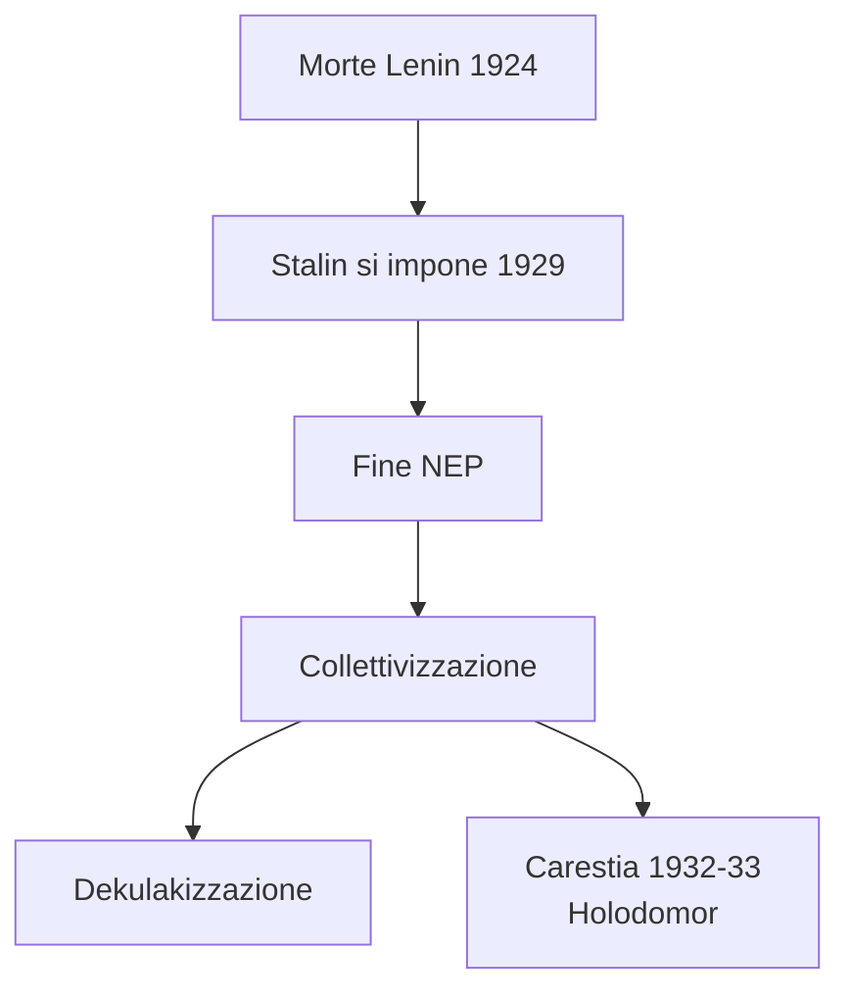
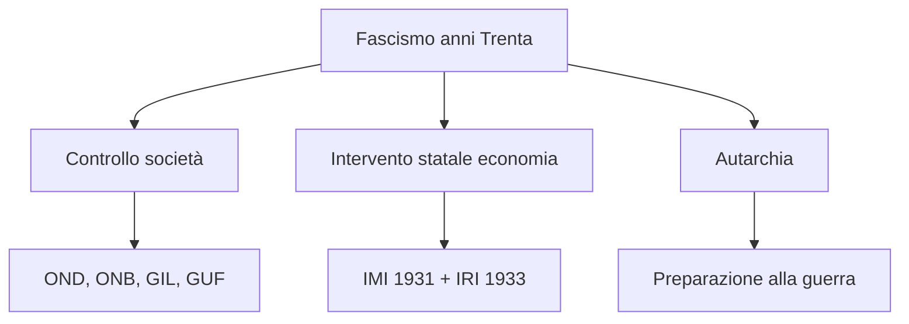
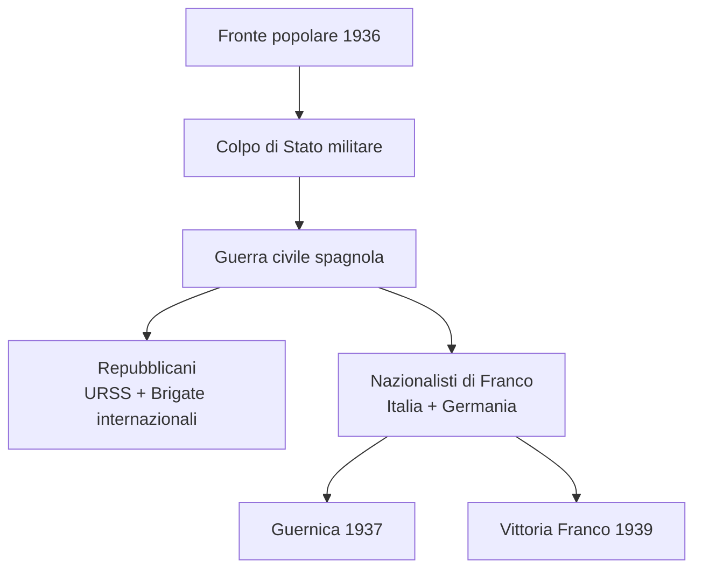
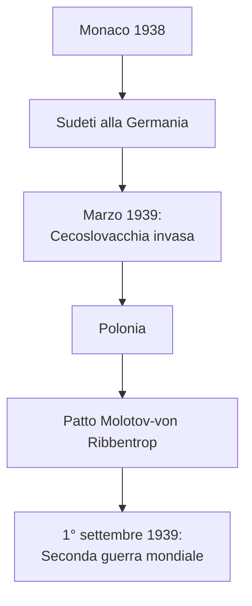
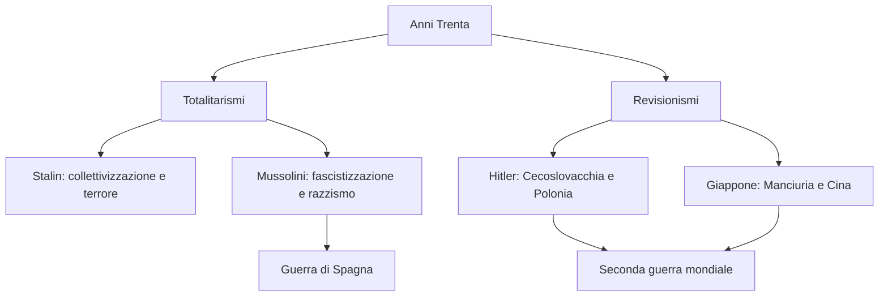

# Schema di Studio - Capitolo 3.12: Anni Trenta: totalitarismi e progetti revisionisti (Riassunto)

---

## Date fondamentali del capitolo

| Anno / Data | Evento |
|-------------|--------|
| **1921** | Mao Tse-Tung fonda il **Partito comunista cinese** |
| **1929** | Stalin è a capo dell'URSS: collettivizzazione e piano quinquennale |
| **3 ottobre 1935** | L'Italia fascista attacca l'**Etiopia** |
| **9 maggio 1936** | Mussolini proclama la nascita dell'**Impero** |
| **1936-39** | **Guerra civile spagnola**, vinta da **Francisco Franco** |
| **1937-38** | **Grande terrore** staliniano |
| **17 novembre 1938** | In Italia vengono promulgate le **leggi razziste** |
| **Settembre 1938** | **Conferenza di Monaco** |
| **23 agosto 1939** | Patto **Molotov-von Ribbentrop** |
| **1° settembre 1939** | Invasione della **Polonia** e inizio della Seconda guerra mondiale |
| **27 settembre 1940** | **Patto Tripartito**: Asse Roma-Berlino-Tokyo |

---

## 1. L'affermazione di Stalin e l'URSS degli anni Trenta

### La successione a Lenin

Dopo la **morte di Lenin** (1924) si aprì la lotta per il potere nel Partito bolscevico. **Stalin**, segretario generale dal 1922, controllava la nomina dei quadri e riuscì a imporsi sugli altri dirigenti. Contro **Trockij**, che voleva rivoluzione permanente e industrializzazione accelerata, Stalin sostenne il **«socialismo in un solo Paese»**. Nel **1929** Trockij fu espulso e Stalin avviò la **«grande svolta»**.

### Collettivizzazione e carestia

La NEP fu chiusa e cominciò la **collettivizzazione** delle campagne. I **kulaki** furono indicati come «nemici di classe» e colpiti dalla **dekulakizzazione**: sequestro dei beni, deportazioni e repressione. I contadini furono costretti a entrare nei **kolchoz**. La crisi agricola e le requisizioni provocarono una carestia devastante. In **Ucraina** morirono circa **3,5 milioni** di persone: l'***Holodomor*** ebbe un carattere repressivo antiucraino.

### Piano quinquennale, Gulag e Grande terrore

Il **piano quinquennale** (1929-33) puntò all'industrializzazione accelerata, soprattutto nell'**industria pesante**. I risultati economici furono importanti, ma ottenuti con costi umani altissimi. Per grandi opere e produzione si ricorse al **lavoro forzato** nei **Gulag**, dove tra 1934 e 1941 passarono quasi **quattro milioni** di persone.

Il regime si fondò su burocrazia, polizia politica e culto di Stalin. Nel **1937-38** il **grande terrore** colpì dirigenti, ex kulaki, religiosi, funzionari zaristi e gruppi nazionali sospetti: **1.575.000 arresti** e **681.692 esecuzioni**.

Il senso complessivo dello stalinismo sta nel rapporto tra modernizzazione e violenza. L'URSS ottenne risultati industriali e poté proporsi come alternativa al capitalismo durante la crisi del 1929, ma lo fece distruggendo l'autonomia delle campagne, usando deportazioni, lavoro forzato e terrore preventivo. La storiografia più recente insiste quindi sia sul contesto sovietico sia sulle responsabilità personali di Stalin.

---

## 2. L'Italia fascista: il progetto totalitario negli anni Trenta

### La «nuova Italia» fascista

Negli anni Trenta il fascismo radicalizzò il progetto totalitario: voleva costruire una **«nuova Italia»**, mobilitata in nome del regime e pronta alla guerra. Il PNF ampliò il controllo sulla società. Nel **1931** fu imposto il giuramento di fedeltà ai professori universitari: solo **dodici** rifiutarono. L'**Opera nazionale dopolavoro** organizzava il tempo libero dei lavoratori e nel 1936 contava circa **3 milioni** di iscritti.

### Giovani, donne e organizzazioni di massa

L'**Opera nazionale balilla** inquadrava bambini e ragazzi; nel 1937 le organizzazioni giovanili confluirono nella **Gioventù italiana del littorio**, obbligatoria dal 1939. I **GUF** coinvolgevano gli universitari. Le associazioni femminili davano alle donne un ruolo pubblico ma subordinato: il regime le voleva soprattutto **spose e madri**.

### Economia, assistenza e autarchia

La crisi del 1929 spinse il regime a rafforzare l'**intervento dello Stato nell'economia**. Nacquero l'**IMI** (1931) e l'**IRI** (1933), che interveniva nei salvataggi industriali. Il fascismo sviluppò anche assistenza sociale e politiche demografiche. Dopo le sanzioni per l'Etiopia fu formalizzata l'**autarchia**, cioè la ricerca di autosufficienza economica in vista della guerra.

### Fascistizzazione e consenso

Nel 1939 oltre **21.600.000 italiani** erano inquadrati in organizzazioni dipendenti dal PNF. Il regime impose modelli quotidiani: «voi», saluto romano, divieto di parole straniere, culto del **DUCE**. L'ideale era l'**«uomo nuovo» fascista**, virile e soldato. Il consenso, però, non fu costante: accanto ad adesione e conformismo crebbero apatia e disaffezione.

La fascistizzazione agiva sia sulle istituzioni sia sulla vita privata: scuola, università, tempo libero, maternità, assistenza, linguaggio e gesti quotidiani. Il consenso era prodotto da propaganda, coercizione, religione politica e benefici assistenziali; proprio per questo non può essere letto come libera adesione. Alla fine degli anni Trenta il regime appariva invecchiato e molti italiani erano sempre meno disponibili a sacrificarsi per la guerra.

---

## 3. Dall'invasione dell'Etiopia alle leggi antiebraiche

### La guerra d'Etiopia

Mussolini puntò all'**Etiopia** per rafforzare la presenza italiana nel Corno d'Africa e nel Mediterraneo. Il **3 ottobre 1935** l'Italia attaccò un Paese indipendente e membro della Società delle Nazioni. Le sanzioni furono deboli e alimentarono la propaganda fascista. Il **9 maggio 1936** Mussolini proclamò l'**Impero**, ma la guerra fu criminale: uso dei gas, violenze contro civili, repressione dopo l'attentato a **Graziani** e massacro di Debra Libanòs.

### L'Italia verso l'alleanza con la Germania

L'intervento nella **guerra civile spagnola** legò sempre di più Mussolini a Hitler. Il **24 ottobre 1936** nacque l'**Asse Roma-Berlino**. L'Italia, pur presentandosi come potenza imperiale, diventava l'**alleato minore** della Germania nazista.

### Razzismo coloniale e antisemitismo

Dopo la proclamazione dell'Impero il regime impose nelle colonie un sistema di ***apartheid***, con separazione tra italiani e indigeni. Il razzismo fascista colpì anche le popolazioni slave sottoposte a italianizzazione forzata.

Nel 1938 Mussolini avviò una campagna antisemita. Il **17 novembre 1938** furono promulgati i **«Provvedimenti per la difesa della razza italiana»**: gli ebrei furono esclusi da scuola, università, amministrazioni, PNF, professioni e molti spazi pubblici. Furono vietati i matrimoni misti.

La scelta antisemita fu autonoma del regime fascista, non una semplice imposizione tedesca. Serviva a radicalizzare il totalitarismo, mantenere mobilitati apparati e masse, e costruire un nuovo **nemico interno**. Il censimento degli ebrei dell'agosto 1938, con circa **47.000 ebrei italiani** e **10.000 stranieri**, fu di fatto una schedatura di polizia: fino al 1943 colpì soprattutto i diritti, poi divenne base per arresti e deportazioni.

| Ambito | Effetto delle leggi razziste |
|--------|------------------------------|
| Scuola | Espulsione di studenti e docenti ebrei |
| Stato | Esclusione dalle amministrazioni |
| Politica | Esclusione dal PNF |
| Società | Restrizioni professionali e patrimoniali |
| Famiglia | Divieto di matrimoni misti |

---

## 4. La guerra di Spagna

### Dalla repubblica alla guerra civile

Nel **1931** la Spagna diventò una repubblica. Alle elezioni del febbraio **1936** vinse il **Fronte popolare**, coalizione di sinistra. La destra monarchica, militare, clericale e conservatrice preparò il colpo di Stato. Nel luglio 1936 reparti dell'esercito in Marocco si ribellarono al governo repubblicano; tra i generali si impose **Francisco Franco**.

### Da guerra civile a conflitto internazionale

La repubblica fu sostenuta da operai, braccianti, borghesie urbane e intellettuali, oltre che dall'**URSS**. I nazionalisti furono sostenuti da **Italia fascista** e **Germania nazista**. Mussolini inviò circa **50.000 uomini**; Hitler sperimentò armi e bombardamenti. Il caso più noto fu **Guernica**, rasa al suolo il **26 aprile 1937**.

### Brigate internazionali ed epilogo

Le **Brigate internazionali** portarono in Spagna circa **40.000** volontari antifascisti. Tra gli italiani divenne celebre lo slogan di Carlo Rosselli: **«Oggi in Spagna, domani in Italia»**. Dopo quasi tre anni di guerra, Franco conquistò Madrid il **28 marzo 1939** e il 1° aprile vinse la guerra. Fu una vittoria anche per Hitler e Mussolini.

La guerra spagnola fu un laboratorio della guerra europea: mostrò l'internazionalizzazione dei conflitti ideologici, la collaborazione militare italo-tedesca e l'uso del bombardamento sui civili. Dentro il fronte repubblicano pesarono anche le divisioni tra stalinisti, anarchici, trozkisti e socialisti, culminate negli scontri di Barcellona del maggio 1937.

---

## 5. Il revisionismo hitleriano

### Monaco e la Cecoslovacchia

Dopo l'Anschluss, Hitler puntò alla **Cecoslovacchia**, rivendicando i **Sudeti**. Gran Bretagna e Francia cercarono di evitare la guerra con l'***appeasement***. Alla **Conferenza di Monaco** (settembre 1938) Hitler ottenne i Sudeti, mentre Chamberlain e Mussolini presentarono l'accordo come una vittoria della pace.

Nel **marzo 1939** Hitler violò l'accordo e invase la Cecoslovacchia. Boemia e Moravia divennero un **protettorato**; la Slovacchia uno Stato satellite.

### Polonia e patto Molotov-von Ribbentrop

Hitler mise poi nel mirino la **Polonia**, soprattutto Danzica. Il **23 agosto 1939** firmò con Stalin il **Patto Molotov-von Ribbentrop**, che prevedeva la non aggressione reciproca e, in un protocollo segreto, la spartizione della Polonia. Il **1° settembre 1939** la Germania invase la Polonia: iniziava la **Seconda guerra mondiale**.

Monaco mostrò i limiti dell'***appeasement***: Gran Bretagna e Francia pensavano ancora in termini di compromesso diplomatico, mentre Hitler usava la politica estera come mobilitazione e violenza. Mussolini apparve come mediatore, ma constatò anche che gli italiani preferivano la pace alla retorica militarista. La distruzione della Cecoslovacchia nel marzo 1939 rivelò definitivamente che le concessioni non fermavano il revisionismo nazista.

---

## 6. Il Giappone si espande, la Cina si frammenta

### Giappone revisionista

Il **Giappone**, prima potenza asiatica, uscì rafforzato dalla Prima guerra mondiale ma si sentì umiliato a Versailles e alla Conferenza navale di Washington del 1922. Le difficoltà economiche e la paura del bolscevismo spinsero il Paese verso un regime autoritario e nazionalista.

### La Cina tra nazionalisti e comunisti

La Cina era frammentata tra governo centrale debole e **signori della guerra**. Nel **1921** Mao Tse-Tung fondò il **Partito comunista cinese**. Inizialmente i comunisti collaborarono con il **Kuomintang**, ma **Chiang Kai-shek** ruppe l'alleanza e nel 1927 scatenò la repressione anticomunista. Mao spostò la rivoluzione nelle campagne e nel **1934-35** guidò la **lunga marcia**, rafforzando il proprio prestigio.

### Manciuria, invasione della Cina e Asse

Nel **1931** il Giappone invase la **Manciuria** e creò lo Stato fantoccio del **Manchiukuò**. Nel **1937** lanciò l'invasione completa della Cina; il **massacro di Nanchino** divenne il simbolo della brutalità nipponica. Il progetto della **«Grande sfera di coprosperità»** mirava a creare un'Asia orientale dominata dal Giappone. Nel **1940** il Patto Tripartito sancì l'**Asse Roma-Berlino-Tokyo**.

Il revisionismo giapponese nasceva dalla delusione per Versailles e per i limiti navali imposti a Washington nel 1922. La formula **«l'Asia agli asiatici»** poteva sembrare anticoloniale, ma copriva un progetto di dominio imperiale. La dipendenza giapponese da petrolio e acciaio importati da Stati Uniti e Impero britannico rendeva inevitabile lo scontro con le potenze occidentali.

---

## 7. Nodi interpretativi

### Totalitarismi e modernizzazione autoritaria

Il capitolo mostra tre modi diversi di combinare dittatura, mobilitazione e modernizzazione. L'URSS staliniana usa la pianificazione per industrializzare il Paese, ma distrugge le campagne e usa Gulag e terrore. L'Italia fascista mantiene proprietà privata e gerarchie sociali, ma vuole creare una società «antropologicamente» fascista attraverso organizzazioni di massa, assistenza, autarchia e culto del DUCE. Il Giappone unisce sviluppo industriale, élite militari e grandi gruppi economici in un progetto imperialista.

| Caso | Obiettivo | Strumenti |
|------|-----------|-----------|
| **URSS** | Industrializzazione socialista | Piano quinquennale, kolchoz, Gulag, terrore |
| **Italia fascista** | «Nuova Italia» pronta alla guerra | PNF, OND, GIL, IMI/IRI, autarchia |
| **Giappone** | Egemonia asiatica | Militarismo, Manciuria, guerra alla Cina |

### Nemico interno e guerra

Tutti i regimi del capitolo costruiscono nemici. Stalin colpisce kulaki, antisovietici e gruppi nazionali sospetti; Mussolini colpisce antifascisti, popolazioni coloniali, slavi ed ebrei; Hitler punta alla distruzione dell'ordine europeo e prepara la guerra razziale. Il nemico interno serve a giustificare repressione, propaganda e mobilitazione.

La guerra è lo sbocco comune: Etiopia, Spagna, Cecoslovacchia, Polonia, Manciuria e Cina sono tappe diverse della crisi dell'ordine nato dopo il 1919. La Società delle Nazioni appare incapace di fermare le aggressioni e le democrazie europee reagiscono tardi.

### Collegamento generale

---

## Date fondamentali - Riepilogo cronologico

| Data | Evento |
|---|---|
| **1921** | Fondazione Partito comunista cinese |
| **1929** | Stalin a capo dell'URSS; collettivizzazione |
| **1931** | Giappone invade la Manciuria |
| **1934-35** | Lunga marcia di Mao |
| **3 ottobre 1935** | Attacco italiano all'Etiopia |
| **9 maggio 1936** | Proclamazione dell'Impero |
| **1936-39** | Guerra civile spagnola |
| **1937-38** | Grande terrore |
| **17 novembre 1938** | Leggi razziste in Italia |
| **23 agosto 1939** | Patto Molotov-von Ribbentrop |
| **1° settembre 1939** | Invasione della Polonia |
| **27 settembre 1940** | Patto Tripartito |
