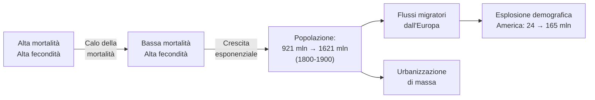
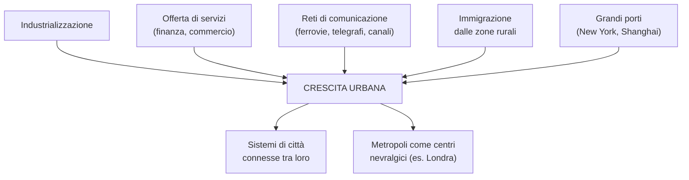
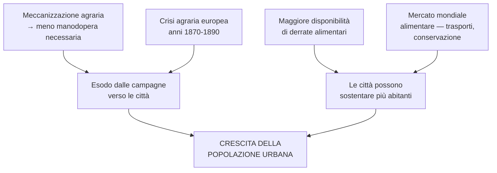
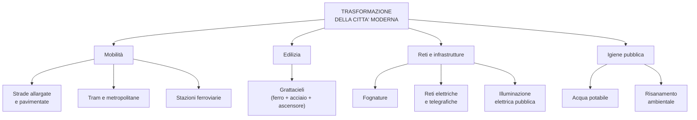
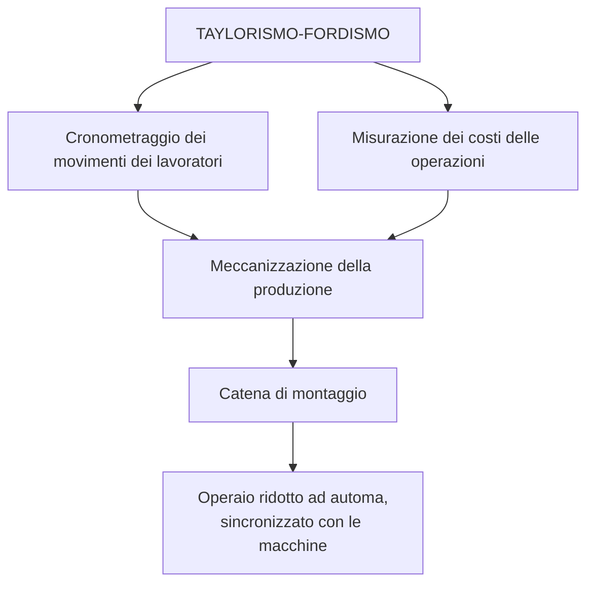
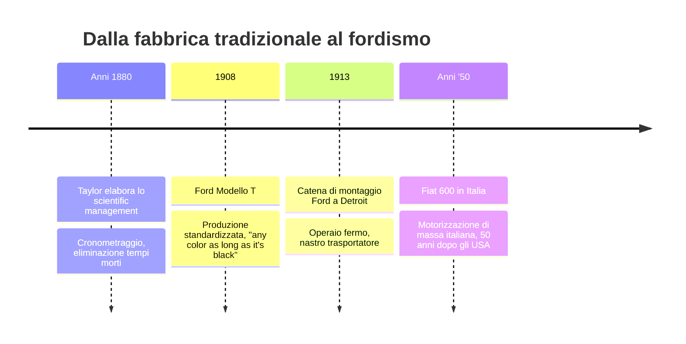
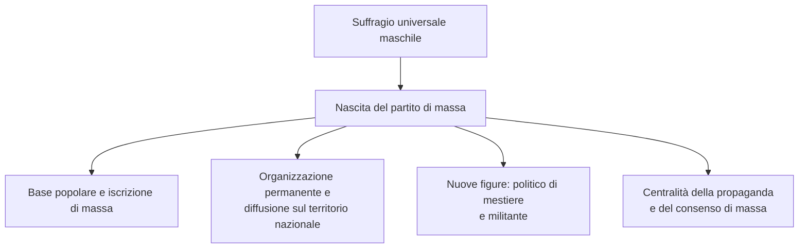
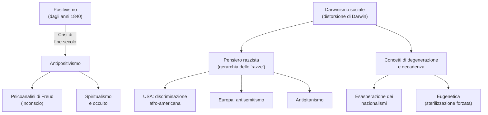
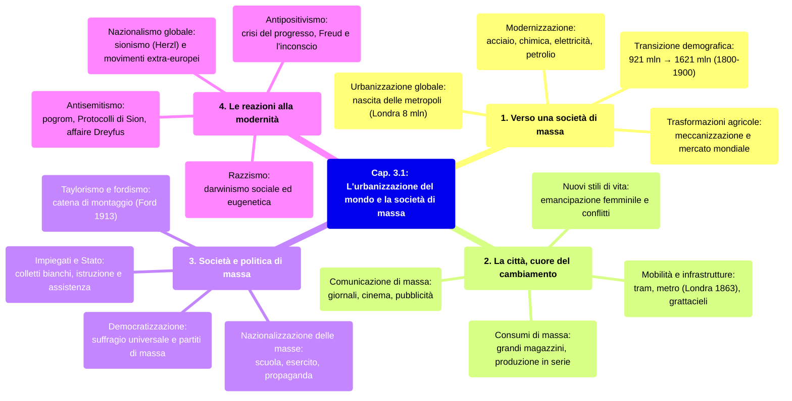

# Ripasso Veloce - Cap. 3.1: Urbanizzazione e società di massa

---

## Date fondamentali

| Anno | Evento |
|:--|:--|
| **1875** | Fondazione **SPD** (primo partito di massa) in Germania |
| **1886** | Manifestazioni di Chicago → origine del **Primo maggio** |
| **1894-1906** | **Affaire Dreyfus**: condanna (1894), riabilitazione (1906) |
| **1900** | Londra raggiunge **8 milioni** di abitanti |
| **1913** | **Catena di montaggio** negli stabilimenti Ford a Detroit |

---

## 1. Verso una società di massa

### Transizione demografica

- Fine '800-inizio '900: industrializzazione in Occidente grazie a **acciaio, chimica, elettricità, petrolio**
- **Transizione demografica**: da alta mortalità/fecondità a bassa mortalità → crescita esponenziale
- Driver principale: **calo della mortalità infantile**
- **1900**: 1,5 miliardi di esseri umani (+50% in un secolo)
- Europa: da 195 mln (1800) a 420 mln (1900)
- **Flussi migratori** verso le Americhe: da 24 a 165 mln nell'Ottocento
- Nasce la **società di massa**

### Urbanizzazione e metropoli

- Urbanizzazione su scala planetaria; popolazione urbana supera rurale solo nel **XXI secolo**
- Londra: 2,5 mln (1850) → 8 mln (1900). Parigi 1 mln nel 1850, poi New York (1857), Vienna (1870)
- Tasso urbanizzazione globale: **12% → 20%** tra 1870-1900
- **1850-1910**: più alto tasso di crescita urbana nella storia europea
- Non solo industrializzazione: crescevano di più le città con **servizi, finanza, commercio, reti di comunicazione**
- Londra = capitale mondiale della finanza, non città industriale
- Città portuali (New York, Shanghai) in crescita rapidissima
- Sistemi di **città connesse** con una metropoli come centro nevralgico

### Chicago

- Da 350 abitanti (1833) a 1.698.000 (1900)
- **Snodo centrale**: collegava costa atlantica, Grandi Laghi, Mississippi
- Nel 1850 già principale centro ferroviario USA

### Trasformazioni agricole → urbanizzazione

1. **Meccanizzazione agraria** → meno manodopera → esodo verso le città
2. **Più derrate alimentari** → le città sostentano più abitanti
3. **Mercato mondiale alimentare** (trasporti, conservazione)
4. **Crisi agraria europea** (1870-1890) → emigrazione rurale

---

## 2. La città, cuore del cambiamento

### Mobilità e trasformazione urbanistica

- Reti di **trasporti pubblici**: tram e metropolitane (prima: Londra, 1863)
- Strade allargate, ferrovie, gallerie sotterranee, grandi stazioni
- Reti di fognature, elettricità, telegrafo
- **Grattacieli** (da Chicago, 1885): resi possibili da ferro, acciaio, ascensore
- **Illuminazione elettrica** → dilatazione del tempo urbano
- Questioni sanitarie → **acqua potabile e fognature** come requisiti minimi

### Stratificazione sociale ed etnica

- **Progettazione funzionale**: zone per funzione (residenziali, affari, verde) e per ceto sociale
- **Stratificazione etnica**: nella Ruhr i polacchi da 30.000 a 400.000 (1890-1913); nelle città USA immigrati fino al 50%, con quartieri per nazionalità

### Consumi di massa e comunicazione

- **Produzione in serie** → prezzi più bassi → consumi di massa
- **Grandi magazzini**: promuovono stili di vita, stimolano consumi
- **Pubblicità** pianificata: cartelloni, manifesti, insegne luminose → nasce il **consumismo**
- **Comunicazione di massa**: giornali con grandi tirature, radio, musei, teatro, cinema accessibili a tutti

### Emancipazione femminile e conflitti

- Cresce l'**istruzione femminile**, prime studentesse in università, accesso alle professioni
- Lotta per il **diritto di voto**: primo comitato a Manchester (1865), termine "**suffragette**"
- Tensioni da **conflitti sociali** e **xenofobia** per l'immigrazione di massa
- **USA**: discriminazione razziale verso afro-americani (leggi nel Sud, ghetti al Nord); abolizione schiavitù (1865) ma **segregazione** ristabilita a livello locale

---

## 3. Società e politica di massa

### Taylorismo e catena di montaggio

- **Taylor** (anni 1880): *scientific management* → analisi e cronometraggio dei movimenti, misurazione costi, eliminazione tempi morti. L'operaio diventa **automa** sincronizzato con le macchine
- **Ford**: catena di montaggio (1913) → componenti su nastro trasportatore, operaio ripete stesso gesto
- **Ford Modello T** (dal 1908): *"any color, as long as it's black"* → standardizzazione abbatte costi
- Equivalente italiano 50 anni dopo: **Fiat 600** (anni '50)

### Impiegati e intervento pubblico

- Aumento massiccio degli **impiegati** (settore privato e pubblico): i "**colletti bianchi**"
- Lo Stato assunse nuove funzioni: **assistenza** (ospedali), **istruzione** pubblica, **legislazione sociale** (orari, infortuni, pensioni, sindacati)

### Suffragio universale

- Movimento di **democratizzazione** inesorabile
- Francia: suffragio maschile dal 1848 (ma fittizio sotto Napoleone III fino al 1870)
- Voto donne: in gran parte dei Paesi solo **dopo la Prima** (GB, USA) o **Seconda guerra mondiale** (Italia 1945, Francia 1945)

### Il partito di massa

- Suffragio allargato → nasce il **partito di massa**: base popolare, organizzazione permanente in **sezioni**, congressi
- Primo esempio: **SPD** (1875) in Germania
- Nuove figure: **politico di mestiere** e **militante politico**
- Partito come riferimento culturale e sociale per la classe operaia
- Crescita dei **sindacati** ("rossi" e "bianchi"/cattolici)
- **Propaganda**: giornali, volantini, manifesti, comizi di piazza
- "**Nazionalizzazione delle masse**" (George L. Mosse): inserire le masse nel sistema attraverso **scuola**, **esercito**, simboli e riti mutuati dalle religioni

---

## 4. Le reazioni alla modernità

### Antipositivismo e darwinismo sociale

- Crisi del **positivismo** a fine '800: la scienza non spiega la coscienza
- **Psicoanalisi** di **Freud**: introduce l'**inconscio**
- **Darwinismo sociale**: distorsione di Darwin → vita come **competizione tra individui/nazioni**
- Concetti di **degenerazione** e **decadenza** → esasperazione dei nazionalismi e pensiero razzista
- **Teorie razziste**: "razze" ordinate gerarchicamente (la genetica ha provato che **le razze non esistono**)
- **Eugenetica**: sterilizzazione forzata dei "degenerati"
- Nelle colonie: azioni di **sterminio** (herero e nama nell'Africa del Sud-Ovest tedesca)

### Antisemitismo e affaire Dreyfus

- In Europa il razzismo si espresse soprattutto come **antisemitismo** e **antigitanismo**
- Antisemitismo condensava: ossessione della purezza, accuse di deicidio/usura, rifiuto dell'alterità, teorie cospirative → l'ebreo come "**nemico interno**"
- ***Protocolli dei savi di Sion***: **falso** scritto a Parigi (1897-98) su commissione della polizia zarista, pubblicato 1903, svelato dal "Times" nel 1921
- **Affaire Dreyfus** (Francia): ufficiale ebreo condannato ingiustamente (1894), opinione pubblica divisa tra dreyfusardi e antidreyfusardi, **Zola** pubblica *J'accuse* (1898), **Dreyfus riabilitato** (1906)
- Impero russo: **pogrom** = violenze antisemite di massa, spesso con appoggio delle autorità zariste

### Nazionalismo aggressivo e sionismo

- **Nazionalismo etnico**: coesione nazionale come legame di sangue, nazione come organismo in competizione
- Idea di nazione **escludente**: minoranze = nemiche dell'unità nazionale
- **Sionismo**: **Theodor Herzl** (1860-1904) propone uno **Stato ebraico in Palestina**; primi flussi migratori dall'Est europeo negli anni 1880
- Nazionalismo come **ideologia globale** prima del 1914: movimenti in Egitto, India, Indocina, Sud Africa; rivoluzioni dei Giovani turchi (1908) e cinese (1911)

---

## Chicago: approfondimento

- **Snodo** tra Est e Ovest USA, più grande mercato di prodotti agricoli
- **Stock Yards** (1865): macelli industriali su scala enorme → "catena di smontaggio" degli animali, **modello per Ford**
- Nel 1910 oltre 2/3 della popolazione era di **immigrati** di prima/seconda generazione
- **Maggio 1886**: manifestazioni e repressione → origine del **Primo maggio**
- **Incendio 1871** → rinascita: primo **grattacielo** (1885), rete tramviaria più estesa al mondo

---

## Mappa concettuale di sintesi

