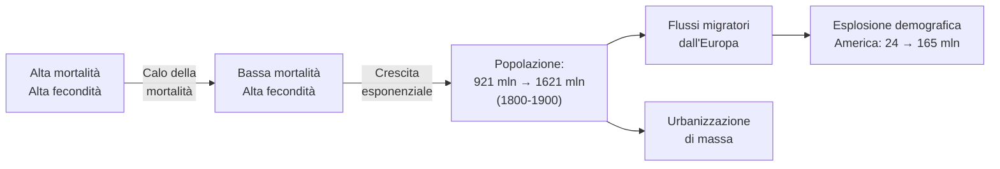
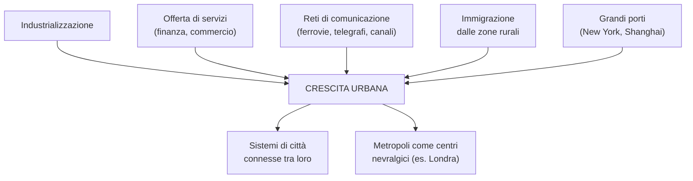
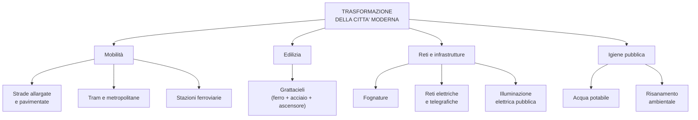
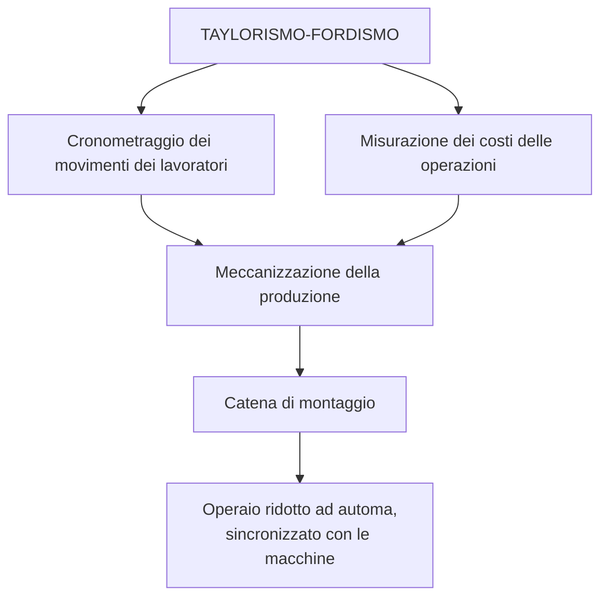
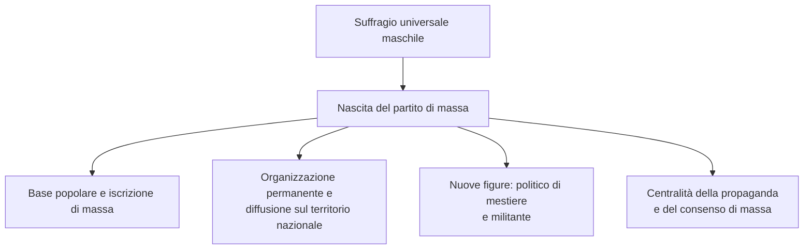
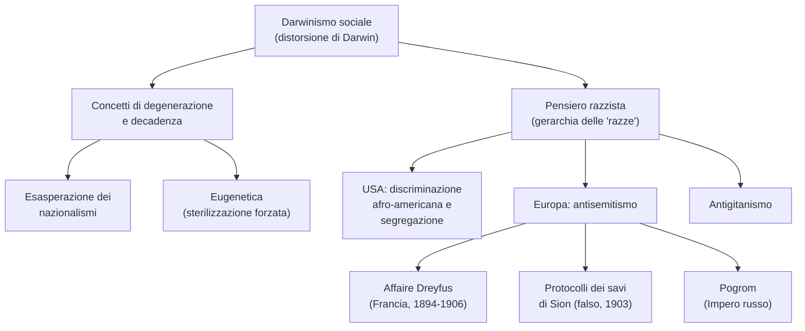
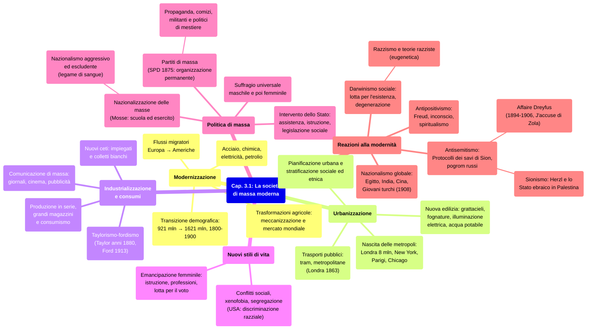

# Schema di Studio - Capitolo 3.1: L'urbanizzazione del mondo e la società di massa

> [!note] Dalla lezione
> Il prof sottolinea che questo è un capitolo **discorsivo**, non basato su date, eventi o personaggi specifici. Lo definisce "sintetico ma allo stesso tempo ricco e chiaro" su questi argomenti (urbanizzazione e società di massa).

---

## Date fondamentali

| Anno                      | Evento                                                                                                                                                                              |
| :------------------------ | :---------------------------------------------------------------------------------------------------------------------------------------------------------------------------------- |
| **1850**                  | **Parigi** raggiunge un milione di abitanti (seconda città dopo Londra)                                                                                                             |
| **1860**                  | A **Londra** iniziano i lavori per la **metropolitana**, primo sistema di trasporto sotterraneo al mondo                                                                            |
| **1865**                  | A **Manchester** viene fondato il primo comitato per il **suffragio femminile**                                                                                                     |
| **1865**                  | Apertura degli **Stock Yards** (macelli industriali) a **Chicago**                                                                                                                  |
| **1871**                  | Chicago devastata da un terribile **incendio**; ricostruita nei due decenni successivi                                                                                              |
| **1875**                  | In **Germania** viene fondato il **Partito socialdemocratico tedesco** (SPD), primo partito di massa                                                                                |
| **1885**                  | Inaugurazione del **primo grattacielo** a Chicago                                                                                                                                   |
| **Anni '80 del XIX sec.** | **Frederick W. Taylor** elabora lo *scientific management*                                                                                                                          |
| **1886**                  | A Chicago, manifestazioni e repressione di maggio: origine della celebrazione del **Primo maggio** come festa internazionale dei lavoratori (ricordata per la prima volta nel 1890) |
| **1894**                  | L'ufficiale ebreo **Alfred Dreyfus** viene condannato con accusa infondata di spionaggio                                                                                            |
| **1897-1898**             | Scrittura dei *Protocolli dei savi di Sion* (falso, svelato dal «Times» nel 1921)                                                                                                   |
| **1900**                  | **Londra** raggiunge **otto milioni di abitanti**                                                                                                                                   |
| **1903**                  | Pubblicazione dei *Protocolli dei savi di Sion*                                                                                                                                     |
| **1906**                  | **Dreyfus** viene pienamente riabilitato                                                                                                                                            |
| **1913**                  | La **catena di montaggio** viene introdotta negli stabilimenti **Ford** a Detroit                                                                                                   |

---

## 1. Verso una società di massa

### Le nuove forme della società e la transizione demografica

Tra gli ultimi decenni dell'Ottocento e l'inizio del Novecento iniziò un processo di radicale cambiamento della struttura sociale. Questo processo, destinato a estendersi all'intero pianeta nel corso del XX secolo, riguardava in origine prevalentemente l'**Occidente europeo** e gli **Stati Uniti**, dove si era diffusa l'**industrializzazione** grazie a nuove scoperte scientifiche, nuove tecnologie e nuove fonti di energia, sintetizzate dalla triade **acciaio, chimica, elettricità** (a cui si sarebbe aggiunto il petrolio).

Già alla metà del Settecento era iniziata una dinamica demografica fondamentale, la cosiddetta **transizione demografica**. Grazie a una significativa **diminuzione dei tassi di mortalità**, a fronte di tassi di fecondità ancora alti, la popolazione del pianeta cominciò a **crescere in modo esponenziale**. [Lezione] Il prof precisa che a fare la differenza non fu un generico calo della mortalità, ma specificamente il **calo della mortalità infantile** (sotto i 5-10 anni di età): "sono molto di più i bambini che sopravvivono" — è questo il driver specifico dell'esplosione demografica tra '800 e '900: secondo le stime, nel **1900** il pianeta era abitato da **1,5 miliardi** di esseri umani, almeno il 50% in più rispetto a un secolo prima. L'**Asia** era il continente più popoloso con circa **900 milioni** di abitanti nel 1900, ma la popolazione europea (compreso l'Impero russo) era cresciuta a un ritmo maggiore, passando da circa **160-170 milioni** a metà Settecento a **195 milioni** nel 1800, fino a oltre **420 milioni** nel 1900.

Attraverso massicci **flussi migratori** in partenza dall'Europa, questa crescita contribuì anche all'esplosione demografica del **continente americano**, che nel corso dell'Ottocento passò da **24 a 165 milioni** di abitanti. Si aprì quindi una fase storica in cui la moltitudine, la cosiddetta "massa" della popolazione, acquisì un inedito ruolo sociale e politico: la **società diventava di massa** e iniziava a delinearsi come **moderna**.

> **Transizione demografica**: processo consistente nel passaggio da una situazione caratterizzata da alti tassi di fecondità e mortalità a una situazione in cui entrambi questi indicatori sono bassi.

### Popolazione dei continenti nel XIX secolo (milioni di persone)

| Continente | 1800 | 1850 | 1900 |
|:---|:---:|:---:|:---:|
| Asia | 600 | 750 | 900 |
| Europa e Impero russo | 195 | 280 | 420 |
| Africa | 100 | 100 | 130 |
| America | 24 | 60 | 165 |
| Oceania | 2 | 2 | 6 |
| **Mondo** | **921** | **1192** | **1621** |

Il maggiore incremento demografico riguardò il **continente americano**, la cui popolazione aumentò di quasi sette volte in un secolo. A seguire l'**Oceania**, che passò da 2 milioni (1800 e 1850) a 6 milioni nel 1900. *(Fonte: M. Livi Bacci, Storia minima della popolazione del mondo, il Mulino, Bologna 2005, p. 45)*

---

### Città, modernità e società di massa

Nel secondo Ottocento si registrò l'inizio di un processo di **urbanizzazione su scala planetaria**, destinato a far superare alla popolazione urbana quella delle aree rurali solo nei primi anni del **XXI secolo**. Si trattò di un **processo di lungo periodo**: negli anni qui considerati la maggioranza della popolazione mondiale restava ancora rurale. In **Italia**, per esempio, l'inversione di questo rapporto avvenne solo **dopo la Seconda guerra mondiale**.

Nondimeno, a partire dagli ultimi decenni dell'Ottocento, urbanizzazione, modernizzazione e società di massa furono **fenomeni interconnessi** che si alimentarono reciprocamente. I processi di modernizzazione trovarono nella città il loro habitat naturale, tanto da favorire l'**identificazione tra città e modernità**. Fu nelle grandi città che si formò la società di massa, che con il tempo avrebbe determinato cambiamenti profondi anche negli ambienti rurali.

### Le metropoli moderne

La città moderna per antonomasia è la grande città. Fin dall'antichità sono esistite città di ingenti dimensioni, ma la storia delle **metropoli moderne** ebbe inizio nei primi anni del XIX secolo, quando **Londra** raggiunse il milione di abitanti (nel **1850** arrivò a due milioni e mezzo, nel **1900** a otto milioni). Intorno al **1850** fu **Parigi** a superare il milione, nel **1857** **New York** e nel **1870** **Vienna**.

Tra il **1870** e il **1900** il tasso di urbanizzazione globale passò dal **12% al 20%**. A crescere erano soprattutto le metropoli, le città che superavano il milione di abitanti e che si trovavano nelle zone più **industrializzate** del pianeta.

**Città con oltre un milione di abitanti nel 1900:**

- **Americhe**: Chicago, New York, Filadelfia, Boston, Rio de Janeiro, Buenos Aires
- **Europa**: Glasgow, Londra, Parigi, Berlino, Vienna, San Pietroburgo, Mosca, Istanbul
- **Asia**: Pechino, Shanghai, Tokyo, Bombay, Calcutta

Oltre a queste, altre sette entrarono nel Novecento con oltre un milione di abitanti: **Berlino, San Pietroburgo, Mosca, Chicago, Filadelfia, Tokyo e Calcutta**. Nel **1913** si aggiunsero **Manchester, Birmingham, Glasgow, Istanbul, Amburgo, Budapest e Liverpool**. Tra il **1850** e il **1910** fu registrato il **piu alto tasso di crescita urbana** della storia europea. Il fenomeno dell'urbanizzazione, pur avendo in Europa il suo epicentro, si estese **su scala mondiale**.

---

### Le cause dell'urbanizzazione

Sebbene il nesso con l'industrializzazione possa apparire diretto, da sola essa non bastava a determinare l'espansione urbana. A crescere piu rapidamente nel secondo Ottocento furono le città in grado di offrire un'ampia gamma di **servizi** o di attivare **reti commerciali e di comunicazione**. Lo sviluppo di **Londra** nel XIX secolo, ad esempio, non dipese dalla presenza di attività manifatturiere, ma dal dinamismo della capitale britannica come **sede finanziaria, centro di commercio mondiale e snodo ferroviario**. [Lezione] Il prof insiste su questo punto: Londra NON era una città industriale, non era sede di "mastodontiche industrie", bensì era ancora all'inizio del XX secolo la **capitale mondiale della finanza e del commercio** — un caso emblematico di metropoli cresciuta grazie ai servizi e non alla manifattura.

Nelle grandi città si concentravano conoscenze, informazioni, innovazioni tecnologiche, relazioni, occasioni di mobilità spaziale e sociale: tutte risorse che procuravano lavoro e opportunità e che richiamavano una forte **immigrazione dalle zone rurali**. A contraddistinguere l'urbanizzazione fu anche la nascita di **sistemi di città connesse reciprocamente**, grazie allo sviluppo delle reti di comunicazione (ferrovie, canali fluviali, linee telegrafiche, navigazione marittima). Da una parte si ristrutturavano i sistemi di relazione tra centri urbani a livello regionale o nazionale; dall'altra si formavano reti di città di estensione internazionale in cui una **metropoli esercitava la funzione di centro nevralgico** (come Londra nei confronti dell'Impero coloniale britannico e dei flussi commerciali globali).

Le città che ospitavano **grandi porti** divennero snodi decisivi e conobbero le piu rapide crescite: il caso piu evidente è quello di **New York** nel corso dell'Ottocento, mentre in Cina lo sviluppo di **Shanghai** e **Hong Kong** si legò a una rete di scambi transoceanici.

> [!note] Dalla lezione
> **Milano come unica vera metropoli italiana, ieri e oggi.** Il prof sottolinea che tra le grandi metropoli della modernità non compare nessuna città italiana: l'unica che poteva ambire a diventare metropoli nel senso moderno del termine era **Milano**, e lo è ancora adesso. Applicando i criteri del libro — "a crescere più rapidamente furono le città in grado di offrire un'ampia gamma di servizi e di attivare reti commerciali e di comunicazione" — ancora oggi è Milano che più delle altre città italiane offre questi vantaggi: sede delle più importanti **banche** del Paese, sede della **Borsa italiana** (non Roma), principale **snodo ferroviario e autostradale**, hub di istruzione e lavoro. Ma tutto questo ha un costo: il **costo della vita più alto d'Italia**, definito dal prof "esorbitante". Quello che Milano è per l'Italia, lo erano Londra, New York, Chicago, Parigi, Berlino e Vienna per i rispettivi paesi.

### Il caso di Chicago

Un caso di eclatante crescita urbana fu quello di **Chicago**: fondata nel **1803**, nel **1833** contava appena **350 abitanti**; la sua popolazione salì a **30.000** nel 1850, a **334.000** nel 1871, a **1.100.000** nel 1890, a **1.698.000** nel 1900. Questo strabiliante sviluppo derivò principalmente dalla sua collocazione in un **punto centrale per le comunicazioni e gli scambi commerciali**: Chicago collegava, attraverso una estesa rete di canali navigabili, la costa atlantica, la regione dei Grandi Laghi e la pianura del Mississippi; successivamente divenne il punto d'incontro fra Est e Ovest per mezzo della ferrovia (nel **1850** era già il principale centro ferroviario del Paese).

---

### Le trasformazioni nel settore agricolo

A contribuire alla crescita della popolazione urbana fu in primo luogo l'**aumento generale della popolazione**. In secondo luogo, furono cruciali le trasformazioni avvenute nel settore agricolo nel corso del XIX secolo. Quattro fattori principali operarono in questa direzione:

1. L'**aumento della produttività agricola**, dovuto al miglioramento delle tecniche di coltivazione e alla progressiva introduzione di macchinari (la cosiddetta **meccanizzazione agraria**), diminuì la richiesta di manodopera, cosicché sempre piu lavoratori agricoli abbandonarono le campagne.
2. Quote maggiori di popolazione potevano vivere in città grazie all'**aumentata disponibilità di derrate alimentari** (lo sviluppo di grandi città, a sua volta, stimolò l'incremento della produttività nelle campagne, come nel caso di Londra).
3. Lo **sviluppo di un mercato mondiale di prodotti alimentari**, grazie al miglioramento dei trasporti e delle tecniche di conservazione, contribuì al superamento della dipendenza dei centri urbani dalle campagne piu vicine.
4. La **crisi agraria** che colpì l'Europa tra gli anni Settanta e Novanta dell'Ottocento incentivò l'emigrazione dalle zone rurali; i **flussi migratori** si diressero prevalentemente verso le città.

> **Produttività**: rapporto tra la quantità (o il costo) di uno o piu fattori impiegati nella produzione e il risultato finale, ovvero la quantità di bene prodotta (o il suo valore). Piu alta è la produttività, minori sono le risorse usate per raggiungere una certa quantità di produzione.

### La popolazione urbana in Europa nel XIX e XX secolo (% rispetto al totale)

| Paese | 1800 | 1850 | 1910 | 1950 | 1980 |
|:---|:---:|:---:|:---:|:---:|:---:|
| Europa | 12 | 19 | 41 | 51 | 66 |
| Regno Unito | 23 | 45 | 75 | 83 | 79 |
| Francia | 12 | 19 | 38 | 48 | 69 |
| Germania | 9 | 15 | 49 | 53 | 75 |
| Olanda | 37 | 39 | 53 | 75 | 82 |
| Spagna | 18 | 18 | 38 | 55 | 73 |
| Russia/URSS | 6 | 7 | 14 | 34 | 61 |
| Italia | 18 | 23 | 40 | 56 | 65 |

*Nota: calcolata sulla popolazione residente in centri con piu di 5000 abitanti. (Fonte: C. Zimmermann, L'era delle metropoli, il Mulino, Bologna 2004, p. 13)*

---

### Le "domande degli storici": che cosa rende moderna una società?

Lo storico inglese **Norman Davies** (1939) ha descritto la modernizzazione come una complessa **catena di mutamenti** che dalla sfera economica si allarga progressivamente a quella sociale: dall'introduzione di macchinari agricoli all'abolizione della servitù della gleba, all'impiego di fonti di energia alternative al carbone, al miglioramento dei trasporti e delle comunicazioni, all'aumento degli investimenti di capitale, alla crescita dei mercati interni, fino allo sviluppo del commercio estero. L'incremento demografico e l'urbanizzazione determinano la nascita di nuove classi sociali, l'aumento dei flussi migratori e la creazione dei partiti politici, nonché la diffusione di nuove forme di informazione, svago e divertimento.

L'insieme di queste trasformazioni è ciò che gli storici definiscono **modernizzazione**. Davies sottolinea che tale espressione non deve essere intesa come la semplice somma di questi mutamenti, bensì come il **motore** che li ha innescati.

La maggioranza degli storici concorda nel ritenere che l'**ampiezza dei processi di modernizzazione** sia il tratto distintivo dell'**età contemporanea**. Tuttavia, **Silvio Lanaro** (1942-2013) ha rilevato una contraddizione linguistica: se è la modernizzazione a innervare l'età contemporanea, perché quest'ultima viene collocata dopo un'età "moderna" che si aprirebbe con le grandi scoperte geografiche e si chiuderebbe con il crollo dell'ancien régime in Francia? Partendo da questa domanda, Lanaro sviluppa un ragionamento sul problema delle **periodizzazioni**: ogni periodizzazione è il frutto di una particolare interpretazione degli eventi che, per quanto largamente condivisa, resta il frutto di un arbitrio. Dividere ciò che è "moderno" da ciò che è "contemporaneo" rimane per gli storici un problema sempre aperto.

---

## 2. La città, cuore del cambiamento

### Nuova mobilità e trasporti pubblici

Le grandi città divennero il luogo di elaborazione di **nuovi stili di vita**. Fu il modello della città occidentale -- europea e americana -- a essere adottato su scala mondiale, adeguato di volta in volta alle condizioni locali. Negli ultimi decenni dell'Ottocento i **ritmi della vita urbana** subirono un'accelerazione potente, che si manifestò in primo luogo nella mobilità. Se fino ad allora i centri urbani erano stati prevalentemente pedonali (in pochi usavano carrozze e cavalli), la città moderna dovette sviluppare una **rete di trasporti pubblici** per rispondere a nuove esigenze, come lo spostamento dei lavoratori verso il luogo di impiego. Occorreva consentire il **movimento di masse di persone**: furono i **tram** (a cavallo o elettrici) e le **metropolitane** a farlo, in tempi piu rapidi e a costi piu accessibili.

La prima città ad avere un sistema di trasporto sotterraneo su binari fu **Londra**, dove i lavori per la metropolitana iniziarono nel **1860** e servirono da modello per le città che seguirono:

| Città | Anno di inaugurazione della metropolitana |
|:---|:---:|
| Londra | 1863 (lavori dal 1860) |
| Budapest | 1896 |
| Glasgow | 1896 |
| Boston | 1897 |
| Parigi | 1900 |
| New York | 1904 |
| Buenos Aires | 1913 |

### La trasformazione urbanistica

Velocità e mobilità non solo divenivano elementi dello stile di vita urbano, ma contribuivano a **modificare la struttura delle città**: le strade venivano pavimentate e allargate, i binari delle ferrovie aprivano brecce nelle mura che spesso circondavano ancora i centri cittadini, i binari dei tram attraversavano le strade, le gallerie della metropolitana tracciavano percorsi nel sottosuolo, le grandi stazioni ferroviarie divenivano nuovi riferimenti urbanistici.

Le città erano sempre piu innervate da **reti e condotti** (fognature, sistemi di trasporto, reti elettriche e telegrafiche). A partire da **Chicago**, le città ospitarono una nuova tipologia di edificio: il **grattacielo**, il cui sviluppo verticale era reso possibile dall'uso del **ferro** e dell'**acciaio** e dall'invenzione dell'**ascensore**.

Nel frattempo, l'**illuminazione elettrica pubblica** dilatava il tempo della vita cittadina. La crescita dei centri urbani, però, sollevava anche questioni di tipo **sanitario**, legate alla diffusione delle epidemie favorita dall'affollamento e dalle condizioni igieniche. Maturò così una nuova sensibilità all'**igiene pubblica** che portò a politiche di **risanamento ambientale**: l'**acqua potabile** e le **fognature** furono individuate come i requisiti necessari a uno standard minimo di sanità pubblica.

### La progettazione dello spazio cittadino e la stratificazione sociale

I numerosi cambiamenti resero necessaria una **progettazione funzionale dello spazio urbano**. Le zone delle città si differenziarono sia per **funzioni** (aree residenziali, aree verdi, aree per gli affari) sia per **composizione sociale**: per ogni ceto era prevista un'area di residenza con specifici standard edilizi. La città aveva quartieri pensati per borghesie ricche, per i diversi segmenti delle classi medie, per impiegati, per operai. Ai confini o negli interstizi del tessuto urbano si trovavano i quartieri degradati, abitati dai gruppi piu marginali o da quelli appena arrivati.

Alla **stratificazione sociale** se ne sovrapponeva una **etnica**, provocata dall'ingente flusso di immigrati che, nella gran parte dei casi, si trovavano al gradino piu basso della scala sociale. Il fenomeno riguardava in primo luogo le città americane, ma anche quelle europee: nei centri urbani della **Ruhr**, in Germania, dal **1890** al **1913** la presenza di **polacchi** salì da **30.000 a 400.000** unità. Gli immigrati si concentravano in determinate aree, formando **quartieri etnici**. A **Manchester** esisteva una *Little Ireland*; nelle città statunitensi (dove la popolazione immigrata poteva raggiungere il **50%** del totale) sorsero quartieri per tedeschi, irlandesi, italiani, polacchi.

> [!note] Dalla lezione
> **Ravenna come esempio locale di stratificazione sociale dei quartieri.** Il prof porta un esempio concreto: il liceo si trova in un quartiere degli anni '20-'30 destinato alla buona borghesia ravennate, circondato da villini lungo **Via Cesare Battisti** e **Via Nazario Sauro**. I quartieri operai sorgevano poco distante, lungo **Via Fiume Montone Abbandonato**, dove c'era l'industria **Callegari** (prodotti di gomma, attiva fino agli anni '70-'80), con le strade adiacenti (Via Zanzanigola ecc.) che ospitavano le abitazioni degli operai della fabbrica. Anche nel suo piccolo, Ravenna mostra questa diversificazione per stratificazione sociale tipica delle città moderne. Il prof aggiunge che oggi a questa stratificazione sociale se ne sovrappone una **etnica**: gli immigrati dall'Africa o dal Vicino Oriente tendono a concentrarsi tutti in determinate zone, un fenomeno che ricorda la segregazione etnica delle metropoli di inizio Novecento.

---

### Giorgio Mortara e le città come "centri di consumo"

Il giovane studioso **Giorgio Mortara** (1885-1967) dedicò all'argomento della crescita urbana un saggio uscito nel **1908**, in cui individuava le ragioni della crescita urbana nello sviluppo dei trasporti -- che permise alle città di esercitare su scala senza precedenti la loro funzione di centro di scambio -- coniugato all'industrializzazione. Mortara fornì dati significativi: **Milano** divorava ogni anno **tre milioni e mezzo di capi di pollame**; **Firenze** assorbiva in un anno **23 milioni di uova**; **Roma** consumava **80 miliardi di litri d'acqua**. A Milano, l'illuminazione pubblica e privata richiedeva annualmente **55 milioni di metri cubi di gas illuminante**; le sole tramvie urbane avevano uno sviluppo di oltre **80 chilometri**, con oltre **24 milioni di chilometri** percorsi nel 1906 e **121 milioni di biglietti** distribuiti (cioè **223 per abitante**).

---

### Consumi di massa e produzione seriale

Tra i nuovi luoghi di socialità urbana -- oltre a caffè e club, taverne e osterie nei quartieri operai, circoli e associazioni anche sportive -- vi furono i **grandi magazzini**, che promuovevano stili di vita e tendenze di costume per **stimolare i consumi**. Fasce sempre piu ampie della popolazione potevano acquistare merce (alimenti, abiti, utensili) a prezzi contenuti grazie alla **produzione in serie**: la fabbricazione di prodotti in grandi quantità ricorrendo a macchinari, basata sulla **standardizzazione**.

Nel caso della **carne in scatola**, per esempio, diventavano seriali sia la fornitura di cibo sia il suo consumo: gli alimenti, inscatolati in misura standard, erano sempre e ovunque disponibili.

Nei mercati di massa che nascevano nelle grandi città, le merci prodotte in serie erano pubblicizzate da cartelloni, manifesti, insegne luminose, inserzioni sui giornali: si trattava di **strategie promozionali pianificate**, una novità della città moderna, che incidevano efficacemente su desideri e inclinazioni del pubblico, forgiandone immaginario, aspettative e linguaggio. Si affermava così il fenomeno del **consumismo**.

> **Standardizzazione**: in economia, è il processo alla base della produzione di massa, che prevede la replica meccanica di uno stesso modello. Oggi ha un'accezione negativa, poiché indica l'atto di uniformare oggetti e individui, privandoli di tratti originali e personali.

> **Consumismo**: fenomeno economico-sociale, tipico delle società di massa industrializzate, che consiste nella propensione all'acquisto di beni di consumo oltre la soglia della necessità, sostituendoli a ritmo serrato. Il termine è entrato in uso nella lingua italiana negli **anni Sessanta del XX secolo**, quando l'Italia divenne a pieno titolo una società di massa industrializzata.

### La diffusione dei grandi magazzini tra XIX e XX secolo

| Anno | Grande magazzino | Città/Paese |
|:---|:---|:---|
| 1834 | Harrods | Londra, Regno Unito |

> [Lezione] **Nota sulla data di Harrods**: il prof in classe indica la fondazione di Harrods intorno al **1861** ("Macy's 1858, Harrods tre anni dopo"), mentre il libro riporta **1834**. Si tratta di una discrepanza: la data 1834 corrisponde all'apertura del primo negozio di Charles Henry Harrod, mentre la trasformazione in grande magazzino avvenne successivamente.

| 1852 | Le Bon Marché | Parigi, Francia |
| 1852 | Marshall Field | Chicago, USA |
| 1853 | Delaney's New Mart | Dublino, Irlanda |
| 1857 | Hudson's Bay Company | Fort Langley, Canada |
| 1858 | Macy's | New York, USA |
| 1861 | Illum | Danimarca |
| 1868 | Magasin | Danimarca |
| 1874 | Fair Store | Chicago, USA |
| 1877 | Aux Villes d'Italie | Milano, Italia |
| 1877 | Hoskyn and Co | Iloilo, Filippine |
| 1881 | Karstadt | Wismar, Germania |
| 1888 | Oechsle | Peru |
| 1889 | Falabella | Santiago del Cile |
| 1891 | Armazéns Grandella | Portogallo |
| 1891 | El Palacio de Hierro | Città del Messico |
| 1900 | Myer | Australia |
| 1905 | Gath&Chaves | Buenos Aires, Argentina |
| 1934 | Sociedad Espanola de Precios Unicos | Barcellona, Spagna |

---

### La comunicazione di massa

La modernizzazione accrebbe le potenzialità della comunicazione, che nelle sue varie forme si allargò fino a raggiungere la grande maggioranza della popolazione. La **comunicazione giornalistica** si sviluppò con i media: alla carta stampata (quotidiani e periodici con tirature sempre piu alte) si sarebbe aggiunta la **radio**. La **comunicazione artistica** si aprì a una vasta frequentazione: musei e mostre divennero accessibili a un pubblico ampio, il **teatro** divenne un emblema della città moderna, e poi fu la volta del **cinema**.

Da una parte queste forme di comunicazione si avvalsero delle possibilità offerte dalle **innovazioni tecnologiche** (la macchina da scrivere, il telegrafo, l'illuminazione elettrica); dall'altra si rivolsero al **pubblico di massa**. Emersero così nuove figure di **professionisti della comunicazione**: giornalisti, registi, attori, musicisti, pubblicitari, che crearono e interpretarono, attraverso parole, suoni e immagini, i nuovi stili di vita.

Lo scrittore ligure **Egisto Roggero** (1867-1930) pubblicò nel **1920** un saggio sulle nuove tecniche pubblicitarie, descrivendo la potenza del cartello pubblicitario che "obbliga a vederlo", "vi accompagna nelle strade, quasi vi perseguita", "vi martella un nome, vi risveglia una sensazione e vi suggerisce un'idea".

---

### Emancipazione femminile, socialità e conflitti

Nelle città si aprivano nuove prospettive nei **rapporti di genere**. Le donne iniziavano il lungo percorso per la loro **emancipazione**: cresceva il livello di **istruzione femminile**, alcune studentesse furono ammesse nelle **università**, le donne iniziavano ad accedere -- sia pure in numero ridottissimo -- alle **professioni** e a ottenere un ruolo pubblico. Dall'altro lato prendeva avvio la lotta per ottenere **diritti civili e politici**, in primis il **diritto di voto**.

Le dinamiche della società di massa stavano facendo emergere istanze per l'**allargamento della partecipazione politica**: le grandi città divennero sede privilegiata di proteste e manifestazioni di valore nazionale o internazionale. Allo stesso tempo, esse erano il luogo di quotidiane tensioni legate ai tradizionali **conflitti sociali e del lavoro**, a cui si aggiungevano quelli connessi alla massiccia immigrazione. La coabitazione di persone provenienti da culture diverse in una società di massa provocò reazioni di carattere **xenofobo**.

### Il razzismo negli USA

Negli Stati Uniti si aggiungeva la **discriminazione razziale verso la popolazione afro-americana**, che negli ultimi decenni del XIX secolo era affluita nelle aree urbane e industriali del **Nord** e dell'**Ovest** per sfuggire alle violenze subite negli **Stati del Sud**. Negli Stati del Sud la discriminazione era sancita dalle **leggi locali**; negli Stati del Nord, sebbene non fosse stabilita dalla legge, la discriminazione esisteva nella realtà quotidiana: le città divennero il teatro della **segregazione** della popolazione nera, con la nascita di quartieri "razzialmente" uniformi, fatiscenti e privi di servizi. I cosiddetti **ghetti neri** sarebbero diventati focolai di protesta e rivolta soprattutto nella seconda metà del XX secolo.

Nel **1865** il Congresso degli USA aveva abolito la schiavitù, riconosciuto agli afroamericani alcuni diritti civili e introdotto il **suffragio universale maschile**. Tuttavia, i governi degli ex-Stati confederati del Sud ristabilirono un vero e proprio sistema di **segregazione razziale**, legiferando a livello locale.

> **Segregazione**: insieme di politiche che tengono separati e trattano in modo diverso gruppi della popolazione per ragioni legate a razza, sesso o religione.

> **Ghetto**: storicamente, la parola indica i quartieri chiusi delle città europee di età moderna in cui erano costrette a risiedere le comunità ebraiche. Per estensione, è passata a indicare quartieri in cui sono concentrate minoranze escluse dal resto della comunità urbana.

---

## 3. Società e politica di massa

### La gestione di organizzazioni complesse

Nella società di massa divenne fondamentale l'**aspetto gestionale** (il *management* nel mondo dell'impresa), sia per amministrare le industrie sia per governare le grandi città, entrambe operazioni molto complesse.

In ambito cittadino questa necessità si tradusse nello sviluppo dell'**urbanistica**, la disciplina che ha come scopo l'organizzazione dello spazio e della vita urbana in tutti i suoi aspetti. In ambito economico si sviluppò un'analoga attività di progettazione e pianificazione, volta a migliorare l'**organizzazione della produzione**: l'obiettivo era incrementare la produttività e impiegare le risorse in modo ottimale, per conseguire **costi di produzione sempre piu bassi** -- indispensabili per avere prezzi di vendita competitivi -- che avrebbero garantito incremento delle quote di mercato e buoni margini di profitto.

### Il taylorismo e la catena di montaggio

Fu negli **Stati Uniti** che le innovazioni nella gestione delle fabbriche avvennero piu precocemente. Negli **anni Ottanta del XIX secolo**, l'ingegnere **Frederick W. Taylor** (1856-1915) elaborò la teoria dello *scientific management* ("organizzazione scientifica"), poi nota come **taylorismo**: essa mirava ad aumentare l'efficienza e a definire i ritmi di lavoro attraverso l'**analisi e il cronometraggio dei movimenti** dei lavoratori e la **misurazione dei costi** di ogni operazione.

Il taylorismo portò a compimento il processo di **meccanizzazione** avviato sin dalla Prima rivoluzione industriale, con conseguenze antropologiche profonde: l'uomo stesso veniva trasformato in una sorta di **automa**, sincronizzato con i ritmi di produzione delle macchine.

> [!note] Dalla lezione
> **I "tempi morti" di Taylor e l'analogia con la DAD.** Il prof spiega il concetto chiave dei "tempi morti" con un'analogia contemporanea: come gli studenti del liceo classico che "fanno la DAD" (didattica a distanza) e perdono tempo a spostarsi, così nelle fabbriche pre-Taylor i lavoratori perdevano enormi quantità di tempo in spostamenti, pause e operazioni non produttive. Taylor capì che i tempi morti erano anche **denaro buttato** dalla proprietà, e iniziò ad andare in giro con un cronometro per misurare quanto ogni operaio impiegava in ogni singola mansione. Ford ebbe poi l'intuizione ulteriore: se invece di far spostare i lavoratori fosse un **nastro trasportatore** a portare il pezzo in costruzione (la catena di montaggio), si sarebbero eliminati ancora più tempi morti.

Emblema di questo passaggio fu la **catena di montaggio**, introdotta per la prima volta nelle industrie automobilistiche di **Henry Ford** (1863-1947). Nella catena di montaggio, i componenti da assemblare scorrevano su un nastro mentre l'operaio era fermo e partecipava al montaggio ripetendo sempre lo stesso gesto (montare lo stesso pezzo, fissare il medesimo bullone). Questo sistema, chiamato **taylorismo-fordismo**, avrebbe caratterizzato le grandi fabbriche per buona parte del XX secolo. [Lezione] Il prodotto simbolo del fordismo fu la **Ford Modello T** (prodotta dal 1908 per circa vent'anni), con il celebre slogan: *"You can have it in any color, as long as it's black"* — si poteva scegliere qualsiasi colore purché fosse nero, perché la standardizzazione del colore abbatteva i costi. La Ford T "meccanizzò l'America" già negli anni '10 e '20, anticipando di circa **cinquant'anni** l'equivalente italiano: la **Fiat 600** degli anni '50, che svolse lo stesso ruolo di motorizzazione di massa in Italia con un ritardo di mezzo secolo.

---

### Un nuovo segmento delle borghesie: gli impiegati

L'ampliamento degli apparati gestionali portò a un **aumento massiccio degli impiegati**. Addetti alle amministrazioni di imprese, società di servizi, banche e assicurazioni si moltiplicarono nel **settore privato**; lo sviluppo degli **apparati statali** e delle **amministrazioni locali** comportò l'aumento esponenziale degli impiegati nel **settore pubblico** (ministeri, municipi, eserciti di massa -- questi ultimi basati sulla coscrizione obbligatoria per tutti i cittadini maschi maggiorenni, richiamabili in caso di guerra fino a una determinata età).

Gli impiegati -- detti "**colletti bianchi**" perché svolgevano un lavoro che non sporcava gli abiti, a differenza degli operai, chiamati "**tute blu**" -- formarono un ulteriore segmento dell'eterogeneo **mondo borghese** costituitosi nel XIX secolo. Rappresentavano uno spazio sociale intermedio tra la classe borghese (alla quale aspiravano) e la classe dei lavoratori (dalla quale si distinguevano), benché spesso le differenze di reddito -- soprattutto per i settori meno qualificati del ceto impiegatizio -- non fossero così sensibili.

---

### L'intervento delle istituzioni pubbliche

La modernizzazione trasformò anche le modalità di funzionamento della politica e dello Stato. Acquedotti e fognature, infrastrutture, ferrovie e trasporti pubblici, reti elettriche, servizi di comunicazione (poste, telegrafi, poi telefono) richiedevano agli organi di governo un **intervento pianificatore e normativo** e spesso anche un **investimento finanziario** iniziale o sovvenzioni. Dall'operato delle autorità centrali e locali dipendeva in buona parte l'**offerta di servizi** per lo svolgimento delle attività basilari della vita quotidiana.

Le istituzioni pubbliche dilatarono i propri ambiti di intervento, ascrivendosi funzioni che per secoli erano state svolte dalle istituzioni religiose:

- **Attività assistenziali**: dagli ospizi per i poveri agli ospedali (diventati effettivamente luoghi di cura grazie ai progressi della scienza medica)
- **Istruzione**: da fine Ottocento aumentò l'impegno statale a promuovere l'alfabetizzazione e l'istruzione di massa attraverso la **scuola pubblica**, per rispondere alle esigenze di un'economia tecnologizzata, di un mercato di massa e di una società complessa, che richiedevano lavoratori, consumatori e cittadini che sapessero leggere, scrivere e far di conto
- **Legislazione sociale**: lo Stato intervenne nel mondo del lavoro regolando orari, infortuni, forme di previdenza pensionistica e riconoscimento dei **sindacati**

---

### L'allargamento dei sistemi politici: il suffragio universale

Se le trasformazioni della società avevano allargato lo spazio di intervento della politica nella vita dei cittadini, doveva allargarsi anche lo spazio di **partecipazione dei cittadini alla vita politica**. Era un movimento di **democratizzazione**, inesorabile e inarrestabile: la politica non poteva piu essere riservata solo a un'élite, cui i tradizionali sistemi liberali avevano affidato il compito di occuparsi della cosa pubblica.

Si allargava anche lo spazio della **società civile**: associazioni, movimenti, giornali e altre iniziative dotate di visibilità pubblica sorgevano nella società senza l'intervento dello Stato, in particolare in ambito urbano.

Queste istanze si tradussero nel **suffragio universale**. In **Francia** il suffragio universale maschile era stato introdotto dopo la rivoluzione del **1848**, sebbene tra il 1850 e il 1870 fosse stato esercitato solo in maniera rituale e fittizia nel quadro del regime autoritario di **Napoleone III**. Negli altri Paesi l'itinerario fu piu lungo e si arrivò al suffragio universale maschile all'inizio del Novecento.

Il **voto delle donne** dovette superare resistenze ancora piu forti. Il primo comitato per il suffragio femminile -- da cui derivò la denominazione spregiativa di "**suffragette**" affibbiata alle militanti -- fu fondato a **Manchester** nel **1865**. Nella maggior parte dei Paesi, le lotte della seconda metà del XIX secolo sarebbero state coronate dal successo solo **dopo la Prima guerra mondiale** (Gran Bretagna e Stati Uniti) o addirittura **dopo la Seconda** (Italia e Francia).

### L'anno di introduzione del suffragio universale in alcuni Paesi europei

| Paese | Uomini | Donne |
|:---|:---:|:---:|
| Austria | 1907 | 1918 |
| Belgio | 1893 | 1948 |
| Danimarca | 1849 | 1915 |
| Finlandia | 1906 | 1907 |
| Francia | 1848 | 1945 |
| Germania | 1871 | 1919 |
| Regno Unito | 1918 | 1918 |
| Irlanda | 1918 | 1922 |
| Italia | 1912 | 1945 |
| Norvegia | 1898 | 1913 |
| Olanda | 1917 | 1919 |
| Russia | 1917 | 1917 |
| Spagna | 1890 | 1930 |
| Svezia | 1909 | 1920 |

---

### Il moderno partito di massa

L'allargamento del suffragio portò a una nuova tipologia di associazione politica: il **moderno partito di massa**, fondato su una **base popolare**, sull'iscrizione di massa, su un'**organizzazione permanente** (non limitata al periodo elettorale), con una struttura articolata, gerarchica e disciplinata. Il **Partito socialdemocratico tedesco** (SPD), fondato nel **1875**, ne fu la prima espressione compiuta.

I primi partiti di massa nacquero nell'ambito del **movimento operaio** o di altre forze contro il "sistema" (il sistema di organizzazione politica e sociale dominante): proprio perché esclusi dai meccanismi e dalle istituzioni dello Stato liberale, dovevano trovare spazi e forme di organizzazione alternativi.

Il partito moderno era organizzato su **base nazionale**, ma si articolava in **sezioni** diffuse nel territorio, con organi dirigenti eletti a livello locale, provinciale e nazionale dai **congressi** di delegati designati dagli iscritti. La sua azione politica si ispirava a **programmi** stabiliti dai congressi e dagli organismi dirigenti. I parlamentari eletti grazie al sostegno del partito ne diventavano rappresentanti e svolgevano l'attività parlamentare seguendo le indicazioni degli organi dirigenti.

### Le dimensioni di massa della politica

In questo scenario si affermarono due nuove figure:

- Il **politico di mestiere**: organizzazioni complesse e permanenti come i partiti avevano bisogno di quadri dirigenti qualificati e stabili
- Il **militante politico**: chi, motivato da ideali, passioni politiche e interessi, sceglieva di dedicare le proprie energie e il proprio tempo libero all'azione del partito

> [!note] Dalla lezione
> **Il "politico di mestiere" con esempi contemporanei.** Il prof attualizza il concetto con una critica: il politico di mestiere è colui che non ha un lavoro o un mestiere al di fuori della politica. Porta come esempi locali **Bartoloni** e **De Pascale** (Ravenna), persone che non hanno mai lavorato fuori dalle strutture di partito: il partito ha sempre garantito loro uno stipendio — una cooperativa, una società partecipata dal comune, e magari poi la carica di sindaco. Il prof li definisce polemicamente "senza arte né parte" e commenta che il fenomeno del politico di carriera senza esperienza lavorativa esterna è un tratto persistente della politica italiana, già insito nella nascita stessa dei moderni partiti di massa.

All'interno della classe operaia, il partito divenne un riferimento nel senso piu ampio: era un'associazione culturale e sociale al tempo stesso, un ambito di sostegno e protezione del militante. Si elaboravano **culture alternative**, autonome da quella della classe dirigente, fatte di linguaggi e simboli specifici, e attività di ogni genere (dal mutuo soccorso alle attività ricreative). Anche i **sindacati** -- non solo quelli "rossi" ma anche quelli "**bianchi**" -- crebbero diventando organizzazioni sempre piu complesse e articolate.

> **Sindacato bianco**: nel lessico politico e storiografico italiano novecentesco, l'aggettivo "bianco" indica un'organizzazione di matrice cattolica. Il colore tradizionalmente associato alla purezza e alla fede si contrapponeva al rosso delle bandiere del movimento operaio socialista.

Poiché i partiti dovevano puntare alla conquista di un **consenso di massa**, la **propaganda** acquisiva una centralità crescente. I partiti disponevano di giornali, tipografie, case editrici e utilizzavano sistematicamente strumenti di comunicazione di massa (volantini, opuscoli, manifesti murali); anche i **comizi di piazza** e le **manifestazioni** divenivano sempre piu consueti.

---

### La "nazionalizzazione delle masse"

Di fronte all'allargamento della partecipazione politica, Stati e classi dirigenti avevano l'esigenza di **inserire le masse nel "sistema"** senza che questo ne fosse sovvertito. Bisognava che le masse fossero rese partecipi di un patrimonio comune di valori, storia, tradizioni: in altre parole, **partecipi della nazione**, l'idea che nell'Ottocento si era affermata come principio fondante e legittimante degli Stati.

Questo processo, definito "**nazionalizzazione delle masse**" dallo storico statunitense **George L. Mosse** (1918-99), era finalizzato alla coesione interna ma fu una delle ragioni della **crescita del nazionalismo** tra Ottocento e Novecento.

Gli Stati avevano a disposizione due strumenti principali per "educare" alla nazione: la **scuola** e l'**esercito**. Non di rado il linguaggio e le modalità comunicative dei governi attingevano al **repertorio delle culture religiose** -- miti, simboli, feste, riti di massa -- riuscendo a suscitare forme di adesione politica che ricalcavano quelle della fede religiosa. In generale, tutte le forze politiche cercarono di smuovere le **emozioni** delle masse attraverso i mezzi piu diversi: monumenti ed edifici pubblici, arti visive, letteratura, parole d'ordine sempre piu inclini a diventare **slogan** (sul modello pubblicitario), postura dell'oratore.

---

## 4. Le reazioni alla modernità

### Il declino del positivismo e della fiducia nel progresso

Dagli **anni Quaranta dell'Ottocento**, il pensiero europeo era stato orientato dal **positivismo**, un movimento filosofico e culturale con un minimo comune denominatore: l'idea di proporre una comprensione dell'universo fondata sulla **fiducia nel progresso scientifico-tecnologico**. Gli sviluppi scientifici nel secondo Ottocento avevano alimentato la convinzione della validità di tale visione.

Sullo scorcio del secolo, tuttavia, si registrò un mutamento profondo: la fede nel progresso e la visione ottimistica del futuro cedettero di fronte a nuove concezioni. La scienza, si argomentava, non era riuscita a spiegare i fenomeni della coscienza e le leggi che regolano la vita dell'uomo e delle società. Tali riflessioni portarono alla nascita di un **pensiero antipositivista**. Tra i suoi esiti principali vi furono:

- La **teoria psicoanalitica** di **Sigmund Freud** (1856-1939), che introduceva l'idea dell'**inconscio**: un livello della personalità capace di condizionare il comportamento degli individui al di fuori da ogni controllo del loro pensiero cosciente e razionale
- La moda culturale dello **spiritualismo e dell'occulto**

---

### Il darwinismo sociale

Si diffuse una concezione pessimista dell'uomo e della società, in parte sulla scia di una **distorta interpretazione** della teoria sull'evoluzione delle specie elaborata dal naturalista **Charles Darwin**. In un contesto in cui teorie e metodi delle scienze biologiche venivano applicati alle scienze umane, i concetti dell'evoluzionismo darwiniano furono estesi allo studio della società e della politica.

Il cosiddetto **darwinismo sociale** riprese e deformò soprattutto le idee di **lotta per l'esistenza**, di **selezione naturale** e di **sopravvivenza del piu adatto**. Piu che una teoria compiuta, fu una retorica che raffigurava la vita associata come una **competizione tra individui, gruppi, nazioni**, in cui ci si trovava costantemente sulla linea di separazione tra sopravvivenza e scomparsa, tra vittoria e sconfitta.

I concetti di **degenerazione** e di **decadenza**, mutuati dalla biologia, furono proposti come chiave interpretativa della società di massa. Si riteneva che il declino delle società europee, paragonate a organismi biologici in età avanzata, si manifestasse nelle patologie del sistema nervoso causate dalle condizioni della vita moderna. Questo apparato concettuale pseudoscientifico da un lato **esasperava i nazionalismi** (le relazioni internazionali viste come un agone dove solo il migliore sarebbe sopravvissuto), dall'altro **fomentava il pensiero razzista**, divenuto un fenomeno rilevante dagli ultimi decenni dell'Ottocento.

---

### La diffusione del pensiero razzista

Le teorie razziste sostenevano che la specie umana fosse suddivisa in "**razze**" **ordinate gerarchicamente**, con la "razza bianca" al vertice. Da criteri morfologici (colore della pelle, forma del cranio e altri tratti somatici) si facevano discendere le caratteristiche psichiche e intellettuali dei diversi gruppi umani.

Si trattava di un'**invenzione**: la ricerca genetica ha da tempo provato che le **"razze" non esistono in natura**. La teoria era il prodotto ideologico del razzismo sorto in seno ai processi di modernizzazione e di espansione imperialista, e che nelle colonie si tradusse in politiche discriminatorie e persino in **azioni di sterminio** (come accadde nelle colonie tedesche dell'**Africa del Sud-Ovest** contro i popoli **herero** e **nama**).

Ogni ambito del sapere (medicina, biologia, sociologia) fu fortemente condizionato dal razzismo. Si diffusero persino concezioni che proponevano di **sterilizzare** coloro ritenuti elementi degenerati -- malati, folli, alcolisti, criminali -- per evitarne la riproduzione: nasceva così l'**eugenetica**. Rifacendosi al lessico della microbiologia, l'"attacco" di una cellula da parte dei germi patogeni era paragonato alla "contaminazione" o "invasione" di una razza da parte di sangue estraneo in seguito alle unioni miste. Il razzismo divenne un **linguaggio pervasivo** che attecchì tanto nella cultura accademica quanto in quella popolare.

> **Eugenetica**: disciplina medica nata alla fine dell'Ottocento che si poneva l'obiettivo di migliorare la specie umana tramite la selezione delle caratteristiche geneticamente ereditarie.

> **Antigitanismo**: pregiudizio e ostilità contro i popoli rom e sinti. Il termine deriva da "gitano", uno dei nomi spregiativi che designano i rom, sulla base delle loro presunte origini ("gitano" sarebbe una corruzione di "egiziano", e indicava in particolare i rom in Spagna). Sinonimo di "antiziganismo", costruita sulla variante "zigani".

---

### I bersagli del razzismo: afro-americani, ebrei e rom

Negli **Stati Uniti** i primi bersagli del razzismo furono la **popolazione afro-americana** e poi gli **immigrati** che non provenivano da una cultura anglosassone e protestante (tra cui **irlandesi** e **italiani**). In **Europa** il principale terreno di applicazione delle teorie razziste fu l'**antisemitismo**, a cui si può aggiungere l'**antigitanismo**.

**Ebrei** e **rom** avevano costituito "l'altro" con cui i popoli europei si erano confrontati costantemente negli ultimi secoli. Il pregiudizio antisemita era radicato sia nei Paesi occidentali sia in quelli centro-orientali, dove erano presenti grandi comunità ebraiche. Nel secondo Ottocento, quando in molti Paesi le **politiche di emancipazione** facevano cadere antiche discriminazioni (come la residenza obbligatoria nei ghetti) e le comunità ebraiche sembravano avviate a una completa assimilazione nelle rispettive comunità nazionali, sorse una nuova ostilità in cui convergevano **pregiudizi stratificati di diversa origine** -- culturale, religiosa, sociale -- rielaborati nel quadro del pensiero razzista.

### L'antisemitismo di fine secolo

Nell'antisemitismo di fine Ottocento si condensarono temi di diversa provenienza:

- L'ossessione razziale della **degenerazione** e della **purezza**
- Le tradizionali **accuse di deicidio e di usura**, quest'ultima aggiornata al contesto della grande finanza internazionale
- Il rifiuto dell'alterità nel contesto dell'**omogeneità nazionale** e il terrore verso una minoranza sospettata di complottare contro la comunità nazionale
- **Teorie cospirative** che attribuivano agli ebrei un potere occulto capace di influenzare il mondo

L'ebreo diventava il **prototipo del "nemico interno"**, una figura destinata ad avere macabra fortuna nel corso del Novecento. Prodotto emblematico di tale costruzione ideologica fu ***I protocolli dei savi di Sion***, un libro che intendeva provare l'esistenza di un complotto ebraico per la **conquista del potere mondiale**: propagandato come documento autentico, era in realtà un **falso** (svelato dal "Times" nel **1921**), scritto a Parigi da autori antisemiti francesi tra il **1897** e il **1898** su commissione della **polizia segreta zarista**. Pubblicato nel **1903**, ebbe larghissima diffusione e successo non solo in Europa.

L'antisemitismo si saldò soprattutto alle posizioni della **destra estrema**, dove un esasperato nazionalismo conviveva spesso con un cattolicesimo reazionario, ma si manifestò anche in alcuni ambienti della **sinistra rivoluzionaria**. **Partiti antisemiti** nacquero a fine Ottocento in **Germania** e in **Austria**.

### L'affaire Dreyfus

La **Francia**, dove si era diffuso un consistente movimento antisemita, fu scossa all'inizio degli anni Novanta dall'**affaire Dreyfus**: l'ufficiale ebreo **Alfred Dreyfus** (1859-1935) fu accusato infondatamente di spionaggio a favore dei tedeschi, processato in fretta da un tribunale militare e condannato all'**ergastolo e ai lavori forzati** nel **1894**. Due anni dopo emersero elementi che indicavano una macchinazione per nascondere il reale colpevole.

L'opinione pubblica si divise: al **movimento dreyfusardo** -- favorevole alla revisione del processo, sulla base dei principi di **uguaglianza** e **trasparenza della giustizia** -- si contrappose un **fronte antidreyfusardo** che riuniva gli ambienti dell'estrema destra (monarchici, antisemiti, cattolici reazionari). A difesa di Dreyfus si levò la voce dello scrittore **Emile Zola**, che nel **1898** pubblicò l'articolo di denuncia ***J'accuse*** ("Accuso"). Lo scrittore **Bernard Lazare** (1865-1903) fu il primo intellettuale a schierarsi a difesa di Dreyfus, pubblicando nel **novembre 1896** un pamphlet che dimostrava l'inconsistenza delle accuse e individuava il vero motivo della persecuzione: la sua **origine ebraica** e il **pregiudizio antisemita**. Per un anno e mezzo in Francia si susseguirono episodi di violenza antisemita, finché nel **1906** Dreyfus fu pienamente riabilitato: le forze democratiche prevalsero, ma la vicenda lasciò tracce profonde.

### I pogrom nell'Impero russo

Anche nell'**Impero russo** le formazioni dell'estremismo nazionalista praticavano un antisemitismo militante: ne erano tragica testimonianza i **pogrom** (in russo, "distruzione"), episodi di violenze antisemite di massa che spesso si avvalsero dell'appoggio delle **autorità zariste**.

---

### Un nazionalismo aggressivo e radicale

Il razzismo e l'antisemitismo erano anche segnale dell'affermazione di un **nazionalismo aggressivo e radicale, fondato su basi etniche**: si postulava che la coesione nazionale fosse un **legame di sangue**. Tutti i cittadini di uno Stato erano parte del "corpo" della nazione, un "organismo" che -- secondo il darwinismo sociale -- era tenuto a **competere** con le altre nazioni, pena la propria decadenza e scomparsa, e che al proprio interno doveva evitare di "corrompersi" e "contaminarsi".

L'**idea di nazione** che si configurò tra fine Ottocento e inizio Novecento era **escludente**: le minoranze, etniche o politiche, diventavano nemiche perché minavano l'unità e la salute del "corpo della nazione". Il nazionalismo non solo condizionò le relazioni tra gli Stati, ma divenne un **progetto politico** per i gruppi che aspiravano a diventare classe dirigente.

Negli imperi **asburgico, russo e ottomano**, i movimenti che si presentavano come alfieri di un'**identità nazionale** per i diversi popoli acquisirono nuova forza con una base di massa. In queste aree, tuttavia, la **composizione etnica** era molto eterogenea e la convivenza di tanti popoli diversi dava adito a progetti e movimenti nazionali **in competizione tra loro**, con tratti di asprezza e violenza inediti.

---

### La nascita del sionismo

In tale contesto, anche nell'ebraismo europeo si formò una nuova coscienza politica di tipo nazionalista, tradottasi nel **sionismo**: un movimento politico sorto alla fine dell'Ottocento per iniziativa di **Theodor Herzl** (1860-1904), intellettuale ebreo di Budapest. Il sionismo proponeva la **fondazione di uno Stato ebraico in Palestina** come soluzione al problema dell'antisemitismo e delle discriminazioni. Herzl era stato corrispondente da Parigi per un giornale viennese durante l'affaire Dreyfus, esperienza che influenzò profondamente il suo pensiero.

Il primo flusso di ebrei che emigrarono in Palestina, provenienti soprattutto dall'**Est europeo**, risale agli **anni Ottanta del XIX secolo** e accompagnò la nascita del movimento sionista.

---

### Il nazionalismo come ideologia politica globale

Tra la fine del XIX secolo e il **1914**, il nazionalismo divenne un'**ideologia politica globale**. In molti Paesi extraeuropei, movimenti nazionalisti sorsero come reazione alle aggressive politiche imperialiste europee. Anche per chi si ribellava al dominio occidentale, il nazionalismo poteva **aprire la via alla modernità**: la costituzione di uno Stato nazionale come base per avviare un nuovo sviluppo autonomo.

- In **Egitto** e in **India** i movimenti nazionalisti iniziarono a chiedere l'indipendenza, e in alcune frange si fece uso della **violenza terroristica**
- Analoghi fenomeni si registrarono tra le élite dell'**Indocina francese**
- In **Sud Africa** il separatismo boero assunse tratti di intransigente nazionalismo
- La **rivoluzione dei Giovani turchi** (**1908**) e quella **cinese** (**1911**) avvennero sotto il segno del rinvigorimento nazionale come reazione all'espansione dell'influenza economica e politica europea e americana

---

## Approfondimento: Chicago, snodo di connessioni tra Est e Ovest

Chicago, nello stato dell'**Illinois**, fu una delle grandi capitali mondiali della modernità e uno dei trampolini di lancio della **potenza globale degli Stati Uniti**, le cui basi furono gettate nella seconda metà dell'Ottocento con l'esportazione di grandi quantità di prodotti agricoli.

Grazie alla sua posizione privilegiata -- al centro di una **rete ferroviaria e di canali navigabili** -- Chicago diventò il piu grande **mercato dei prodotti agricoli** del Paese, dove si sviluppò una grande **industria alimentare**, in particolare della **carne**.

### L'industria alimentare e i macelli

Gli **Stock Yards**, i macelli industriali aperti nel **1865**, già nel **1868** potevano ospitare simultaneamente **21.000 manzi, 75.000 maiali e 22.000 ovini**. Nel **1910** il complesso si estendeva per **200 ettari**. Lo sviluppo dei **trasporti**, della tecnologia della **refrigerazione** e dell'**inscatolamento** permise di trasformare radicalmente la produzione e la vendita della carne, lanciandola su mercati nazionali e internazionali. Negli impianti di macellazione la produzione fu razionalizzata nella "**catena di montaggio**", che divenne il modello delle catene di montaggio delle fabbriche **Ford** a Detroit. [Lezione] Il prof sottolinea la **priorità temporale** di Chicago rispetto a Ford: è nei macelli di Chicago che nacque per prima la catena di montaggio — o meglio, una "**catena di smontaggio**" degli animali — ancora prima che nelle officine automobilistiche Ford a Detroit. Il termine "smontaggio" è usato dal prof in modo volutamente "splatter" per descrivere il processo industriale di macellazione.

### Manodopera immigrata e proteste

Il successo dei macelli fu legato anche allo sfruttamento di **manodopera non specializzata** e per la maggior parte **immigrata**: nel **1910**, a Chicago piu di **due terzi** della popolazione era costituita da **immigrati di prima o seconda generazione**. Chicago fu teatro di grandi **scioperi e violenti scontri sociali**: le manifestazioni e la repressione del **maggio 1886** furono all'origine della celebrazione del **Primo maggio come festa internazionale dei lavoratori** (ricordata per la prima volta nel **1890**).

### La rinascita dopo l'incendio

Nel **1871** Chicago fu devastata da un terribile **incendio**. La città rinacque nei due decenni seguenti, in particolare tra il **1880** e il **1893**. Uno dei suoi simboli divenne il **grattacielo**: il primo fu inaugurato nel **1885**, ne seguirono altri **ventuno** nel decennio successivo. Negli stessi anni la città si dotò della **rete tramviaria piu estesa e moderna al mondo**. All'inizio del nuovo secolo, Chicago superava il milione di abitanti ed era uno dei luoghi dove si sviluppò pienamente la **moderna società di massa**.

---

## Mappa concettuale di sintesi

